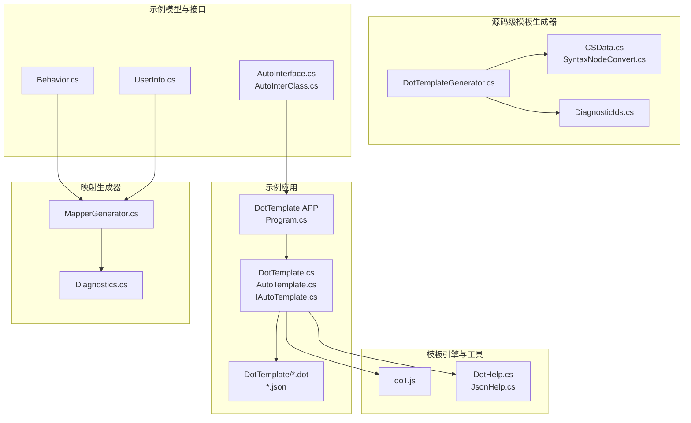
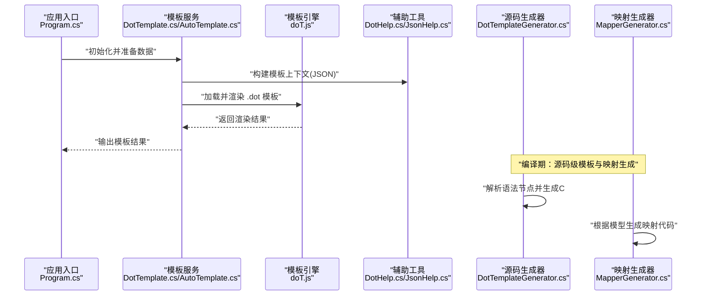
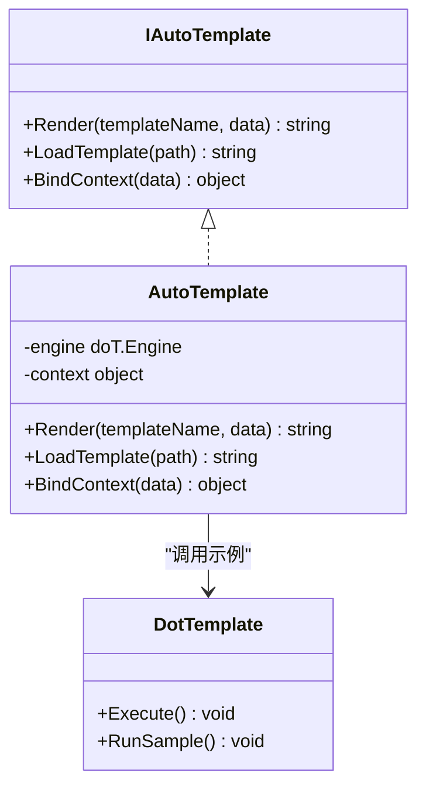
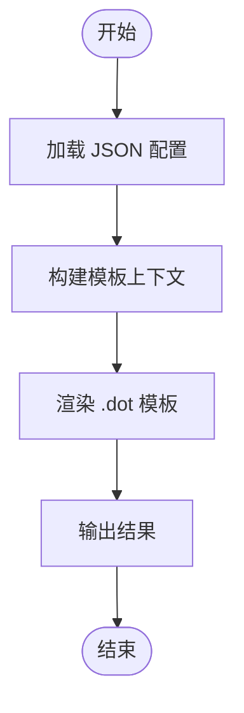
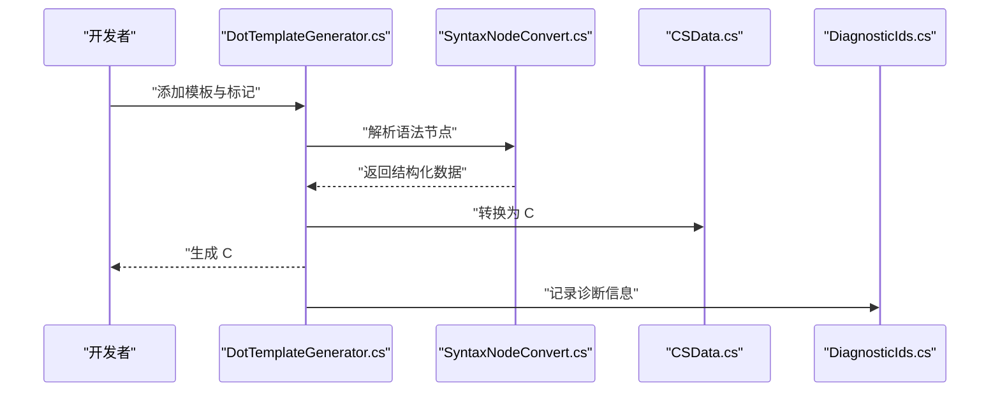
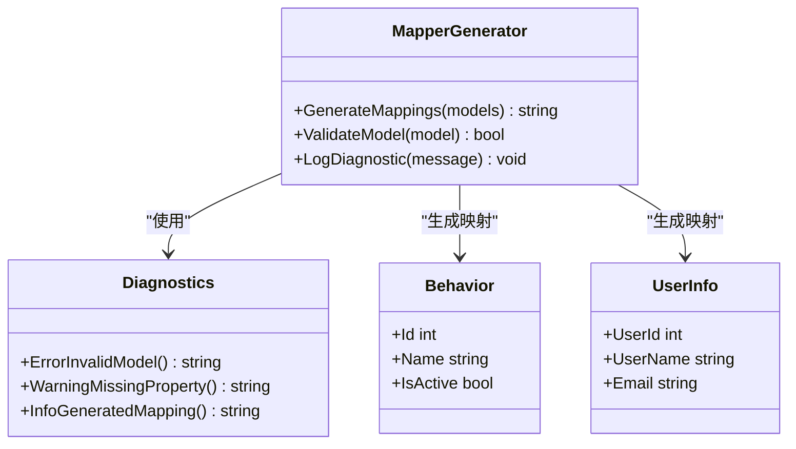
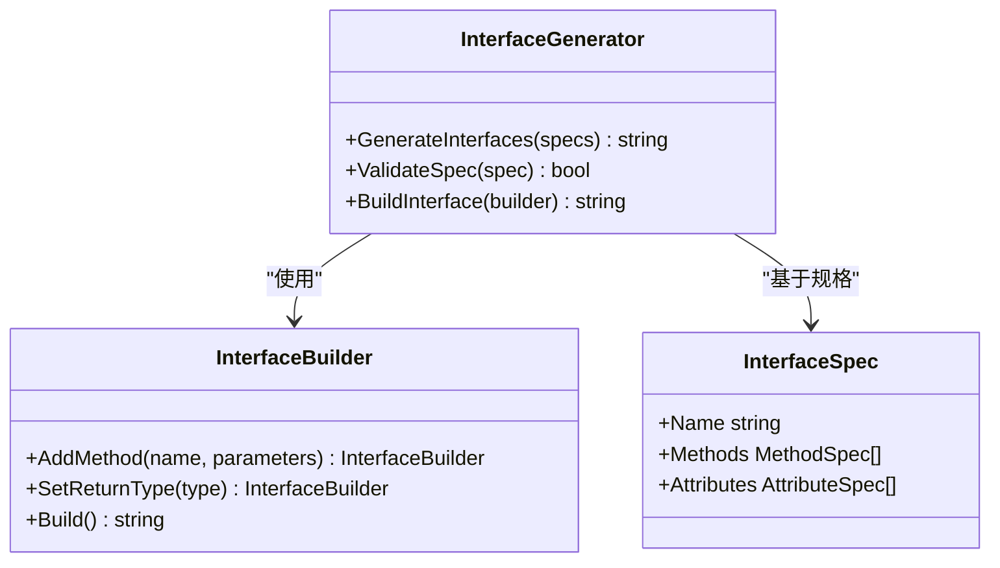
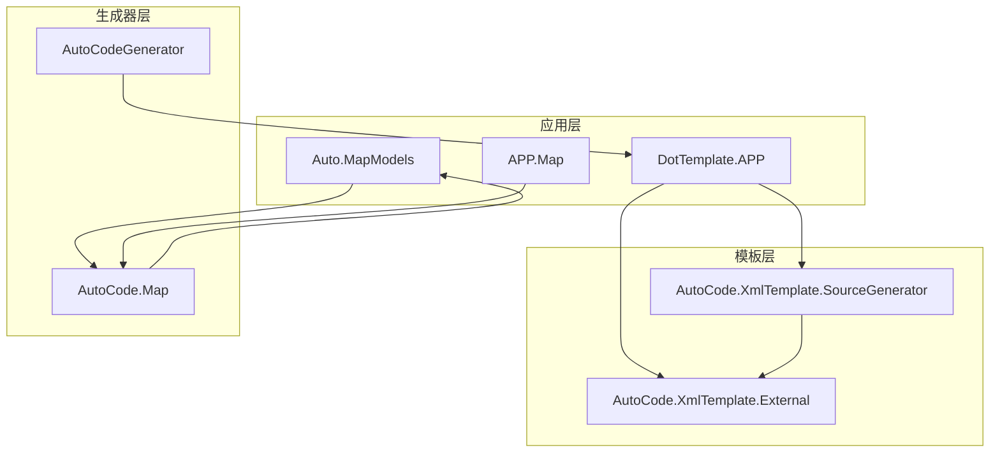

# 模板示例与最佳实践

<cite>
**本文档引用的文件**   
- [README.md](file://README.md)
- [Program.cs](file://src/DotTemplate.APP/Program.cs)
- [DotTemplate.cs](file://src/DotTemplate.APP/DotTemplate.cs)
- [AutoTemplate.cs](file://src/DotTemplate.APP/AutoTemplate.cs)
- [IAutoTemplate.cs](file://src/DotTemplate.APP/IAutoTemplate.cs)
- [Template.dot](file://src/DotTemplate.APP/DotTemplate/Template.dot)
- [ObjectCopy.dot](file://src/DotTemplate.APP/DotTemplate/ObjectCopy.dot)
- [Template_Caller.dot](file://src/DotTemplate.APP/DotTemplate/Template_Caller.dot)
- [DotTemplateS.json](file://src/DotTemplate.APP/DotTemplate/DotTemplateS.json)
- [DotTemplateS3.json](file://src/DotTemplate.APP/DotTemplate/DotTemplateS3.json)
- [DotTemplateS4.json](file://src/DotTemplate.APP/DotTemplate/DotTemplateS4.json)
- [DotTemplateS5.json](file://src/DotTemplate.APP/DotTemplate/DotTemplateS5.json)
- [DotTemplateS8.json](file://src/DotTemplate.APP/DotTemplate/DotTemplateS8.json)
- [DotHelp.cs](file://src/AutoCode.XmlTemplate.External/DotHelp.cs)
- [JsonHelp.cs](file://src/AutoCode.XmlTemplate.External/JsonHelp.cs)
- [doT.js](file://src/AutoCode.XmlTemplate.External/doT.js)
- [DotTemplateGenerator.cs](file://src/AutoCode.XmlTemplate.SourceGenerator/DotTemplateGenerator.cs)
- [CSData.cs](file://src/AutoCode.XmlTemplate.SourceGenerator/CSData.cs)
- [SyntaxNodeConvert.cs](file://src/AutoCode.XmlTemplate.SourceGenerator/SyntaxNodeConvert.cs)
- [DiagnosticIds.cs](file://src/AutoCode.XmlTemplate.SourceGenerator/Extend/DiagnosticIds.cs)
- [MapperGenerator.cs](file://src/AutoCode.Map/MapperGenerator.cs)
- [Diagnostics.cs](file://src/AutoCode.Map/Diagnostics/DiagnosticDescriptors.cs)
- [Behavior.cs](file://src/Auto.MapModels/Behavior.cs)
- [UserInfo.cs](file://src/APP.Map/UserInfo.cs)
- [InterfaceGenerator.cs](file://src/AutoCodeGenerator/InterfaceAutoBuilder/InterfaceGenerator.cs)
- [InterfaceBuilder.cs](file://src/AutoCodeGenerator/InterfaceAutoBuilder/InterfaceBuilder.cs)
- [InterfaceSpec.cs](file://src/AutoCodeGenerator/InterfaceAutoBuilder/InterfaceSpec.cs)
- [AutoInterface.cs](file://src/APP/AutoInterface.cs)
- [AutoInterClass.cs](file://src/APP/AutoInterClass.cs)
- [AutoMapGenerator.cs](file://src/AutoCode.MapDebug/AutoMapGenerator.cs)
- [GenerateMapping.cs](file://src/AutoCode.MapDebug/GenerateMapping.cs)
</cite>

## 目录
1. [简介](#简介)
2. [项目结构](#项目结构)
3. [核心组件](#核心组件)
4. [架构总览](#架构总览)
5. [详细组件分析](#详细组件分析)
6. [依赖关系分析](#依赖关系分析)
7. [性能考虑](#性能考虑)
8. [故障排查指南](#故障排查指南)
9. [结论](#结论)
10. [附录](#附录)

## 简介
本指南围绕 AutoCode 的模板能力，提供从简单文本替换到复杂代码生成的完整实战示例与最佳实践。内容涵盖：
- 常见应用场景：代码生成、配置文件创建、文档生成、数据转换
- 模板复用与模块化设计技巧
- 性能优化策略与调试排错方法
- 基于 doT 引擎的模板执行流程与 Source Generator 集成方式

## 项目结构
AutoCode 将模板运行时、Source Generator、映射生成器与示例应用分层组织：
- DotTemplate.APP：演示模板加载、渲染与调用入口
- AutoCode.XmlTemplate.External：外部模板库（doT.js）与 JSON/辅助工具
- AutoCode.XmlTemplate.SourceGenerator：基于 doT 的源码级模板生成器
- AutoCode.Map：属性映射生成器与诊断信息
- APP / APP.Map：接口与映射模型示例
- AutoCode.MapDebug：映射生成调试工具

图表来源
- [Program.cs](file://src/DotTemplate.APP/Program.cs)
- [DotTemplate.cs](file://src/DotTemplate.APP/DotTemplate.cs)
- [AutoTemplate.cs](file://src/DotTemplate.APP/AutoTemplate.cs)
- [IAutoTemplate.cs](file://src/DotTemplate.APP/IAutoTemplate.cs)
- [Template.dot](file://src/DotTemplate.APP/DotTemplate/Template.dot)
- [ObjectCopy.dot](file://src/DotTemplate.APP/DotTemplate/ObjectCopy.dot)
- [Template_Caller.dot](file://src/DotTemplate.APP/DotTemplate/Template_Caller.dot)
- [DotTemplateS.json](file://src/DotTemplate.APP/DotTemplate/DotTemplateS.json)
- [DotTemplateS3.json](file://src/DotTemplate.APP/DotTemplate/DotTemplateS3.json)
- [DotTemplateS4.json](file://src/DotTemplate.APP/DotTemplate/DotTemplateS4.json)
- [DotTemplateS5.json](file://src/DotTemplate.APP/DotTemplate/DotTemplateS5.json)
- [DotTemplateS8.json](file://src/DotTemplate.APP/DotTemplate/DotTemplateS8.json)
- [doT.js](file://src/AutoCode.XmlTemplate.External/doT.js)
- [DotHelp.cs](file://src/AutoCode.XmlTemplate.External/DotHelp.cs)
- [JsonHelp.cs](file://src/AutoCode.XmlTemplate.External/JsonHelp.cs)
- [DotTemplateGenerator.cs](file://src/AutoCode.XmlTemplate.SourceGenerator/DotTemplateGenerator.cs)
- [CSData.cs](file://src/AutoCode.XmlTemplate.SourceGenerator/CSData.cs)
- [SyntaxNodeConvert.cs](file://src/AutoCode.XmlTemplate.SourceGenerator/SyntaxNodeConvert.cs)
- [DiagnosticIds.cs](file://src/AutoCode.XmlTemplate.SourceGenerator/Extend/DiagnosticIds.cs)
- [MapperGenerator.cs](file://src/AutoCode.Map/MapperGenerator.cs)
- [Diagnostics.cs](file://src/AutoCode.Map/Diagnostics/DiagnosticDescriptors.cs)
- [Behavior.cs](file://src/Auto.MapModels/Behavior.cs)
- [UserInfo.cs](file://src/APP.Map/UserInfo.cs)
- [AutoInterface.cs](file://src/APP/AutoInterface.cs)
- [AutoInterClass.cs](file://src/APP/AutoInterClass.cs)

章节来源
- [README.md](file://README.md)

## 核心组件
- 模板运行层（DotTemplate.APP）
  - 负责加载 .dot 模板与 JSON 数据，调用 doT 引擎渲染输出
  - 通过 IAutoTemplate 抽象统一模板调用入口，AutoTemplate 实现具体逻辑
- 模板引擎与工具（AutoCode.XmlTemplate.External）
  - doT.js 作为模板引擎核心
  - DotHelp/JsonHelp 提供模板上下文构建、JSON 解析等辅助能力
- 源码级模板生成器（AutoCode.XmlTemplate.SourceGenerator）
  - 在编译期读取模板与语法节点，生成高效 C# 代码
  - CSData/SyntaxNodeConvert 负责数据结构与语法树转换
  - DiagnosticIds 定义诊断 ID，便于错误定位
- 映射生成器（AutoCode.Map）
  - 根据模型类型自动生成映射代码
  - Diagnostics 提供诊断描述，便于问题追踪
- 示例模型与接口（APP / APP.Map）
  - Behavior、UserInfo 等用于演示模板与映射的实际使用

章节来源
- [Program.cs](file://src/DotTemplate.APP/Program.cs)
- [DotTemplate.cs](file://src/DotTemplate.APP/DotTemplate.cs)
- [AutoTemplate.cs](file://src/DotTemplate.APP/AutoTemplate.cs)
- [IAutoTemplate.cs](file://src/DotTemplate.APP/IAutoTemplate.cs)
- [doT.js](file://src/AutoCode.XmlTemplate.External/doT.js)
- [DotHelp.cs](file://src/AutoCode.XmlTemplate.External/DotHelp.cs)
- [JsonHelp.cs](file://src/AutoCode.XmlTemplate.External/JsonHelp.cs)
- [DotTemplateGenerator.cs](file://src/AutoCode.XmlTemplate.SourceGenerator/DotTemplateGenerator.cs)
- [CSData.cs](file://src/AutoCode.XmlTemplate.SourceGenerator/CSData.cs)
- [SyntaxNodeConvert.cs](file://src/AutoCode.XmlTemplate.SourceGenerator/SyntaxNodeConvert.cs)
- [DiagnosticIds.cs](file://src/AutoCode.XmlTemplate.SourceGenerator/Extend/DiagnosticIds.cs)
- [MapperGenerator.cs](file://src/AutoCode.Map/MapperGenerator.cs)
- [Diagnostics.cs](file://src/AutoCode.Map/Diagnostics/DiagnosticDescriptors.cs)
- [Behavior.cs](file://src/Auto.MapModels/Behavior.cs)
- [UserInfo.cs](file://src/APP.Map/UserInfo.cs)

## 架构总览
下图展示从应用入口到模板渲染与源码生成的关键路径：

图表来源
- [Program.cs](file://src/DotTemplate.APP/Program.cs)
- [DotTemplate.cs](file://src/DotTemplate.APP/DotTemplate.cs)
- [AutoTemplate.cs](file://src/DotTemplate.APP/AutoTemplate.cs)
- [doT.js](file://src/AutoCode.XmlTemplate.External/doT.js)
- [DotHelp.cs](file://src/AutoCode.XmlTemplate.External/DotHelp.cs)
- [JsonHelp.cs](file://src/AutoCode.XmlTemplate.External/JsonHelp.cs)
- [DotTemplateGenerator.cs](file://src/AutoCode.XmlTemplate.SourceGenerator/DotTemplateGenerator.cs)
- [MapperGenerator.cs](file://src/AutoCode.Map/MapperGenerator.cs)

## 详细组件分析

### 模板运行层（DotTemplate.APP）
- 职责
  - 提供统一的模板调用入口（IAutoTemplate）
  - 封装模板加载、数据绑定与渲染流程
  - 支持多模板文件（.dot）与配置数据（.json）组合使用
- 关键点
  - 模板文件位于 DotTemplate 目录，包含基础模板、对象拷贝模板与调用者模板
  - 通过 JSON 配置驱动不同场景（如 DotTemplateS*.json）
  - 使用 doT 引擎进行高性能字符串渲染

图表来源
- [IAutoTemplate.cs](file://src/DotTemplate.APP/IAutoTemplate.cs)
- [AutoTemplate.cs](file://src/DotTemplate.APP/AutoTemplate.cs)
- [DotTemplate.cs](file://src/DotTemplate.APP/DotTemplate.cs)

章节来源
- [Program.cs](file://src/DotTemplate.APP/Program.cs)
- [DotTemplate.cs](file://src/DotTemplate.APP/DotTemplate.cs)
- [AutoTemplate.cs](file://src/DotTemplate.APP/AutoTemplate.cs)
- [IAutoTemplate.cs](file://src/DotTemplate.APP/IAutoTemplate.cs)
- [Template.dot](file://src/DotTemplate.APP/DotTemplate/Template.dot)
- [ObjectCopy.dot](file://src/DotTemplate.APP/DotTemplate/ObjectCopy.dot)
- [Template_Caller.dot](file://src/DotTemplate.APP/DotTemplate/Template_Caller.dot)
- [DotTemplateS.json](file://src/DotTemplate.APP/DotTemplate/DotTemplateS.json)
- [DotTemplateS3.json](file://src/DotTemplate.APP/DotTemplate/DotTemplateS3.json)
- [DotTemplateS4.json](file://src/DotTemplate.APP/DotTemplate/DotTemplateS4.json)
- [DotTemplateS5.json](file://src/DotTemplate.APP/DotTemplate/DotTemplateS5.json)
- [DotTemplateS8.json](file://src/DotTemplate.APP/DotTemplate/DotTemplateS8.json)

### 模板引擎与工具（AutoCode.XmlTemplate.External）
- 职责
  - 提供 doT 模板引擎的核心能力
  - 通过 DotHelp/JsonHelp 简化模板上下文构建与 JSON 数据处理
- 关键点
  - doT.js 提供高性能字符串模板渲染
  - DotHelp 封装常用模板操作（如 include、partial、循环、条件）
  - JsonHelp 负责 JSON 序列化/反序列化与路径访问

图表来源
- [doT.js](file://src/AutoCode.XmlTemplate.External/doT.js)
- [DotHelp.cs](file://src/AutoCode.XmlTemplate.External/DotHelp.cs)
- [JsonHelp.cs](file://src/AutoCode.XmlTemplate.External/JsonHelp.cs)

章节来源
- [doT.js](file://src/AutoCode.XmlTemplate.External/doT.js)
- [DotHelp.cs](file://src/AutoCode.XmlTemplate.External/DotHelp.cs)
- [JsonHelp.cs](file://src/AutoCode.XmlTemplate.External/JsonHelp.cs)

### 源码级模板生成器（AutoCode.XmlTemplate.SourceGenerator）
- 职责
  - 在编译期读取模板与语法节点，生成高效 C# 代码
  - 减少运行时开销，提升性能
- 关键点
  - DotTemplateGenerator 负责模板解析与代码生成
  - CSData/SyntaxNodeConvert 处理数据结构与语法树转换
  - DiagnosticIds 定义诊断 ID，便于错误定位与日志记录

图表来源
- [DotTemplateGenerator.cs](file://src/AutoCode.XmlTemplate.SourceGenerator/DotTemplateGenerator.cs)
- [SyntaxNodeConvert.cs](file://src/AutoCode.XmlTemplate.SourceGenerator/SyntaxNodeConvert.cs)
- [CSData.cs](file://src/AutoCode.XmlTemplate.SourceGenerator/CSData.cs)
- [DiagnosticIds.cs](file://src/AutoCode.XmlTemplate.SourceGenerator/Extend/DiagnosticIds.cs)

章节来源
- [DotTemplateGenerator.cs](file://src/AutoCode.XmlTemplate.SourceGenerator/DotTemplateGenerator.cs)
- [CSData.cs](file://src/AutoCode.XmlTemplate.SourceGenerator/CSData.cs)
- [SyntaxNodeConvert.cs](file://src/AutoCode.XmlTemplate.SourceGenerator/SyntaxNodeConvert.cs)
- [DiagnosticIds.cs](file://src/AutoCode.XmlTemplate.SourceGenerator/Extend/DiagnosticIds.cs)

### 映射生成器（AutoCode.Map）
- 职责
  - 根据模型类型自动生成映射代码
  - 提供诊断信息，便于问题追踪
- 关键点
  - MapperGenerator 负责映射逻辑生成
  - Diagnostics 提供详细的诊断描述
  - 与 Behavior、UserInfo 等模型配合使用

图表来源
- [MapperGenerator.cs](file://src/AutoCode.Map/MapperGenerator.cs)
- [Diagnostics.cs](file://src/AutoCode.Map/Diagnostics/DiagnosticDescriptors.cs)
- [Behavior.cs](file://src/Auto.MapModels/Behavior.cs)
- [UserInfo.cs](file://src/APP.Map/UserInfo.cs)

章节来源
- [MapperGenerator.cs](file://src/AutoCode.Map/MapperGenerator.cs)
- [Diagnostics.cs](file://src/AutoCode.Map/Diagnostics/DiagnosticDescriptors.cs)
- [Behavior.cs](file://src/Auto.MapModels/Behavior.cs)
- [UserInfo.cs](file://src/APP.Map/UserInfo.cs)

### 接口生成器（AutoCodeGenerator）
- 职责
  - 根据规范自动生成接口代码
  - 提供接口构建器与规格定义
- 关键点
  - InterfaceGenerator 负责接口生成逻辑
  - InterfaceBuilder 提供接口构建功能
  - InterfaceSpec 定义接口规格

图表来源
- [InterfaceGenerator.cs](file://src/AutoCodeGenerator/InterfaceAutoBuilder/InterfaceGenerator.cs)
- [InterfaceBuilder.cs](file://src/AutoCodeGenerator/InterfaceAutoBuilder/InterfaceBuilder.cs)
- [InterfaceSpec.cs](file://src/AutoCodeGenerator/InterfaceAutoBuilder/InterfaceSpec.cs)

章节来源
- [InterfaceGenerator.cs](file://src/AutoCodeGenerator/InterfaceAutoBuilder/InterfaceGenerator.cs)
- [InterfaceBuilder.cs](file://src/AutoCodeGenerator/InterfaceAutoBuilder/InterfaceBuilder.cs)
- [InterfaceSpec.cs](file://src/AutoCodeGenerator/InterfaceAutoBuilder/InterfaceSpec.cs)
- [AutoInterface.cs](file://src/APP/AutoInterface.cs)
- [AutoInterClass.cs](file://src/APP/AutoInterClass.cs)

### 映射调试工具（AutoCode.MapDebug）
- 职责
  - 提供映射生成的调试功能
  - 帮助开发者验证映射逻辑
- 关键点
  - AutoMapGenerator 负责调试模式下的映射生成
  - GenerateMapping 提供映射生成入口

章节来源
- [AutoMapGenerator.cs](file://src/AutoCode.MapDebug/AutoMapGenerator.cs)
- [GenerateMapping.cs](file://src/AutoCode.MapDebug/GenerateMapping.cs)

## 依赖关系分析
AutoCode 各组件之间的依赖关系如下：

图表来源
- [Program.cs](file://src/DotTemplate.APP/Program.cs)
- [doT.js](file://src/AutoCode.XmlTemplate.External/doT.js)
- [DotTemplateGenerator.cs](file://src/AutoCode.XmlTemplate.SourceGenerator/DotTemplateGenerator.cs)
- [MapperGenerator.cs](file://src/AutoCode.Map/MapperGenerator.cs)
- [InterfaceGenerator.cs](file://src/AutoCodeGenerator/InterfaceAutoBuilder/InterfaceGenerator.cs)
- [Behavior.cs](file://src/Auto.MapModels/Behavior.cs)
- [UserInfo.cs](file://src/APP.Map/UserInfo.cs)

章节来源
- [Program.cs](file://src/DotTemplate.APP/Program.cs)
- [doT.js](file://src/AutoCode.XmlTemplate.External/doT.js)
- [DotTemplateGenerator.cs](file://src/AutoCode.XmlTemplate.SourceGenerator/DotTemplateGenerator.cs)
- [MapperGenerator.cs](file://src/AutoCode.Map/MapperGenerator.cs)
- [InterfaceGenerator.cs](file://src/AutoCodeGenerator/InterfaceAutoBuilder/InterfaceGenerator.cs)
- [Behavior.cs](file://src/Auto.MapModels/Behavior.cs)
- [UserInfo.cs](file://src/APP.Map/UserInfo.cs)

## 性能考虑
- 使用源码级模板生成器（DotTemplateGenerator）替代运行时模板渲染，减少启动时间和内存占用
- 缓存模板编译结果，避免重复编译开销
- 批量处理模板渲染，减少 I/O 操作
- 使用增量值提供器（IncrementalValuesProviderExtensions）优化大数据集处理
- 合理设计模板结构，避免复杂的嵌套和条件判断

## 故障排查指南
- 模板语法错误
  - 检查 .dot 文件的语法是否正确
  - 使用调试工具验证模板渲染结果
- JSON 数据格式错误
  - 验证 JSON 文件格式和数据完整性
  - 使用 JsonHelp 提供的验证功能
- 映射生成失败
  - 检查模型属性的可见性和类型兼容性
  - 查看 Diagnostics 中的错误信息
- 源码生成器问题
  - 检查 DiagnosticIds 定义的诊断信息
  - 验证语法节点转换的正确性

章节来源
- [Diagnostics.cs](file://src/AutoCode.Map/Diagnostics/DiagnosticDescriptors.cs)
- [DiagnosticIds.cs](file://src/AutoCode.XmlTemplate.SourceGenerator/Extend/DiagnosticIds.cs)
- [JsonHelp.cs](file://src/AutoCode.XmlTemplate.External/JsonHelp.cs)

## 结论
AutoCode 提供了完整的模板解决方案，从简单的文本替换到复杂的代码生成都能胜任。通过合理的架构设计和最佳实践，可以显著提升开发效率和代码质量。建议在实际项目中：
- 优先使用源码级模板生成器以获得更好的性能
- 建立标准化的模板库和复用机制
- 完善错误处理和日志记录
- 持续优化模板结构和渲染逻辑

## 附录
- 模板文件命名规范
- JSON 配置格式说明
- 常用模板函数参考
- 性能调优 checklist
- 常见问题解决方案
