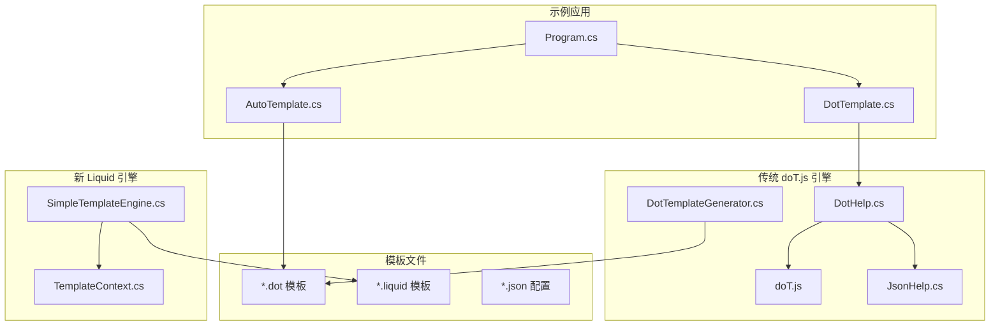
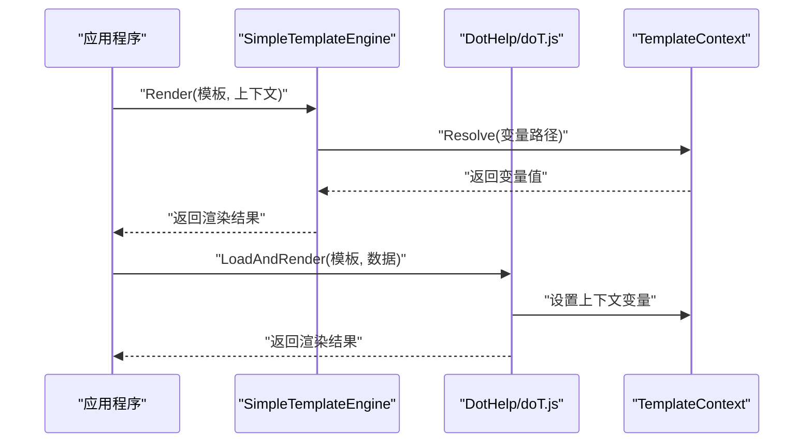
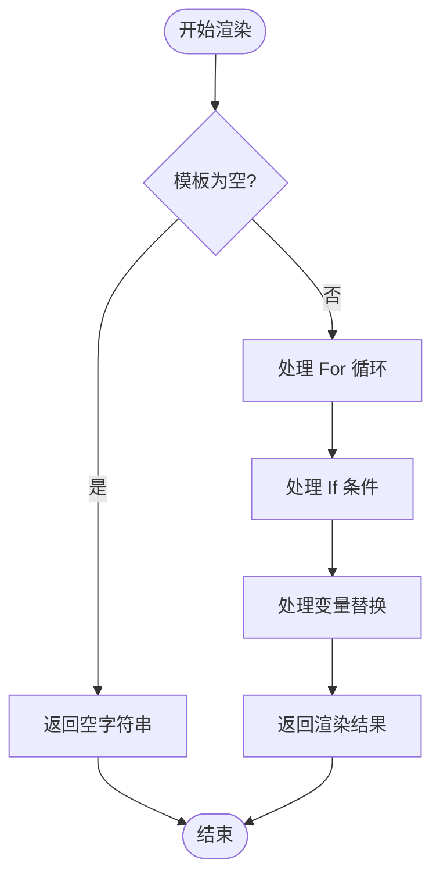
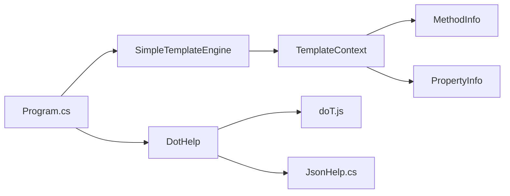

# 模板系统

<cite>
**本文引用的文件**   
- [SimpleTemplateEngine.cs](file://src/AutoCode.Engine\Template\SimpleTemplateEngine.cs)
- [TemplateContext.cs](file://src/AutoCode.Engine\Template\TemplateContext.cs)
- [AuditService.liquid](file://templates\AuditService.liquid)
- [Repository.liquid](file://templates\Repository.liquid)
- [doT.js](file://src/AutoCode.XmlTemplate.External/doT.js)
- [DotHelp.cs](file://src/AutoCode.XmlTemplate.External/DotHelp.cs)
- [JsonHelp.cs](file://src/AutoCode.XmlTemplate.External/JsonHelp.cs)
- [DotTemplateGenerator.cs](file://src/AutoCode.XmlTemplate.SourceGenerator/DotTemplateGenerator.cs)
- [CSData.cs](file://src/AutoCode.XmlTemplate.SourceGenerator/CSData.cs)
- [SyntaxNodeConvert.cs](file://src/AutoCode.XmlTemplate.SourceGenerator/SyntaxNodeConvert.cs)
- [AutoTemplate.cs](file://src/DotTemplate.APP/AutoTemplate.cs)
- [DotTemplate.cs](file://src/DotTemplate.APP/DotTemplate.cs)
- [IAutoTemplate.cs](file://src/DotTemplate.APP/IAutoTemplate.cs)
- [Program.cs](file://src/DotTemplate.APP/Program.cs)
- [ObjectCopy.dot](file://src/DotTemplate.APP/DotTemplate/ObjectCopy.dot)
- [Template.dot](file://src/DotTemplate.APP/DotTemplate/Template.dot)
- [Template_Caller.dot](file://src/DotTemplate.APP/DotTemplate/Template_Caller.dot)
- [DotTemplateS.json](file://src/DotTemplate.APP/DotTemplate/DotTemplateS.json)
- [DotTemplateS3.json](file://src/DotTemplate.APP/DotTemplate/DotTemplateS3.json)
- [DotTemplateS4.json](file://src/DotTemplate.APP/DotTemplate/DotTemplateS4.json)
- [DotTemplateS5.json](file://src/DotTemplate.APP/DotTemplate/DotTemplateS5.json)
- [DotTemplateS8.json](file://src/DotTemplate.APP/DotTemplate/DotTemplateS8.json)
</cite>

## 更新摘要
**所做更改**   
- 新增 Liquid 语法支持，实现 SimpleTemplateEngine 轻量级模板引擎
- 添加 TemplateContext 上下文管理，支持变量、集合和条件逻辑
- 提供 .liquid 模板文件示例（AuditService.liquid、Repository.liquid）
- 保持与现有 doT.js 模板系统的兼容性
- 零外部依赖的纯 C# 实现，提升性能和可维护性

## 目录
1. [简介](#简介)
2. [项目结构](#项目结构)
3. [核心组件](#核心组件)
4. [架构总览](#架构总览)
5. [详细组件分析](#详细组件分析)
6. [Liquid 模板语法](#liquid-模板语法)
7. [依赖关系分析](#依赖关系分析)
8. [性能考虑](#性能考虑)
9. [故障排查指南](#故障排查指南)
10. [结论](#结论)
11. [附录](#附录)

## 简介
AutoCode 模板系统现已支持双模板引擎架构：原有的 doT.js 模板引擎和新实现的 Liquid 语法支持。SimpleTemplateEngine 提供了轻量级的 Liquid 模板渲染能力，包含变量替换、循环、条件逻辑等功能，且无需外部依赖。文档同时涵盖两种模板引擎的使用方式、语法差异和迁移指南。

**更新** 本次更新新增了 Liquid 语法支持和 SimpleTemplateEngine 实现，为开发者提供更灵活的模板选择。

## 项目结构
AutoCode 的模板系统现在由"传统 doT.js 引擎 + 新 Liquid 引擎 + 共享上下文"三部分构成：
- 传统引擎：封装 doT.js 的加载与执行能力，提供 JSON 配置解析与辅助方法。
- Liquid 引擎：SimpleTemplateEngine 实现零依赖的 Liquid 语法支持。
- 共享上下文：TemplateContext 统一管理模板渲染时的变量和集合。



**图表来源**
- [SimpleTemplateEngine.cs](file://src/AutoCode.Engine\Template\SimpleTemplateEngine.cs)
- [TemplateContext.cs](file://src/AutoCode.Engine\Template\TemplateContext.cs)
- [doT.js](file://src/AutoCode.XmlTemplate.External/doT.js)
- [DotHelp.cs](file://src/AutoCode.XmlTemplate.External/DotHelp.cs)
- [JsonHelp.cs](file://src/AutoCode.XmlTemplate.External/JsonHelp.cs)
- [DotTemplateGenerator.cs](file://src/AutoCode.XmlTemplate.SourceGenerator/DotTemplateGenerator.cs)
- [Program.cs](file://src/DotTemplate.APP/Program.cs)
- [AutoTemplate.cs](file://src/DotTemplate.APP/AutoTemplate.cs)
- [DotTemplate.cs](file://src/DotTemplate.APP/DotTemplate.cs)

**章节来源**
- [SimpleTemplateEngine.cs](file://src/AutoCode.Engine\Template\SimpleTemplateEngine.cs)
- [TemplateContext.cs](file://src/AutoCode.Engine\Template\TemplateContext.cs)
- [AuditService.liquid](file://templates\AuditService.liquid)
- [Repository.liquid](file://templates\Repository.liquid)

## 核心组件
- **SimpleTemplateEngine**：轻量级 Liquid 模板渲染引擎，支持变量替换、循环、条件逻辑，零外部依赖。
- **TemplateContext**：模板上下文管理器，存储变量、集合和方法/属性信息，支持从 Roslyn 语法树构建。
- **doT.js 运行时**：原有模板引擎，通过 DotHelp 封装，提供动态编译和渲染能力。
- **源生成器**：DotTemplateGenerator 在编译期将 .dot 模板转换为 C# 代码，提升性能。
- **Liquid 模板文件**：.liquid 后缀的模板文件，使用 Liquid 语法编写。

**更新** 新增 SimpleTemplateEngine 和 TemplateContext 组件，提供 Liquid 语法支持。

**章节来源**
- [SimpleTemplateEngine.cs](file://src/AutoCode.Engine\Template\SimpleTemplateEngine.cs)
- [TemplateContext.cs](file://src/AutoCode.Engine\Template\TemplateContext.cs)
- [doT.js](file://src/AutoCode.XmlTemplate.External/doT.js)
- [DotHelp.cs](file://src/AutoCode.XmlTemplate.External/DotHelp.cs)
- [JsonHelp.cs](file://src/AutoCode.XmlTemplate.External/JsonHelp.cs)
- [DotTemplateGenerator.cs](file://src/AutoCode.XmlTemplate.SourceGenerator/DotTemplateGenerator.cs)

## 架构总览
AutoCode 模板系统采用"双引擎并行"策略：
- **Liquid 引擎**：SimpleTemplateEngine 直接处理 .liquid 模板，无外部依赖，适合轻量级场景。
- **doT.js 引擎**：DotHelp 加载 doT.js 进行动态模板编译，适合复杂模板和热更新场景。
- **统一上下文**：TemplateContext 为两种引擎提供一致的变量访问接口。



**图表来源**
- [SimpleTemplateEngine.cs](file://src/AutoCode.Engine\Template\SimpleTemplateEngine.cs)
- [TemplateContext.cs](file://src/AutoCode.Engine\Template\TemplateContext.cs)
- [DotHelp.cs](file://src/AutoCode.XmlTemplate.External/DotHelp.cs)

## 详细组件分析

### SimpleTemplateEngine 轻量级模板引擎
- **设计目标**：零外部依赖，支持 Liquid 语法子集，高性能渲染。
- **核心功能**：
  - 变量替换：`{{ variable }}` 语法，支持对象属性访问。
  - 循环控制：`...` 语法。
  - 条件逻辑：`......` 语法。
  - 内置变量：`forloop.index`、`forloop.first`、`forloop.last` 等循环元数据。
- **处理流程**：按顺序处理循环、条件、变量替换，确保正确的嵌套和优先级。



**图表来源**
- [SimpleTemplateEngine.cs](file://src/AutoCode.Engine\Template\SimpleTemplateEngine.cs)

**章节来源**
- [SimpleTemplateEngine.cs](file://src/AutoCode.Engine\Template\SimpleTemplateEngine.cs)

### TemplateContext 上下文管理
- **变量存储**：支持标量变量和集合变量的统一管理。
- **路径解析**：支持 `ClassName`、`Namespace.Property` 等路径访问。
- **快速构建**：FromClassInfo 方法从 Roslyn 语法树提取类信息并构建上下文。
- **类型安全**：强类型的 MethodInfo 和 PropertyInfo 数据结构。

**章节来源**
- [TemplateContext.cs](file://src/AutoCode.Engine\Template\TemplateContext.cs)

### Liquid 模板文件示例
- **AuditService.liquid**：审计日志服务模板，演示循环遍历方法和条件判断。
- **Repository.liquid**：仓储模式模板，展示 CRUD 操作和属性遍历。
- **语法特性**：支持命名空间、类定义、方法签名、异常处理等 C# 代码生成。

**章节来源**
- [AuditService.liquid](file://templates\AuditService.liquid)
- [Repository.liquid](file://templates\Repository.liquid)

### 传统 doT.js 模板引擎
- **集成方式**：通过 DotHelp 在 C# 中加载 doT.js，使用其 API 编译模板字符串。
- **关键职责**：模板缓存、上下文管理、错误处理、扩展点注入。
- **优势**：成熟的生态系统，丰富的插件和过滤器支持。

**章节来源**
- [doT.js](file://src/AutoCode.XmlTemplate.External/doT.js)
- [DotHelp.cs](file://src/AutoCode.XmlTemplate.External/DotHelp.cs)
- [JsonHelp.cs](file://src/AutoCode.XmlTemplate.External/JsonHelp.cs)

## Liquid 模板语法
SimpleTemplateEngine 支持的 Liquid 语法子集：

### 变量替换
- 基本变量：`{{ variableName }}`
- 对象属性：`{{ object.property }}`
- 循环变量：`{{ item.Name }}`、`{{ forloop.index }}`

### 循环控制
```liquid

    {{ item.Name }} - {{ item.Type }}

```

### 条件逻辑
```liquid

    void {{ method.Name }}()

    {{ method.ReturnType }} {{ method.Name }}()

```

### 内置循环变量
- `forloop.index`：当前迭代索引（从 1 开始）
- `forloop.index0`：当前迭代索引（从 0 开始）
- `forloop.first`：是否为第一个元素
- `forloop.last`：是否为最后一个元素

**更新** 新增 Liquid 语法支持，提供与传统 doT.js 模板不同的语法体验。

## 依赖关系分析
- **Liquid 引擎**：SimpleTemplateEngine 仅依赖 System.Text.RegularExpressions，零外部依赖。
- **doT.js 引擎**：DotHelp 依赖 doT.js 和 JsonHelp，需要 JavaScript 运行时。
- **上下文共享**：TemplateContext 被两个引擎共同使用，提供统一的变量访问接口。
- **模板文件**：.liquid 和 .dot 文件分别由对应引擎处理。



**图表来源**
- [SimpleTemplateEngine.cs](file://src/AutoCode.Engine\Template\SimpleTemplateEngine.cs)
- [TemplateContext.cs](file://src/AutoCode.Engine\Template\TemplateContext.cs)
- [DotHelp.cs](file://src/AutoCode.XmlTemplate.External/DotHelp.cs)
- [JsonHelp.cs](file://src/AutoCode.XmlTemplate.External/JsonHelp.cs)

**章节来源**
- [SimpleTemplateEngine.cs](file://src/AutoCode.Engine\Template\SimpleTemplateEngine.cs)
- [TemplateContext.cs](file://src/AutoCode.Engine\Template\TemplateContext.cs)
- [DotHelp.cs](file://src/AutoCode.XmlTemplate.External/DotHelp.cs)
- [JsonHelp.cs](file://src/AutoCode.XmlTemplate.External/JsonHelp.cs)

## 性能考虑
- **Liquid 引擎优势**：零外部依赖，无 JavaScript 运行时开销，内存占用更低。
- **doT.js 引擎优势**：成熟的模板缓存机制，支持复杂的模板继承和包含。
- **选择建议**：简单模板优先使用 Liquid，复杂模板使用 doT.js。
- **优化策略**：启用模板缓存、减少上下文切换、批量渲染调用。

## 故障排查指南
- **Liquid 语法错误**：检查 `` 和 `{{ }}` 语法是否正确，确认变量名匹配。
- **循环不工作**：验证集合名称是否正确，确保集合不为空。
- **条件判断失败**：检查布尔值转换，确认条件表达式语法。
- **性能问题**：对比两种引擎的性能表现，选择合适的模板引擎。
- **调试技巧**：输出中间渲染结果，检查上下文变量状态。

**更新** 新增 Liquid 模板相关的故障排查指南。

## 结论
AutoCode 模板系统通过提供 Liquid 和 doT.js 双引擎支持，满足了不同场景的需求。SimpleTemplateEngine 的零依赖特性和 Liquid 语法的简洁性，为轻量级模板生成提供了优秀选择。开发者可以根据项目需求选择合适的模板引擎，或混合使用以获得最佳效果。

**更新** 本次更新新增的 Liquid 语法支持进一步丰富了 AutoCode 的模板生态，提升了系统的灵活性和可扩展性。

## 附录
- **模板开发示例**：
  - Liquid 语法：变量插值、循环控制、条件判断、函数调用。
  - doT.js 语法：传统模板语法，支持更复杂的逻辑和插件。
  - using 语句：正确使用 C# using 语句，确保命名空间导入正确。
- **最佳实践**：
  - 模板模块化：拆分为小片段，便于复用与维护。
  - 配置外置：将可变参数放入 JSON，便于环境隔离。
  - 测试覆盖：为模板编写单元测试，确保稳定性。
  - 语法验证：确保模板生成的 C# 代码符合语言规范。
  - 引擎选择：根据复杂度选择合适的模板引擎。

**更新** 附录部分新增 Liquid 语法的使用示例和最佳实践。