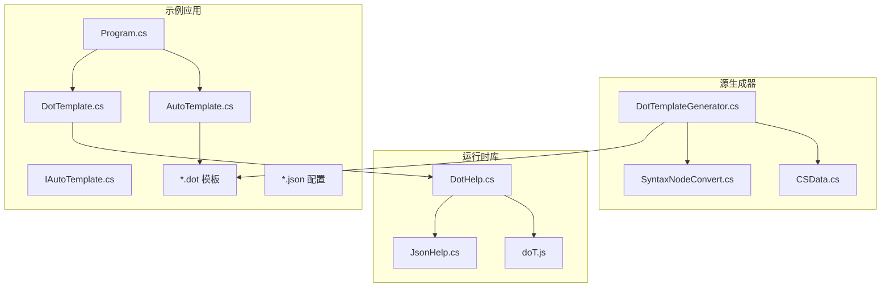
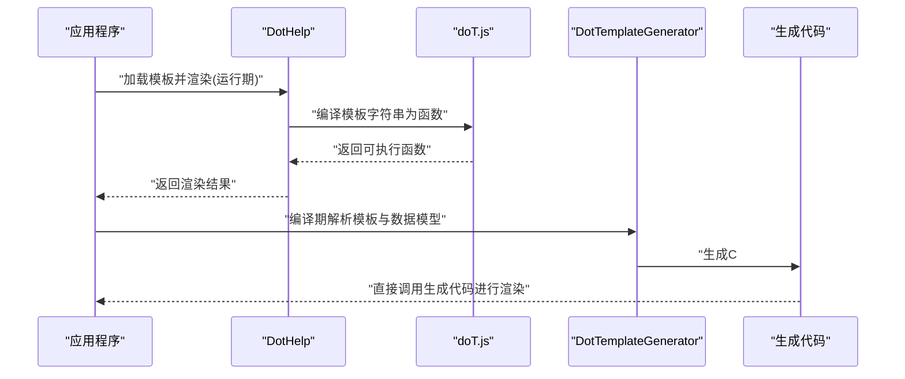
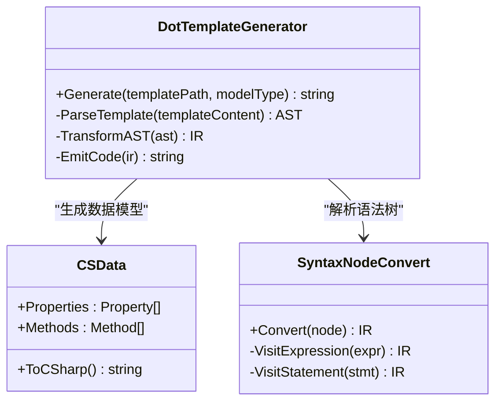
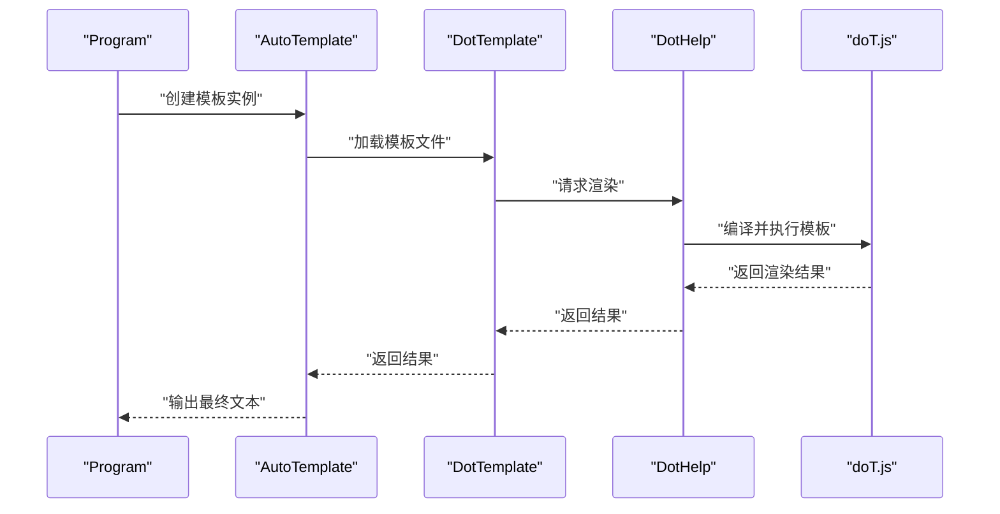
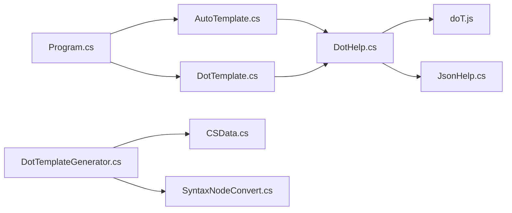

# 模板系统

<cite>
**本文引用的文件**   
- [doT.js](file://src/AutoCode.XmlTemplate.External/doT.js)
- [DotHelp.cs](file://src/AutoCode.XmlTemplate.External/DotHelp.cs)
- [JsonHelp.cs](file://src/AutoCode.XmlTemplate.External/JsonHelp.cs)
- [DotTemplateGenerator.cs](file://src/AutoCode.XmlTemplate.SourceGenerator/DotTemplateGenerator.cs)
- [CSData.cs](file://src/AutoCode.XmlTemplate.SourceGenerator/CSData.cs)
- [SyntaxNodeConvert.cs](file://src/AutoCode.XmlTemplate.SourceGenerator/SyntaxNodeConvert.cs)
- [AutoTemplate.cs](file://src/DotTemplate.APP/AutoTemplate.cs)
- [DotTemplate.cs](file://src/DotTemplate.APP/DotTemplate.cs)
- [IAutoTemplate.cs](file://src/DotTemplate.APP/IAutoTemplate.cs)
- [Program.cs](file://src/DotTemplate.APP/Program.cs)
- [ObjectCopy.dot](file://src/DotTemplate.APP/DotTemplate/ObjectCopy.dot)
- [Template.dot](file://src/DotTemplate.APP/DotTemplate/Template.dot)
- [Template_Caller.dot](file://src/DotTemplate.APP/DotTemplate/Template_Caller.dot)
- [DotTemplateS.json](file://src/DotTemplate.APP/DotTemplate/DotTemplateS.json)
- [DotTemplateS3.json](file://src/DotTemplate.APP/DotTemplate/DotTemplateS3.json)
- [DotTemplateS4.json](file://src/DotTemplate.APP/DotTemplate/DotTemplateS4.json)
- [DotTemplateS5.json](file://src/DotTemplate.APP/DotTemplate/DotTemplateS5.json)
- [DotTemplateS8.json](file://src/DotTemplate.APP/DotTemplate/DotTemplateS8.json)
</cite>

## 目录
1. [简介](#简介)
2. [项目结构](#项目结构)
3. [核心组件](#核心组件)
4. [架构总览](#架构总览)
5. [详细组件分析](#详细组件分析)
6. [依赖关系分析](#依赖关系分析)
7. [性能考虑](#性能考虑)
8. [故障排查指南](#故障排查指南)
9. [结论](#结论)
10. [附录](#附录)

## 简介
本文件系统性介绍 AutoCode 的模板引擎体系，重点围绕 doT.js 模板引擎在 C# 环境中的集成方式、模板语法与扩展机制、JSON 配置驱动、以及从源码到代码生成的完整渲染流程。文档同时提供自定义模板开发示例（变量插值、循环控制、条件判断、函数调用）、调试技巧、性能优化建议与最佳实践，帮助读者快速上手并高效产出高质量模板。

## 项目结构
AutoCode 的模板系统由“运行时库 + 源生成器 + 示例应用”三部分构成：
- 运行时库：封装 doT.js 的加载与执行能力，并提供 JSON 配置解析与辅助方法。
- 源生成器：在编译期将 .dot 模板与数据模型转换为可直接调用的 C# 代码，提升运行期性能。
- 示例应用：演示如何定义模板、配置数据、调用模板并输出结果。

图表来源
- [doT.js](file://src/AutoCode.XmlTemplate.External/doT.js)
- [DotHelp.cs](file://src/AutoCode.XmlTemplate.External/DotHelp.cs)
- [JsonHelp.cs](file://src/AutoCode.XmlTemplate.External/JsonHelp.cs)
- [DotTemplateGenerator.cs](file://src/AutoCode.XmlTemplate.SourceGenerator/DotTemplateGenerator.cs)
- [CSData.cs](file://src/AutoCode.XmlTemplate.SourceGenerator/CSData.cs)
- [SyntaxNodeConvert.cs](file://src/AutoCode.XmlTemplate.SourceGenerator/SyntaxNodeConvert.cs)
- [Program.cs](file://src/DotTemplate.APP/Program.cs)
- [AutoTemplate.cs](file://src/DotTemplate.APP/AutoTemplate.cs)
- [DotTemplate.cs](file://src/DotTemplate.APP/DotTemplate.cs)
- [IAutoTemplate.cs](file://src/DotTemplate.APP/IAutoTemplate.cs)
- [ObjectCopy.dot](file://src/DotTemplate.APP/DotTemplate/ObjectCopy.dot)
- [Template.dot](file://src/DotTemplate.APP/DotTemplate/Template.dot)
- [Template_Caller.dot](file://src/DotTemplate.APP/DotTemplate/Template_Caller.dot)
- [DotTemplateS.json](file://src/DotTemplate.APP/DotTemplate/DotTemplateS.json)
- [DotTemplateS3.json](file://src/DotTemplate.APP/DotTemplate/DotTemplateS3.json)
- [DotTemplateS4.json](file://src/DotTemplate.APP/DotTemplate/DotTemplateS4.json)
- [DotTemplateS5.json](file://src/DotTemplate.APP/DotTemplate/DotTemplateS5.json)
- [DotTemplateS8.json](file://src/DotTemplate.APP/DotTemplate/DotTemplateS8.json)

章节来源
- [Program.cs](file://src/DotTemplate.APP/Program.cs)
- [AutoTemplate.cs](file://src/DotTemplate.APP/AutoTemplate.cs)
- [DotTemplate.cs](file://src/DotTemplate.APP/DotTemplate.cs)
- [IAutoTemplate.cs](file://src/DotTemplate.APP/IAutoTemplate.cs)
- [doT.js](file://src/AutoCode.XmlTemplate.External/doT.js)
- [DotHelp.cs](file://src/AutoCode.XmlTemplate.External/DotHelp.cs)
- [JsonHelp.cs](file://src/AutoCode.XmlTemplate.External/JsonHelp.cs)
- [DotTemplateGenerator.cs](file://src/AutoCode.XmlTemplate.SourceGenerator/DotTemplateGenerator.cs)
- [CSData.cs](file://src/AutoCode.XmlTemplate.SourceGenerator/CSData.cs)
- [SyntaxNodeConvert.cs](file://src/AutoCode.XmlTemplate.SourceGenerator/SyntaxNodeConvert.cs)

## 核心组件
- doT.js 运行时：提供模板编译与渲染能力，支持变量插值、循环、条件、包含等常用语法。
- DotHelp：C# 侧对 doT.js 的封装，负责加载模板、设置上下文、执行渲染、错误处理。
- JsonHelp：提供 JSON 读取与反序列化工具，用于加载模板配置或输入数据。
- 源生成器（DotTemplateGenerator）：在编译期解析 .dot 模板与数据模型，生成高性能 C# 渲染代码，减少运行期开销。
- 示例应用（AutoTemplate/DotTemplate/Program）：展示模板定义、配置加载、数据绑定与渲染调用。

章节来源
- [doT.js](file://src/AutoCode.XmlTemplate.External/doT.js)
- [DotHelp.cs](file://src/AutoCode.XmlTemplate.External/DotHelp.cs)
- [JsonHelp.cs](file://src/AutoCode.XmlTemplate.External/JsonHelp.cs)
- [DotTemplateGenerator.cs](file://src/AutoCode.XmlTemplate.SourceGenerator/DotTemplateGenerator.cs)
- [CSData.cs](file://src/AutoCode.XmlTemplate.SourceGenerator/CSData.cs)
- [SyntaxNodeConvert.cs](file://src/AutoCode.XmlTemplate.SourceGenerator/SyntaxNodeConvert.cs)
- [AutoTemplate.cs](file://src/DotTemplate.APP/AutoTemplate.cs)
- [DotTemplate.cs](file://src/DotTemplate.APP/DotTemplate.cs)
- [Program.cs](file://src/DotTemplate.APP/Program.cs)

## 架构总览
AutoCode 模板系统采用“双通道渲染”策略：
- 运行期渲染：通过 DotHelp 加载 doT.js 模板，动态编译并渲染，适合灵活场景与热更新。
- 编译期生成：通过 DotTemplateGenerator 将模板与数据模型转换为 C# 代码，避免运行期 JS 引擎开销，适合高吞吐场景。

图表来源
- [DotHelp.cs](file://src/AutoCode.XmlTemplate.External/DotHelp.cs)
- [doT.js](file://src/AutoCode.XmlTemplate.External/doT.js)
- [DotTemplateGenerator.cs](file://src/AutoCode.XmlTemplate.SourceGenerator/DotTemplateGenerator.cs)
- [CSData.cs](file://src/AutoCode.XmlTemplate.SourceGenerator/CSData.cs)
- [SyntaxNodeConvert.cs](file://src/AutoCode.XmlTemplate.SourceGenerator/SyntaxNodeConvert.cs)

## 详细组件分析

### doT.js 模板引擎集成
- 集成方式：通过 DotHelp 在 C# 中加载 doT.js，使用其 API 编译模板字符串为可执行函数，再传入上下文对象进行渲染。
- 关键职责：
  - 模板缓存：避免重复编译相同模板。
  - 上下文管理：将 C# 对象映射为 doT.js 可用的数据视图。
  - 错误处理：捕获并包装模板编译与渲染异常。
- 扩展点：可在 DotHelp 中注入自定义函数或过滤器，供模板调用。

图表来源
- [doT.js](file://src/AutoCode.XmlTemplate.External/doT.js)
- [DotHelp.cs](file://src/AutoCode.XmlTemplate.External/DotHelp.cs)

章节来源
- [doT.js](file://src/AutoCode.XmlTemplate.External/doT.js)
- [DotHelp.cs](file://src/AutoCode.XmlTemplate.External/DotHelp.cs)

### 模板语法与内置函数
- 变量插值：在模板中使用占位符引用上下文属性。
- 循环控制：遍历数组或对象集合，支持索引与条件过滤。
- 条件判断：根据表达式输出不同内容。
- 函数调用：调用模板内或外部注册的函数，实现复用逻辑。
- 包含与继承：组合多个模板片段，构建复杂输出。

说明：具体语法细节请参考 doT.js 官方文档与示例模板文件。

章节来源
- [ObjectCopy.dot](file://src/DotTemplate.APP/DotTemplate/ObjectCopy.dot)
- [Template.dot](file://src/DotTemplate.APP/DotTemplate/Template.dot)
- [Template_Caller.dot](file://src/DotTemplate.APP/DotTemplate/Template_Caller.dot)

### JSON 配置文件
- 用途：集中管理模板路径、参数默认值、环境变量映射等。
- 结构：通常包含模板清单、数据模型映射、全局设置等键值对。
- 加载：通过 JsonHelp 读取并反序列化为强类型对象，便于在 DotHelp 中使用。

章节来源
- [JsonHelp.cs](file://src/AutoCode.XmlTemplate.External/JsonHelp.cs)
- [DotTemplateS.json](file://src/DotTemplate.APP/DotTemplate/DotTemplateS.json)
- [DotTemplateS3.json](file://src/DotTemplate.APP/DotTemplate/DotTemplateS3.json)
- [DotTemplateS4.json](file://src/DotTemplate.APP/DotTemplate/DotTemplateS4.json)
- [DotTemplateS5.json](file://src/DotTemplate.APP/DotTemplate/DotTemplateS5.json)
- [DotTemplateS8.json](file://src/DotTemplate.APP/DotTemplate/DotTemplateS8.json)

### 源生成器与编译期优化
- 目标：在编译期解析 .dot 模板与数据模型，生成等效的 C# 渲染代码，消除运行期 JS 引擎调用开销。
- 流程：
  - 扫描模板文件与数据模型。
  - 解析模板语法树，转换为中间表示。
  - 生成 C# 类与方法，实现模板渲染逻辑。
  - 将生成代码注入到项目中，供应用程序直接调用。
- 优势：类型安全、性能更高、调试更友好。

图表来源
- [DotTemplateGenerator.cs](file://src/AutoCode.XmlTemplate.SourceGenerator/DotTemplateGenerator.cs)
- [CSData.cs](file://src/AutoCode.XmlTemplate.SourceGenerator/CSData.cs)
- [SyntaxNodeConvert.cs](file://src/AutoCode.XmlTemplate.SourceGenerator/SyntaxNodeConvert.cs)

章节来源
- [DotTemplateGenerator.cs](file://src/AutoCode.XmlTemplate.SourceGenerator/DotTemplateGenerator.cs)
- [CSData.cs](file://src/AutoCode.XmlTemplate.SourceGenerator/CSData.cs)
- [SyntaxNodeConvert.cs](file://src/AutoCode.XmlTemplate.SourceGenerator/SyntaxNodeConvert.cs)

### 示例应用与渲染流程
- 入口：Program 初始化模板引擎，加载配置，准备数据。
- 模板定义：在 .dot 文件中编写模板逻辑，使用变量、循环、条件与函数。
- 渲染调用：通过 AutoTemplate 或 DotTemplate 调用模板，传入数据上下文，获取输出。
- 输出：控制台或文件输出渲染结果。

图表来源
- [Program.cs](file://src/DotTemplate.APP/Program.cs)
- [AutoTemplate.cs](file://src/DotTemplate.APP/AutoTemplate.cs)
- [DotTemplate.cs](file://src/DotTemplate.APP/DotTemplate.cs)
- [DotHelp.cs](file://src/AutoCode.XmlTemplate.External/DotHelp.cs)
- [doT.js](file://src/AutoCode.XmlTemplate.External/doT.js)

章节来源
- [Program.cs](file://src/DotTemplate.APP/Program.cs)
- [AutoTemplate.cs](file://src/DotTemplate.APP/AutoTemplate.cs)
- [DotTemplate.cs](file://src/DotTemplate.APP/DotTemplate.cs)
- [IAutoTemplate.cs](file://src/DotTemplate.APP/IAutoTemplate.cs)

## 依赖关系分析
- 运行时依赖：DotHelp 依赖 doT.js 与 JsonHelp，提供模板渲染与配置加载能力。
- 生成器依赖：DotTemplateGenerator 依赖 CSData 与 SyntaxNodeConvert，完成模板解析与代码生成。
- 应用依赖：示例应用依赖 AutoTemplate 与 DotTemplate，间接依赖运行时库与生成器产物。

图表来源
- [Program.cs](file://src/DotTemplate.APP/Program.cs)
- [AutoTemplate.cs](file://src/DotTemplate.APP/AutoTemplate.cs)
- [DotTemplate.cs](file://src/DotTemplate.APP/DotTemplate.cs)
- [DotHelp.cs](file://src/AutoCode.XmlTemplate.External/DotHelp.cs)
- [doT.js](file://src/AutoCode.XmlTemplate.External/doT.js)
- [JsonHelp.cs](file://src/AutoCode.XmlTemplate.External/JsonHelp.cs)
- [DotTemplateGenerator.cs](file://src/AutoCode.XmlTemplate.SourceGenerator/DotTemplateGenerator.cs)
- [CSData.cs](file://src/AutoCode.XmlTemplate.SourceGenerator/CSData.cs)
- [SyntaxNodeConvert.cs](file://src/AutoCode.XmlTemplate.SourceGenerator/SyntaxNodeConvert.cs)

章节来源
- [Program.cs](file://src/DotTemplate.APP/Program.cs)
- [AutoTemplate.cs](file://src/DotTemplate.APP/AutoTemplate.cs)
- [DotTemplate.cs](file://src/DotTemplate.APP/DotTemplate.cs)
- [DotHelp.cs](file://src/AutoCode.XmlTemplate.External/DotHelp.cs)
- [doT.js](file://src/AutoCode.XmlTemplate.External/doT.js)
- [JsonHelp.cs](file://src/AutoCode.XmlTemplate.External/JsonHelp.cs)
- [DotTemplateGenerator.cs](file://src/AutoCode.XmlTemplate.SourceGenerator/DotTemplateGenerator.cs)
- [CSData.cs](file://src/AutoCode.XmlTemplate.SourceGenerator/CSData.cs)
- [SyntaxNodeConvert.cs](file://src/AutoCode.XmlTemplate.SourceGenerator/SyntaxNodeConvert.cs)

## 性能考虑
- 优先使用源生成器：编译期生成 C# 代码，避免运行期 JS 引擎开销。
- 模板缓存：对热点模板启用缓存，减少重复编译。
- 数据扁平化：简化上下文对象结构，降低序列化与映射成本。
- 批量渲染：合并多次渲染调用，减少上下文切换。
- 异步优化：对 IO 密集型操作使用异步，提高吞吐量。

[本节为通用指导，不直接分析具体文件]

## 故障排查指南
- 模板编译失败：检查模板语法是否正确，确认 doT.js 版本兼容性。
- 渲染结果为空：验证上下文数据是否完整，确保属性名匹配。
- 性能下降：定位热点模板，启用缓存或改用生成器模式。
- 调试技巧：
  - 输出中间 AST 或 IR，检查转换过程。
  - 打印渲染前后的上下文快照，对比差异。
  - 使用断点逐步跟踪调用链。

章节来源
- [DotHelp.cs](file://src/AutoCode.XmlTemplate.External/DotHelp.cs)
- [DotTemplateGenerator.cs](file://src/AutoCode.XmlTemplate.SourceGenerator/DotTemplateGenerator.cs)
- [SyntaxNodeConvert.cs](file://src/AutoCode.XmlTemplate.SourceGenerator/SyntaxNodeConvert.cs)

## 结论
AutoCode 的模板系统通过 doT.js 与 C# 源生成器的结合，提供了灵活高效的代码生成能力。运行期渲染适合快速迭代与动态场景，编译期生成则面向高性能与类型安全需求。通过合理的模板设计、配置管理与性能优化，可以构建稳定可靠的自动化代码生成流水线。

[本节为总结性内容，不直接分析具体文件]

## 附录
- 模板开发示例：
  - 变量插值：在模板中引用上下文属性，如用户信息、配置项。
  - 循环控制：遍历集合，生成重复结构，如实体属性、接口方法。
  - 条件判断：根据类型或标志输出不同代码片段。
  - 函数调用：封装通用逻辑，如格式化、校验、拼接。
- 最佳实践：
  - 模板模块化：拆分为小片段，便于复用与维护。
  - 配置外置：将可变参数放入 JSON，便于环境隔离。
  - 测试覆盖：为模板编写单元测试，确保稳定性。
  - 文档同步：维护模板语法与示例，降低学习成本。

[本节为补充信息，不直接分析具体文件]