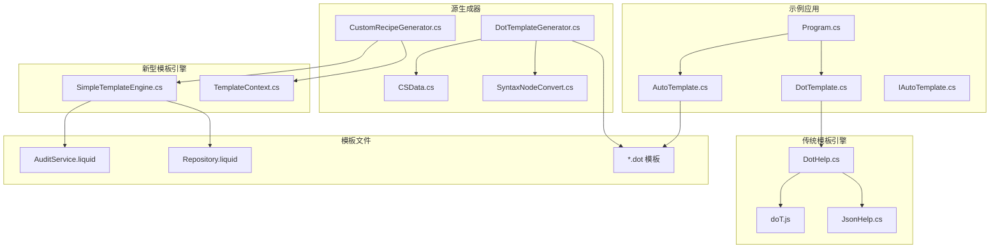
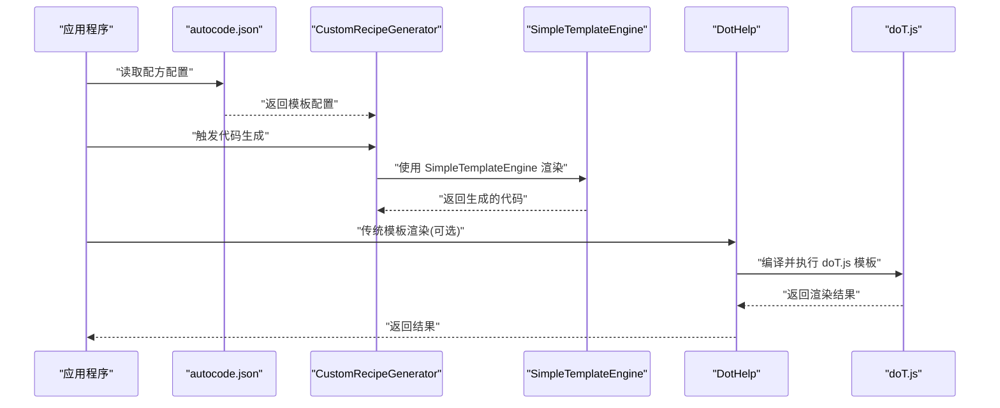
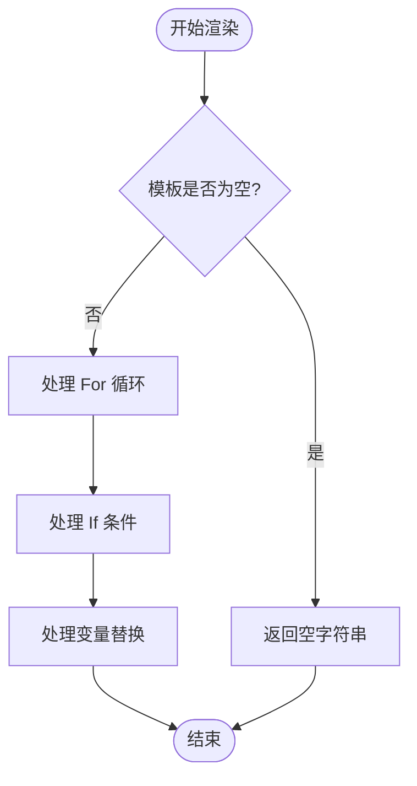
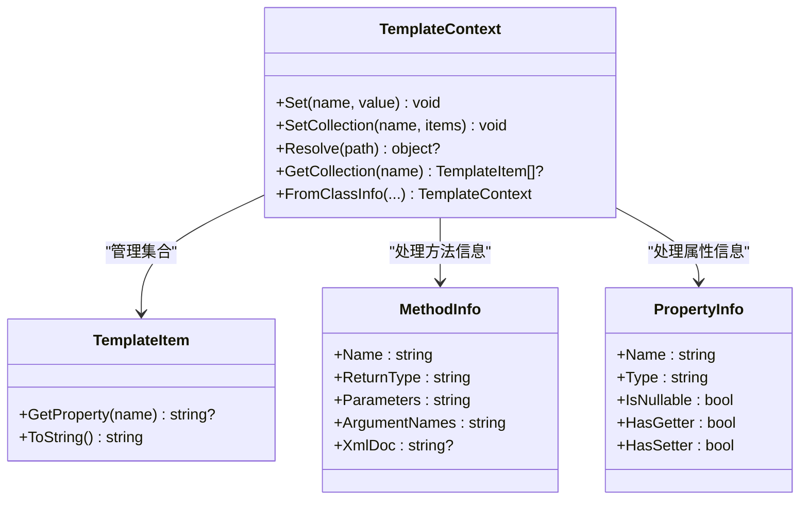
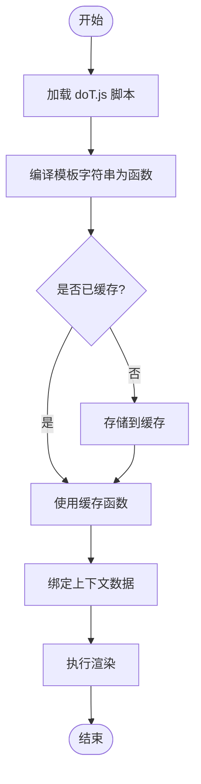
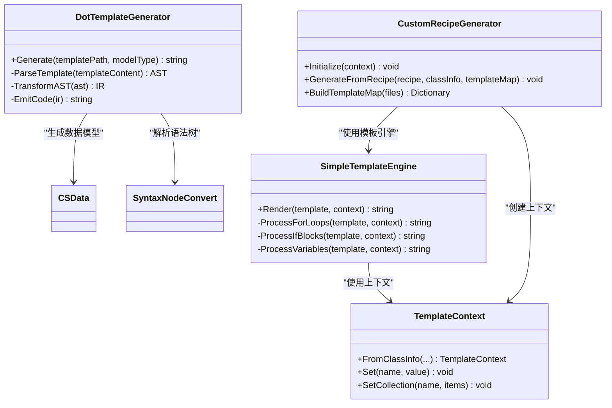
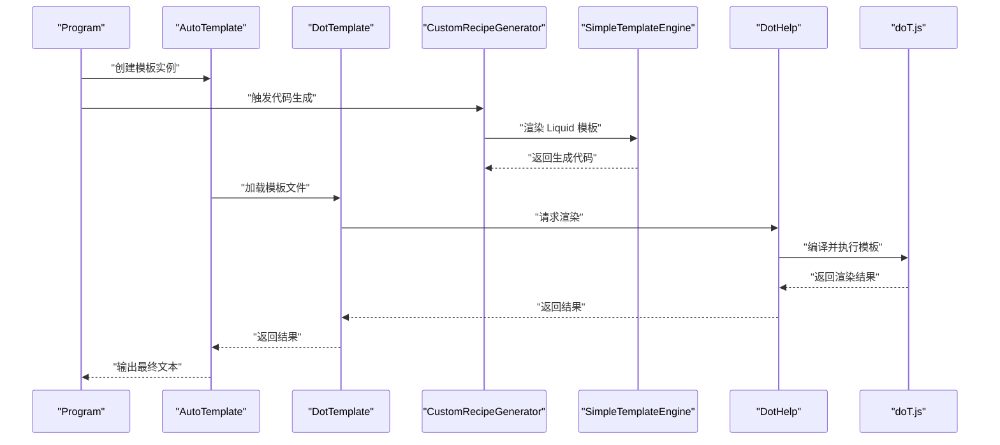
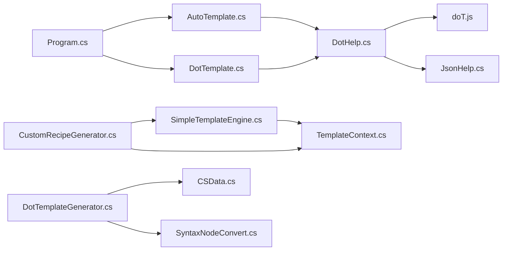

# 模板系统

<cite>
**本文引用的文件**   
- [SimpleTemplateEngine.cs](file://src/AutoCode.Engine/Template/SimpleTemplateEngine.cs)
- [TemplateContext.cs](file://src/AutoCode.Engine/Template/TemplateContext.cs)
- [AuditService.liquid](file://templates/AuditService.liquid)
- [Repository.liquid](file://templates/Repository.liquid)
- [CustomRecipeGenerator.cs](file://src/AutoCode.Generators/CustomRecipeGenerator.cs)
- [autocode.json](file://autocode.json)
- [doT.js](file://src/AutoCode.XmlTemplate.External/doT.js)
- [DotHelp.cs](file://src/AutoCode.XmlTemplate.External/DotHelp.cs)
- [JsonHelp.cs](file://src/AutoCode.XmlTemplate.External/JsonHelp.cs)
- [DotTemplateGenerator.cs](file://src/AutoCode.XmlTemplate.SourceGenerator/DotTemplateGenerator.cs)
- [CSData.cs](file://src/AutoCode.XmlTemplate.SourceGenerator/CSData.cs)
- [SyntaxNodeConvert.cs](file://src/AutoCode.XmlTemplate.SourceGenerator/SyntaxNodeConvert.cs)
- [AutoTemplate.cs](file://src/DotTemplate.APP/AutoTemplate.cs)
- [DotTemplate.cs](file://src/DotTemplate.APP/DotTemplate.cs)
- [IAutoTemplate.cs](file://src/DotTemplate.APP/IAutoTemplate.cs)
- [Program.cs](file://src/DotTemplate.APP/Program.cs)
- [ObjectCopy.dot](file://src/DotTemplate.APP/DotTemplate/ObjectCopy.dot)
- [Template.dot](file://src/DotTemplate.APP/DotTemplate/Template.dot)
- [Template_Caller.dot](file://src/DotTemplate.APP/DotTemplate/Template_Caller.dot)
- [DotTemplateS.json](file://src/DotTemplate.APP/DotTemplate/DotTemplateS.json)
- [DotTemplateS3.json](file://src/DotTemplate.APP/DotTemplate/DotTemplateS3.json)
- [DotTemplateS4.json](file://src/DotTemplate.APP/DotTemplate/DotTemplateS4.json)
- [DotTemplateS5.json](file://src/DotTemplate.APP/DotTemplate/DotTemplateS5.json)
- [DotTemplateS8.json](file://src/DotTemplate.APP/DotTemplate/DotTemplateS8.json)
</cite>

## 更新摘要
**所做更改**
- 新增 Liquid-based SimpleTemplateEngine 组件介绍
- 添加新模板（AuditService.liquid、Repository.liquid）的使用说明
- 更新模板上下文管理机制
- 增强 CustomRecipeGenerator 集成说明
- 扩展模板语法支持和最佳实践

## 目录
1. [简介](#简介)
2. [项目结构](#项目结构)
3. [核心组件](#核心组件)
4. [架构总览](#架构总览)
5. [详细组件分析](#详细组件分析)
6. [依赖关系分析](#依赖关系分析)
7. [性能考虑](#性能考虑)
8. [故障排查指南](#故障排查指南)
9. [结论](#结论)
10. [附录](#附录)

## 简介
本文件系统性介绍 AutoCode 的模板引擎体系，重点围绕 doT.js 模板引擎在 C# 环境中的集成方式、新增的 Liquid-based SimpleTemplateEngine、模板语法与扩展机制、JSON 配置驱动、以及从源码到代码生成的完整渲染流程。文档同时提供自定义模板开发示例（变量插值、循环控制、条件判断、函数调用）、调试技巧、性能优化建议与最佳实践，帮助读者快速上手并高效产出高质量模板。

**更新** 新增了基于 Liquid 语法的轻量级模板引擎，提供更简洁的模板语法和无外部依赖的渲染能力。

## 项目结构
AutoCode 的模板系统由"运行时库 + 源生成器 + 示例应用"三部分构成：
- 运行时库：封装 doT.js 的加载与执行能力，并提供 JSON 配置解析与辅助方法。
- 轻量级模板引擎：基于 Liquid 语法的 SimpleTemplateEngine，零外部依赖，支持变量替换、循环、条件等常用功能。
- 源生成器：在编译期将 .dot 模板与数据模型转换为可直接调用的 C# 代码，提升运行期性能。
- 示例应用：演示如何定义模板、配置数据、调用模板并输出结果。



图表来源
- [SimpleTemplateEngine.cs](file://src/AutoCode.Engine/Template/SimpleTemplateEngine.cs)
- [TemplateContext.cs](file://src/AutoCode.Engine/Template/TemplateContext.cs)
- [AuditService.liquid](file://templates/AuditService.liquid)
- [Repository.liquid](file://templates/Repository.liquid)
- [CustomRecipeGenerator.cs](file://src/AutoCode.Generators/CustomRecipeGenerator.cs)
- [doT.js](file://src/AutoCode.XmlTemplate.External/doT.js)
- [DotHelp.cs](file://src/AutoCode.XmlTemplate.External/DotHelp.cs)
- [JsonHelp.cs](file://src/AutoCode.XmlTemplate.External/JsonHelp.cs)
- [DotTemplateGenerator.cs](file://src/AutoCode.XmlTemplate.SourceGenerator/DotTemplateGenerator.cs)
- [CSData.cs](file://src/AutoCode.XmlTemplate.SourceGenerator/CSData.cs)
- [SyntaxNodeConvert.cs](file://src/AutoCode.XmlTemplate.SourceGenerator/SyntaxNodeConvert.cs)
- [Program.cs](file://src/DotTemplate.APP/Program.cs)
- [AutoTemplate.cs](file://src/DotTemplate.APP/AutoTemplate.cs)
- [DotTemplate.cs](file://src/DotTemplate.APP/DotTemplate.cs)
- [IAutoTemplate.cs](file://src/DotTemplate.APP/IAutoTemplate.cs)

章节来源
- [Program.cs](file://src/DotTemplate.APP/Program.cs)
- [AutoTemplate.cs](file://src/DotTemplate.APP/AutoTemplate.cs)
- [DotTemplate.cs](file://src/DotTemplate.APP/DotTemplate.cs)
- [IAutoTemplate.cs](file://src/DotTemplate.APP/IAutoTemplate.cs)
- [SimpleTemplateEngine.cs](file://src/AutoCode.Engine/Template/SimpleTemplateEngine.cs)
- [TemplateContext.cs](file://src/AutoCode.Engine/Template/TemplateContext.cs)
- [AuditService.liquid](file://templates/AuditService.liquid)
- [Repository.liquid](file://templates/Repository.liquid)
- [doT.js](file://src/AutoCode.XmlTemplate.External/doT.js)
- [DotHelp.cs](file://src/AutoCode.XmlTemplate.External/DotHelp.cs)
- [JsonHelp.cs](file://src/AutoCode.XmlTemplate.External/JsonHelp.cs)
- [DotTemplateGenerator.cs](file://src/AutoCode.XmlTemplate.SourceGenerator/DotTemplateGenerator.cs)
- [CSData.cs](file://src/AutoCode.XmlTemplate.SourceGenerator/CSData.cs)
- [SyntaxNodeConvert.cs](file://src/AutoCode.XmlTemplate.SourceGenerator/SyntaxNodeConvert.cs)

## 核心组件
- **doT.js 运行时**：提供模板编译与渲染能力，支持变量插值、循环、条件、包含等常用语法。
- **SimpleTemplateEngine**：轻量级模板渲染引擎，兼容 Liquid 语法子集，零外部依赖，支持变量替换、循环、条件判断。
- **TemplateContext**：增强的模板上下文管理，支持标量变量、集合变量、属性访问和复杂数据结构。
- **DotHelp**：C# 侧对 doT.js 的封装，负责加载模板、设置上下文、执行渲染、错误处理。
- **JsonHelp**：提供 JSON 读取与反序列化工具，用于加载模板配置或输入数据。
- **源生成器（DotTemplateGenerator）**：在编译期解析 .dot 模板与数据模型，生成高性能 C# 渲染代码，减少运行期开销。
- **CustomRecipeGenerator**：集成 SimpleTemplateEngine 的代码生成器，支持 .liquid 模板文件和配置驱动的模板匹配。
- **示例应用（AutoTemplate/DotTemplate/Program）**：展示模板定义、配置加载、数据绑定与渲染调用。

章节来源
- [SimpleTemplateEngine.cs](file://src/AutoCode.Engine/Template/SimpleTemplateEngine.cs)
- [TemplateContext.cs](file://src/AutoCode.Engine/Template/TemplateContext.cs)
- [doT.js](file://src/AutoCode.XmlTemplate.External/doT.js)
- [DotHelp.cs](file://src/AutoCode.XmlTemplate.External/DotHelp.cs)
- [JsonHelp.cs](file://src/AutoCode.XmlTemplate.External/JsonHelp.cs)
- [DotTemplateGenerator.cs](file://src/AutoCode.XmlTemplate.SourceGenerator/DotTemplateGenerator.cs)
- [CSData.cs](file://src/AutoCode.XmlTemplate.SourceGenerator/CSData.cs)
- [SyntaxNodeConvert.cs](file://src/AutoCode.XmlTemplate.SourceGenerator/SyntaxNodeConvert.cs)
- [CustomRecipeGenerator.cs](file://src/AutoCode.Generators/CustomRecipeGenerator.cs)
- [AutoTemplate.cs](file://src/DotTemplate.APP/AutoTemplate.cs)
- [DotTemplate.cs](file://src/DotTemplate.APP/DotTemplate.cs)
- [Program.cs](file://src/DotTemplate.APP/Program.cs)

## 架构总览
AutoCode 模板系统采用"多引擎渲染"策略：
- **传统运行期渲染**：通过 DotHelp 加载 doT.js 模板，动态编译并渲染，适合灵活场景与热更新。
- **轻量级编译期渲染**：通过 SimpleTemplateEngine 将 Liquid 模板转换为 C# 代码，避免运行期 JS 引擎开销，适合高吞吐场景。
- **配置驱动生成**：通过 CustomRecipeGenerator 实现基于配置的模板匹配和代码生成。



图表来源
- [CustomRecipeGenerator.cs](file://src/AutoCode.Generators/CustomRecipeGenerator.cs)
- [SimpleTemplateEngine.cs](file://src/AutoCode.Engine/Template/SimpleTemplateEngine.cs)
- [TemplateContext.cs](file://src/AutoCode.Engine/Template/TemplateContext.cs)
- [DotHelp.cs](file://src/AutoCode.XmlTemplate.External/DotHelp.cs)
- [doT.js](file://src/AutoCode.XmlTemplate.External/doT.js)
- [autocode.json](file://autocode.json)

## 详细组件分析

### SimpleTemplateEngine 轻量级模板引擎
**新增** SimpleTemplateEngine 是一个基于 Liquid 语法子集的轻量级模板渲染引擎，具有以下特点：
- **零外部依赖**：无需引入第三方模板库，降低项目复杂度
- **Liquid 兼容性**：支持 `{{ variable }}`、``、`` 等常用语法
- **高性能**：使用正则表达式进行模板处理，性能优于运行时 JavaScript 引擎
- **类型安全**：与 C# 类型系统集成，提供强类型的上下文管理



图表来源
- [SimpleTemplateEngine.cs:21-38](file://src/AutoCode.Engine/Template/SimpleTemplateEngine.cs#L21-L38)

章节来源
- [SimpleTemplateEngine.cs](file://src/AutoCode.Engine/Template/SimpleTemplateEngine.cs)

### 增强的模板上下文管理
**更新** TemplateContext 提供了更强大的上下文管理能力：
- **标量变量存储**：支持键值对的变量存储和解析
- **集合变量管理**：专门处理循环所需的集合数据
- **路径解析**：支持点号分隔的属性路径访问（如 `ClassName`、`Namespace`）
- **工厂方法**：提供 `FromClassInfo` 静态方法快速构建上下文
- **类型转换**：自动处理不同类型的数据转换



图表来源
- [TemplateContext.cs:11-116](file://src/AutoCode.Engine/Template/TemplateContext.cs#L11-L116)
- [TemplateContext.cs:121-167](file://src/AutoCode.Engine/Template/TemplateContext.cs#L121-L167)

章节来源
- [TemplateContext.cs](file://src/AutoCode.Engine/Template/TemplateContext.cs)

### Liquid 模板语法支持
**新增** SimpleTemplateEngine 支持的 Liquid 语法子集：

#### 变量替换
- 基本变量：`{{ ClassName }}`、`{{ Namespace }}`
- 对象属性：`{{ method.Name }}`、`{{ property.Type }}`
- 循环变量：`{{ forloop.index }}`、`{{ forloop.first }}`、`{{ forloop.last }}`

#### 循环控制
```liquid

    public {{ method.ReturnType }} {{ method.Name }}({{ method.Parameters }})
    {
        // 方法体
    }

```

#### 条件判断
```liquid

    _inner.{{ method.Name }}({{ method.ArgumentNames }});

    return _inner.{{ method.Name }}({{ method.ArgumentNames }});

```

章节来源
- [AuditService.liquid](file://templates/AuditService.liquid)
- [Repository.liquid](file://templates/Repository.liquid)
- [SimpleTemplateEngine.cs](file://src/AutoCode.Engine/Template/SimpleTemplateEngine.cs)

### 新模板示例
**新增** 两个实用的 Liquid 模板示例：

#### AuditService.liquid - 审计日志服务
自动生成带审计功能的日志包装器，记录方法调用的时间、参数、耗时和异常信息。

#### Repository.liquid - 仓储模式实现
自动生成内存仓储实现，提供 CRUD 操作接口和基础数据存储功能。

章节来源
- [AuditService.liquid](file://templates/AuditService.liquid)
- [Repository.liquid](file://templates/Repository.liquid)

### 配置驱动的模板匹配
**更新** CustomRecipeGenerator 实现了基于配置的模板匹配机制：

#### 配置文件结构
```json
{
  "customGenerators": [
    {
      "name": "auditService",
      "title": "添加审计日志服务",
      "trigger": {
        "classPattern": "*Service",
        "attributeName": "AutoAudit"
      },
      "output": {
        "template": "templates/AuditService.liquid",
        "fileName": "{ClassName}Audit.g.cs",
        "namespace": "{SourceNamespace}.Audit"
      }
    }
  ]
}
```

#### 匹配规则
- **显式标记**：使用 `[CustomGenerate("recipeName")]` 属性
- **模式匹配**：通过 `classPattern` 匹配类名模式
- **属性检查**：验证类是否包含指定的属性和方法
- **接口要求**：检查类是否实现了特定接口

章节来源
- [CustomRecipeGenerator.cs](file://src/AutoCode.Generators/CustomRecipeGenerator.cs)
- [autocode.json](file://autocode.json)

### doT.js 模板引擎集成
- **集成方式**：通过 DotHelp 在 C# 中加载 doT.js，使用其 API 编译模板字符串为可执行函数，再传入上下文对象进行渲染。
- **关键职责**：
  - 模板缓存：避免重复编译相同模板。
  - 上下文管理：将 C# 对象映射为 doT.js 可用的数据视图。
  - 错误处理：捕获并包装模板编译与渲染异常。
- **扩展点**：可在 DotHelp 中注入自定义函数或过滤器，供模板调用。



图表来源
- [doT.js](file://src/AutoCode.XmlTemplate.External/doT.js)
- [DotHelp.cs](file://src/AutoCode.XmlTemplate.External/DotHelp.cs)

章节来源
- [doT.js](file://src/AutoCode.XmlTemplate.External/doT.js)
- [DotHelp.cs](file://src/AutoCode.XmlTemplate.External/DotHelp.cs)

### 模板语法与内置函数
- **变量插值**：在模板中使用占位符引用上下文属性。
- **循环控制**：遍历数组或对象集合，支持索引与条件过滤。
- **条件判断**：根据表达式输出不同内容。
- **函数调用**：调用模板内或外部注册的函数，实现复用逻辑。
- **包含与继承**：组合多个模板片段，构建复杂输出。

**更新** 新增 Liquid 语法支持，提供更简洁的模板编写体验。

章节来源
- [ObjectCopy.dot](file://src/DotTemplate.APP/DotTemplate/ObjectCopy.dot)
- [Template.dot](file://src/DotTemplate.APP/DotTemplate/Template.dot)
- [Template_Caller.dot](file://src/DotTemplate.APP/DotTemplate/Template_Caller.dot)
- [AuditService.liquid](file://templates/AuditService.liquid)
- [Repository.liquid](file://templates/Repository.liquid)

### JSON 配置文件
- **用途**：集中管理模板路径、参数默认值、环境变量映射等。
- **结构**：通常包含模板清单、数据模型映射、全局设置等键值对。
- **加载**：通过 JsonHelp 读取并反序列化为强类型对象，便于在 DotHelp 中使用。

**更新** 新增 customGenerators 配置段，支持基于配置的模板匹配和代码生成。

章节来源
- [JsonHelp.cs](file://src/AutoCode.XmlTemplate.External/JsonHelp.cs)
- [autocode.json](file://autocode.json)
- [DotTemplateS.json](file://src/DotTemplate.APP/DotTemplate/DotTemplateS.json)
- [DotTemplateS3.json](file://src/DotTemplate.APP/DotTemplate/DotTemplateS3.json)
- [DotTemplateS4.json](file://src/DotTemplate.APP/DotTemplate/DotTemplateS4.json)
- [DotTemplateS5.json](file://src/DotTemplate.APP/DotTemplate/DotTemplateS5.json)
- [DotTemplateS8.json](file://src/DotTemplate.APP/DotTemplate/DotTemplateS8.json)

### 源生成器与编译期优化
- **目标**：在编译期解析 .dot 模板与数据模型，生成等效的 C# 渲染代码，消除运行期 JS 引擎调用开销。
- **流程**：
  - 扫描模板文件与数据模型。
  - 解析模板语法树，转换为中间表示。
  - 生成 C# 类与方法，实现模板渲染逻辑。
  - 将生成代码注入到项目中，供应用程序直接调用。
- **优势**：类型安全、性能更高、调试更友好。

**更新** CustomRecipeGenerator 集成了 SimpleTemplateEngine，支持 .liquid 模板文件的编译时代码生成。



图表来源
- [DotTemplateGenerator.cs](file://src/AutoCode.XmlTemplate.SourceGenerator/DotTemplateGenerator.cs)
- [CustomRecipeGenerator.cs](file://src/AutoCode.Generators/CustomRecipeGenerator.cs)
- [SimpleTemplateEngine.cs](file://src/AutoCode.Engine/Template/SimpleTemplateEngine.cs)
- [TemplateContext.cs](file://src/AutoCode.Engine/Template/TemplateContext.cs)
- [CSData.cs](file://src/AutoCode.XmlTemplate.SourceGenerator/CSData.cs)
- [SyntaxNodeConvert.cs](file://src/AutoCode.XmlTemplate.SourceGenerator/SyntaxNodeConvert.cs)

章节来源
- [DotTemplateGenerator.cs](file://src/AutoCode.XmlTemplate.SourceGenerator/DotTemplateGenerator.cs)
- [CustomRecipeGenerator.cs](file://src/AutoCode.Generators/CustomRecipeGenerator.cs)
- [SimpleTemplateEngine.cs](file://src/AutoCode.Engine/Template/SimpleTemplateEngine.cs)
- [TemplateContext.cs](file://src/AutoCode.Engine/Template/TemplateContext.cs)
- [CSData.cs](file://src/AutoCode.XmlTemplate.SourceGenerator/CSData.cs)
- [SyntaxNodeConvert.cs](file://src/AutoCode.XmlTemplate.SourceGenerator/SyntaxNodeConvert.cs)

### 示例应用与渲染流程
- **入口**：Program 初始化模板引擎，加载配置，准备数据。
- **模板定义**：在 .dot 文件中编写模板逻辑，使用变量、循环、条件与函数。
- **渲染调用**：通过 AutoTemplate 或 DotTemplate 调用模板，传入数据上下文，获取输出。
- **输出**：控制台或文件输出渲染结果。

**更新** 新增基于配置的模板生成流程，支持 .liquid 模板文件和自动匹配。



图表来源
- [Program.cs](file://src/DotTemplate.APP/Program.cs)
- [AutoTemplate.cs](file://src/DotTemplate.APP/AutoTemplate.cs)
- [DotTemplate.cs](file://src/DotTemplate.APP/DotTemplate.cs)
- [CustomRecipeGenerator.cs](file://src/AutoCode.Generators/CustomRecipeGenerator.cs)
- [SimpleTemplateEngine.cs](file://src/AutoCode.Engine/Template/SimpleTemplateEngine.cs)
- [DotHelp.cs](file://src/AutoCode.XmlTemplate.External/DotHelp.cs)
- [doT.js](file://src/AutoCode.XmlTemplate.External/doT.js)

章节来源
- [Program.cs](file://src/DotTemplate.APP/Program.cs)
- [AutoTemplate.cs](file://src/DotTemplate.APP/AutoTemplate.cs)
- [DotTemplate.cs](file://src/DotTemplate.APP/DotTemplate.cs)
- [IAutoTemplate.cs](file://src/DotTemplate.APP/IAutoTemplate.cs)
- [CustomRecipeGenerator.cs](file://src/AutoCode.Generators/CustomRecipeGenerator.cs)

## 依赖关系分析
- **运行时依赖**：DotHelp 依赖 doT.js 与 JsonHelp，提供模板渲染与配置加载能力。
- **生成器依赖**：DotTemplateGenerator 依赖 CSData 与 SyntaxNodeConvert，完成模板解析与代码生成。
- **应用依赖**：示例应用依赖 AutoTemplate 与 DotTemplate，间接依赖运行时库与生成器产物。
- **新依赖**：CustomRecipeGenerator 依赖 SimpleTemplateEngine 与 TemplateContext，提供轻量级模板渲染能力。



图表来源
- [Program.cs](file://src/DotTemplate.APP/Program.cs)
- [AutoTemplate.cs](file://src/DotTemplate.APP/AutoTemplate.cs)
- [DotTemplate.cs](file://src/DotTemplate.APP/DotTemplate.cs)
- [DotHelp.cs](file://src/AutoCode.XmlTemplate.External/DotHelp.cs)
- [doT.js](file://src/AutoCode.XmlTemplate.External/doT.js)
- [JsonHelp.cs](file://src/AutoCode.XmlTemplate.External/JsonHelp.cs)
- [CustomRecipeGenerator.cs](file://src/AutoCode.Generators/CustomRecipeGenerator.cs)
- [SimpleTemplateEngine.cs](file://src/AutoCode.Engine/Template/SimpleTemplateEngine.cs)
- [TemplateContext.cs](file://src/AutoCode.Engine/Template/TemplateContext.cs)
- [DotTemplateGenerator.cs](file://src/AutoCode.XmlTemplate.SourceGenerator/DotTemplateGenerator.cs)
- [CSData.cs](file://src/AutoCode.XmlTemplate.SourceGenerator/CSData.cs)
- [SyntaxNodeConvert.cs](file://src/AutoCode.XmlTemplate.SourceGenerator/SyntaxNodeConvert.cs)

章节来源
- [Program.cs](file://src/DotTemplate.APP/Program.cs)
- [AutoTemplate.cs](file://src/DotTemplate.APP/AutoTemplate.cs)
- [DotTemplate.cs](file://src/DotTemplate.APP/DotTemplate.cs)
- [DotHelp.cs](file://src/AutoCode.XmlTemplate.External/DotHelp.cs)
- [doT.js](file://src/AutoCode.XmlTemplate.External/doT.js)
- [JsonHelp.cs](file://src/AutoCode.XmlTemplate.External/JsonHelp.cs)
- [CustomRecipeGenerator.cs](file://src/AutoCode.Generators/CustomRecipeGenerator.cs)
- [SimpleTemplateEngine.cs](file://src/AutoCode.Engine/Template/SimpleTemplateEngine.cs)
- [TemplateContext.cs](file://src/AutoCode.Engine/Template/TemplateContext.cs)
- [DotTemplateGenerator.cs](file://src/AutoCode.XmlTemplate.SourceGenerator/DotTemplateGenerator.cs)
- [CSData.cs](file://src/AutoCode.XmlTemplate.SourceGenerator/CSData.cs)
- [SyntaxNodeConvert.cs](file://src/AutoCode.XmlTemplate.SourceGenerator/SyntaxNodeConvert.cs)

## 性能考虑
- **优先使用源生成器**：编译期生成 C# 代码，避免运行期 JS 引擎开销。
- **模板缓存**：对热点模板启用缓存，减少重复编译。
- **数据扁平化**：简化上下文对象结构，降低序列化与映射成本。
- **批量渲染**：合并多次渲染调用，减少上下文切换。
- **异步优化**：对 IO 密集型操作使用异步，提高吞吐量。
- **选择合适引擎**：对于简单模板使用 SimpleTemplateEngine，复杂场景使用 doT.js。

**更新** SimpleTemplateEngine 相比 doT.js 具有更好的性能表现，因为它避免了 JavaScript 引擎的启动和编译开销。

[本节为通用指导，不直接分析具体文件]

## 故障排查指南
- **模板编译失败**：检查模板语法是否正确，确认 doT.js 版本兼容性。
- **渲染结果为空**：验证上下文数据是否完整，确保属性名匹配。
- **性能下降**：定位热点模板，启用缓存或改用生成器模式。
- **调试技巧**：
  - 输出中间 AST 或 IR，检查转换过程。
  - 打印渲染前后的上下文快照，对比差异。
  - 使用断点逐步跟踪调用链。
- **Liquid 模板问题**：检查语法是否符合 Liquid 规范，确认变量名称正确。

**更新** 新增 Liquid 模板相关的故障排查指南。

章节来源
- [DotHelp.cs](file://src/AutoCode.XmlTemplate.External/DotHelp.cs)
- [DotTemplateGenerator.cs](file://src/AutoCode.XmlTemplate.SourceGenerator/DotTemplateGenerator.cs)
- [SyntaxNodeConvert.cs](file://src/AutoCode.XmlTemplate.SourceGenerator/SyntaxNodeConvert.cs)
- [SimpleTemplateEngine.cs](file://src/AutoCode.Engine/Template/SimpleTemplateEngine.cs)

## 结论
AutoCode 的模板系统通过 doT.js 与 C# 源生成器的结合，以及新增的 Liquid-based SimpleTemplateEngine，提供了灵活高效的代码生成能力。传统 doT.js 引擎适合复杂场景和动态需求，而 SimpleTemplateEngine 则提供了轻量级、高性能的替代方案。通过合理的模板设计、配置管理与性能优化，可以构建稳定可靠的自动化代码生成流水线。

**更新** 新增的 SimpleTemplateEngine 为 AutoCode 模板系统提供了更多选择，用户可以根据项目需求选择合适的模板引擎。

[本节为总结性内容，不直接分析具体文件]

## 附录
- **模板开发示例**：
  - 变量插值：在模板中引用上下文属性，如用户信息、配置项。
  - 循环控制：遍历集合，生成重复结构，如实体属性、接口方法。
  - 条件判断：根据类型或标志输出不同代码片段。
  - 函数调用：封装通用逻辑，如格式化、校验、拼接。
- **最佳实践**：
  - 模板模块化：拆分为小片段，便于复用与维护。
  - 配置外置：将可变参数放入 JSON，便于环境隔离。
  - 测试覆盖：为模板编写单元测试，确保稳定性。
  - 文档同步：维护模板语法与示例，降低学习成本。
  - 引擎选择：简单模板使用 SimpleTemplateEngine，复杂场景使用 doT.js。

**更新** 新增 Liquid 模板开发指南和引擎选择建议。

[本节为补充信息，不直接分析具体文件]