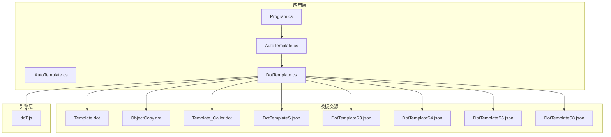
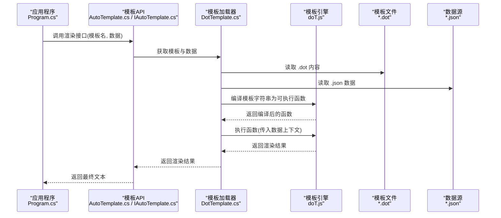
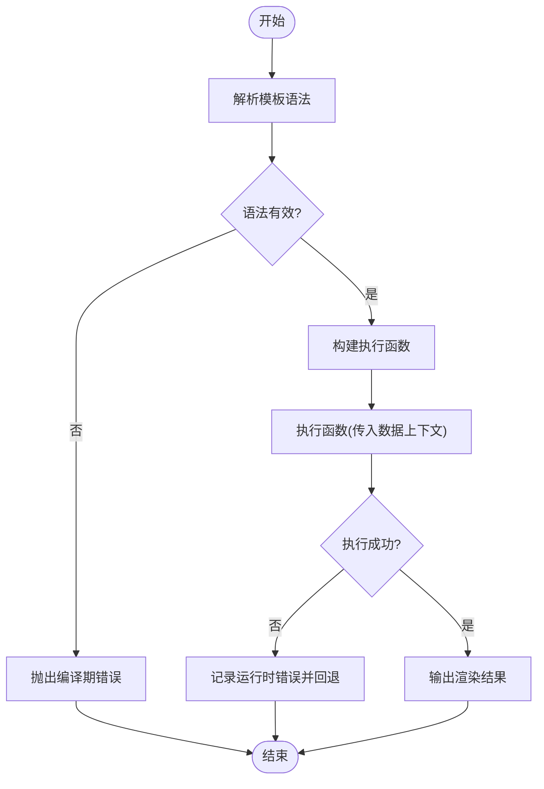
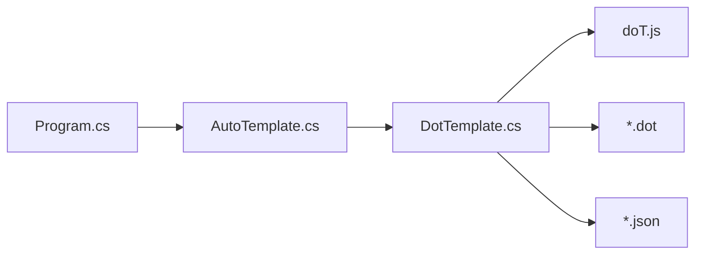

# 模板语法

<cite>
**本文引用的文件**   
- [doT.js](file://src/AutoCode.XmlTemplate.External/doT.js)
- [DotTemplate.cs](file://src/DotTemplate.APP/DotTemplate.cs)
- [AutoTemplate.cs](file://src/DotTemplate.APP/AutoTemplate.cs)
- [IAutoTemplate.cs](file://src/DotTemplate.APP/IAutoTemplate.cs)
- [Program.cs](file://src/DotTemplate.APP/Program.cs)
- [Template.dot](file://src/DotTemplate.APP/DotTemplate/Template.dot)
- [ObjectCopy.dot](file://src/DotTemplate.APP/DotTemplate/ObjectCopy.dot)
- [Template_Caller.dot](file://src/DotTemplate.APP/DotTemplate/Template_Caller.dot)
- [DotTemplateS.json](file://src/DotTemplate.APP/DotTemplate/DotTemplateS.json)
- [DotTemplateS3.json](file://src/DotTemplate.APP/DotTemplate/DotTemplateS3.json)
- [DotTemplateS4.json](file://src/DotTemplate.APP/DotTemplate/DotTemplateS4.json)
- [DotTemplateS5.json](file://src/DotTemplate.APP/DotTemplate/DotTemplateS5.json)
- [DotTemplateS8.json](file://src/DotTemplate.APP/DotTemplate/DotTemplateS8.json)
</cite>

## 目录
1. [简介](#简介)
2. [项目结构](#项目结构)
3. [核心组件](#核心组件)
4. [架构总览](#架构总览)
5. [详细组件分析](#详细组件分析)
6. [依赖关系分析](#依赖关系分析)
7. [性能考虑](#性能考虑)
8. [故障排查指南](#故障排查指南)
9. [结论](#结论)
10. [附录：语法速查与示例路径](#附录语法速查与示例路径)

## 简介
本文件系统性梳理 AutoCode 中 doT.js 模板引擎的语法规范与使用方式，覆盖变量插值、循环控制、条件判断、函数调用、注释、错误处理、调试技巧与常见错误解决方案。文档同时给出模板文件的组织方式与示例位置，帮助读者快速上手并高效排错。

## 项目结构
AutoCode 将 doT.js 作为外部依赖引入，并通过 .dot 模板文件与 JSON 数据驱动代码生成。关键目录与职责如下：
- src/AutoCode.XmlTemplate.External/doT.js：doT 模板引擎实现（编译与执行）
- src/DotTemplate.APP/DotTemplate/*.dot：模板文件集合（对象复制、调用方等）
- src/DotTemplate.APP/DotTemplate/*.json：模板运行时的输入数据
- src/DotTemplate.APP/DotTemplate.cs：模板加载与渲染入口
- src/DotTemplate.APP/AutoTemplate.cs：面向用户的模板封装
- src/DotTemplate.APP/IAutoTemplate.cs：模板接口定义
- src/DotTemplate.APP/Program.cs：演示程序，串联数据与模板渲染

**图表来源** 
- [Program.cs](file://src/DotTemplate.APP/Program.cs)
- [AutoTemplate.cs](file://src/DotTemplate.APP/AutoTemplate.cs)
- [DotTemplate.cs](file://src/DotTemplate.APP/DotTemplate.cs)
- [doT.js](file://src/AutoCode.XmlTemplate.External/doT.js)
- [Template.dot](file://src/DotTemplate.APP/DotTemplate/Template.dot)
- [ObjectCopy.dot](file://src/DotTemplate.APP/DotTemplate/ObjectCopy.dot)
- [Template_Caller.dot](file://src/DotTemplate.APP/DotTemplate/Template_Caller.dot)
- [DotTemplateS.json](file://src/DotTemplate.APP/DotTemplate/DotTemplateS.json)
- [DotTemplateS3.json](file://src/DotTemplate.APP/DotTemplate/DotTemplateS3.json)
- [DotTemplateS4.json](file://src/DotTemplate.APP/DotTemplate/DotTemplateS4.json)
- [DotTemplateS5.json](file://src/DotTemplate.APP/DotTemplate/DotTemplateS5.json)
- [DotTemplateS8.json](file://src/DotTemplate.APP/DotTemplate/DotTemplateS8.json)

**章节来源**
- [Program.cs](file://src/DotTemplate.APP/Program.cs)
- [AutoTemplate.cs](file://src/DotTemplate.APP/AutoTemplate.cs)
- [DotTemplate.cs](file://src/DotTemplate.APP/DotTemplate.cs)
- [doT.js](file://src/AutoCode.XmlTemplate.External/doT.js)
- [Template.dot](file://src/DotTemplate.APP/DotTemplate/Template.dot)
- [ObjectCopy.dot](file://src/DotTemplate.APP/DotTemplate/ObjectCopy.dot)
- [Template_Caller.dot](file://src/DotTemplate.APP/DotTemplate/Template_Caller.dot)
- [DotTemplateS.json](file://src/DotTemplate.APP/DotTemplate/DotTemplateS.json)
- [DotTemplateS3.json](file://src/DotTemplate.APP/DotTemplate/DotTemplateS3.json)
- [DotTemplateS4.json](file://src/DotTemplate.APP/DotTemplate/DotTemplateS4.json)
- [DotTemplateS5.json](file://src/DotTemplate.APP/DotTemplate/DotTemplateS5.json)
- [DotTemplateS8.json](file://src/DotTemplate.APP/DotTemplate/DotTemplateS8.json)

## 核心组件
- doT.js：提供模板编译与执行能力，支持变量输出、循环、条件、函数调用、包含与局部变量等特性。
- DotTemplate.cs：负责读取 .dot 模板与 JSON 数据，调用 doT 进行渲染。
- AutoTemplate.cs / IAutoTemplate.cs：对外暴露统一的模板渲染接口，屏蔽底层细节。
- Program.cs：演示如何组装数据并渲染模板。

**章节来源**
- [doT.js](file://src/AutoCode.XmlTemplate.External/doT.js)
- [DotTemplate.cs](file://src/DotTemplate.APP/DotTemplate.cs)
- [AutoTemplate.cs](file://src/DotTemplate.APP/AutoTemplate.cs)
- [IAutoTemplate.cs](file://src/DotTemplate.APP/IAutoTemplate.cs)
- [Program.cs](file://src/DotTemplate.APP/Program.cs)

## 架构总览
下图展示了从应用层到模板引擎的数据流与控制流：应用准备数据，通过 AutoTemplate 或 DotTemplate 加载模板，doT 编译并执行模板，最终输出文本。

**图表来源** 
- [Program.cs](file://src/DotTemplate.APP/Program.cs)
- [AutoTemplate.cs](file://src/DotTemplate.APP/AutoTemplate.cs)
- [DotTemplate.cs](file://src/DotTemplate.APP/DotTemplate.cs)
- [doT.js](file://src/AutoCode.XmlTemplate.External/doT.js)
- [Template.dot](file://src/DotTemplate.APP/DotTemplate/Template.dot)
- [ObjectCopy.dot](file://src/DotTemplate.APP/DotTemplate/ObjectCopy.dot)
- [Template_Caller.dot](file://src/DotTemplate.APP/DotTemplate/Template_Caller.dot)
- [DotTemplateS.json](file://src/DotTemplate.APP/DotTemplate/DotTemplateS.json)
- [DotTemplateS3.json](file://src/DotTemplate.APP/DotTemplate/DotTemplateS3.json)
- [DotTemplateS4.json](file://src/DotTemplate.APP/DotTemplate/DotTemplateS4.json)
- [DotTemplateS5.json](file://src/DotTemplate.APP/DotTemplate/DotTemplateS5.json)
- [DotTemplateS8.json](file://src/DotTemplate.APP/DotTemplate/DotTemplateS8.json)

## 详细组件分析

### doT.js 模板引擎语法规范
- 变量插值
  - 基本输出：在模板中使用特定标记包裹表达式，用于输出变量或表达式结果。
  - 安全输出：如需对 HTML 等特殊字符进行转义，可使用对应的安全输出标记。
  - 属性访问：支持点号与方括号访问对象属性，如 obj.prop、obj["key"]。
  - 默认值：可在表达式中提供默认值以避免空引用。
  - 示例参考：[Template.dot](file://src/DotTemplate.APP/DotTemplate/Template.dot)、[ObjectCopy.dot](file://src/DotTemplate.APP/DotTemplate/ObjectCopy.dot)

- 循环控制
  - 数组遍历：使用 for 类指令遍历数组或集合，内部可访问索引与元素。
  - 对象遍历：支持遍历对象的键值对。
  - 嵌套循环：允许在循环体内再次循环，注意作用域隔离。
  - 示例参考：[Template_Caller.dot](file://src/DotTemplate.APP/DotTemplate/Template_Caller.dot)

- 条件判断
  - if/else：根据布尔表达式决定是否输出某段内容。
  - 三元表达式：在插值表达式内使用条件表达式简化逻辑。
  - 示例参考：[Template.dot](file://src/DotTemplate.APP/DotTemplate/Template.dot)

- 函数调用
  - 内置函数：doT 提供常用工具函数（如字符串处理、格式化）。
  - 自定义函数：可在数据上下文中注入自定义函数，模板中直接调用。
  - 示例参考：[DotTemplateS.json](file://src/DotTemplate.APP/DotTemplate/DotTemplateS.json)、[DotTemplateS3.json](file://src/DotTemplate.APP/DotTemplate/DotTemplateS3.json)

- 包含与局部变量
  - 包含其他模板片段：便于复用公共片段。
  - 局部变量：在模板块内声明局部变量，避免污染全局上下文。
  - 示例参考：[ObjectCopy.dot](file://src/DotTemplate.APP/DotTemplate/ObjectCopy.dot)

- 注释语法
  - 单行/多行注释：用于说明模板逻辑，不参与渲染输出。
  - 示例参考：[Template.dot](file://src/DotTemplate.APP/DotTemplate/Template.dot)

- 错误处理机制
  - 编译期错误：模板语法错误会在编译阶段抛出异常。
  - 运行时错误：数据缺失或类型不匹配导致执行失败。
  - 建议：在 DotTemplate.cs 中捕获并包装异常，提供清晰的错误信息。
  - 示例参考：[DotTemplate.cs](file://src/DotTemplate.APP/DotTemplate.cs)、[doT.js](file://src/AutoCode.XmlTemplate.External/doT.js)

**图表来源** 
- [doT.js](file://src/AutoCode.XmlTemplate.External/doT.js)
- [DotTemplate.cs](file://src/DotTemplate.APP/DotTemplate.cs)

**章节来源**
- [doT.js](file://src/AutoCode.XmlTemplate.External/doT.js)
- [Template.dot](file://src/DotTemplate.APP/DotTemplate/Template.dot)
- [ObjectCopy.dot](file://src/DotTemplate.APP/DotTemplate/ObjectCopy.dot)
- [Template_Caller.dot](file://src/DotTemplate.APP/DotTemplate/Template_Caller.dot)
- [DotTemplateS.json](file://src/DotTemplate.APP/DotTemplate/DotTemplateS.json)
- [DotTemplateS3.json](file://src/DotTemplate.APP/DotTemplate/DotTemplateS3.json)
- [DotTemplateS4.json](file://src/DotTemplate.APP/DotTemplate/DotTemplateS4.json)
- [DotTemplateS5.json](file://src/DotTemplate.APP/DotTemplate/DotTemplateS5.json)
- [DotTemplateS8.json](file://src/DotTemplate.APP/DotTemplate/DotTemplateS8.json)
- [DotTemplate.cs](file://src/DotTemplate.APP/DotTemplate.cs)

### 模板文件组织结构
- 模板文件命名约定：以 .dot 结尾，按功能划分（如对象复制、调用方生成）。
- 数据文件命名约定：以 .json 结尾，存放模板渲染所需的数据模型。
- 推荐分层：
  - 基础片段：通用片段放在独立文件中，通过包含复用。
  - 业务模板：针对具体场景的完整模板。
  - 数据契约：JSON 文件描述数据结构与示例。
- 示例参考：
  - [Template.dot](file://src/DotTemplate.APP/DotTemplate/Template.dot)
  - [ObjectCopy.dot](file://src/DotTemplate.APP/DotTemplate/ObjectCopy.dot)
  - [Template_Caller.dot](file://src/DotTemplate.APP/DotTemplate/Template_Caller.dot)
  - [DotTemplateS.json](file://src/DotTemplate.APP/DotTemplate/DotTemplateS.json)
  - [DotTemplateS3.json](file://src/DotTemplate.APP/DotTemplate/DotTemplateS3.json)
  - [DotTemplateS4.json](file://src/DotTemplate.APP/DotTemplate/DotTemplateS4.json)
  - [DotTemplateS5.json](file://src/DotTemplate.APP/DotTemplate/DotTemplateS5.json)
  - [DotTemplateS8.json](file://src/DotTemplate.APP/DotTemplate/DotTemplateS8.json)

**章节来源**
- [Template.dot](file://src/DotTemplate.APP/DotTemplate/Template.dot)
- [ObjectCopy.dot](file://src/DotTemplate.APP/DotTemplate/ObjectCopy.dot)
- [Template_Caller.dot](file://src/DotTemplate.APP/DotTemplate/Template_Caller.dot)
- [DotTemplateS.json](file://src/DotTemplate.APP/DotTemplate/DotTemplateS.json)
- [DotTemplateS3.json](file://src/DotTemplate.APP/DotTemplate/DotTemplateS3.json)
- [DotTemplateS4.json](file://src/DotTemplate.APP/DotTemplate/DotTemplateS4.json)
- [DotTemplateS5.json](file://src/DotTemplate.APP/DotTemplate/DotTemplateS5.json)
- [DotTemplateS8.json](file://src/DotTemplate.APP/DotTemplate/DotTemplateS8.json)

### 模板调试技巧
- 分步验证：先渲染最小模板确认变量输出正确，再逐步增加逻辑。
- 打印中间结果：在模板中输出关键变量的值，定位问题范围。
- 错误信息增强：在 DotTemplate.cs 中捕获异常并附加模板名称与行号。
- 数据校验：确保 JSON 数据字段存在且类型符合预期。
- 示例参考：
  - [DotTemplate.cs](file://src/DotTemplate.APP/DotTemplate.cs)
  - [Program.cs](file://src/DotTemplate.APP/Program.cs)

**章节来源**
- [DotTemplate.cs](file://src/DotTemplate.APP/DotTemplate.cs)
- [Program.cs](file://src/DotTemplate.APP/Program.cs)

### 常见语法错误与解决方案
- 变量未定义：检查数据上下文是否包含该字段，或使用默认值。
- 循环变量冲突：避免在嵌套循环中使用相同变量名。
- 条件表达式语法错误：确保布尔表达式合法，必要时拆分为简单表达式。
- 函数调用参数不匹配：核对自定义函数的签名与调用方式。
- 包含路径错误：确认模板包含路径正确且文件存在。
- 示例参考：
  - [Template.dot](file://src/DotTemplate.APP/DotTemplate/Template.dot)
  - [ObjectCopy.dot](file://src/DotTemplate.APP/DotTemplate/ObjectCopy.dot)
  - [Template_Caller.dot](file://src/DotTemplate.APP/DotTemplate/Template_Caller.dot)

**章节来源**
- [Template.dot](file://src/DotTemplate.APP/DotTemplate/Template.dot)
- [ObjectCopy.dot](file://src/DotTemplate.APP/DotTemplate/ObjectCopy.dot)
- [Template_Caller.dot](file://src/DotTemplate.APP/DotTemplate/Template_Caller.dot)

## 依赖关系分析
- 应用层依赖模板 API（AutoTemplate.cs / IAutoTemplate.cs），模板 API 依赖模板加载器（DotTemplate.cs）。
- 模板加载器依赖 doT.js 进行编译与执行。
- 模板文件与 JSON 数据作为静态资源被加载器读取。

**图表来源** 
- [Program.cs](file://src/DotTemplate.APP/Program.cs)
- [AutoTemplate.cs](file://src/DotTemplate.APP/AutoTemplate.cs)
- [DotTemplate.cs](file://src/DotTemplate.APP/DotTemplate.cs)
- [doT.js](file://src/AutoCode.XmlTemplate.External/doT.js)
- [Template.dot](file://src/DotTemplate.APP/DotTemplate/Template.dot)
- [ObjectCopy.dot](file://src/DotTemplate.APP/DotTemplate/ObjectCopy.dot)
- [Template_Caller.dot](file://src/DotTemplate.APP/DotTemplate/Template_Caller.dot)
- [DotTemplateS.json](file://src/DotTemplate.APP/DotTemplate/DotTemplateS.json)
- [DotTemplateS3.json](file://src/DotTemplate.APP/DotTemplate/DotTemplateS3.json)
- [DotTemplateS4.json](file://src/DotTemplate.APP/DotTemplate/DotTemplateS4.json)
- [DotTemplateS5.json](file://src/DotTemplate.APP/DotTemplate/DotTemplateS5.json)
- [DotTemplateS8.json](file://src/DotTemplate.APP/DotTemplate/DotTemplateS8.json)

**章节来源**
- [Program.cs](file://src/DotTemplate.APP/Program.cs)
- [AutoTemplate.cs](file://src/DotTemplate.APP/AutoTemplate.cs)
- [DotTemplate.cs](file://src/DotTemplate.APP/DotTemplate.cs)
- [doT.js](file://src/AutoCode.XmlTemplate.External/doT.js)

## 性能考虑
- 模板缓存：对频繁使用的模板进行编译缓存，避免重复编译开销。
- 数据预校验：在渲染前校验数据结构，减少运行时错误分支。
- 精简模板：避免过深的嵌套与复杂表达式，提升可读性与执行效率。
- 批量渲染：合并多次渲染请求，减少 I/O 与编译次数。

## 故障排查指南
- 定位错误来源：优先检查模板语法与数据字段是否存在。
- 增强日志：在 DotTemplate.cs 中记录模板名称、数据快照与异常堆栈。
- 最小化复现：剥离无关逻辑，构造最小可复现场例。
- 回归测试：为常用模板编写单元测试，确保变更不影响既有行为。

**章节来源**
- [DotTemplate.cs](file://src/DotTemplate.APP/DotTemplate.cs)
- [Program.cs](file://src/DotTemplate.APP/Program.cs)

## 结论
doT.js 在 AutoCode 中提供了强大而灵活的模板能力。通过规范的语法、合理的模板组织与完善的错误处理，能够高效支撑代码生成任务。建议在项目中统一模板风格、强化数据校验与日志记录，以提升可维护性与稳定性。

## 附录：语法速查与示例路径
- 变量插值与属性访问
  - 示例路径：[Template.dot](file://src/DotTemplate.APP/DotTemplate/Template.dot)
- 数组与对象遍历
  - 示例路径：[Template_Caller.dot](file://src/DotTemplate.APP/DotTemplate/Template_Caller.dot)
- 条件判断与三元表达式
  - 示例路径：[Template.dot](file://src/DotTemplate.APP/DotTemplate/Template.dot)
- 函数调用与自定义函数
  - 示例路径：[DotTemplateS.json](file://src/DotTemplate.APP/DotTemplate/DotTemplateS.json)、[DotTemplateS3.json](file://src/DotTemplate.APP/DotTemplate/DotTemplateS3.json)
- 包含与局部变量
  - 示例路径：[ObjectCopy.dot](file://src/DotTemplate.APP/DotTemplate/ObjectCopy.dot)
- 注释语法
  - 示例路径：[Template.dot](file://src/DotTemplate.APP/DotTemplate/Template.dot)
- 错误处理与调试
  - 示例路径：[DotTemplate.cs](file://src/DotTemplate.APP/DotTemplate.cs)、[Program.cs](file://src/DotTemplate.APP/Program.cs)
