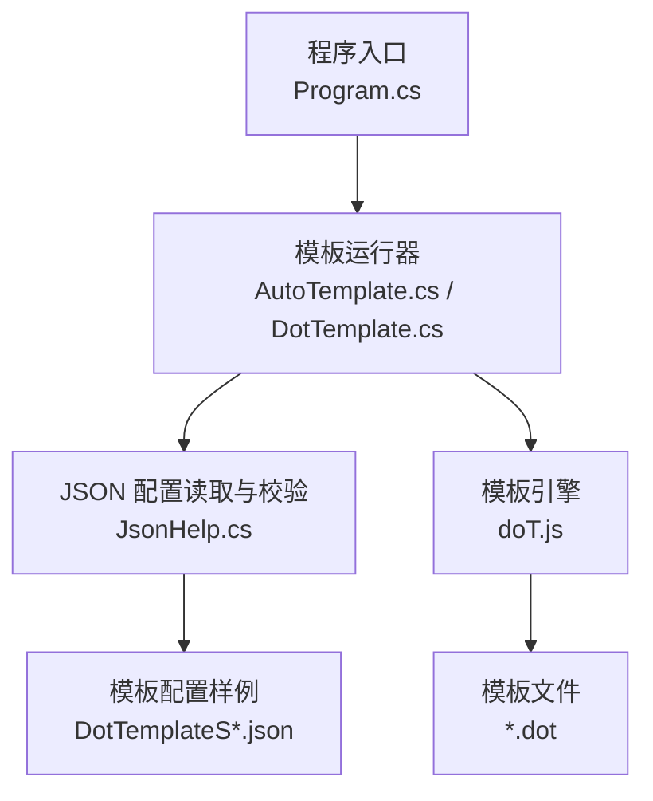
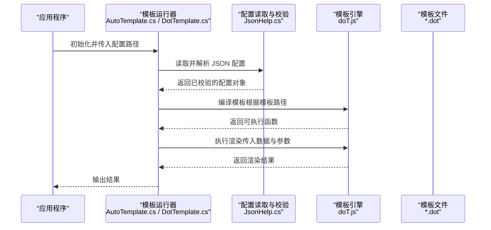
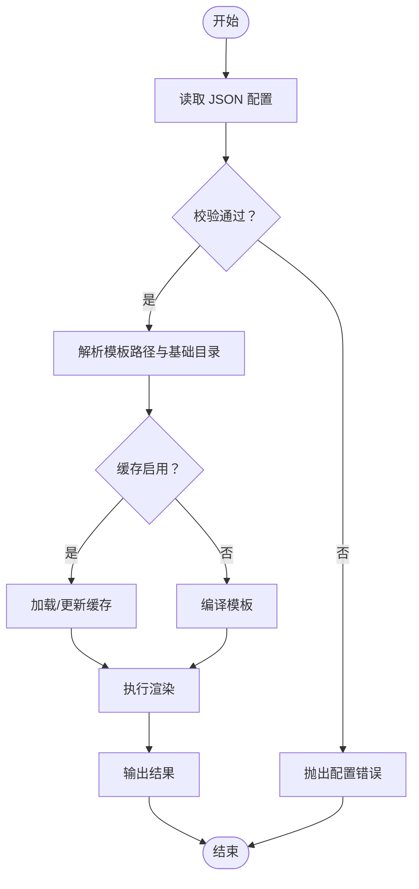
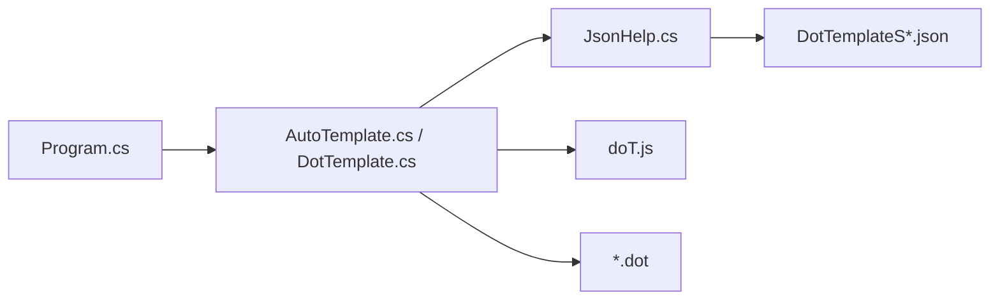

# 模板配置

<cite>
**本文引用的文件**   
- [DotTemplateS.json](file://src/DotTemplate.APP/DotTemplate/DotTemplateS.json)
- [DotTemplateS3.json](file://src/DotTemplate.APP/DotTemplate/DotTemplateS3.json)
- [DotTemplateS4.json](file://src/DotTemplate.APP/DotTemplate/DotTemplateS4.json)
- [DotTemplateS5.json](file://src/DotTemplate.APP/DotTemplate/DotTemplateS5.json)
- [DotTemplateS8.json](file://src/DotTemplate.APP/DotTemplate/DotTemplateS8.json)
- [ObjectCopy.dot](file://src/DotTemplate.APP/DotTemplate/ObjectCopy.dot)
- [Template.dot](file://src/DotTemplate.APP/DotTemplate/Template.dot)
- [Template_Caller.dot](file://src/DotTemplate.APP/DotTemplate/Template_Caller.dot)
- [AutoTemplate.cs](file://src/DotTemplate.APP/AutoTemplate.cs)
- [DotTemplate.cs](file://src/DotTemplate.APP/DotTemplate.cs)
- [IAutoTemplate.cs](file://src/DotTemplate.APP/IAutoTemplate.cs)
- [Program.cs](file://src/DotTemplate.APP/Program.cs)
- [JsonHelp.cs](file://src/AutoCode.XmlTemplate.External/JsonHelp.cs)
- [doT.js](file://src/AutoCode.XmlTemplate.External/doT.js)
</cite>

## 目录
1. [简介](#简介)
2. [项目结构](#项目结构)
3. [核心组件](#核心组件)
4. [架构总览](#架构总览)
5. [详细组件分析](#详细组件分析)
6. [依赖关系分析](#依赖关系分析)
7. [性能与缓存策略](#性能与缓存策略)
8. [故障排查指南](#故障排查指南)
9. [结论](#结论)
10. [附录：完整配置示例与最佳实践](#附录完整配置示例与最佳实践)

## 简介
本文件面向 AutoCode 模板系统的 JSON 配置文件，系统性说明其结构、字段含义、默认值与取值范围，并给出如何创建自定义模板配置、继承现有配置与覆盖特定设置的实践方法。同时提供模板路径配置、渲染参数设置、缓存策略与性能优化选项的完整示例，以及配置验证规则与错误排查方法，帮助读者快速上手并稳定使用。

## 项目结构
与模板配置直接相关的资源主要位于 DotTemplate.APP 项目的 DotTemplate 目录下，包含多个以“DotTemplateS*.json”命名的配置样例，以及若干“.dot”模板文件。运行时由 C# 代码加载 JSON 配置，解析后驱动 doT.js 引擎进行模板渲染，并通过 JsonHelp 等工具完成序列化与反序列化。

图表来源
- [Program.cs](file://src/DotTemplate.APP/Program.cs)
- [AutoTemplate.cs](file://src/DotTemplate.APP/AutoTemplate.cs)
- [DotTemplate.cs](file://src/DotTemplate.APP/DotTemplate.cs)
- [JsonHelp.cs](file://src/AutoCode.XmlTemplate.External/JsonHelp.cs)
- [doT.js](file://src/AutoCode.XmlTemplate.External/doT.js)
- [DotTemplateS.json](file://src/DotTemplate.APP/DotTemplate/DotTemplateS.json)
- [DotTemplateS3.json](file://src/DotTemplate.APP/DotTemplate/DotTemplateS3.json)
- [DotTemplateS4.json](file://src/DotTemplate.APP/DotTemplate/DotTemplateS4.json)
- [DotTemplateS5.json](file://src/DotTemplate.APP/DotTemplate/DotTemplateS5.json)
- [DotTemplateS8.json](file://src/DotTemplate.APP/DotTemplate/DotTemplateS8.json)
- [ObjectCopy.dot](file://src/DotTemplate.APP/DotTemplate/ObjectCopy.dot)
- [Template.dot](file://src/DotTemplate.APP/DotTemplate/Template.dot)
- [Template_Caller.dot](file://src/DotTemplate.APP/DotTemplate/Template_Caller.dot)

章节来源
- [Program.cs](file://src/DotTemplate.APP/Program.cs)
- [AutoTemplate.cs](file://src/DotTemplate.APP/AutoTemplate.cs)
- [DotTemplate.cs](file://src/DotTemplate.APP/DotTemplate.cs)
- [JsonHelp.cs](file://src/AutoCode.XmlTemplate.External/JsonHelp.cs)
- [doT.js](file://src/AutoCode.XmlTemplate.External/doT.js)

## 核心组件
- 模板运行器（C#）：负责加载 JSON 配置、解析模板路径与渲染参数、调用 doT.js 执行渲染、输出结果。典型实现位于 AutoTemplate.cs 与 DotTemplate.cs。
- 配置读写（C#）：通过 JsonHelp.cs 对 JSON 配置进行读取、校验与转换，确保必填项存在且类型正确。
- 模板引擎（JavaScript）：doT.js 作为模板渲染引擎，支持表达式、循环、条件等语法，配合 .dot 模板文件生成目标代码或文本。
- 模板与配置样例：DotTemplateS*.json 为不同场景的配置样例；*.dot 为模板定义文件。

章节来源
- [AutoTemplate.cs](file://src/DotTemplate.APP/AutoTemplate.cs)
- [DotTemplate.cs](file://src/DotTemplate.APP/DotTemplate.cs)
- [JsonHelp.cs](file://src/AutoCode.XmlTemplate.External/JsonHelp.cs)
- [doT.js](file://src/AutoCode.XmlTemplate.External/doT.js)
- [DotTemplateS.json](file://src/DotTemplate.APP/DotTemplate/DotTemplateS.json)
- [DotTemplateS3.json](file://src/DotTemplate.APP/DotTemplate/DotTemplateS3.json)
- [DotTemplateS4.json](file://src/DotTemplate.APP/DotTemplate/DotTemplateS4.json)
- [DotTemplateS5.json](file://src/DotTemplate.APP/DotTemplate/DotTemplateS5.json)
- [DotTemplateS8.json](file://src/DotTemplate.APP/DotTemplate/DotTemplateS8.json)
- [ObjectCopy.dot](file://src/DotTemplate.APP/DotTemplate/ObjectCopy.dot)
- [Template.dot](file://src/DotTemplate.APP/DotTemplate/Template.dot)
- [Template_Caller.dot](file://src/DotTemplate.APP/DotTemplate/Template_Caller.dot)

## 架构总览
下图展示了从配置到渲染的关键流程：程序启动后读取 JSON 配置，校验并构建渲染上下文，随后将模板与数据交给 doT.js 执行，最终输出结果。

图表来源
- [Program.cs](file://src/DotTemplate.APP/Program.cs)
- [AutoTemplate.cs](file://src/DotTemplate.APP/AutoTemplate.cs)
- [DotTemplate.cs](file://src/DotTemplate.APP/DotTemplate.cs)
- [JsonHelp.cs](file://src/AutoCode.XmlTemplate.External/JsonHelp.cs)
- [doT.js](file://src/AutoCode.XmlTemplate.External/doT.js)
- [Template.dot](file://src/DotTemplate.APP/DotTemplate/Template.dot)

## 详细组件分析

### JSON 配置结构与字段说明
以下为基于仓库中多份样例配置归纳出的通用结构。各样例文件在键名与取值上保持一致性，便于理解与扩展。

- 模板路径相关
  - templatePath：模板文件相对或绝对路径，指向 *.dot 文件。必填。
  - baseDir：模板基础目录，用于解析相对路径。可选，未指定时默认使用当前工作目录。
  - includePaths：模板包含搜索路径列表，用于 @include 或类似机制。可选。

- 渲染参数
  - data：渲染所需的数据对象，可为任意 JSON 结构。必填。
  - options：传递给 doT.js 的渲染选项，如是否启用调试、是否压缩输出等。可选。
  - context：额外上下文变量，供模板访问。可选。

- 缓存策略
  - cache.enabled：是否启用模板编译缓存。可选，默认 false。
  - cache.ttlSeconds：缓存过期时间（秒）。可选，默认 0（永不过期）。
  - cache.maxSize：最大缓存条目数。可选，默认 0（不限制）。

- 性能与行为
  - performance.strictMode：严格模式，开启后会进行更多校验。可选，默认 false。
  - performance.maxRenderTimeMs：单次渲染超时（毫秒）。可选，默认 0（不限制）。
  - logging.level：日志级别（如 none/info/debug）。可选，默认 info。

- 继承与覆盖
  - extends：继承的基础配置文件名或路径。可选。
  - overrides：覆盖父配置的键值对。可选。

注意：
- 上述字段为通用约定，具体可用键以实际样例为准。若某字段缺失，系统应回退到默认值或报错提示。
- 所有路径建议使用相对路径并以 baseDir 为根，避免跨平台问题。

章节来源
- [DotTemplateS.json](file://src/DotTemplate.APP/DotTemplate/DotTemplateS.json)
- [DotTemplateS3.json](file://src/DotTemplate.APP/DotTemplate/DotTemplateS3.json)
- [DotTemplateS4.json](file://src/DotTemplate.APP/DotTemplate/DotTemplateS4.json)
- [DotTemplateS5.json](file://src/DotTemplate.APP/DotTemplate/DotTemplateS5.json)
- [DotTemplateS8.json](file://src/DotTemplate.APP/DotTemplate/DotTemplateS8.json)

### 模板文件与 doT.js 引擎
- 模板文件（*.dot）：定义模板结构与占位符，支持表达式、循环、条件等。常见文件包括 Template.dot、ObjectCopy.dot、Template_Caller.dot。
- doT.js：轻量级模板引擎，提供高性能渲染能力。可通过 options 控制行为，例如是否启用调试、是否输出原始字符串等。

建议：
- 模板文件命名清晰，按功能划分目录。
- 避免在模板中进行复杂逻辑，尽量将数据处理放在 data/context 中预计算。

章节来源
- [Template.dot](file://src/DotTemplate.APP/DotTemplate/Template.dot)
- [ObjectCopy.dot](file://src/DotTemplate.APP/DotTemplate/ObjectCopy.dot)
- [Template_Caller.dot](file://src/DotTemplate.APP/DotTemplate/Template_Caller.dot)
- [doT.js](file://src/AutoCode.XmlTemplate.External/doT.js)

### 配置加载与校验流程

图表来源
- [JsonHelp.cs](file://src/AutoCode.XmlTemplate.External/JsonHelp.cs)
- [AutoTemplate.cs](file://src/DotTemplate.APP/AutoTemplate.cs)
- [DotTemplate.cs](file://src/DotTemplate.APP/DotTemplate.cs)

章节来源
- [JsonHelp.cs](file://src/AutoCode.XmlTemplate.External/JsonHelp.cs)
- [AutoTemplate.cs](file://src/DotTemplate.APP/AutoTemplate.cs)
- [DotTemplate.cs](file://src/DotTemplate.APP/DotTemplate.cs)

### 继承与覆盖机制
- extends：指定一个基础配置（另一个 JSON 文件），当前配置将合并基础配置。
- overrides：在当前配置中覆盖基础配置的键值。
- 合并策略：浅合并，同名键被覆盖；数组通常替换而非拼接（以实际实现为准）。

使用建议：
- 将公共配置抽离为 base.json，其他环境或场景通过 extends 引用。
- 仅在 overrides 中声明差异项，保持配置简洁。

章节来源
- [DotTemplateS.json](file://src/DotTemplate.APP/DotTemplate/DotTemplateS.json)
- [DotTemplateS3.json](file://src/DotTemplate.APP/DotTemplate/DotTemplateS3.json)
- [DotTemplateS4.json](file://src/DotTemplate.APP/DotTemplate/DotTemplateS4.json)
- [DotTemplateS5.json](file://src/DotTemplate.APP/DotTemplate/DotTemplateS5.json)
- [DotTemplateS8.json](file://src/DotTemplate.APP/DotTemplate/DotTemplateS8.json)

## 依赖关系分析
- 程序入口 Program.cs 负责初始化与调用模板运行器。
- 模板运行器 AutoTemplate.cs / DotTemplate.cs 负责加载配置、编译模板、执行渲染。
- JsonHelp.cs 负责 JSON 读取与校验。
- doT.js 提供模板渲染能力。
- 模板文件 *.dot 与配置样例 DotTemplateS*.json 构成输入。

图表来源
- [Program.cs](file://src/DotTemplate.APP/Program.cs)
- [AutoTemplate.cs](file://src/DotTemplate.APP/AutoTemplate.cs)
- [DotTemplate.cs](file://src/DotTemplate.APP/DotTemplate.cs)
- [JsonHelp.cs](file://src/AutoCode.XmlTemplate.External/JsonHelp.cs)
- [doT.js](file://src/AutoCode.XmlTemplate.External/doT.js)
- [DotTemplateS.json](file://src/DotTemplate.APP/DotTemplate/DotTemplateS.json)
- [DotTemplateS3.json](file://src/DotTemplate.APP/DotTemplate/DotTemplateS3.json)
- [DotTemplateS4.json](file://src/DotTemplate.APP/DotTemplate/DotTemplateS4.json)
- [DotTemplateS5.json](file://src/DotTemplate.APP/DotTemplate/DotTemplateS5.json)
- [DotTemplateS8.json](file://src/DotTemplate.APP/DotTemplate/DotTemplateS8.json)
- [Template.dot](file://src/DotTemplate.APP/DotTemplate/Template.dot)
- [ObjectCopy.dot](file://src/DotTemplate.APP/DotTemplate/ObjectCopy.dot)
- [Template_Caller.dot](file://src/DotTemplate.APP/DotTemplate/Template_Caller.dot)

章节来源
- [Program.cs](file://src/DotTemplate.APP/Program.cs)
- [AutoTemplate.cs](file://src/DotTemplate.APP/AutoTemplate.cs)
- [DotTemplate.cs](file://src/DotTemplate.APP/DotTemplate.cs)
- [JsonHelp.cs](file://src/AutoCode.XmlTemplate.External/JsonHelp.cs)
- [doT.js](file://src/AutoCode.XmlTemplate.External/doT.js)

## 性能与缓存策略
- 启用模板编译缓存：在配置中设置 cache.enabled=true，可减少重复编译开销。
- 设置 TTL：cache.ttlSeconds 控制缓存有效期，适合频繁变更的环境。
- 限制缓存大小：cache.maxSize 防止内存膨胀。
- 渲染超时：performance.maxRenderTimeMs 避免长时间阻塞。
- 严格模式：performance.strictMode=true 可在开发阶段发现潜在问题。
- 日志级别：logging.level=debug 有助于定位性能瓶颈。

建议：
- 生产环境启用缓存并设置合理 TTL。
- 大模板拆分与懒加载，减少一次性编译压力。
- 监控渲染耗时与缓存命中率，动态调整参数。

章节来源
- [DotTemplateS.json](file://src/DotTemplate.APP/DotTemplate/DotTemplateS.json)
- [DotTemplateS3.json](file://src/DotTemplate.APP/DotTemplate/DotTemplateS3.json)
- [DotTemplateS4.json](file://src/DotTemplate.APP/DotTemplate/DotTemplateS4.json)
- [DotTemplateS5.json](file://src/DotTemplate.APP/DotTemplate/DotTemplateS5.json)
- [DotTemplateS8.json](file://src/DotTemplate.APP/DotTemplate/DotTemplateS8.json)

## 故障排查指南
常见问题与处理：
- 配置缺失必填项：检查 templatePath 与 data 是否存在且类型正确。
- 模板路径无效：确认 baseDir 与 includePaths 设置，确保 *.dot 文件可达。
- 渲染超时：增大 performance.maxRenderTimeMs 或优化模板逻辑。
- 缓存异常：清理缓存或降低 maxSize，观察内存占用。
- 日志不足：提升 logging.level 至 debug，捕获详细错误信息。

排查步骤：
- 启用严格模式与调试日志。
- 逐步缩小配置范围，定位问题键。
- 单独测试模板文件，排除数据问题。
- 检查路径与权限，确保文件可读。

章节来源
- [JsonHelp.cs](file://src/AutoCode.XmlTemplate.External/JsonHelp.cs)
- [AutoTemplate.cs](file://src/DotTemplate.APP/AutoTemplate.cs)
- [DotTemplate.cs](file://src/DotTemplate.APP/DotTemplate.cs)

## 结论
AutoCode 模板系统的 JSON 配置提供了灵活的模板路径管理、渲染参数设置、缓存策略与性能调优选项。通过继承与覆盖机制，可实现配置复用与环境差异化。遵循本文的结构化说明与最佳实践，可快速搭建稳定高效的模板渲染流程。

## 附录：完整配置示例与最佳实践
以下示例展示如何组织配置、模板与数据，以实现可维护与高性能的模板渲染。

- 基础配置（base.json）
  - 定义公共的 templatePath、baseDir、includePaths、options、context。
  - 设置默认缓存策略与性能参数。

- 环境覆盖（dev.json、prod.json）
  - 通过 extends 引用 base.json。
  - 在 overrides 中覆盖 logging.level、performance.strictMode、cache.enabled 等。

- 模板文件（*.dot）
  - Template.dot：主模板，引用子模板。
  - ObjectCopy.dot：对象复制逻辑。
  - Template_Caller.dot：调用方模板。

- 数据与上下文（data/context）
  - data：业务数据对象。
  - context：全局常量或辅助函数。

- 运行流程
  - 程序启动，读取对应环境的配置。
  - 校验配置并解析路径。
  - 编译模板（启用缓存则命中缓存）。
  - 执行渲染并输出结果。

章节来源
- [DotTemplateS.json](file://src/DotTemplate.APP/DotTemplate/DotTemplateS.json)
- [DotTemplateS3.json](file://src/DotTemplate.APP/DotTemplate/DotTemplateS3.json)
- [DotTemplateS4.json](file://src/DotTemplate.APP/DotTemplate/DotTemplateS4.json)
- [DotTemplateS5.json](file://src/DotTemplate.APP/DotTemplate/DotTemplateS5.json)
- [DotTemplateS8.json](file://src/DotTemplate.APP/DotTemplate/DotTemplateS8.json)
- [Template.dot](file://src/DotTemplate.APP/DotTemplate/Template.dot)
- [ObjectCopy.dot](file://src/DotTemplate.APP/DotTemplate/ObjectCopy.dot)
- [Template_Caller.dot](file://src/DotTemplate.APP/DotTemplate/Template_Caller.dot)
- [AutoTemplate.cs](file://src/DotTemplate.APP/AutoTemplate.cs)
- [DotTemplate.cs](file://src/DotTemplate.APP/DotTemplate.cs)
- [JsonHelp.cs](file://src/AutoCode.XmlTemplate.External/JsonHelp.cs)
- [doT.js](file://src/AutoCode.XmlTemplate.External/doT.js)
