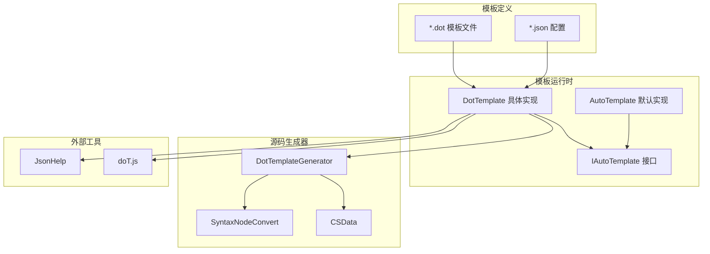
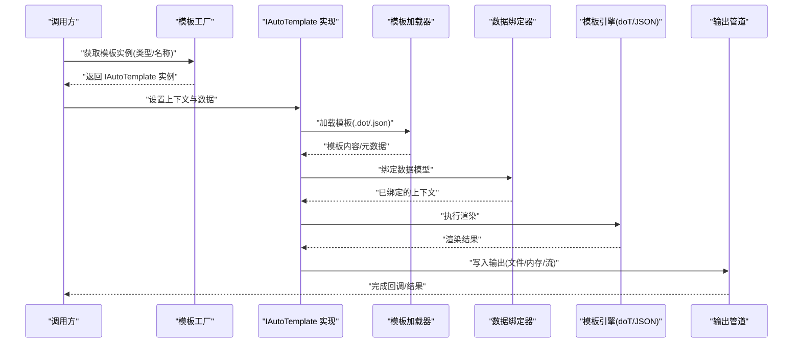
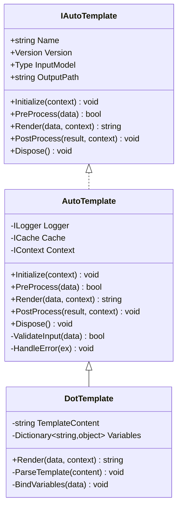
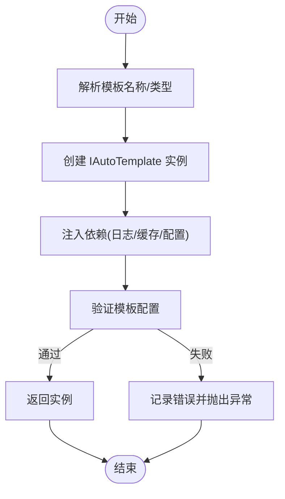
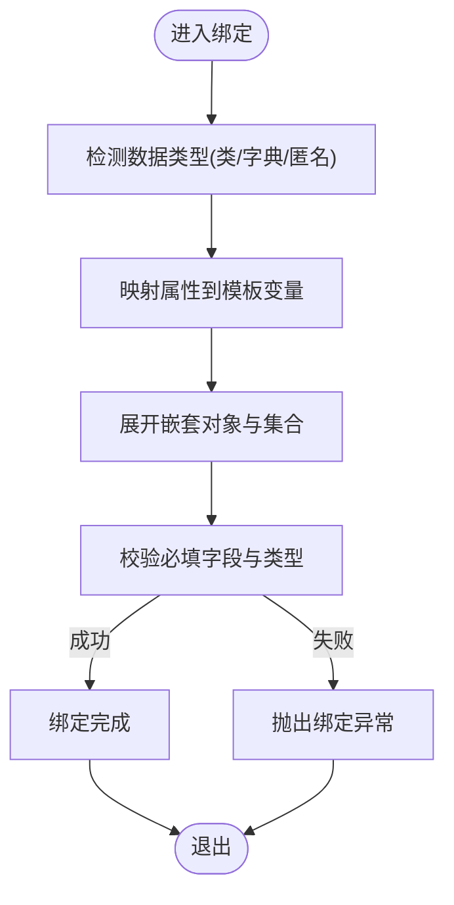
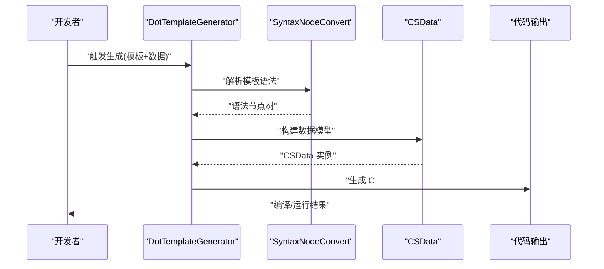
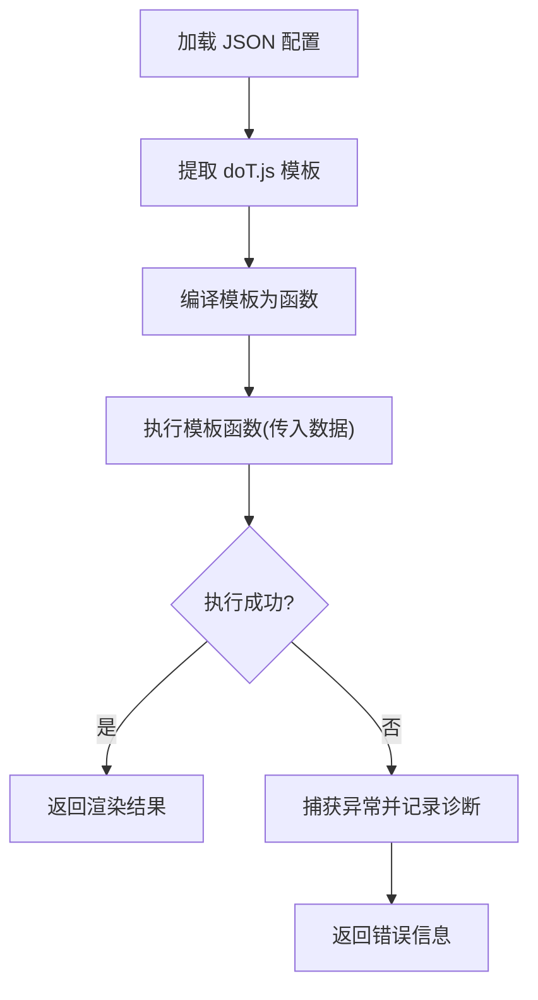
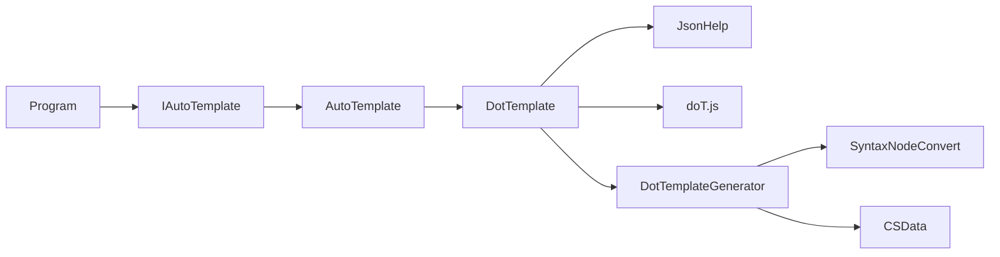

# 自定义模板开发

<cite>
**本文引用的文件**   
- [IAutoTemplate.cs](file://src/DotTemplate.APP/IAutoTemplate.cs)
- [AutoTemplate.cs](file://src/DotTemplate.APP/AutoTemplate.cs)
- [DotTemplate.cs](file://src/DotTemplate.APP/DotTemplate.cs)
- [Program.cs](file://src/DotTemplate.APP/Program.cs)
- [CSData.cs](file://src/AutoCode.XmlTemplate.SourceGenerator/CSData.cs)
- [DotTemplateGenerator.cs](file://src/AutoCode.XmlTemplate.SourceGenerator/DotTemplateGenerator.cs)
- [SyntaxNodeConvert.cs](file://src/AutoCode.XmlTemplate.SourceGenerator/SyntaxNodeConvert.cs)
- [JsonHelp.cs](file://src/AutoCode.XmlTemplate.External/JsonHelp.cs)
- [doT.js](file://src/AutoCode.XmlTemplate.External/doT.js)
- [DotTemplateS.json](file://src/DotTemplate.APP/DotTemplate/DotTemplateS.json)
- [ObjectCopy.dot](file://src/DotTemplate.APP/DotTemplate/ObjectCopy.dot)
- [Template.dot](file://src/DotTemplate.APP/DotTemplate/Template.dot)
</cite>

## 目录
1. [简介](#简介)
2. [项目结构](#项目结构)
3. [核心组件](#核心组件)
4. [架构总览](#架构总览)
5. [详细组件分析](#详细组件分析)
6. [依赖关系分析](#依赖关系分析)
7. [性能考量](#性能考量)
8. [故障排查指南](#故障排查指南)
9. [结论](#结论)
10. [附录](#附录)

## 简介
本文件面向希望基于 AutoCode 框架扩展或实现自定义模板引擎的开发者，系统讲解 IAutoTemplate 接口的实现方式、模板生命周期管理、数据绑定机制，以及如何创建自定义模板处理器、注册模板类型与集成第三方模板引擎。文档同时提供完整的自定义模板开发示例（模板工厂模式、依赖注入集成、异步模板处理），并给出模板测试策略、性能监控与部署打包的最佳实践。

## 项目结构
本项目围绕“模板定义 + 模板运行时 + 源码生成器 + 外部工具库”四个层次组织：
- 模板运行时层：IAutoTemplate 接口与默认实现，负责模板加载、渲染、生命周期钩子与上下文管理。
- 模板定义层：.dot 模板文件与 JSON 配置，描述模板元数据、输入模型与输出目标。
- 源码生成器层：将模板与数据源编译为 C# 代码，支持增量生成与语法节点转换。
- 外部工具层：JSON 解析与 doT.js 等第三方模板引擎集成能力。

**图表来源** 
- [IAutoTemplate.cs](file://src/DotTemplate.APP/IAutoTemplate.cs)
- [AutoTemplate.cs](file://src/DotTemplate.APP/AutoTemplate.cs)
- [DotTemplate.cs](file://src/DotTemplate.APP/DotTemplate.cs)
- [DotTemplateGenerator.cs](file://src/AutoCode.XmlTemplate.SourceGenerator/DotTemplateGenerator.cs)
- [SyntaxNodeConvert.cs](file://src/AutoCode.XmlTemplate.SourceGenerator/SyntaxNodeConvert.cs)
- [CSData.cs](file://src/AutoCode.XmlTemplate.SourceGenerator/CSData.cs)
- [JsonHelp.cs](file://src/AutoCode.XmlTemplate.External/JsonHelp.cs)
- [doT.js](file://src/AutoCode.XmlTemplate.External/doT.js)
- [DotTemplateS.json](file://src/DotTemplate.APP/DotTemplate/DotTemplateS.json)
- [ObjectCopy.dot](file://src/DotTemplate.APP/DotTemplate/ObjectCopy.dot)
- [Template.dot](file://src/DotTemplate.APP/DotTemplate/Template.dot)

**章节来源**
- [IAutoTemplate.cs](file://src/DotTemplate.APP/IAutoTemplate.cs)
- [AutoTemplate.cs](file://src/DotTemplate.APP/AutoTemplate.cs)
- [DotTemplate.cs](file://src/DotTemplate.APP/DotTemplate.cs)
- [Program.cs](file://src/DotTemplate.APP/Program.cs)

## 核心组件
- IAutoTemplate 接口：定义模板的统一契约，包括模板元数据访问、渲染入口、生命周期钩子、上下文管理与错误处理。
- AutoTemplate 基类：提供通用生命周期管理、缓存、日志、异常封装与默认行为。
- DotTemplate 实现：针对 .dot 模板与 JSON 配置的渲染实现，包含数据绑定、变量替换、循环与条件逻辑。
- 模板工厂与注册中心：集中管理模板类型、实例化策略与依赖注入容器。
- 源码生成器：将模板与数据转换为可执行代码，提升运行期性能。
- 外部工具：JSON 解析与 doT.js 集成，用于复杂表达式与高性能渲染。

**章节来源**
- [IAutoTemplate.cs](file://src/DotTemplate.APP/IAutoTemplate.cs)
- [AutoTemplate.cs](file://src/DotTemplate.APP/AutoTemplate.cs)
- [DotTemplate.cs](file://src/DotTemplate.APP/DotTemplate.cs)
- [Program.cs](file://src/DotTemplate.APP/Program.cs)

## 架构总览
下图展示了从模板定义到最终输出的端到端流程，涵盖加载、解析、渲染、生成与缓存的关键环节。

**图表来源** 
- [DotTemplate.cs](file://src/DotTemplate.APP/DotTemplate.cs)
- [JsonHelp.cs](file://src/AutoCode.XmlTemplate.External/JsonHelp.cs)
- [doT.js](file://src/AutoCode.XmlTemplate.External/doT.js)
- [Program.cs](file://src/DotTemplate.APP/Program.cs)

## 详细组件分析

### IAutoTemplate 接口与生命周期
- 职责边界
  - 模板元数据：名称、版本、作者、描述、输入模型类型、输出路径等。
  - 渲染入口：同步/异步渲染方法，支持多种数据源与输出目标。
  - 生命周期钩子：初始化、预处理、渲染前、渲染后、清理等阶段。
  - 上下文管理：环境变量、服务容器、临时存储、错误收集。
  - 错误处理：统一异常封装、诊断信息、重试策略。
- 生命周期管理建议
  - 使用工厂模式创建实例，避免重复加载模板。
  - 在预处理阶段校验数据完整性，尽早失败。
  - 在渲染后阶段进行结果校验与格式化。
  - 在清理阶段释放资源（文件句柄、缓存项）。

**图表来源** 
- [IAutoTemplate.cs](file://src/DotTemplate.APP/IAutoTemplate.cs)
- [AutoTemplate.cs](file://src/DotTemplate.APP/AutoTemplate.cs)
- [DotTemplate.cs](file://src/DotTemplate.APP/DotTemplate.cs)

**章节来源**
- [IAutoTemplate.cs](file://src/DotTemplate.APP/IAutoTemplate.cs)
- [AutoTemplate.cs](file://src/DotTemplate.APP/AutoTemplate.cs)
- [DotTemplate.cs](file://src/DotTemplate.APP/DotTemplate.cs)

### 模板工厂模式与依赖注入
- 工厂职责
  - 根据模板名称或类型解析并创建 IAutoTemplate 实例。
  - 注入依赖（日志、缓存、配置、服务容器）。
  - 管理实例生命周期（单例、瞬态、作用域）。
- 依赖注入集成
  - 在 Program.cs 中注册模板工厂与具体实现。
  - 通过构造函数注入 ILogger、ICache、IConfiguration 等。
  - 支持按环境切换不同模板实现（开发/生产）。

**图表来源** 
- [Program.cs](file://src/DotTemplate.APP/Program.cs)
- [AutoTemplate.cs](file://src/DotTemplate.APP/AutoTemplate.cs)

**章节来源**
- [Program.cs](file://src/DotTemplate.APP/Program.cs)
- [AutoTemplate.cs](file://src/DotTemplate.APP/AutoTemplate.cs)

### 数据绑定机制
- 绑定策略
  - 强类型模型绑定：基于 C# 类的属性映射。
  - 动态对象绑定：支持字典、匿名对象、JSON 反序列化。
  - 嵌套对象展开：自动递归绑定子对象与集合。
- 变量命名规范
  - 模板中使用约定命名（如 {{Name}}、{{Item.Property}}）。
  - 支持函数调用与表达式（由 doT.js 或自定义解析器处理）。
- 错误处理
  - 缺失字段时提供默认值或抛出明确异常。
  - 类型不匹配时尝试转换或记录诊断信息。

**图表来源** 
- [DotTemplate.cs](file://src/DotTemplate.APP/DotTemplate.cs)
- [JsonHelp.cs](file://src/AutoCode.XmlTemplate.External/JsonHelp.cs)

**章节来源**
- [DotTemplate.cs](file://src/DotTemplate.APP/DotTemplate.cs)
- [JsonHelp.cs](file://src/AutoCode.XmlTemplate.External/JsonHelp.cs)

### 源码生成器与模板处理
- 生成器职责
  - 读取 .dot 模板与 JSON 配置，构建 CSData 模型。
  - 通过 SyntaxNodeConvert 生成 C# 语法树。
  - 输出可编译的代码文件或嵌入资源。
- 增量生成
  - 基于文件哈希与时间戳判断是否需要重新生成。
  - 支持部分更新与冲突合并。
- 错误诊断
  - 生成阶段捕获语法错误并提供定位信息。
  - 输出诊断报告便于调试。

**图表来源** 
- [DotTemplateGenerator.cs](file://src/AutoCode.XmlTemplate.SourceGenerator/DotTemplateGenerator.cs)
- [SyntaxNodeConvert.cs](file://src/AutoCode.XmlTemplate.SourceGenerator/SyntaxNodeConvert.cs)
- [CSData.cs](file://src/AutoCode.XmlTemplate.SourceGenerator/CSData.cs)

**章节来源**
- [DotTemplateGenerator.cs](file://src/AutoCode.XmlTemplate.SourceGenerator/DotTemplateGenerator.cs)
- [SyntaxNodeConvert.cs](file://src/AutoCode.XmlTemplate.SourceGenerator/SyntaxNodeConvert.cs)
- [CSData.cs](file://src/AutoCode.XmlTemplate.SourceGenerator/CSData.cs)

### 第三方模板引擎集成（doT.js）
- 集成方式
  - 通过 JsonHelp 解析 JSON 配置，提取 doT.js 模板字符串。
  - 在渲染阶段调用 doT.js 执行模板逻辑。
  - 支持自定义过滤器与函数扩展。
- 性能优化
  - 预编译模板字符串为函数，减少解析开销。
  - 缓存编译结果与中间状态。
- 错误处理
  - 捕获 doT.js 异常并转换为统一异常类型。
  - 提供模板片段与上下文信息便于定位问题。

**图表来源** 
- [JsonHelp.cs](file://src/AutoCode.XmlTemplate.External/JsonHelp.cs)
- [doT.js](file://src/AutoCode.XmlTemplate.External/doT.js)

**章节来源**
- [JsonHelp.cs](file://src/AutoCode.XmlTemplate.External/JsonHelp.cs)
- [doT.js](file://src/AutoCode.XmlTemplate.External/doT.js)

### 模板测试策略
- 单元测试
  - 覆盖正常路径、边界条件与异常场景。
  - 使用 Mock 数据验证绑定与渲染结果。
- 集成测试
  - 端到端验证模板加载、渲染与输出。
  - 模拟真实环境与依赖（数据库、文件系统）。
- 性能测试
  - 基准测试渲染耗时与内存占用。
  - 压力测试高并发场景下的稳定性。

**章节来源**
- [Program.cs](file://src/DotTemplate.APP/Program.cs)
- [DotTemplate.cs](file://src/DotTemplate.APP/DotTemplate.cs)

### 性能监控与最佳实践
- 监控指标
  - 渲染耗时、内存峰值、错误率、缓存命中率。
  - 模板文件大小与复杂度统计。
- 优化建议
  - 启用模板缓存与增量生成。
  - 拆分大模板为小模块，提高复用性。
  - 使用异步渲染与并行处理提升吞吐。
- 部署打包
  - 将模板文件嵌入资源或随应用发布。
  - 使用配置文件管理环境差异。
  - 提供回滚机制与灰度发布支持。

**章节来源**
- [AutoTemplate.cs](file://src/DotTemplate.APP/AutoTemplate.cs)
- [DotTemplate.cs](file://src/DotTemplate.APP/DotTemplate.cs)

## 依赖关系分析
下图展示了核心组件之间的依赖关系，帮助理解耦合度与扩展点。

**图表来源** 
- [IAutoTemplate.cs](file://src/DotTemplate.APP/IAutoTemplate.cs)
- [AutoTemplate.cs](file://src/DotTemplate.APP/AutoTemplate.cs)
- [DotTemplate.cs](file://src/DotTemplate.APP/DotTemplate.cs)
- [JsonHelp.cs](file://src/AutoCode.XmlTemplate.External/JsonHelp.cs)
- [doT.js](file://src/AutoCode.XmlTemplate.External/doT.js)
- [DotTemplateGenerator.cs](file://src/AutoCode.XmlTemplate.SourceGenerator/DotTemplateGenerator.cs)
- [SyntaxNodeConvert.cs](file://src/AutoCode.XmlTemplate.SourceGenerator/SyntaxNodeConvert.cs)
- [CSData.cs](file://src/AutoCode.XmlTemplate.SourceGenerator/CSData.cs)
- [Program.cs](file://src/DotTemplate.APP/Program.cs)

**章节来源**
- [IAutoTemplate.cs](file://src/DotTemplate.APP/IAutoTemplate.cs)
- [AutoTemplate.cs](file://src/DotTemplate.APP/AutoTemplate.cs)
- [DotTemplate.cs](file://src/DotTemplate.APP/DotTemplate.cs)
- [Program.cs](file://src/DotTemplate.APP/Program.cs)

## 性能考量
- 渲染性能
  - 预编译模板与缓存结果，避免重复解析。
  - 使用流式输出减少内存占用。
- 生成性能
  - 增量生成仅处理变更文件。
  - 并行生成多个模板以提升效率。
- 资源管理
  - 及时释放文件句柄与临时对象。
  - 使用对象池减少 GC 压力。

[本节为通用指导，无需特定文件引用]

## 故障排查指南
- 常见问题
  - 模板加载失败：检查文件路径与权限。
  - 数据绑定错误：确认模型属性与模板变量一致。
  - 渲染异常：查看 doT.js 错误堆栈与上下文。
- 诊断工具
  - 启用详细日志记录模板加载与渲染过程。
  - 使用调试器断点检查数据流与状态。
- 恢复策略
  - 提供默认模板与降级方案。
  - 支持热重载与动态更新。

**章节来源**
- [AutoTemplate.cs](file://src/DotTemplate.APP/AutoTemplate.cs)
- [DotTemplate.cs](file://src/DotTemplate.APP/DotTemplate.cs)

## 结论
通过 IAutoTemplate 接口与 AutoTemplate 基类，开发者可以高效构建可扩展、高性能的自定义模板引擎。结合模板工厂、依赖注入、源码生成器与第三方引擎集成，能够灵活应对各种业务场景。遵循本文提供的测试策略、性能监控与部署最佳实践，可确保模板系统的稳定性与可维护性。

[本节为总结性内容，无需特定文件引用]

## 附录
- 模板示例文件
  - [DotTemplateS.json](file://src/DotTemplate.APP/DotTemplate/DotTemplateS.json)
  - [ObjectCopy.dot](file://src/DotTemplate.APP/DotTemplate/ObjectCopy.dot)
  - [Template.dot](file://src/DotTemplate.APP/DotTemplate/Template.dot)

[本节为参考信息，无需特定文件引用]
