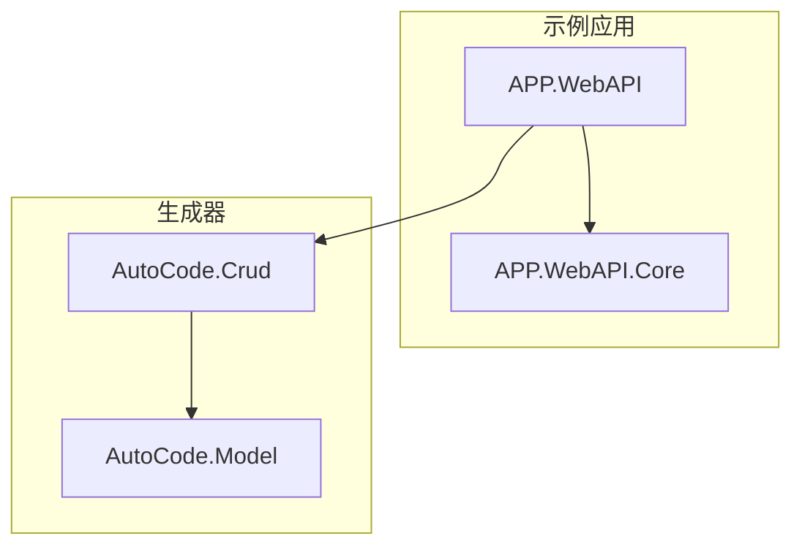
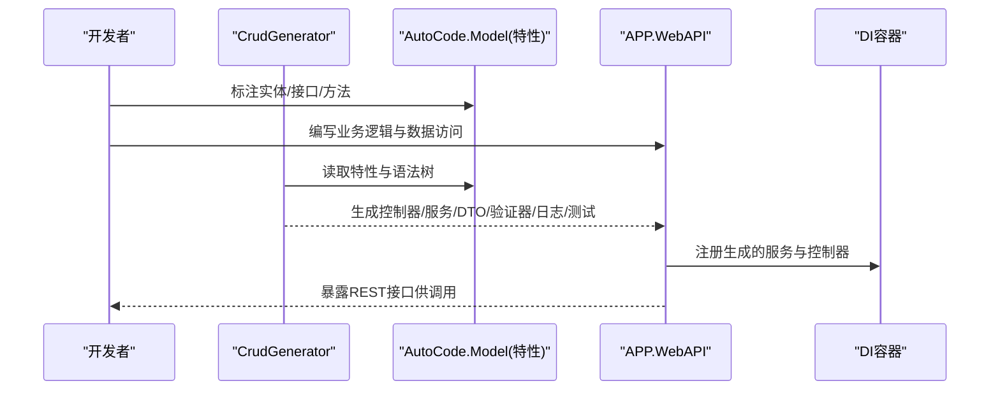
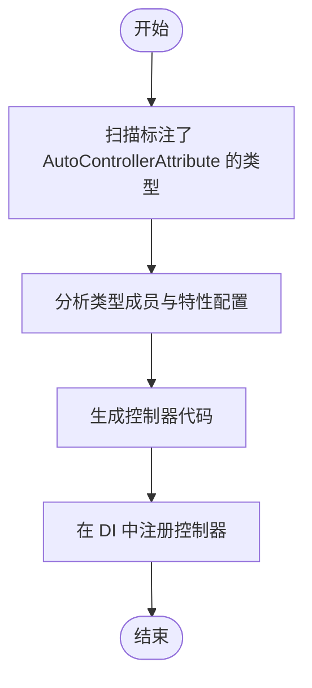
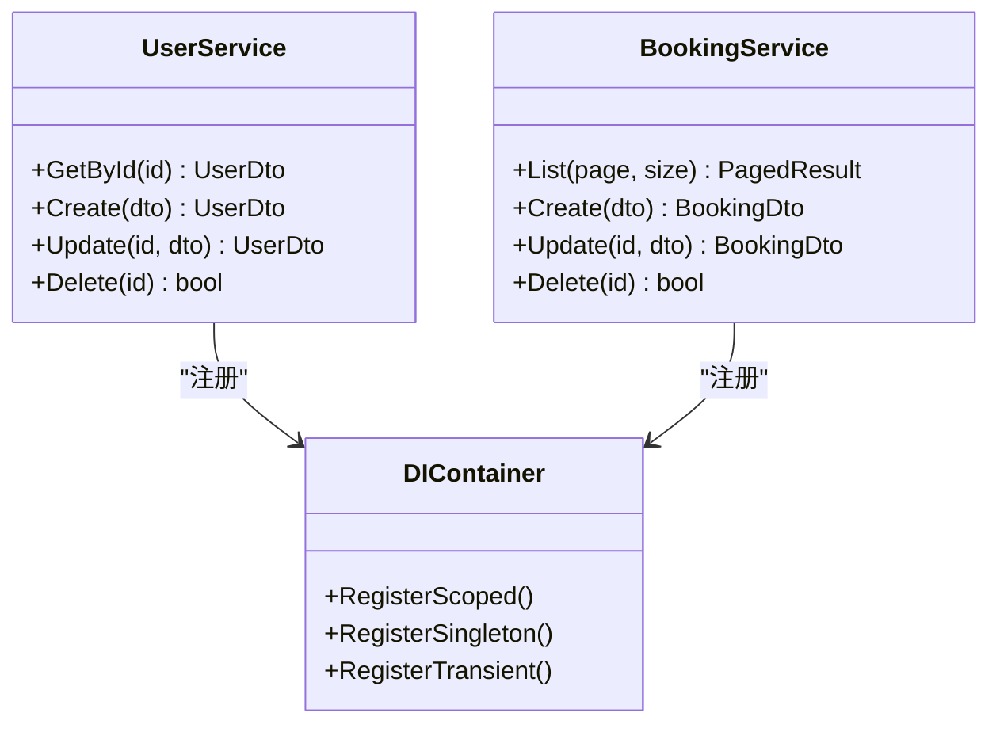
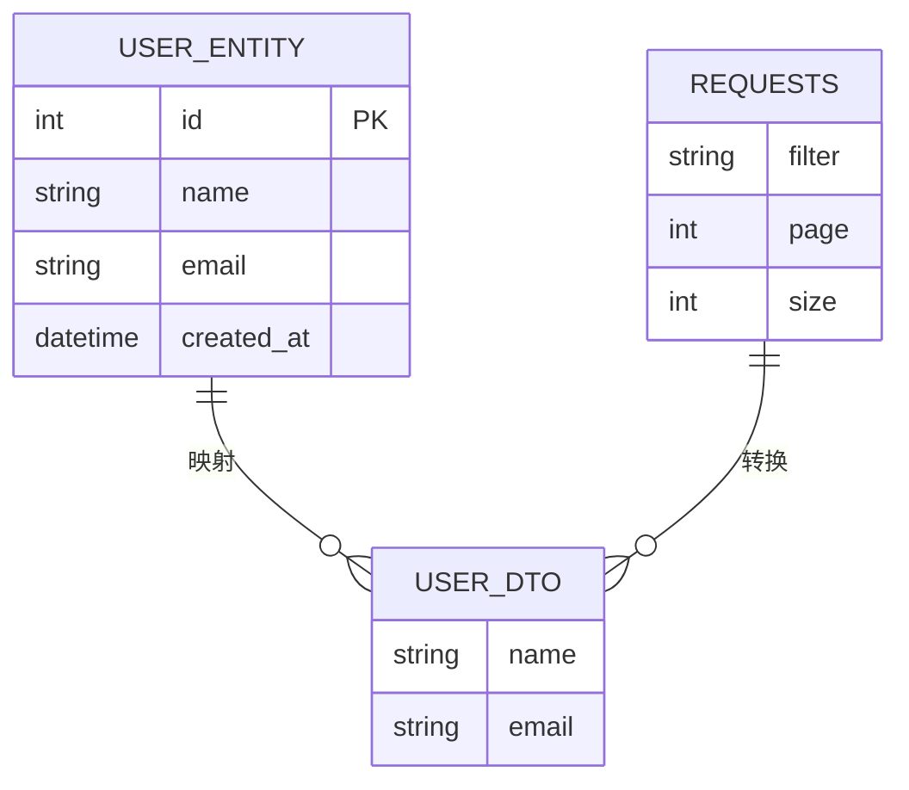
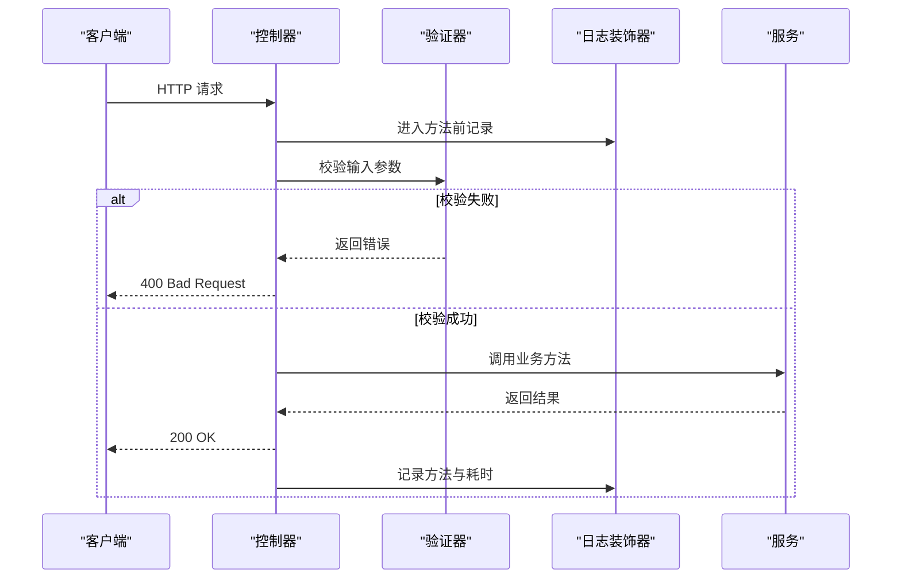
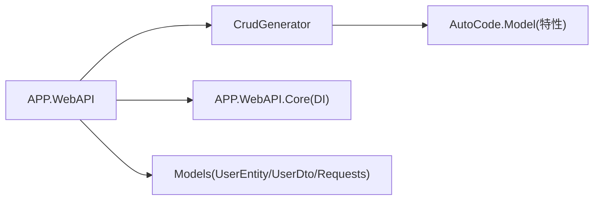

# CRUD生成器

<cite>
**本文引用的文件**
- [CrudGenerator.cs](file://src/AutoCode.Crud/CrudGenerator.cs)
- [AutoCode.Crud.csproj](file://src/AutoCode.Crud/AutoCode.Crud.csproj)
- [AutoControllerAttribute.cs](file://src/AutoCode.Model/AutoControllerAttribute.cs)
- [AutoCrudAttribute.cs](file://src/AutoCode.Model/AutoCrudAttribute.cs)
- [AutoDTOAttribute.cs](file://src/AutoCode.Model/AutoDTOAttribute.cs)
- [AutoLogAttribute.cs](file://src/AutoCode.Model/AutoLogAttribute.cs)
- [AutoTestAttribute.cs](file://src/AutoCode.Model/AutoTestAttribute.cs)
- [AutoValidatorAttribute.cs](file://src/AutoCode.Model/AutoValidatorAttribute.cs)
- [Program.cs](file://src/APP.WebAPI/Program.cs)
- [BookingController.cs](file://src/APP.WebAPI/Controllers/BookingController.cs)
- [UserService.cs](file://src/APP.WebAPI/Services/UserService.cs)
- [UserEntity.cs](file://src/APP.WebAPI/Models/UserEntity.cs)
- [UserDto.cs](file://src/APP.WebAPI/Models/UserDto.cs)
- [Requests.cs](file://src/APP.WebAPI/Models/Requests.cs)
- [DependencyInjectionServiceCollectionExtensions.cs](file://src/APP.WebAPI.Core/DependencyInjection/DependencyInjectionServiceCollectionExtensions.cs)
- [ServiceCollectionExtensions.cs](file://src/APP.WebAPI.Core/Application/Extensions/ServiceCollectionExtensions.cs)
</cite>

## 目录
1. [简介](#简介)
2. [项目结构](#项目结构)
3. [核心组件](#核心组件)
4. [架构总览](#架构总览)
5. [详细组件分析](#详细组件分析)
6. [依赖关系分析](#依赖关系分析)
7. [性能考虑](#性能考虑)
8. [故障排查指南](#故障排查指南)
9. [结论](#结论)
10. [附录](#附录)

## 简介
本仓库是一个面向 .NET 的“CRUD 生成器”工程，通过源码生成器与特性标注，自动为实体模型生成控制器、服务、DTO、验证器、日志装饰器以及测试代码。其目标是减少样板代码、统一分层规范、提升开发效率并保证一致性。

## 项目结构
- AutoCode.Crud：CRUD 源码生成器核心实现，基于特性扫描与语法树分析，输出控制器与服务等代码。
- AutoCode.Model：定义各类特性（如 AutoControllerAttribute、AutoCrudAttribute、AutoDTOAttribute 等），用于标注需要生成的目标类型。
- APP.WebAPI：示例 Web API 应用，包含控制器、服务、模型与请求 DTO，展示生成器的使用场景。
- APP.WebAPI.Core：依赖注入与应用扩展，提供生命周期管理与服务注册能力。
- 其他模块：映射、日志、验证、测试、模板等辅助生成器与工具。

图表来源
- [Program.cs](file://src/APP.WebAPI/Program.cs)
- [CrudGenerator.cs](file://src/AutoCode.Crud/CrudGenerator.cs)
- [AutoControllerAttribute.cs](file://src/AutoCode.Model/AutoControllerAttribute.cs)

章节来源
- [AutoCode.Crud.csproj](file://src/AutoCode.Crud/AutoCode.Crud.csproj)
- [Program.cs](file://src/APP.WebAPI/Program.cs)

## 核心组件
- 特性层（AutoCode.Model）
  - AutoControllerAttribute：标记需要自动生成控制器的实体或接口。
  - AutoCrudAttribute：配置 CRUD 行为（如启用/禁用操作、路由前缀、分页策略等）。
  - AutoDTOAttribute：标记需要生成 DTO 的属性或类型。
  - AutoLogAttribute：标记需要生成日志装饰的方法或类。
  - AutoTestAttribute：标记需要生成单元测试的目标。
  - AutoValidatorAttribute：标记需要生成验证规则的类型。
- 生成器（AutoCode.Crud）
  - CrudGenerator：解析特性与语法树，生成控制器、服务、DTO、验证器等代码。
- 示例应用（APP.WebAPI）
  - Program：应用启动与 DI 配置。
  - Controllers/Services/Models：演示 CRUD 的使用与集成。

章节来源
- [AutoControllerAttribute.cs](file://src/AutoCode.Model/AutoControllerAttribute.cs)
- [AutoCrudAttribute.cs](file://src/AutoCode.Model/AutoCrudAttribute.cs)
- [AutoDTOAttribute.cs](file://src/AutoCode.Model/AutoDTOAttribute.cs)
- [AutoLogAttribute.cs](file://src/AutoCode.Model/AutoLogAttribute.cs)
- [AutoTestAttribute.cs](file://src/AutoCode.Model/AutoTestAttribute.cs)
- [AutoValidatorAttribute.cs](file://src/AutoCode.Model/AutoValidatorAttribute.cs)
- [CrudGenerator.cs](file://src/AutoCode.Crud/CrudGenerator.cs)

## 架构总览
整体采用“特性驱动 + 源码生成器”的分层架构：
- 开发者在模型或服务上标注特性。
- 编译期由源码生成器扫描并生成控制器、服务、DTO、验证器、日志装饰与测试代码。
- 运行时通过依赖注入将生成的服务与控制器装配到 Web API。

图表来源
- [CrudGenerator.cs](file://src/AutoCode.Crud/CrudGenerator.cs)
- [AutoControllerAttribute.cs](file://src/AutoCode.Model/AutoControllerAttribute.cs)
- [AutoCrudAttribute.cs](file://src/AutoCode.Model/AutoCrudAttribute.cs)
- [Program.cs](file://src/APP.WebAPI/Program.cs)

## 详细组件分析

### 控制器生成（AutoControllerAttribute + CrudGenerator）
- 作用：根据 AutoControllerAttribute 标注，自动生成 REST 控制器，包括 GET/POST/PUT/DELETE 等常用 CRUD 端点。
- 关键点：
  - 路由前缀与动作命名由特性与约定决定。
  - 参数绑定、返回类型与异常处理遵循框架最佳实践。
  - 可与 AutoCrudAttribute 配合调整行为（如是否启用删除、分页等）。

图表来源
- [AutoControllerAttribute.cs](file://src/AutoCode.Model/AutoControllerAttribute.cs)
- [CrudGenerator.cs](file://src/AutoCode.Crud/CrudGenerator.cs)

章节来源
- [AutoControllerAttribute.cs](file://src/AutoCode.Model/AutoControllerAttribute.cs)
- [CrudGenerator.cs](file://src/AutoCode.Crud/CrudGenerator.cs)

### 服务生成与依赖注入（AutoCrudAttribute + DI）
- 作用：根据 AutoCrudAttribute 标注，生成服务类并提供统一的 CRUD 方法；通过 DI 容器进行生命周期管理。
- 关键点：
  - 支持按作用域/单例/瞬态等生命周期注册。
  - 可结合 ServiceCollectionExtensions 集中注册与扩展。

图表来源
- [UserService.cs](file://src/APP.WebAPI/Services/UserService.cs)
- [BookingController.cs](file://src/APP.WebAPI/Controllers/BookingController.cs)
- [DependencyInjectionServiceCollectionExtensions.cs](file://src/APP.WebAPI.Core/DependencyInjection/DependencyInjectionServiceCollectionExtensions.cs)

章节来源
- [AutoCrudAttribute.cs](file://src/AutoCode.Model/AutoCrudAttribute.cs)
- [DependencyInjectionServiceCollectionExtensions.cs](file://src/APP.WebAPI.Core/DependencyInjection/DependencyInjectionServiceCollectionExtensions.cs)
- [ServiceCollectionExtensions.cs](file://src/APP.WebAPI.Core/Application/Extensions/ServiceCollectionExtensions.cs)

### DTO 与请求模型（AutoDTOAttribute + Models）
- 作用：根据 AutoDTOAttribute 标注，自动生成数据传输对象与请求模型，确保前后端契约一致。
- 关键点：
  - 字段映射、命名策略与可选属性由特性与生成器约定。
  - 与控制器和服务的参数/返回值无缝对接。

图表来源
- [UserEntity.cs](file://src/APP.WebAPI/Models/UserEntity.cs)
- [UserDto.cs](file://src/APP.WebAPI/Models/UserDto.cs)
- [Requests.cs](file://src/APP.WebAPI/Models/Requests.cs)

章节来源
- [AutoDTOAttribute.cs](file://src/AutoCode.Model/AutoDTOAttribute.cs)
- [UserEntity.cs](file://src/APP.WebAPI/Models/UserEntity.cs)
- [UserDto.cs](file://src/APP.WebAPI/Models/UserDto.cs)
- [Requests.cs](file://src/APP.WebAPI/Models/Requests.cs)

### 日志与验证（AutoLogAttribute + AutoValidatorAttribute）
- 作用：为控制器或服务方法自动生成日志装饰与验证规则，减少重复代码。
- 关键点：
  - 日志装饰器统一记录入参、出参与异常信息。
  - 验证器基于特性与约定生成校验逻辑，并在控制器入口执行。

图表来源
- [AutoLogAttribute.cs](file://src/AutoCode.Model/AutoLogAttribute.cs)
- [AutoValidatorAttribute.cs](file://src/AutoCode.Model/AutoValidatorAttribute.cs)

章节来源
- [AutoLogAttribute.cs](file://src/AutoCode.Model/AutoLogAttribute.cs)
- [AutoValidatorAttribute.cs](file://src/AutoCode.Model/AutoValidatorAttribute.cs)

### 测试生成（AutoTestAttribute）
- 作用：根据 AutoTestAttribute 标注，自动生成单元测试骨架，覆盖常见 CRUD 场景。
- 关键点：
  - 测试用例包含正常路径与边界条件。
  - 与 DI 容器集成，便于模拟依赖。

章节来源
- [AutoTestAttribute.cs](file://src/AutoCode.Model/AutoTestAttribute.cs)

## 依赖关系分析
- 生成器对特性的强依赖：CrudGenerator 依赖 AutoCode.Model 中的特性定义来识别目标类型与行为。
- 应用对 DI 的依赖：APP.WebAPI 通过 Core 层的扩展方法进行服务注册，确保生成的服务与控制器的生命周期正确。
- 示例模型与 DTO 的映射：UserEntity、UserDto、Requests 之间保持清晰的映射关系，便于生成器推断与转换。

图表来源
- [CrudGenerator.cs](file://src/AutoCode.Crud/CrudGenerator.cs)
- [AutoControllerAttribute.cs](file://src/AutoCode.Model/AutoControllerAttribute.cs)
- [DependencyInjectionServiceCollectionExtensions.cs](file://src/APP.WebAPI.Core/DependencyInjection/DependencyInjectionServiceCollectionExtensions.cs)
- [UserEntity.cs](file://src/APP.WebAPI/Models/UserEntity.cs)
- [UserDto.cs](file://src/APP.WebAPI/Models/UserDto.cs)
- [Requests.cs](file://src/APP.WebAPI/Models/Requests.cs)

章节来源
- [AutoCode.Crud.csproj](file://src/AutoCode.Crud/AutoCode.Crud.csproj)
- [DependencyInjectionServiceCollectionExtensions.cs](file://src/APP.WebAPI.Core/DependencyInjection/DependencyInjectionServiceCollectionExtensions.cs)

## 性能考虑
- 编译期生成：所有样板代码在编译时生成，运行时无额外反射开销。
- DI 生命周期选择：合理选择 Scoped/Singleton/Transient，避免不必要的实例创建。
- DTO 映射优化：尽量使用轻量级 DTO，减少不必要字段传输。
- 日志级别控制：生产环境降低日志级别，避免 I/O 瓶颈。

## 故障排查指南
- 未生成控制器或服务
  - 检查是否正确标注 AutoControllerAttribute/AutoCrudAttribute。
  - 确认生成器项目已引用且编译选项正确。
- 路由或动作名不符合预期
  - 核对 AutoCrudAttribute 的路由前缀与动作命名策略。
- 验证失败或日志缺失
  - 检查 AutoValidatorAttribute/AutoLogAttribute 的标注位置与作用域。
- DI 注册问题
  - 确认 ServiceCollectionExtensions 是否正确注册生成的服务。

章节来源
- [AutoControllerAttribute.cs](file://src/AutoCode.Model/AutoControllerAttribute.cs)
- [AutoCrudAttribute.cs](file://src/AutoCode.Model/AutoCrudAttribute.cs)
- [AutoValidatorAttribute.cs](file://src/AutoCode.Model/AutoValidatorAttribute.cs)
- [AutoLogAttribute.cs](file://src/AutoCode.Model/AutoLogAttribute.cs)
- [DependencyInjectionServiceCollectionExtensions.cs](file://src/APP.WebAPI.Core/DependencyInjection/DependencyInjectionServiceCollectionExtensions.cs)

## 结论
该 CRUD 生成器通过特性驱动与源码生成技术，显著减少了样板代码，提升了开发效率与一致性。结合 DI 与分层架构，能够在大型项目中稳定落地。建议在实际使用中严格遵循特性标注与命名约定，以获得最佳的生成效果与维护体验。

## 附录
- 使用建议
  - 在模型或服务上仅标注必要特性，避免过度注解。
  - 定期审查生成代码，确保与业务演进保持一致。
  - 利用测试生成器快速补齐覆盖率。
- 扩展方向
  - 自定义特性以适配特定业务规则。
  - 集成更多中间件（如缓存、限流）于生成流程。