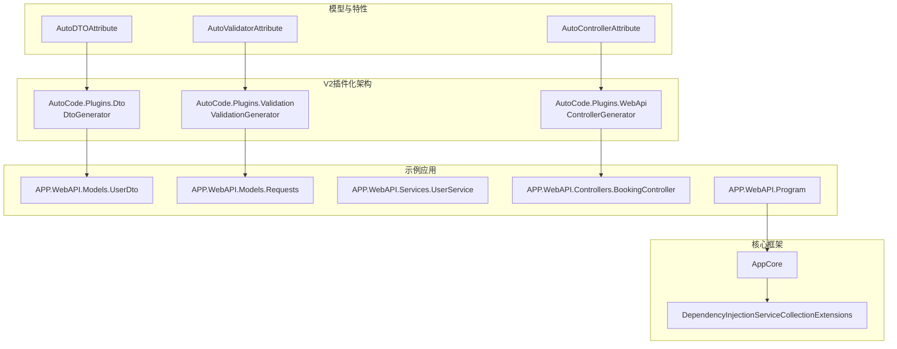
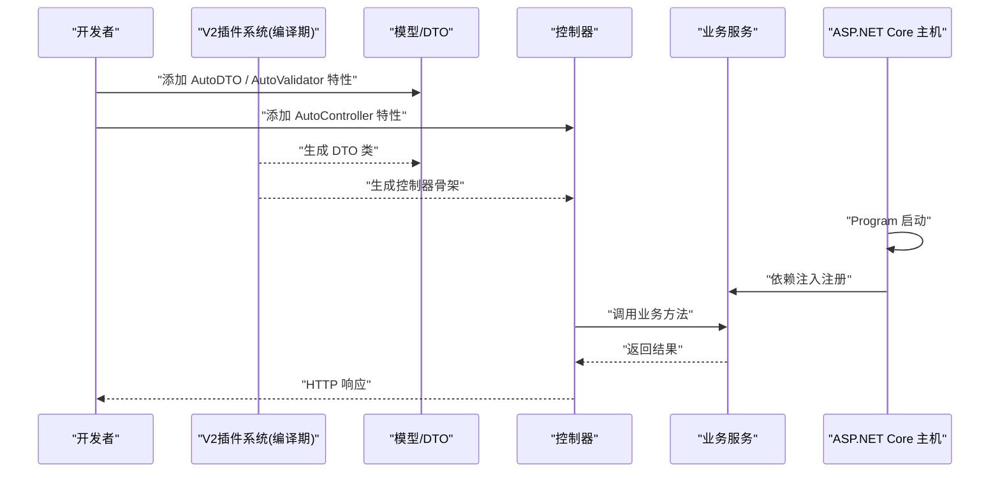
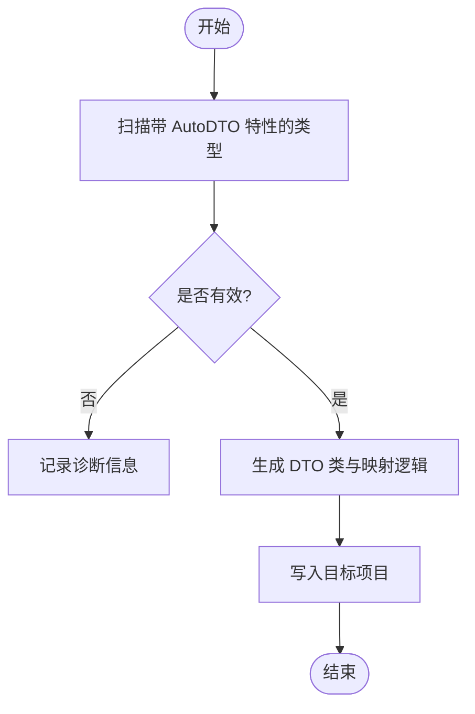
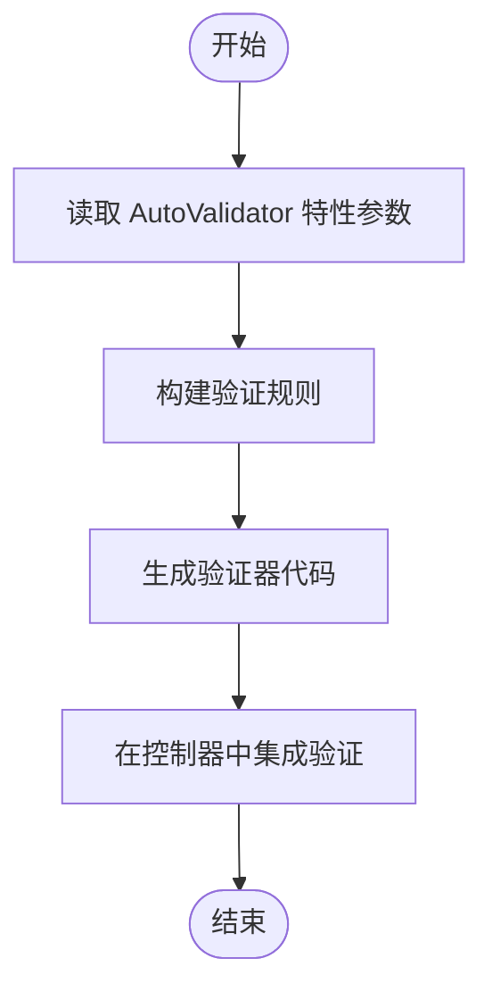
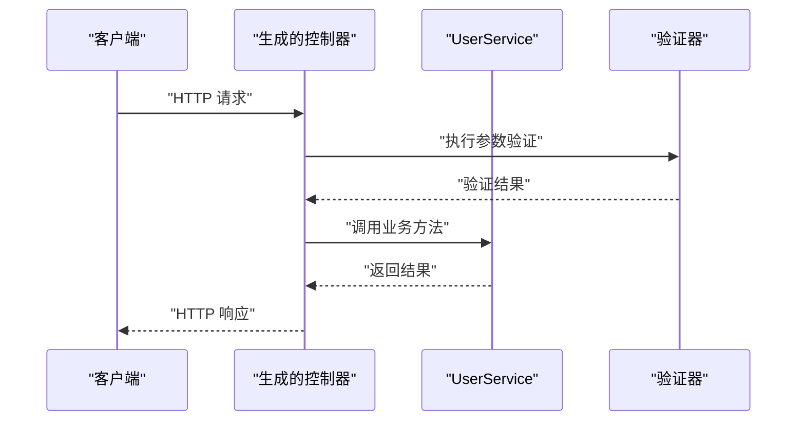
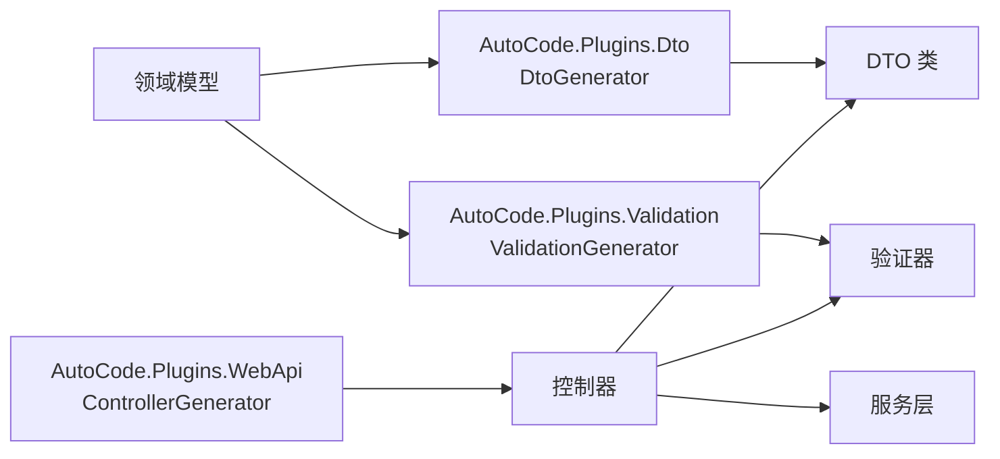
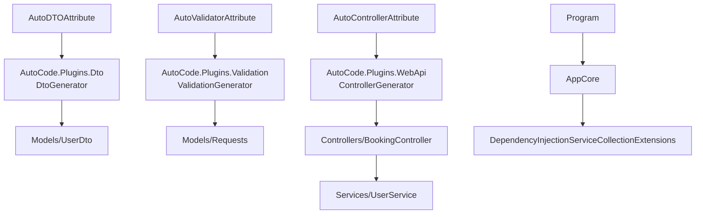

# DTO、验证和Web API生成

<cite>
**本文引用的文件**   
- [ControllerGenerator.cs](file://src/AutoCode.Plugins.WebApi/ControllerGenerator.cs)
- [ValidationGenerator.cs](file://src/AutoCode.Plugins.Validation/ValidationGenerator.cs)
- [AutoDTOAttribute.cs](file://src/AutoCode.Model/AutoDTOAttribute.cs)
- [AutoValidatorAttribute.cs](file://src/AutoCode.Model/AutoValidatorAttribute.cs)
- [AutoControllerAttribute.cs](file://src/AutoCode.Model/AutoControllerAttribute.cs)
- [UserDto.cs](file://src/APP.WebAPI/Models/UserDto.cs)
- [Requests.cs](file://src/APP.WebAPI/Models/Requests.cs)
- [UserService.cs](file://src/APP.WebAPI/Services/UserService.cs)
- [BookingController.cs](file://src/APP.WebAPI/Controllers/BookingController.cs)
- [Program.cs](file://src/APP.WebAPI/Program.cs)
- [AppCore.cs](file://src/APP.WebAPI.Core/Application/AppCore.cs)
- [DependencyInjectionServiceCollectionExtensions.cs](file://src/APP.WebAPI.Core/DependencyInjection/DependencyInjectionServiceCollectionExtensions.cs)
</cite>

## 更新摘要
**所做更改**   
- 更新了项目结构部分，反映V2架构变更：Web API功能拆分为独立插件
- 更新了核心组件部分，说明新的插件化架构
- 更新了详细组件分析部分，指向新的插件位置
- 更新了依赖关系分析部分，反映新的插件依赖关系
- 更新了架构图表以反映V2架构变更

## 目录
1. [简介](#简介)
2. [项目结构](#项目结构)
3. [核心组件](#核心组件)
4. [架构总览](#架构总览)
5. [详细组件分析](#详细组件分析)
6. [依赖关系分析](#依赖关系分析)
7. [性能考虑](#性能考虑)
8. [故障排查指南](#故障排查指南)
9. [结论](#结论)

## 简介
本文件围绕 AutoCode 代码库中的"DTO 生成、数据验证与 Web API 控制器生成"三大能力进行系统化说明。通过源码级分析与可视化图示，帮助读者理解：
- 如何通过特性驱动自动生成 DTO、验证规则与 Web API 控制器
- 各生成器之间的协作方式与数据流
- 在 ASP.NET Core 应用中的集成点与扩展方式
- 常见问题定位与优化建议

**V2架构变更**：在V2版本中，Web API功能被拆分为独立的插件系统，ControllerGenerator位于AutoCode.Plugins.WebApi，Validation位于AutoCode.Plugins.Validation，实现了更清晰的模块分离和更好的可维护性。

## 项目结构
本项目采用多工程组织，按职责划分模块：
- 模型与特性定义：位于 AutoCode.Model，提供用于驱动生成的特性（如 AutoDTO、AutoValidator、AutoController）
- **V2插件化架构**：源码生成器现在位于独立的插件项目中，提供更好的模块化和可重用性
  - AutoCode.Plugins.WebApi：包含ControllerGenerator，负责Web API控制器生成
  - AutoCode.Plugins.Validation：包含ValidationGenerator，负责数据验证生成
  - AutoCode.Plugins.Dto：包含DtoGenerator，负责DTO生成
- 示例应用：APP.WebAPI 展示如何在 ASP.NET Core 中使用这些生成能力
- 核心基础设施：APP.WebAPI.Core 提供依赖注入与扩展方法

**图表来源** 
- [AutoDTOAttribute.cs](file://src/AutoCode.Model/AutoDTOAttribute.cs)
- [AutoValidatorAttribute.cs](file://src/AutoCode.Model/AutoValidatorAttribute.cs)
- [AutoControllerAttribute.cs](file://src/AutoCode.Model/AutoControllerAttribute.cs)
- [ControllerGenerator.cs](file://src/AutoCode.Plugins.WebApi/ControllerGenerator.cs)
- [ValidationGenerator.cs](file://src/AutoCode.Plugins.Validation/ValidationGenerator.cs)
- [UserDto.cs](file://src/APP.WebAPI/Models/UserDto.cs)
- [Requests.cs](file://src/APP.WebAPI/Models/Requests.cs)
- [UserService.cs](file://src/APP.WebAPI/Services/UserService.cs)
- [BookingController.cs](file://src/APP.WebAPI/Controllers/BookingController.cs)
- [Program.cs](file://src/APP.WebAPI/Program.cs)
- [AppCore.cs](file://src/APP.WebAPI.Core/Application/AppCore.cs)
- [DependencyInjectionServiceCollectionExtensions.cs](file://src/APP.WebAPI.Core/DependencyInjection/DependencyInjectionServiceCollectionExtensions.cs)

**章节来源**
- [ControllerGenerator.cs](file://src/AutoCode.Plugins.WebApi/ControllerGenerator.cs)
- [ValidationGenerator.cs](file://src/AutoCode.Plugins.Validation/ValidationGenerator.cs)
- [AutoDTOAttribute.cs](file://src/AutoCode.Model/AutoDTOAttribute.cs)
- [AutoValidatorAttribute.cs](file://src/AutoCode.Model/AutoValidatorAttribute.cs)
- [AutoControllerAttribute.cs](file://src/AutoCode.Model/AutoControllerAttribute.cs)
- [UserDto.cs](file://src/APP.WebAPI/Models/UserDto.cs)
- [Requests.cs](file://src/APP.WebAPI/Models/Requests.cs)
- [UserService.cs](file://src/APP.WebAPI/Services/UserService.cs)
- [BookingController.cs](file://src/APP.WebAPI/Controllers/BookingController.cs)
- [Program.cs](file://src/APP.WebAPI/Program.cs)
- [AppCore.cs](file://src/APP.WebAPI.Core/Application/AppCore.cs)
- [DependencyInjectionServiceCollectionExtensions.cs](file://src/APP.WebAPI.Core/DependencyInjection/DependencyInjectionServiceCollectionExtensions.cs)

## 核心组件
- **DTO 生成器**：基于 AutoDTO 特性扫描并生成数据传输对象，减少样板代码，统一命名与映射策略，现位于 AutoCode.Plugins.Dto 插件中
- **验证生成器**：基于 AutoValidator 特性为请求模型或 DTO 生成验证逻辑，支持常见校验规则，现位于 AutoCode.Plugins.Validation 插件中
- **控制器生成器**：基于 AutoController 特性生成 RESTful 控制器骨架，包含路由、参数绑定与响应封装，现位于 AutoCode.Plugins.WebApi 插件中

上述三个生成器均属于源码生成器范畴，编译期运行，输出到目标项目的 Models、Controllers 等命名空间下，便于后续维护与测试。**V2架构优势**：插件化设计使得每个功能模块可以独立开发、测试和部署，提高了代码的可维护性和可扩展性。

**章节来源**
- [ControllerGenerator.cs](file://src/AutoCode.Plugins.WebApi/ControllerGenerator.cs)
- [ValidationGenerator.cs](file://src/AutoCode.Plugins.Validation/ValidationGenerator.cs)
- [AutoDTOAttribute.cs](file://src/AutoCode.Model/AutoDTOAttribute.cs)
- [AutoValidatorAttribute.cs](file://src/AutoCode.Model/AutoValidatorAttribute.cs)
- [AutoControllerAttribute.cs](file://src/AutoCode.Model/AutoControllerAttribute.cs)

## 架构总览
下图展示了从特性标注到代码生成再到运行时集成的整体流程。开发者在模型或服务上添加特性后，生成器在编译期产出 DTO、验证器与控制器；应用启动时由 Program 与 AppCore 完成服务注册与中间件配置。

**图表来源** 
- [Program.cs](file://src/APP.WebAPI/Program.cs)
- [AppCore.cs](file://src/APP.WebAPI.Core/Application/AppCore.cs)
- [DependencyInjectionServiceCollectionExtensions.cs](file://src/APP.WebAPI.Core/DependencyInjection/DependencyInjectionServiceCollectionExtensions.cs)
- [ControllerGenerator.cs](file://src/AutoCode.Plugins.WebApi/ControllerGenerator.cs)
- [ValidationGenerator.cs](file://src/AutoCode.Plugins.Validation/ValidationGenerator.cs)

## 详细组件分析

### DTO 生成器分析
- 设计模式：基于特性驱动的增量源码生成，扫描标记了 AutoDTO 的类型，生成对应的数据传输对象
- 数据流：输入为带特性的类型定义，输出为强类型的 DTO 类，通常包含属性映射、序列化友好字段与可选的转换策略
- 集成点：生成产物放置于 Models 命名空间，供控制器与服务层使用
- **V2架构**：位于 AutoCode.Plugins.Dto 插件中，实现模块化设计

**图表来源** 
- [ControllerGenerator.cs](file://src/AutoCode.Plugins.WebApi/ControllerGenerator.cs)
- [AutoDTOAttribute.cs](file://src/AutoCode.Model/AutoDTOAttribute.cs)

**章节来源**
- [ControllerGenerator.cs](file://src/AutoCode.Plugins.WebApi/ControllerGenerator.cs)
- [AutoDTOAttribute.cs](file://src/AutoCode.Model/AutoDTOAttribute.cs)
- [UserDto.cs](file://src/APP.WebAPI/Models/UserDto.cs)

### 验证生成器分析
- 设计模式：基于 AutoValidator 特性为请求模型或 DTO 生成验证逻辑，支持必填、长度、格式等常见规则
- 处理逻辑：解析特性参数，构建验证规则集合，生成验证器类或扩展方法，便于在控制器中快速调用
- 错误处理：生成诊断信息与默认错误消息，提升调试效率
- **V2架构**：位于 AutoCode.Plugins.Validation 插件中，专注于验证功能

**图表来源** 
- [ValidationGenerator.cs](file://src/AutoCode.Plugins.Validation/ValidationGenerator.cs)
- [AutoValidatorAttribute.cs](file://src/AutoCode.Model/AutoValidatorAttribute.cs)

**章节来源**
- [ValidationGenerator.cs](file://src/AutoCode.Plugins.Validation/ValidationGenerator.cs)
- [AutoValidatorAttribute.cs](file://src/AutoCode.Model/AutoValidatorAttribute.cs)
- [Requests.cs](file://src/APP.WebAPI/Models/Requests.cs)

### Web API 控制器生成器分析
- 设计模式：基于 AutoController 特性生成 RESTful 控制器骨架，包含路由、动作方法与参数绑定
- 调用链：控制器调用服务层方法，服务层返回业务结果，控制器封装为标准 HTTP 响应
- 集成点：Program 中注册控制器与中间件，确保路由与依赖注入生效
- **V2架构**：位于 AutoCode.Plugins.WebApi 插件中，专门处理Web API相关功能

**图表来源** 
- [ControllerGenerator.cs](file://src/AutoCode.Plugins.WebApi/ControllerGenerator.cs)
- [AutoControllerAttribute.cs](file://src/AutoCode.Model/AutoControllerAttribute.cs)
- [UserService.cs](file://src/APP.WebAPI/Services/UserService.cs)
- [BookingController.cs](file://src/APP.WebAPI/Controllers/BookingController.cs)

**章节来源**
- [ControllerGenerator.cs](file://src/AutoCode.Plugins.WebApi/ControllerGenerator.cs)
- [AutoControllerAttribute.cs](file://src/AutoCode.Model/AutoControllerAttribute.cs)
- [UserService.cs](file://src/APP.WebAPI/Services/UserService.cs)
- [BookingController.cs](file://src/APP.WebAPI/Controllers/BookingController.cs)

### V2插件架构概览
下图展示了V2版本的插件化架构，每个功能模块都作为独立插件存在，便于管理和扩展。

[本图为概念性流程图，展示V2插件架构，无需图表来源]

## 依赖关系分析
- **插件对特性的依赖**：各插件分别依赖相应的特性定义，保持松耦合设计
- **应用对插件的依赖**：APP.WebAPI 通过NuGet包引用各个插件，获得相应的生成能力
- **运行时依赖**：Program 与 AppCore 负责服务注册与中间件配置，确保控制器与服务可被正确解析

**图表来源** 
- [AutoDTOAttribute.cs](file://src/AutoCode.Model/AutoDTOAttribute.cs)
- [AutoValidatorAttribute.cs](file://src/AutoCode.Model/AutoValidatorAttribute.cs)
- [AutoControllerAttribute.cs](file://src/AutoCode.Model/AutoControllerAttribute.cs)
- [ControllerGenerator.cs](file://src/AutoCode.Plugins.WebApi/ControllerGenerator.cs)
- [ValidationGenerator.cs](file://src/AutoCode.Plugins.Validation/ValidationGenerator.cs)
- [UserDto.cs](file://src/APP.WebAPI/Models/UserDto.cs)
- [Requests.cs](file://src/APP.WebAPI/Models/Requests.cs)
- [BookingController.cs](file://src/APP.WebAPI/Controllers/BookingController.cs)
- [UserService.cs](file://src/APP.WebAPI/Services/UserService.cs)
- [Program.cs](file://src/APP.WebAPI/Program.cs)
- [AppCore.cs](file://src/APP.WebAPI.Core/Application/AppCore.cs)
- [DependencyInjectionServiceCollectionExtensions.cs](file://src/APP.WebAPI.Core/DependencyInjection/DependencyInjectionServiceCollectionExtensions.cs)

**章节来源**
- [Program.cs](file://src/APP.WebAPI/Program.cs)
- [AppCore.cs](file://src/APP.WebAPI.Core/Application/AppCore.cs)
- [DependencyInjectionServiceCollectionExtensions.cs](file://src/APP.WebAPI.Core/DependencyInjection/DependencyInjectionServiceCollectionExtensions.cs)
- [ControllerGenerator.cs](file://src/AutoCode.Plugins.WebApi/ControllerGenerator.cs)
- [ValidationGenerator.cs](file://src/AutoCode.Plugins.Validation/ValidationGenerator.cs)

## 性能考虑
- 编译期生成：源码生成器在编译阶段运行，避免运行时反射开销，提升启动与请求处理性能
- 增量生成：仅对变更的源文件重新生成，缩短构建时间
- **插件化优势**：V2架构允许按需加载插件，减少不必要的编译开销
- 内存与CPU占用：合理控制扫描范围与规则复杂度，避免生成器成为构建瓶颈
- 缓存策略：利用 .NET 增量生成缓存机制，减少重复计算

## 故障排查指南
- 生成失败或无输出：检查特性是否正确添加、命名空间与可见性是否符合要求；查看诊断信息以定位问题
- 验证不生效：确认验证器已正确集成到控制器或中间件；检查请求模型与 DTO 的属性匹配
- 控制器未注册：确认 Program 或 AppCore 中已启用相关扩展与中间件；检查依赖注入容器是否包含所需服务
- 路由冲突：检查 AutoController 生成的路由模板是否与现有路由冲突
- **V2插件问题**：确认已正确引用相应的插件包；检查插件版本兼容性；查看插件特定的诊断信息

**章节来源**
- [ControllerGenerator.cs](file://src/AutoCode.Plugins.WebApi/ControllerGenerator.cs)
- [ValidationGenerator.cs](file://src/AutoCode.Plugins.Validation/ValidationGenerator.cs)
- [Program.cs](file://src/APP.WebAPI/Program.cs)
- [AppCore.cs](file://src/APP.WebAPI.Core/Application/AppCore.cs)

## 结论
通过 AutoCode 的 DTO、验证与 Web API 控制器生成能力，开发者可以显著减少样板代码，提高一致性与可维护性。**V2架构的重大改进**：插件化设计使得每个功能模块可以独立管理，提供了更好的可扩展性和可维护性。结合 ASP.NET Core 的依赖注入与中间件体系，能够在编译期获得高性能与良好开发体验。建议在项目中合理使用特性与生成器，并结合诊断信息持续优化生成规则与集成方式。