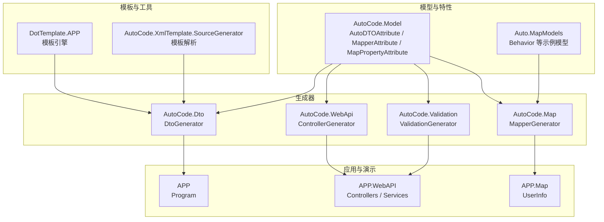
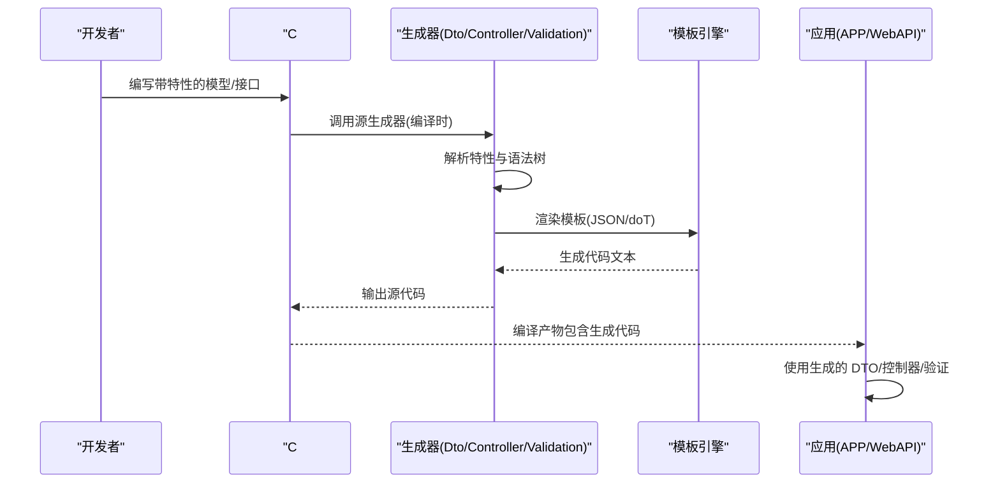
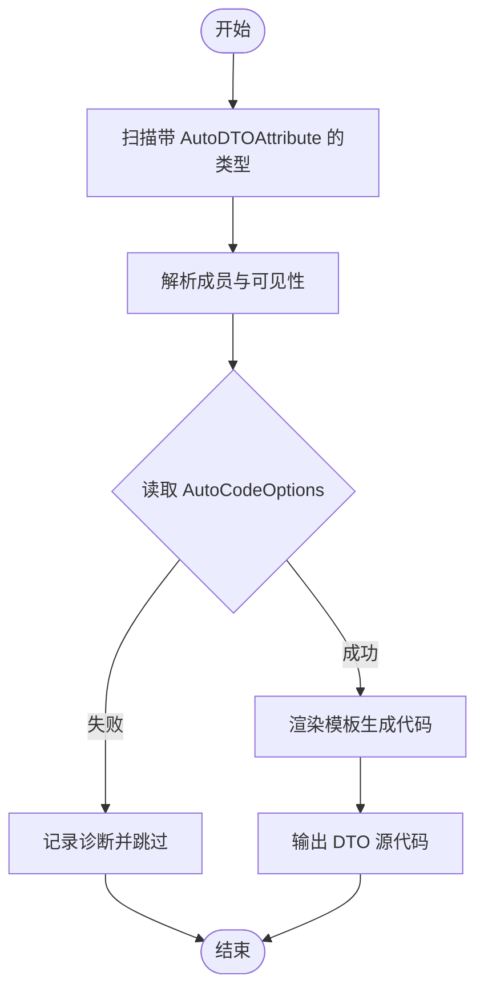
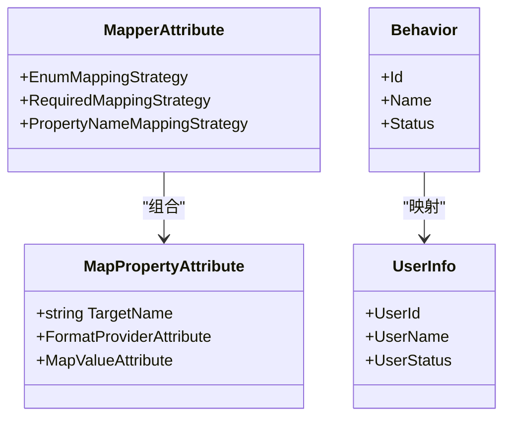
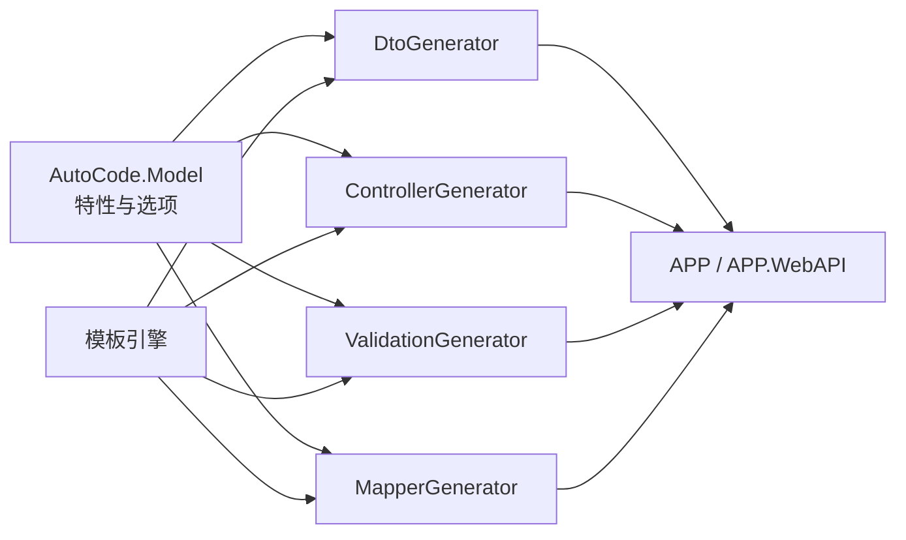

# DTO自动生成器

<cite>
**本文档中引用的文件**
- [README.md](file://README.md)
- [Program.cs](file://src/APP/Program.cs)
- [AutoDTOAttribute.cs](file://src/AutoCode.Model/AutoDTOAttribute.cs)
- [DtoGenerator.cs](file://src/AutoCode.Dto/DtoGenerator.cs)
- [AutoCodeOptions.cs](file://src/AutoCode.Model/AutoCodeOptions.cs)
- [MapperAttribute.cs](file://src/AutoCode.Model/AutoMapperModel/MapperAttribute.cs)
- [MapPropertyAttribute.cs](file://src/AutoCode.Model/AutoMapperModel/MapPropertyAttribute.cs)
- [Behavior.cs](file://src/Auto.MapModels/Behavior.cs)
- [UserInfo.cs](file://src/APP.Map/UserInfo.cs)
- [DependencyInjectionServiceCollectionExtensions.cs](file://src/APP.WebAPI.Core/DependencyInjection/DependencyInjectionServiceCollectionExtensions.cs)
- [ServiceCollectionExtensions.cs](file://src/APP.WebAPI.Core/Application/Extensions/ServiceCollectionExtensions.cs)
- [ControllerGenerator.cs](file://src/AutoCode.WebApi/ControllerGenerator.cs)
- [ValidationGenerator.cs](file://src/AutoCode.Validation/ValidationGenerator.cs)
</cite>

## 目录
1. [简介](#简介)
2. [项目结构](#项目结构)
3. [核心组件](#核心组件)
4. [架构总览](#架构总览)
5. [详细组件分析](#详细组件分析)
6. [依赖关系分析](#依赖关系分析)
7. [性能考虑](#性能考虑)
8. [故障排查指南](#故障排查指南)
9. [结论](#结论)
10. [附录](#附录)

## 简介
本仓库是一个面向 .NET 的“DTO 自动生成器”与配套代码生成生态。它通过源生成器、特性标记与模板机制，在编译期自动为数据模型生成 DTO、映射器、控制器与验证规则等代码，从而减少样板代码、提升一致性并降低维护成本。其核心能力包括：
- 基于特性的 DTO 声明与生成
- 对象到 DTO 的映射生成（含属性级映射策略）
- 可选的 Web API 控制器与验证规则生成
- 可插拔的模板系统与扩展点

该方案适用于需要频繁进行数据传输对象转换、接口契约稳定化以及跨层解耦的项目场景。

## 项目结构
整体采用多项目解决方案组织，按职责划分模块：
- 模型与特性定义：位于 AutoCode.Model，提供 DTO、映射、控制器、验证等元数据特性与选项配置
- 代码生成器：位于 AutoCode.Dto、AutoCode.WebApi、AutoCode.Validation 等，分别负责 DTO、控制器、验证规则的生成
- 映射相关：Auto.MapModels 提供行为与示例模型；AutoCode.Map 提供映射生成器与诊断
- 应用与演示：APP、APP.Map、APP.WebAPI 展示如何使用特性与生成的代码
- 工具与模板：DotTemplate.APP、AutoCode.XmlTemplate.SourceGenerator 等提供模板解析与扩展能力
- 分析与测试：AutoCode.Analyzers、AutoCode.Tests 提供静态分析与单元测试

图表来源
- [AutoDTOAttribute.cs](file://src/AutoCode.Model/AutoDTOAttribute.cs)
- [MapperAttribute.cs](file://src/AutoCode.Model/AutoMapperModel/MapperAttribute.cs)
- [MapPropertyAttribute.cs](file://src/AutoCode.Model/AutoMapperModel/MapPropertyAttribute.cs)
- [DtoGenerator.cs](file://src/AutoCode.Dto/DtoGenerator.cs)
- [ControllerGenerator.cs](file://src/AutoCode.WebApi/ControllerGenerator.cs)
- [ValidationGenerator.cs](file://src/AutoCode.Validation/ValidationGenerator.cs)
- [Behavior.cs](file://src/Auto.MapModels/Behavior.cs)
- [UserInfo.cs](file://src/APP.Map/UserInfo.cs)
- [Program.cs](file://src/APP/Program.cs)

章节来源
- [README.md](file://README.md)
- [Program.cs](file://src/APP/Program.cs)

## 核心组件
- 特性与选项
  - AutoDTOAttribute：用于标注需要生成 DTO 的类型或成员，控制命名、可见性、忽略策略等
  - MapperAttribute / MapPropertyAttribute：描述类型级与属性级的映射策略，如枚举映射、格式提供者、必需映射策略等
  - AutoCodeOptions：全局生成器选项，影响输出命名空间、类名前缀、是否启用调试信息等
- 生成器
  - DtoGenerator：扫描带有 AutoDTOAttribute 的类型，结合模板与选项生成 DTO 代码
  - ControllerGenerator：根据控制器特性与路由信息生成 Web API 控制器骨架
  - ValidationGenerator：基于模型与特性生成验证规则（如必填、长度、正则等）
  - MapperGenerator：根据 MapperAttribute 与 MapPropertyAttribute 生成对象到 DTO 的映射实现
- 模板系统
  - DotTemplate.APP：提供 doT.js 模板引擎与 JSON 模板配置，支持自定义输出结构
  - AutoCode.XmlTemplate.SourceGenerator：解析外部模板并注入上下文数据

章节来源
- [AutoDTOAttribute.cs](file://src/AutoCode.Model/AutoDTOAttribute.cs)
- [MapperAttribute.cs](file://src/AutoCode.Model/AutoMapperModel/MapperAttribute.cs)
- [MapPropertyAttribute.cs](file://src/AutoCode.Model/AutoMapperModel/MapPropertyAttribute.cs)
- [AutoCodeOptions.cs](file://src/AutoCode.Model/AutoCodeOptions.cs)
- [DtoGenerator.cs](file://src/AutoCode.Dto/DtoGenerator.cs)
- [ControllerGenerator.cs](file://src/AutoCode.WebApi/ControllerGenerator.cs)
- [ValidationGenerator.cs](file://src/AutoCode.Validation/ValidationGenerator.cs)
- [Behavior.cs](file://src/Auto.MapModels/Behavior.cs)
- [UserInfo.cs](file://src/APP.Map/UserInfo.cs)

## 架构总览
下图展示了从源码到生成代码的关键流程：编译器触发源生成器，扫描特性与语法树，结合模板与选项生成目标代码，最终由应用消费。

图表来源
- [DtoGenerator.cs](file://src/AutoCode.Dto/DtoGenerator.cs)
- [ControllerGenerator.cs](file://src/AutoCode.WebApi/ControllerGenerator.cs)
- [ValidationGenerator.cs](file://src/AutoCode.Validation/ValidationGenerator.cs)
- [Program.cs](file://src/APP/Program.cs)

## 详细组件分析

### DTO 生成器（DtoGenerator）
- 功能概述
  - 扫描带有 AutoDTOAttribute 的类型，提取成员、可见性与忽略策略
  - 结合 AutoCodeOptions 决定命名空间、前缀、调试输出等
  - 使用模板引擎渲染 DTO 类定义与必要注释
- 关键输入
  - AutoDTOAttribute：标注 DTO 生成范围与规则
  - AutoCodeOptions：全局生成配置
- 关键输出
  - 生成的 DTO 类文件（属性、构造函数、序列化注解等）
- 错误处理
  - 对缺失特性、非法成员类型、模板渲染失败等进行诊断与提示

图表来源
- [DtoGenerator.cs](file://src/AutoCode.Dto/DtoGenerator.cs)
- [AutoDTOAttribute.cs](file://src/AutoCode.Model/AutoDTOAttribute.cs)
- [AutoCodeOptions.cs](file://src/AutoCode.Model/AutoCodeOptions.cs)

章节来源
- [DtoGenerator.cs](file://src/AutoCode.Dto/DtoGenerator.cs)
- [AutoDTOAttribute.cs](file://src/AutoCode.Model/AutoDTOAttribute.cs)
- [AutoCodeOptions.cs](file://src/AutoCode.Model/AutoCodeOptions.cs)

### 映射生成器（MapperGenerator）
- 功能概述
  - 基于 MapperAttribute 与 MapPropertyAttribute 生成对象到 DTO 的映射逻辑
  - 支持枚举映射策略、格式提供者、必需映射策略、属性重命名等
- 关键输入
  - Behavior.cs：示例模型，用于演示映射场景
  - UserInfo.cs：映射目标 DTO 示例
- 关键输出
  - 映射实现代码（属性级映射、条件映射、格式化等）
- 错误处理
  - 对不匹配的枚举值、缺失的属性映射、格式提供者不可用等情况给出诊断

图表来源
- [MapperAttribute.cs](file://src/AutoCode.Model/AutoMapperModel/MapperAttribute.cs)
- [MapPropertyAttribute.cs](file://src/AutoCode.Model/AutoMapperModel/MapPropertyAttribute.cs)
- [Behavior.cs](file://src/Auto.MapModels/Behavior.cs)
- [UserInfo.cs](file://src/APP.Map/UserInfo.cs)

章节来源
- [Behavior.cs](file://src/Auto.MapModels/Behavior.cs)
- [UserInfo.cs](file://src/APP.Map/UserInfo.cs)
- [MapperAttribute.cs](file://src/AutoCode.Model/AutoMapperModel/MapperAttribute.cs)
- [MapPropertyAttribute.cs](file://src/AutoCode.Model/AutoMapperModel/MapPropertyAttribute.cs)

### 控制器生成器（ControllerGenerator）
- 功能概述
  - 根据控制器特性与路由信息生成 Web API 控制器骨架
  - 集成服务注入与响应包装
- 关键输入
  - 控制器特性与路由配置
- 关键输出
  - 控制器类与方法（含参数绑定、返回类型封装）
- 错误处理
  - 对重复路由、无效方法签名、缺少服务依赖进行诊断

章节来源
- [ControllerGenerator.cs](file://src/AutoCode.WebApi/ControllerGenerator.cs)

### 验证生成器（ValidationGenerator）
- 功能概述
  - 基于模型与特性生成验证规则（如必填、长度、正则、范围等）
- 关键输入
  - 模型类型与验证特性
- 关键输出
  - 验证器类与规则集合
- 错误处理
  - 对非法验证表达式、不支持的特性组合进行诊断

章节来源
- [ValidationGenerator.cs](file://src/AutoCode.Validation/ValidationGenerator.cs)

### 模板系统（DotTemplate.APP 与 XML 模板源生成器）
- 功能概述
  - 使用 doT.js 模板引擎与 JSON 模板配置，支持动态渲染 DTO、控制器、验证器等
  - 提供外部模板解析与扩展点，便于团队定制输出风格
- 关键输入
  - 模板文件（doT/.json）与上下文数据
- 关键输出
  - 渲染后的 C# 源代码片段
- 错误处理
  - 模板语法错误、变量缺失、渲染异常的诊断与回退策略

章节来源
- [Program.cs](file://src/DotTemplate.APP/Program.cs)
- [AutoCode.XmlTemplate.SourceGenerator.csproj](file://src/AutoCode.XmlTemplate.SourceGenerator/AutoCode.DotTemplate.SourceGenerator.csproj)

## 依赖关系分析
- 组件耦合
  - 生成器依赖 AutoCode.Model 中的特性与选项
  - 模板系统被各生成器复用，形成松耦合的渲染层
  - 应用层（APP、APP.WebAPI）仅消费生成结果，不直接依赖生成器
- 外部依赖
  - 模板引擎（doT.js）
  - .NET 源生成器框架
- 潜在循环依赖
  - 生成器与模板之间单向依赖，避免循环引用
- 接口契约
  - 特性定义作为生成器的输入契约，确保稳定的扩展点

图表来源
- [AutoDTOAttribute.cs](file://src/AutoCode.Model/AutoDTOAttribute.cs)
- [AutoCodeOptions.cs](file://src/AutoCode.Model/AutoCodeOptions.cs)
- [DtoGenerator.cs](file://src/AutoCode.Dto/DtoGenerator.cs)
- [ControllerGenerator.cs](file://src/AutoCode.WebApi/ControllerGenerator.cs)
- [ValidationGenerator.cs](file://src/AutoCode.Validation/ValidationGenerator.cs)
- [Program.cs](file://src/APP/Program.cs)

章节来源
- [AutoDTOAttribute.cs](file://src/AutoCode.Model/AutoDTOAttribute.cs)
- [AutoCodeOptions.cs](file://src/AutoCode.Model/AutoCodeOptions.cs)
- [DtoGenerator.cs](file://src/AutoCode.Dto/DtoGenerator.cs)
- [ControllerGenerator.cs](file://src/AutoCode.WebApi/ControllerGenerator.cs)
- [ValidationGenerator.cs](file://src/AutoCode.Validation/ValidationGenerator.cs)
- [Program.cs](file://src/APP/Program.cs)

## 性能考虑
- 编译期生成：利用源生成器在编译阶段完成代码生成，避免运行时开销
- 增量生成：合理缓存模板渲染结果与语法树分析结果，减少重复工作
- 模板优化：精简模板逻辑，避免复杂计算；按需渲染，减少无用代码输出
- 内存管理：大项目下注意生成器内存占用，必要时分批次处理类型
- I/O 优化：批量写入生成文件，减少磁盘操作次数

[本节为通用指导，无需特定文件来源]

## 故障排查指南
- 常见问题
  - 特性未正确标注：检查 AutoDTOAttribute、MapperAttribute 等是否应用于目标类型或成员
  - 模板渲染失败：确认模板语法与上下文变量是否正确
  - 映射不匹配：核对 MapPropertyAttribute 的目标名称与类型兼容性
  - 控制器路由冲突：检查重复路由或无效方法签名
- 诊断建议
  - 启用生成器诊断输出，查看具体错误位置与原因
  - 简化模板与特性，逐步定位问题
  - 使用最小复现项目隔离问题

章节来源
- [AutoDTOAttribute.cs](file://src/AutoCode.Model/AutoDTOAttribute.cs)
- [MapperAttribute.cs](file://src/AutoCode.Model/AutoMapperModel/MapperAttribute.cs)
- [MapPropertyAttribute.cs](file://src/AutoCode.Model/AutoMapperModel/MapPropertyAttribute.cs)
- [ControllerGenerator.cs](file://src/AutoCode.WebApi/ControllerGenerator.cs)
- [ValidationGenerator.cs](file://src/AutoCode.Validation/ValidationGenerator.cs)

## 结论
本 DTO 自动生成器通过特性驱动与模板渲染，在编译期高效生成 DTO、映射、控制器与验证代码，显著减少样板代码并提升一致性。其模块化设计与可扩展的模板系统，使团队能够灵活定制输出风格与业务规则。建议在大型项目中引入该方案，以统一数据传输契约、降低维护成本并提高开发效率。

[本节为总结性内容，无需特定文件来源]

## 附录
- 最佳实践
  - 明确 DTO 边界，避免过度暴露内部模型
  - 合理使用映射策略，保持可读性与性能平衡
  - 将模板与特性定义纳入版本控制，确保团队一致性
- 参考示例
  - APP 与 APP.WebAPI 展示如何消费生成代码
  - Auto.MapModels 与 APP.Map 提供映射场景示例

章节来源
- [Program.cs](file://src/APP/Program.cs)
- [Behavior.cs](file://src/Auto.MapModels/Behavior.cs)
- [UserInfo.cs](file://src/APP.Map/UserInfo.cs)