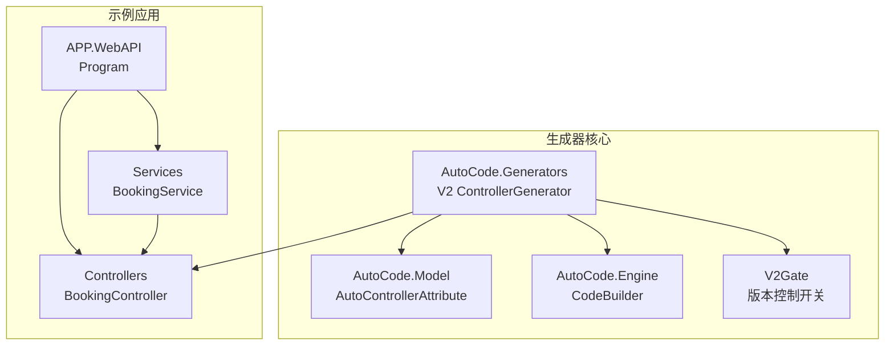
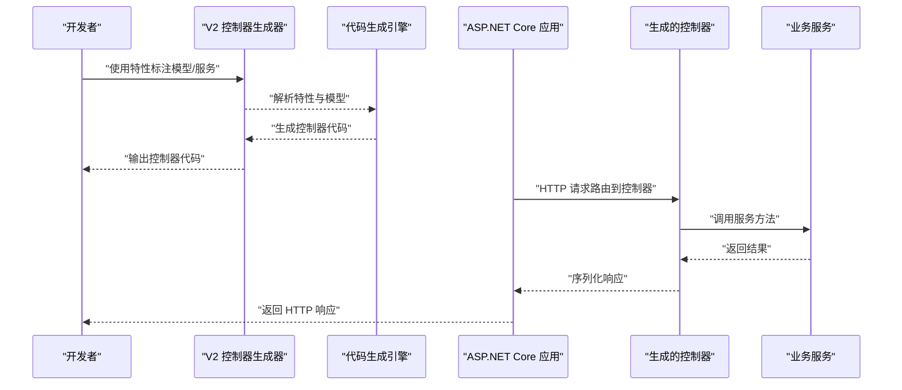
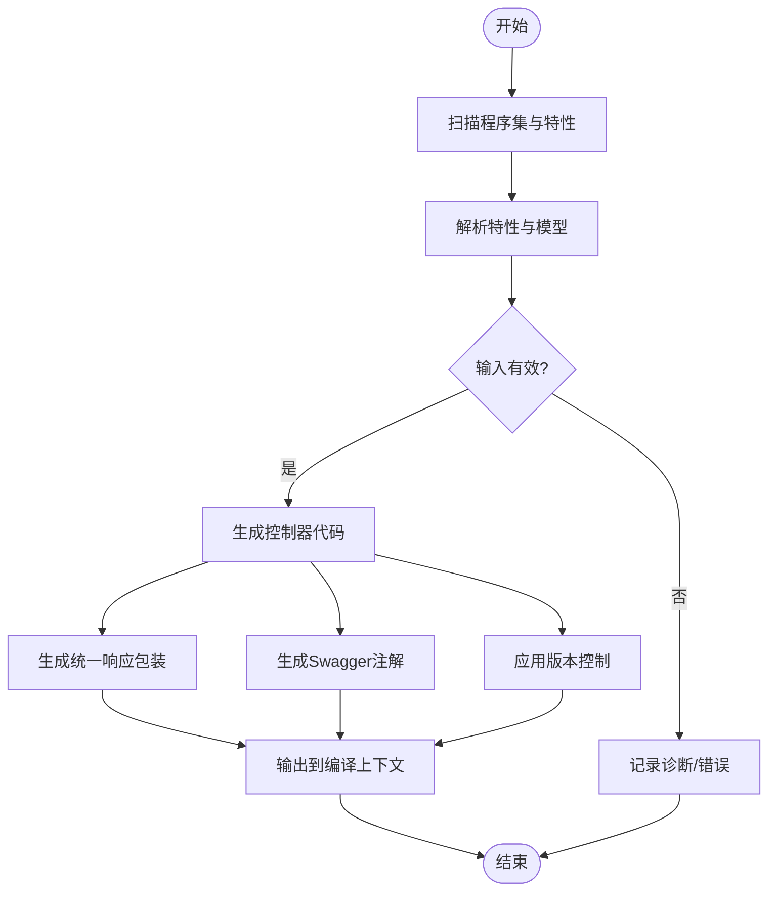
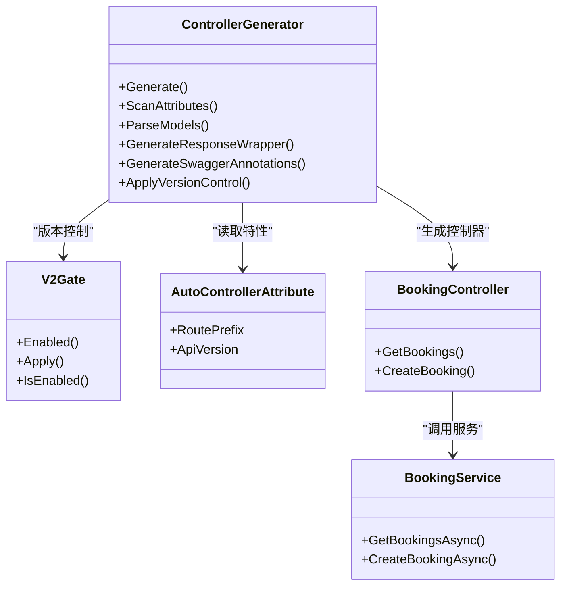

# Web API控制器生成器

<cite>
**本文引用的文件**   
- [Program.cs](file://src/APP.WebAPI/Program.cs)
- [BookingController.cs](file://src/APP.WebAPI/Controllers/BookingController.cs)
- [BookingService.cs](file://src/APP.WebAPI/Services/BookingService.cs)
- [AutoControllerAttribute.cs](file://src/AutoCode.Model/AutoControllerAttribute.cs)
- [ControllerGenerator.cs](file://src/AutoCode.Generators/V2/ControllerGenerator.cs)
- [V2Gate.cs](file://src/AutoCode.Generators/V2/V2Gate.cs)
- [AutoCode.sln](file://src/AutoCode.sln)
</cite>

## 更新摘要
**所做更改**   
- 移除了已废弃的 AutoCode.WebApi 项目引用和相关文档
- 更新了控制器生成器架构说明，反映从 V1 到 V2 的重构
- 简化了依赖关系图，移除了不存在的组件引用
- 更新了故障排查指南以反映新的架构状态

## 目录
1. [简介](#简介)
2. [项目结构](#项目结构)
3. [核心组件](#核心组件)
4. [架构总览](#架构总览)
5. [详细组件分析](#详细组件分析)
6. [依赖关系分析](#依赖关系分析)
7. [性能考量](#性能考量)
8. [故障排查指南](#故障排查指南)
9. [结论](#结论)
10. [附录](#附录)

## 简介
本仓库实现了一个"Web API 控制器生成器"，通过特性标注与源码生成器，自动为业务服务生成对应的 ASP.NET Core Web API 控制器。其目标是在保持代码简洁的同时，减少样板代码的重复编写，提升开发效率与一致性。**重要更新**：控制器生成器已从独立的 AutoCode.WebApi 项目重构到 AutoCode.Generators 项目中，采用 V2 版本架构，提供了更强大的功能和更好的性能。

## 项目结构
- APP.WebAPI：示例应用，包含 Program、控制器与服务，用于演示生成器的使用方式。
- AutoCode.Model：定义控制器相关的特性（如 AutoControllerAttribute），供生成器识别。
- AutoCode.Generators：统一的代码生成器项目，包含 V1 和 V2 版本的控制器生成器，**现已支持生产级功能**。
- AutoCode.Engine：代码生成引擎，提供通用的代码构建和模板功能。
- AutoCode.Analyzers：静态分析器，辅助检查代码问题。
- AutoCode.Tests：单元测试与集成测试。

图表来源
- [Program.cs](file://src/APP.WebAPI/Program.cs)
- [BookingController.cs](file://src/APP.WebAPI/Controllers/BookingController.cs)
- [BookingService.cs](file://src/APP.WebAPI/Services/BookingService.cs)
- [ControllerGenerator.cs](file://src/AutoCode.Generators/V2/ControllerGenerator.cs)
- [AutoControllerAttribute.cs](file://src/AutoCode.Model/AutoControllerAttribute.cs)
- [V2Gate.cs](file://src/AutoCode.Generators/V2/V2Gate.cs)

章节来源
- [AutoCode.sln](file://src/AutoCode.sln)

## 核心组件
- 控制器特性（AutoControllerAttribute）：标记需要由生成器处理的类或接口，提供路由、动作名等元数据。
- 控制器生成器（ControllerGenerator V2）：读取特性与模型信息，生成符合 ASP.NET Core 规范的控制器代码，**现已支持生产级功能**。
- **统一响应包装**：自动生成 ApiResponse<T> 类，提供一致的响应格式。
- **Swagger注解生成**：自动生成ProducesResponseType 属性，提升API文档准确性。
- **版本控制支持**：支持API版本前缀配置。
- **授权支持**：可选的Authorize特性生成。
- 示例控制器（BookingController）：由生成器输出，暴露 RESTful 端点，调用 BookingService 完成业务逻辑。
- 示例服务（BookingService）：承载具体业务逻辑，被控制器调用。
- 应用入口（Program）：配置并启动 ASP.NET Core 应用，注册依赖注入容器与中间件。

章节来源
- [AutoControllerAttribute.cs](file://src/AutoCode.Model/AutoControllerAttribute.cs)
- [ControllerGenerator.cs](file://src/AutoCode.Generators/V2/ControllerGenerator.cs)
- [BookingController.cs](file://src/APP.WebAPI/Controllers/BookingController.cs)
- [BookingService.cs](file://src/APP.WebAPI/Services/BookingService.cs)
- [Program.cs](file://src/APP.WebAPI/Program.cs)

## 架构总览
整体流程如下：开发者在模型或服务上使用特性标注；生成器在编译期扫描这些标注，自动生成控制器代码和Swagger文档；运行时由 ASP.NET Core 加载控制器并处理 HTTP 请求，调用服务完成业务操作。**重要变更**：架构已重构到统一的 AutoCode.Generators 项目中，V2 版本提供了更强大的功能集。

图表来源
- [ControllerGenerator.cs](file://src/AutoCode.Generators/V2/ControllerGenerator.cs)
- [AutoControllerAttribute.cs](file://src/AutoCode.Model/AutoControllerAttribute.cs)
- [BookingController.cs](file://src/APP.WebAPI/Controllers/BookingController.cs)
- [BookingService.cs](file://src/APP.WebAPI/Services/BookingService.cs)
- [Program.cs](file://src/APP.WebAPI/Program.cs)

## 详细组件分析

### 控制器特性（AutoControllerAttribute）
- 作用：声明控制器元数据，如路由前缀、动作名、HTTP 方法等。
- 设计要点：
  - 作为特性类，提供属性以描述控制器的行为。
  - 与生成器配合，驱动代码生成过程。
- 复杂度：O(1) 读取特性属性；对生成器而言，解析成本取决于模型数量。

章节来源
- [AutoControllerAttribute.cs](file://src/AutoCode.Model/AutoControllerAttribute.cs)

### 控制器生成器（ControllerGenerator V2）
- 作用：基于特性与模型，生成控制器类与方法，**现已支持生产级功能**。
- 关键流程：
  - 扫描程序集，识别带有特性的类型。
  - 解析特性参数与模型签名。
  - **新增**：生成统一响应包装类（ApiResponse<T>）。
  - **新增**：自动生成 Swagger 注解（ProducesResponseType）。
  - **新增**：支持API版本控制和授权特性。
  - 生成控制器代码并写入输出。
- 优化建议：
  - 增量生成，避免全量重算。
  - 缓存已解析的模型与特性信息。
  - 使用 V2Gate 控制 V2 生成器的启用状态。

图表来源
- [ControllerGenerator.cs](file://src/AutoCode.Generators/V2/ControllerGenerator.cs)

章节来源
- [ControllerGenerator.cs](file://src/AutoCode.Generators/V2/ControllerGenerator.cs)

### V2 版本增强功能
- 作用：**新增**的生产级功能，提供更完整的API控制器生成能力。
- 核心特性：
  - **统一响应包装**：自动生成 ApiResponse<T> 类，提供一致的响应格式。
  - **Swagger注解生成**：自动添加 ProducingType 和 StatusCode 注解。
  - **版本控制支持**：支持API版本前缀配置。
  - **授权支持**：可选的Authorize特性生成。
  - **分页支持**：内置分页功能配置。
- 技术实现：
  - 基于 Roslyn 的语法树分析。
  - 使用 CodeWriter 进行代码生成。
  - 通过 V2Gate 控制生成器启用状态。

章节来源
- [ControllerGenerator.cs](file://src/AutoCode.Generators/V2/ControllerGenerator.cs)
- [V2Gate.cs](file://src/AutoCode.Generators/V2/V2Gate.cs)

### 示例控制器（BookingController）
- 作用：对外暴露预订相关的 REST 端点，调用 BookingService 完成业务。
- 职责边界：
  - 接收 HTTP 请求，参数绑定与校验。
  - 调用服务层方法，处理返回值与异常。
  - 返回标准 JSON 响应。
- 性能考虑：
  - 避免在控制器中执行耗时逻辑。
  - 合理使用异步方法与缓存。

章节来源
- [BookingController.cs](file://src/APP.WebAPI/Controllers/BookingController.cs)

### 示例服务（BookingService）
- 作用：封装预订业务逻辑，提供可复用的方法。
- 设计要点：
  - 单一职责，关注业务规则与数据访问。
  - 通过依赖注入被控制器消费。
- 错误处理：
  - 抛出领域异常或返回错误码。
  - 与控制器协作进行统一错误处理。

章节来源
- [BookingService.cs](file://src/APP.WebAPI/Services/BookingService.cs)

### 应用入口（Program）
- 作用：配置 ASP.NET Core 管道，注册服务与中间件，启动应用。
- 关键点：
  - 启用 MVC/Web API 路由。
  - 注册依赖注入容器中的服务。
  - 配置日志、CORS、认证等通用中间件。
  - **新增**：集成Swagger文档生成中间件。

章节来源
- [Program.cs](file://src/APP.WebAPI/Program.cs)

## 依赖关系分析
- 控制器依赖于服务（BookingController -> BookingService）。
- 生成器依赖于特性定义（ControllerGenerator -> AutoControllerAttribute）。
- **架构变更**：V2 生成器现在位于 AutoCode.Generators 项目中，不再依赖独立的 AutoCode.WebApi 项目。
- 应用入口负责组装各组件（Program -> Controllers, Services, DI）。

图表来源
- [ControllerGenerator.cs](file://src/AutoCode.Generators/V2/ControllerGenerator.cs)
- [AutoControllerAttribute.cs](file://src/AutoCode.Model/AutoControllerAttribute.cs)
- [BookingController.cs](file://src/APP.WebAPI/Controllers/BookingController.cs)
- [BookingService.cs](file://src/APP.WebAPI/Services/BookingService.cs)
- [V2Gate.cs](file://src/AutoCode.Generators/V2/V2Gate.cs)

章节来源
- [AutoCode.sln](file://src/AutoCode.sln)

## 性能考量
- 生成阶段：
  - 使用增量编译与缓存，降低重复计算开销。
  - 限制扫描范围，仅处理目标程序集。
  - **架构优化**：V2 版本使用更高效的代码生成引擎。
- 运行阶段：
  - 控制器方法应轻量，避免阻塞 I/O。
  - 合理设置超时与重试策略。
  - 对热点接口启用响应缓存。
  - **改进**：Swagger注解在编译时生成，运行时零开销。

## 故障排查指南
- 常见问题：
  - 特性未正确标注导致控制器未生成。
  - 模型签名不匹配导致生成失败。
  - 依赖注入未注册服务导致运行时异常。
  - **架构变更**：V2 生成器需要通过 V2Gate 启用，默认情况下只运行 V1 版本。
- 排查步骤：
  - 检查特性参数与模型定义是否一致。
  - 查看生成器输出的诊断信息。
  - 确认 Program 中是否正确注册服务与中间件。
  - **新增**：如需使用 V2 功能，需在 .csproj 中设置 `<AutoCode_EnableV2>true</AutoCode_EnableV2>`。

章节来源
- [Program.cs](file://src/APP.WebAPI/Program.cs)
- [BookingController.cs](file://src/APP.WebAPI/Controllers/BookingController.cs)
- [BookingService.cs](file://src/APP.WebAPI/Services/BookingService.cs)
- [ControllerGenerator.cs](file://src/AutoCode.Generators/V2/ControllerGenerator.cs)
- [AutoControllerAttribute.cs](file://src/AutoCode.Model/AutoControllerAttribute.cs)
- [V2Gate.cs](file://src/AutoCode.Generators/V2/V2Gate.cs)

## 结论
该生成器通过特性与源码生成技术，显著减少了 Web API 控制器的样板代码，提升了开发效率与一致性。**重大架构变更**：控制器生成器已从独立的 AutoCode.WebApi 项目重构到统一的 AutoCode.Generators 项目中，V2 版本提供了更强大的生产级功能，包括统一响应包装、Swagger注解生成、版本控制和授权支持。结合清晰的依赖注入与模块化设计，可在大型项目中稳定扩展与维护。

## 附录
- 最佳实践：
  - 将业务逻辑下沉至服务层，控制器保持薄。
  - 使用统一的错误处理与响应格式。
  - 为关键接口添加单元测试与集成测试。
  - **架构更新**：优先使用 V2 版本获取最新功能。
- 扩展方向：
  - 支持更多 HTTP 方法与路由模式。
  - **已完成**：集成 OpenAPI/Swagger 注解生成。
  - 增强验证与授权机制。
  - **架构优化**：统一的代码生成器架构，便于维护和扩展。