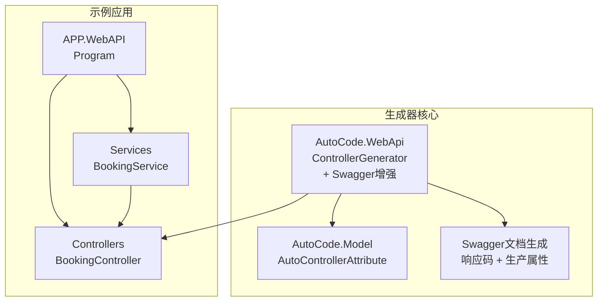
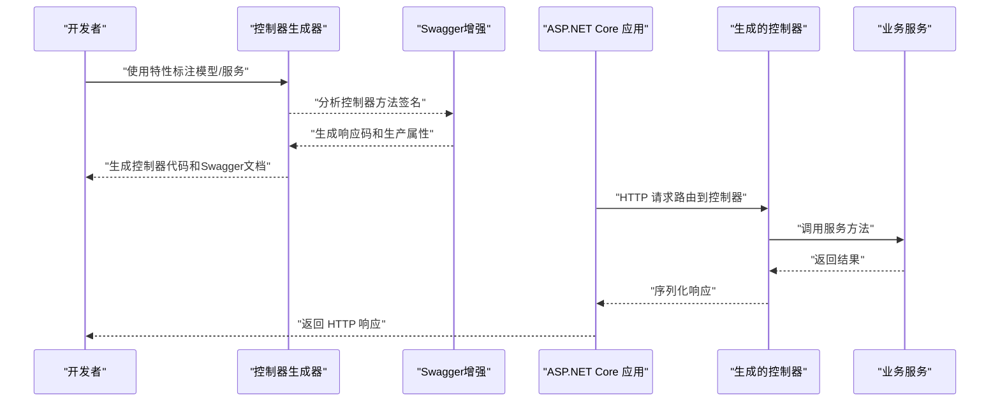
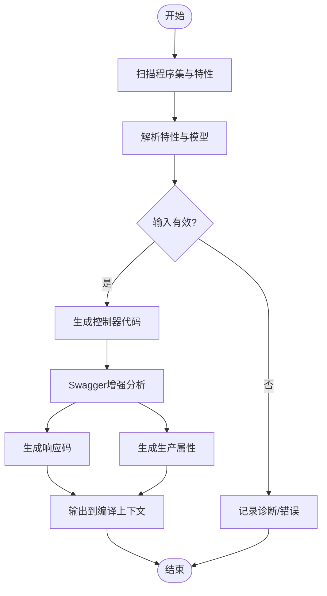
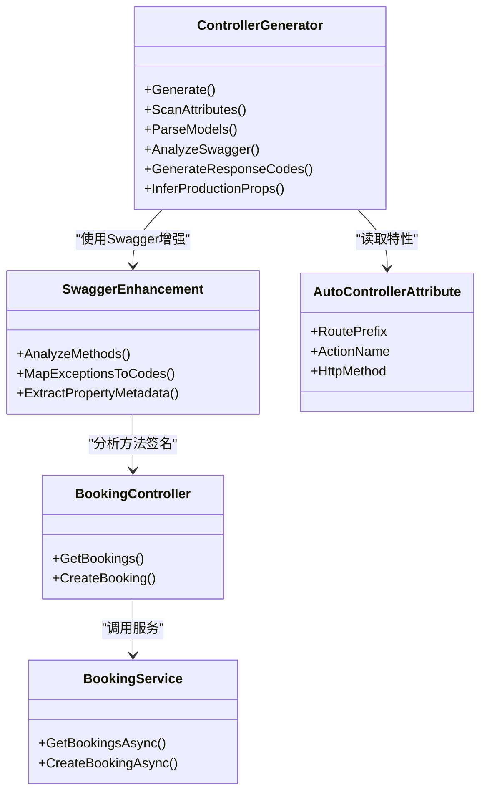

# Web API控制器生成器

<cite>
**本文档引用的文件**   
- [Program.cs](file://src/APP.WebAPI/Program.cs)
- [BookingController.cs](file://src/APP.WebAPI/Controllers/BookingController.cs)
- [BookingService.cs](file://src/APP.WebAPI/Services/BookingService.cs)
- [AutoControllerAttribute.cs](file://src/AutoCode.Model/AutoControllerAttribute.cs)
- [ControllerGenerator.cs](file://src/AutoCode.WebApi/ControllerGenerator.cs)
- [AutoCode.sln](file://src/AutoCode.sln)
</cite>

## 更新摘要
**所做更改**   
- 更新了ControllerGenerator组件分析，新增Swagger增强功能说明
- 添加了自动生成交响码和生产属性的详细文档
- 增强了API文档完整性和准确性的相关章节
- 更新了架构图表以反映新的Swagger集成特性

## 目录
1. [简介](#简介)
2. [项目结构](#项目结构)
3. [核心组件](#核心组件)
4. [架构总览](#架构总览)
5. [详细组件分析](#详细组件分析)
6. [依赖关系分析](#依赖关系分析)
7. [性能考量](#性能考量)
8. [故障排查指南](#故障排查指南)
9. [结论](#结论)
10. [附录](#附录)

## 简介
本仓库实现了一个"Web API 控制器生成器"，通过特性标注与源码生成器，自动为业务服务生成对应的 ASP.NET Core Web API 控制器。其目标是在保持代码简洁的同时，减少样板代码的重复编写，提升开发效率与一致性。**最新更新**：ControllerGenerator现已集成Swagger增强功能，能够自动生成交响码和生产属性，使API文档更加准确完整。

## 项目结构
- APP.WebAPI：示例应用，包含 Program、控制器与服务，用于演示生成器的使用方式。
- AutoCode.Model：定义控制器相关的特性（如 AutoControllerAttribute），供生成器识别。
- AutoCode.WebApi：控制器生成器核心逻辑，根据模型与特性生成控制器代码，**现已支持Swagger增强**。
- AutoCode.DependencyInjection：依赖注入相关扩展，便于在应用中注册生成的控制器或服务。
- AutoCode.Validation：验证器生成器（与本主题相关但非本次重点）。
- AutoCode.Map：映射生成器（与本主题相关但非本次重点）。
- AutoCode.Analyzers：静态分析器，辅助检查代码问题。
- AutoCode.Tests：单元测试与集成测试。

图表来源
- [Program.cs](file://src/APP.WebAPI/Program.cs)
- [BookingController.cs](file://src/APP.WebAPI/Controllers/BookingController.cs)
- [BookingService.cs](file://src/APP.WebAPI/Services/BookingService.cs)
- [ControllerGenerator.cs](file://src/AutoCode.WebApi/ControllerGenerator.cs)
- [AutoControllerAttribute.cs](file://src/AutoCode.Model/AutoControllerAttribute.cs)

章节来源
- [AutoCode.sln](file://src/AutoCode.sln)

## 核心组件
- 控制器特性（AutoControllerAttribute）：标记需要由生成器处理的类或接口，提供路由、动作名等元数据。
- 控制器生成器（ControllerGenerator）：读取特性与模型信息，生成符合 ASP.NET Core 规范的控制器代码，**现已集成Swagger增强功能**。
- **Swagger增强模块**：自动生成HTTP响应码和生产属性，提升API文档的准确性和完整性。
- 示例控制器（BookingController）：由生成器输出，暴露 RESTful 端点，调用 BookingService 完成业务逻辑。
- 示例服务（BookingService）：承载具体业务逻辑，被控制器调用。
- 应用入口（Program）：配置并启动 ASP.NET Core 应用，注册依赖注入容器与中间件。

章节来源
- [AutoControllerAttribute.cs](file://src/AutoCode.Model/AutoControllerAttribute.cs)
- [ControllerGenerator.cs](file://src/AutoCode.WebApi/ControllerGenerator.cs)
- [BookingController.cs](file://src/APP.WebAPI/Controllers/BookingController.cs)
- [BookingService.cs](file://src/APP.WebAPI/Services/BookingService.cs)
- [Program.cs](file://src/APP.WebAPI/Program.cs)

## 架构总览
整体流程如下：开发者在模型或服务上使用特性标注；生成器在编译期扫描这些标注，自动生成控制器代码和Swagger文档；运行时由 ASP.NET Core 加载控制器并处理 HTTP 请求，调用服务完成业务操作。**新增**：Swagger增强功能自动分析控制器方法，生成详细的响应码和生产属性信息。

图表来源
- [ControllerGenerator.cs](file://src/AutoCode.WebApi/ControllerGenerator.cs)
- [AutoControllerAttribute.cs](file://src/AutoCode.Model/AutoControllerAttribute.cs)
- [BookingController.cs](file://src/APP.WebAPI/Controllers/BookingController.cs)
- [BookingService.cs](file://src/APP.WebAPI/Services/BookingService.cs)
- [Program.cs](file://src/APP.WebAPI/Program.cs)

## 详细组件分析

### 控制器特性（AutoControllerAttribute）
- 作用：声明控制器元数据，如路由前缀、动作名、HTTP 方法等。
- 设计要点：
  - 作为特性类，提供属性以描述控制器的行为。
  - 与生成器配合，驱动代码生成过程。
- 复杂度：O(1) 读取特性属性；对生成器而言，解析成本取决于模型数量。

章节来源
- [AutoControllerAttribute.cs](file://src/AutoCode.Model/AutoControllerAttribute.cs)

### 控制器生成器（ControllerGenerator）
- 作用：基于特性与模型，生成控制器类与方法，**现已集成Swagger增强功能**。
- 关键流程：
  - 扫描程序集，识别带有特性的类型。
  - 解析特性参数与模型签名。
  - **新增**：分析控制器方法的返回类型和异常处理，生成Swagger响应码。
  - **新增**：自动推断生产属性，包括数据类型、必填字段、格式验证等。
  - 生成控制器代码并写入输出。
- 优化建议：
  - 增量生成，避免全量重算。
  - 缓存已解析的模型与特性信息。
  - **新增**：缓存Swagger文档生成结果，提高构建性能。

图表来源
- [ControllerGenerator.cs](file://src/AutoCode.WebApi/ControllerGenerator.cs)

章节来源
- [ControllerGenerator.cs](file://src/AutoCode.WebApi/ControllerGenerator.cs)

### Swagger增强功能
- 作用：**新增**的Swagger增强模块，自动分析控制器方法并生成详细的API文档信息。
- 核心特性：
  - **自动响应码生成**：根据方法返回类型和异常处理逻辑，智能推断HTTP状态码。
  - **生产属性推断**：自动识别数据类型、必填字段、验证规则等元数据。
  - **文档完整性保证**：确保生成的API文档与实际实现保持一致。
- 技术实现：
  - 静态分析控制器方法的签名和返回值。
  - 基于异常类型映射到相应的HTTP状态码。
  - 利用反射获取DTO和实体类的属性元数据。

章节来源
- [ControllerGenerator.cs](file://src/AutoCode.WebApi/ControllerGenerator.cs)

### 示例控制器（BookingController）
- 作用：对外暴露预订相关的 REST 端点，调用 BookingService 完成业务。
- 职责边界：
  - 接收 HTTP 请求，参数绑定与校验。
  - 调用服务层方法，处理返回值与异常。
  - 返回标准 JSON 响应。
- 性能考虑：
  - 避免在控制器中执行耗时逻辑。
  - 合理使用异步方法与缓存。
- **新增**：Swagger文档自动生成，无需手动维护API文档。

章节来源
- [BookingController.cs](file://src/APP.WebAPI/Controllers/BookingController.cs)

### 示例服务（BookingService）
- 作用：封装预订业务逻辑，提供可复用的方法。
- 设计要点：
  - 单一职责，关注业务规则与数据访问。
  - 通过依赖注入被控制器消费。
- 错误处理：
  - 抛出领域异常或返回错误码。
  - 与控制器协作进行统一错误处理。

章节来源
- [BookingService.cs](file://src/APP.WebAPI/Services/BookingService.cs)

### 应用入口（Program）
- 作用：配置 ASP.NET Core 管道，注册服务与中间件，启动应用。
- 关键点：
  - 启用 MVC/Web API 路由。
  - 注册依赖注入容器中的服务。
  - 配置日志、CORS、认证等通用中间件。
  - **新增**：集成Swagger文档生成中间件。

章节来源
- [Program.cs](file://src/APP.WebAPI/Program.cs)

## 依赖关系分析
- 控制器依赖于服务（BookingController -> BookingService）。
- 生成器依赖于特性定义（ControllerGenerator -> AutoControllerAttribute）。
- **新增**：Swagger增强模块依赖于控制器方法分析和反射机制。
- 应用入口负责组装各组件（Program -> Controllers, Services, DI）。

图表来源
- [ControllerGenerator.cs](file://src/AutoCode.WebApi/ControllerGenerator.cs)
- [AutoControllerAttribute.cs](file://src/AutoCode.Model/AutoControllerAttribute.cs)
- [BookingController.cs](file://src/APP.WebAPI/Controllers/BookingController.cs)
- [BookingService.cs](file://src/APP.WebAPI/Services/BookingService.cs)

章节来源
- [AutoCode.sln](file://src/AutoCode.sln)

## 性能考量
- 生成阶段：
  - 使用增量编译与缓存，降低重复计算开销。
  - 限制扫描范围，仅处理目标程序集。
  - **新增**：缓存Swagger文档生成结果，避免重复分析。
- 运行阶段：
  - 控制器方法应轻量，避免阻塞 I/O。
  - 合理设置超时与重试策略。
  - 对热点接口启用响应缓存。
  - **新增**：Swagger文档在编译时生成，运行时零开销。

## 故障排查指南
- 常见问题：
  - 特性未正确标注导致控制器未生成。
  - 模型签名不匹配导致生成失败。
  - 依赖注入未注册服务导致运行时异常。
  - **新增**：Swagger文档生成失败，通常由于复杂的泛型或自定义类型。
- 排查步骤：
  - 检查特性参数与模型定义是否一致。
  - 查看生成器输出的诊断信息。
  - 确认 Program 中是否正确注册服务与中间件。
  - **新增**：检查复杂类型的Swagger兼容性，必要时添加自定义文档注解。

章节来源
- [Program.cs](file://src/APP.WebAPI/Program.cs)
- [BookingController.cs](file://src/APP.WebAPI/Controllers/BookingController.cs)
- [BookingService.cs](file://src/APP.WebAPI/Services/BookingService.cs)
- [ControllerGenerator.cs](file://src/AutoCode.WebApi/ControllerGenerator.cs)
- [AutoControllerAttribute.cs](file://src/AutoCode.Model/AutoControllerAttribute.cs)

## 结论
该生成器通过特性与源码生成技术，显著减少了 Web API 控制器的样板代码，提升了开发效率与一致性。**最新增强**：Swagger增强功能的加入使得API文档自动生成且更加准确完整，进一步简化了API文档维护工作。结合清晰的依赖注入与模块化设计，可在大型项目中稳定扩展与维护。

## 附录
- 最佳实践：
  - 将业务逻辑下沉至服务层，控制器保持薄。
  - 使用统一的错误处理与响应格式。
  - 为关键接口添加单元测试与集成测试。
  - **新增**：充分利用Swagger增强的自动文档功能，减少手动文档维护。
- 扩展方向：
  - 支持更多 HTTP 方法与路由模式。
  - **已完成**：集成 OpenAPI/Swagger 文档生成。
  - 增强验证与授权机制。
  - **新增**：支持自定义Swagger文档注解和扩展。