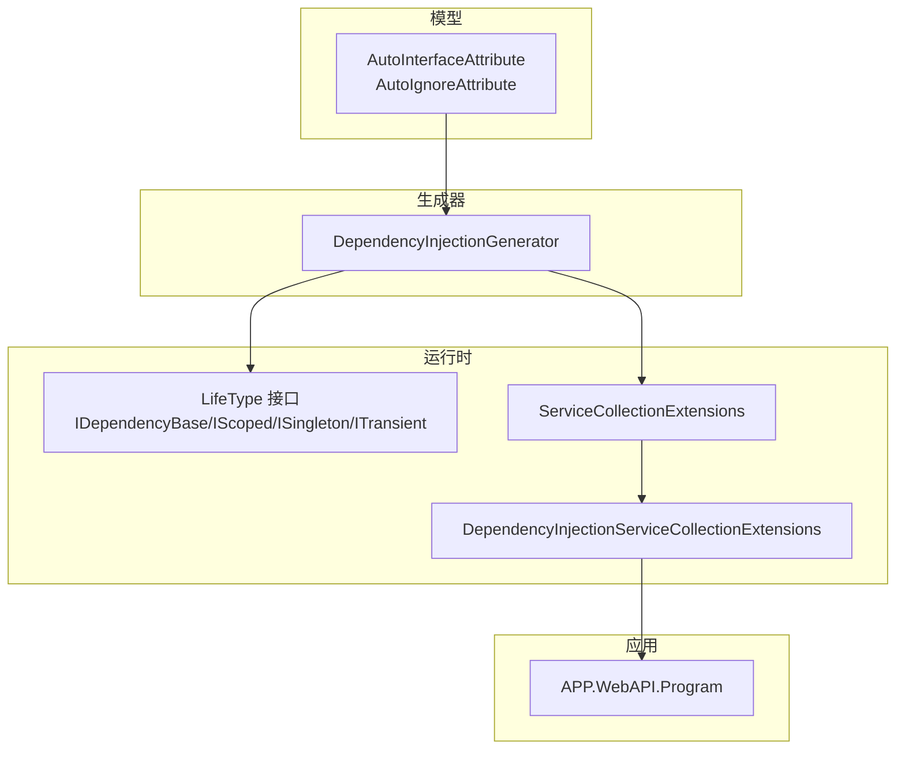
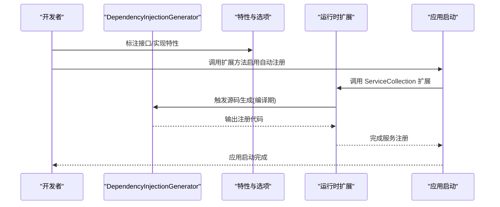
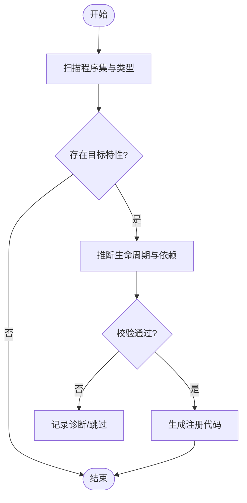
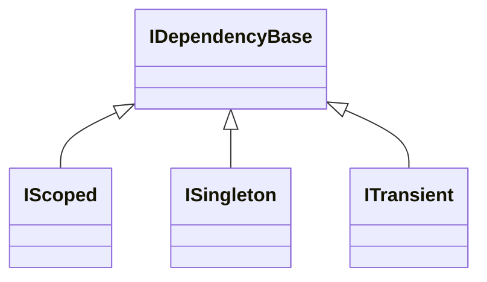
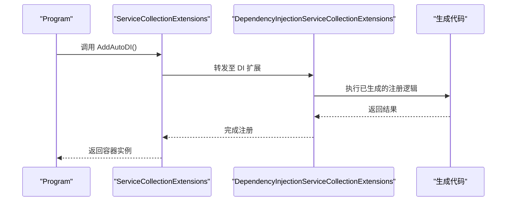
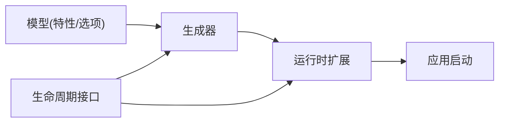

# 依赖注入注册生成器

<cite>
**本文引用的文件**   
- [DependencyInjectionGenerator.cs](file://src/AutoCode.DependencyInjection/DependencyInjectionGenerator.cs)
- [DependencyInjectionServiceCollectionExtensions.cs](file://src/APP.WebAPI.Core/DependencyInjection/DependencyInjectionServiceCollectionExtensions.cs)
- [IDependencyBase.cs](file://src/APP.WebAPI.Core/DependencyInjection/LifeType/IDependencyBase.cs)
- [IScoped.cs](file://src/APP.WebAPI.Core/DependencyInjection/LifeType/IScoped.cs)
- [ISingleton.cs](file://src/APP.WebAPI.Core/DependencyInjection/LifeType/ISingleton.cs)
- [ITransient.cs](file://src/APP.WebAPI.Core/DependencyInjection/LifeType/ITransient.cs)
- [Program.cs](file://src/APP.WebAPI/Program.cs)
- [ServiceCollectionExtensions.cs](file://src/APP.WebAPI.Core/Application/Extensions/ServiceCollectionExtensions.cs)
- [AutoInterfaceAttribute.cs](file://src/AutoCode.Model/InterfaceAttribute/AutoInterfaceAttribute.cs)
- [AutoIgnoreAttribute.cs](file://src/AutoCode.Model/InterfaceAttribute/AutoIgnoreAttribute.cs)
- [DependencyInjectionGeneratorTests.cs](file://src/AutoCode.Tests/DependencyInjectionGeneratorTests.cs)
</cite>

## 目录
1. [简介](#简介)
2. [项目结构](#项目结构)
3. [核心组件](#核心组件)
4. [架构总览](#架构总览)
5. [详细组件分析](#详细组件分析)
6. [依赖关系分析](#依赖关系分析)
7. [性能考量](#性能考量)
8. [故障排查指南](#故障排查指南)
9. [结论](#结论)
10. [附录](#附录)

## 简介
本仓库包含一个“依赖注入注册生成器”，用于在编译期扫描接口与实现，自动生成 .NET 服务容器的注册代码。通过约定优于配置的方式，开发者只需为接口或实现标注特性，即可由 Source Generator 产出高效的容器初始化代码，减少样板代码并提升可维护性。

该方案的核心思想：
- 使用轻量级标记（如 AutoInterfaceAttribute、AutoIgnoreAttribute）声明哪些类型需要参与 DI 注册。
- 在编译期由 Source Generator 解析语法树，收集候选类型与生命周期信息。
- 生成调用 IServiceProviderFactory / IServiceCollection 的注册代码，支持单例、作用域、瞬态等常见生命周期。
- 提供运行时扩展方法，将生成的注册逻辑以最小侵入方式接入应用启动流程。

## 项目结构
本项目采用多项目解决方案组织，围绕“模型定义 + 源码生成 + 运行时扩展 + 示例应用”分层展开：
- 模型层：定义特性与选项，供生成器识别。
- 生成器层：基于 Roslyn 的 Source Generator，负责扫描与代码生成。
- 运行时层：提供扩展方法与生命周期基类，简化集成。
- 示例与应用层：展示如何在 Web API 项目中启用并使用生成器。

图表来源
- [DependencyInjectionGenerator.cs](file://src/AutoCode.DependencyInjection/DependencyInjectionGenerator.cs)
- [AutoInterfaceAttribute.cs](file://src/AutoCode.Model/InterfaceAttribute/AutoInterfaceAttribute.cs)
- [AutoIgnoreAttribute.cs](file://src/AutoCode.Model/InterfaceAttribute/AutoIgnoreAttribute.cs)
- [IDependencyBase.cs](file://src/APP.WebAPI.Core/DependencyInjection/LifeType/IDependencyBase.cs)
- [IScoped.cs](file://src/APP.WebAPI.Core/DependencyInjection/LifeType/IScoped.cs)
- [ISingleton.cs](file://src/APP.WebAPI.Core/DependencyInjection/LifeType/ISingleton.cs)
- [ITransient.cs](file://src/APP.WebAPI.Core/DependencyInjection/LifeType/ITransient.cs)
- [ServiceCollectionExtensions.cs](file://src/APP.WebAPI.Core/Application/Extensions/ServiceCollectionExtensions.cs)
- [DependencyInjectionServiceCollectionExtensions.cs](file://src/APP.WebAPI.Core/DependencyInjection/DependencyInjectionServiceCollectionExtensions.cs)
- [Program.cs](file://src/APP.WebAPI/Program.cs)

章节来源
- [DependencyInjectionGenerator.cs](file://src/AutoCode.DependencyInjection/DependencyInjectionGenerator.cs)
- [AutoInterfaceAttribute.cs](file://src/AutoCode.Model/InterfaceAttribute/AutoInterfaceAttribute.cs)
- [AutoIgnoreAttribute.cs](file://src/AutoCode.Model/InterfaceAttribute/AutoIgnoreAttribute.cs)
- [ServiceCollectionExtensions.cs](file://src/APP.WebAPI.Core/Application/Extensions/ServiceCollectionExtensions.cs)
- [DependencyInjectionServiceCollectionExtensions.cs](file://src/APP.WebAPI.Core/DependencyInjection/DependencyInjectionServiceCollectionExtensions.cs)
- [Program.cs](file://src/APP.WebAPI/Program.cs)

## 核心组件
- 源码生成器
  - 职责：扫描程序集，识别带有特性的接口/实现，推断生命周期，生成容器注册代码。
  - 关键点：增量编译、错误诊断、避免重复注册、兼容多种容器扩展模式。
- 生命周期约定
  - 通过接口或基类表达生命周期（单例、作用域、瞬态），便于生成器统一处理。
- 运行时扩展
  - 提供统一的扩展方法，将自动注册逻辑接入 IServiceCollection。
- 特性与选项
  - 控制是否参与自动注册、忽略某些成员、指定映射策略等。

章节来源
- [DependencyInjectionGenerator.cs](file://src/AutoCode.DependencyInjection/DependencyInjectionGenerator.cs)
- [IDependencyBase.cs](file://src/APP.WebAPI.Core/DependencyInjection/LifeType/IDependencyBase.cs)
- [IScoped.cs](file://src/APP.WebAPI.Core/DependencyInjection/LifeType/IScoped.cs)
- [ISingleton.cs](file://src/APP.WebAPI.Core/DependencyInjection/LifeType/ISingleton.cs)
- [ITransient.cs](file://src/APP.WebAPI.Core/DependencyInjection/LifeType/ITransient.cs)
- [AutoInterfaceAttribute.cs](file://src/AutoCode.Model/InterfaceAttribute/AutoInterfaceAttribute.cs)
- [AutoIgnoreAttribute.cs](file://src/AutoCode.Model/InterfaceAttribute/AutoIgnoreAttribute.cs)

## 架构总览
下图展示了从“特性标记”到“源码生成”再到“运行时注册”的整体流程。

图表来源
- [DependencyInjectionGenerator.cs](file://src/AutoCode.DependencyInjection/DependencyInjectionGenerator.cs)
- [AutoInterfaceAttribute.cs](file://src/AutoCode.Model/InterfaceAttribute/AutoInterfaceAttribute.cs)
- [AutoIgnoreAttribute.cs](file://src/AutoCode.Model/InterfaceAttribute/AutoIgnoreAttribute.cs)
- [ServiceCollectionExtensions.cs](file://src/APP.WebAPI.Core/Application/Extensions/ServiceCollectionExtensions.cs)
- [DependencyInjectionServiceCollectionExtensions.cs](file://src/APP.WebAPI.Core/DependencyInjection/DependencyInjectionServiceCollectionExtensions.cs)
- [Program.cs](file://src/APP.WebAPI/Program.cs)

## 详细组件分析

### 源码生成器：DependencyInjectionGenerator
- 功能概述
  - 解析程序集中的类型与特性，筛选出需要注册的接口与实现。
  - 根据生命周期约定生成对应的 AddSingleton/AddScoped/AddTransient 调用。
  - 处理冲突与异常场景，确保生成代码的稳定性和可读性。
- 关键行为
  - 增量分析：仅对变更部分重新生成，提升构建性能。
  - 规则优先级：显式特性覆盖默认推断；忽略特性优先于自动发现。
  - 兼容性：适配不同容器扩展签名，必要时生成适配器代码。
- 复杂度与优化
  - 时间复杂度主要取决于被扫描的类型数量与特性匹配成本。
  - 通过缓存与增量机制降低重复工作。

图表来源
- [DependencyInjectionGenerator.cs](file://src/AutoCode.DependencyInjection/DependencyInjectionGenerator.cs)

章节来源
- [DependencyInjectionGenerator.cs](file://src/AutoCode.DependencyInjection/DependencyInjectionGenerator.cs)

### 生命周期约定：IDependencyBase / IScoped / ISingleton / ITransient
- 设计意图
  - 通过接口或基类明确表达生命周期，使生成器无需硬编码判断逻辑。
  - 便于在业务层统一约束与文档化。
- 使用建议
  - 优先使用细粒度接口（如 IScoped）表达更精确的生命周期。
  - 若需共享构造参数或通用行为，可使用基类封装。

图表来源
- [IDependencyBase.cs](file://src/APP.WebAPI.Core/DependencyInjection/LifeType/IDependencyBase.cs)
- [IScoped.cs](file://src/APP.WebAPI.Core/DependencyInjection/LifeType/IScoped.cs)
- [ISingleton.cs](file://src/APP.WebAPI.Core/DependencyInjection/LifeType/ISingleton.cs)
- [ITransient.cs](file://src/APP.WebAPI.Core/DependencyInjection/LifeType/ITransient.cs)

章节来源
- [IDependencyBase.cs](file://src/APP.WebAPI.Core/DependencyInjection/LifeType/IDependencyBase.cs)
- [IScoped.cs](file://src/APP.WebAPI.Core/DependencyInjection/LifeType/IScoped.cs)
- [ISingleton.cs](file://src/APP.WebAPI.Core/DependencyInjection/LifeType/ISingleton.cs)
- [ITransient.cs](file://src/APP.WebAPI.Core/DependencyInjection/LifeType/ITransient.cs)

### 运行时扩展：ServiceCollectionExtensions 与 DependencyInjectionServiceCollectionExtensions
- 职责
  - 暴露统一的扩展方法，供应用启动时调用。
  - 内部协调生成器产出的注册代码与实际容器初始化。
- 典型用法
  - 在 Program 中调用扩展方法，完成所有自动注册。
  - 可选择性地传入过滤条件或自定义策略。

图表来源
- [ServiceCollectionExtensions.cs](file://src/APP.WebAPI.Core/Application/Extensions/ServiceCollectionExtensions.cs)
- [DependencyInjectionServiceCollectionExtensions.cs](file://src/APP.WebAPI.Core/DependencyInjection/DependencyInjectionServiceCollectionExtensions.cs)
- [Program.cs](file://src/APP.WebAPI/Program.cs)

章节来源
- [ServiceCollectionExtensions.cs](file://src/APP.WebAPI.Core/Application/Extensions/ServiceCollectionExtensions.cs)
- [DependencyInjectionServiceCollectionExtensions.cs](file://src/APP.WebAPI.Core/DependencyInjection/DependencyInjectionServiceCollectionExtensions.cs)
- [Program.cs](file://src/APP.WebAPI/Program.cs)

### 特性与选项：AutoInterfaceAttribute 与 AutoIgnoreAttribute
- AutoInterfaceAttribute
  - 用于标记需要自动发现的接口或实现，通常配合生成器进行注册。
- AutoIgnoreAttribute
  - 用于排除特定类型或成员，避免被自动注册或映射。
- 使用建议
  - 保持特性使用的一致性，避免混合手动与自动注册造成混乱。
  - 在大型项目中，结合命名空间或模块划分管理特性范围。

章节来源
- [AutoInterfaceAttribute.cs](file://src/AutoCode.Model/InterfaceAttribute/AutoInterfaceAttribute.cs)
- [AutoIgnoreAttribute.cs](file://src/AutoCode.Model/InterfaceAttribute/AutoIgnoreAttribute.cs)

### 测试与验证：DependencyInjectionGeneratorTests
- 目的
  - 验证生成器在不同输入下的行为是否符合预期。
  - 覆盖正常路径、边界条件与错误场景。
- 建议
  - 新增特性或生命周期规则时，同步补充测试用例。
  - 使用快照测试对比生成代码的变化，确保稳定性。

章节来源
- [DependencyInjectionGeneratorTests.cs](file://src/AutoCode.Tests/DependencyInjectionGeneratorTests.cs)

## 依赖关系分析
- 生成器依赖模型层特性，运行时依赖扩展方法，应用层依赖扩展方法的调用点。
- 生命周期接口作为约定，贯穿生成与运行阶段，形成稳定的契约。

图表来源
- [AutoInterfaceAttribute.cs](file://src/AutoCode.Model/InterfaceAttribute/AutoInterfaceAttribute.cs)
- [AutoIgnoreAttribute.cs](file://src/AutoCode.Model/InterfaceAttribute/AutoIgnoreAttribute.cs)
- [DependencyInjectionGenerator.cs](file://src/AutoCode.DependencyInjection/DependencyInjectionGenerator.cs)
- [ServiceCollectionExtensions.cs](file://src/APP.WebAPI.Core/Application/Extensions/ServiceCollectionExtensions.cs)
- [DependencyInjectionServiceCollectionExtensions.cs](file://src/APP.WebAPI.Core/DependencyInjection/DependencyInjectionServiceCollectionExtensions.cs)
- [Program.cs](file://src/APP.WebAPI/Program.cs)
- [IDependencyBase.cs](file://src/APP.WebAPI.Core/DependencyInjection/LifeType/IDependencyBase.cs)
- [IScoped.cs](file://src/APP.WebAPI.Core/DependencyInjection/LifeType/IScoped.cs)
- [ISingleton.cs](file://src/APP.WebAPI.Core/DependencyInjection/LifeType/ISingleton.cs)
- [ITransient.cs](file://src/APP.WebAPI.Core/DependencyInjection/LifeType/ITransient.cs)

章节来源
- [DependencyInjectionGenerator.cs](file://src/AutoCode.DependencyInjection/DependencyInjectionGenerator.cs)
- [ServiceCollectionExtensions.cs](file://src/APP.WebAPI.Core/Application/Extensions/ServiceCollectionExtensions.cs)
- [DependencyInjectionServiceCollectionExtensions.cs](file://src/APP.WebAPI.Core/DependencyInjection/DependencyInjectionServiceCollectionExtensions.cs)
- [Program.cs](file://src/APP.WebAPI/Program.cs)

## 性能考量
- 增量编译：利用 Roslyn 增量能力，仅对变更部分重新生成，缩短构建时间。
- 扫描范围控制：限制扫描的程序集与命名空间，减少不必要的类型检查。
- 缓存策略：对已解析的特性与生命周期信息进行缓存，避免重复计算。
- 生成代码体积：尽量合并注册调用，减少运行时开销。

[本节为通用指导，不直接分析具体文件]

## 故障排查指南
- 常见问题
  - 未生效：确认是否正确引用了特性与扩展方法，且调用点在正确的生命周期阶段。
  - 重复注册：检查是否存在同名接口或多个实现同时被自动发现。
  - 生命周期错误：核对接口/实现是否实现了正确的生命周期接口。
- 调试建议
  - 查看生成器输出的诊断信息，定位问题类型与位置。
  - 临时关闭自动注册，逐步缩小范围，定位冲突来源。
  - 使用单元测试复现问题，确保修复有效。

章节来源
- [DependencyInjectionGeneratorTests.cs](file://src/AutoCode.Tests/DependencyInjectionGeneratorTests.cs)

## 结论
本依赖注入注册生成器通过“特性 + 源码生成 + 运行时扩展”的组合，提供了简洁、高效、可维护的服务注册方案。借助约定与自动化，开发者可以专注于业务实现，减少样板代码与出错概率。建议在大型项目中结合模块化与命名空间规范，进一步发挥其优势。

[本节为总结性内容，不直接分析具体文件]

## 附录
- 最佳实践
  - 明确生命周期：优先使用细粒度接口表达生命周期。
  - 合理划分模块：按领域或功能划分命名空间，便于特性管理与扫描。
  - 持续测试：为核心路径与边界条件编写测试，保障稳定性。
- 参考文件
  - 生成器实现：[DependencyInjectionGenerator.cs](file://src/AutoCode.DependencyInjection/DependencyInjectionGenerator.cs)
  - 运行时扩展：[ServiceCollectionExtensions.cs](file://src/APP.WebAPI.Core/Application/Extensions/ServiceCollectionExtensions.cs)、[DependencyInjectionServiceCollectionExtensions.cs](file://src/APP.WebAPI.Core/DependencyInjection/DependencyInjectionServiceCollectionExtensions.cs)
  - 生命周期接口：[IDependencyBase.cs](file://src/APP.WebAPI.Core/DependencyInjection/LifeType/IDependencyBase.cs)、[IScoped.cs](file://src/APP.WebAPI.Core/DependencyInjection/LifeType/IScoped.cs)、[ISingleton.cs](file://src/APP.WebAPI.Core/DependencyInjection/LifeType/ISingleton.cs)、[ITransient.cs](file://src/APP.WebAPI.Core/DependencyInjection/LifeType/ITransient.cs)
  - 特性定义：[AutoInterfaceAttribute.cs](file://src/AutoCode.Model/InterfaceAttribute/AutoInterfaceAttribute.cs)、[AutoIgnoreAttribute.cs](file://src/AutoCode.Model/InterfaceAttribute/AutoIgnoreAttribute.cs)
  - 应用入口：[Program.cs](file://src/APP.WebAPI/Program.cs)
  - 测试用例：[DependencyInjectionGeneratorTests.cs](file://src/AutoCode.Tests/DependencyInjectionGeneratorTests.cs)