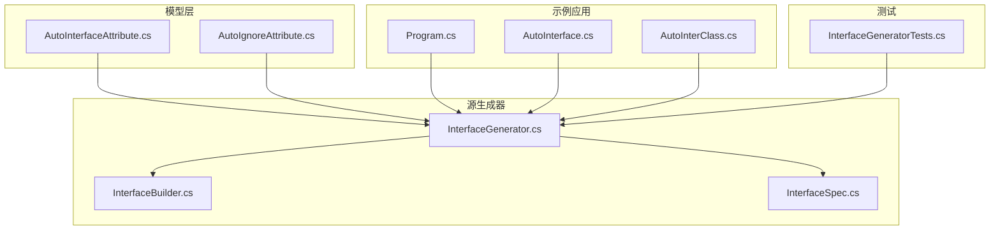
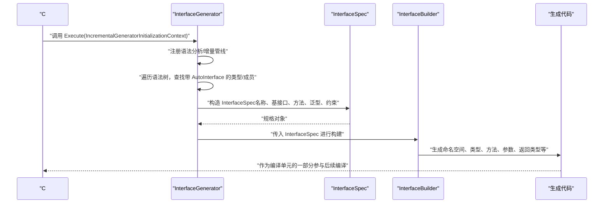
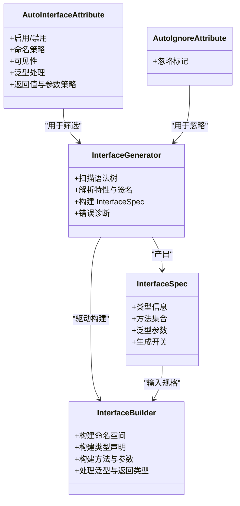

# 接口生成器

<cite>
**本文引用的文件**   
- [AutoInterface.cs](file://src/APP/AutoInterface.cs)
- [AutoInterClass.cs](file://src/APP/AutoInterClass.cs)
- [Program.cs](file://src/APP/Program.cs)
- [InterfaceGenerator.cs](file://src/AutoCodeGenerator/InterfaceAutoBuilder/InterfaceGenerator.cs)
- [InterfaceBuilder.cs](file://src/AutoCodeGenerator/InterfaceAutoBuilder/InterfaceBuilder.cs)
- [InterfaceSpec.cs](file://src/AutoCodeGenerator/InterfaceAutoBuilder/InterfaceSpec.cs)
- [AutoInterfaceAttribute.cs](file://src/AutoCode.Model/InterfaceAttribute/AutoInterfaceAttribute.cs)
- [AutoIgnoreAttribute.cs](file://src/AutoCode.Model/InterfaceAttribute/AutoIgnoreAttribute.cs)
- [InterfaceGeneratorTests.cs](file://src/AutoCode.Tests/InterfaceGeneratorTests.cs)
</cite>

## 目录
1. [简介](#简介)
2. [项目结构](#项目结构)
3. [核心组件](#核心组件)
4. [架构总览](#架构总览)
5. [详细组件分析](#详细组件分析)
6. [依赖关系分析](#依赖关系分析)
7. [性能考量](#性能考量)
8. [故障排查指南](#故障排查指南)
9. [结论](#结论)
10. [附录](#附录)

## 简介
本文件面向使用 AutoCode 的开发者，系统化说明“接口生成器”的工作原理与最佳实践。重点包括：
- [AutoInterface] 属性的配置选项、语义与约束
- InterfaceGenerator 如何扫描源代码中的接口标记
- InterfaceBuilder 如何构建生成的代码结构
- InterfaceSpec 如何定义接口的规格与约束
- 泛型接口与复杂方法签名的处理方式
- 接口继承、命名约定与错误处理的最佳实践

## 项目结构
该功能由“模型属性 + 源生成器 + 示例应用 + 测试”组成：
- 模型层提供特性（Attribute）用于标注接口与方法
- 源生成器在编译期扫描并生成实现或辅助代码
- 示例应用演示如何使用特性与生成产物
- 测试覆盖关键路径与边界情况

图表来源 
- [AutoInterfaceAttribute.cs](file://src/AutoCode.Model/InterfaceAttribute/AutoInterfaceAttribute.cs)
- [AutoIgnoreAttribute.cs](file://src/AutoCode.Model/InterfaceAttribute/AutoIgnoreAttribute.cs)
- [InterfaceGenerator.cs](file://src/AutoCodeGenerator/InterfaceAutoBuilder/InterfaceGenerator.cs)
- [InterfaceBuilder.cs](file://src/AutoCodeGenerator/InterfaceAutoBuilder/InterfaceBuilder.cs)
- [InterfaceSpec.cs](file://src/AutoCodeGenerator/InterfaceAutoBuilder/InterfaceSpec.cs)
- [Program.cs](file://src/APP/Program.cs)
- [AutoInterface.cs](file://src/APP/AutoInterface.cs)
- [AutoInterClass.cs](file://src/APP/AutoInterClass.cs)
- [InterfaceGeneratorTests.cs](file://src/AutoCode.Tests/InterfaceGeneratorTests.cs)

章节来源
- [AutoInterfaceAttribute.cs](file://src/AutoCode.Model/InterfaceAttribute/AutoInterfaceAttribute.cs)
- [AutoIgnoreAttribute.cs](file://src/AutoCode.Model/InterfaceAttribute/AutoIgnoreAttribute.cs)
- [InterfaceGenerator.cs](file://src/AutoCodeGenerator/InterfaceAutoBuilder/InterfaceGenerator.cs)
- [InterfaceBuilder.cs](file://src/AutoCodeGenerator/InterfaceAutoBuilder/InterfaceBuilder.cs)
- [InterfaceSpec.cs](file://src/AutoCodeGenerator/InterfaceAutoBuilder/InterfaceSpec.cs)
- [Program.cs](file://src/APP/Program.cs)
- [AutoInterface.cs](file://src/APP/AutoInterface.cs)
- [AutoInterClass.cs](file://src/APP/AutoInterClass.cs)
- [InterfaceGeneratorTests.cs](file://src/AutoCode.Tests/InterfaceGeneratorTests.cs)

## 核心组件
- 特性定义
  - AutoInterfaceAttribute：用于标注需要参与接口生成的目标类型或成员，支持多种配置项以控制生成行为。
  - AutoIgnoreAttribute：用于排除特定成员或类型不参与生成。
- 源生成器
  - InterfaceGenerator：编译期入口，负责语法树遍历、筛选带特性的接口、解析签名与泛型、收集约束，并驱动后续构建。
  - InterfaceBuilder：根据 InterfaceSpec 构建最终的代码结构（命名空间、类/接口声明、方法签名、参数、返回类型等）。
  - InterfaceSpec：描述一个待生成接口的完整规格，包含名称、基接口、方法列表、泛型参数、访问修饰符、注释等。
- 示例与测试
  - Program.cs / AutoInterface.cs / AutoInterClass.cs：展示如何在项目中引入并使用特性与生成结果。
  - InterfaceGeneratorTests.cs：验证生成逻辑的正确性与边界条件。

章节来源
- [AutoInterfaceAttribute.cs](file://src/AutoCode.Model/InterfaceAttribute/AutoInterfaceAttribute.cs)
- [AutoIgnoreAttribute.cs](file://src/AutoCode.Model/InterfaceAttribute/AutoIgnoreAttribute.cs)
- [InterfaceGenerator.cs](file://src/AutoCodeGenerator/InterfaceAutoBuilder/InterfaceGenerator.cs)
- [InterfaceBuilder.cs](file://src/AutoCodeGenerator/InterfaceAutoBuilder/InterfaceBuilder.cs)
- [InterfaceSpec.cs](file://src/AutoCodeGenerator/InterfaceAutoBuilder/InterfaceSpec.cs)
- [Program.cs](file://src/APP/Program.cs)
- [AutoInterface.cs](file://src/APP/AutoInterface.cs)
- [AutoInterClass.cs](file://src/APP/AutoInterClass.cs)
- [InterfaceGeneratorTests.cs](file://src/AutoCode.Tests/InterfaceGeneratorTests.cs)

## 架构总览
下图展示了从源码到生成代码的关键流程：编译器触发源生成器，InterfaceGenerator 扫描并解析，InterfaceSpec 承载规格，InterfaceBuilder 输出最终代码。

图表来源 
- [InterfaceGenerator.cs](file://src/AutoCodeGenerator/InterfaceAutoBuilder/InterfaceGenerator.cs)
- [InterfaceSpec.cs](file://src/AutoCodeGenerator/InterfaceAutoBuilder/InterfaceSpec.cs)
- [InterfaceBuilder.cs](file://src/AutoCodeGenerator/InterfaceAutoBuilder/InterfaceBuilder.cs)

## 详细组件分析

### AutoInterface 属性工作原理
- 作用范围
  - 可应用于接口类型本身或其成员（方法、属性），用于指示是否参与生成以及生成策略。
- 主要配置项（概念性说明）
  - 启用/禁用：控制是否对该类型或成员执行生成。
  - 命名策略：自定义生成后的类型名或成员名规则。
  - 可见性：设置生成成员的访问级别（如 public/internal）。
  - 忽略策略：与 AutoIgnoreAttribute 配合，精确排除不需要生成的部分。
  - 泛型处理：指定是否保留泛型参数、如何处理约束、是否展开为具体类型等。
  - 返回值与参数：是否包装异步任务、是否添加空检查、是否序列化相关标记等。
- 与 AutoIgnoreAttribute 的关系
  - AutoIgnoreAttribute 优先级更高，当两者同时存在时，忽略优先。

章节来源
- [AutoInterfaceAttribute.cs](file://src/AutoCode.Model/InterfaceAttribute/AutoInterfaceAttribute.cs)
- [AutoIgnoreAttribute.cs](file://src/AutoCode.Model/InterfaceAttribute/AutoIgnoreAttribute.cs)

### InterfaceGenerator：扫描与解析
- 职责
  - 注册增量生成管线，监听语法树变化。
  - 筛选带有 AutoInterfaceAttribute 的目标类型与成员。
  - 解析方法签名、参数类型、返回类型、泛型参数及约束。
  - 将解析结果汇总为 InterfaceSpec。
- 关键点
  - 增量更新：仅对变更的语法节点重新处理，提升性能。
  - 诊断信息：对非法用法给出清晰的编译期诊断。
  - 过滤规则：结合 AutoIgnoreAttribute 与特性配置决定最终纳入集合的成员。

章节来源
- [InterfaceGenerator.cs](file://src/AutoCodeGenerator/InterfaceAutoBuilder/InterfaceGenerator.cs)
- [InterfaceGeneratorTests.cs](file://src/AutoCode.Tests/InterfaceGeneratorTests.cs)

### InterfaceSpec：接口规格与约束
- 内容
  - 类型基本信息：命名空间、类型名、基接口、访问修饰符、注释。
  - 方法集合：方法名、参数列表（名称、类型、可选性）、返回类型、异常声明。
  - 泛型信息：类型参数、约束、是否协变/逆变。
  - 生成开关：是否生成、生成策略、命名规则、可见性等。
- 设计要点
  - 不可变性：规格对象一旦创建不应被修改，保证线程安全与一致性。
  - 可扩展性：新增字段不影响既有逻辑，便于扩展新特性。

章节来源
- [InterfaceSpec.cs](file://src/AutoCodeGenerator/InterfaceAutoBuilder/InterfaceSpec.cs)

### InterfaceBuilder：构建生成代码
- 职责
  - 接收 InterfaceSpec，生成完整的 C# 代码文本。
  - 处理命名空间、类型声明、方法签名、参数、返回类型、泛型、注释等。
  - 确保生成代码符合 C# 语法规范与风格约定。
- 关键点
  - 模板化/结构化构建：通过 API 逐步拼装代码结构，避免字符串拼接带来的脆弱性。
  - 类型映射：将语言层面的类型表达转换为正确的生成代码表示。
  - 冲突解决：处理重名、命名空间冲突、泛型参数名冲突等问题。

章节来源
- [InterfaceBuilder.cs](file://src/AutoCodeGenerator/InterfaceAutoBuilder/InterfaceBuilder.cs)

### 端到端流程与示例
- 使用方式
  - 在接口或类型上添加 AutoInterfaceAttribute，按需配置。
  - 使用 AutoIgnoreAttribute 排除不需要生成的成员。
  - 编译后，InterfaceGenerator 自动生成所需代码。
- 示例位置
  - Program.cs、AutoInterface.cs、AutoInterClass.cs 中展示了基本用法与集成方式。

章节来源
- [Program.cs](file://src/APP/Program.cs)
- [AutoInterface.cs](file://src/APP/AutoInterface.cs)
- [AutoInterClass.cs](file://src/APP/AutoInterClass.cs)

### 泛型接口与复杂方法签名
- 泛型处理
  - 保留泛型参数与约束，必要时按策略展开为具体类型。
  - 处理嵌套泛型、数组、委托、Task/ValueTask 等复杂返回类型。
- 方法签名
  - 支持 ref/out、params、默认参数、重载、异步方法等。
  - 参数命名与顺序保持原样，确保生成代码可读性与一致性。

章节来源
- [InterfaceGenerator.cs](file://src/AutoCodeGenerator/InterfaceAutoBuilder/InterfaceGenerator.cs)
- [InterfaceSpec.cs](file://src/AutoCodeGenerator/InterfaceAutoBuilder/InterfaceSpec.cs)
- [InterfaceBuilder.cs](file://src/AutoCodeGenerator/InterfaceAutoBuilder/InterfaceBuilder.cs)

### 接口继承与命名约定
- 继承
  - 支持多基接口与继承链，生成时会正确维护继承关系。
  - 冲突检测：同名成员、泛型参数冲突会在解析阶段报错。
- 命名
  - 默认遵循 C# 命名规范；可通过特性配置自定义前缀/后缀或大小写策略。
  - 建议统一命名空间组织，避免跨项目命名冲突。

章节来源
- [InterfaceGenerator.cs](file://src/AutoCodeGenerator/InterfaceAutoBuilder/InterfaceGenerator.cs)
- [InterfaceBuilder.cs](file://src/AutoCodeGenerator/InterfaceAutoBuilder/InterfaceBuilder.cs)

### 错误处理与诊断
- 常见错误
  - 非法特性组合、不支持的返回类型、无法解析的泛型约束。
  - 命名冲突、重复定义、访问修饰符不一致。
- 诊断策略
  - 编译期诊断：提供明确错误消息与定位行号。
  - 容错策略：跳过错误节点继续处理其他合法节点，保证整体生成不中断。

章节来源
- [InterfaceGenerator.cs](file://src/AutoCodeGenerator/InterfaceAutoBuilder/InterfaceGenerator.cs)
- [InterfaceGeneratorTests.cs](file://src/AutoCode.Tests/InterfaceGeneratorTests.cs)

## 依赖关系分析
- 内部依赖
  - InterfaceGenerator 依赖 AutoInterfaceAttribute/AutoIgnoreAttribute 进行筛选。
  - InterfaceGenerator 产出 InterfaceSpec，供 InterfaceBuilder 消费。
  - InterfaceBuilder 依赖 .NET 语法与类型系统工具进行代码生成。
- 外部依赖
  - Roslyn 语法树与增量生成框架。
  - 标准库类型系统与反射（如需运行时校验）。

图表来源 
- [AutoInterfaceAttribute.cs](file://src/AutoCode.Model/InterfaceAttribute/AutoInterfaceAttribute.cs)
- [AutoIgnoreAttribute.cs](file://src/AutoCode.Model/InterfaceAttribute/AutoIgnoreAttribute.cs)
- [InterfaceGenerator.cs](file://src/AutoCodeGenerator/InterfaceAutoBuilder/InterfaceGenerator.cs)
- [InterfaceSpec.cs](file://src/AutoCodeGenerator/InterfaceAutoBuilder/InterfaceSpec.cs)
- [InterfaceBuilder.cs](file://src/AutoCodeGenerator/InterfaceAutoBuilder/InterfaceBuilder.cs)

章节来源
- [AutoInterfaceAttribute.cs](file://src/AutoCode.Model/InterfaceAttribute/AutoInterfaceAttribute.cs)
- [AutoIgnoreAttribute.cs](file://src/AutoCode.Model/InterfaceAttribute/AutoIgnoreAttribute.cs)
- [InterfaceGenerator.cs](file://src/AutoCodeGenerator/InterfaceAutoBuilder/InterfaceGenerator.cs)
- [InterfaceSpec.cs](file://src/AutoCodeGenerator/InterfaceAutoBuilder/InterfaceSpec.cs)
- [InterfaceBuilder.cs](file://src/AutoCodeGenerator/InterfaceAutoBuilder/InterfaceBuilder.cs)

## 性能考量
- 增量生成：仅对变更的语法节点进行处理，减少不必要的计算。
- 早期过滤：在解析阶段尽早剔除无关节点，降低后续开销。
- 不可变规格：InterfaceSpec 不可变设计避免拷贝与同步成本。
- 缓存策略：对常用类型映射与模板片段进行缓存，提高生成速度。

[本节为通用指导，无需引用具体文件]

## 故障排查指南
- 常见问题
  - 未生成代码：检查是否正确添加 AutoInterfaceAttribute，且未被 AutoIgnoreAttribute 忽略。
  - 生成代码不完整：查看诊断信息，确认是否存在不支持的返回类型或泛型约束。
  - 命名冲突：调整命名策略或重构类型名，避免冲突。
- 调试步骤
  - 启用详细日志与诊断输出。
  - 最小化复现：剥离无关代码，聚焦问题点。
  - 单元测试：参考 InterfaceGeneratorTests.cs 的断言模式验证生成结果。

章节来源
- [InterfaceGenerator.cs](file://src/AutoCodeGenerator/InterfaceAutoBuilder/InterfaceGenerator.cs)
- [InterfaceGeneratorTests.cs](file://src/AutoCode.Tests/InterfaceGeneratorTests.cs)

## 结论
接口生成器通过特性驱动的编译期代码生成，显著降低了手写样板代码的成本。合理配置 AutoInterfaceAttribute、正确使用 AutoIgnoreAttribute、遵循命名与继承约定，并结合完善的错误处理与测试，可获得稳定高效的开发体验。

[本节为总结性内容，无需引用具体文件]

## 附录
- 最佳实践清单
  - 明确划分生成与非生成区域，使用 AutoIgnoreAttribute 精准排除。
  - 统一命名空间与类型命名，避免冲突。
  - 对复杂泛型与异步方法，先在测试中验证生成结果。
  - 持续完善诊断信息，帮助快速定位问题。
- 参考示例
  - 在 Program.cs、AutoInterface.cs、AutoInterClass.cs 中查看基础用法。
  - 在 InterfaceGeneratorTests.cs 中了解断言与边界用例。

章节来源
- [Program.cs](file://src/APP/Program.cs)
- [AutoInterface.cs](file://src/APP/AutoInterface.cs)
- [AutoInterClass.cs](file://src/APP/AutoInterClass.cs)
- [InterfaceGeneratorTests.cs](file://src/AutoCode.Tests/InterfaceGeneratorTests.cs)