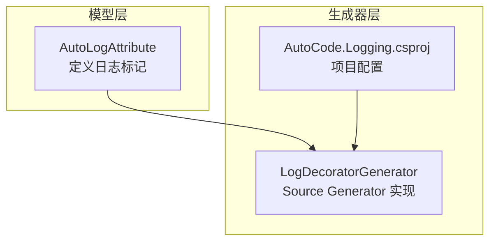
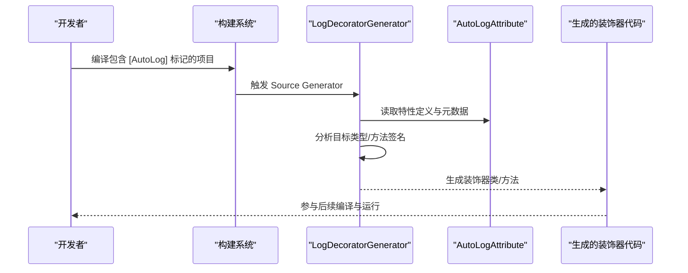
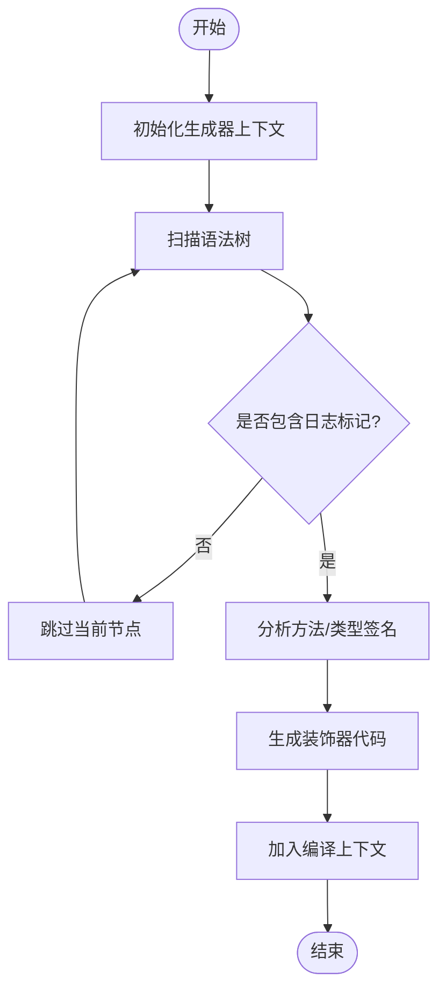
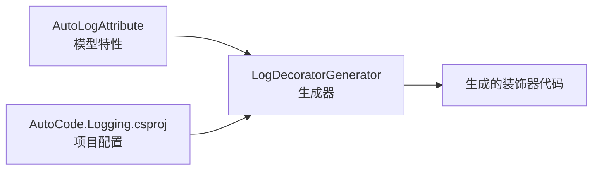

# 日志装饰器生成器

<cite>
**本文引用的文件**   
- [LogDecoratorGenerator.cs](file://src/AutoCode.Logging/LogDecoratorGenerator.cs)
- [AutoCode.Logging.csproj](file://src/AutoCode.Logging/AutoCode.Logging.csproj)
- [AutoLogAttribute.cs](file://src/AutoCode.Model/AutoLogAttribute.cs)
</cite>

## 目录
1. [简介](#简介)
2. [项目结构](#项目结构)
3. [核心组件](#核心组件)
4. [架构总览](#架构总览)
5. [详细组件分析](#详细组件分析)
6. [依赖关系分析](#依赖关系分析)
7. [性能考量](#性能考量)
8. [故障排查指南](#故障排查指南)
9. [结论](#结论)
10. [附录](#附录)

## 简介
本仓库包含一个“日志装饰器生成器”，用于在编译期根据标记自动为服务类或接口生成带日志能力的装饰器实现。该能力通过 Source Generator 技术，扫描带有特定属性的类型与方法，自动生成对应的装饰器代码，从而在不侵入业务逻辑的前提下统一注入日志记录、异常捕获与耗时统计等横切关注点。

## 项目结构
与日志装饰器生成器直接相关的代码位于 AutoCode.Logging 工程，模型定义位于 AutoCode.Model 工程。整体组织遵循“特性（属性）+ 生成器”的解耦模式：
- AutoCode.Model：定义 AutoLogAttribute，作为目标类型的标记。
- AutoCode.Logging：实现 LogDecoratorGenerator，读取语法树并生成装饰器代码。
- AutoCode.Logging.csproj：声明对 Source Generator 框架及模型的引用。

图表来源
- [AutoLogAttribute.cs](file://src/AutoCode.Model/AutoLogAttribute.cs)
- [LogDecoratorGenerator.cs](file://src/AutoCode.Logging/LogDecoratorGenerator.cs)
- [AutoCode.Logging.csproj](file://src/AutoCode.Logging/AutoCode.Logging.csproj)

章节来源
- [LogDecoratorGenerator.cs](file://src/AutoCode.Logging/LogDecoratorGenerator.cs)
- [AutoCode.Logging.csproj](file://src/AutoCode.Logging/AutoCode.Logging.csproj)
- [AutoLogAttribute.cs](file://src/AutoCode.Model/AutoLogAttribute.cs)

## 核心组件
- 日志标记特性：用于标注需要被装饰的目标类型或方法。
- 日志装饰器生成器：基于 Roslyn Source Generator，解析标记并输出装饰器代码。
- 项目文件：声明生成器依赖与运行环境。

章节来源
- [AutoLogAttribute.cs](file://src/AutoCode.Model/AutoLogAttribute.cs)
- [LogDecoratorGenerator.cs](file://src/AutoCode.Logging/LogDecoratorGenerator.cs)
- [AutoCode.Logging.csproj](file://src/AutoCode.Logging/AutoCode.Logging.csproj)

## 架构总览
下图展示了从“标记发现”到“装饰器生成”的整体流程，以及生成产物如何与宿主应用集成。

图表来源
- [LogDecoratorGenerator.cs](file://src/AutoCode.Logging/LogDecoratorGenerator.cs)
- [AutoLogAttribute.cs](file://src/AutoCode.Model/AutoLogAttribute.cs)

## 详细组件分析

### 日志标记特性（AutoLogAttribute）
- 作用：标识需要被装饰的类型或方法，使生成器能够识别并处理。
- 使用位置：可应用于类、接口或方法级别，具体取决于生成器的实现策略。
- 设计要点：保持轻量，仅承载必要元数据，避免影响运行时性能。

章节来源
- [AutoLogAttribute.cs](file://src/AutoCode.Model/AutoLogAttribute.cs)

### 日志装饰器生成器（LogDecoratorGenerator）
- 角色：Source Generator 实现，负责在编译期扫描语法树，定位带有日志标记的目标，并生成对应的装饰器代码。
- 关键职责：
  - 注册并监听相关语法节点（如类、接口、方法）。
  - 解析 AutoLogAttribute 的存在与参数。
  - 生成装饰器类，包装原始类型的方法调用，注入日志逻辑。
  - 将生成的代码添加到编译上下文，供后续编译阶段使用。
- 典型流程：
  - 初始化与注册
  - 遍历候选节点
  - 匹配标记与约束
  - 生成装饰器代码
  - 输出至编译结果

图表来源
- [LogDecoratorGenerator.cs](file://src/AutoCode.Logging/LogDecoratorGenerator.cs)

章节来源
- [LogDecoratorGenerator.cs](file://src/AutoCode.Logging/LogDecoratorGenerator.cs)

### 项目文件（AutoCode.Logging.csproj）
- 内容要点：声明对 Source Generator 框架的引用、目标框架版本、以及可能的 NuGet 包依赖。
- 作用：确保生成器能在正确的 .NET 环境中运行，并正确加载模型特性。

章节来源
- [AutoCode.Logging.csproj](file://src/AutoCode.Logging/AutoCode.Logging.csproj)

## 依赖关系分析
- 生成器依赖模型特性：LogDecoratorGenerator 依赖 AutoLogAttribute 的定义以识别目标。
- 构建系统集成：通过 csproj 配置，将生成器作为 Source Generator 参与编译管线。
- 外部库：可能依赖 Roslyn 相关 API 进行语法分析与代码生成。

图表来源
- [AutoLogAttribute.cs](file://src/AutoCode.Model/AutoLogAttribute.cs)
- [LogDecoratorGenerator.cs](file://src/AutoCode.Logging/LogDecoratorGenerator.cs)
- [AutoCode.Logging.csproj](file://src/AutoCode.Logging/AutoCode.Logging.csproj)

章节来源
- [AutoCode.Logging.csproj](file://src/AutoCode.Logging/AutoCode.Logging.csproj)
- [AutoLogAttribute.cs](file://src/AutoCode.Model/AutoLogAttribute.cs)
- [LogDecoratorGenerator.cs](file://src/AutoCode.Logging/LogDecoratorGenerator.cs)

## 性能考量
- 编译期开销：Source Generator 在增量编译中应尽量减少不必要的分析范围，优先过滤无关节点。
- 生成代码体积：装饰器应尽量精简，避免引入额外依赖或复杂逻辑。
- 内存占用：避免在生成过程中持有大对象或重复解析相同信息。

[本节为通用指导，不直接分析具体文件]

## 故障排查指南
- 未生成装饰器：
  - 检查目标类型/方法是否正确应用了日志标记。
  - 确认项目已引用包含生成器的包或项目，并在 csproj 中启用 Source Generator。
- 生成代码缺失或错误：
  - 查看生成器诊断输出，定位语法分析失败的原因。
  - 核对方法签名与生成器期望的约束是否一致。
- 运行时行为异常：
  - 确认装饰器是否正确注入到依赖容器中（若适用）。
  - 检查日志框架配置与输出路径。

章节来源
- [LogDecoratorGenerator.cs](file://src/AutoCode.Logging/LogDecoratorGenerator.cs)
- [AutoCode.Logging.csproj](file://src/AutoCode.Logging/AutoCode.Logging.csproj)
- [AutoLogAttribute.cs](file://src/AutoCode.Model/AutoLogAttribute.cs)

## 结论
日志装饰器生成器通过“标记 + 生成器”的模式，实现了在不侵入业务代码的情况下统一注入日志能力。其核心在于清晰的职责划分与松耦合的依赖关系，既保证了可维护性，也提升了开发效率。建议在实际使用中结合项目的依赖注入与日志框架，形成一致的横切关注点解决方案。

[本节为总结性内容，不直接分析具体文件]

## 附录
- 最佳实践：
  - 仅在必要时使用日志标记，避免过度装饰。
  - 保持特性参数简洁，减少生成复杂度。
  - 配合单元测试验证生成代码的正确性。
- 扩展方向：
  - 增加更多横切关注点（如重试、缓存、权限校验）。
  - 提供可视化诊断与调试工具。

[本节为补充说明，不直接分析具体文件]