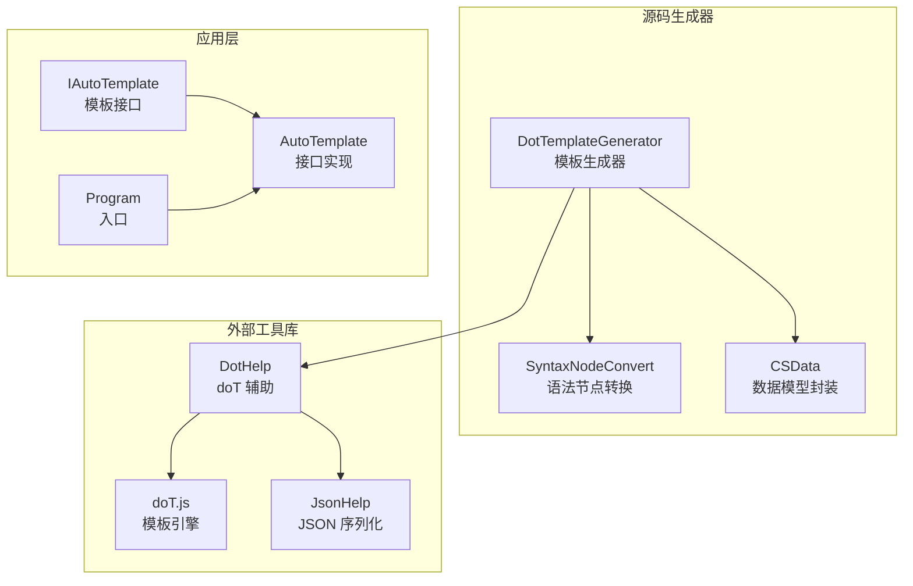
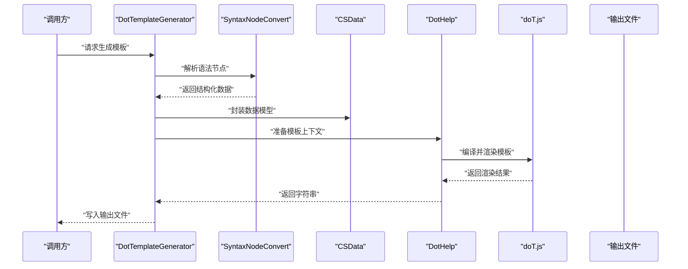
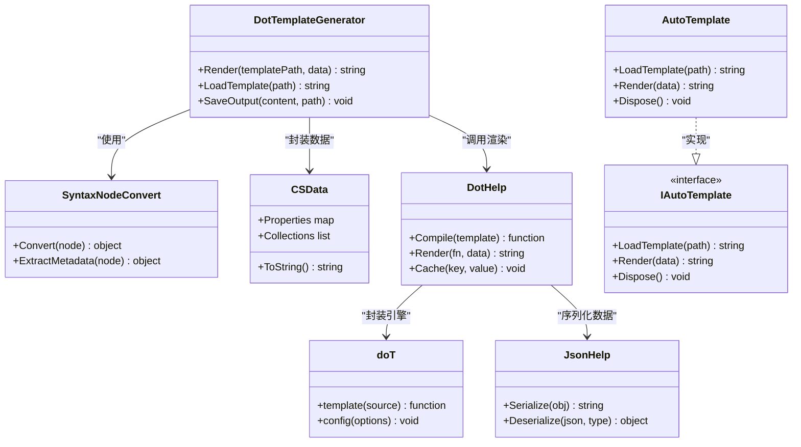

# 模板生成器

<cite>
**本文引用的文件**   
- [DotTemplateGenerator.cs](file://src/AutoCode.XmlTemplate.SourceGenerator/DotTemplateGenerator.cs)
- [CSData.cs](file://src/AutoCode.XmlTemplate.SourceGenerator/CSData.cs)
- [SyntaxNodeConvert.cs](file://src/AutoCode.XmlTemplate.SourceGenerator/SyntaxNodeConvert.cs)
- [IAutoTemplate.cs](file://src/DotTemplate.APP/IAutoTemplate.cs)
- [AutoTemplate.cs](file://src/DotTemplate.APP/AutoTemplate.cs)
- [doT.js](file://src/AutoCode.XmlTemplate.External/doT.js)
- [DotHelp.cs](file://src/AutoCode.XmlTemplate.External/DotHelp.cs)
- [JsonHelp.cs](file://src/AutoCode.XmlTemplate.External/JsonHelp.cs)
- [DotTemplateAttribute.cs](file://src/AutoCode.Model/DotFileAttribute/DotTemplateAttribute.cs)
- [Program.cs](file://src/DotTemplate.APP/Program.cs)
</cite>

## 目录
1. [简介](#简介)
2. [项目结构](#项目结构)
3. [核心组件](#核心组件)
4. [架构总览](#架构总览)
5. [详细组件分析](#详细组件分析)
6. [依赖关系分析](#依赖关系分析)
7. [性能考虑](#性能考虑)
8. [故障排查指南](#故障排查指南)
9. [结论](#结论)
10. [附录](#附录)

## 简介
本文件面向模板生成器的使用者与维护者，系统性阐述 doT.js 模板引擎在 C# 源码生成流程中的集成方式与运行机制。重点覆盖：
- doT.js 模板语法、数据绑定与渲染机制
- DotTemplateGenerator 类对模板文件的处理流程
- CSData 数据模型封装策略
- IAutoTemplate 接口的设计模式与扩展点
- 自定义模板创建、数据模型定义、条件逻辑与循环结构的完整示例路径
- 模板调试技巧、性能优化与最佳实践

## 项目结构
本项目围绕“源码生成 + doT.js 模板渲染”的混合架构展开，关键目录与职责如下：
- AutoCode.XmlTemplate.SourceGenerator：源码生成器核心，负责解析语法节点、构建数据模型并调用 doT.js 渲染模板
- AutoCode.XmlTemplate.External：外部工具库，封装 doT.js、JSON 序列化与辅助方法
- AutoCode.Model：属性与特性定义（如 DotTemplateAttribute）用于标注模板关联
- DotTemplate.APP：演示与应用层，提供 IAutoTemplate 接口实现与运行入口

图表来源 
- [DotTemplateGenerator.cs](file://src/AutoCode.XmlTemplate.SourceGenerator/DotTemplateGenerator.cs)
- [CSData.cs](file://src/AutoCode.XmlTemplate.SourceGenerator/CSData.cs)
- [SyntaxNodeConvert.cs](file://src/AutoCode.XmlTemplate.SourceGenerator/SyntaxNodeConvert.cs)
- [doT.js](file://src/AutoCode.XmlTemplate.External/doT.js)
- [DotHelp.cs](file://src/AutoCode.XmlTemplate.External/DotHelp.cs)
- [JsonHelp.cs](file://src/AutoCode.XmlTemplate.External/JsonHelp.cs)
- [IAutoTemplate.cs](file://src/DotTemplate.APP/IAutoTemplate.cs)
- [AutoTemplate.cs](file://src/DotTemplate.APP/AutoTemplate.cs)
- [Program.cs](file://src/DotTemplate.APP/Program.cs)

章节来源
- [DotTemplateGenerator.cs](file://src/AutoCode.XmlTemplate.SourceGenerator/DotTemplateGenerator.cs)
- [CSData.cs](file://src/AutoCode.XmlTemplate.SourceGenerator/CSData.cs)
- [SyntaxNodeConvert.cs](file://src/AutoCode.XmlTemplate.SourceGenerator/SyntaxNodeConvert.cs)
- [doT.js](file://src/AutoCode.XmlTemplate.External/doT.js)
- [DotHelp.cs](file://src/AutoCode.XmlTemplate.External/DotHelp.cs)
- [JsonHelp.cs](file://src/AutoCode.XmlTemplate.External/JsonHelp.cs)
- [IAutoTemplate.cs](file://src/DotTemplate.APP/IAutoTemplate.cs)
- [AutoTemplate.cs](file://src/DotTemplate.APP/AutoTemplate.cs)
- [Program.cs](file://src/DotTemplate.APP/Program.cs)

## 核心组件
- DotTemplateGenerator：模板生成器主类，负责读取模板、解析输入、构造数据模型、执行 doT.js 渲染并输出结果
- CSData：数据模型封装，统一承载待渲染的数据结构，便于 doT.js 访问
- SyntaxNodeConvert：将语法树节点转换为可序列化的数据结构，供模板使用
- IAutoTemplate：模板接口抽象，定义模板加载、渲染与扩展点
- AutoTemplate：IAutoTemplate 的具体实现，封装模板生命周期管理
- doT.js：轻量级 JavaScript 模板引擎，支持表达式、循环、条件等
- DotHelp：doT.js 的 C# 封装，提供编译、渲染、缓存等能力
- JsonHelp：JSON 序列化辅助，用于数据模型与 doT.js 之间的数据交换
- DotTemplateAttribute：用于标注模板文件与代码元素的关联

章节来源
- [DotTemplateGenerator.cs](file://src/AutoCode.XmlTemplate.SourceGenerator/DotTemplateGenerator.cs)
- [CSData.cs](file://src/AutoCode.XmlTemplate.SourceGenerator/CSData.cs)
- [SyntaxNodeConvert.cs](file://src/AutoCode.XmlTemplate.SourceGenerator/SyntaxNodeConvert.cs)
- [IAutoTemplate.cs](file://src/DotTemplate.APP/IAutoTemplate.cs)
- [AutoTemplate.cs](file://src/DotTemplate.APP/AutoTemplate.cs)
- [doT.js](file://src/AutoCode.XmlTemplate.External/doT.js)
- [DotHelp.cs](file://src/AutoCode.XmlTemplate.External/DotHelp.cs)
- [JsonHelp.cs](file://src/AutoCode.XmlTemplate.External/JsonHelp.cs)
- [DotTemplateAttribute.cs](file://src/AutoCode.Model/DotFileAttribute/DotTemplateAttribute.cs)

## 架构总览
整体流程从源码生成器触发，经语法节点转换得到结构化数据，再通过 doT.js 模板引擎渲染为最终代码或文本。

图表来源 
- [DotTemplateGenerator.cs](file://src/AutoCode.XmlTemplate.SourceGenerator/DotTemplateGenerator.cs)
- [SyntaxNodeConvert.cs](file://src/AutoCode.XmlTemplate.SourceGenerator/SyntaxNodeConvert.cs)
- [CSData.cs](file://src/AutoCode.XmlTemplate.SourceGenerator/CSData.cs)
- [DotHelp.cs](file://src/AutoCode.XmlTemplate.External/DotHelp.cs)
- [doT.js](file://src/AutoCode.XmlTemplate.External/doT.js)

## 详细组件分析

### DotTemplateGenerator：模板生成器主类
- 职责
  - 读取模板文件与输入数据
  - 调用 SyntaxNodeConvert 进行语法节点转换
  - 使用 CSData 封装数据模型
  - 通过 DotHelp 调用 doT.js 完成渲染
  - 输出最终结果到文件或内存
- 关键点
  - 模板路径解析与缓存
  - 数据模型的字段映射与类型安全
  - 错误捕获与诊断信息收集
  - 批量渲染与并发控制（可选）

章节来源
- [DotTemplateGenerator.cs](file://src/AutoCode.XmlTemplate.SourceGenerator/DotTemplateGenerator.cs)

### CSData：数据模型封装
- 职责
  - 统一承载模板所需的数据结构
  - 提供强类型访问与默认值
  - 支持嵌套对象与集合遍历
- 关键点
  - 属性命名约定与 doT.js 访问一致性
  - 空值与边界情况处理
  - 可扩展字段设计以适配不同模板需求

章节来源
- [CSData.cs](file://src/AutoCode.XmlTemplate.SourceGenerator/CSData.cs)

### SyntaxNodeConvert：语法节点转换
- 职责
  - 将 Roslyn 或其他语法树的节点转换为可序列化的数据结构
  - 提取关键元数据（名称、类型、修饰符、继承关系等）
- 关键点
  - 节点类型判断与过滤
  - 复杂结构的扁平化与层级保留
  - 性能优化：避免重复解析与深度拷贝

章节来源
- [SyntaxNodeConvert.cs](file://src/AutoCode.XmlTemplate.SourceGenerator/SyntaxNodeConvert.cs)

### IAutoTemplate：模板接口设计模式
- 职责
  - 定义模板加载、渲染、缓存与扩展点
  - 支持多模板管理与切换
- 关键点
  - 接口方法的幂等性与线程安全
  - 扩展点允许注入自定义渲染逻辑
  - 与 DI 容器集成（可选）

章节来源
- [IAutoTemplate.cs](file://src/DotTemplate.APP/IAutoTemplate.cs)

### AutoTemplate：接口实现
- 职责
  - 实现 IAutoTemplate 的方法，管理模板生命周期
  - 封装模板编译、缓存与渲染细节
- 关键点
  - 模板版本兼容与回退策略
  - 资源清理与异常恢复

章节来源
- [AutoTemplate.cs](file://src/DotTemplate.APP/AutoTemplate.cs)

### doT.js：模板引擎集成
- 职责
  - 提供模板编译与渲染能力
  - 支持表达式、循环、条件、包含等语法
- 关键点
  - 与 C# 的互操作（通过 DotHelp）
  - 模板缓存与性能优化
  - 错误定位与调试信息输出

章节来源
- [doT.js](file://src/AutoCode.XmlTemplate.External/doT.js)
- [DotHelp.cs](file://src/AutoCode.XmlTemplate.External/DotHelp.cs)

### JsonHelp：JSON 序列化辅助
- 职责
  - 将 CSData 等数据模型序列化为 JSON，供 doT.js 使用
  - 反序列化 doT.js 返回结果为 C# 对象（可选）
- 关键点
  - 序列化选项配置（忽略空值、日期格式等）
  - 大对象处理的内存优化

章节来源
- [JsonHelp.cs](file://src/AutoCode.XmlTemplate.External/JsonHelp.cs)

### DotTemplateAttribute：模板关联特性
- 职责
  - 标注代码元素与模板文件的关联关系
  - 提供模板路径、参数等元数据
- 关键点
  - 特性参数的校验与默认值
  - 与源码生成器的集成点

章节来源
- [DotTemplateAttribute.cs](file://src/AutoCode.Model/DotFileAttribute/DotTemplateAttribute.cs)

## 依赖关系分析
组件间的依赖关系清晰，遵循分层与解耦原则：
- DotTemplateGenerator 依赖 SyntaxNodeConvert、CSData、DotHelp
- DotHelp 依赖 doT.js 与 JsonHelp
- IAutoTemplate 由 AutoTemplate 实现
- Program 作为入口调用 AutoTemplate

图表来源 
- [DotTemplateGenerator.cs](file://src/AutoCode.XmlTemplate.SourceGenerator/DotTemplateGenerator.cs)
- [CSData.cs](file://src/AutoCode.XmlTemplate.SourceGenerator/CSData.cs)
- [SyntaxNodeConvert.cs](file://src/AutoCode.XmlTemplate.SourceGenerator/SyntaxNodeConvert.cs)
- [doT.js](file://src/AutoCode.XmlTemplate.External/doT.js)
- [DotHelp.cs](file://src/AutoCode.XmlTemplate.External/DotHelp.cs)
- [JsonHelp.cs](file://src/AutoCode.XmlTemplate.External/JsonHelp.cs)
- [IAutoTemplate.cs](file://src/DotTemplate.APP/IAutoTemplate.cs)
- [AutoTemplate.cs](file://src/DotTemplate.APP/AutoTemplate.cs)

章节来源
- [DotTemplateGenerator.cs](file://src/AutoCode.XmlTemplate.SourceGenerator/DotTemplateGenerator.cs)
- [CSData.cs](file://src/AutoCode.XmlTemplate.SourceGenerator/CSData.cs)
- [SyntaxNodeConvert.cs](file://src/AutoCode.XmlTemplate.SourceGenerator/SyntaxNodeConvert.cs)
- [doT.js](file://src/AutoCode.XmlTemplate.External/doT.js)
- [DotHelp.cs](file://src/AutoCode.XmlTemplate.External/DotHelp.cs)
- [JsonHelp.cs](file://src/AutoCode.XmlTemplate.External/JsonHelp.cs)
- [IAutoTemplate.cs](file://src/DotTemplate.APP/IAutoTemplate.cs)
- [AutoTemplate.cs](file://src/DotTemplate.APP/AutoTemplate.cs)

## 性能考虑
- 模板编译缓存：避免重复编译相同模板，提升渲染速度
- 数据模型优化：减少不必要的序列化与反序列化，使用轻量级数据结构
- 并发渲染：在高负载场景下，合理分配线程池与资源锁
- 内存管理：及时释放模板与中间对象，避免内存泄漏
- 增量更新：仅重新渲染变更部分，减少全量渲染开销

[本节为通用指导，不直接分析具体文件]

## 故障排查指南
- 模板语法错误：检查 doT.js 语法是否符合规范，确认变量名与数据类型一致
- 数据绑定失败：验证 CSData 字段是否与模板期望匹配，检查空值处理
- 渲染性能问题：启用模板缓存，监控序列化开销，优化数据结构
- 调试技巧：
  - 输出中间 JSON 数据，确认数据模型正确性
  - 使用 DotHelp 的调试模式，打印模板编译结果
  - 逐步断点调试 DotTemplateGenerator 的关键步骤

章节来源
- [DotHelp.cs](file://src/AutoCode.XmlTemplate.External/DotHelp.cs)
- [JsonHelp.cs](file://src/AutoCode.XmlTemplate.External/JsonHelp.cs)
- [DotTemplateGenerator.cs](file://src/AutoCode.XmlTemplate.SourceGenerator/DotTemplateGenerator.cs)

## 结论
本模板生成器通过 doT.js 与 C# 源码生成技术的结合，实现了灵活高效的代码生成方案。DotTemplateGenerator、CSData、IAutoTemplate 等核心组件协同工作，提供了完整的模板渲染流水线。通过合理的性能优化与调试策略，可在实际项目中稳定运行并满足多样化需求。

[本节为总结性内容，不直接分析具体文件]

## 附录

### doT.js 模板语法与数据绑定
- 基本语法
  - 输出变量：{{= variable }}
  - 条件语句：{{? condition }} ... {{??}} ... {{/?}}
  - 循环结构：{{~ array : item : index }} ... {{~}}
  - 包含模板：{{include templateName}}
- 数据绑定
  - 通过 CSData 对象传递数据，确保字段名与模板一致
  - 支持嵌套对象与数组遍历
  - 空值与默认值处理

章节来源
- [doT.js](file://src/AutoCode.XmlTemplate.External/doT.js)
- [CSData.cs](file://src/AutoCode.XmlTemplate.SourceGenerator/CSData.cs)

### 自定义模板创建与数据模型定义
- 创建模板文件：定义 .dot 模板，使用 doT.js 语法
- 定义数据模型：扩展 CSData 类，添加所需字段与方法
- 关联模板：使用 DotTemplateAttribute 标注模板与代码元素的关系

章节来源
- [DotTemplateAttribute.cs](file://src/AutoCode.Model/DotFileAttribute/DotTemplateAttribute.cs)
- [CSData.cs](file://src/AutoCode.XmlTemplate.SourceGenerator/CSData.cs)

### 条件逻辑与循环结构示例
- 条件逻辑：根据数据字段动态生成代码分支
- 循环结构：遍历集合生成重复代码块
- 组合使用：嵌套条件与循环实现复杂模板逻辑

章节来源
- [doT.js](file://src/AutoCode.XmlTemplate.External/doT.js)

### 最佳实践指南
- 模板设计：保持模板简洁，避免复杂逻辑
- 数据模型：强类型与默认值，提高稳定性
- 错误处理：捕获并记录异常，提供友好提示
- 性能优化：缓存模板，减少序列化开销
- 测试覆盖：编写单元测试验证模板渲染结果

[本节为通用指导，不直接分析具体文件]

### 运行入口与示例
- 程序入口：Program.cs 启动模板生成流程
- 示例调用：通过 AutoTemplate 实例加载模板并渲染数据

章节来源
- [Program.cs](file://src/DotTemplate.APP/Program.cs)
- [AutoTemplate.cs](file://src/DotTemplate.APP/AutoTemplate.cs)
