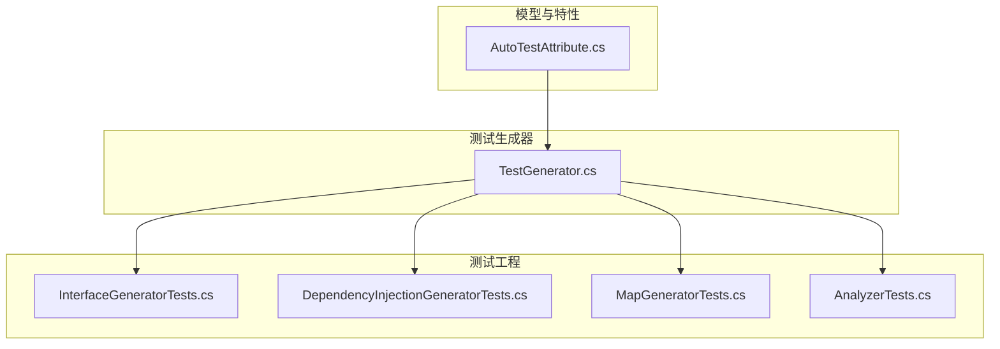
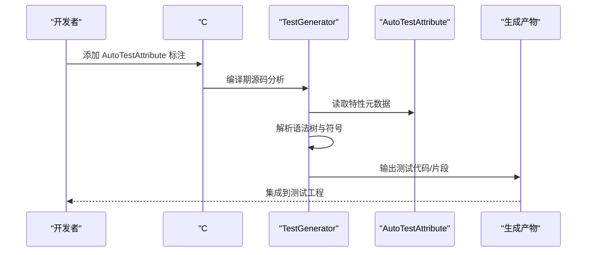
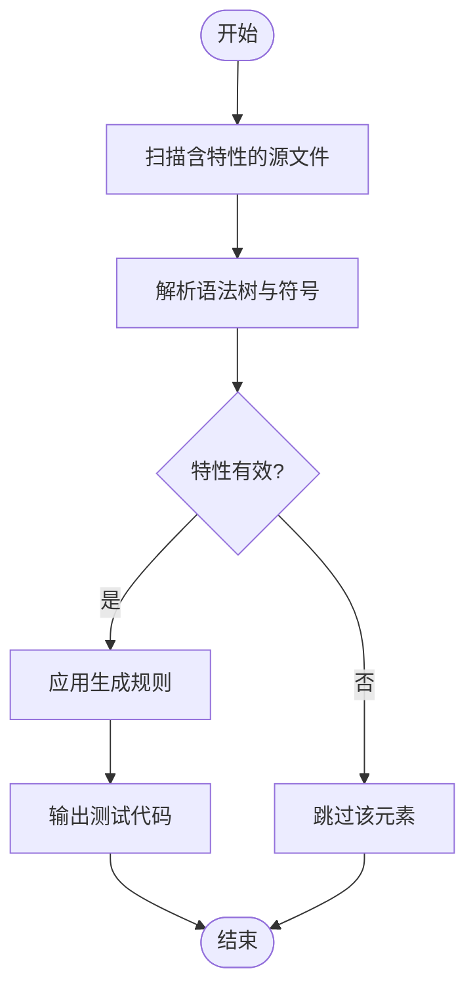
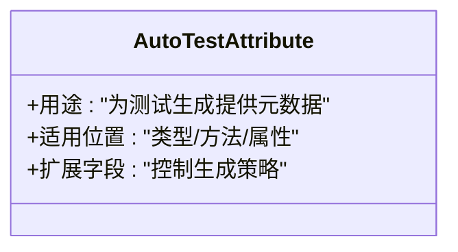
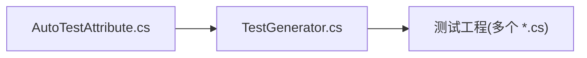

# 测试生成器

<cite>
**本文档引用的文件**   
- [AutoCode.Testing/TestGenerator.cs](file://src/AutoCode.Testing/TestGenerator.cs)
- [AutoCode.Model/AutoTestAttribute.cs](file://src/AutoCode.Model/AutoTestAttribute.cs)
- [AutoCode.Tests/InterfaceGeneratorTests.cs](file://src/AutoCode.Tests/InterfaceGeneratorTests.cs)
- [AutoCode.Tests/DependencyInjectionGeneratorTests.cs](file://src/AutoCode.Tests/DependencyInjectionGeneratorTests.cs)
- [AutoCode.Tests/MapGeneratorTests.cs](file://src/AutoCode.Tests/MapGeneratorTests.cs)
- [AutoCode.Tests/AnalyzerTests.cs](file://src/AutoCode.Tests/AnalyzerTests.cs)
</cite>

## 目录
1. [简介](#简介)
2. [项目结构](#项目结构)
3. [核心组件](#核心组件)
4. [架构总览](#架构总览)
5. [详细组件分析](#详细组件分析)
6. [依赖关系分析](#依赖关系分析)
7. [性能考虑](#性能考虑)
8. [故障排查指南](#故障排查指南)
9. [结论](#结论)
10. [附录](#附录)

## 简介
本文件聚焦于“测试生成器”能力，围绕 AutoCode 项目中与测试代码自动生成相关的模块进行系统化说明。内容涵盖：
- 测试生成器的职责、输入输出与触发机制
- 与模型属性（特性）的约定与扩展点
- 在现有测试工程中的使用方式与最佳实践
- 常见问题定位与优化建议

## 项目结构
与测试生成器直接相关的项目与文件包括：
- 测试生成器实现：AutoCode.Testing/TestGenerator.cs
- 测试标记模型：AutoCode.Model/AutoTestAttribute.cs
- 测试用例示例：AutoCode.Tests 下的若干测试类

图表来源
- [AutoCode.Testing/TestGenerator.cs](file://src/AutoCode.Testing/TestGenerator.cs)
- [AutoCode.Model/AutoTestAttribute.cs](file://src/AutoCode.Model/AutoTestAttribute.cs)
- [AutoCode.Tests/InterfaceGeneratorTests.cs](file://src/AutoCode.Tests/InterfaceGeneratorTests.cs)
- [AutoCode.Tests/DependencyInjectionGeneratorTests.cs](file://src/AutoCode.Tests/DependencyInjectionGeneratorTests.cs)
- [AutoCode.Tests/MapGeneratorTests.cs](file://src/AutoCode.Tests/MapGeneratorTests.cs)
- [AutoCode.Tests/AnalyzerTests.cs](file://src/AutoCode.Tests/AnalyzerTests.cs)

章节来源
- [AutoCode.Testing/TestGenerator.cs](file://src/AutoCode.Testing/TestGenerator.cs)
- [AutoCode.Model/AutoTestAttribute.cs](file://src/AutoCode.Model/AutoTestAttribute.cs)
- [AutoCode.Tests/InterfaceGeneratorTests.cs](file://src/AutoCode.Tests/InterfaceGeneratorTests.cs)
- [AutoCode.Tests/DependencyInjectionGeneratorTests.cs](file://src/AutoCode.Tests/DependencyInjectionGeneratorTests.cs)
- [AutoCode.Tests/MapGeneratorTests.cs](file://src/AutoCode.Tests/MapGeneratorTests.cs)
- [AutoCode.Tests/AnalyzerTests.cs](file://src/AutoCode.Tests/AnalyzerTests.cs)

## 核心组件
- 测试生成器（TestGenerator）
  - 作用：根据源代码与特性标注，自动产出测试代码或测试辅助代码
  - 输入：编译期语法树、符号信息、配置选项
  - 输出：生成的测试文件或测试片段（由具体实现决定）
- 测试特性（AutoTestAttribute）
  - 作用：为类型或成员提供测试生成所需的元数据
  - 行为：被 TestGenerator 识别并用于驱动生成策略

章节来源
- [AutoCode.Testing/TestGenerator.cs](file://src/AutoCode.Testing/TestGenerator.cs)
- [AutoCode.Model/AutoTestAttribute.cs](file://src/AutoCode.Model/AutoTestAttribute.cs)

## 架构总览
测试生成器采用“特性驱动 + 源码分析”的模式：
- 通过 AutoTestAttribute 声明式标注目标元素
- TestGenerator 在编译期扫描并解析这些标注
- 依据标注信息与上下文生成对应的测试代码

图表来源
- [AutoCode.Testing/TestGenerator.cs](file://src/AutoCode.Testing/TestGenerator.cs)
- [AutoCode.Model/AutoTestAttribute.cs](file://src/AutoCode.Model/AutoTestAttribute.cs)

## 详细组件分析

### 测试生成器（TestGenerator）
- 设计要点
  - 以增量方式处理源文件，减少不必要的重复工作
  - 基于特性与语法节点构建生成规则
  - 将生成结果写入目标项目可消费的测试文件
- 关键流程
  - 发现标注：扫描包含 AutoTestAttribute 的目标元素
  - 语义分析：结合命名空间、类型、方法签名等上下文
  - 模板/规则应用：按策略生成测试代码
  - 输出管理：避免重复生成与冲突

图表来源
- [AutoCode.Testing/TestGenerator.cs](file://src/AutoCode.Testing/TestGenerator.cs)

章节来源
- [AutoCode.Testing/TestGenerator.cs](file://src/AutoCode.Testing/TestGenerator.cs)

### 测试特性（AutoTestAttribute）
- 设计要点
  - 作为测试生成器的元数据来源
  - 支持对类型、方法、属性等进行标注
  - 可扩展字段用于控制生成行为
- 使用方式
  - 在需要生成测试的元素上添加特性
  - 配合 TestGenerator 的规则完成自动化

图表来源
- [AutoCode.Model/AutoTestAttribute.cs](file://src/AutoCode.Model/AutoTestAttribute.cs)

章节来源
- [AutoCode.Model/AutoTestAttribute.cs](file://src/AutoCode.Model/AutoTestAttribute.cs)

### 测试工程中的使用示例
- 示例测试类
  - InterfaceGeneratorTests.cs
  - DependencyInjectionGeneratorTests.cs
  - MapGeneratorTests.cs
  - AnalyzerTests.cs
- 使用模式
  - 在测试工程中引用 AutoCode.Testing 与 AutoCode.Model
  - 通过特性标注被测元素，触发生成器产出测试代码
  - 将生成的测试纳入常规测试运行

章节来源
- [AutoCode.Tests/InterfaceGeneratorTests.cs](file://src/AutoCode.Tests/InterfaceGeneratorTests.cs)
- [AutoCode.Tests/DependencyInjectionGeneratorTests.cs](file://src/AutoCode.Tests/DependencyInjectionGeneratorTests.cs)
- [AutoCode.Tests/MapGeneratorTests.cs](file://src/AutoCode.Tests/MapGeneratorTests.cs)
- [AutoCode.Tests/AnalyzerTests.cs](file://src/AutoCode.Tests/AnalyzerTests.cs)

## 依赖关系分析
- 内部依赖
  - TestGenerator 依赖 AutoTestAttribute 提供的元数据
  - 测试工程依赖 TestGenerator 的输出
- 外部依赖
  - C# 编译器与源码分析基础设施
  - 目标测试框架（由测试工程决定）

图表来源
- [AutoCode.Model/AutoTestAttribute.cs](file://src/AutoCode.Model/AutoTestAttribute.cs)
- [AutoCode.Testing/TestGenerator.cs](file://src/AutoCode.Testing/TestGenerator.cs)
- [AutoCode.Tests/InterfaceGeneratorTests.cs](file://src/AutoCode.Tests/InterfaceGeneratorTests.cs)
- [AutoCode.Tests/DependencyInjectionGeneratorTests.cs](file://src/AutoCode.Tests/DependencyInjectionGeneratorTests.cs)
- [AutoCode.Tests/MapGeneratorTests.cs](file://src/AutoCode.Tests/MapGeneratorTests.cs)
- [AutoCode.Tests/AnalyzerTests.cs](file://src/AutoCode.Tests/AnalyzerTests.cs)

章节来源
- [AutoCode.Testing/TestGenerator.cs](file://src/AutoCode.Testing/TestGenerator.cs)
- [AutoCode.Model/AutoTestAttribute.cs](file://src/AutoCode.Model/AutoTestAttribute.cs)
- [AutoCode.Tests/InterfaceGeneratorTests.cs](file://src/AutoCode.Tests/InterfaceGeneratorTests.cs)
- [AutoCode.Tests/DependencyInjectionGeneratorTests.cs](file://src/AutoCode.Tests/DependencyInjectionGeneratorTests.cs)
- [AutoCode.Tests/MapGeneratorTests.cs](file://src/AutoCode.Tests/MapGeneratorTests.cs)
- [AutoCode.Tests/AnalyzerTests.cs](file://src/AutoCode.Tests/AnalyzerTests.cs)

## 性能考虑
- 增量分析：仅在受影响的源文件变更时重新生成
- 缓存与去重：避免重复生成相同内容
- 选择性扫描：仅处理包含目标特性的元素
- 资源占用：合理限制并发与内存使用，避免阻塞编译

## 故障排查指南
- 常见问题
  - 未检测到特性：确认特性命名空间与引用正确
  - 生成失败：检查语法树解析错误与异常日志
  - 输出缺失：确认目标项目已正确引用生成器包
- 调试建议
  - 启用详细日志，观察扫描与生成阶段
  - 最小化复现：隔离问题元素单独验证
  - 版本对齐：确保生成器与模型特性版本一致

## 结论
测试生成器通过特性驱动的源码分析，显著降低手工编写测试样板代码的成本。其设计清晰、扩展性强，适合在大型项目中统一测试规范与质量基线。建议结合增量分析与缓存策略，持续优化生成性能与稳定性。

## 附录
- 快速上手
  - 在目标元素上添加 AutoTestAttribute
  - 确保项目引用 AutoCode.Testing 与 AutoCode.Model
  - 执行构建，查看生成的测试代码
- 扩展建议
  - 自定义特性字段以控制生成策略
  - 封装常用测试模板，提升一致性