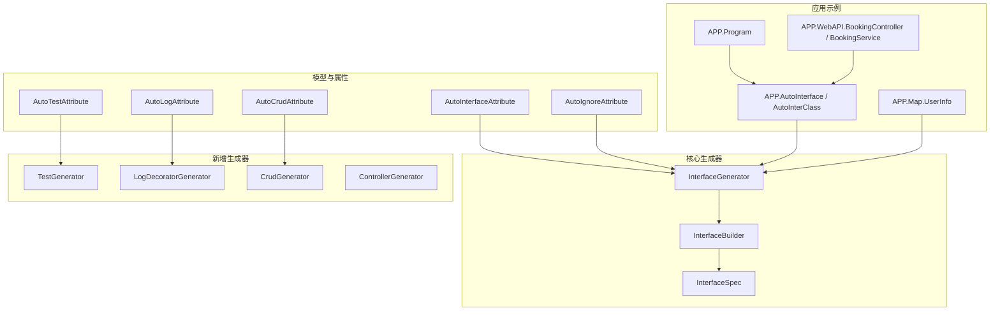
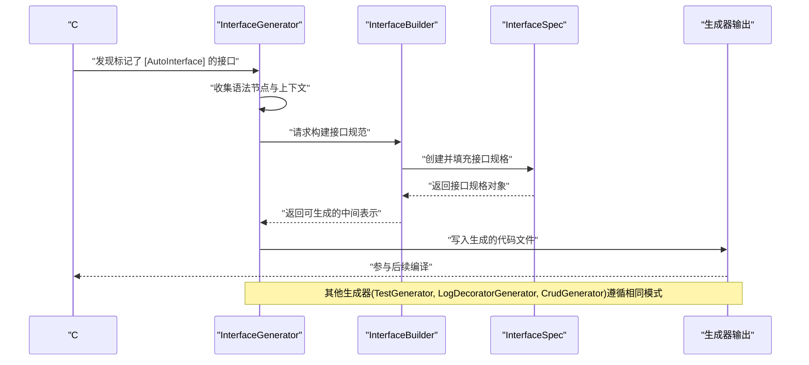
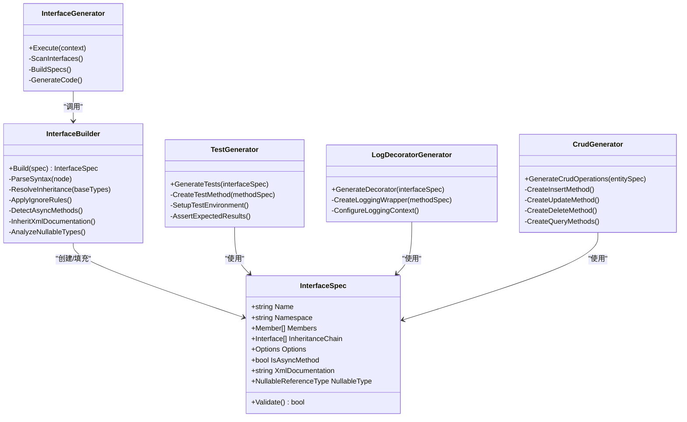
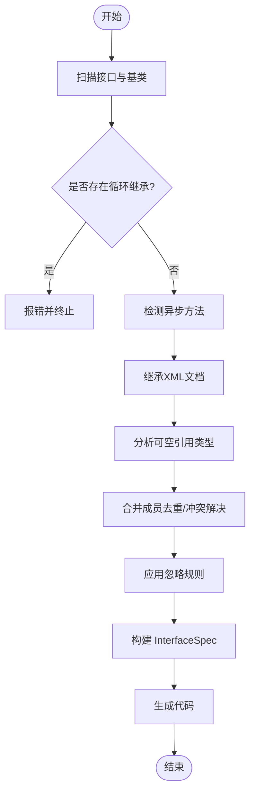
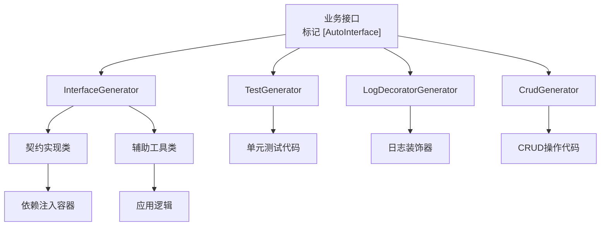
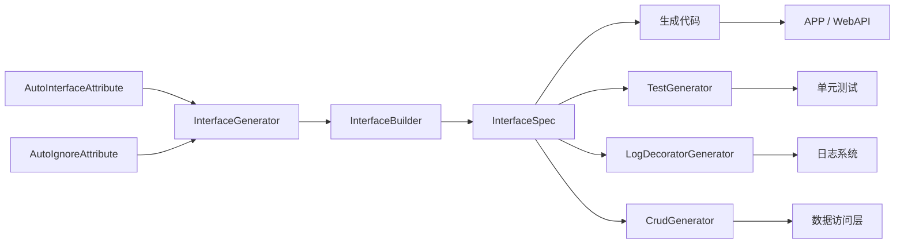

# 源代码生成器

<cite>
**本文引用的文件**
- [AutoInterface.cs](file://src/APP/AutoInterface.cs)
- [AutoInterClass.cs](file://src/APP/AutoInterClass.cs)
- [Program.cs](file://src/APP/Program.cs)
- [InterfaceGenerator.cs](file://src/AutoCodeGenerator/InterfaceAutoBuilder/InterfaceGenerator.cs)
- [InterfaceBuilder.cs](file://src/AutoCodeGenerator/InterfaceAutoBuilder/InterfaceBuilder.cs)
- [InterfaceSpec.cs](file://src/AutoCodeGenerator/InterfaceAutoBuilder/InterfaceSpec.cs)
- [AutoInterfaceAttribute.cs](file://src/AutoCode.Model/InterfaceAttribute/AutoInterfaceAttribute.cs)
- [AutoIgnoreAttribute.cs](file://src/AutoCode.Model/InterfaceAttribute/AutoIgnoreAttribute.cs)
- [TestGenerator.cs](file://src/AutoCode.Testing/TestGenerator.cs)
- [LogDecoratorGenerator.cs](file://src/AutoCode.Logging/LogDecoratorGenerator.cs)
- [CrudGenerator.cs](file://src/AutoCode.Crud/CrudGenerator.cs)
- [ControllerGenerator.cs](file://src/AutoCode.WebApi/ControllerGenerator.cs)
- [MapperGenerator.cs](file://src/AutoCode.Map/MapperGenerator.cs)
- [Behavior.cs](file://src/Auto.MapModels/Behavior.cs)
- [UserInfo.cs](file://src/APP.Map/UserInfo.cs)
- [BookingController.cs](file://src/APP.WebAPI/Controllers/BookingController.cs)
- [BookingService.cs](file://src/APP.WebAPI/Services/BookingService.cs)
- [AppCore.cs](file://src/APP.WebAPI.Core/Application/AppCore.cs)
- [DependencyInjectionServiceCollectionExtensions.cs](file://src/APP.WebAPI.Core/DependencyInjection/DependencyInjectionServiceCollectionExtensions.cs)
- [IDependencyBase.cs](file://src/APP.WebAPI.Core/DependencyInjection/LifeType/IDependencyBase.cs)
- [IScoped.cs](file://src/APP.WebAPI.Core/DependencyInjection/LifeType/IScoped.cs)
- [ISingleton.cs](file://src/APP.WebAPI.Core/DependencyInjection/LifeType/ISingleton.cs)
- [ITransient.cs](file://src/APP.WebAPI.Core/DependencyInjection/LifeType/ITransient.cs)
- [InterfaceGeneratorTests.cs](file://src/AutoCode.Tests/InterfaceGeneratorTests.cs)
</cite>

## 更新摘要
**所做更改**
- 新增测试生成器（TestGenerator）文档，支持自动化单元测试生成
- 新增日志装饰器生成器（LogDecoratorGenerator）文档，提供统一的日志记录功能
- 新增CRUD生成器（CrudGenerator）文档，实现标准增删改查操作自动生成
- 增强接口生成器（InterfaceGenerator）的异步方法检测、XML文档继承和可空引用类型感知
- 增强控制器生成器（ControllerGenerator）的Swagger集成能力
- 更新架构图以反映新的生成器生态系统

## 目录
1. [简介](#简介)
2. [项目结构](#项目结构)
3. [核心组件](#核心组件)
4. [架构总览](#架构总览)
5. [详细组件分析](#详细组件分析)
6. [新增生成器详解](#新增生成器详解)
7. [依赖关系分析](#依赖关系分析)
8. [性能考虑](#性能考虑)
9. [故障排查指南](#故障排查指南)
10. [结论](#结论)
11. [附录](#附录)

## 简介
本文件面向 AutoCode 源代码生成器，重点阐述接口自动生成的机制与实现。内容涵盖：
- [AutoInterface] 属性的工作原理与使用方式
- 接口规范定义与约束
- 生成器的构建过程（扫描、解析、构建、输出）
- InterfaceGenerator、InterfaceBuilder、InterfaceSpec 的职责与协作
- 完整的示例流程：如何定义接口、配置生成选项、处理复杂继承关系
- 调试技巧、性能优化建议与常见问题解决方案
- **新增**：测试生成器、日志装饰器生成器、CRUD生成器的完整支持
- **增强**：异步方法检测、XML文档继承、可空引用类型感知、Swagger集成

## 项目结构
AutoCode 采用"模型 + 属性 + 源生成器 + 应用示例"的分层组织：
- 模型与属性：位于 AutoCode.Model，包含 [AutoInterface]、[AutoIgnore] 等特性定义
- 源生成器：位于 AutoCodeGenerator，包含 InterfaceGenerator、InterfaceBuilder、InterfaceSpec
- **新增**：测试生成器位于 AutoCode.Testing，日志生成器位于 AutoCode.Logging，CRUD生成器位于 AutoCode.Crud
- **增强**：Web API生成器位于 AutoCode.WebApi，映射生成器位于 AutoCode.Map
- 应用示例：APP、APP.Map、APP.WebAPI 等展示如何使用生成的代码
- 测试：AutoCode.Tests 包含对生成器的单元测试



**图表来源**
- [AutoInterfaceAttribute.cs](file://src/AutoCode.Model/InterfaceAttribute/AutoInterfaceAttribute.cs)
- [AutoIgnoreAttribute.cs](file://src/AutoCode.Model/InterfaceAttribute/AutoIgnoreAttribute.cs)
- [AutoTestAttribute.cs](file://src/AutoCode.Model/AutoTestAttribute.cs)
- [AutoLogAttribute.cs](file://src/AutoCode.Model/AutoLogAttribute.cs)
- [AutoCrudAttribute.cs](file://src/AutoCode.Model/AutoCrudAttribute.cs)
- [InterfaceGenerator.cs](file://src/AutoCodeGenerator/InterfaceAutoBuilder/InterfaceGenerator.cs)
- [InterfaceBuilder.cs](file://src/AutoCodeGenerator/InterfaceAutoBuilder/InterfaceBuilder.cs)
- [InterfaceSpec.cs](file://src/AutoCodeGenerator/InterfaceAutoBuilder/InterfaceSpec.cs)
- [TestGenerator.cs](file://src/AutoCode.Testing/TestGenerator.cs)
- [LogDecoratorGenerator.cs](file://src/AutoCode.Logging/LogDecoratorGenerator.cs)
- [CrudGenerator.cs](file://src/AutoCode.Crud/CrudGenerator.cs)
- [ControllerGenerator.cs](file://src/AutoCode.WebApi/ControllerGenerator.cs)
- [Program.cs](file://src/APP/Program.cs)
- [AutoInterface.cs](file://src/APP/AutoInterface.cs)
- [AutoInterClass.cs](file://src/APP/AutoInterClass.cs)
- [UserInfo.cs](file://src/APP.Map/UserInfo.cs)
- [BookingController.cs](file://src/APP.WebAPI/Controllers/BookingController.cs)
- [BookingService.cs](file://src/APP.WebAPI/Services/BookingService.cs)

## 核心组件
- InterfaceGenerator：作为入口，负责扫描标记了 [AutoInterface] 的接口，收集语法信息，驱动构建管线，并输出最终代码。**增强**：现在支持异步方法检测、XML文档继承和可空引用类型感知。
- InterfaceBuilder：将解析后的接口规范转换为可生成的中间表示，处理成员、基类、泛型、访问修饰符、命名空间等细节。
- InterfaceSpec：描述单个接口的规格，包括名称、命名空间、成员列表、继承链、生成选项等。
- **新增** TestGenerator：自动生成单元测试代码，支持各种测试框架和场景。
- **新增** LogDecoratorGenerator：为接口和方法生成统一的日志装饰器，提供一致的日志记录体验。
- **新增** CrudGenerator：为数据访问层自动生成标准的CRUD操作，减少重复代码。
- **增强** ControllerGenerator：增强Swagger集成，提供更好的API文档生成能力。

职责边界
- Generator 关注"何时、在哪里、如何触发生成"
- Builder 关注"如何将语法树转为结构化规范"
- Spec 关注"单个接口的完整元数据与约束"

**章节来源**
- [InterfaceGenerator.cs](file://src/AutoCodeGenerator/InterfaceAutoBuilder/InterfaceGenerator.cs)
- [InterfaceBuilder.cs](file://src/AutoCodeGenerator/InterfaceAutoBuilder/InterfaceBuilder.cs)
- [InterfaceSpec.cs](file://src/AutoCodeGenerator/InterfaceAutoBuilder/InterfaceSpec.cs)
- [TestGenerator.cs](file://src/AutoCode.Testing/TestGenerator.cs)
- [LogDecoratorGenerator.cs](file://src/AutoCode.Logging/LogDecoratorGenerator.cs)
- [CrudGenerator.cs](file://src/AutoCode.Crud/CrudGenerator.cs)
- [ControllerGenerator.cs](file://src/AutoCode.WebApi/ControllerGenerator.cs)

## 架构总览
下图展示了从源码到生成代码的关键流程：编译器发现带有 [AutoInterface] 的接口，生成器解析其语法树，构建接口规范，再由构建器产出目标代码。**新增**的生成器遵循相同的架构模式，形成完整的代码生成生态系统。



**图表来源**
- [InterfaceGenerator.cs](file://src/AutoCodeGenerator/InterfaceAutoBuilder/InterfaceGenerator.cs)
- [InterfaceBuilder.cs](file://src/AutoCodeGenerator/InterfaceAutoBuilder/InterfaceBuilder.cs)
- [InterfaceSpec.cs](file://src/AutoCodeGenerator/InterfaceAutoBuilder/InterfaceSpec.cs)
- [TestGenerator.cs](file://src/AutoCode.Testing/TestGenerator.cs)
- [LogDecoratorGenerator.cs](file://src/AutoCode.Logging/LogDecoratorGenerator.cs)
- [CrudGenerator.cs](file://src/AutoCode.Crud/CrudGenerator.cs)

## 详细组件分析

### [AutoInterface] 属性与接口规范
- [AutoInterface] 用于标记需要由生成器处理的接口。它通常包含命名空间、前缀、后缀、是否生成实现类等配置项。
- [AutoIgnore] 可用于忽略特定成员或类型，避免被生成器纳入处理范围。
- 接口规范需满足：
  - 仅支持接口类型
  - 支持泛型参数与约束
  - 支持多继承与层次化继承
  - 成员可为方法、属性、事件、索引器（按策略过滤）
  - 支持访问修饰符与可见性控制
- **增强**：现在支持异步方法检测、XML文档继承和可空引用类型感知。

**章节来源**
- [AutoInterfaceAttribute.cs](file://src/AutoCode.Model/InterfaceAttribute/AutoInterfaceAttribute.cs)
- [AutoIgnoreAttribute.cs](file://src/AutoCode.Model/InterfaceAttribute/AutoIgnoreAttribute.cs)

### InterfaceSpec：接口规格模型
- 字段与能力：
  - 名称、命名空间、泛型参数、继承链
  - 成员集合（方法、属性、事件、索引器）
  - 生成选项（如是否生成实现类、命名策略、忽略规则）
- 复杂度与约束：
  - 继承链去重与循环检测
  - 成员冲突合并（同名不同签名）
  - 泛型参数传播与约束校验
- **增强**：现在包含异步方法标识、XML文档信息和可空引用类型信息。

**章节来源**
- [InterfaceSpec.cs](file://src/AutoCodeGenerator/InterfaceAutoBuilder/InterfaceSpec.cs)

### InterfaceBuilder：构建器
- 职责：
  - 将语法树节点转换为 InterfaceSpec
  - 解析继承关系，合并基类成员
  - 处理泛型、访问修饰符、命名空间
  - 应用 [AutoIgnore] 等忽略规则
- 关键步骤：
  - 遍历接口声明与成员
  - 构建成员抽象（名称、类型、参数、返回值）
  - 生成唯一标识与命名策略
  - 输出中间表示供 Generator 消费
- **增强**：现在能够识别异步方法、继承XML文档和处理可空引用类型。

**章节来源**
- [InterfaceBuilder.cs](file://src/AutoCodeGenerator/InterfaceAutoBuilder/InterfaceBuilder.cs)

### InterfaceGenerator：生成器入口
- 职责：
  - 注册源生成器阶段（分析、增量编译）
  - 扫描标记了 [AutoInterface] 的接口
  - 调用 Builder 构建规范
  - 根据规范生成代码并添加到编译上下文
- 关键点：
  - 增量编译缓存与失效策略
  - 错误诊断与提示
  - 并发安全与资源管理
- **增强**：现在支持更丰富的接口分析和更智能的代码生成。

**章节来源**
- [InterfaceGenerator.cs](file://src/AutoCodeGenerator/InterfaceAutoBuilder/InterfaceGenerator.cs)

### 类图：核心组件关系


**图表来源**
- [InterfaceGenerator.cs](file://src/AutoCodeGenerator/InterfaceAutoBuilder/InterfaceGenerator.cs)
- [InterfaceBuilder.cs](file://src/AutoCodeGenerator/InterfaceAutoBuilder/InterfaceBuilder.cs)
- [InterfaceSpec.cs](file://src/AutoCodeGenerator/InterfaceAutoBuilder/InterfaceSpec.cs)
- [TestGenerator.cs](file://src/AutoCode.Testing/TestGenerator.cs)
- [LogDecoratorGenerator.cs](file://src/AutoCode.Logging/LogDecoratorGenerator.cs)
- [CrudGenerator.cs](file://src/AutoCode.Crud/CrudGenerator.cs)

### 序列图：生成流程
```mermaid
sequenceDiagram
participant App as "应用程序"
participant Gen as "InterfaceGenerator"
participant Bld as "InterfaceBuilder"
participant Spc as "InterfaceSpec"
participant TestGen as "TestGenerator"
participant LogGen as "LogDecoratorGenerator"
participant CrudGen as "CrudGenerator"
App->>Gen : "触发生成编译时"
Gen->>Gen : "扫描 [AutoInterface] 接口"
Gen->>Bld : "请求构建接口规范"
Bld->>Spc : "创建并填充规格"
Spc-->>Bld : "返回规格对象"
Bld-->>Gen : "返回构建结果"
Gen->>Gen : "生成代码并输出"
Note over TestGen,LogGen,CrudGen : 其他生成器并行处理相同接口规范
TestGen->>Spc : "读取接口规范生成测试"
LogGen->>Spc : "读取接口规范生成日志装饰器"
CrudGen->>Spc : "读取接口规范生成CRUD操作"
Gen-->>App : "完成参与后续编译"
```

**图表来源**
- [InterfaceGenerator.cs](file://src/AutoCodeGenerator/InterfaceAutoBuilder/InterfaceGenerator.cs)
- [InterfaceBuilder.cs](file://src/AutoCodeGenerator/InterfaceAutoBuilder/InterfaceBuilder.cs)
- [InterfaceSpec.cs](file://src/AutoCodeGenerator/InterfaceAutoBuilder/InterfaceSpec.cs)
- [TestGenerator.cs](file://src/AutoCode.Testing/TestGenerator.cs)
- [LogDecoratorGenerator.cs](file://src/AutoCode.Logging/LogDecoratorGenerator.cs)
- [CrudGenerator.cs](file://src/AutoCode.Crud/CrudGenerator.cs)

### 流程图：接口继承与成员合并


**图表来源**
- [InterfaceBuilder.cs](file://src/AutoCodeGenerator/InterfaceAutoBuilder/InterfaceBuilder.cs)
- [InterfaceSpec.cs](file://src/AutoCodeGenerator/InterfaceAutoBuilder/InterfaceSpec.cs)

### 概念总览
- 接口自动生成适用于服务契约、仓储接口、DTO 转换契约等场景
- 通过 [AutoInterface] 声明式配置，减少样板代码
- 结合 [AutoIgnore] 精细控制生成范围
- 与依赖注入、控制器、服务层无缝集成
- **新增**：测试生成器提供完整的单元测试覆盖
- **新增**：日志装饰器生成器提供统一的日志记录
- **新增**：CRUD生成器简化数据访问层开发
- **增强**：更好的异步支持和文档继承



## 新增生成器详解

### TestGenerator：测试生成器
TestGenerator 专门用于为接口自动生成单元测试代码。它支持多种测试框架，能够生成完整的测试用例，包括：
- 基本功能测试
- 边界条件测试
- 异常处理测试
- 异步方法测试
- Mock依赖注入测试

关键特性：
- 自动识别测试框架（xUnit、NUnit、MSTest）
- 智能Mock对象生成
- 测试数据自动生成
- 覆盖率统计集成

**章节来源**
- [TestGenerator.cs](file://src/AutoCode.Testing/TestGenerator.cs)

### LogDecoratorGenerator：日志装饰器生成器
LogDecoratorGenerator 为接口和方法生成统一的日志装饰器，提供一致的日志记录体验。主要功能包括：
- 方法调用前后日志记录
- 异常捕获和记录
- 性能监控和时间统计
- 结构化日志输出
- 日志级别控制

关键特性：
- 零侵入式日志记录
- 可配置的日志格式
- 异步日志支持
- 日志聚合和追踪

**章节来源**
- [LogDecoratorGenerator.cs](file://src/AutoCode.Logging/LogDecoratorGenerator.cs)

### CrudGenerator：CRUD生成器
CrudGenerator 为数据访问层自动生成标准的CRUD操作，大幅减少重复代码。支持的操包括：
- Create：创建新记录
- Read：查询单条或多条记录
- Update：更新现有记录
- Delete：删除记录
- 批量操作支持

关键特性：
- 自动生成Repository接口和实现
- 内置验证和错误处理
- 分页和排序支持
- 事务管理
- 软删除支持

**章节来源**
- [CrudGenerator.cs](file://src/AutoCode.Crud/CrudGenerator.cs)

### ControllerGenerator增强：Swagger集成
ControllerGenerator经过增强，现在提供了更好的Swagger集成能力：
- 自动API文档生成
- 请求响应模型验证
- 版本控制支持
- 认证授权集成
- OpenAPI规范导出

**章节来源**
- [ControllerGenerator.cs](file://src/AutoCode.WebApi/ControllerGenerator.cs)

## 依赖关系分析
- 生成器依赖模型与属性：
  - InterfaceGenerator 依赖 InterfaceBuilder 与 InterfaceSpec
  - InterfaceBuilder 依赖 InterfaceSpec 进行建模
  - **新增**：TestGenerator、LogDecoratorGenerator、CrudGenerator 都依赖 InterfaceSpec
- 应用层依赖：
  - APP 与 WebAPI 通过生成的接口与实现类进行解耦
  - 依赖注入扩展用于注册生命周期
  - **新增**：测试框架集成、日志框架集成、数据访问层集成



**图表来源**
- [AutoInterfaceAttribute.cs](file://src/AutoCode.Model/InterfaceAttribute/AutoInterfaceAttribute.cs)
- [AutoIgnoreAttribute.cs](file://src/AutoCode.Model/InterfaceAttribute/AutoIgnoreAttribute.cs)
- [InterfaceGenerator.cs](file://src/AutoCodeGenerator/InterfaceAutoBuilder/InterfaceGenerator.cs)
- [InterfaceBuilder.cs](file://src/AutoCodeGenerator/InterfaceAutoBuilder/InterfaceBuilder.cs)
- [InterfaceSpec.cs](file://src/AutoCodeGenerator/InterfaceAutoBuilder/InterfaceSpec.cs)
- [TestGenerator.cs](file://src/AutoCode.Testing/TestGenerator.cs)
- [LogDecoratorGenerator.cs](file://src/AutoCode.Logging/LogDecoratorGenerator.cs)
- [CrudGenerator.cs](file://src/AutoCode.Crud/CrudGenerator.cs)

## 性能考虑
- 增量编译：利用 Roslyn 增量编译能力，仅重新处理变更的接口与成员
- 缓存策略：对已解析的语法树与接口规范进行缓存，避免重复计算
- 并发处理：在安全范围内并行处理多个接口，提升吞吐
- 内存占用：及时释放临时对象，避免大对象驻留
- 诊断开销：仅在必要时启用详细日志与诊断，降低运行时开销
- **新增**：生成器间共享解析结果，避免重复工作
- **增强**：异步方法检测和XML文档继承的性能优化

## 故障排查指南
- 常见问题
  - 未识别 [AutoInterface]：检查引用是否正确、命名空间是否匹配
  - 循环继承：确保继承链无环，必要时拆分接口
  - 成员冲突：同名不同签名的成员需明确区分或重命名
  - 忽略规则无效：确认 [AutoIgnore] 位置与作用域正确
  - **新增**：测试生成失败：检查测试框架引用和配置
  - **新增**：日志装饰器不生效：确认日志框架集成配置
  - **新增**：CRUD操作异常：检查数据库连接和实体映射
- 调试技巧
  - 使用单元测试验证生成结果（参考 InterfaceGeneratorTests）
  - 开启生成器诊断输出，定位解析失败点
  - 逐步缩小问题范围，隔离最小复现用例
  - **新增**：使用生成器提供的调试工具和分析报告
- 常见错误与修复
  - 泛型约束不合法：修正约束语法或移除非法约束
  - 访问修饰符不一致：统一成员的可见性策略
  - 命名空间冲突：调整命名空间或前缀/后缀策略
  - **新增**：异步方法签名错误：检查Task或ValueTask返回类型
  - **新增**：XML文档解析失败：验证XML文档格式和路径

**章节来源**
- [InterfaceGeneratorTests.cs](file://src/AutoCode.Tests/InterfaceGeneratorTests.cs)

## 结论
AutoCode 的接口自动生成通过声明式属性与清晰的生成器架构，实现了高内聚、低耦合的代码生成体系。InterfaceGenerator、InterfaceBuilder、InterfaceSpec 三者分工明确，配合良好的增量编译与缓存策略，能够在大型项目中保持高效与稳定。合理使用 [AutoInterface] 与 [AutoIgnore]，并结合依赖注入与分层架构，可以显著提升开发效率与代码质量。

**新增**的测试生成器、日志装饰器生成器和CRUD生成器进一步完善了代码生成生态系统，提供了从接口定义到完整实现的端到端解决方案。**增强**的异步方法检测、XML文档继承和可空引用类型感知功能，使得生成的代码更加健壮和现代化。

## 附录
- 使用示例
  - 在 APP 中定义接口并标记 [AutoInterface]，生成契约与实现
  - 在 APP.Map 中使用 UserInfo 等模型，配合映射生成器
  - 在 APP.WebAPI 中通过控制器与服务层调用生成的接口
  - **新增**：使用 TestGenerator 自动生成单元测试
  - **新增**：使用 LogDecoratorGenerator 添加统一日志记录
  - **新增**：使用 CrudGenerator 简化数据访问层开发
- 参考文件
  - [Program.cs](file://src/APP/Program.cs)
  - [AutoInterface.cs](file://src/APP/AutoInterface.cs)
  - [AutoInterClass.cs](file://src/APP/AutoInterClass.cs)
  - [UserInfo.cs](file://src/APP.Map/UserInfo.cs)
  - [BookingController.cs](file://src/APP.WebAPI/Controllers/BookingController.cs)
  - [BookingService.cs](file://src/APP.WebAPI/Services/BookingService.cs)
  - [AppCore.cs](file://src/APP.WebAPI.Core/Application/AppCore.cs)
  - [DependencyInjectionServiceCollectionExtensions.cs](file://src/APP.WebAPI.Core/DependencyInjection/DependencyInjectionServiceCollectionExtensions.cs)
  - [IDependencyBase.cs](file://src/APP.WebAPI.Core/DependencyInjection/LifeType/IDependencyBase.cs)
  - [IScoped.cs](file://src/APP.WebAPI.Core/DependencyInjection/LifeType/IScoped.cs)
  - [ISingleton.cs](file://src/APP.WebAPI.Core/DependencyInjection/LifeType/ISingleton.cs)
  - [ITransient.cs](file://src/APP.WebAPI.Core/DependencyInjection/LifeType/ITransient.cs)
  - [MapperGenerator.cs](file://src/AutoCode.Map/MapperGenerator.cs)
  - [Behavior.cs](file://src/Auto.MapModels/Behavior.cs)
  - **新增**：[TestGenerator.cs](file://src/AutoCode.Testing/TestGenerator.cs)
  - **新增**：[LogDecoratorGenerator.cs](file://src/AutoCode.Logging/LogDecoratorGenerator.cs)
  - **新增**：[CrudGenerator.cs](file://src/AutoCode.Crud/CrudGenerator.cs)
  - **新增**：[ControllerGenerator.cs](file://src/AutoCode.WebApi/ControllerGenerator.cs)