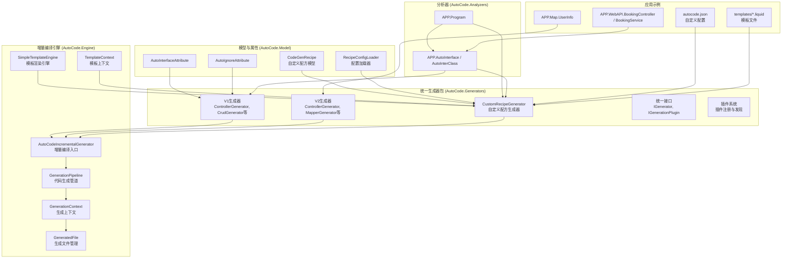
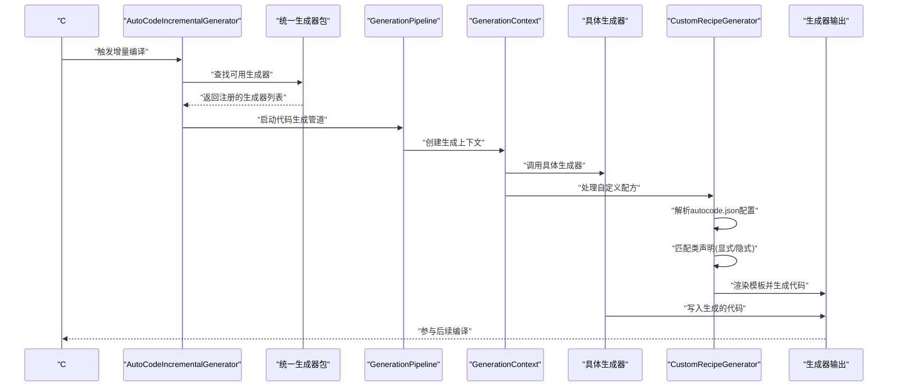
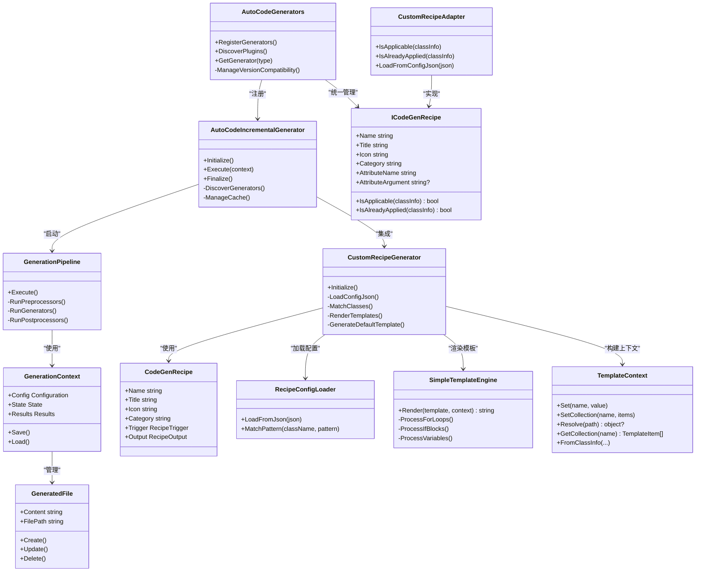
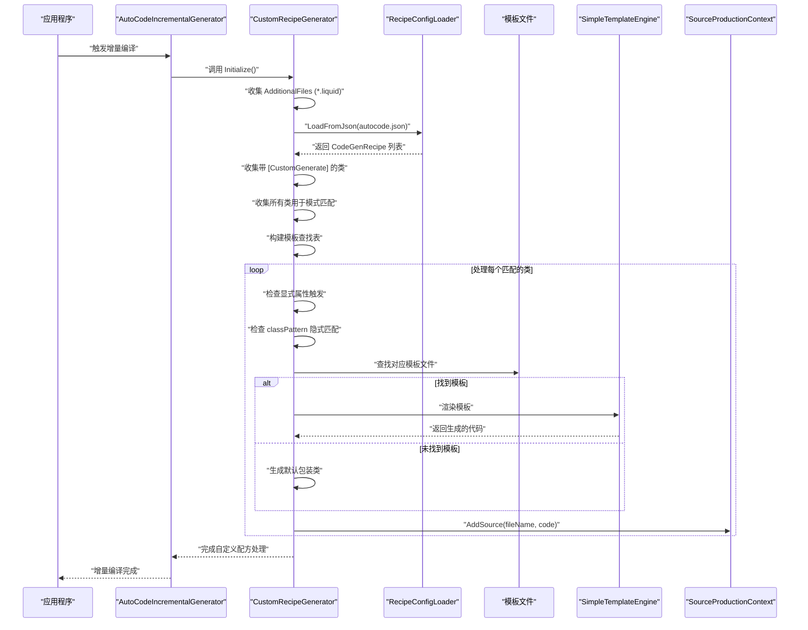
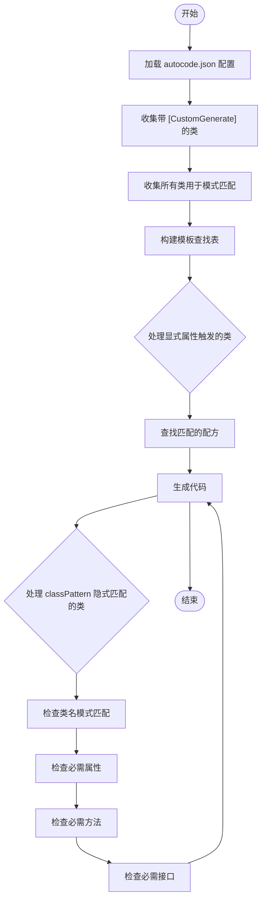
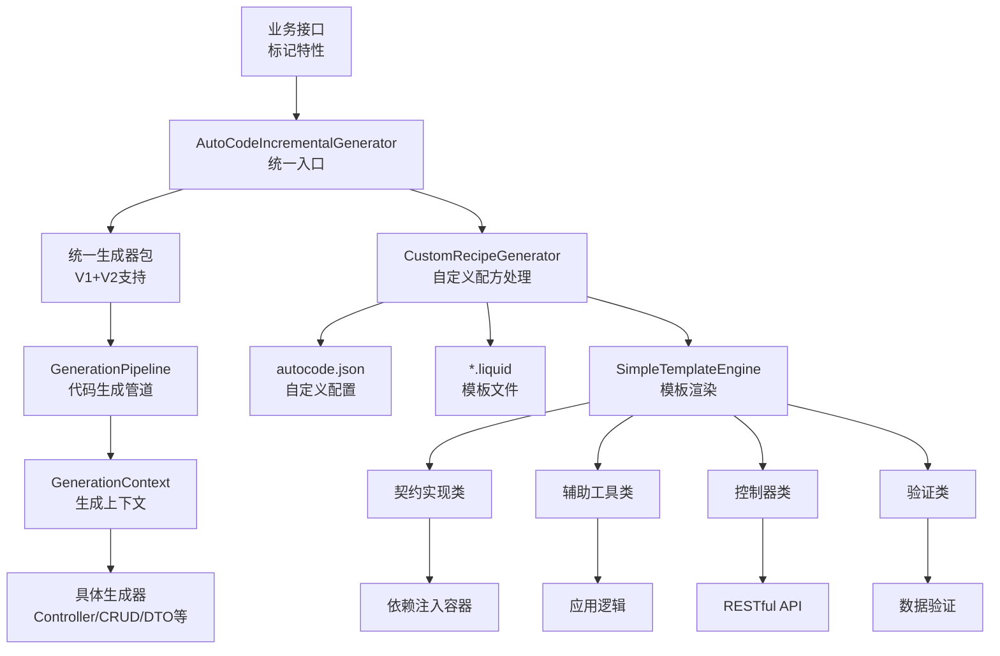
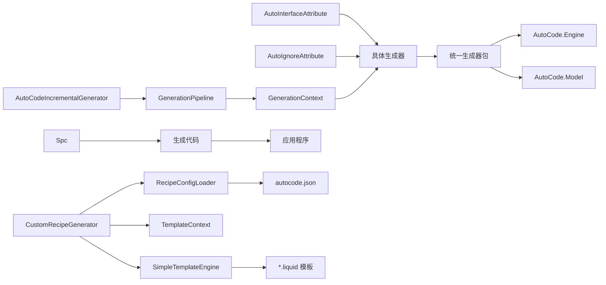

# 源代码生成器

<cite>
**本文引用的文件**
- [AutoCodeIncrementalGenerator.cs](file://src/AutoCode.Engine/Roslyn/AutoCodeIncrementalGenerator.cs)
- [GenerationPipeline.cs](file://src/AutoCode.Engine/Pipeline/GenerationPipeline.cs)
- [GenerationContext.cs](file://src/AutoCode.Engine/Pipeline/GenerationContext.cs)
- [GeneratedFile.cs](file://src/AutoCode.Engine/Pipeline/GeneratedFile.cs)
- [CustomRecipeGenerator.cs](file://src/AutoCode.Generators/CustomRecipeGenerator.cs)
- [CodeGenRecipe.cs](file://src/AutoCode.Model/CodeGenRecipe.cs)
- [RecipeConfigLoader.cs](file://src/AutoCode.Model/RecipeConfigLoader.cs)
- [CustomRecipeAdapter.cs](file://src/AutoCode.Analyzers/Recipes/CustomRecipeAdapter.cs)
- [ICodeGenRecipe.cs](file://src/AutoCode.Analyzers/Recipes/ICodeGenRecipe.cs)
- [SimpleTemplateEngine.cs](file://src/AutoCode.Engine/Template/SimpleTemplateEngine.cs)
- [TemplateContext.cs](file://src/AutoCode.Engine/Template/TemplateContext.cs)
- [InterfaceGenerator.cs](file://src/AutoCode.Generators/V2/InterfaceGenerator.cs)
- [ControllerGenerator.cs](file://src/AutoCode.Generators/V2/ControllerGenerator.cs)
- [CrudGenerator.cs](file://src/AutoCode.Generators/V2/CrudGenerator.cs)
- [DependencyInjectionGenerator.cs](file://src/AutoCode.Generators/V2/DependencyInjectionGenerator.cs)
- [DtoGenerator.cs](file://src/AutoCode.Generators/V2/DtoGenerator.cs)
- [InterceptPlugin.cs](file://src/AutoCode.Generators/V2/InterceptPlugin.cs)
- [LogDecoratorGenerator.cs](file://src/AutoCode.Generators/V2/LogDecoratorGenerator.cs)
- [MapperGenerator.cs](file://src/AutoCode.Generators/V2/MapperGenerator.cs)
- [TestGenerator.cs](file://src/AutoCode.Generators/V2/TestGenerator.cs)
- [ValidationGenerator.cs](file://src/AutoCode.Generators/V2/ValidationGenerator.cs)
- [CascadeGenerator.cs](file://src/AutoCode.Generators/V2/CascadeGenerator.cs)
- [AutoCode.Generators.csproj](file://src/AutoCode.Generators/AutoCode.Generators.csproj)
</cite>

## 更新摘要
**所做更改**
- **新增 CustomRecipeGenerator 增量源生成器**：作为独立的 IIncrementalGenerator 处理所有自定义配方定义
- **实现复杂匹配算法**：支持显式属性触发和隐式类名模式匹配两种触发机制
- **集成模板引擎**：基于 SimpleTemplateEngine 实现 Liquid 语法子集的模板渲染
- **统一配方系统**：通过 CodeGenRecipe、RecipeConfigLoader、CustomRecipeAdapter 构建完整的自定义配方生态
- **增强配置管理**：从 autocode.json 动态加载自定义生成器配置

## 目录
1. [简介](#简介)
2. [项目结构](#项目结构)
3. [核心组件](#核心组件)
4. [架构总览](#架构总览)
5. [详细组件分析](#详细组件分析)
6. [依赖关系分析](#依赖关系分析)
7. [性能考虑](#性能考虑)
8. [故障排查指南](#故障排查指南)
9. [结论](#结论)
10. [附录](#附录)

## 简介
本文件面向 AutoCode 统一架构的源代码生成器，重点阐述经过重构后的统一生成器架构与实现。内容涵盖：
- AutoCode.Generators 包的统一架构设计
- V1和V2生成器的统一管理机制
- 增量编译引擎的核心原理与实现
- GenerationPipeline、GenerationContext、GeneratedFile的职责与协作
- 统一生成器接口的规范与扩展机制
- **新增** CustomRecipeGenerator 作为独立的增量源生成器，处理自定义配方定义
- **新增** 复杂的匹配算法支持显式属性和隐式模式匹配
- **新增** 统一的插件注册与发现系统
- **新增** 标准化的生成器生命周期管理
- 完整的示例流程：如何在统一架构下配置和使用各种生成器

## 项目结构
AutoCode 统一架构采用"统一生成器包 + 增量编译引擎 + 模型 + 属性"的分层组织：
- **统一生成器包**：位于 AutoCode.Generators，包含所有V1和V2生成器的统一实现，以及新的 CustomRecipeGenerator
- **增量编译引擎**：位于 AutoCode.Engine，包含 AutoCodeIncrementalGenerator、GenerationPipeline、GenerationContext 等核心组件
- **模型与属性**：位于 AutoCode.Model，包含 [AutoInterface]、[AutoIgnore] 等特性定义，以及 CodeGenRecipe 自定义配方模型
- **应用示例**：APP、APP.Map、APP.WebAPI 等展示如何使用生成的代码

**图表来源**
- [AutoCode.Generators.csproj](file://src/AutoCode.Generators/AutoCode.Generators.csproj)
- [AutoCodeIncrementalGenerator.cs](file://src/AutoCode.Engine/Roslyn/AutoCodeIncrementalGenerator.cs)
- [GenerationPipeline.cs](file://src/AutoCode.Engine/Pipeline/GenerationPipeline.cs)
- [GenerationContext.cs](file://src/AutoCode.Engine/Pipeline/GenerationContext.cs)
- [GeneratedFile.cs](file://src/AutoCode.Engine/Pipeline/GeneratedFile.cs)
- [CustomRecipeGenerator.cs](file://src/AutoCode.Generators/CustomRecipeGenerator.cs)
- [CodeGenRecipe.cs](file://src/AutoCode.Model/CodeGenRecipe.cs)
- [RecipeConfigLoader.cs](file://src/AutoCode.Model/RecipeConfigLoader.cs)
- [CustomRecipeAdapter.cs](file://src/AutoCode.Analyzers/Recipes/CustomRecipeAdapter.cs)
- [ICodeGenRecipe.cs](file://src/AutoCode.Analyzers/Recipes/ICodeGenRecipe.cs)
- [SimpleTemplateEngine.cs](file://src/AutoCode.Engine/Template/SimpleTemplateEngine.cs)
- [TemplateContext.cs](file://src/AutoCode.Engine/Template/TemplateContext.cs)

## 核心组件
- **统一生成器包**：AutoCode.Generators 包作为所有生成器的统一容器，包含V1和V2版本的完整实现，以及新的 CustomRecipeGenerator
- **AutoCodeIncrementalGenerator**：作为统一架构的核心入口，负责增量编译的注册、触发和执行
- **GenerationPipeline**：代码生成管道，协调各个生成阶段的执行，提供统一的执行框架
- **GenerationContext**：生成上下文，管理生成过程中的状态、配置和中间结果
- **GeneratedFile**：生成文件管理，处理生成文件的创建、更新和删除操作
- **CustomRecipeGenerator**：独立的增量源生成器，专门处理自定义配方定义的代码生成
- **统一生成器接口**：定义了标准的生成器接口规范，确保V1和V2生成器的一致性
- **插件系统**：提供统一的插件注册、发现和生命周期管理机制

职责边界
- **统一生成器包** 关注"所有生成器的统一管理和版本兼容"
- **IncrementalGenerator** 关注"增量编译的触发与协调"
- **Pipeline** 关注"代码生成流程的编排与执行"
- **Context** 关注"生成状态的维护与管理"
- **GeneratedFile** 关注"生成文件的生命周期管理"
- **CustomRecipeGenerator** 关注"自定义配方的解析、匹配和模板渲染"
- **插件系统** 关注"生成器的动态注册和发现"

**章节来源**
- [AutoCode.Generators.csproj](file://src/AutoCode.Generators/AutoCode.Generators.csproj)
- [AutoCodeIncrementalGenerator.cs](file://src/AutoCode.Engine/Roslyn/AutoCodeIncrementalGenerator.cs)
- [GenerationPipeline.cs](file://src/AutoCode.Engine/Pipeline/GenerationPipeline.cs)
- [GenerationContext.cs](file://src/AutoCode.Engine/Pipeline/GenerationContext.cs)
- [GeneratedFile.cs](file://src/AutoCode.Engine/Pipeline/GeneratedFile.cs)
- [CustomRecipeGenerator.cs](file://src/AutoCode.Generators/CustomRecipeGenerator.cs)

## 架构总览
下图展示了统一架构下的从源码到生成代码的关键流程：编译器发现带有特性的接口，AutoCodeIncrementalGenerator 通过统一生成器包中的增量编译机制触发 GenerationPipeline，GenerationContext 管理生成状态，最终由统一的生成器产出目标代码。**新增** 的 CustomRecipeGenerator 作为独立的增量源生成器，专门处理自定义配方定义，支持显式属性和隐式模式匹配两种触发机制。

**图表来源**
- [AutoCodeIncrementalGenerator.cs](file://src/AutoCode.Engine/Roslyn/AutoCodeIncrementalGenerator.cs)
- [AutoCode.Generators.csproj](file://src/AutoCode.Generators/AutoCode.Generators.csproj)
- [GenerationPipeline.cs](file://src/AutoCode.Engine/Pipeline/GenerationPipeline.cs)
- [GenerationContext.cs](file://src/AutoCode.Engine/Pipeline/GenerationContext.cs)
- [CustomRecipeGenerator.cs](file://src/AutoCode.Generators/CustomRecipeGenerator.cs)

## 详细组件分析

### AutoCode.Generators 统一包
- **统一架构**：将所有V1和V2生成器整合到单一包中，消除分散的项目结构
- **版本兼容**：同时支持V1和V2生成器的语法和功能差异
- **插件系统**：提供统一的插件注册和发现机制
- **标准接口**：定义了统一的生成器接口规范
- **关键特性**：
  - 自动生成器发现
  - 版本兼容性检查
  - 统一的配置管理
  - 标准化的错误处理
  - **新增** CustomRecipeGenerator 集成

**章节来源**
- [AutoCode.Generators.csproj](file://src/AutoCode.Generators/AutoCode.Generators.csproj)

### CustomRecipeGenerator：自定义配方的增量源生成器
- **独立生成器**：作为 IIncrementalGenerator 的实现，专门处理自定义配方定义
- **双触发机制**：支持显式属性触发（[CustomGenerate("name")]）和隐式模式匹配（classPattern）
- **模板渲染**：基于 SimpleTemplateEngine 实现 Liquid 语法子集的模板渲染
- **配置驱动**：从 autocode.json 的 customGenerators 节动态加载配置
- **职责**：
  - 读取 AdditionalFiles 中的 .liquid 模板文件
  - 解析 AnalyzerConfigOptionsProvider 中的 autocode.json 配置
  - 收集带 [CustomGenerate] 属性的类声明
  - 扫描所有类声明用于 classPattern 隐式匹配
  - 根据匹配规则生成对应的代码文件
- **关键特性**：
  - 增量编译优化
  - 模板缓存机制
  - 智能匹配算法
  - 默认模板生成
  - 错误诊断与恢复

**章节来源**
- [CustomRecipeGenerator.cs](file://src/AutoCode.Generators/CustomRecipeGenerator.cs)

### CodeGenRecipe：自定义配方模型
- **配方定义**：声明式定义代码生成规则，支持多种触发条件和输出配置
- **触发条件**：支持 attributeName、classPattern、requiredInterfaces、requiredProperties、requiredMethods 等多种匹配方式
- **输出配置**：支持 template、fileName、namespace 等输出选项，支持占位符替换
- **关键特性**：
  - 灵活的触发机制
  - 丰富的输出选项
  - 占位符支持
  - JSON 配置格式

**章节来源**
- [CodeGenRecipe.cs](file://src/AutoCode.Model/CodeGenRecipe.cs)

### RecipeConfigLoader：配置加载器
- **JSON 解析**：从 autocode.json 的 customGenerators 节解析 CodeGenRecipe 列表
- **模式匹配**：实现通配符匹配算法，支持 * 前缀/后缀/中间通配
- **容错处理**：支持注释和尾随逗号，提供完善的错误处理
- **关键能力**：
  - 健壮的 JSON 解析
  - 高效的模式匹配
  - 完善的错误处理
  - 线程安全的静态方法

**章节来源**
- [RecipeConfigLoader.cs](file://src/AutoCode.Model/RecipeConfigLoader.cs)

### CustomRecipeAdapter：配方适配器
- **接口适配**：将 CodeGenRecipe 转换为 ICodeGenRecipe 接口，让自定义配方与内置配方统一展示
- **IDE 集成**：支持 Ctrl+. 右键推荐功能，提供智能的代码生成建议
- **匹配逻辑**：实现 IsApplicable 和 IsAlreadyApplied 方法，判断配方适用性和重复应用
- **关键特性**：
  - 统一的配方接口
  - IDE 友好性
  - 智能匹配算法
  - 重复检测机制

**章节来源**
- [CustomRecipeAdapter.cs](file://src/AutoCode.Analyzers/Recipes/CustomRecipeAdapter.cs)

### ICodeGenRecipe：统一配方接口
- **标准化接口**：定义统一的代码生成配方接口，被 AutoCodeRefactoringProvider 消费
- **属性定义**：包含 Name、Title、Icon、Category、AttributeName、AttributeArgument 等元数据
- **方法定义**：IsApplicable 判断配方适用性，IsAlreadyApplied 检测重复应用
- **关键特性**：
  - 统一的配方契约
  - IDE 集成支持
  - 可扩展的设计

**章节来源**
- [ICodeGenRecipe.cs](file://src/AutoCode.Analyzers/Recipes/ICodeGenRecipe.cs)

### SimpleTemplateEngine：轻量级模板引擎
- **Liquid 兼容**：实现 Liquid 语法的子集，支持变量替换、循环、条件等核心功能
- **零依赖**：不依赖外部模板引擎库，减少运行时开销
- **高性能**：使用正则表达式进行模板处理，提供高效的渲染性能
- **关键特性**：
  - 变量替换 {{ variable }}
  - For 循环 
  - If 条件 
  - 嵌套支持
  - 循环变量 forloop.index/first/last

**章节来源**
- [SimpleTemplateEngine.cs](file://src/AutoCode.Engine/Template/SimpleTemplateEngine.cs)

### TemplateContext：模板上下文
- **上下文管理**：存储模板渲染时可用的变量和集合
- **快速构建**：提供 FromClassInfo 静态方法，从类信息快速构建模板上下文
- **类型安全**：支持标量变量和集合变量的统一管理
- **关键能力**：
  - 变量设置和解析
  - 集合管理
  - 路径解析
  - 预定义变量

**章节来源**
- [TemplateContext.cs](file://src/AutoCode.Engine/Template/TemplateContext.cs)

### AutoCodeIncrementalGenerator：统一架构的增量编译入口
- **统一入口**：作为整个统一架构的核心入口点
- **生成器发现**：自动发现并加载统一包中的所有生成器
- **增量编译**：基于 Roslyn 的增量编译架构
- **职责**：
  - 注册增量编译阶段（Initialize、Execute、Finalize）
  - 监听源码变更事件
  - 协调 GenerationPipeline 的执行
  - 管理生成结果的缓存与失效
- **关键特性**：
  - 统一生成器注册
  - 增量编译缓存机制
  - 源码变更检测
  - 并行执行支持
  - 错误诊断与恢复

**章节来源**
- [AutoCodeIncrementalGenerator.cs](file://src/AutoCode.Engine/Roslyn/AutoCodeIncrementalGenerator.cs)

### GenerationPipeline：统一架构的代码生成管道
- **统一编排**：在统一架构下协调各个生成阶段的执行
- **生成器集成**：支持与统一包中各种生成器的集成
- **职责**：
  - 编排各个生成阶段的执行顺序
  - 管理生成阶段的依赖关系
  - 提供统一的执行框架
  - 支持插件化扩展
- **关键步骤**：
  - 初始化生成上下文
  - 执行预处理器
  - 调用各个生成器
  - 执行后处理器
  - 清理资源

**章节来源**
- [GenerationPipeline.cs](file://src/AutoCode.Engine/Pipeline/GenerationPipeline.cs)

### GenerationContext：统一架构的生成上下文
- **统一状态**：在统一架构下管理生成过程中的状态
- **配置管理**：支持统一配置和生成器特定配置
- **职责**：
  - 管理生成过程中的配置信息
  - 存储中间结果和临时数据
  - 提供线程安全的状态访问
  - 支持生成结果的序列化
- **关键能力**：
  - 统一配置管理
  - 状态持久化
  - 并发安全
  - 内存管理

**章节来源**
- [GenerationContext.cs](file://src/AutoCode.Engine/Pipeline/GenerationContext.cs)

### GeneratedFile：统一架构的文件管理
- **统一操作**：在统一架构下管理所有生成器的文件操作
- **原子性保证**：确保文件操作的原子性和一致性
- **职责**：
  - 管理生成文件的创建、更新和删除
  - 处理文件编码和格式
  - 提供文件差异比较
  - 支持增量文件更新
- **关键特性**：
  - 原子性文件操作
  - 编码自动检测
  - 文件锁管理
  - 错误恢复机制

**章节来源**
- [GeneratedFile.cs](file://src/AutoCode.Engine/Pipeline/GeneratedFile.cs)

### V1和V2生成器的统一实现
- **版本兼容**：同时支持V1和V2语法的生成器实现
- **接口统一**：所有生成器遵循统一的接口规范
- **主要生成器**：
  - ControllerGenerator：控制器生成器
  - CrudGenerator：CRUD操作生成器
  - DependencyInjectionGenerator：依赖注入生成器
  - DtoGenerator：DTO转换生成器
  - InterceptPlugin：拦截器插件
  - LogDecoratorGenerator：日志装饰器生成器
  - MapperGenerator：映射生成器
  - TestGenerator：测试代码生成器
  - ValidationGenerator：验证代码生成器
  - CascadeGenerator：级联操作生成器

**章节来源**
- [ControllerGenerator.cs](file://src/AutoCode.Generators/V2/ControllerGenerator.cs)
- [CrudGenerator.cs](file://src/AutoCode.Generators/V2/CrudGenerator.cs)
- [DependencyInjectionGenerator.cs](file://src/AutoCode.Generators/V2/DependencyInjectionGenerator.cs)
- [DtoGenerator.cs](file://src/AutoCode.Generators/V2/DtoGenerator.cs)
- [InterceptPlugin.cs](file://src/AutoCode.Generators/V2/InterceptPlugin.cs)
- [LogDecoratorGenerator.cs](file://src/AutoCode.Generators/V2/LogDecoratorGenerator.cs)
- [MapperGenerator.cs](file://src/AutoCode.Generators/V2/MapperGenerator.cs)
- [TestGenerator.cs](file://src/AutoCode.Generators/V2/TestGenerator.cs)
- [ValidationGenerator.cs](file://src/AutoCode.Generators/V2/ValidationGenerator.cs)
- [CascadeGenerator.cs](file://src/AutoCode.Generators/V2/CascadeGenerator.cs)

### 类图：统一架构核心组件关系

**图表来源**
- [AutoCode.Generators.csproj](file://src/AutoCode.Generators/AutoCode.Generators.csproj)
- [AutoCodeIncrementalGenerator.cs](file://src/AutoCode.Engine/Roslyn/AutoCodeIncrementalGenerator.cs)
- [CustomRecipeGenerator.cs](file://src/AutoCode.Generators/CustomRecipeGenerator.cs)
- [CodeGenRecipe.cs](file://src/AutoCode.Model/CodeGenRecipe.cs)
- [RecipeConfigLoader.cs](file://src/AutoCode.Model/RecipeConfigLoader.cs)
- [CustomRecipeAdapter.cs](file://src/AutoCode.Analyzers/Recipes/CustomRecipeAdapter.cs)
- [ICodeGenRecipe.cs](file://src/AutoCode.Analyzers/Recipes/ICodeGenRecipe.cs)
- [GenerationPipeline.cs](file://src/AutoCode.Engine/Pipeline/GenerationPipeline.cs)
- [GenerationContext.cs](file://src/AutoCode.Engine/Pipeline/GenerationContext.cs)
- [GeneratedFile.cs](file://src/AutoCode.Engine/Pipeline/GeneratedFile.cs)
- [SimpleTemplateEngine.cs](file://src/AutoCode.Engine/Template/SimpleTemplateEngine.cs)
- [TemplateContext.cs](file://src/AutoCode.Engine/Template/TemplateContext.cs)

### 序列图：CustomRecipeGenerator 工作流程

**图表来源**
- [AutoCodeIncrementalGenerator.cs](file://src/AutoCode.Engine/Roslyn/AutoCodeIncrementalGenerator.cs)
- [CustomRecipeGenerator.cs](file://src/AutoCode.Generators/CustomRecipeGenerator.cs)
- [RecipeConfigLoader.cs](file://src/AutoCode.Model/RecipeConfigLoader.cs)
- [SimpleTemplateEngine.cs](file://src/AutoCode.Engine/Template/SimpleTemplateEngine.cs)

### 流程图：CustomRecipeGenerator 匹配决策流程

**图表来源**
- [CustomRecipeGenerator.cs](file://src/AutoCode.Generators/CustomRecipeGenerator.cs)
- [RecipeConfigLoader.cs](file://src/AutoCode.Model/RecipeConfigLoader.cs)

### 概念总览
- 统一架构通过 AutoCode.Generators 包实现了所有生成器的集中管理
- AutoCodeIncrementalGenerator 作为统一入口，协调整个生成流程
- GenerationPipeline 提供结构化的代码生成框架
- GenerationContext 管理生成状态和配置
- GeneratedFile 确保文件操作的原子性和一致性
- **新增** CustomRecipeGenerator 作为独立的增量源生成器，专门处理自定义配方定义
- **新增** 复杂的匹配算法支持显式属性和隐式模式匹配两种触发机制
- **新增** 基于 SimpleTemplateEngine 的模板渲染系统，支持 Liquid 语法子集
- **新增** CodeGenRecipe 模型和 RecipeConfigLoader 配置加载器，构建完整的自定义配方生态
- 统一插件系统支持动态发现和加载生成器
- V1和V2生成器的兼容性确保了平滑升级路径
- 简化的依赖关系提升了构建性能和可维护性

## 依赖关系分析
- **统一包依赖**：
  - AutoCode.Generators 包依赖 AutoCode.Engine 和 AutoCode.Model
  - 所有生成器都遵循统一的接口规范
  - **新增** CustomRecipeGenerator 依赖 SimpleTemplateEngine 和 TemplateContext
- **增量编译引擎依赖**：
  - AutoCodeIncrementalGenerator 依赖 GenerationPipeline 和 GenerationContext
  - GenerationPipeline 依赖 GenerationContext 和 GeneratedFile
- **应用层依赖**：
  - 应用程序只依赖 AutoCode.Generators 统一包
  - 通过统一接口访问各种生成器功能
  - **新增** 通过 autocode.json 配置自定义生成器

**图表来源**
- [AutoCode.Generators.csproj](file://src/AutoCode.Generators/AutoCode.Generators.csproj)
- [AutoCodeIncrementalGenerator.cs](file://src/AutoCode.Engine/Roslyn/AutoCodeIncrementalGenerator.cs)
- [GenerationPipeline.cs](file://src/AutoCode.Engine/Pipeline/GenerationPipeline.cs)
- [GenerationContext.cs](file://src/AutoCode.Engine/Pipeline/GenerationContext.cs)
- [GeneratedFile.cs](file://src/AutoCode.Engine/Pipeline/GeneratedFile.cs)
- [CustomRecipeGenerator.cs](file://src/AutoCode.Generators/CustomRecipeGenerator.cs)
- [SimpleTemplateEngine.cs](file://src/AutoCode.Engine/Template/SimpleTemplateEngine.cs)
- [TemplateContext.cs](file://src/AutoCode.Engine/Template/TemplateContext.cs)
- [RecipeConfigLoader.cs](file://src/AutoCode.Model/RecipeConfigLoader.cs)

**章节来源**
- [AutoCode.Generators.csproj](file://src/AutoCode.Generators/AutoCode.Generators.csproj)
- [AutoCodeIncrementalGenerator.cs](file://src/AutoCode.Engine/Roslyn/AutoCodeIncrementalGenerator.cs)
- [GenerationPipeline.cs](file://src/AutoCode.Engine/Pipeline/GenerationPipeline.cs)
- [GenerationContext.cs](file://src/AutoCode.Engine/Pipeline/GenerationContext.cs)
- [GeneratedFile.cs](file://src/AutoCode.Engine/Pipeline/GeneratedFile.cs)
- [CustomRecipeGenerator.cs](file://src/AutoCode.Generators/CustomRecipeGenerator.cs)

## 性能考虑
- **统一包优化**：减少跨项目依赖，提升构建性能
- **增量编译**：利用 Roslyn 增量编译能力，仅重新处理变更的接口与成员
- **缓存策略**：对已解析的语法树与接口规范进行缓存，避免重复计算
- **并行处理**：在安全范围内并行处理多个接口，提升吞吐
- **内存占用**：及时释放临时对象，避免大对象驻留
- **诊断开销**：仅在必要时启用详细日志与诊断，降低运行时开销
- **文件操作优化**：GeneratedFile 提供原子性文件操作和增量更新
- **管道优化**：GenerationPipeline 支持阶段间的依赖管理和缓存
- **上下文优化**：GenerationContext 提供高效的配置管理和状态持久化
- **生成器优化**：统一生成器接口减少类型转换开销
- **新增** CustomRecipeGenerator 优化：
  - 模板文件缓存：避免重复读取模板文件
  - 配置缓存：autocode.json 配置只解析一次
  - 增量匹配：仅处理变更的类声明
  - 模板渲染优化：SimpleTemplateEngine 使用正则表达式高效处理

## 故障排查指南
- **统一包问题**
  - 生成器未找到：检查统一包是否正确引用和注册
  - 版本不兼容：确认生成器版本与应用要求的兼容性
  - 插件加载失败：检查插件注册和发现机制
- **CustomRecipeGenerator 问题**
  - 配置文件解析失败：检查 autocode.json 格式和 customGenerators 节
  - 模板文件未找到：确认 .liquid 文件路径正确且包含在 AdditionalFiles 中
  - 匹配规则无效：检查 classPattern 模式和 required* 属性配置
  - 模板渲染错误：验证 Liquid 语法和模板变量引用
  - 默认模板生成异常：检查类结构和反射信息提取
- **增量编译问题**
  - 增量缓存失效：检查缓存键生成逻辑和失效条件
  - 增量编译未触发：确认源码变更检测和事件监听
  - 生成结果不一致：检查生成上下文的线程安全性
- **常见问题**
  - 未识别特性：检查引用是否正确、命名空间是否匹配
  - 循环继承：确保继承链无环，必要时拆分接口
  - 成员冲突：同名不同签名的成员需明确区分或重命名
  - 忽略规则无效：确认忽略属性位置与作用域正确
  - HTTP 方法推断错误：检查接口方法签名是否符合 RESTful 规范
  - EmailAddress 验证失败：确认使用了正确的验证属性和格式
  - NativeAOT 兼容性错误：检查是否启用了裁剪和 AOT 编译
  - IL2026 警告：确认生成器已切换到纯 if/else 语句模式
- **调试技巧**
  - 使用单元测试验证生成结果
  - 开启生成器诊断输出，定位解析失败点
  - 逐步缩小问题范围，隔离最小复现用例
  - 检查增量编译的缓存状态和失效日志
  - 验证控制器生成的路由映射是否正确
  - 验证 EmailAddress 属性的输入格式
  - 验证 NativeAOT 兼容性设置
  - 检查统一包的生成器注册状态
  - **新增** 检查 CustomRecipeGenerator 的配置和模板文件
  - **新增** 验证 autocode.json 的 customGenerators 配置
  - **新增** 调试模板渲染过程和匹配算法
- **常见错误与修复**
  - 泛型约束不合法：修正约束语法或移除非法约束
  - 访问修饰符不一致：统一成员的可见性策略
  - 命名空间冲突：调整命名空间或前缀/后缀策略
  - HTTP 路由冲突：检查路由模板的唯一性
  - 验证规则冲突：合并或重写冲突的验证逻辑
  - AOT 兼容性错误：确保不使用反射和动态加载
  - 增量编译错误：检查增量编译配置和缓存策略
  - 管道执行错误：验证 GenerationPipeline 的配置和阶段依赖
  - 上下文状态错误：检查 GenerationContext 的初始化和清理
  - 统一包依赖错误：检查 AutoCode.Generators 包的引用和版本
  - **新增** 自定义配方配置错误：检查 autocode.json 格式和必填字段
  - **新增** 模板语法错误：验证 Liquid 语法和变量引用
  - **新增** 匹配算法错误：检查 classPattern 模式和 required* 配置

**章节来源**
- [AutoCode.Generators.csproj](file://src/AutoCode.Generators/AutoCode.Generators.csproj)
- [AutoCodeIncrementalGenerator.cs](file://src/AutoCode.Engine/Roslyn/AutoCodeIncrementalGenerator.cs)
- [GenerationPipeline.cs](file://src/AutoCode.Engine/Pipeline/GenerationPipeline.cs)
- [GenerationContext.cs](file://src/AutoCode.Engine/Pipeline/GenerationContext.cs)
- [GeneratedFile.cs](file://src/AutoCode.Engine/Pipeline/GeneratedFile.cs)
- [CustomRecipeGenerator.cs](file://src/AutoCode.Generators/CustomRecipeGenerator.cs)

## 结论
AutoCode 统一架构通过 AutoCode.Generators 包的集中化管理，实现了高内聚、低耦合且高性能的代码生成体系。**新增** 的 CustomRecipeGenerator 作为独立的增量源生成器，为自定义代码生成提供了强大的支持。通过复杂的匹配算法，支持显式属性触发和隐式模式匹配两种机制，结合基于 SimpleTemplateEngine 的模板渲染系统，实现了灵活多样的代码生成需求。AutoCodeIncrementalGenerator、GenerationPipeline、GenerationContext、GeneratedFile 等核心组件提供了结构化的增量编译框架，配合统一生成器包，显著提升了大型项目的编译性能和可维护性。所有生成器现在遵循统一的接口规范，支持版本兼容和平滑升级。统一的插件系统和标准的生命周期管理确保了系统的可扩展性和稳定性。合理使用统一架构，结合依赖注入与分层架构，可以显著提升开发效率与代码质量。

## 附录
- 使用示例
  - 在项目中引用 AutoCode.Generators 统一包
  - 配置增量编译和生成器选项
  - 使用各种生成器生成代码（Controller、CRUD、DTO等）
  - **新增** 配置 autocode.json 的 customGenerators 节
  - **新增** 创建 .liquid 模板文件
  - **新增** 使用 [CustomGenerate] 属性触发自定义生成
  - 体验统一架构带来的性能提升和维护便利
  - 利用版本兼容性实现平滑升级
- 参考文件
  - [AutoCode.Generators.csproj](file://src/AutoCode.Generators/AutoCode.Generators.csproj)
  - [AutoCodeIncrementalGenerator.cs](file://src/AutoCode.Engine/Roslyn/AutoCodeIncrementalGenerator.cs)
  - [GenerationPipeline.cs](file://src/AutoCode.Engine/Pipeline/GenerationPipeline.cs)
  - [GenerationContext.cs](file://src/AutoCode.Engine/Pipeline/GenerationContext.cs)
  - [GeneratedFile.cs](file://src/AutoCode.Engine/Pipeline/GeneratedFile.cs)
  - [CustomRecipeGenerator.cs](file://src/AutoCode.Generators/CustomRecipeGenerator.cs)
  - [CodeGenRecipe.cs](file://src/AutoCode.Model/CodeGenRecipe.cs)
  - [RecipeConfigLoader.cs](file://src/AutoCode.Model/RecipeConfigLoader.cs)
  - [CustomRecipeAdapter.cs](file://src/AutoCode.Analyzers/Recipes/CustomRecipeAdapter.cs)
  - [ICodeGenRecipe.cs](file://src/AutoCode.Analyzers/Recipes/ICodeGenRecipe.cs)
  - [SimpleTemplateEngine.cs](file://src/AutoCode.Engine/Template/SimpleTemplateEngine.cs)
  - [TemplateContext.cs](file://src/AutoCode.Engine/Template/TemplateContext.cs)
  - [ControllerGenerator.cs](file://src/AutoCode.Generators/V2/ControllerGenerator.cs)
  - [CrudGenerator.cs](file://src/AutoCode.Generators/V2/CrudGenerator.cs)
  - [DependencyInjectionGenerator.cs](file://src/AutoCode.Generators/V2/DependencyInjectionGenerator.cs)
  - [DtoGenerator.cs](file://src/AutoCode.Generators/V2/DtoGenerator.cs)
  - [InterceptPlugin.cs](file://src/AutoCode.Generators/V2/InterceptPlugin.cs)
  - [LogDecoratorGenerator.cs](file://src/AutoCode.Generators/V2/LogDecoratorGenerator.cs)
  - [MapperGenerator.cs](file://src/AutoCode.Generators/V2/MapperGenerator.cs)
  - [TestGenerator.cs](file://src/AutoCode.Generators/V2/TestGenerator.cs)
  - [ValidationGenerator.cs](file://src/AutoCode.Generators/V2/ValidationGenerator.cs)
  - [CascadeGenerator.cs](file://src/AutoCode.Generators/V2/CascadeGenerator.cs)