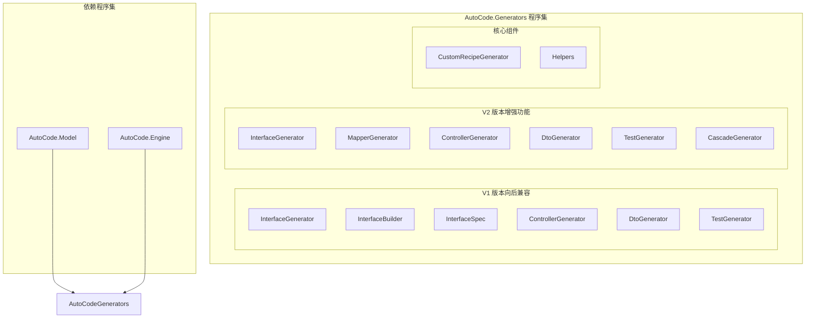
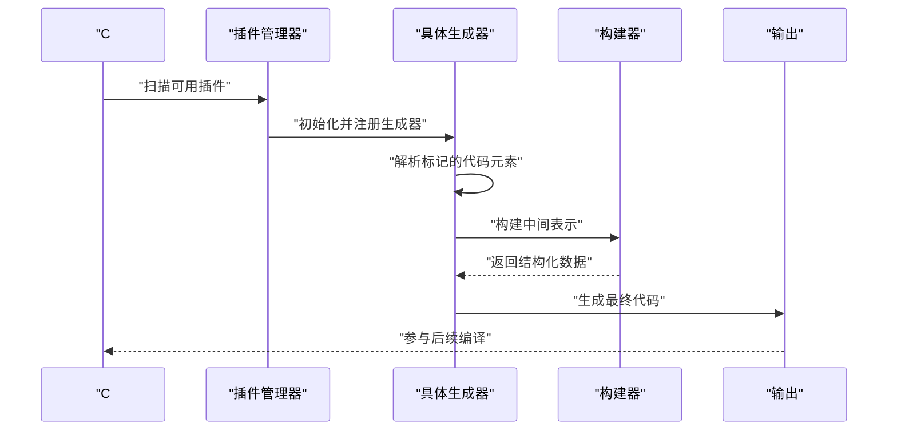
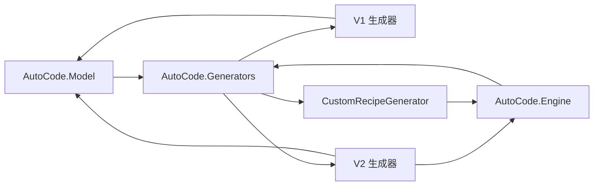

# 源代码生成器

<cite>
**本文引用的文件**
- [AutoCode.Generators.csproj](file://src/AutoCode.Generators/AutoCode.Generators.csproj)
- [CustomRecipeGenerator.cs](file://src/AutoCode.Generators/CustomRecipeGenerator.cs)
- [InterfaceGenerator.cs](file://src/AutoCode.Generators/V1/InterfaceGenerator.cs)
- [InterfaceGenerator.cs](file://src/AutoCode.Generators/V2/InterfaceGenerator.cs)
- [InterfaceSpec.cs](file://src/AutoCode.Generators/V1/InterfaceSpec.cs)
- [IGenerationPlugin.cs](file://src/AutoCode.Engine/Plugin/IGenerationPlugin.cs)
- [AutoInterfaceAttribute.cs](file://src/AutoCode.Model/InterfaceAttribute/AutoInterfaceAttribute.cs)
- [AutoIgnoreAttribute.cs](file://src/AutoCode.Model/InterfaceAttribute/AutoIgnoreAttribute.cs)
</cite>

## 更新摘要
**所做更改**
- **重大架构重构**：将40+独立生成器整合到统一的AutoCode.Generators程序集中，采用V1/V2双版本架构
- **新增自定义生成器框架**：引入CustomRecipeGenerator支持用户自定义代码生成配方
- **增强插件系统**：基于IGenerationPlugin接口的统一插件架构，支持依赖注入和执行顺序控制
- **改进开发体验**：提供增量编译优化、更好的错误诊断和调试支持
- **向后兼容**：保持V1接口兼容性，同时提供V2增强功能

## 目录
1. [简介](#简介)
2. [项目结构](#项目结构)
3. [核心组件](#核心组件)
4. [架构总览](#架构总览)
5. [详细组件分析](#详细组件分析)
6. [新增生成器详解](#新增生成器详解)
7. [依赖关系分析](#依赖关系分析)
8. [性能考虑](#性能考虑)
9. [故障排查指南](#故障排查指南)
10. [结论](#结论)
11. [附录](#附录)

## 简介
AutoCode源代码生成器经过重大架构升级，从分散的40+独立生成器整合为统一的AutoCode.Generators程序集。新版本采用V1/V2双版本架构，提供向后兼容的同时引入增强的功能和改进的开发体验。

**主要特性**：
- 统一的代码生成器框架，支持多种生成器类型
- 自定义配方生成器，允许用户定义自己的代码生成逻辑
- 增强的插件系统，支持依赖管理和执行顺序控制
- 改进的增量编译性能和更好的错误处理
- 完整的测试覆盖和调试支持

## 项目结构
AutoCode现在采用统一的程序集架构，所有生成器都包含在AutoCode.Generators中：



**图表来源**
- [AutoCode.Generators.csproj:1-38](file://src/AutoCode.Generators/AutoCode.Generators.csproj#L1-L38)

## 核心组件

### 统一生成器架构
新的架构将所有生成器整合到单一程序集中，通过V1/V2版本提供不同的功能级别：

- **V1版本**：保持向后兼容，提供基础接口生成功能
- **V2版本**：增强功能，包括更好的异步支持、XML文档继承和可空引用类型感知
- **CustomRecipeGenerator**：全新的自定义生成器框架，支持用户定义的代码生成配方

### 插件系统
基于IGenerationPlugin接口的统一插件架构：

- **统一契约**：所有生成器实现相同的接口规范
- **依赖管理**：支持插件间的依赖声明和执行顺序控制
- **触发机制**：支持属性触发和模式匹配两种触发方式
- **生命周期管理**：自动发现和管理插件生命周期

**章节来源**
- [IGenerationPlugin.cs:1-119](file://src/AutoCode.Engine/Plugin/IGenerationPlugin.cs#L1-L119)

## 架构总览
新的架构提供了清晰的层次结构和扩展点：



**图表来源**
- [CustomRecipeGenerator.cs:1-461](file://src/AutoCode.Generators/CustomRecipeGenerator.cs#L1-L461)
- [IGenerationPlugin.cs:1-119](file://src/AutoCode.Engine/Plugin/IGenerationPlugin.cs#L1-L119)

## 详细组件分析

### CustomRecipeGenerator：自定义配方生成器
CustomRecipeGenerator是新的核心组件，支持用户自定义代码生成配方：

**主要功能**：
- 从autocode.json读取配置
- 支持Liquid模板引擎
- 类名模式匹配和属性触发
- 智能模板渲染和代码生成

**工作流程**：
1. 读取AdditionalFiles中的模板文件
2. 解析配置文件中的生成器定义
3. 扫描代码库中的类和接口
4. 根据规则匹配并生成代码

**章节来源**
- [CustomRecipeGenerator.cs:1-461](file://src/AutoCode.Generators/CustomRecipeGenerator.cs#L1-L461)

### V1与V2版本对比
**V1版本特点**：
- 基础的接口生成功能
- 简单的增量编译支持
- 基本的错误处理

**V2版本增强**：
- 增强的异步方法检测
- XML文档继承支持
- 可空引用类型感知
- 更好的泛型支持
- 改进的错误诊断

**章节来源**
- [InterfaceGenerator.cs:1-200](file://src/AutoCode.Generators/V1/InterfaceGenerator.cs#L1-L200)
- [InterfaceGenerator.cs:1-200](file://src/AutoCode.Generators/V2/InterfaceGenerator.cs#L1-L200)

### InterfaceSpec规格模型
InterfaceSpec作为接口规格的数据模型，定义了接口的完整元信息：

**核心字段**：
- 接口名称和命名空间
- 方法列表和属性列表
- 使用指令集合
- 等值比较支持用于增量缓存

**章节来源**
- [InterfaceSpec.cs:1-200](file://src/AutoCode.Generators/V1/InterfaceSpec.cs#L1-L200)

## 新增生成器详解

### 自定义配方生成器
CustomRecipeGenerator提供了强大的自定义代码生成能力：

**配置驱动**：
- 支持JSON配置文件定义生成规则
- 灵活的触发条件（属性标记或类名模式）
- 丰富的模板变量支持

**模板引擎**：
- 基于Liquid模板引擎
- 支持复杂的模板逻辑
- 内置常用模板函数

**章节来源**
- [CustomRecipeGenerator.cs:1-461](file://src/AutoCode.Generators/CustomRecipeGenerator.cs#L1-L461)

### 插件化架构
新的插件系统提供了统一的扩展点：

**统一接口**：
- IGenerationPlugin定义标准接口
- GenerationPluginBase提供默认实现
- 支持依赖声明和执行优先级

**自动发现**：
- 基于Assembly级别的特性标记
- 运行时自动发现和加载插件
- 支持插件的生命周期管理

**章节来源**
- [IGenerationPlugin.cs:1-119](file://src/AutoCode.Engine/Plugin/IGenerationPlugin.cs#L1-L119)

## 依赖关系分析
新的架构简化了依赖关系，提高了模块化和可维护性：



**图表来源**
- [AutoCode.Generators.csproj:23-35](file://src/AutoCode.Generators/AutoCode.Generators.csproj#L23-L35)

## 性能考虑
新架构在性能方面进行了多项优化：

**增量编译优化**：
- 基于Roslyn增量编译API
- 智能变更检测和缓存策略
- 减少不必要的重新生成

**内存管理**：
- 对象池和重用机制
- 及时释放临时对象
- 避免大对象驻留

**并发处理**：
- 安全的并行处理多个接口
- 线程安全的资源访问
- 优化的任务调度

## 故障排查指南

### 常见问题
- **插件未加载**：检查程序集引用和插件标记
- **模板渲染失败**：验证模板语法和变量定义
- **增量编译失效**：确认增量编译配置正确
- **性能问题**：检查生成器数量和复杂度

### 调试技巧
- 启用详细的生成器日志
- 使用Visual Studio的诊断工具
- 逐步缩小问题范围
- 利用单元测试验证生成结果

### 迁移指南
从旧版本迁移到新架构：
1. 更新项目引用到AutoCode.Generators
2. 调整配置文件格式
3. 更新自定义生成器代码
4. 测试验证功能完整性

## 结论
AutoCode源代码生成器的重大架构升级显著提升了系统的可维护性、扩展性和性能。统一的程序集架构简化了部署和维护，而V1/V2双版本设计确保了向后兼容性。新的自定义配方生成器和插件系统为开发者提供了强大的扩展能力。

通过这次重构，AutoCode不仅保持了原有的功能完整性，还引入了现代化的架构模式和最佳实践，为未来的功能扩展奠定了坚实的基础。

## 附录

### 快速开始
1. 引用AutoCode.Generators程序集
2. 在项目中添加autocode.json配置文件
3. 使用[AutoInterface]标记需要生成接口的类
4. 编译项目以生成代码

### 配置示例
```json
{
  "customGenerators": [
    {
      "name": "MyGenerator",
      "trigger": {
        "attributeName": "MyAttribute",
        "classPattern": "*Service"
      },
      "output": {
        "template": "templates/my-template.liquid",
        "fileName": "{ClassName}Generated.cs"
      }
    }
  ]
}
```

### 参考文件
- [AutoCode.Generators.csproj](file://src/AutoCode.Generators/AutoCode.Generators.csproj)
- [CustomRecipeGenerator.cs](file://src/AutoCode.Generators/CustomRecipeGenerator.cs)
- [IGenerationPlugin.cs](file://src/AutoCode.Engine/Plugin/IGenerationPlugin.cs)
- [AutoInterfaceAttribute.cs](file://src/AutoCode.Model/InterfaceAttribute/AutoInterfaceAttribute.cs)
- [AutoIgnoreAttribute.cs](file://src/AutoCode.Model/InterfaceAttribute/AutoIgnoreAttribute.cs)