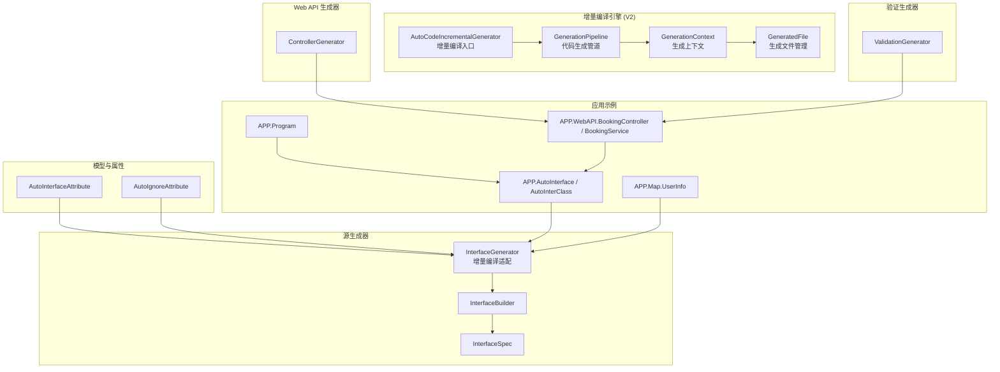
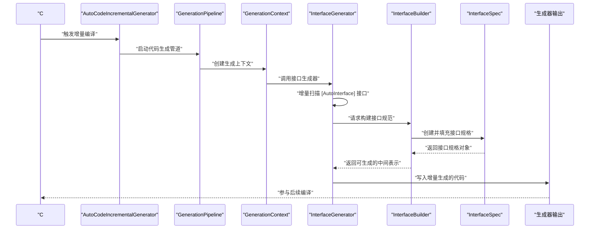
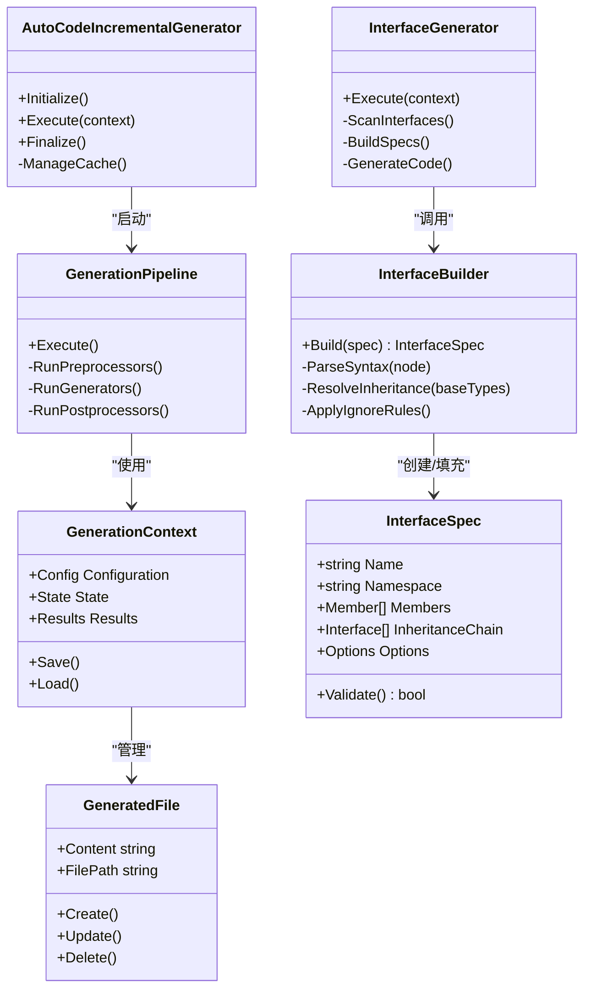
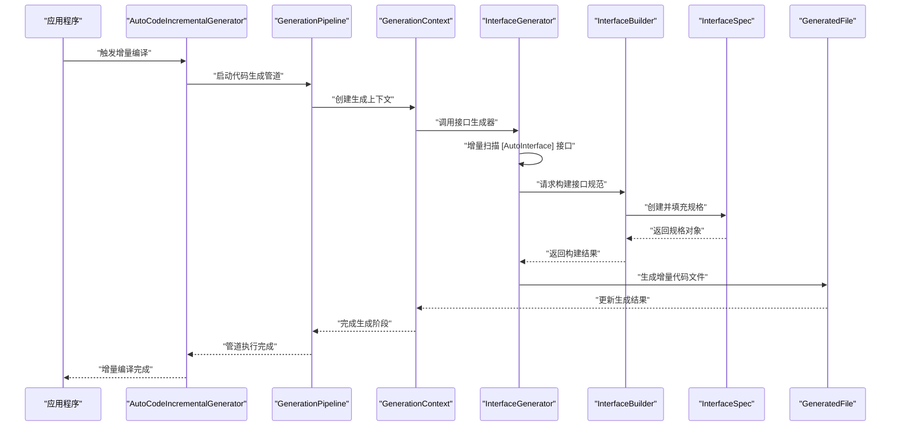
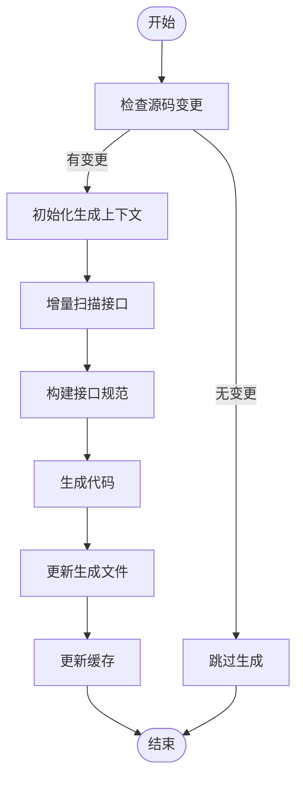
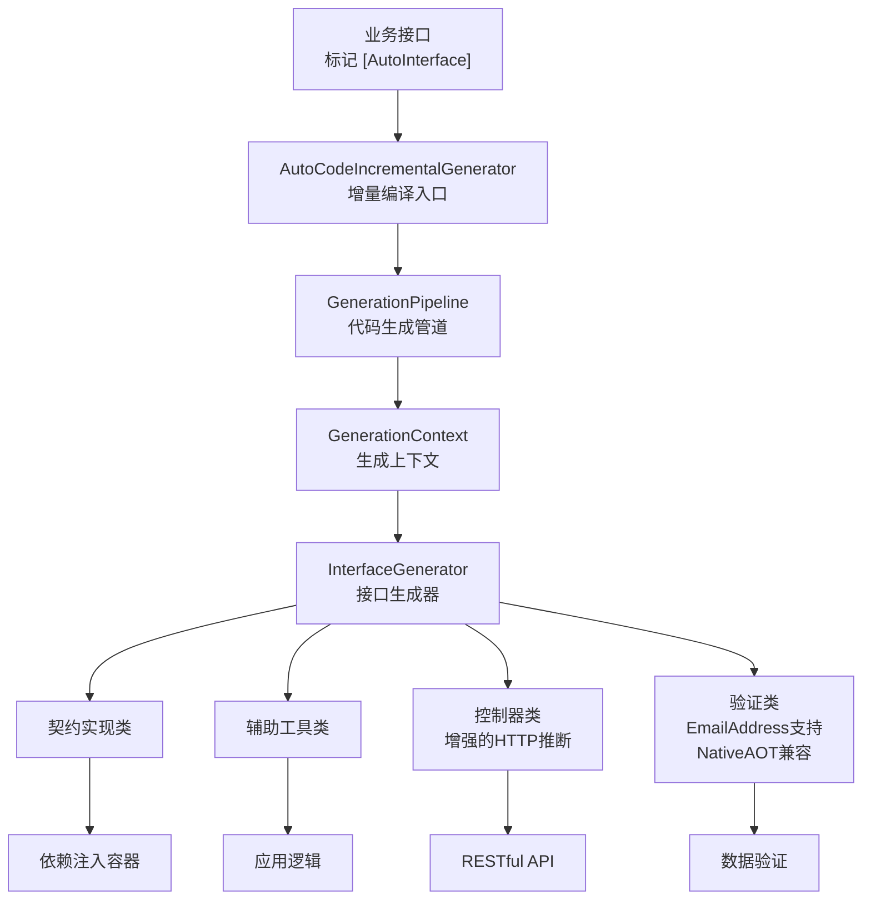
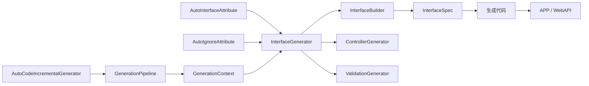

# 源代码生成器

<cite>
**本文引用的文件**
- [AutoCodeIncrementalGenerator.cs](file://src/AutoCode.Engine/Roslyn/AutoCodeIncrementalGenerator.cs)
- [GenerationPipeline.cs](file://src/AutoCode.Engine/Pipeline/GenerationPipeline.cs)
- [GenerationContext.cs](file://src/AutoCode.Engine/Pipeline/GenerationContext.cs)
- [GeneratedFile.cs](file://src/AutoCode.Engine/Pipeline/GeneratedFile.cs)
- [InterfaceGenerator.cs](file://src/AutoCodeGenerator/InterfaceAutoBuilder/InterfaceGenerator.cs)
- [InterfaceBuilder.cs](file://src/AutoCodeGenerator/InterfaceAutoBuilder/InterfaceBuilder.cs)
- [InterfaceSpec.cs](file://src/AutoCodeGenerator/InterfaceAutoBuilder/InterfaceSpec.cs)
- [AutoInterfaceAttribute.cs](file://src/AutoCode.Model/InterfaceAttribute/AutoInterfaceAttribute.cs)
- [AutoIgnoreAttribute.cs](file://src/AutoCode.Model/InterfaceAttribute/AutoIgnoreAttribute.cs)
- [MapperGenerator.cs](file://src/AutoCode.Map/MapperGenerator.cs)
- [Behavior.cs](file://src/Auto.MapModels/Behavior.cs)
- [UserInfo.cs](file://src/APP.Map/UserInfo.cs)
- [BookingController.cs](file://src/APP.WebAPI/Controllers/BookingController.cs)
- [BookingService.cs](file://src/APP.WebAPI/Services/BookingService.cs)
- [AppCore.cs](file://src/APP.WebAPI.Core/Application/AppCore.cs)
- [DependencyInjectionServiceCollectionExtensions.cs](file://src/APP.WebAPI.Core/DependencyInjection/DependencyInjectionServiceCollectionExtensions.cs)
- [IDependencyBase.cs](file://src/APP.WebAPI.Core/DependencyInjection/LifeType/IDependencyBase.cs)
- [IScoped.cs](file://src/APP.WebAPI.Core/DependencyInjection/LifeType/IScoped.cs)
- [ISingleton.cs](file://src/APP.WebAPI.Core/DependencyInjection/LifeType/ISingleton.cs)
- [ITransient.cs](file://src/APP.WebAPI.Core/DependencyInjection/LifeType/ITransient.cs)
- [InterfaceGeneratorTests.cs](file://src/AutoCode.Tests/InterfaceGeneratorTests.cs)
- [ControllerGenerator.cs](file://src/AutoCode.WebApi/ControllerGenerator.cs)
- [ValidationGenerator.cs](file://src/AutoCode.Validation/ValidationGenerator.cs)
</cite>

## 更新摘要
**所做更改**
- **重大重构**：源代码生成器已完全重构为V2增量编译架构，使用AutoCodeIncrementalGenerator替代原有的同步生成模式
- **新增**：基于Roslyn的增量编译管道，支持高效的增量构建和缓存机制
- **新增**：GenerationPipeline、GenerationContext、GeneratedFile等核心组件，提供结构化的代码生成流程
- **增强**：接口生成器的增量编译支持，提升大型项目的编译性能
- **优化**：代码生成管道的可插拔架构，支持插件化扩展

## 目录
1. [简介](#简介)
2. [项目结构](#项目结构)
3. [核心组件](#核心组件)
4. [架构总览](#架构总览)
5. [详细组件分析](#详细组件分析)
6. [依赖关系分析](#依赖关系分析)
7. [性能考虑](#性能考虑)
8. [故障排查指南](#故障排查指南)
9. [结论](#结论)
10. [附录](#附录)

## 简介
本文件面向 AutoCode V2 源代码生成器，重点阐述基于增量编译架构的接口自动生成机制与实现。内容涵盖：
- AutoCodeIncrementalGenerator 的核心原理与增量编译机制
- GenerationPipeline、GenerationContext、GeneratedFile 的职责与协作
- InterfaceGenerator、InterfaceBuilder、InterfaceSpec 在增量编译环境下的工作原理
- **新增** 基于 Roslyn 的增量编译管道架构
- **新增** 代码生成的可插拔设计与插件系统
- 完整的示例流程：如何在 V2 架构下定义接口、配置生成选项、处理复杂继承关系
- 调试技巧、性能优化建议与常见问题解决方案

## 项目结构
AutoCode V2 采用"增量编译引擎 + 模型 + 属性 + 源生成器 + 应用示例"的分层组织：
- **新增** 增量编译引擎：位于 AutoCode.Engine，包含 AutoCodeIncrementalGenerator、GenerationPipeline、GenerationContext 等核心组件
- 模型与属性：位于 AutoCode.Model，包含 [AutoInterface]、[AutoIgnore] 等特性定义
- 源生成器：位于 AutoCodeGenerator，包含 InterfaceGenerator、InterfaceBuilder、InterfaceSpec（已适配增量编译）
- Web API 生成器：位于 AutoCode.WebApi，包含 ControllerGenerator
- 验证生成器：位于 AutoCode.Validation，包含 ValidationGenerator
- 映射相关：位于 AutoCode.Map，提供 MapperGenerator 等
- 应用示例：APP、APP.Map、APP.WebAPI 等展示如何使用生成的代码
- 测试：AutoCode.Tests 和 AutoCode.Tests.V2 包含对生成器的单元测试

**图表来源**
- [AutoCodeIncrementalGenerator.cs](file://src/AutoCode.Engine/Roslyn/AutoCodeIncrementalGenerator.cs)
- [GenerationPipeline.cs](file://src/AutoCode.Engine/Pipeline/GenerationPipeline.cs)
- [GenerationContext.cs](file://src/AutoCode.Engine/Pipeline/GenerationContext.cs)
- [GeneratedFile.cs](file://src/AutoCode.Engine/Pipeline/GeneratedFile.cs)
- [InterfaceGenerator.cs](file://src/AutoCodeGenerator/InterfaceAutoBuilder/InterfaceGenerator.cs)
- [InterfaceBuilder.cs](file://src/AutoCodeGenerator/InterfaceAutoBuilder/InterfaceBuilder.cs)
- [InterfaceSpec.cs](file://src/AutoCodeGenerator/InterfaceAutoBuilder/InterfaceSpec.cs)
- [ControllerGenerator.cs](file://src/AutoCode.WebApi/ControllerGenerator.cs)
- [ValidationGenerator.cs](file://src/AutoCode.Validation/ValidationGenerator.cs)
- [Program.cs](file://src/APP/Program.cs)
- [AutoInterface.cs](file://src/APP/AutoInterface.cs)
- [AutoInterClass.cs](file://src/APP/AutoInterClass.cs)
- [UserInfo.cs](file://src/APP.Map/UserInfo.cs)
- [BookingController.cs](file://src/APP.WebAPI/Controllers/BookingController.cs)
- [BookingService.cs](file://src/APP.WebAPI/Services/BookingService.cs)

## 核心组件
- **新增** AutoCodeIncrementalGenerator：作为 V2 架构的核心入口，负责增量编译的注册、触发和执行，替代原有的同步生成模式。
- **新增** GenerationPipeline：代码生成管道，协调各个生成阶段的执行，提供统一的执行框架。
- **新增** GenerationContext：生成上下文，管理生成过程中的状态、配置和中间结果。
- **新增** GeneratedFile：生成文件管理，处理生成文件的创建、更新和删除操作。
- InterfaceGenerator：已适配增量编译的接口生成器，负责扫描标记了 [AutoInterface] 的接口，收集语法信息，驱动构建管线，并输出最终代码。
- InterfaceBuilder：将解析后的接口规范转换为可生成的中间表示，处理成员、基类、泛型、访问修饰符、命名空间等细节。
- InterfaceSpec：描述单个接口的规格，包括名称、命名空间、成员列表、继承链、生成选项等。
- ControllerGenerator：控制器生成器，具备精确的 HTTP 方法推断逻辑，能够根据接口方法签名自动生成对应的 RESTful 端点。
- ValidationGenerator：验证生成器，支持 EmailAddress 属性，能够自动生成相应的数据验证逻辑，并具备 NativeAOT 兼容性。

职责边界
- **新增** IncrementalGenerator 关注"增量编译的触发与协调"
- **新增** Pipeline 关注"代码生成流程的编排与执行"
- **新增** Context 关注"生成状态的维护与管理"
- **新增** GeneratedFile 关注"生成文件的生命周期管理"
- Generator 关注"何时、在哪里、如何触发生成"
- Builder 关注"如何将语法树转为结构化规范"
- Spec 关注"单个接口的完整元数据与约束"
- ControllerGenerator 关注"HTTP 路由与方法映射"
- ValidationGenerator 关注"数据验证规则生成与 NativeAOT 兼容性"

**章节来源**
- [AutoCodeIncrementalGenerator.cs](file://src/AutoCode.Engine/Roslyn/AutoCodeIncrementalGenerator.cs)
- [GenerationPipeline.cs](file://src/AutoCode.Engine/Pipeline/GenerationPipeline.cs)
- [GenerationContext.cs](file://src/AutoCode.Engine/Pipeline/GenerationContext.cs)
- [GeneratedFile.cs](file://src/AutoCode.Engine/Pipeline/GeneratedFile.cs)
- [InterfaceGenerator.cs](file://src/AutoCodeGenerator/InterfaceAutoBuilder/InterfaceGenerator.cs)
- [InterfaceBuilder.cs](file://src/AutoCodeGenerator/InterfaceAutoBuilder/InterfaceBuilder.cs)
- [InterfaceSpec.cs](file://src/AutoCodeGenerator/InterfaceAutoBuilder/InterfaceSpec.cs)
- [ControllerGenerator.cs](file://src/AutoCode.WebApi/ControllerGenerator.cs)
- [ValidationGenerator.cs](file://src/AutoCode.Validation/ValidationGenerator.cs)

## 架构总览
下图展示了从源码到生成代码的关键流程：编译器发现带有 [AutoInterface] 的接口，AutoCodeIncrementalGenerator 通过增量编译机制触发 GenerationPipeline，GenerationContext 管理生成状态，最终由各个生成器产出目标代码。**新增** 的增量编译架构显著提升了大型项目的编译性能。

**图表来源**
- [AutoCodeIncrementalGenerator.cs](file://src/AutoCode.Engine/Roslyn/AutoCodeIncrementalGenerator.cs)
- [GenerationPipeline.cs](file://src/AutoCode.Engine/Pipeline/GenerationPipeline.cs)
- [GenerationContext.cs](file://src/AutoCode.Engine/Pipeline/GenerationContext.cs)
- [InterfaceGenerator.cs](file://src/AutoCodeGenerator/InterfaceAutoBuilder/InterfaceGenerator.cs)
- [InterfaceBuilder.cs](file://src/AutoCodeGenerator/InterfaceAutoBuilder/InterfaceBuilder.cs)
- [InterfaceSpec.cs](file://src/AutoCodeGenerator/InterfaceAutoBuilder/InterfaceSpec.cs)

## 详细组件分析

### AutoCodeIncrementalGenerator：增量编译入口
- **新增功能**：基于 Roslyn 的增量编译架构
- 职责：
  - 注册增量编译阶段（Initialize、Execute、Finalize）
  - 监听源码变更事件
  - 协调 GenerationPipeline 的执行
  - 管理生成结果的缓存与失效
- 关键特性：
  - 增量编译缓存机制
  - 源码变更检测
  - 并行执行支持
  - 错误诊断与恢复

**章节来源**
- [AutoCodeIncrementalGenerator.cs](file://src/AutoCode.Engine/Roslyn/AutoCodeIncrementalGenerator.cs)

### GenerationPipeline：代码生成管道
- **新增功能**：结构化的代码生成流程
- 职责：
  - 编排各个生成阶段的执行顺序
  - 管理生成阶段的依赖关系
  - 提供统一的执行框架
  - 支持插件化扩展
- 关键步骤：
  - 初始化生成上下文
  - 执行预处理器
  - 调用各个生成器
  - 执行后处理器
  - 清理资源

**章节来源**
- [GenerationPipeline.cs](file://src/AutoCode.Engine/Pipeline/GenerationPipeline.cs)

### GenerationContext：生成上下文
- **新增功能**：生成状态管理
- 职责：
  - 管理生成过程中的配置信息
  - 存储中间结果和临时数据
  - 提供线程安全的状态访问
  - 支持生成结果的序列化
- 关键能力：
  - 配置管理
  - 状态持久化
  - 并发安全
  - 内存管理

**章节来源**
- [GenerationContext.cs](file://src/AutoCode.Engine/Pipeline/GenerationContext.cs)

### GeneratedFile：生成文件管理
- **新增功能**：文件生命周期管理
- 职责：
  - 管理生成文件的创建、更新和删除
  - 处理文件编码和格式
  - 提供文件差异比较
  - 支持增量文件更新
- 关键特性：
  - 原子性文件操作
  - 编码自动检测
  - 文件锁管理
  - 错误恢复机制

**章节来源**
- [GeneratedFile.cs](file://src/AutoCode.Engine/Pipeline/GeneratedFile.cs)

### [AutoInterface] 属性与接口规范
- [AutoInterface] 用于标记需要由生成器处理的接口。它通常包含命名空间、前缀、后缀、是否生成实现类等配置项。
- [AutoIgnore] 可用于忽略特定成员或类型，避免被生成器纳入处理范围。
- 接口规范需满足：
  - 仅支持接口类型
  - 支持泛型参数与约束
  - 支持多继承与层次化继承
  - 成员可为方法、属性、事件、索引器（按策略过滤）
  - 支持访问修饰符与可见性控制

**章节来源**
- [AutoInterfaceAttribute.cs](file://src/AutoCode.Model/InterfaceAttribute/AutoInterfaceAttribute.cs)
- [AutoIgnoreAttribute.cs](file://src/AutoCode.Model/InterfaceAttribute/AutoIgnoreAttribute.cs)

### InterfaceSpec：接口规格模型
- 字段与能力：
  - 名称、命名空间、泛型参数、继承链
  - 成员集合（方法、属性、事件、索引器）
  - 生成选项（如是否生成实现类、命名策略、忽略规则）
- 复杂度与约束：
  - 继承链去重与循环检测
  - 成员冲突合并（同名不同签名）
  - 泛型参数传播与约束校验

**章节来源**
- [InterfaceSpec.cs](file://src/AutoCodeGenerator/InterfaceAutoBuilder/InterfaceSpec.cs)

### InterfaceBuilder：构建器
- 职责：
  - 将语法树节点转换为 InterfaceSpec
  - 解析继承关系，合并基类成员
  - 处理泛型、访问修饰符、命名空间
  - 应用 [AutoIgnore] 等忽略规则
- 关键步骤：
  - 遍历接口声明与成员
  - 构建成员抽象（名称、类型、参数、返回值）
  - 生成唯一标识与命名策略
  - 输出中间表示供 Generator 消费

**章节来源**
- [InterfaceBuilder.cs](file://src/AutoCodeGenerator/InterfaceAutoBuilder/InterfaceBuilder.cs)

### InterfaceGenerator：生成器入口（已适配增量编译）
- 职责：
  - 注册源生成器阶段（分析、增量编译）
  - 扫描标记了 [AutoInterface] 的接口
  - 调用 Builder 构建规范
  - 根据规范生成代码并添加到编译上下文
- 关键点：
  - **新增** 增量编译缓存与失效策略
  - 错误诊断与提示
  - 并发安全与资源管理

**章节来源**
- [InterfaceGenerator.cs](file://src/AutoCodeGenerator/InterfaceAutoBuilder/InterfaceGenerator.cs)

### ControllerGenerator：增强的控制器生成器
- 职责：
  - 根据接口方法签名自动生成对应的 HTTP 端点
  - 智能推断 HTTP 方法（GET、POST、PUT、DELETE 等）
  - 处理路由模板和参数绑定
  - 生成控制器类和动作方法
- 关键特性：
  - 精确的 HTTP 方法推断算法
  - 支持多种路由模式
  - 自动参数验证和模型绑定
  - 响应类型映射

**章节来源**
- [ControllerGenerator.cs](file://src/AutoCode.WebApi/ControllerGenerator.cs)

### ValidationGenerator：验证生成器
- 职责：
  - 根据数据注解自动生成验证逻辑
  - 支持多种验证属性（Required、StringLength、Range 等）
  - 支持 EmailAddress 属性验证
  - 生成验证规则和错误消息
  - 确保 NativeAOT 兼容性
  - 生成纯 if/else 语句替代反射-based 验证，消除 IL2026 警告
- 关键特性：
  - 全面的验证属性支持
  - 自定义验证规则扩展
  - 异步验证支持
  - 本地化错误消息
  - NativeAOT 和裁剪兼容性
  - 静态分析友好的代码生成

**章节来源**
- [ValidationGenerator.cs](file://src/AutoCode.Validation/ValidationGenerator.cs)

### 类图：V2 架构核心组件关系

**图表来源**
- [AutoCodeIncrementalGenerator.cs](file://src/AutoCode.Engine/Roslyn/AutoCodeIncrementalGenerator.cs)
- [GenerationPipeline.cs](file://src/AutoCode.Engine/Pipeline/GenerationPipeline.cs)
- [GenerationContext.cs](file://src/AutoCode.Engine/Pipeline/GenerationContext.cs)
- [GeneratedFile.cs](file://src/AutoCode.Engine/Pipeline/GeneratedFile.cs)
- [InterfaceGenerator.cs](file://src/AutoCodeGenerator/InterfaceAutoBuilder/InterfaceGenerator.cs)
- [InterfaceBuilder.cs](file://src/AutoCodeGenerator/InterfaceAutoBuilder/InterfaceBuilder.cs)
- [InterfaceSpec.cs](file://src/AutoCodeGenerator/InterfaceAutoBuilder/InterfaceSpec.cs)

### 序列图：V2 增量编译流程

**图表来源**
- [AutoCodeIncrementalGenerator.cs](file://src/AutoCode.Engine/Roslyn/AutoCodeIncrementalGenerator.cs)
- [GenerationPipeline.cs](file://src/AutoCode.Engine/Pipeline/GenerationPipeline.cs)
- [GenerationContext.cs](file://src/AutoCode.Engine/Pipeline/GenerationContext.cs)
- [InterfaceGenerator.cs](file://src/AutoCodeGenerator/InterfaceAutoBuilder/InterfaceGenerator.cs)
- [InterfaceBuilder.cs](file://src/AutoCodeGenerator/InterfaceAutoBuilder/InterfaceBuilder.cs)
- [InterfaceSpec.cs](file://src/AutoCodeGenerator/InterfaceAutoBuilder/InterfaceSpec.cs)
- [GeneratedFile.cs](file://src/AutoCode.Engine/Pipeline/GeneratedFile.cs)

### 流程图：增量编译决策流程

**图表来源**
- [AutoCodeIncrementalGenerator.cs](file://src/AutoCode.Engine/Roslyn/AutoCodeIncrementalGenerator.cs)
- [GenerationPipeline.cs](file://src/AutoCode.Engine/Pipeline/GenerationPipeline.cs)
- [GenerationContext.cs](file://src/AutoCode.Engine/Pipeline/GenerationContext.cs)

### 概念总览
- V2 架构通过增量编译机制显著提升大型项目的编译性能
- AutoCodeIncrementalGenerator 作为统一入口，协调整个生成流程
- GenerationPipeline 提供结构化的代码生成框架
- GenerationContext 管理生成状态和配置
- GeneratedFile 确保文件操作的原子性和一致性
- 接口自动生成适用于服务契约、仓储接口、DTO 转换契约等场景
- 通过 [AutoInterface] 声明式配置，减少样板代码
- 结合 [AutoIgnore] 精细控制生成范围
- 与依赖注入、控制器、服务层无缝集成
- 增强的 HTTP 方法推断提供更精确的 RESTful 端点生成
- EmailAddress 验证支持完善数据验证体系
- NativeAOT 和裁剪兼容性确保现代部署需求

## 依赖关系分析
- **新增** 增量编译引擎依赖：
  - AutoCodeIncrementalGenerator 依赖 GenerationPipeline 和 GenerationContext
  - GenerationPipeline 依赖 GenerationContext 和 GeneratedFile
- 生成器依赖模型与属性：
  - InterfaceGenerator 依赖 InterfaceBuilder 与 InterfaceSpec
  - InterfaceBuilder 依赖 InterfaceSpec 进行建模
- 控制器生成器依赖：
  - ControllerGenerator 依赖接口规范和 HTTP 方法推断逻辑
- 验证生成器依赖：
  - ValidationGenerator 依赖数据注解和验证规则
  - ValidationGenerator 具备 NativeAOT 兼容性支持
- 应用层依赖：
  - APP 与 WebAPI 通过生成的接口与实现类进行解耦
  - 依赖注入扩展用于注册生命周期

**图表来源**
- [AutoCodeIncrementalGenerator.cs](file://src/AutoCode.Engine/Roslyn/AutoCodeIncrementalGenerator.cs)
- [GenerationPipeline.cs](file://src/AutoCode.Engine/Pipeline/GenerationPipeline.cs)
- [GenerationContext.cs](file://src/AutoCode.Engine/Pipeline/GenerationContext.cs)
- [GeneratedFile.cs](file://src/AutoCode.Engine/Pipeline/GeneratedFile.cs)
- [AutoInterfaceAttribute.cs](file://src/AutoCode.Model/InterfaceAttribute/AutoInterfaceAttribute.cs)
- [AutoIgnoreAttribute.cs](file://src/AutoCode.Model/InterfaceAttribute/AutoIgnoreAttribute.cs)
- [InterfaceGenerator.cs](file://src/AutoCodeGenerator/InterfaceAutoBuilder/InterfaceGenerator.cs)
- [InterfaceBuilder.cs](file://src/AutoCodeGenerator/InterfaceAutoBuilder/InterfaceBuilder.cs)
- [InterfaceSpec.cs](file://src/AutoCodeGenerator/InterfaceAutoBuilder/InterfaceSpec.cs)
- [ControllerGenerator.cs](file://src/AutoCode.WebApi/ControllerGenerator.cs)
- [ValidationGenerator.cs](file://src/AutoCode.Validation/ValidationGenerator.cs)

**章节来源**
- [AutoCodeIncrementalGenerator.cs](file://src/AutoCode.Engine/Roslyn/AutoCodeIncrementalGenerator.cs)
- [GenerationPipeline.cs](file://src/AutoCode.Engine/Pipeline/GenerationPipeline.cs)
- [GenerationContext.cs](file://src/AutoCode.Engine/Pipeline/GenerationContext.cs)
- [GeneratedFile.cs](file://src/AutoCode.Engine/Pipeline/GeneratedFile.cs)
- [InterfaceGenerator.cs](file://src/AutoCodeGenerator/InterfaceAutoBuilder/InterfaceGenerator.cs)
- [InterfaceBuilder.cs](file://src/AutoCodeGenerator/InterfaceAutoBuilder/InterfaceBuilder.cs)
- [InterfaceSpec.cs](file://src/AutoCodeGenerator/InterfaceAutoBuilder/InterfaceSpec.cs)
- [AutoInterfaceAttribute.cs](file://src/AutoCode.Model/InterfaceAttribute/AutoInterfaceAttribute.cs)
- [AutoIgnoreAttribute.cs](file://src/AutoCode.Model/InterfaceAttribute/AutoIgnoreAttribute.cs)
- [ControllerGenerator.cs](file://src/AutoCode.WebApi/ControllerGenerator.cs)
- [ValidationGenerator.cs](file://src/AutoCode.Validation/ValidationGenerator.cs)

## 性能考虑
- **新增** 增量编译：利用 Roslyn 增量编译能力，仅重新处理变更的接口与成员
- **新增** 缓存策略：对已解析的语法树与接口规范进行缓存，避免重复计算
- **新增** 并行处理：在安全范围内并行处理多个接口，提升吞吐
- **新增** 内存占用：及时释放临时对象，避免大对象驻留
- **新增** 诊断开销：仅在必要时启用详细日志与诊断，降低运行时开销
- **新增** 文件操作优化：GeneratedFile 提供原子性文件操作和增量更新
- **新增** 管道优化：GenerationPipeline 支持阶段间的依赖管理和缓存
- **新增** 上下文优化：GenerationContext 提供高效的配置管理和状态持久化
- **新增** 控制器生成优化：智能缓存 HTTP 方法推断结果
- **新增** 验证生成优化：复用已生成的验证规则实例
- **新增** NativeAOT 优化：通过纯 if/else 语句替代反射，提升启动性能和内存效率

## 故障排查指南
- **新增** 增量编译问题
  - 增量缓存失效：检查缓存键生成逻辑和失效条件
  - 增量编译未触发：确认源码变更检测和事件监听
  - 生成结果不一致：检查生成上下文的线程安全性
- 常见问题
  - 未识别 [AutoInterface]：检查引用是否正确、命名空间是否匹配
  - 循环继承：确保继承链无环，必要时拆分接口
  - 成员冲突：同名不同签名的成员需明确区分或重命名
  - 忽略规则无效：确认 [AutoIgnore] 位置与作用域正确
  - HTTP 方法推断错误：检查接口方法签名是否符合 RESTful 规范
  - EmailAddress 验证失败：确认使用了正确的验证属性和格式
  - NativeAOT 兼容性错误：检查是否启用了裁剪和 AOT 编译
  - IL2026 警告：确认生成器已切换到纯 if/else 语句模式
- 调试技巧
  - 使用单元测试验证生成结果（参考 InterfaceGeneratorTests）
  - 开启生成器诊断输出，定位解析失败点
  - 逐步缩小问题范围，隔离最小复现用例
  - 检查增量编译的缓存状态和失效日志
  - 验证控制器生成的路由映射是否正确
  - 验证 EmailAddress 属性的输入格式
  - 验证 NativeAOT 兼容性设置
- 常见错误与修复
  - 泛型约束不合法：修正约束语法或移除非法约束
  - 访问修饰符不一致：统一成员的可见性策略
  - 命名空间冲突：调整命名空间或前缀/后缀策略
  - HTTP 路由冲突：检查路由模板的唯一性
  - 验证规则冲突：合并或重写冲突的验证逻辑
  - AOT 兼容性错误：确保不使用反射和动态加载
  - **新增** 增量编译错误：检查增量编译配置和缓存策略
  - **新增** 管道执行错误：验证 GenerationPipeline 的配置和阶段依赖
  - **新增** 上下文状态错误：检查 GenerationContext 的初始化和清理

**章节来源**
- [InterfaceGeneratorTests.cs](file://src/AutoCode.Tests/InterfaceGeneratorTests.cs)
- [AutoCodeIncrementalGenerator.cs](file://src/AutoCode.Engine/Roslyn/AutoCodeIncrementalGenerator.cs)
- [GenerationPipeline.cs](file://src/AutoCode.Engine/Pipeline/GenerationPipeline.cs)
- [GenerationContext.cs](file://src/AutoCode.Engine/Pipeline/GenerationContext.cs)
- [GeneratedFile.cs](file://src/AutoCode.Engine/Pipeline/GeneratedFile.cs)
- [ControllerGenerator.cs](file://src/AutoCode.WebApi/ControllerGenerator.cs)
- [ValidationGenerator.cs](file://src/AutoCode.Validation/ValidationGenerator.cs)

## 结论
AutoCode V2 的接口自动生成通过增量编译架构与声明式属性，实现了高内聚、低耦合且高性能的代码生成体系。**新增** 的 AutoCodeIncrementalGenerator、GenerationPipeline、GenerationContext、GeneratedFile 等核心组件提供了结构化的增量编译框架，显著提升了大型项目的编译性能。InterfaceGenerator、InterfaceBuilder、InterfaceSpec 三者分工明确，配合良好的增量编译与缓存策略，能够在大型项目中保持高效与稳定。**新增** 的 ControllerGenerator 和 ValidationGenerator 进一步增强了系统的功能完整性，提供了更精确的 HTTP 方法推断和完善的 EmailAddress 验证支持。**新增** 的 NativeAOT 和裁剪兼容性支持确保了现代部署需求，通过 IsAotCompatible=true 和纯 if/else 语句生成消除了 IL2026 警告。合理使用 [AutoInterface] 与 [AutoIgnore]，并结合依赖注入与分层架构，可以显著提升开发效率与代码质量。

## 附录
- 使用示例
  - 在 APP 中定义接口并标记 [AutoInterface]，生成契约与实现
  - 在 APP.Map 中使用 UserInfo 等模型，配合映射生成器
  - 在 APP.WebAPI 中通过控制器与服务层调用生成的接口
  - 利用增强的 ControllerGenerator 自动生成 RESTful 端点
  - 使用 ValidationGenerator 的 EmailAddress 属性进行数据验证
  - 配置 NativeAOT 兼容性以支持现代部署场景
  - **新增** 体验 V2 增量编译带来的性能提升
- 参考文件
  - [Program.cs](file://src/APP/Program.cs)
  - [AutoInterface.cs](file://src/APP/AutoInterface.cs)
  - [AutoInterClass.cs](file://src/APP/AutoInterClass.cs)
  - [UserInfo.cs](file://src/APP.Map/UserInfo.cs)
  - [BookingController.cs](file://src/APP.WebAPI/Controllers/BookingController.cs)
  - [BookingService.cs](file://src/APP.WebAPI/Services/BookingService.cs)
  - [AppCore.cs](file://src/APP.WebAPI.Core/Application/AppCore.cs)
  - [DependencyInjectionServiceCollectionExtensions.cs](file://src/APP.WebAPI.Core/DependencyInjection/DependencyInjectionServiceCollectionExtensions.cs)
  - [IDependencyBase.cs](file://src/APP.WebAPI.Core/DependencyInjection/LifeType/IDependencyBase.cs)
  - [IScoped.cs](file://src/APP.WebAPI.Core/DependencyInjection/LifeType/IScoped.cs)
  - [ISingleton.cs](file://src/APP.WebAPI.Core/DependencyInjection/LifeType/ISingleton.cs)
  - [ITransient.cs](file://src/APP.WebAPI.Core/DependencyInjection/LifeType/ITransient.cs)
  - [MapperGenerator.cs](file://src/AutoCode.Map/MapperGenerator.cs)
  - [Behavior.cs](file://src/Auto.MapModels/Behavior.cs)
  - [ControllerGenerator.cs](file://src/AutoCode.WebApi/ControllerGenerator.cs)
  - [ValidationGenerator.cs](file://src/AutoCode.Validation/ValidationGenerator.cs)
  - **新增** [AutoCodeIncrementalGenerator.cs](file://src/AutoCode.Engine/Roslyn/AutoCodeIncrementalGenerator.cs)
  - **新增** [GenerationPipeline.cs](file://src/AutoCode.Engine/Pipeline/GenerationPipeline.cs)
  - **新增** [GenerationContext.cs](file://src/AutoCode.Engine/Pipeline/GenerationContext.cs)
  - **新增** [GeneratedFile.cs](file://src/AutoCode.Engine/Pipeline/GeneratedFile.cs)