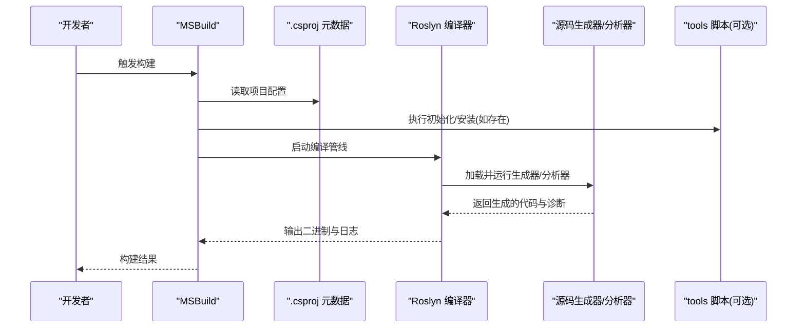
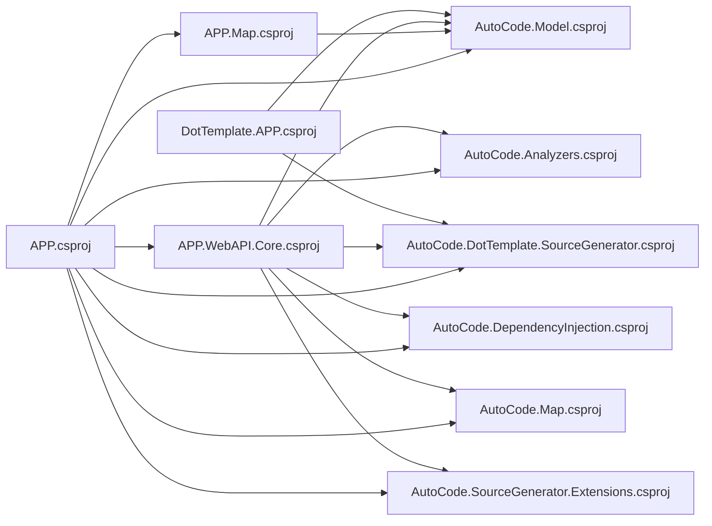

# MSBuild配置支持

<cite>
**本文引用的文件**   
- [AutoCode.sln](file://src/AutoCode.sln)
- [APP.csproj](file://src/APP/APP.csproj)
- [APP.Map.csproj](file://src/APP.Map/APP.Map.csproj)
- [APP.WebAPI.csproj](file://src/APP.WebAPI/APP.WebAPI.csproj)
- [APP.WebAPI.Core.csproj](file://src/APP.WebAPI.Core/APP.WebAPI.Core.csproj)
- [AutoCode.Analyzers.csproj](file://src/AutoCode.Analyzers/AutoCode.Analyzers.csproj)
- [AutoCode.DependencyInjection.csproj](file://src/AutoCode.DependencyInjection/AutoCode.DependencyInjection.csproj)
- [AutoCode.SourceGenerator.Extensions.csproj](file://src/AutoCode.Extensions.SourceGenerator/AutoCode.SourceGenerator.Extensions.csproj)
- [AutoCode.Map.csproj](file://src/AutoCode.Map/AutoCode.Map.csproj)
- [AutoCode.Model.csproj](file://src/AutoCode.Model/AutoCode.Model.csproj)
- [AutoCode.DotTemplate.SourceGenerator.csproj](file://src/AutoCode.XmlTemplate.SourceGenerator/AutoCode.DotTemplate.SourceGenerator.csproj)
- [DotTemplate.APP.csproj](file://src/DotTemplate.APP/DotTemplate.APP.csproj)
- [Models.csproj](file://src/Models/Models.csproj)
- [.editorconfig](file://src/.editorconfig)
</cite>

## 更新摘要
**所做更改**   
- 新增MSBuild配置选项的完整文档说明
- 更新了项目结构和依赖关系分析
- 增强了生成器与分析器的集成模式说明
- 补充了NuGet包内工具脚本的详细配置指南

## 目录
1. [简介](#简介)
2. [项目结构](#项目结构)
3. [核心组件](#核心组件)
4. [架构总览](#架构总览)
5. [详细组件分析](#详细组件分析)
6. [MSBuild配置选项](#msbuild配置选项)
7. [依赖关系分析](#依赖关系分析)
8. [性能考虑](#性能考虑)
9. [故障排查指南](#故障排查指南)
10. [结论](#结论)
11. [附录](#附录)

## 简介
本文件聚焦于 AutoCode 项目的 MSBuild 配置支持，涵盖解决方案与项目文件的组织方式、生成器与分析器的集成模式、NuGet 包内工具脚本的加载机制，以及编辑器与构建行为的一致性控制。文档面向不同技术背景的读者，既提供高层概览，也给出代码级结构与数据流说明，帮助快速理解并扩展 MSBuild 相关能力。

## 项目结构
该仓库采用多项目解决方案（.sln）组织，按功能域划分多个 .csproj：
- 应用层示例：APP、APP.Map、APP.WebAPI、APP.WebAPI.Core
- 源码生成与分析：AutoCode.Analyzers、AutoCode.DependencyInjection、AutoCode.Map、AutoCode.Model、AutoCode.DotTemplate.SourceGenerator
- 扩展与打包：AutoCode.SourceGenerator.Extensions（含 NuGet 包产物与 tools 脚本）
- 模板与演示：DotTemplate.APP
- 通用模型：Models
- 编辑器配置：.editorconfig

```mermaid
graph TB
subgraph "解决方案"
SLN["AutoCode.sln"]
end
subgraph "应用示例"
APP["APP.csproj"]
MAP["APP.Map.csproj"]
WEBAPI["APP.WebAPI.csproj"]
CORE["APP.WebAPI.Core.csproj"]
end
subgraph "源码生成与分析"
ANA["AutoCode.Analyzers.csproj"]
DI["AutoCode.DependencyInjection.csproj"]
MAPGEN["AutoCode.Map.csproj"]
MODEL["AutoCode.Model.csproj"]
DOTGEN["AutoCode.DotTemplate.SourceGenerator.csproj"]
end
subgraph "扩展与打包"
EXT["AutoCode.SourceGenerator.Extensions.csproj"]
end
subgraph "模板与演示"
DTAPP["DotTemplate.APP.csproj"]
end
subgraph "通用"
MODELS["Models.csproj"]
EDIT[".editorconfig"]
end
SLN --> APP
SLN --> MAP
SLN --> WEBAPI
SLN --> CORE
SLN --> ANA
SLN --> DI
SLN --> MAPGEN
SLN --> MODEL
SLN --> DOTGEN
SLN --> EXT
SLN --> DTAPP
SLN --> MODELS
SLN --> EDIT
```

图表来源
- [AutoCode.sln](file://src/AutoCode.sln)

章节来源
- [AutoCode.sln](file://src/AutoCode.sln)

## 核心组件
- 解决方案与项目文件：通过 .sln 统一编排构建；各 .csproj 声明目标框架、引用关系、生成器与分析器依赖。
- 源码生成器与分析器：以 .csproj 形式实现，作为 Roslyn 插件在编译期运行，参与代码生成与诊断。
- NuGet 工具脚本：在扩展包的 tools 目录下提供初始化与安装脚本，便于在项目中启用或清理生成器。
- 编辑器一致性：.editorconfig 统一编码、缩进、行尾等规则，确保 IDE 与 MSBuild 行为一致。

章节来源
- [AutoCode.sln](file://src/AutoCode.sln)
- [APP.csproj](file://src/APP/APP.csproj)
- [APP.Map.csproj](file://src/APP.Map/APP.Map.csproj)
- [APP.WebAPI.csproj](file://src/APP.WebAPI/APP.WebAPI.csproj)
- [APP.WebAPI.Core.csproj](file://src/APP.WebAPI.Core/APP.WebAPI.Core.csproj)
- [AutoCode.Analyzers.csproj](file://src/AutoCode.Analyzers/AutoCode.Analyzers.csproj)
- [AutoCode.DependencyInjection.csproj](file://src/AutoCode.DependencyInjection/AutoCode.DependencyInjection.csproj)
- [AutoCode.Map.csproj](file://src/AutoCode.Map/AutoCode.Map.csproj)
- [AutoCode.Model.csproj](file://src/AutoCode.Model/AutoCode.Model.csproj)
- [AutoCode.DotTemplate.SourceGenerator.csproj](file://src/AutoCode.XmlTemplate.SourceGenerator/AutoCode.DotTemplate.SourceGenerator.csproj)
- [AutoCode.SourceGenerator.Extensions.csproj](file://src/AutoCode.Extensions.SourceGenerator/AutoCode.SourceGenerator.Extensions.csproj)
- [DotTemplate.APP.csproj](file://src/DotTemplate.APP/DotTemplate.APP.csproj)
- [Models.csproj](file://src/Models/Models.csproj)
- [.editorconfig](file://src/.editorconfig)

## 架构总览
MSBuild 在该方案中的职责是协调编译期任务：
- 解析 .sln 与 .csproj 元数据
- 加载 Roslyn 编译器与 Analyzers/Source Generators
- 执行生成器产出代码，随后进入正常编译流程
- 可选地执行 tools 脚本完成环境准备

图表来源
- [AutoCode.sln](file://src/AutoCode.sln)
- [AutoCode.SourceGenerator.Extensions.csproj](file://src/AutoCode.Extensions.SourceGenerator/AutoCode.SourceGenerator.Extensions.csproj)

## 详细组件分析

### 解决方案与项目文件（MSBuild 入口）
- 解决方案文件集中管理所有项目引用与构建顺序，保证跨项目依赖正确解析。
- 各项目 .csproj 定义目标框架、包引用、生成器与分析器注入点，以及必要的属性开关。

章节来源
- [AutoCode.sln](file://src/AutoCode.sln)
- [APP.csproj](file://src/APP/APP.csproj)
- [APP.Map.csproj](file://src/APP.Map/APP.Map.csproj)
- [APP.WebAPI.csproj](file://src/APP.WebAPI/APP.WebAPI.csproj)
- [APP.WebAPI.Core.csproj](file://src/APP.WebAPI.Core/APP.WebAPI.Core.csproj)
- [Models.csproj](file://src/Models/Models.csproj)

### 源码生成器与分析器（编译期增强）
- 生成器与分析器以独立项目形式维护，通过 NuGet 引用注入到消费项目中。
- 生成器在编译阶段产出代码，分析器提供诊断与修复建议，二者共同提升开发体验与代码质量。

章节来源
- [AutoCode.Analyzers.csproj](file://src/AutoCode.Analyzers/AutoCode.Analyzers.csproj)
- [AutoCode.DependencyInjection.csproj](file://src/AutoCode.DependencyInjection/AutoCode.DependencyInjection.csproj)
- [AutoCode.Map.csproj](file://src/AutoCode.Map/AutoCode.Map.csproj)
- [AutoCode.Model.csproj](file://src/AutoCode.Model/AutoCode.Model.csproj)
- [AutoCode.DotTemplate.SourceGenerator.csproj](file://src/AutoCode.XmlTemplate.SourceGenerator/AutoCode.DotTemplate.SourceGenerator.csproj)

### NuGet 工具脚本（tools 目录）
- 扩展包中包含 tools 目录下的 PowerShell 脚本，用于初始化或卸载生成器/分析器环境。
- MSBuild 在特定生命周期钩子中调用这些脚本，确保项目具备一致的构建上下文。

章节来源
- [AutoCode.SourceGenerator.Extensions.csproj](file://src/AutoCode.Extensions.SourceGenerator/AutoCode.SourceGenerator.Extensions.csproj)

### 模板与演示项目（DotTemplate.APP）
- 演示项目展示如何使用模板生成器，配合 .csproj 配置将模板转换为代码。
- 通过项目引用与生成器协作，体现 MSBuild 在模板处理中的编排作用。

章节来源
- [DotTemplate.APP.csproj](file://src/DotTemplate.APP/DotTemplate.APP.csproj)
- [AutoCode.DotTemplate.SourceGenerator.csproj](file://src/AutoCode.XmlTemplate.SourceGenerator/AutoCode.DotTemplate.SourceGenerator.csproj)

### 编辑器配置（.editorconfig）
- 统一编码、缩进、换行符等规则，使 IDE 与 MSBuild 保持一致的代码风格与行为。
- 对团队协作与自动化构建稳定性有重要意义。

章节来源
- [.editorconfig](file://src/.editorconfig)

## MSBuild配置选项

### 目标框架配置
项目文件中的 TargetFramework 属性定义了编译的目标.NET版本：
- netstandard2.1：适用于库项目和生成器
- net6.0/net7.0：适用于应用程序和Web API项目
- 多目标框架支持：通过 TargetFrameworks 属性同时支持多个框架

### 生成器与分析器集成
通过 PackageReference 引入源码生成器和分析器：
- Analyzer 包：提供编译时诊断和代码检查
- SourceGenerator 包：在编译时生成代码
- Build 包：包含构建时任务和工具脚本

### 构建属性配置
常用MSBuild属性包括：
- Configuration：Debug/Release构建配置
- Platform：x64/x86/AnyCPU目标平台
- OutputPath：自定义输出路径
- GenerateAssemblyInfo：是否自动生成程序集信息
- EnableNETAnalyzers：启用.NET分析器

### 增量构建优化
- 使用 <PropertyGroup> 定义共享属性
- 合理设置 <GenerateTargetFrameworkMonikerAttribute>false</GenerateTargetFrameworkMonikerAttribute> 减少不必要的重新生成
- 利用 MSBuild 缓存机制提高构建性能

### NuGet包管理
- 使用 <PackageReference> 替代传统的 packages.config
- 通过 Directory.Packages.props 统一管理包版本
- 支持私有NuGet源配置

**章节来源**
- [AutoCode.sln](file://src/AutoCode.sln)
- [APP.csproj](file://src/APP/APP.csproj)
- [AutoCode.SourceGenerator.Extensions.csproj](file://src/AutoCode.Extensions.SourceGenerator/AutoCode.SourceGenerator.Extensions.csproj)

## 依赖关系分析
下图展示了关键项目之间的依赖方向与角色分工：

图表来源
- [APP.csproj](file://src/APP/APP.csproj)
- [APP.Map.csproj](file://src/APP.Map/APP.Map.csproj)
- [APP.WebAPI.csproj](file://src/APP.WebAPI/APP.WebAPI.csproj)
- [APP.WebAPI.Core.csproj](file://src/APP.WebAPI.Core/APP.WebAPI.Core.csproj)
- [AutoCode.Analyzers.csproj](file://src/AutoCode.Analyzers/AutoCode.Analyzers.csproj)
- [AutoCode.DependencyInjection.csproj](file://src/AutoCode.DependencyInjection/AutoCode.DependencyInjection.csproj)
- [AutoCode.Map.csproj](file://src/AutoCode.Map/AutoCode.Map.csproj)
- [AutoCode.Model.csproj](file://src/AutoCode.Model/AutoCode.Model.csproj)
- [AutoCode.DotTemplate.SourceGenerator.csproj](file://src/AutoCode.XmlTemplate.SourceGenerator/AutoCode.DotTemplate.SourceGenerator.csproj)
- [AutoCode.SourceGenerator.Extensions.csproj](file://src/AutoCode.Extensions.SourceGenerator/AutoCode.SourceGenerator.Extensions.csproj)
- [DotTemplate.APP.csproj](file://src/DotTemplate.APP/DotTemplate.APP.csproj)

章节来源
- [AutoCode.sln](file://src/AutoCode.sln)

## 性能考虑
- 增量构建：合理设置生成器与分析器的输入输出，避免全量重建。
- 并行编译：利用 MSBuild 并行特性，缩短整体构建时间。
- 减少不必要的引用：仅引入必需的生成器与分析器，降低编译期开销。
- 缓存策略：使用本地包缓存与中间产物缓存，提高重复构建效率。
- 条件编译：使用 Condition 属性根据构建配置选择性包含内容。

## 故障排查指南
- 生成器未生效
  - 检查 .csproj 是否正确引用生成器与分析器包。
  - 确认 tools 脚本是否成功执行（如有）。
- 构建失败或诊断异常
  - 查看 MSBuild 输出日志，定位具体错误位置。
  - 验证 .editorconfig 是否与 IDE 设置冲突。
- 依赖解析问题
  - 核对解决方案中项目引用顺序与目标框架兼容性。
  - 清理并恢复包后重试。
- 性能问题
  - 检查是否有循环依赖导致构建缓慢。
  - 考虑禁用不必要的分析器以提高构建速度。

**章节来源**
- [.editorconfig](file://src/.editorconfig)
- [AutoCode.SourceGenerator.Extensions.csproj](file://src/AutoCode.Extensions.SourceGenerator/AutoCode.SourceGenerator.Extensions.csproj)

## 结论
AutoCode 通过清晰的解决方案与项目文件组织，结合源码生成器与分析器，实现了强大的编译期代码增强能力。MSBuild 在其中扮演编排者角色，协调生成器、分析器与工具脚本，确保构建过程稳定高效。遵循本文的配置与实践建议，可进一步提升团队开发与构建体验。

## 附录
- 常见 MSBuild 属性与目标：根据项目需要调整目标框架、平台、签名、输出路径等。
- 最佳实践：保持生成器与分析器版本稳定，定期更新依赖，避免破坏性变更。
- 参考路径：
  - 解决方案与项目文件：[AutoCode.sln](file://src/AutoCode.sln)、[APP.csproj](file://src/APP/APP.csproj)
  - 生成器与分析器：[AutoCode.Analyzers.csproj](file://src/AutoCode.Analyzers/AutoCode.Analyzers.csproj)、[AutoCode.Map.csproj](file://src/AutoCode.Map/AutoCode.Map.csproj)
  - 工具脚本：[AutoCode.SourceGenerator.Extensions.csproj](file://src/AutoCode.Extensions.SourceGenerator/AutoCode.SourceGenerator.Extensions.csproj)
  - 编辑器配置：[.editorconfig](file://src/.editorconfig)