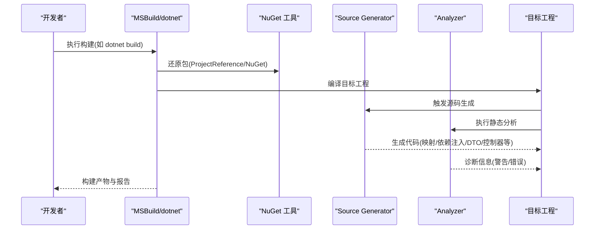
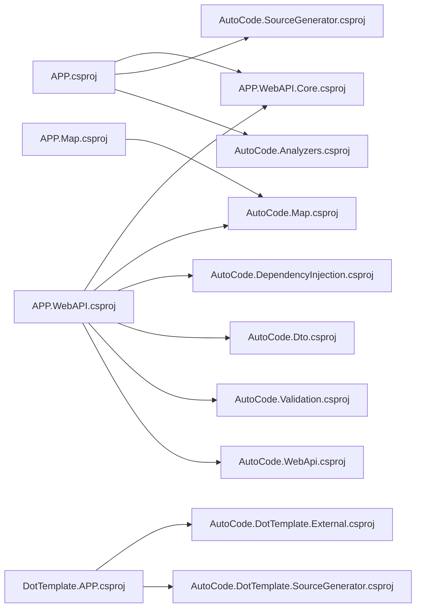

# MSBuild配置支持

<cite>
**本文引用的文件**   
- [AutoCode.sln](file://src/AutoCode.sln)
- [APP.csproj](file://src/APP/APP.csproj)
- [APP.Map.csproj](file://src/APP.Map/APP.Map.csproj)
- [APP.WebAPI.csproj](file://src/APP.WebAPI/APP.WebAPI.csproj)
- [APP.WebAPI.Core.csproj](file://src/APP.WebAPI.Core/APP.WebAPI.Core.csproj)
- [AutoCode.Analyzers.csproj](file://src/AutoCode.Analyzers/AutoCode.Analyzers.csproj)
- [AutoCode.Cli.csproj](file://src/AutoCode.Cli/AutoCode.Cli.csproj)
- [AutoCode.Crud.csproj](file://src/AutoCode.Crud/AutoCode.Crud.csproj)
- [AutoCode.DependencyInjection.csproj](file://src/AutoCode.DependencyInjection/AutoCode.DependencyInjection.csproj)
- [AutoCode.Dto.csproj](file://src/AutoCode.Dto/AutoCode.Dto.csproj)
- [AutoCode.SourceGenerator.Extensions.csproj](file://src/AutoCode.Extensions.SourceGenerator/AutoCode.SourceGenerator.Extensions.csproj)
- [AutoCode.Logging.csproj](file://src/AutoCode.Logging/AutoCode.Logging.csproj)
- [AutoCode.Map.csproj](file://src/AutoCode.Map/AutoCode.Map.csproj)
- [AutoCode.MapDebug.csproj](file://src/AutoCode.MapDebug/AutoCode.MapDebug.csproj)
- [AutoCode.Model.csproj](file://src/AutoCode.Model/AutoCode.Model.csproj)
- [AutoCode.Testing.csproj](file://src/AutoCode.Testing/AutoCode.Testing.csproj)
- [AutoCode.Validation.csproj](file://src/AutoCode.Validation/AutoCode.Validation.csproj)
- [AutoCode.WebApi.csproj](file://src/AutoCode.WebApi/AutoCode.WebApi.csproj)
- [AutoCode.DotTemplate.External.csproj](file://src/AutoCode.XmlTemplate.External/AutoCode.DotTemplate.External.csproj)
- [AutoCode.DotTemplate.SourceGenerator.csproj](file://src/AutoCode.XmlTemplate.SourceGenerator/AutoCode.DotTemplate.SourceGenerator.csproj)
- [AutoCode.SourceGenerator.csproj](file://src/AutoCodeGenerator/AutoCode.SourceGenerator.csproj)
- [DotTemplate.APP.csproj](file://src/DotTemplate.APP/DotTemplate.APP.csproj)
- [Models.csproj](file://src/Models/Models.csproj)
- [ci.yml](file://.github/workflows/ci.yml)
</cite>

## 目录
1. [简介](#简介)
2. [项目结构](#项目结构)
3. [核心组件](#核心组件)
4. [架构总览](#架构总览)
5. [详细组件分析](#详细组件分析)
6. [依赖关系分析](#依赖关系分析)
7. [性能考虑](#性能考虑)
8. [故障排查指南](#故障排查指南)
9. [结论](#结论)
10. [附录](#附录)

## 简介
本文件聚焦于 AutoCode 项目的 MSBuild 配置支持，系统性梳理解决方案、各 .csproj 工程与包引用、Source Generator 与 Analyzer 的集成方式、NuGet 工具链与 CI 流水线中的构建行为。文档旨在帮助开发者理解如何通过 MSBuild 正确启用代码生成、静态分析与模板渲染能力，并在多工程环境中保持可维护性与一致性。

## 项目结构
该仓库采用“按功能域划分”的多工程结构，包含：
- 应用层工程（APP、APP.Map、APP.WebAPI）
- 核心库与扩展（APP.WebAPI.Core、AutoCode.* 系列库）
- Source Generator 与 Analyzer 工程（AutoCode.SourceGenerator、AutoCode.Analyzers、AutoCode.DotTemplate.SourceGenerator 等）
- 工具与测试（AutoCode.Cli、AutoCode.Testing、AutoCode.Tests）
- 模板与外部依赖（AutoCode.XmlTemplate.External、DotTemplate.APP）
- 解决方案与 CI（AutoCode.sln、.github/workflows/ci.yml）

```mermaid
graph TB
subgraph "解决方案"
SLN["AutoCode.sln"]
end
subgraph "应用工程"
APP["APP.csproj"]
MAP["APP.Map.csproj"]
WEBAPI["APP.WebAPI.csproj"]
CORE["APP.WebAPI.Core.csproj"]
MODELS["Models.csproj"]
end
subgraph "代码生成与分析"
GEN["AutoCode.SourceGenerator.csproj"]
ANA["AutoCode.Analyzers.csproj"]
DOTGEN["AutoCode.DotTemplate.SourceGenerator.csproj"]
EXT["AutoCode.DotTemplate.External.csproj"]
MAPGEN["AutoCode.Map.csproj"]
DI["AutoCode.DependencyInjection.csproj"]
DTO["AutoCode.Dto.csproj"]
CRUD["AutoCode.Crud.csproj"]
LOG["AutoCode.Logging.csproj"]
VAL["AutoCode.Validation.csproj"]
WEBAPIGEN["AutoCode.WebApi.csproj"]
DEBUG["AutoCode.MapDebug.csproj"]
end
subgraph "工具与测试"
CLI["AutoCode.Cli.csproj"]
TESTLIB["AutoCode.Testing.csproj"]
TESTS["AutoCode.Tests.csproj"]
end
subgraph "模板示例"
DOTAPP["DotTemplate.APP.csproj"]
end
SLN --> APP
SLN --> MAP
SLN --> WEBAPI
SLN --> CORE
SLN --> GEN
SLN --> ANA
SLN --> DOTGEN
SLN --> EXT
SLN --> MAPGEN
SLN --> DI
SLN --> DTO
SLN --> CRUD
SLN --> LOG
SLN --> VAL
SLN --> WEBAPIGEN
SLN --> DEBUG
SLN --> CLI
SLN --> TESTLIB
SLN --> TESTS
SLN --> DOTAPP
SLN --> MODELS
```

图表来源
- [AutoCode.sln](file://src/AutoCode.sln)

章节来源
- [AutoCode.sln](file://src/AutoCode.sln)

## 核心组件
- 解决方案与工程组织：通过 AutoCode.sln 统一编排所有 .csproj，便于一次性构建、测试与发布。
- Source Generator 集成：在目标工程中引用对应的 Source Generator 工程或 NuGet 包，使编译期自动生成代码（如映射、依赖注入、DTO、控制器、验证器等）。
- Analyzer 集成：通过 Analyzer 工程或 NuGet 包提供静态分析规则，辅助发现接口分歧、命名约定违规等问题。
- 模板引擎：基于 doT.js 的模板系统，配合 Source Generator 将数据模型转换为 C# 代码。
- 工具与测试：CLI 用于初始化与安装；Testing 库为单元测试提供断言与辅助方法；Tests 覆盖关键生成器逻辑。
- CI 流水线：GitHub Actions 定义构建、测试与打包流程，确保每次提交都经过一致的 MSBuild 构建。

章节来源
- [ci.yml](file://.github/workflows/ci.yml)

## 架构总览
MSBuild 在该项目中承担以下职责：
- 解析 .sln 并确定工程依赖拓扑
- 执行 .csproj 中定义的 Target、Property、PackageReference、ProjectReference
- 驱动 Roslyn Source Generator 与 Analyzer 在编译阶段运行
- 调用 NuGet 工具进行包还原与打包
- 在 CI 中执行 dotnet build/test/pack 命令

图表来源
- [ci.yml](file://.github/workflows/ci.yml)

## 详细组件分析

### 解决方案与工程引用
- 解决方案文件集中管理所有工程，保证构建顺序与依赖关系清晰。
- 工程间通过 ProjectReference 引用，避免运行时耦合，同时允许 MSBuild 并行构建。
- 典型模式：应用工程引用 Core 与各类 Generator 输出（以包或工程形式），从而在编译期获得增强能力。

章节来源
- [AutoCode.sln](file://src/AutoCode.sln)

### Source Generator 集成（AutoCode.SourceGenerator）
- 作为独立的 Source Generator 工程，提供通用代码生成能力。
- 目标工程通过引用该工程或其 NuGet 包，即可在编译时自动注入所需代码。
- 常见用途：基础类型转换、属性拷贝、通用模板渲染等。

章节来源
- [AutoCode.SourceGenerator.csproj](file://src/AutoCodeGenerator/AutoCode.SourceGenerator.csproj)

### 映射生成（AutoCode.Map）
- 专注于对象映射的代码生成，减少手写映射逻辑。
- 通过 Attribute 或配置驱动，生成高效映射实现。
- 与 MSBuild 集成后，可在增量编译中快速更新映射代码。

章节来源
- [AutoCode.Map.csproj](file://src/AutoCode.Map/AutoCode.Map.csproj)

### 依赖注入生成（AutoCode.DependencyInjection）
- 根据约定或特性扫描，自动生成容器注册代码。
- 降低手动注册成本，提升可维护性。
- 与 MSBuild 结合，确保容器注册与业务代码同步更新。

章节来源
- [AutoCode.DependencyInjection.csproj](file://src/AutoCode.DependencyInjection/AutoCode.DependencyInjection.csproj)

### DTO 生成（AutoCode.Dto）
- 从领域模型或 API 契约自动生成 DTO 类。
- 支持字段过滤、命名策略与版本兼容。
- 在 WebAPI 场景中显著减少样板代码。

章节来源
- [AutoCode.Dto.csproj](file://src/AutoCode.Dto/AutoCode.Dto.csproj)

### CRUD 生成（AutoCode.Crud）
- 基于实体模型自动生成增删改查相关代码。
- 与 ORM 或仓储模式配合，简化数据访问层开发。

章节来源
- [AutoCode.Crud.csproj](file://src/AutoCode.Crud/AutoCode.Crud.csproj)

### 日志装饰器生成（AutoCode.Logging）
- 自动生成日志记录装饰器或包装器。
- 统一日志格式与上下文注入，提升可观测性。

章节来源
- [AutoCode.Logging.csproj](file://src/AutoCode.Logging/AutoCode.Logging.csproj)

### 验证生成（AutoCode.Validation）
- 根据模型属性自动生成验证逻辑。
- 与 ASP.NET Core 验证管道无缝集成。

章节来源
- [AutoCode.Validation.csproj](file://src/AutoCode.Validation/AutoCode.Validation.csproj)

### WebAPI 控制器生成（AutoCode.WebApi）
- 从路由或模型自动生成控制器骨架。
- 支持参数绑定、响应封装与异常处理。

章节来源
- [AutoCode.WebApi.csproj](file://src/AutoCode.WebApi/AutoCode.WebApi.csproj)

### 模板引擎（AutoCode.DotTemplate.SourceGenerator 与 AutoCode.DotTemplate.External）
- 使用 doT.js 模板语法，将数据模型渲染为 C# 代码。
- External 工程提供运行时辅助（JSON/模板工具），SourceGenerator 工程负责编译期生成。
- 适用于复杂代码生成场景，如脚手架、迁移脚本、配置文件等。

章节来源
- [AutoCode.DotTemplate.SourceGenerator.csproj](file://src/AutoCode.XmlTemplate.SourceGenerator/AutoCode.DotTemplate.SourceGenerator.csproj)
- [AutoCode.DotTemplate.External.csproj](file://src/AutoCode.XmlTemplate.External/AutoCode.DotTemplate.External.csproj)

### 调试与示例（AutoCode.MapDebug 与 DotTemplate.APP）
- MapDebug 提供映射生成的调试能力，便于定位问题。
- DotTemplate.APP 展示模板引擎的使用方式与最佳实践。

章节来源
- [AutoCode.MapDebug.csproj](file://src/AutoCode.MapDebug/AutoCode.MapDebug.csproj)
- [DotTemplate.APP.csproj](file://src/DotTemplate.APP/DotTemplate.APP.csproj)

### 分析器（AutoCode.Analyzers）
- 提供静态分析规则，检查接口一致性、命名规范、未使用的忽略标记等。
- 在 MSBuild 编译阶段运行，即时反馈问题。

章节来源
- [AutoCode.Analyzers.csproj](file://src/AutoCode.Analyzers/AutoCode.Analyzers.csproj)

### CLI 工具（AutoCode.Cli）
- 提供命令行工具，用于初始化项目、安装模板、生成脚手架等。
- 与 MSBuild 互补，提升开发效率。

章节来源
- [AutoCode.Cli.csproj](file://src/AutoCode.Cli/AutoCode.Cli.csproj)

### 测试基础设施（AutoCode.Testing 与 AutoCode.Tests）
- Testing 库封装常用断言与辅助方法。
- Tests 工程覆盖核心生成器与分析器的行为，保障质量。

章节来源
- [AutoCode.Testing.csproj](file://src/AutoCode.Testing/AutoCode.Testing.csproj)
- [AutoCode.Tests.csproj](file://src/AutoCode.Tests/AutoCode.Tests.csproj)

### 应用工程（APP、APP.Map、APP.WebAPI、APP.WebAPI.Core、Models）
- APP：演示入口与基础用法。
- APP.Map：映射示例工程。
- APP.WebAPI：WebAPI 示例，集成依赖注入、控制器、DTO、验证等。
- APP.WebAPI.Core：核心应用逻辑与扩展点。
- Models：共享模型定义。

章节来源
- [APP.csproj](file://src/APP/APP.csproj)
- [APP.Map.csproj](file://src/APP.Map/APP.Map.csproj)
- [APP.WebAPI.csproj](file://src/APP.WebAPI/APP.WebAPI.csproj)
- [APP.WebAPI.Core.csproj](file://src/APP.WebAPI.Core/APP.WebAPI.Core.csproj)
- [Models.csproj](file://src/Models/Models.csproj)

## 依赖关系分析
- 工程内聚性：每个 .csproj 聚焦单一职责，便于独立构建与测试。
- 依赖方向：应用工程依赖 Core 与各类 Generator 输出；Generator 之间尽量解耦，通过公共 Model 或约定通信。
- 外部依赖：NuGet 包用于第三方库与工具；ProjectReference 用于内部工程复用。
- 构建顺序：MSBuild 依据 .sln 与 ProjectReference 自动推导构建顺序，支持并行构建以提升速度。

图表来源
- [AutoCode.sln](file://src/AutoCode.sln)

章节来源
- [AutoCode.sln](file://src/AutoCode.sln)

## 性能考虑
- 增量编译：Source Generator 与 Analyzer 应充分利用增量编译，避免全量重建。
- 并行构建：合理拆分工程，利用 MSBuild 并行能力缩短构建时间。
- 包还原缓存：CI 中缓存 NuGet 包以减少网络开销。
- 生成代码体积控制：按需启用生成器，避免不必要的代码膨胀。

[本节为通用指导，不直接分析具体文件]

## 故障排查指南
- 构建失败：检查 .csproj 中的 PackageReference 与 ProjectReference 是否正确；确认 NuGet 源可达。
- 生成代码缺失：确认目标工程已引用对应 Source Generator；检查生成器配置与特性是否生效。
- 分析器误报：查看诊断 ID 与规则说明；必要时调整项目设置或忽略特定规则。
- 模板渲染异常：检查模板语法与数据模型字段是否匹配；参考 DotTemplate.APP 示例。
- CI 构建不一致：确保本地与 CI 的 SDK 版本一致；清理中间产物后重试。

章节来源
- [ci.yml](file://.github/workflows/ci.yml)

## 结论
AutoCode 项目通过 MSBuild 将 Source Generator、Analyzer、模板引擎与 CLI 工具有机整合，形成高效的代码生成与分析体系。合理的工程拆分与依赖管理使得构建过程稳定、可扩展且易于维护。建议在团队内推广统一的 MSBuild 配置与最佳实践，确保多工程环境下的协作效率与质量。

[本节为总结性内容，不直接分析具体文件]

## 附录
- 建议的 MSBuild 配置要点：
  - 明确指定 TargetFramework 与 LangVersion
  - 合理使用 <GenerateAssemblyInfo>、<EnableDefaultCompileItems>
  - 通过 <ItemGroup> 管理 PackageReference 与 ProjectReference
  - 在 CI 中使用 dotnet restore/build/test/pack 标准化流程
  - 启用 Analyzers 与 Code Analysis 以提升代码质量

[本节为补充信息，不直接分析具体文件]