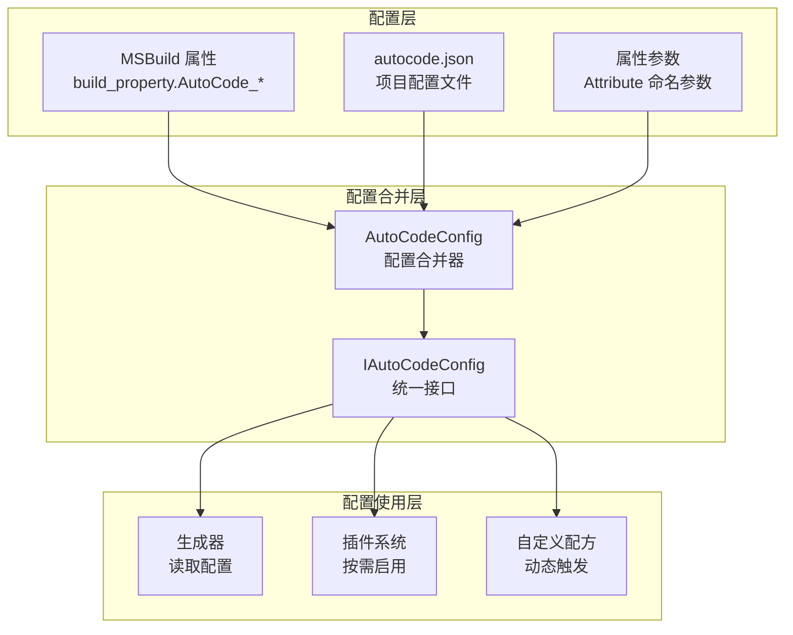
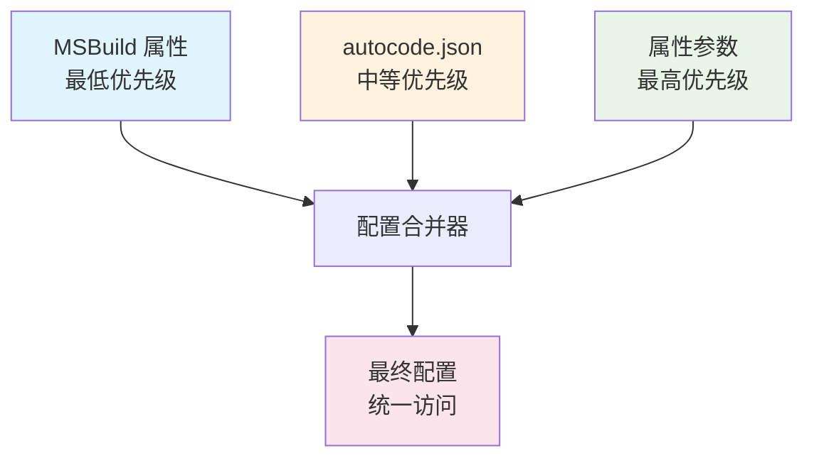

# 生成器配置

<cite>
**本文引用的文件**   
- [AutoCodeConfig.cs](file://src/AutoCode.Engine/Config/AutoCodeConfig.cs)
- [AutoCodeOptions.cs](file://src/AutoCode.Model/AutoCodeOptions.cs)
- [autocode.json](file://autocode.json)
- [AutoEntityAttribute.cs](file://src/AutoCode.Model/AutoEntityAttribute.cs)
- [AutoControllerAttribute.cs](file://src/AutoCode.Model/AutoControllerAttribute.cs)
- [AutoDTOAttribute.cs](file://src/AutoCode.Model/AutoDTOAttribute.cs)
- [AutoLogAttribute.cs](file://src/AutoCode.Model/AutoLogAttribute.cs)
- [CustomGenerateAttribute.cs](file://src/AutoCode.Model/CustomGenerateAttribute.cs)
- [AutoInterfaceAttribute.cs](file://src/AutoCode.Model/InterfaceAttribute/AutoInterfaceAttribute.cs)
</cite>

## 更新摘要
**变更内容**   
- 新增完整的三层配置系统文档，涵盖 MSBuild 属性、autocode.json 和属性参数的详细配置选项
- 新增配置优先级说明和合并机制
- 新增各配置层的详细说明和使用示例
- 更新架构图以反映新的三层配置体系

## 目录
1. [简介](#简介)
2. [三层配置系统架构](#三层配置系统架构)
3. [MSBuild 属性配置](#msbuild-属性配置)
4. [autocode.json 配置文件](#autocodejson-配置文件)
5. [属性参数配置](#属性参数配置)
6. [配置优先级与合并机制](#配置优先级与合并机制)
7. [配置验证与错误处理](#配置验证与错误处理)
8. [性能考虑](#性能考虑)
9. [故障排查指南](#故障排查指南)
10. [结论](#结论)
11. [附录：配置示例与最佳实践](#附录配置示例与最佳实践)

## 简介
本文件面向使用 AutoCode 的开发者，系统化阐述"生成器配置"的完整体系。重点覆盖三层配置系统的核心概念：
- **MSBuild 属性配置**：项目级别的构建时配置
- **autocode.json 配置文件**：项目级的 JSON 配置文件
- **属性参数配置**：代码中的特性参数配置

文档同时提供配置验证、错误处理与性能调优建议，并提供可操作的配置示例与边界场景处理方法。

## 三层配置系统架构
AutoCode 实现了统一的三层配置系统，通过 `IAutoCodeConfig` 接口提供一致的访问方式：



**图表来源** 
- [AutoCodeConfig.cs:55-122](file://src/AutoCode.Engine/Config/AutoCodeConfig.cs#L55-L122)
- [AutoCodeConfig.cs:10-35](file://src/AutoCode.Engine/Config/AutoCodeConfig.cs#L10-L35)

**章节来源**
- [AutoCodeConfig.cs:55-122](file://src/AutoCode.Engine/Config/AutoCodeConfig.cs#L55-L122)

## MSBuild 属性配置
MSBuild 属性配置是项目级别的构建时配置，通过 `<PropertyGroup>` 定义：

### 支持的 MSBuild 属性
| 属性名 | 类型 | 默认值 | 说明 |
|--------|------|--------|------|
| `AutoCode_InterfacePrefix` | string | "I" | 接口名前缀 |
| `AutoCode_GenerateNullable` | bool | true | 是否生成可空注解 |
| `AutoCode_MapMethodName` | string | "CopyTo" | 映射方法名 |
| `AutoCode_TemplateSuffix` | string | ".generated.cs" | 模板输出文件后缀 |
| `AutoCode_EnableDiagnostics` | bool | true | 是否启用分析器诊断 |
| `AutoCode_ConventionMode` | string | "" | 约定模式 |
| `AutoCode_OutputMode` | string | "" | 输出模式 |
| `AutoCode_Namespace` | string | "" | 命名空间 |

### 配置示例
```xml
<PropertyGroup>
  <!-- 接口前缀配置 -->
  <AutoCode_InterfacePrefix>I</AutoCode_InterfacePrefix>
  
  <!-- 生成可空注解 -->
  <AutoCode_GenerateNullable>true</AutoCode_GenerateNullable>
  
  <!-- 自定义映射方法名 -->
  <AutoCode_MapMethodName>MapTo</AutoCode_MapMethodName>
  
  <!-- 禁用诊断（生产环境） -->
  <AutoCode_EnableDiagnostics>false</AutoCode_EnableDiagnostics>
</PropertyGroup>
```

**章节来源**
- [AutoCodeOptions.cs:16-47](file://src/AutoCode.Model/AutoCodeOptions.cs#L16-L47)
- [AutoCodeConfig.cs:73-95](file://src/AutoCode.Engine/Config/AutoCodeConfig.cs#L73-L95)

## autocode.json 配置文件
autocode.json 是项目级的 JSON 配置文件，提供丰富的配置选项：

### 核心配置节
| 配置节 | 说明 | 主要选项 |
|--------|------|----------|
| `conventions` | 约定配置 | servicePattern, repositoryPattern, dtoSuffix |
| `mapper` | 映射器配置 | methodName, nullHandling, collectionMapping |
| `dto` | DTO 生成配置 | useRecord, excludeAuditFields |
| `webapi` | Web API 配置 | responseWrapper, pagination, versioning |
| `validation` | 验证配置 | generateFluentStyle, enableAsyncValidation |
| `dependencyInjection` | 依赖注入配置 | namespace, methodName, modulePerAssembly |
| `cascade` | 级联生成配置 | 控制各组件生成开关 |
| `logging` | 日志配置 | structuredLogging, includeOpenTelemetry, maskSensitive |
| `intercept` | 拦截器配置 | defaultInterceptors, cacheDurationSeconds |
| `plugins` | 插件配置 | 各插件启用状态 |
| `customGenerators` | 自定义生成器 | 自定义配方定义 |

### 配置示例
```json
{
  "conventions": {
    "servicePattern": "*Service",
    "repositoryPattern": "*Repository",
    "dtoSuffix": "Dto",
    "autoDetectServices": true,
    "autoDetectDtos": true,
    "autoDetectRepositories": true,
    "autoDetectControllers": false
  },
  "mapper": {
    "methodName": "MapTo",
    "nullHandling": "Skip",
    "collectionMapping": "DeepCopy",
    "generateProjection": false
  },
  "cascade": {
    "dto": true,
    "mapper": true,
    "validation": true,
    "repository": true,
    "service": true,
    "controller": true,
    "tests": false,
    "logging": false
  }
}
```

**章节来源**
- [autocode.json:1-105](file://autocode.json#L1-L105)
- [AutoCodeConfig.cs:97-106](file://src/AutoCode.Engine/Config/AutoCodeConfig.cs#L97-L106)

## 属性参数配置
属性参数配置是在代码中通过特性参数进行的细粒度配置：

### 实体级配置
```csharp
[AutoEntity(
    GenerateDto = true,
    GenerateMapper = true,
    GenerateValidation = true,
    GenerateRepository = true,
    GenerateService = true,
    GenerateController = true,
    GenerateTests = false,
    GenerateLogging = false,
    KeyProperty = "Id",
    RoutePrefix = "api/products"
)]
public class Product { }
```

### Controller 配置
```csharp
[AutoController(
    RoutePrefix = "api/users",
    ApiVersion = "v1"
)]
public class UserService : IUserService { }
```

### DTO 配置
```csharp
[AutoDTO(typeof(UserEntity), 
    Include = new[] { "Id", "Name", "Email" },
    Exclude = new[] { "Password" },
    Suffix = "Dto"
)]
public partial class UserDto { }
```

### 日志配置
```csharp
[AutoLog(
    LogParameters = true,
    LogElapsed = true
)]
public class OrderService { }
```

### 自定义生成器触发
```csharp
[CustomGenerate("auditService")]
public class AuditService { }

[CustomGenerate("repositoryPattern")]
public class UserRepository { }
```

**章节来源**
- [AutoEntityAttribute.cs:21-52](file://src/AutoCode.Model/AutoEntityAttribute.cs#L21-L52)
- [AutoControllerAttribute.cs:20-31](file://src/AutoCode.Model/AutoControllerAttribute.cs#L20-L31)
- [AutoDTOAttribute.cs:16-42](file://src/AutoCode.Model/AutoDTOAttribute.cs#L16-L42)
- [AutoLogAttribute.cs:10-21](file://src/AutoCode.Model/AutoLogAttribute.cs#L10-L21)
- [CustomGenerateAttribute.cs:20-30](file://src/AutoCode.Model/CustomGenerateAttribute.cs#L20-L30)

## 配置优先级与合并机制
AutoCode 实现了三层配置的优先级合并机制：

### 优先级顺序
1. **属性参数配置** (最高优先级) - Attribute 命名参数
2. **autocode.json 配置** (中等优先级) - 项目配置文件
3. **MSBuild 属性配置** (最低优先级) - 全局构建配置

### 合并策略
- 后加载的配置会覆盖先加载的配置
- 支持嵌套配置节的合并
- 数组类型配置会进行合并而非替换



**图表来源** 
- [AutoCodeConfig.cs:7-9](file://src/AutoCode.Engine/Config/AutoCodeConfig.cs#L7-L9)
- [AutoCodeConfig.cs:111-122](file://src/AutoCode.Engine/Config/AutoCodeConfig.cs#L111-L122)

**章节来源**
- [AutoCodeConfig.cs:7-9](file://src/AutoCode.Engine/Config/AutoCodeConfig.cs#L7-L9)
- [AutoCodeConfig.cs:111-122](file://src/AutoCode.Engine/Config/AutoCodeConfig.cs#L111-L122)

## 配置验证与错误处理
配置系统在加载和合并过程中提供完善的验证和错误处理：

### 配置验证规则
- **类型安全**：自动类型转换和验证
- **必填字段检查**：关键配置项的完整性验证
- **值范围验证**：数值和枚举值的合法性检查
- **依赖关系验证**：相关配置项之间的逻辑一致性

### 错误处理机制
- **编译期诊断**：在编译时发现配置错误
- **运行时降级**：配置缺失时使用默认值
- **详细错误信息**：提供具体的错误位置和修复建议

### 调试支持
- **配置快照**：记录最终合并后的配置
- **来源追踪**：标识每个配置项的来源层
- **差异对比**：显示不同配置层之间的差异

## 性能考虑
三层配置系统在设计时充分考虑了性能优化：

### 编译期优化
- **静态配置解析**：MSBuild 属性在编译时解析
- **JSON 缓存**：autocode.json 文件内容缓存
- **增量构建**：仅重新生成受配置变更影响的代码

### 运行时优化
- **配置懒加载**：按需加载配置节
- **内存优化**：共享配置实例避免重复创建
- **并发安全**：多线程环境下的配置访问安全

### 最佳实践
- **合理分层**：将通用配置放在 MSBuild，项目特定配置放在 JSON，类级别配置放在属性
- **避免过度配置**：只配置必要的选项，减少配置复杂度
- **定期审查**：定期检查配置的有效性和必要性

## 故障排查指南
### 常见问题及解决方案

#### 配置不生效
**问题**：配置的属性没有按预期工作
**排查步骤**：
1. 检查配置优先级是否正确
2. 确认配置语法格式正确
3. 查看生成的中间文件确认配置被正确解析

#### 配置冲突
**问题**：多层配置之间存在冲突
**解决方案**：
1. 使用配置来源追踪功能确定冲突位置
2. 调整配置层级，避免不必要的覆盖
3. 使用更具体的配置项替代全局配置

#### 性能问题
**问题**：配置导致构建或运行性能下降
**解决方案**：
1. 减少复杂的嵌套配置
2. 禁用不必要的插件和特性
3. 使用条件编译优化配置

### 调试工具
- **配置导出**：导出最终合并的配置用于分析
- **配置验证器**：预检查配置的正确性
- **性能分析器**：分析配置对构建性能的影响

## 结论
AutoCode 的三层配置系统提供了灵活、强大且易于维护的配置能力。通过合理的配置分层和优先级管理，开发者可以在不同粒度上精确控制代码生成行为。建议遵循以下原则：

1. **最小化原则**：只在必要时进行配置
2. **集中化原则**：将相关配置集中在合适的层级
3. **文档化原则**：为复杂配置提供清晰的注释和文档
4. **版本化原则**：将重要配置纳入版本控制

## 附录：配置示例与最佳实践

### 开发环境配置示例
```xml
<!-- .csproj 中的开发环境配置 -->
<PropertyGroup Condition="'$(Configuration)' == 'Debug'">
  <AutoCode_EnableDiagnostics>true</AutoCode_EnableDiagnostics>
  <AutoCode_GenerateTests>true</AutoCode_GenerateTests>
</PropertyGroup>
```

### 生产环境配置示例
```json
// autocode.json 中的生产环境配置
{
  "cascade": {
    "tests": false,
    "logging": true
  },
  "plugins": {
    "testing": { "enabled": false }
  }
}
```

### 最佳实践清单
- ✅ 使用 MSBuild 属性配置跨项目的通用设置
- ✅ 使用 autocode.json 配置项目特定的生成行为
- ✅ 使用属性参数进行类级别的精细控制
- ✅ 利用配置优先级实现环境特定的配置
- ✅ 定期审查和优化配置结构
- ✅ 为复杂配置添加详细的注释说明
- ✅ 使用配置验证确保配置的正确性
- ✅ 监控配置对构建性能的影响

**章节来源**
- [AutoCodeConfig.cs:124-131](file://src/AutoCode.Engine/Config/AutoCodeConfig.cs#L124-L131)
- [AutoCodeOptions.cs:7-15](file://src/AutoCode.Model/AutoCodeOptions.cs#L7-L15)