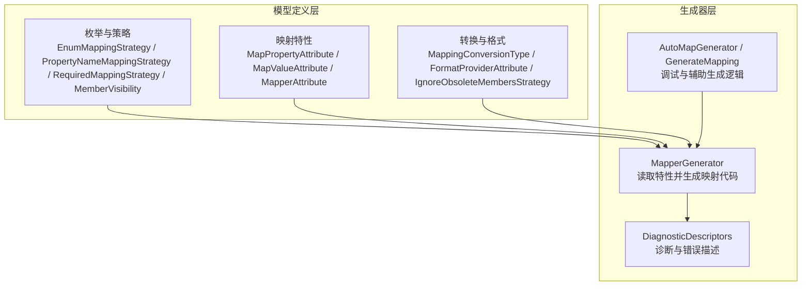
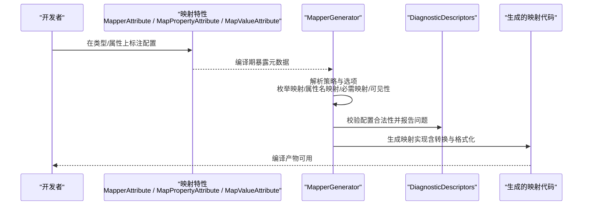
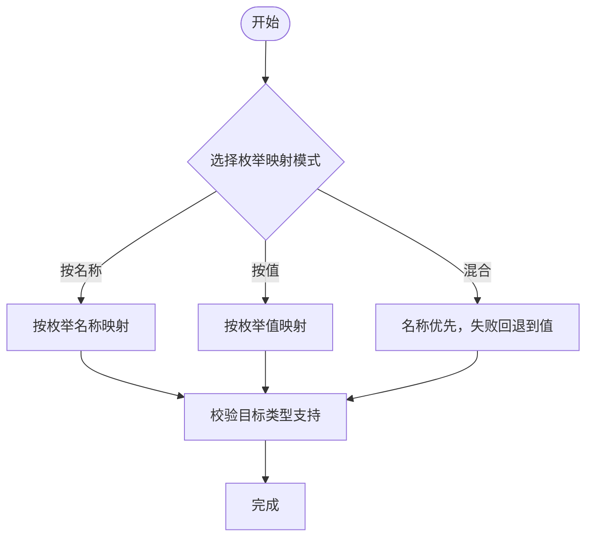
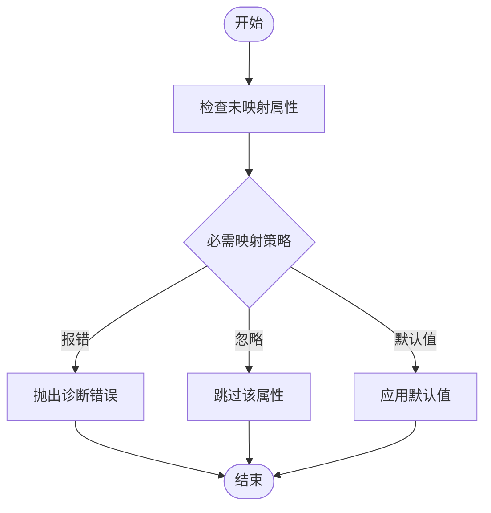
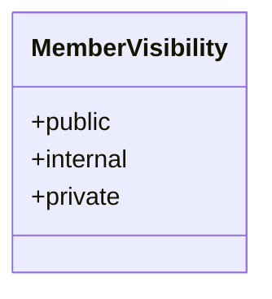
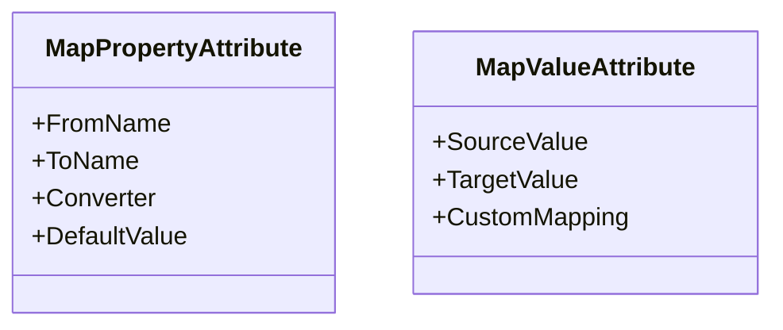
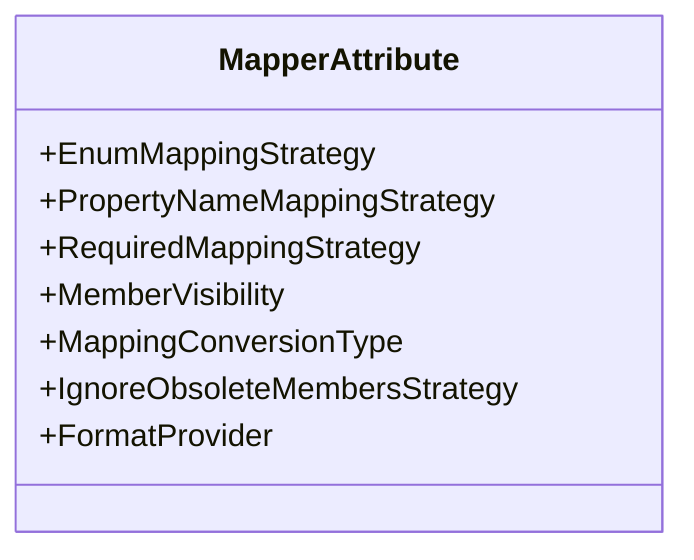
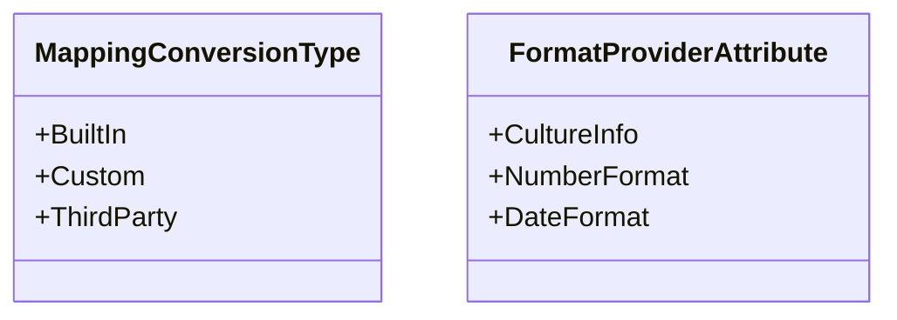
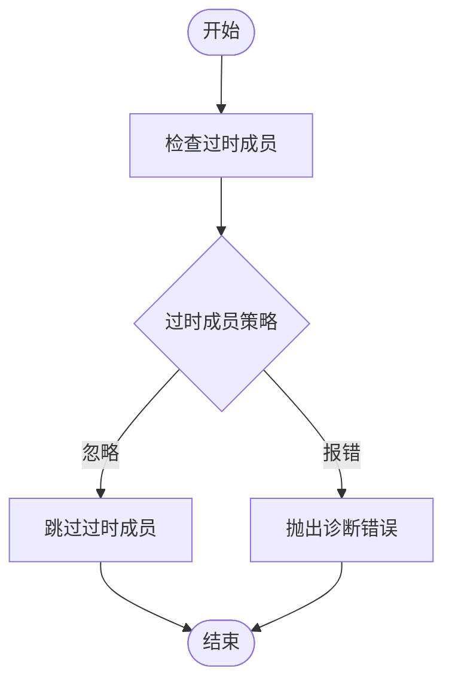
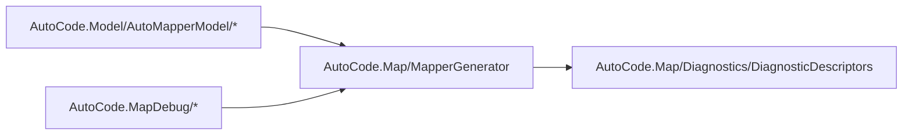

# 生成器配置

<cite>
**本文引用的文件**   
- [EnumMappingStrategy.cs](file://src/AutoCode.Model/AutoMapperModel/EnumMappingStrategy.cs)
- [PropertyNameMappingStrategy.cs](file://src/AutoCode.Model/AutoMapperModel/PropertyNameMappingStrategy.cs)
- [RequiredMappingStrategy.cs](file://src/AutoCode.Model/AutoMapperModel/RequiredMappingStrategy.cs)
- [MemberVisibility.cs](file://src/AutoCode.Model/AutoMapperModel/MemberVisibility.cs)
- [MapPropertyAttribute.cs](file://src/AutoCode.Model/AutoMapperModel/MapPropertyAttribute.cs)
- [MapValueAttribute.cs](file://src/AutoCode.Model/AutoMapperModel/MapValueAttribute.cs)
- [MapperAttribute.cs](file://src/AutoCode.Model/AutoMapperModel/MapperAttribute.cs)
- [MappingConversionType.cs](file://src/AutoCode.Model/AutoMapperModel/MappingConversionType.cs)
- [IgnoreObsoleteMembersStrategy.cs](file://src/AutoCode.Model/AutoMapperModel/IgnoreObsoleteMembersStrategy.cs)
- [FormatProviderAttribute.cs](file://src/AutoCode.Model/AutoMapperModel/FormatProviderAttribute.cs)
- [Diagnostics.cs](file://src/AutoCode.Map/Diagnostics/DiagnosticDescriptors.cs)
- [MapperGenerator.cs](file://src/AutoCode.Map/MapperGenerator.cs)
- [AutoMapGenerator.cs](file://src/AutoCode.MapDebug/AutoMapGenerator.cs)
- [GenerateMapping.cs](file://src/AutoCode.MapDebug/GenerateMapping.cs)
</cite>

## 目录
1. [简介](#简介)
2. [项目结构](#项目结构)
3. [核心组件](#核心组件)
4. [架构总览](#架构总览)
5. [详细组件分析](#详细组件分析)
6. [依赖关系分析](#依赖关系分析)
7. [性能考虑](#性能考虑)
8. [故障排查指南](#故障排查指南)
9. [结论](#结论)
10. [附录：配置示例与最佳实践](#附录配置示例与最佳实践)

## 简介
本文件面向使用 AutoCode 映射生成器的开发者，系统化阐述“生成器配置”的完整体系。重点覆盖以下主题：
- 枚举映射策略（EnumMappingStrategy）
- 属性名称映射策略（PropertyNameMappingStrategy）
- 必需映射策略（RequiredMappingStrategy）
- 成员可见性设置（MemberVisibility）
- 属性级映射与值映射（MapPropertyAttribute、MapValueAttribute）
- 全局映射器配置（MapperAttribute）
- 转换类型控制（MappingConversionType）
- 过时成员处理（IgnoreObsoleteMembersStrategy）
- 格式化提供程序（FormatProviderAttribute）

文档同时给出配置验证、错误处理与性能调优建议，并提供可操作的配置示例与边界场景处理方法。

## 项目结构
与“生成器配置”直接相关的代码主要分布在模型定义层与映射生成器层：
- 模型定义层（AutoCode.Model/AutoMapperModel）：集中定义所有配置枚举、特性与策略类型
- 映射生成器层（AutoCode.Map、AutoCode.MapDebug）：读取特性与策略，执行代码生成与诊断

**图表来源** 
- [EnumMappingStrategy.cs](file://src/AutoCode.Model/AutoMapperModel/EnumMappingStrategy.cs)
- [PropertyNameMappingStrategy.cs](file://src/AutoCode.Model/AutoMapperModel/PropertyNameMappingStrategy.cs)
- [RequiredMappingStrategy.cs](file://src/AutoCode.Model/AutoMapperModel/RequiredMappingStrategy.cs)
- [MemberVisibility.cs](file://src/AutoCode.Model/AutoMapperModel/MemberVisibility.cs)
- [MapPropertyAttribute.cs](file://src/AutoCode.Model/AutoMapperModel/MapPropertyAttribute.cs)
- [MapValueAttribute.cs](file://src/AutoCode.Model/AutoMapperModel/MapValueAttribute.cs)
- [MapperAttribute.cs](file://src/AutoCode.Model/AutoMapperModel/MapperAttribute.cs)
- [MappingConversionType.cs](file://src/AutoCode.Model/AutoMapperModel/MappingConversionType.cs)
- [IgnoreObsoleteMembersStrategy.cs](file://src/AutoCode.Model/AutoMapperModel/IgnoreObsoleteMembersStrategy.cs)
- [FormatProviderAttribute.cs](file://src/AutoCode.Model/AutoMapperModel/FormatProviderAttribute.cs)
- [MapperGenerator.cs](file://src/AutoCode.Map/MapperGenerator.cs)
- [AutoMapGenerator.cs](file://src/AutoCode.MapDebug/AutoMapGenerator.cs)
- [GenerateMapping.cs](file://src/AutoCode.MapDebug/GenerateMapping.cs)
- [DiagnosticDescriptors.cs](file://src/AutoCode.Map/Diagnostics/DiagnosticDescriptors.cs)

**章节来源**
- [EnumMappingStrategy.cs](file://src/AutoCode.Model/AutoMapperModel/EnumMappingStrategy.cs)
- [PropertyNameMappingStrategy.cs](file://src/AutoCode.Model/AutoMapperModel/PropertyNameMappingStrategy.cs)
- [RequiredMappingStrategy.cs](file://src/AutoCode.Model/AutoMapperModel/RequiredMappingStrategy.cs)
- [MemberVisibility.cs](file://src/AutoCode.Model/AutoMapperModel/MemberVisibility.cs)
- [MapPropertyAttribute.cs](file://src/AutoCode.Model/AutoMapperModel/MapPropertyAttribute.cs)
- [MapValueAttribute.cs](file://src/AutoCode.Model/AutoMapperModel/MapValueAttribute.cs)
- [MapperAttribute.cs](file://src/AutoCode.Model/AutoMapperModel/MapperAttribute.cs)
- [MappingConversionType.cs](file://src/AutoCode.Model/AutoMapperModel/MappingConversionType.cs)
- [IgnoreObsoleteMembersStrategy.cs](file://src/AutoCode.Model/AutoMapperModel/IgnoreObsoleteMembersStrategy.cs)
- [FormatProviderAttribute.cs](file://src/AutoCode.Model/AutoMapperModel/FormatProviderAttribute.cs)
- [MapperGenerator.cs](file://src/AutoCode.Map/MapperGenerator.cs)
- [AutoMapGenerator.cs](file://src/AutoCode.MapDebug/AutoMapGenerator.cs)
- [GenerateMapping.cs](file://src/AutoCode.MapDebug/GenerateMapping.cs)
- [DiagnosticDescriptors.cs](file://src/AutoCode.Map/Diagnostics/DiagnosticDescriptors.cs)

## 核心组件
本节聚焦“生成器配置”的核心类型与职责：
- 枚举映射策略（EnumMappingStrategy）：决定枚举到字符串或数值类型的映射方式（如按名称、按值等）
- 属性名称映射策略（PropertyNameMappingStrategy）：决定源属性名到目标属性名的匹配规则（如严格匹配、忽略大小写、下划线转驼峰等）
- 必需映射策略（RequiredMappingStrategy）：控制未映射属性的行为（报错、忽略、默认值填充等）
- 成员可见性（MemberVisibility）：控制生成代码访问成员的可见性（public、internal 等）
- 属性级映射（MapPropertyAttribute）：对单个属性进行重命名、指定转换、设置默认值等
- 值映射（MapValueAttribute）：为特定值提供自定义映射或常量替换
- 全局映射器（MapperAttribute）：在类级别统一配置上述策略与行为
- 转换类型（MappingConversionType）：限定或扩展支持的转换类型（如内置、自定义、第三方库）
- 过时成员处理（IgnoreObsoleteMembersStrategy）：是否忽略标记为过时的成员
- 格式化提供程序（FormatProviderAttribute）：为日期、数字等类型提供自定义格式化规则

这些组件共同构成“声明式配置 + 生成器驱动”的模式，使映射行为高度可配置且易于维护。

**章节来源**
- [EnumMappingStrategy.cs](file://src/AutoCode.Model/AutoMapperModel/EnumMappingStrategy.cs)
- [PropertyNameMappingStrategy.cs](file://src/AutoCode.Model/AutoMapperModel/PropertyNameMappingStrategy.cs)
- [RequiredMappingStrategy.cs](file://src/AutoCode.Model/AutoMapperModel/RequiredMappingStrategy.cs)
- [MemberVisibility.cs](file://src/AutoCode.Model/AutoMapperModel/MemberVisibility.cs)
- [MapPropertyAttribute.cs](file://src/AutoCode.Model/AutoMapperModel/MapPropertyAttribute.cs)
- [MapValueAttribute.cs](file://src/AutoCode.Model/AutoMapperModel/MapValueAttribute.cs)
- [MapperAttribute.cs](file://src/AutoCode.Model/AutoMapperModel/MapperAttribute.cs)
- [MappingConversionType.cs](file://src/AutoCode.Model/AutoMapperModel/MappingConversionType.cs)
- [IgnoreObsoleteMembersStrategy.cs](file://src/AutoCode.Model/AutoMapperModel/IgnoreObsoleteMembersStrategy.cs)
- [FormatProviderAttribute.cs](file://src/AutoCode.Model/AutoMapperModel/FormatProviderAttribute.cs)

## 架构总览
下图展示了从“配置特性”到“生成器解析与输出”的整体流程：

**图表来源** 
- [MapperAttribute.cs](file://src/AutoCode.Model/AutoMapperModel/MapperAttribute.cs)
- [MapPropertyAttribute.cs](file://src/AutoCode.Model/AutoMapperModel/MapPropertyAttribute.cs)
- [MapValueAttribute.cs](file://src/AutoCode.Model/AutoMapperModel/MapValueAttribute.cs)
- [MapperGenerator.cs](file://src/AutoCode.Map/MapperGenerator.cs)
- [DiagnosticDescriptors.cs](file://src/AutoCode.Map/Diagnostics/DiagnosticDescriptors.cs)

## 详细组件分析

### 枚举映射策略（EnumMappingStrategy）
- 作用：定义枚举到目标类型（字符串、数值或其他枚举）的映射规则
- 常见选项：按名称映射、按值映射、混合模式（名称优先，失败回退到值）
- 默认值：通常采用“按名称映射”，保证可读性与稳定性
- 适用场景：
  - API 响应中需要稳定字符串标识时，选择“按名称”
  - 与数据库或旧系统交互需保持数值一致时，选择“按值”
- 边界情况：
  - 新增枚举值导致不兼容：建议在迁移期启用“混合模式”并逐步清理
  - 大小写差异：结合属性名映射策略统一处理

**图表来源** 
- [EnumMappingStrategy.cs](file://src/AutoCode.Model/AutoMapperModel/EnumMappingStrategy.cs)

**章节来源**
- [EnumMappingStrategy.cs](file://src/AutoCode.Model/AutoMapperModel/EnumMappingStrategy.cs)

### 属性名称映射策略（PropertyNameMappingStrategy）
- 作用：决定源属性名到目标属性名的匹配规则
- 常见选项：严格匹配、忽略大小写、下划线转驼峰、自定义规则
- 默认值：通常为“严格匹配”或“忽略大小写”，取决于团队规范
- 适用场景：
  - 前后端命名不一致（如 snake_case vs PascalCase）
  - 历史遗留字段名变更，需要平滑过渡
- 边界情况：
  - 多义缩写（ID、URL）在不同风格下的歧义，建议通过 MapPropertyAttribute 显式指定

**图表来源** 
- [PropertyNameMappingStrategy.cs](file://src/AutoCode.Model/AutoMapperModel/PropertyNameMappingStrategy.cs)

**章节来源**
- [PropertyNameMappingStrategy.cs](file://src/AutoCode.Model/AutoMapperModel/PropertyNameMappingStrategy.cs)

### 必需映射策略（RequiredMappingStrategy）
- 作用：控制未映射属性的处理方式
- 常见选项：报错（强制）、忽略（静默跳过）、默认值填充（根据类型或自定义）
- 默认值：推荐“报错”，确保映射完整性；在迁移阶段可临时改为“忽略”
- 适用场景：
  - 强一致性要求：开启“报错”
  - 渐进式重构：开启“忽略”并记录日志
- 边界情况：
  - 可选字段缺失：应允许默认值填充
  - 复杂对象为空：需判断是否为 null 或空集合

**图表来源** 
- [RequiredMappingStrategy.cs](file://src/AutoCode.Model/AutoMapperModel/RequiredMappingStrategy.cs)

**章节来源**
- [RequiredMappingStrategy.cs](file://src/AutoCode.Model/AutoMapperModel/RequiredMappingStrategy.cs)

### 成员可见性（MemberVisibility）
- 作用：控制生成代码访问成员的可见性（public、internal 等）
- 默认值：通常为 internal，避免污染公共 API；对外暴露时才提升为 public
- 适用场景：
  - 库内部使用：internal
  - 公开 API：public
- 边界情况：
  - 跨程序集访问时需确保可见性正确
  - 与框架约束冲突时，调整可见性或改用接口

**图表来源** 
- [MemberVisibility.cs](file://src/AutoCode.Model/AutoMapperModel/MemberVisibility.cs)

**章节来源**
- [MemberVisibility.cs](file://src/AutoCode.Model/AutoMapperModel/MemberVisibility.cs)

### 属性级映射（MapPropertyAttribute）与值映射（MapValueAttribute）
- MapPropertyAttribute：用于单个属性的重命名、指定转换、设置默认值、忽略映射等
- MapValueAttribute：为特定值提供自定义映射或常量替换
- 适用场景：
  - 个别字段特殊处理（如日期格式、单位换算）
  - 与外部系统约定不一致的值映射
- 边界情况：
  - 多个特性冲突时，优先级由生成器定义（通常属性级 > 全局）
  - 循环引用或自引用类型需谨慎处理

**图表来源** 
- [MapPropertyAttribute.cs](file://src/AutoCode.Model/AutoMapperModel/MapPropertyAttribute.cs)
- [MapValueAttribute.cs](file://src/AutoCode.Model/AutoMapperModel/MapValueAttribute.cs)

**章节来源**
- [MapPropertyAttribute.cs](file://src/AutoCode.Model/AutoMapperModel/MapPropertyAttribute.cs)
- [MapValueAttribute.cs](file://src/AutoCode.Model/AutoMapperModel/MapValueAttribute.cs)

### 全局映射器（MapperAttribute）
- 作用：在类级别统一配置枚举映射、属性名映射、必需映射、可见性等策略
- 适用场景：
  - 批量应用同一套映射规则
  - 快速切换不同环境的行为（开发/测试/生产）
- 边界情况：
  - 与属性级特性冲突时，以属性级为准
  - 过度集中配置可能导致难以定位问题，建议拆分模块

**图表来源** 
- [MapperAttribute.cs](file://src/AutoCode.Model/AutoMapperModel/MapperAttribute.cs)

**章节来源**
- [MapperAttribute.cs](file://src/AutoCode.Model/AutoMapperModel/MapperAttribute.cs)

### 转换类型（MappingConversionType）与格式化提供程序（FormatProviderAttribute）
- MappingConversionType：限制或扩展支持的转换类型（内置、自定义、第三方）
- FormatProviderAttribute：为日期、数字等类型提供自定义格式化规则
- 适用场景：
  - 集成第三方库（如 Newtonsoft、System.Text.Json）
  - 国际化与本地化需求
- 边界情况：
  - 自定义转换器需保证线程安全与性能
  - 格式化提供程序需处理异常输入

**图表来源** 
- [MappingConversionType.cs](file://src/AutoCode.Model/AutoMapperModel/MappingConversionType.cs)
- [FormatProviderAttribute.cs](file://src/AutoCode.Model/AutoMapperModel/FormatProviderAttribute.cs)

**章节来源**
- [MappingConversionType.cs](file://src/AutoCode.Model/AutoMapperModel/MappingConversionType.cs)
- [FormatProviderAttribute.cs](file://src/AutoCode.Model/AutoMapperModel/FormatProviderAttribute.cs)

### 过时成员处理（IgnoreObsoleteMembersStrategy）
- 作用：决定是否忽略标记为过时的成员
- 默认值：通常忽略，避免破坏现有代码
- 适用场景：
  - 渐进式废弃字段
  - 兼容旧版本数据结构
- 边界情况：
  - 需配合诊断工具提醒开发者更新

**图表来源** 
- [IgnoreObsoleteMembersStrategy.cs](file://src/AutoCode.Model/AutoMapperModel/IgnoreObsoleteMembersStrategy.cs)

**章节来源**
- [IgnoreObsoleteMembersStrategy.cs](file://src/AutoCode.Model/AutoMapperModel/IgnoreObsoleteMembersStrategy.cs)

## 依赖关系分析
生成器依赖模型定义中的配置类型，并在解析过程中产生诊断信息：

**图表来源** 
- [MapperGenerator.cs](file://src/AutoCode.Map/MapperGenerator.cs)
- [AutoMapGenerator.cs](file://src/AutoCode.MapDebug/AutoMapGenerator.cs)
- [GenerateMapping.cs](file://src/AutoCode.MapDebug/GenerateMapping.cs)
- [DiagnosticDescriptors.cs](file://src/AutoCode.Map/Diagnostics/DiagnosticDescriptors.cs)

**章节来源**
- [MapperGenerator.cs](file://src/AutoCode.Map/MapperGenerator.cs)
- [AutoMapGenerator.cs](file://src/AutoCode.MapDebug/AutoMapGenerator.cs)
- [GenerateMapping.cs](file://src/AutoCode.MapDebug/GenerateMapping.cs)
- [DiagnosticDescriptors.cs](file://src/AutoCode.Map/Diagnostics/DiagnosticDescriptors.cs)

## 性能考虑
- 编译期生成：利用 Source Generator 在编译期生成代码，避免运行时反射开销
- 增量构建：合理划分配置粒度，减少不必要的重新生成
- 缓存策略：对复杂转换与格式化提供程序进行结果缓存
- 内存占用：避免在特性中传递大型对象，尽量使用轻量配置
- 并发安全：自定义转换器与格式化提供程序需保证线程安全

[本节为通用指导，无需具体文件来源]

## 故障排查指南
- 常见问题：
  - 枚举映射失败：检查 EnumMappingStrategy 与目标类型兼容性
  - 属性名不匹配：确认 PropertyNameMappingStrategy 与字段命名规范
  - 必需映射报错：Review RequiredMappingStrategy 与缺失字段
  - 可见性错误：调整 MemberVisibility 或跨程序集访问权限
- 诊断信息：查看 DiagnosticDescriptors 中的错误描述与修复建议
- 调试技巧：
  - 使用 AutoMapGenerator 与 GenerateMapping 辅助定位问题
  - 逐步缩小配置范围，隔离冲突项

**章节来源**
- [DiagnosticDescriptors.cs](file://src/AutoCode.Map/Diagnostics/DiagnosticDescriptors.cs)
- [AutoMapGenerator.cs](file://src/AutoCode.MapDebug/AutoMapGenerator.cs)
- [GenerateMapping.cs](file://src/AutoCode.MapDebug/GenerateMapping.cs)

## 结论
通过“声明式配置 + 生成器驱动”的模式，AutoCode 映射生成器提供了高度灵活且可维护的映射能力。合理运用枚举映射、属性名映射、必需映射与成员可见性等策略，可在不同业务场景下获得最佳平衡。建议结合诊断信息与调试工具，持续优化配置与性能。

[本节为总结，无需具体文件来源]

## 附录：配置示例与最佳实践
- 示例一：API 响应映射（字符串枚举 + 下划线转驼峰）
  - 使用 EnumMappingStrategy 按名称映射
  - 使用 PropertyNameMappingStrategy 下划线转驼峰
  - 使用 RequiredMappingStrategy 报错以确保完整性
- 示例二：数据库迁移（数值枚举 + 忽略过时成员）
  - 使用 EnumMappingStrategy 按值映射
  - 使用 IgnoreObsoleteMembersStrategy 忽略过时字段
  - 使用 MapPropertyAttribute 对个别字段做特殊处理
- 示例三：国际化与本地化（自定义格式化提供程序）
  - 使用 FormatProviderAttribute 指定文化与格式
  - 使用 MappingConversionType 引入第三方库转换器
- 最佳实践：
  - 将全局配置集中在 MapperAttribute，属性级配置用于例外处理
  - 在开发环境启用严格模式，生产环境可放宽但保留诊断
  - 定期审查诊断信息，及时修复潜在问题

[本节为概念性内容，无需具体文件来源]
