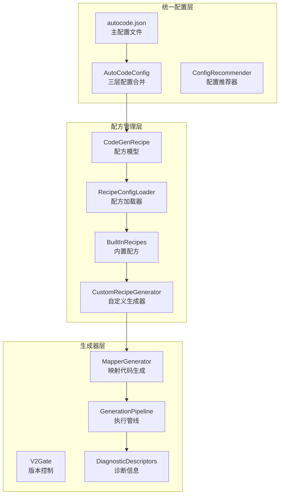
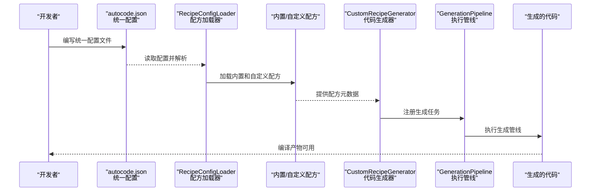
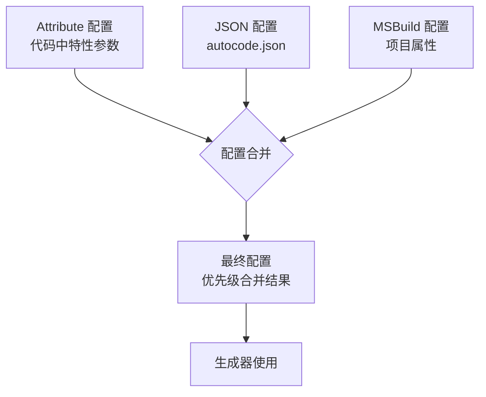
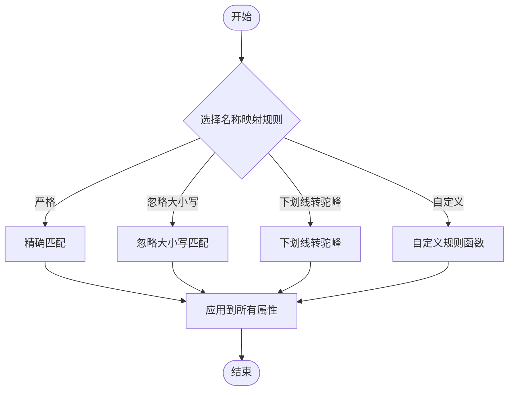
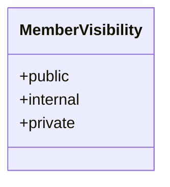
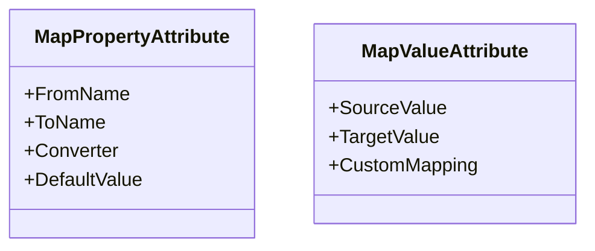
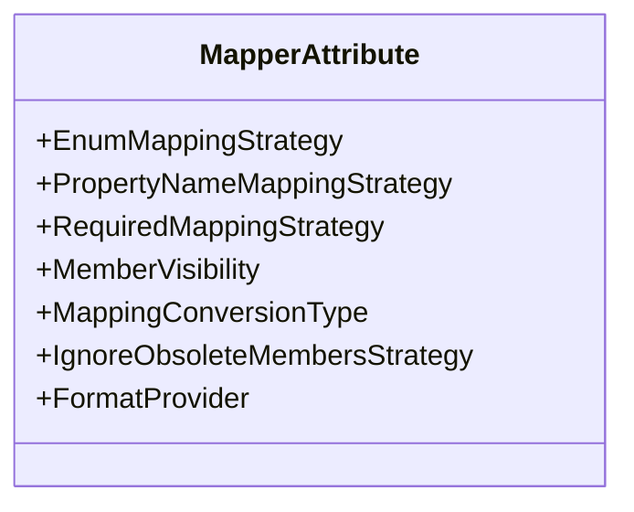
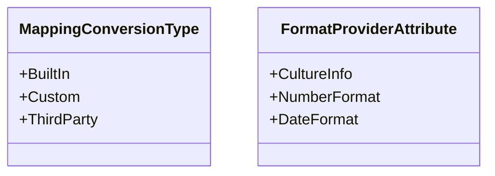
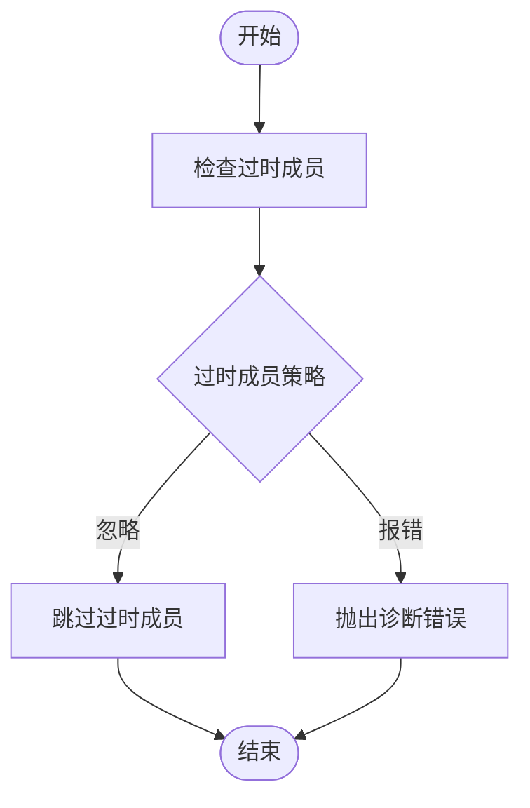
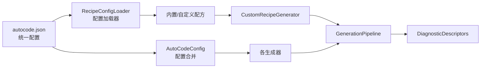

# 生成器配置

<cite>
**本文引用的文件**   
- [autocode.json](file://autocode.json)
- [AutoCodeConfig.cs](file://src/AutoCode.Engine\Config\AutoCodeConfig.cs)
- [RecipeConfigLoader.cs](file://src/AutoCode.Model\RecipeConfigLoader.cs)
- [CodeGenRecipe.cs](file://src/AutoCode.Model\CodeGenRecipe.cs)
- [BuiltInRecipes.cs](file://src/AutoCode.Analyzers\Recipes\BuiltInRecipes.cs)
- [CustomRecipeGenerator.cs](file://src/AutoCode.Generators\CustomRecipeGenerator.cs)
- [GenerationPipeline.cs](file://src/AutoCode.Engine\Pipeline\GenerationPipeline.cs)
- [V2Gate.cs](file://src/AutoCode.Generators\V2\V2Gate.cs)
- [DependencyInjectionGenerator.cs](file://src/AutoCode.Plugins.DependencyInjection\DependencyInjectionGenerator.cs)
- [EnumMappingStrategy.cs](file://src/AutoCode.Model\AutoMapperModel\EnumMappingStrategy.cs)
- [PropertyNameMappingStrategy.cs](file://src/AutoCode.Model\AutoMapperModel\PropertyNameMappingStrategy.cs)
- [RequiredMappingStrategy.cs](file://src/AutoCode.Model\AutoMapperModel\RequiredMappingStrategy.cs)
- [MemberVisibility.cs](file://src/AutoCode.Model\AutoMapperModel\MemberVisibility.cs)
- [MapPropertyAttribute.cs](file://src/AutoCode.Model\AutoMapperModel\MapPropertyAttribute.cs)
- [MapValueAttribute.cs](file://src/AutoCode.Model\AutoMapperModel\MapValueAttribute.cs)
- [MapperAttribute.cs](file://src/AutoCode.Model\AutoMapperModel/MapperAttribute.cs)
- [MappingConversionType.cs](file://src/AutoCode.Model\AutoMapperModel/MappingConversionType.cs)
- [IgnoreObsoleteMembersStrategy.cs](file://src/AutoCode.Model\AutoMapperModel/IgnoreObsoleteMembersStrategy.cs)
- [FormatProviderAttribute.cs](file://src/AutoCode.Model\AutoMapperModel/FormatProviderAttribute.cs)
- [DiagnosticDescriptors.cs](file://src/AutoCode.Map/Diagnostics/DiagnosticDescriptors.cs)
- [MapperGenerator.cs](file://src/AutoCode.Map/MapperGenerator.cs)
</cite>

## 更新摘要
**所做更改**
- 新增 autocode.json 统一配置文件系统章节
- 更新三层配置合并机制说明
- 添加集中式配方管理架构
- 增强自定义生成器配置示例
- 更新构建流程与插件系统文档

## 目录
1. [简介](#简介)
2. [项目结构](#项目结构)
3. [核心组件](#核心组件)
4. [架构总览](#架构总览)
5. [详细组件分析](#详细组件分析)
6. [依赖关系分析](#依赖关系分析)
7. [性能考虑](#性能考虑)
8. [故障排查指南](#故障排查指南)
9. [结论](#结论)
10. [附录：配置示例与最佳实践](#附录配置示例与最佳实践)

## 简介
本文件面向使用 AutoCode 映射生成器的开发者，系统化阐述"生成器配置"的完整体系。重点覆盖以下主题：
- **新的 autocode.json 统一配置系统**：替代分散的生成器配置，提供集中式配置管理
- **三层配置合并机制**：MSBuild + JSON + Attribute 配置的优先级和合并策略
- **集中式配方管理**：内置配方和自定义配方的声明式配置
- **枚举映射策略（EnumMappingStrategy）**
- **属性名称映射策略（PropertyNameMappingStrategy）**
- **必需映射策略（RequiredMappingStrategy）**
- **成员可见性设置（MemberVisibility）**
- **属性级映射与值映射（MapPropertyAttribute、MapValueAttribute）**
- **全局映射器配置（MapperAttribute）**
- **转换类型控制（MappingConversionType）**
- **过时成员处理（IgnoreObsoleteMembersStrategy）**
- **格式化提供程序（FormatProviderAttribute）**

文档同时给出配置验证、错误处理与性能调优建议，并提供可操作的配置示例与边界场景处理方法。

## 项目结构
与"生成器配置"直接相关的代码主要分布在统一配置层、配方管理层和映射生成器层：



**图表来源** 
- [autocode.json](file://autocode.json)
- [AutoCodeConfig.cs](file://src/AutoCode.Engine\Config\AutoCodeConfig.cs)
- [CodeGenRecipe.cs](file://src/AutoCode.Model\CodeGenRecipe.cs)
- [RecipeConfigLoader.cs](file://src/AutoCode.Model\RecipeConfigLoader.cs)
- [BuiltInRecipes.cs](file://src/AutoCode.Analyzers\Recipes\BuiltInRecipes.cs)
- [CustomRecipeGenerator.cs](file://src/AutoCode.Generators\CustomRecipeGenerator.cs)
- [GenerationPipeline.cs](file://src/AutoCode.Engine\Pipeline\GenerationPipeline.cs)

**章节来源**
- [autocode.json](file://autocode.json)
- [AutoCodeConfig.cs](file://src/AutoCode.Engine\Config\AutoCodeConfig.cs)
- [CodeGenRecipe.cs](file://src/AutoCode.Model\CodeGenRecipe.cs)
- [RecipeConfigLoader.cs](file://src/AutoCode.Model\RecipeConfigLoader.cs)
- [BuiltInRecipes.cs](file://src/AutoCode.Analyzers\Recipes\BuiltInRecipes.cs)
- [CustomRecipeGenerator.cs](file://src/AutoCode.Generators\CustomRecipeGenerator.cs)
- [GenerationPipeline.cs](file://src/AutoCode.Engine\Pipeline\GenerationPipeline.cs)

## 核心组件
本节聚焦"生成器配置"的核心类型与职责：

### 统一配置系统
- **autocode.json**：项目级统一配置文件，包含所有生成器选项
- **AutoCodeConfig**：三层配置合并实现，支持 MSBuild、JSON、Attribute 优先级
- **ConfigRecommender**：智能配置推荐和自动补丁生成

### 配方管理系统
- **CodeGenRecipe**：自定义配方模型，定义触发条件和输出配置
- **RecipeConfigLoader**：从 autocode.json 解析自定义配方
- **BuiltInRecipes**：11个内置生成器的配方实现
- **CustomRecipeGenerator**：基于配方的代码生成引擎

### 传统映射配置
- **枚举映射策略（EnumMappingStrategy）**：决定枚举到字符串或数值类型的映射方式
- **属性名称映射策略（PropertyNameMappingStrategy）**：决定源属性名到目标属性名的匹配规则
- **必需映射策略（RequiredMappingStrategy）**：控制未映射属性的行为
- **成员可见性（MemberVisibility）**：控制生成代码访问成员的可见性
- **属性级映射（MapPropertyAttribute）**：对单个属性进行重命名、指定转换、设置默认值等
- **值映射（MapValueAttribute）**：为特定值提供自定义映射或常量替换
- **全局映射器（MapperAttribute）**：在类级别统一配置上述策略与行为
- **转换类型（MappingConversionType）**：限定或扩展支持的转换类型
- **过时成员处理（IgnoreObsoleteMembersStrategy）**：是否忽略标记为过时的成员
- **格式化提供程序（FormatProviderAttribute）**：为日期、数字等类型提供自定义格式化规则

**章节来源**
- [autocode.json](file://autocode.json)
- [AutoCodeConfig.cs](file://src/AutoCode.Engine\Config\AutoCodeConfig.cs)
- [CodeGenRecipe.cs](file://src/AutoCode.Model\CodeGenRecipe.cs)
- [RecipeConfigLoader.cs](file://src/AutoCode.Model\RecipeConfigLoader.cs)
- [BuiltInRecipes.cs](file://src/AutoCode.Analyzers\Recipes\BuiltInRecipes.cs)
- [EnumMappingStrategy.cs](file://src/AutoCode.Model\AutoMapperModel\EnumMappingStrategy.cs)
- [PropertyNameMappingStrategy.cs](file://src/AutoCode.Model\AutoMapperModel\PropertyNameMappingStrategy.cs)
- [RequiredMappingStrategy.cs](file://src/AutoCode.Model\AutoMapperModel\RequiredMappingStrategy.cs)
- [MemberVisibility.cs](file://src/AutoCode.Model\AutoMapperModel\MemberVisibility.cs)
- [MapPropertyAttribute.cs](file://src/AutoCode.Model\AutoMapperModel\MapPropertyAttribute.cs)
- [MapValueAttribute.cs](file://src/AutoCode.Model\AutoMapperModel\MapValueAttribute.cs)
- [MapperAttribute.cs](file://src/AutoCode.Model\AutoMapperModel/MapperAttribute.cs)
- [MappingConversionType.cs](file://src/AutoCode.Model\AutoMapperModel/MappingConversionType.cs)
- [IgnoreObsoleteMembersStrategy.cs](file://src/AutoCode.Model\AutoMapperModel/IgnoreObsoleteMembersStrategy.cs)
- [FormatProviderAttribute.cs](file://src/AutoCode.Model\AutoMapperModel/FormatProviderAttribute.cs)

## 架构总览
下图展示了从"统一配置"到"配方执行"的整体流程：



**图表来源** 
- [autocode.json](file://autocode.json)
- [RecipeConfigLoader.cs](file://src/AutoCode.Model\RecipeConfigLoader.cs)
- [BuiltInRecipes.cs](file://src/AutoCode.Analyzers\Recipes\BuiltInRecipes.cs)
- [CustomRecipeGenerator.cs](file://src/AutoCode.Generators\CustomRecipeGenerator.cs)
- [GenerationPipeline.cs](file://src/AutoCode.Engine\Pipeline\GenerationPipeline.cs)

## 详细组件分析

### autocode.json 统一配置系统
**更新** 新增统一的配置文件系统，替代分散的生成器配置

autocode.json 是项目的核心配置文件，包含以下主要部分：

#### 约定配置（conventions）
- servicePattern：服务类命名模式（默认 "*Service"）
- repositoryPattern：仓储类命名模式（默认 "*Repository"）
- dtoSuffix：DTO 后缀（默认 "Dto"）
- autoDetectServices：自动检测服务类
- autoDetectDtos：自动检测 DTO 类
- autoDetectRepositories：自动检测仓储类
- autoDetectControllers：自动检测控制器类

#### 映射配置（mapper）
- methodName：映射方法名（默认 "MapTo"）
- nullHandling：空值处理策略（Skip、Throw、Default）
- collectionMapping：集合映射策略（DeepCopy、ShallowCopy）
- generateProjection：是否生成投影查询

#### 插件配置（plugins）
每个插件都有 enabled 开关，支持独立启用/禁用：
- interface：接口生成
- mapper：映射生成
- dto：DTO 生成
- validation：验证生成
- webapi：Web API 生成
- crud：CRUD 生成
- dependencyInjection：依赖注入生成
- testing：测试生成
- logging：日志生成
- cascade：级联生成
- intercept：拦截器生成

#### 自定义生成器（customGenerators）
支持声明式定义自定义代码生成规则：
- name：配方唯一标识
- title：显示标题
- icon：图标前缀
- category：分类
- trigger：触发条件（属性名、类模式、接口要求等）
- output：输出配置（模板路径、文件名模式、命名空间）

**章节来源**
- [autocode.json](file://autocode.json)

### 三层配置合并机制
**更新** 新增三层配置系统和优先级管理

AutoCodeConfig 实现了三层配置合并，优先级从高到低：
1. **Attribute 层**：代码中的特性参数（最高优先级）
2. **JSON 层**：autocode.json 配置文件
3. **MSBuild 层**：项目文件中的属性配置（最低优先级）



**图表来源** 
- [AutoCodeConfig.cs](file://src/AutoCode.Engine\Config\AutoCodeConfig.cs)

**章节来源**
- [AutoCodeConfig.cs](file://src/AutoCode.Engine\Config\AutoCodeConfig.cs)

### 集中式配方管理
**更新** 新增集中式配方管理系统

#### 内置配方（BuiltInRecipes）
系统提供 11 个内置生成器配方：
- AutoEntity：全链路生成（DTO+Mapper+Validator+API+DI）
- AutoDTO：生成 DTO + FromEntity/ToEntity
- AutoCrud：生成 CRUD 全套（Service+Repository+Controller）
- AutoValidator：生成编译时验证代码
- AutoInterface：自动提取接口
- AutoController：生成 REST API Controller
- AutoLog：生成日志装饰器
- AutoTest：生成单元测试桩
- AutoIntercept：添加 AOP 拦截管线
- MapFrom：生成编译时对象映射
- Scoped：实现 IScoped（编译时 DI 自动注册）

#### 自定义配方（CodeGenRecipe）
支持通过 autocode.json 定义自定义生成规则：

```json
{
  "customGenerators": [
    {
      "name": "auditService",
      "title": "添加审计日志服务",
      "icon": "📝",
      "category": "Service",
      "trigger": {
        "classPattern": "*Service",
        "attributeName": "AutoAudit"
      },
      "output": {
        "template": "templates/AuditService.liquid",
        "fileName": "{ClassName}Audit.g.cs",
        "namespace": "{SourceNamespace}.Audit"
      }
    }
  ]
}
```

**章节来源**
- [BuiltInRecipes.cs](file://src/AutoCode.Analyzers\Recipes\BuiltInRecipes.cs)
- [CodeGenRecipe.cs](file://src/AutoCode.Model\CodeGenRecipe.cs)
- [RecipeConfigLoader.cs](file://src/AutoCode.Model\RecipeConfigLoader.cs)
- [CustomRecipeGenerator.cs](file://src/AutoCode.Generators\CustomRecipeGenerator.cs)

### 枚举映射策略（EnumMappingStrategy）
- 作用：定义枚举到目标类型（字符串、数值或其他枚举）的映射规则
- 常见选项：按名称映射、按值映射、混合模式（名称优先，失败回退到值）
- 默认值：通常采用"按名称映射"，保证可读性与稳定性
- 适用场景：
  - API 响应中需要稳定字符串标识时，选择"按名称"
  - 与数据库或旧系统交互需保持数值一致时，选择"按值"
- 边界情况：
  - 新增枚举值导致不兼容：建议在迁移期启用"混合模式"并逐步清理
  - 大小写差异：结合属性名映射策略统一处理


**图表来源** 
- [EnumMappingStrategy.cs](file://src/AutoCode.Model\AutoMapperModel\EnumMappingStrategy.cs)

**章节来源**
- [EnumMappingStrategy.cs](file://src/AutoCode.Model\AutoMapperModel\EnumMappingStrategy.cs)

### 属性名称映射策略（PropertyNameMappingStrategy）
- 作用：决定源属性名到目标属性名的匹配规则
- 常见选项：严格匹配、忽略大小写、下划线转驼峰、自定义规则
- 默认值：通常为"严格匹配"或"忽略大小写"，取决于团队规范
- 适用场景：
  - 前后端命名不一致（如 snake_case vs PascalCase）
  - 历史遗留字段名变更，需要平滑过渡
- 边界情况：
  - 多义缩写（ID、URL）在不同风格下的歧义，建议通过 MapPropertyAttribute 显式指定



**图表来源** 
- [PropertyNameMappingStrategy.cs](file://src/AutoCode.Model\AutoMapperModel\PropertyNameMappingStrategy.cs)

**章节来源**
- [PropertyNameMappingStrategy.cs](file://src/AutoCode.Model\AutoMapperModel\PropertyNameMappingStrategy.cs)

### 必需映射策略（RequiredMappingStrategy）
- 作用：控制未映射属性的处理方式
- 常见选项：报错（强制）、忽略（静默跳过）、默认值填充（根据类型或自定义）
- 默认值：推荐"报错"，确保映射完整性；在迁移阶段可临时改为"忽略"
- 适用场景：
  - 强一致性要求：开启"报错"
  - 渐进式重构：开启"忽略"并记录日志
- 边界情况：
  - 可选字段缺失：应允许默认值填充
  - 复杂对象为空：需判断是否为 null 或空集合


**图表来源** 
- [RequiredMappingStrategy.cs](file://src/AutoCode.Model\AutoMapperModel\RequiredMappingStrategy.cs)

**章节来源**
- [RequiredMappingStrategy.cs](file://src/AutoCode.Model\AutoMapperModel\RequiredMappingStrategy.cs)

### 成员可见性（MemberVisibility）
- 作用：控制生成代码访问成员的可见性（public、internal 等）
- 默认值：通常为 internal，避免污染公共 API；对外暴露时才提升为 public
- 适用场景：
  - 库内部使用：internal
  - 公开 API：public
- 边界情况：
  - 跨程序集访问时需确保可见性正确
  - 与框架约束冲突时，调整可见性或改用接口



**图表来源** 
- [MemberVisibility.cs](file://src/AutoCode.Model\AutoMapperModel\MemberVisibility.cs)

**章节来源**
- [MemberVisibility.cs](file://src/AutoCode.Model\AutoMapperModel\MemberVisibility.cs)

### 属性级映射（MapPropertyAttribute）与值映射（MapValueAttribute）
- MapPropertyAttribute：用于单个属性的重命名、指定转换、设置默认值、忽略映射等
- MapValueAttribute：为特定值提供自定义映射或常量替换
- 适用场景：
  - 个别字段特殊处理（如日期格式、单位换算）
  - 与外部系统约定不一致的值映射
- 边界情况：
  - 多个特性冲突时，优先级由生成器定义（通常属性级 > 全局）
  - 循环引用或自引用类型需谨慎处理



**图表来源** 
- [MapPropertyAttribute.cs](file://src/AutoCode.Model\AutoMapperModel\MapPropertyAttribute.cs)
- [MapValueAttribute.cs](file://src/AutoCode.Model\AutoMapperModel\MapValueAttribute.cs)

**章节来源**
- [MapPropertyAttribute.cs](file://src/AutoCode.Model\AutoMapperModel\MapPropertyAttribute.cs)
- [MapValueAttribute.cs](file://src/AutoCode.Model\AutoMapperModel\MapValueAttribute.cs)

### 全局映射器（MapperAttribute）
- 作用：在类级别统一配置枚举映射、属性名映射、必需映射、可见性等策略
- 适用场景：
  - 批量应用同一套映射规则
  - 快速切换不同环境的行为（开发/测试/生产）
- 边界情况：
  - 与属性级特性冲突时，以属性级为准
  - 过度集中配置可能导致难以定位问题，建议拆分模块



**图表来源** 
- [MapperAttribute.cs](file://src/AutoCode.Model\AutoMapperModel/MapperAttribute.cs)

**章节来源**
- [MapperAttribute.cs](file://src/AutoCode.Model\AutoMapperModel/MapperAttribute.cs)

### 转换类型（MappingConversionType）与格式化提供程序（FormatProviderAttribute）
- MappingConversionType：限制或扩展支持的转换类型（内置、自定义、第三方）
- FormatProviderAttribute：为日期、数字等类型提供自定义格式化规则
- 适用场景：
  - 集成第三方库（如 Newtonsoft、System.Text.Json）
  - 国际化与本地化需求
- 边界情况：
  - 自定义转换器需保证线程安全与性能
  - 格式化提供程序需处理异常输入



**图表来源** 
- [MappingConversionType.cs](file://src/AutoCode.Model\AutoMapperModel/MappingConversionType.cs)
- [FormatProviderAttribute.cs](file://src/AutoCode.Model\AutoMapperModel/FormatProviderAttribute.cs)

**章节来源**
- [MappingConversionType.cs](file://src/AutoCode.Model\AutoMapperModel/MappingConversionType.cs)
- [FormatProviderAttribute.cs](file://src/AutoCode.Model\AutoMapperModel/FormatProviderAttribute.cs)

### 过时成员处理（IgnoreObsoleteMembersStrategy）
- 作用：决定是否忽略标记为过时的成员
- 默认值：通常忽略，避免破坏现有代码
- 适用场景：
  - 渐进式废弃字段
  - 兼容旧版本数据结构
- 边界情况：
  - 需配合诊断工具提醒开发者更新



**图表来源** 
- [IgnoreObsoleteMembersStrategy.cs](file://src/AutoCode.Model\AutoMapperModel/IgnoreObsoleteMembersStrategy.cs)

**章节来源**
- [IgnoreObsoleteMembersStrategy.cs](file://src/AutoCode.Model\AutoMapperModel/IgnoreObsoleteMembersStrategy.cs)

## 依赖关系分析
新的配置系统引入了更多的依赖关系：



**图表来源** 
- [autocode.json](file://autocode.json)
- [RecipeConfigLoader.cs](file://src/AutoCode.Model\RecipeConfigLoader.cs)
- [AutoCodeConfig.cs](file://src/AutoCode.Engine\Config\AutoCodeConfig.cs)
- [CustomRecipeGenerator.cs](file://src/AutoCode.Generators\CustomRecipeGenerator.cs)
- [GenerationPipeline.cs](file://src/AutoCode.Engine\Pipeline\GenerationPipeline.cs)
- [DiagnosticDescriptors.cs](file://src/AutoCode.Map/Diagnostics/DiagnosticDescriptors.cs)

**章节来源**
- [autocode.json](file://autocode.json)
- [RecipeConfigLoader.cs](file://src/AutoCode.Model\RecipeConfigLoader.cs)
- [AutoCodeConfig.cs](file://src/AutoCode.Engine\Config\AutoCodeConfig.cs)
- [CustomRecipeGenerator.cs](file://src/AutoCode.Generators\CustomRecipeGenerator.cs)
- [GenerationPipeline.cs](file://src/AutoCode.Engine\Pipeline\GenerationPipeline.cs)
- [DiagnosticDescriptors.cs](file://src/AutoCode.Map/Diagnostics/DiagnosticDescriptors.cs)

## 性能考虑
**更新** 新增统一配置系统的性能优化建议

### 配置加载性能
- **缓存策略**：autocode.json 配置在编译期只加载一次，后续复用
- **增量构建**：只有配置文件变化时才重新解析配置
- **懒加载**：自定义配方按需加载，减少初始开销

### 生成器性能
- **编译期生成**：利用 Source Generator 在编译期生成代码，避免运行时反射开销
- **增量构建**：合理划分配置粒度，减少不必要的重新生成
- **缓存策略**：对复杂转换与格式化提供程序进行结果缓存
- **内存占用**：避免在特性中传递大型对象，尽量使用轻量配置
- **并发安全**：自定义转换器与格式化提供程序需保证线程安全

### 管线优化
- **拓扑排序**：插件按依赖关系排序执行，避免重复计算
- **错误隔离**：单个插件失败不影响其他插件执行
- **Hook 机制**：支持在执行过程中插入自定义逻辑

[本节为通用指导，无需具体文件来源]

## 故障排查指南
**更新** 新增统一配置系统的故障排查指南

### 常见问题
- **配置文件语法错误**：检查 autocode.json 的 JSON 语法和键名拼写
- **配置优先级冲突**：确认 Attribute > JSON > MSBuild 的优先级规则
- **配方未生效**：检查 trigger 条件是否正确匹配
- **插件冲突**：确认 V1/V2 生成器不会同时处理相同特性

### 诊断信息
- 查看 DiagnosticDescriptors 中的错误描述与修复建议
- 使用 VS Code 扩展的诊断功能获取实时反馈
- 检查生成管线执行日志定位问题

### 调试技巧
- 使用 RecipeConfigLoader 验证配置文件解析
- 逐步缩小配置范围，隔离冲突项
- 启用详细日志输出跟踪配置加载过程

**章节来源**
- [DiagnosticDescriptors.cs](file://src/AutoCode.Map/Diagnostics/DiagnosticDescriptors.cs)
- [RecipeConfigLoader.cs](file://src/AutoCode.Model\RecipeConfigLoader.cs)
- [GenerationPipeline.cs](file://src/AutoCode.Engine\Pipeline\GenerationPipeline.cs)

## 结论
通过引入 autocode.json 统一配置系统和集中式配方管理，AutoCode 提供了更加灵活且易于维护的配置能力。新的三层配置合并机制确保了配置的优先级和灵活性，而声明式的配方系统使得自定义代码生成变得简单直观。

建议结合诊断信息与调试工具，持续优化配置与性能。对于新项目，推荐使用 autocode.json 作为主要配置方式；对于现有项目，可以逐步迁移到新的配置系统。

[本节为总结，无需具体文件来源]

## 附录：配置示例与最佳实践
**更新** 新增统一配置系统的配置示例

### autocode.json 完整配置示例

#### 基础配置
```json
{
  "conventions": {
    "servicePattern": "*Service",
    "repositoryPattern": "*Repository",
    "dtoSuffix": "Dto",
    "autoDetectServices": true,
    "autoDetectDtos": true,
    "autoDetectRepositories": true,
    "autoDetectControllers": false
  },
  "plugins": {
    "interface": { "enabled": true },
    "mapper": { "enabled": true },
    "dto": { "enabled": true },
    "validation": { "enabled": true },
    "webapi": { "enabled": true },
    "crud": { "enabled": true },
    "dependencyInjection": { "enabled": true },
    "testing": { "enabled": true },
    "logging": { "enabled": true },
    "cascade": { "enabled": true },
    "intercept": { "enabled": true }
  }
}
```

#### 高级配置
```json
{
  "mapper": {
    "methodName": "MapTo",
    "nullHandling": "Skip",
    "collectionMapping": "DeepCopy",
    "generateProjection": false
  },
  "webapi": {
    "responseWrapper": true,
    "pagination": true,
    "versioning": "UrlSegment",
    "version": ""
  },
  "dependencyInjection": {
    "namespace": "AutoCode.DependencyInjection",
    "methodName": "AddAutoDI",
    "modulePerAssembly": false
  },
  "intercept": {
    "defaultInterceptors": "Log,Metrics",
    "cacheDurationSeconds": 300,
    "maxRetryCount": 3,
    "retryBaseDelayMs": 100,
    "circuitFailureThreshold": 5,
    "circuitBreakDurationSeconds": 30
  }
}
```

#### 自定义生成器配置
```json
{
  "customGenerators": [
    {
      "name": "auditService",
      "title": "添加审计日志服务",
      "icon": "📝",
      "category": "Service",
      "trigger": {
        "classPattern": "*Service",
        "attributeName": "AutoAudit"
      },
      "output": {
        "template": "templates/AuditService.liquid",
        "fileName": "{ClassName}Audit.g.cs",
        "namespace": "{SourceNamespace}.Audit"
      }
    },
    {
      "name": "repositoryPattern",
      "title": "生成 Repository 实现",
      "icon": "🗂️",
      "category": "Entity",
      "trigger": {
        "requiredProperties": ["Id"],
        "attributeName": "AutoRepository"
      },
      "output": {
        "template": "templates/Repository.liquid",
        "fileName": "{ClassName}Repository.g.cs",
        "namespace": "{SourceNamespace}.Data"
      }
    }
  ]
}
```

### 最佳实践
1. **配置分层**：将通用配置放在 autocode.json，特定配置使用 Attribute 覆盖
2. **插件管理**：根据项目需求启用必要的插件，减少不必要的生成
3. **配方设计**：自定义配方应遵循单一职责原则，便于维护和复用
4. **版本控制**：将 autocode.json 纳入版本控制，确保团队配置一致性
5. **性能优化**：合理使用缓存和增量构建，提高编译性能
6. **错误处理**：启用严格的必需映射策略，及时发现配置问题

### 迁移指南
从传统配置迁移到 autocode.json：
1. 分析现有的 Attribute 配置，提取为 JSON 配置
2. 将分散的生成器配置整合到 autocode.json
3. 使用 ConfigRecommender 生成推荐的配置模板
4. 逐步验证配置的正确性和兼容性
5. 更新构建脚本和 CI/CD 流程

[本节为概念性内容，无需具体文件来源]