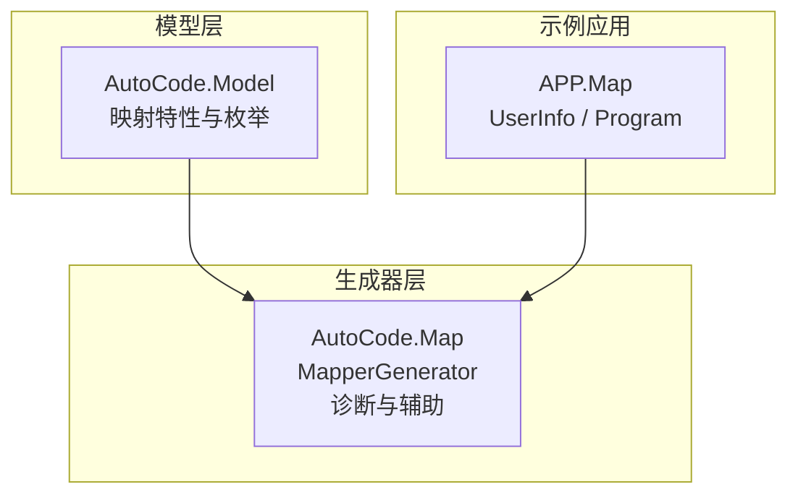
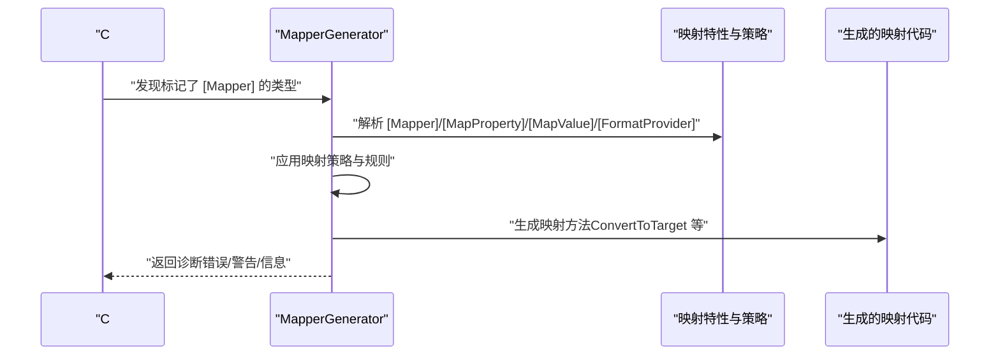
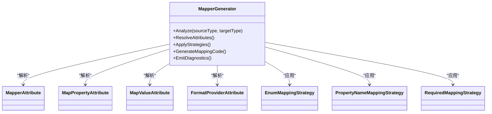
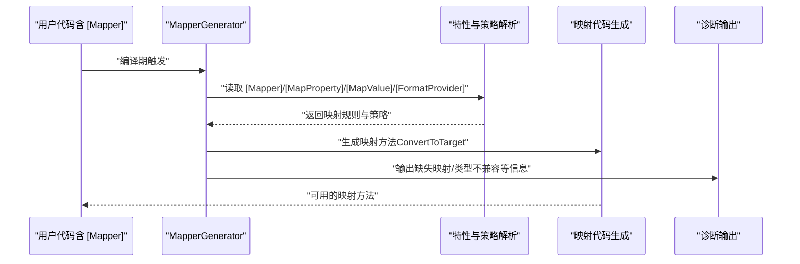
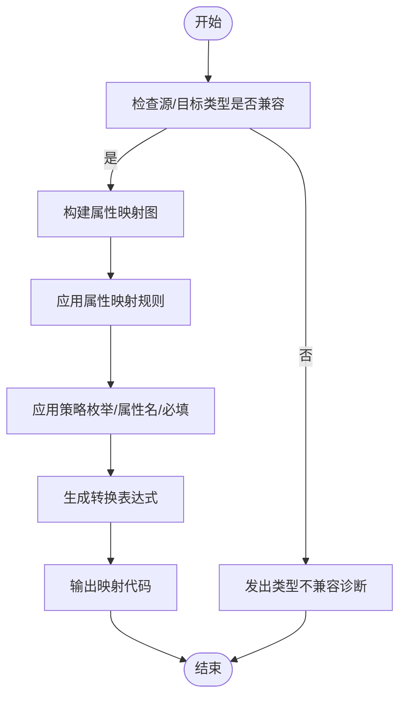
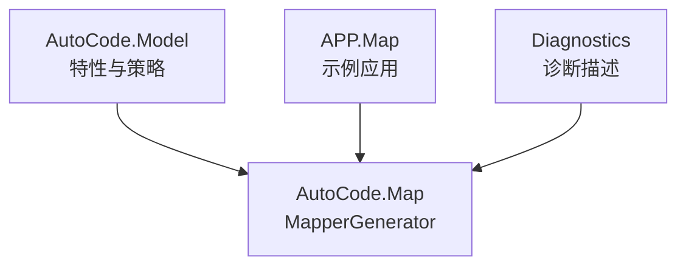

# 类生成器

<cite>
**本文档引用的文件**   
- [MapperGenerator.cs](file://src/AutoCode.Map/MapperGenerator.cs)
- [AutoCode.Model.csproj](file://src/AutoCode.Model/AutoCode.Model.csproj)
- [MapperAttribute.cs](file://src/AutoCode.Model/AutoMapperModel/MapperAttribute.cs)
- [MapPropertyAttribute.cs](file://src/AutoCode.Model/AutoMapperModel/MapPropertyAttribute.cs)
- [MapValueAttribute.cs](file://src/AutoCode.Model/AutoMapperModel/MapValueAttribute.cs)
- [EnumMappingStrategy.cs](file://src/AutoCode.Model/AutoMapperModel/EnumMappingStrategy.cs)
- [PropertyNameMappingStrategy.cs](file://src/AutoCode.Model/AutoMapperModel/PropertyNameMappingStrategy.cs)
- [RequiredMappingStrategy.cs](file://src/AutoCode.Model/AutoMapperModel/RequiredMappingStrategy.cs)
- [MappingConversionType.cs](file://src/AutoCode.Model/AutoMapperModel/MappingConversionType.cs)
- [MemberVisibility.cs](file://src/AutoCode.Model/AutoMapperModel/MemberVisibility.cs)
- [IgnoreObsoleteMembersStrategy.cs](file://src/AutoCode.Model/AutoMapperModel/IgnoreObsoleteMembersStrategy.cs)
- [FormatProviderAttribute.cs](file://src/AutoCode.Model/AutoMapperModel/FormatProviderAttribute.cs)
- [DiagnosticDescriptors.cs](file://src/AutoCode.Map/Diagnostics/DiagnosticDescriptors.cs)
- [ImmutableEquatableArray.cs](file://src/AutoCode.Map/Helpers/ImmutableEquatableArray.cs)
- [IncrementalValuesProviderExtensions.cs](file://src/AutoCode.Map/Helpers/IncrementalValuesProviderExtensions.cs)
- [APP.Map.csproj](file://src/APP.Map/APP.Map.csproj)
- [UserInfo.cs](file://src/APP.Map/UserInfo.cs)
- [Program.cs](file://src/APP.Map/Program.cs)
</cite>

## 目录
1. [简介](#简介)
2. [项目结构](#项目结构)
3. [核心组件](#核心组件)
4. [架构总览](#架构总览)
5. [详细组件分析](#详细组件分析)
6. [依赖关系分析](#依赖关系分析)
7. [性能考虑](#性能考虑)
8. [故障排查指南](#故障排查指南)
9. [结论](#结论)
10. [附录](#附录)

## 简介
本文件面向“自动类生成机制”的文档，重点围绕 MapperGenerator 类及其相关属性与模板处理流程，系统性阐述如何基于源类型与目标类型自动生成映射逻辑与转换代码。内容涵盖：
- [Mapper] 属性的使用方式与语义
- 类模板处理与代码生成流程
- 源类型到目标类型的分析与映射规则
- 复杂类型转换的处理策略
- 性能优化技巧、调试方法与常见问题解决方案

## 项目结构
本项目采用多项目结构，核心由以下部分组成：
- AutoCode.Model：定义映射相关的模型与特性（如 [Mapper]、[MapProperty]、[MapValue] 等）
- AutoCode.Map：实现 Source Generator，包含 MapperGenerator 以及诊断、辅助扩展等
- APP.Map：示例应用，展示如何使用映射特性并触发源码生成
- 其他项目：接口生成、DotTemplate 模板引擎、WebAPI 示例等

图表来源
- [AutoCode.Model.csproj](file://src/AutoCode.Model/AutoCode.Model.csproj)
- [MapperGenerator.cs](file://src/AutoCode.Map/MapperGenerator.cs)
- [APP.Map.csproj](file://src/APP.Map/APP.Map.csproj)

章节来源
- [AutoCode.Model.csproj](file://src/AutoCode.Model/AutoCode.Model.csproj)
- [APP.Map.csproj](file://src/APP.Map/APP.Map.csproj)

## 核心组件
- MapperGenerator：Source Generator 的核心，负责扫描标记了映射特性的类型，解析源/目标类型，生成映射代码
- 映射特性：
  - [Mapper]：声明一个映射器，指定源类型与目标类型
  - [MapProperty]：自定义属性映射规则（重命名、条件映射、格式化等）
  - [MapValue]：为特定属性设置固定值或表达式
  - [FormatProvider]：用于数值/日期格式化提供器
- 策略与枚举：
  - EnumMappingStrategy：枚举映射策略
  - PropertyNameMappingStrategy：属性名映射策略
  - RequiredMappingStrategy：必填映射策略
  - MappingConversionType：转换类型
  - MemberVisibility：成员可见性
  - IgnoreObsoleteMembersStrategy：忽略过时成员策略
- 诊断与辅助：
  - DiagnosticDescriptors：诊断描述（错误、警告、信息）
  - ImmutableEquatableArray：不可变相等数组，提升比较效率
  - IncrementalValuesProviderExtensions：增量值提供者扩展，加速编译期分析

章节来源
- [MapperGenerator.cs](file://src/AutoCode.Map/MapperGenerator.cs)
- [MapperAttribute.cs](file://src/AutoCode.Model/AutoMapperModel/MapperAttribute.cs)
- [MapPropertyAttribute.cs](file://src/AutoCode.Model/AutoMapperModel/MapPropertyAttribute.cs)
- [MapValueAttribute.cs](file://src/AutoCode.Model/AutoMapperModel/MapValueAttribute.cs)
- [EnumMappingStrategy.cs](file://src/AutoCode.Model/AutoMapperModel/EnumMappingStrategy.cs)
- [PropertyNameMappingStrategy.cs](file://src/AutoCode.Model/AutoMapperModel/PropertyNameMappingStrategy.cs)
- [RequiredMappingStrategy.cs](file://src/AutoCode.Model/AutoMapperModel/RequiredMappingStrategy.cs)
- [MappingConversionType.cs](file://src/AutoCode.Model/AutoMapperModel/MappingConversionType.cs)
- [MemberVisibility.cs](file://src/AutoCode.Model/AutoMapperModel/MemberVisibility.cs)
- [IgnoreObsoleteMembersStrategy.cs](file://src/AutoCode.Model/AutoMapperModel/IgnoreObsoleteMembersStrategy.cs)
- [FormatProviderAttribute.cs](file://src/AutoCode.Model/AutoMapperModel/FormatProviderAttribute.cs)
- [DiagnosticDescriptors.cs](file://src/AutoCode.Map/Diagnostics/DiagnosticDescriptors.cs)
- [ImmutableEquatableArray.cs](file://src/AutoCode.Map/Helpers/ImmutableEquatableArray.cs)
- [IncrementalValuesProviderExtensions.cs](file://src/AutoCode.Map/Helpers/IncrementalValuesProviderExtensions.cs)

## 架构总览
MapperGenerator 的工作流大致如下：
- 编译期扫描：识别带有 [Mapper] 的类型，提取源类型与目标类型
- 属性解析：读取 [MapProperty]、[MapValue]、[FormatProvider] 等特性，构建映射规则
- 策略应用：根据枚举映射策略、属性名映射策略、必填映射策略等决定如何处理字段/属性
- 代码生成：生成映射方法（例如 ConvertToTarget），将源对象转换为目标对象
- 诊断输出：在出现不匹配或缺失映射时发出诊断信息

图表来源
- [MapperGenerator.cs](file://src/AutoCode.Map/MapperGenerator.cs)
- [MapperAttribute.cs](file://src/AutoCode.Model/AutoMapperModel/MapperAttribute.cs)
- [MapPropertyAttribute.cs](file://src/AutoCode.Model/AutoMapperModel/MapPropertyAttribute.cs)
- [MapValueAttribute.cs](file://src/AutoCode.Model/AutoMapperModel/MapValueAttribute.cs)
- [FormatProviderAttribute.cs](file://src/AutoCode.Model/AutoMapperModel/FormatProviderAttribute.cs)
- [EnumMappingStrategy.cs](file://src/AutoCode.Model/AutoMapperModel/EnumMappingStrategy.cs)
- [PropertyNameMappingStrategy.cs](file://src/AutoCode.Model/AutoMapperModel/PropertyNameMappingStrategy.cs)
- [RequiredMappingStrategy.cs](file://src/AutoCode.Model/AutoMapperModel/RequiredMappingStrategy.cs)

## 详细组件分析

### MapperGenerator 类分析
- 职责
  - 扫描标记了 [Mapper] 的类型，解析源类型与目标类型
  - 读取属性级映射规则（[MapProperty]、[MapValue]、[FormatProvider]）
  - 应用策略（枚举映射、属性名映射、必填映射、忽略过时成员）
  - 生成映射代码（通常是一个或多个转换方法）
  - 输出诊断（缺失映射、类型不兼容等）
- 关键流程
  - 输入：语法树中的类型声明与特性
  - 处理：构建映射图（源属性到目标属性）、计算转换表达式
  - 输出：C# 源代码片段（映射方法）
- 性能优化
  - 使用不可变数据结构减少重复分配
  - 增量分析避免重复工作
  - 缓存已解析的类型信息与映射规则

图表来源
- [MapperGenerator.cs](file://src/AutoCode.Map/MapperGenerator.cs)
- [MapperAttribute.cs](file://src/AutoCode.Model/AutoMapperModel/MapperAttribute.cs)
- [MapPropertyAttribute.cs](file://src/AutoCode.Model/AutoMapperModel/MapPropertyAttribute.cs)
- [MapValueAttribute.cs](file://src/AutoCode.Model/AutoMapperModel/MapValueAttribute.cs)
- [FormatProviderAttribute.cs](file://src/AutoCode.Model/AutoMapperModel/FormatProviderAttribute.cs)
- [EnumMappingStrategy.cs](file://src/AutoCode.Model/AutoMapperModel/EnumMappingStrategy.cs)
- [PropertyNameMappingStrategy.cs](file://src/AutoCode.Model/AutoMapperModel/PropertyNameMappingStrategy.cs)
- [RequiredMappingStrategy.cs](file://src/AutoCode.Model/AutoMapperModel/RequiredMappingStrategy.cs)

章节来源
- [MapperGenerator.cs](file://src/AutoCode.Map/MapperGenerator.cs)

### 映射特性与策略
- [Mapper]：声明映射器，指定源类型与目标类型；可附加全局策略
- [MapProperty]：对单个属性进行重命名、条件映射、格式化、默认值等配置
- [MapValue]：为属性设置固定值或表达式
- [FormatProvider]：指定数值/日期格式化提供器
- 策略枚举
  - EnumMappingStrategy：控制枚举映射行为（按名称、按值、自定义映射表）
  - PropertyNameMappingStrategy：控制属性名匹配规则（精确、大小写忽略、驼峰/帕斯卡转换）
  - RequiredMappingStrategy：控制必填映射（是否允许缺失、是否抛出异常）
  - MappingConversionType：控制转换类型（隐式、显式、委托）
  - MemberVisibility：控制成员可见性（public、internal、private 等）
  - IgnoreObsoleteMembersStrategy：忽略过时成员的策略

章节来源
- [MapperAttribute.cs](file://src/AutoCode.Model/AutoMapperModel/MapperAttribute.cs)
- [MapPropertyAttribute.cs](file://src/AutoCode.Model/AutoMapperModel/MapPropertyAttribute.cs)
- [MapValueAttribute.cs](file://src/AutoCode.Model/AutoMapperModel/MapValueAttribute.cs)
- [FormatProviderAttribute.cs](file://src/AutoCode.Model/AutoMapperModel/FormatProviderAttribute.cs)
- [EnumMappingStrategy.cs](file://src/AutoCode.Model/AutoMapperModel/EnumMappingStrategy.cs)
- [PropertyNameMappingStrategy.cs](file://src/AutoCode.Model/AutoMapperModel/PropertyNameMappingStrategy.cs)
- [RequiredMappingStrategy.cs](file://src/AutoCode.Model/AutoMapperModel/RequiredMappingStrategy.cs)
- [MappingConversionType.cs](file://src/AutoCode.Model/AutoMapperModel/MappingConversionType.cs)
- [MemberVisibility.cs](file://src/AutoCode.Model/AutoMapperModel/MemberVisibility.cs)
- [IgnoreObsoleteMembersStrategy.cs](file://src/AutoCode.Model/AutoMapperModel/IgnoreObsoleteMembersStrategy.cs)

### 代码生成流程（序列图）

图表来源
- [MapperGenerator.cs](file://src/AutoCode.Map/MapperGenerator.cs)
- [MapperAttribute.cs](file://src/AutoCode.Model/AutoMapperModel/MapperAttribute.cs)
- [MapPropertyAttribute.cs](file://src/AutoCode.Model/AutoMapperModel/MapPropertyAttribute.cs)
- [MapValueAttribute.cs](file://src/AutoCode.Model/AutoMapperModel/MapValueAttribute.cs)
- [FormatProviderAttribute.cs](file://src/AutoCode.Model/AutoMapperModel/FormatProviderAttribute.cs)

章节来源
- [MapperGenerator.cs](file://src/AutoCode.Map/MapperGenerator.cs)

### 复杂类型转换流程图

图表来源
- [MapperGenerator.cs](file://src/AutoCode.Map/MapperGenerator.cs)
- [EnumMappingStrategy.cs](file://src/AutoCode.Model/AutoMapperModel/EnumMappingStrategy.cs)
- [PropertyNameMappingStrategy.cs](file://src/AutoCode.Model/AutoMapperModel/PropertyNameMappingStrategy.cs)
- [RequiredMappingStrategy.cs](file://src/AutoCode.Model/AutoMapperModel/RequiredMappingStrategy.cs)

章节来源
- [MapperGenerator.cs](file://src/AutoCode.Map/MapperGenerator.cs)

### 示例用法（APP.Map）
- 在示例项目中，通过 [Mapper] 声明映射器，并在业务代码中调用生成的映射方法
- UserInfo 作为示例数据模型，配合 Program 演示映射过程

章节来源
- [APP.Map.csproj](file://src/APP.Map/APP.Map.csproj)
- [UserInfo.cs](file://src/APP.Map/UserInfo.cs)
- [Program.cs](file://src/APP.Map/Program.cs)

## 依赖关系分析
- 生成器依赖模型层（特性与策略）以获取映射规则
- 示例应用依赖生成器输出的映射方法
- 诊断模块提供编译期反馈，帮助定位问题

图表来源
- [AutoCode.Model.csproj](file://src/AutoCode.Model/AutoCode.Model.csproj)
- [MapperGenerator.cs](file://src/AutoCode.Map/MapperGenerator.cs)
- [APP.Map.csproj](file://src/APP.Map/APP.Map.csproj)
- [DiagnosticDescriptors.cs](file://src/AutoCode.Map/Diagnostics/DiagnosticDescriptors.cs)

章节来源
- [AutoCode.Model.csproj](file://src/AutoCode.Model/AutoCode.Model.csproj)
- [APP.Map.csproj](file://src/APP.Map/APP.Map.csproj)
- [DiagnosticDescriptors.cs](file://src/AutoCode.Map/Diagnostics/DiagnosticDescriptors.cs)

## 性能考虑
- 增量分析：利用 IncrementalValuesProviderExtensions 减少重复分析
- 不可变数据结构：使用 ImmutableEquatableArray 提高比较与缓存效率
- 策略预计算：在生成前计算常用策略结果，降低运行时开销
- 映射缓存：对复杂类型映射进行缓存，避免重复生成
- 最小化诊断输出：仅在必要时输出诊断，减少编译期开销

章节来源
- [IncrementalValuesProviderExtensions.cs](file://src/AutoCode.Map/Helpers/IncrementalValuesProviderExtensions.cs)
- [ImmutableEquatableArray.cs](file://src/AutoCode.Map/Helpers/ImmutableEquatableArray.cs)

## 故障排查指南
- 常见诊断
  - 类型不兼容：源/目标类型无法直接转换
  - 缺失映射：目标属性未找到对应源属性且无默认值
  - 枚举映射失败：枚举名称/值不匹配
  - 必填映射失败：必填属性缺失
- 调试方法
  - 查看诊断消息定位问题位置
  - 简化映射规则逐步排查
  - 启用详细日志（若支持）
- 解决方案
  - 使用 [MapProperty] 指定重命名或默认值
  - 使用 [MapValue] 设置固定值
  - 调整策略（枚举映射、属性名映射、必填映射）
  - 添加自定义转换逻辑（委托或扩展方法）

章节来源
- [DiagnosticDescriptors.cs](file://src/AutoCode.Map/Diagnostics/DiagnosticDescriptors.cs)
- [MapperAttribute.cs](file://src/AutoCode.Model/AutoMapperModel/MapperAttribute.cs)
- [MapPropertyAttribute.cs](file://src/AutoCode.Model/AutoMapperModel/MapPropertyAttribute.cs)
- [MapValueAttribute.cs](file://src/AutoCode.Model/AutoMapperModel/MapValueAttribute.cs)
- [EnumMappingStrategy.cs](file://src/AutoCode.Model/AutoMapperModel/EnumMappingStrategy.cs)
- [PropertyNameMappingStrategy.cs](file://src/AutoCode.Model/AutoMapperModel/PropertyNameMappingStrategy.cs)
- [RequiredMappingStrategy.cs](file://src/AutoCode.Model/AutoMapperModel/RequiredMappingStrategy.cs)

## 结论
MapperGenerator 通过特性驱动与策略化的映射规则，实现了从源类型到目标类型的自动化映射代码生成。其设计兼顾了灵活性与性能，适用于复杂的领域模型转换场景。合理使用 [Mapper]、[MapProperty]、[MapValue] 等特性，并结合策略与诊断，可以高效地构建稳定可靠的映射逻辑。

## 附录
- 最佳实践
  - 明确定义源/目标类型，避免歧义
  - 使用 [MapProperty] 精细控制属性映射
  - 合理配置策略以减少手动映射
  - 关注诊断信息并及时修复问题
- 参考路径
  - 示例应用：[APP.Map.csproj](file://src/APP.Map/APP.Map.csproj)、[UserInfo.cs](file://src/APP.Map/UserInfo.cs)、[Program.cs](file://src/APP.Map/Program.cs)
  - 特性与策略：[AutoCode.Model.csproj](file://src/AutoCode.Model/AutoCode.Model.csproj)
  - 生成器与诊断：[MapperGenerator.cs](file://src/AutoCode.Map/MapperGenerator.cs)、[DiagnosticDescriptors.cs](file://src/AutoCode.Map/Diagnostics/DiagnosticDescriptors.cs)
