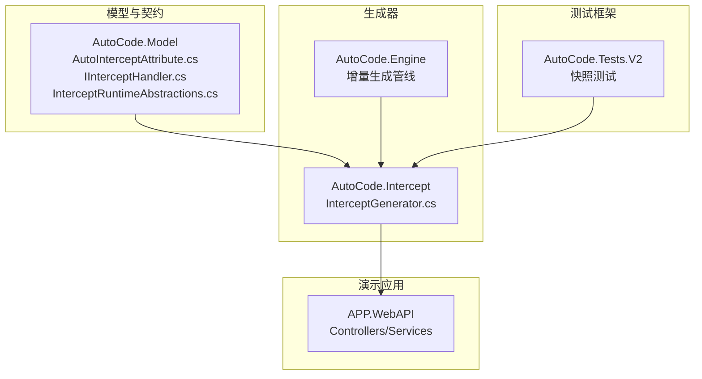
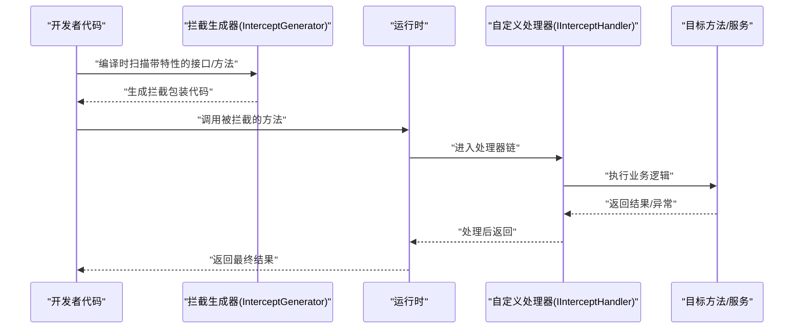
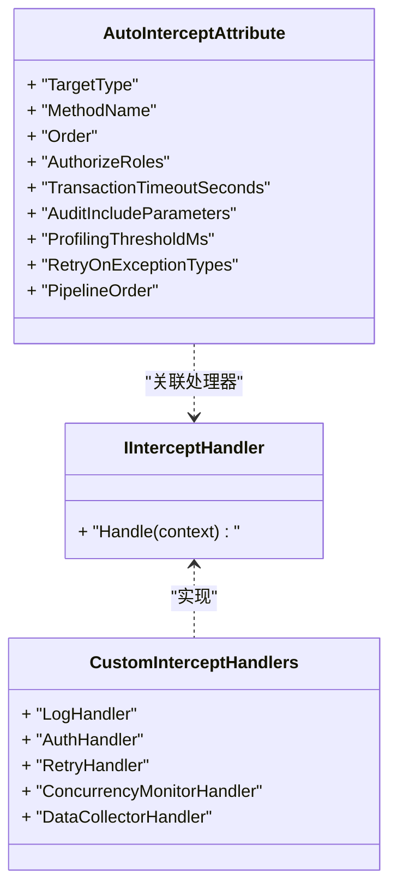
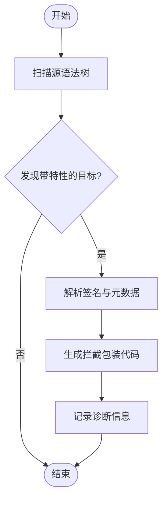
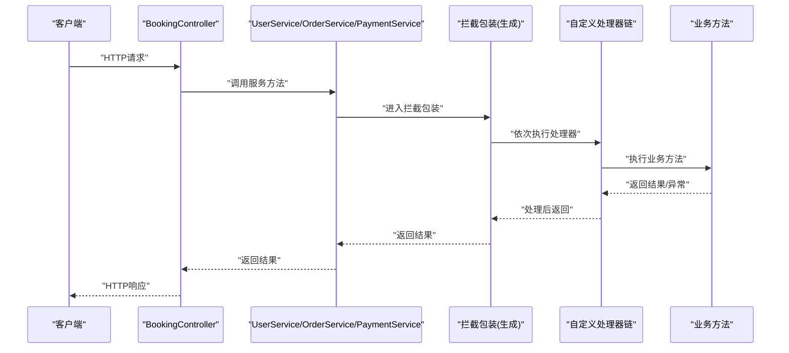
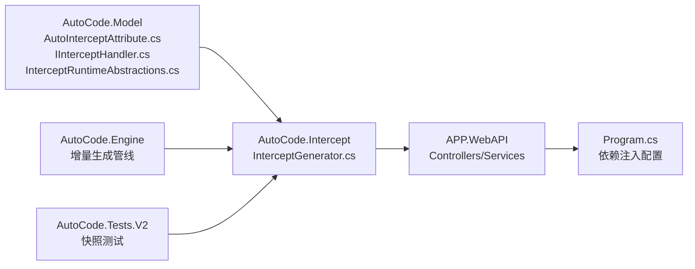

# 编译时AOP拦截器

<cite>
**本文引用的文件**   
- [InterceptGenerator.cs](file://src/AutoCode.Generators/V1/InterceptGenerator.cs)
- [AutoInterceptAttribute.cs](file://src/AutoCode.Model/AutoInterceptAttribute.cs)
- [IInterceptHandler.cs](file://src/AutoCode.Model/IInterceptHandler.cs)
- [CustomInterceptHandlers.cs](file://src/APP.WebAPI/Services/CustomInterceptHandlers.cs)
- [BookingController.cs](file://src/APP.WebAPI/Controllers/BookingController.cs)
- [UserService.cs](file://src/APP.WebAPI/Services/UserService.cs)
- [OrderService.cs](file://src/APP.WebAPI/Services/OrderService.cs)
- [PaymentService.cs](file://src/APP.WebAPI/Services/PaymentService.cs)
- [OrderServiceV2.cs](file://src/APP.WebAPI/Services/OrderServiceV2.cs)
- [Program.cs](file://src/APP.WebAPI/Program.cs)
- [AutoCode.Engine.csproj](file://src/AutoCode.Engine/AutoCode.Engine.csproj)
- [AutoCode.Intercept.csproj](file://src/AutoCode.Intercept/AutoCode.Intercept.csproj)
- [AutoCode.Model.csproj](file://src/AutoCode.Model/AutoCode.Model.csproj)
- [AutoCode.sln](file://src/AutoCode.sln)
- [2026-09-02-aop-improvements.md](file://docs/superpowers/plans/2026-09-02-aop-improvements.md)
- [2026-09-02-aop-improvements-design.md](file://docs/superpowers/specs/2026-09-02-aop-improvements-design.md)
- [InterceptGeneratorSnapshotTests.cs](file://src/AutoCode.Tests.V2/Snapshots/InterceptGeneratorSnapshotTests.cs)
</cite>

## 更新摘要
**变更内容**   
- 新增四阶段改进计划章节，详细说明AC9004-AC9010诊断代码的实施
- 添加测试驱动开发方法和快照测试策略说明
- 更新拦截器实现状态，从8/12升级为完整12/12可用
- 新增诊断代码、运行时抽象和配置属性的详细说明
- 更新架构图和流程图以反映新的拦截管线顺序

## 目录
1. [简介](#简介)
2. [项目结构](#项目结构)
3. [核心组件](#核心组件)
4. [架构总览](#架构总览)
5. [详细组件分析](#详细组件分析)
6. [四阶段改进计划](#四阶段改进计划)
7. [依赖关系分析](#依赖关系分析)
8. [性能考量](#性能考量)
9. [故障排查指南](#故障排查指南)
10. [结论](#结论)
11. [附录](#附录)

## 简介
本文件围绕"编译时AOP拦截器"能力进行系统化说明，聚焦于在编译期通过Source Generator与Roslyn分析，将用户声明的拦截点（接口或方法）自动注入拦截逻辑，并在运行时由自定义处理器完成横切关注点的执行。该方案具备以下特点：
- 零运行时反射开销：拦截逻辑在编译期生成，避免反射带来的性能损耗。
- 强类型、可调试：生成的代码是真实C#代码，IDE可导航、单步调试。
- 可扩展：通过实现统一处理器接口，轻松扩展新的横切逻辑（如日志、审计、权限、重试等）。
- 与Web API无缝集成：示例展示了在控制器与服务层中的使用方式。
- **渐进式改进**：采用四阶段实施计划，确保向后兼容性和稳定性。

## 项目结构
本项目采用多工程模块化组织，拦截相关能力主要分布在以下工程中：
- AutoCode.Model：定义拦截所需的基础模型与属性（如拦截特性、处理器接口、新运行时抽象）。
- AutoCode.Intercept：拦截相关的Source Generator，负责扫描标记并生成拦截包装代码。
- APP.WebAPI：演示应用，包含控制器与服务，展示如何声明拦截点与实现处理器。
- AutoCode.Engine：通用引擎基础设施（增量生成管线、上下文、诊断收集等），为拦截生成提供支撑。
- AutoCode.Tests.V2：快照测试框架，确保生成代码的正确性和稳定性。

**图表来源**
- [AutoInterceptAttribute.cs](file://src/AutoCode.Model/AutoInterceptAttribute.cs)
- [IInterceptHandler.cs](file://src/AutoCode.Model/IInterceptHandler.cs)
- [InterceptGenerator.cs](file://src/AutoCode.Generators/V1/InterceptGenerator.cs)
- [AutoCode.Engine.csproj](file://src/AutoCode.Engine/AutoCode.Engine.csproj)
- [InterceptGeneratorSnapshotTests.cs](file://src/AutoCode.Tests.V2/Snapshots/InterceptGeneratorSnapshotTests.cs)

**章节来源**
- [AutoCode.sln](file://src/AutoCode.sln)

## 核心组件
- 拦截特性（AutoInterceptAttribute）：用于标注需要被拦截的接口或方法，作为生成器的输入信号。
- 拦截处理器接口（IInterceptHandler）：定义统一的拦截处理契约，开发者实现该接口以注入具体横切逻辑。
- 拦截生成器（InterceptGenerator）：基于Roslyn的Source Generator，扫描带有特性的目标，生成代理/包装代码，将调用转发到处理器链。
- 演示处理器与目标服务：在APP.WebAPI中提供具体的处理器实现与待拦截的服务/控制器方法，验证端到端流程。
- **新增运行时抽象**：IClaimsPrincipalProvider、IAuditStore、AuditEntry等零依赖运行时接口。

**章节来源**
- [AutoInterceptAttribute.cs](file://src/AutoCode.Model/AutoInterceptAttribute.cs)
- [IInterceptHandler.cs](file://src/AutoCode.Model/IInterceptHandler.cs)
- [InterceptGenerator.cs](file://src/AutoCode.Generators/V1/InterceptGenerator.cs)
- [CustomInterceptHandlers.cs](file://src/APP.WebAPI/Services/CustomInterceptHandlers.cs)

## 架构总览
下图展示了从源码到生成代码再到运行时的整体流程：开发者在接口/方法上添加拦截特性，生成器在编译期产出包装代码；运行时，调用被重定向至处理器链，最终执行业务方法。

**图表来源**
- [InterceptGenerator.cs](file://src/AutoCode.Generators/V1/InterceptGenerator.cs)
- [IInterceptHandler.cs](file://src/AutoCode.Model/IInterceptHandler.cs)
- [CustomInterceptHandlers.cs](file://src/APP.WebAPI/Services/CustomInterceptHandlers.cs)

## 详细组件分析

### 拦截特性与处理器契约
- 拦截特性：用于标记需要被拦截的目标（接口或方法），为生成器提供元数据入口。
- 处理器接口：定义统一的拦截生命周期钩子，便于实现日志、校验、缓存、幂等等横切逻辑。

**图表来源**
- [IInterceptHandler.cs](file://src/AutoCode.Model/IInterceptHandler.cs)
- [AutoInterceptAttribute.cs](file://src/AutoCode.Model/AutoInterceptAttribute.cs)
- [CustomInterceptHandlers.cs](file://src/APP.WebAPI/Services/CustomInterceptHandlers.cs)

**章节来源**
- [IInterceptHandler.cs](file://src/AutoCode.Model/IInterceptHandler.cs)
- [AutoInterceptAttribute.cs](file://src/AutoCode.Model/AutoInterceptAttribute.cs)
- [CustomInterceptHandlers.cs](file://src/APP.WebAPI/Services/CustomInterceptHandlers.cs)

### 拦截生成器（InterceptGenerator）
拦截生成器基于Roslyn增量生成管线工作，主要职责包括：
- 扫描带有拦截特性的接口与方法。
- 解析参数、返回值、泛型与异步签名。
- 生成代理类或包装方法，将调用路由到处理器链。
- 输出诊断信息，辅助定位问题。
- **支持四种新拦截器**：Authorize、Transaction、Audit、Profiling。

**图表来源**
- [InterceptGenerator.cs](file://src/AutoCode.Generators/V1/InterceptGenerator.cs)
- [AutoCode.Engine.csproj](file://src/AutoCode.Engine/AutoCode.Engine.csproj)

**章节来源**
- [InterceptGenerator.cs](file://src/AutoCode.Generators/V1/InterceptGenerator.cs)
- [AutoCode.Engine.csproj](file://src/AutoCode.Engine/AutoCode.Engine.csproj)

### 演示应用中的拦截点与处理器
- 控制器与服务：在APP.WebAPI中，控制器与服务方法可作为拦截目标，配合特性启用拦截。
- 自定义处理器：在CustomInterceptHandlers中实现IInterceptHandler，提供日志、鉴权、重试等横切逻辑。
- 程序入口：Program.cs中注册依赖与中间件，确保拦截链在运行时可用。

**图表来源**
- [BookingController.cs](file://src/APP.WebAPI/Controllers/BookingController.cs)
- [UserService.cs](file://src/APP.WebAPI/Services/UserService.cs)
- [OrderService.cs](file://src/APP.WebAPI/Services/OrderService.cs)
- [PaymentService.cs](file://src/APP.WebAPI/Services/PaymentService.cs)
- [OrderServiceV2.cs](file://src/APP.WebAPI/Services/OrderServiceV2.cs)
- [CustomInterceptHandlers.cs](file://src/APP.WebAPI/Services/CustomInterceptHandlers.cs)
- [Program.cs](file://src/APP.WebAPI/Program.cs)

**章节来源**
- [BookingController.cs](file://src/APP.WebAPI/Controllers/BookingController.cs)
- [UserService.cs](file://src/APP.WebAPI/Services/UserService.cs)
- [OrderService.cs](file://src/APP.WebAPI/Services/OrderService.cs)
- [PaymentService.cs](file://src/APP.WebAPI/Services/PaymentService.cs)
- [OrderServiceV2.cs](file://src/APP.WebAPI/Services/OrderServiceV2.cs)
- [CustomInterceptHandlers.cs](file://src/APP.WebAPI/Services/CustomInterceptHandlers.cs)
- [Program.cs](file://src/APP.WebAPI/Program.cs)

## 四阶段改进计划

### 阶段一：声明与实现对齐（修假功能）
**目标**：修复现有声明与实际实现不一致的问题

#### Task 1: Handled降级真正生效
- 修复catch块中的无条件throw;问题
- 支持ctx.Handled=true时的降级返回
- 重试耗尽后异常也走Handler管线

#### Task 2: IAsyncMethodHandler识别与await调用（AC9004）
- 新增AC9004诊断：异步Handler不能用于同步方法
- 支持IAsyncMethodHandler接口的识别
- 生成await调用于OnBeforeAsync/OnAfterAsync/OnExceptionAsync

#### Task 3: LogResult/ExcludeMethods生效
- LogResult=true时After日志包含结果信息
- ExcludeMethods支持方法级排除拦截

**交付物**：4个快照测试，OrderServiceV2降级示例真实生效

### 阶段二：四种拦截器落地（12/12可用）
**目标**：实现声明但未实现的四种拦截器

#### Task 5: Model新运行时抽象 + Attribute新属性
- 新增IClaimsPrincipalProvider、IAuditStore、AuditEntry
- 新增9个配置属性：AuthorizeRoles、AuthorizePolicy、TransactionTimeoutSeconds等

#### Task 6: Authorize拦截器（AC9006/AC9010）
- 基于IClaimsPrincipalProvider的用户认证检查
- 角色验证：AuthorizeRoles属性支持逗号分隔的角色列表
- AC9006提示：需要注册IClaimsPrincipalProvider实现
- AC9010提示：AuthorizePolicy暂未实现

#### Task 7: Transaction拦截器
- 基于System.Transactions.TransactionScope的事务管理
- 支持异步流：TransactionScopeAsyncFlowOption.Enabled
- 配置属性：TransactionTimeoutSeconds、TransactionIsolationLevel

#### Task 8: Audit拦截器（含Sensitive脱敏）
- 成功路径和异常路径都写入审计
- Sensitive参数自动脱敏为"[REDACTED]"
- 配置属性：AuditIncludeParameters

#### Task 9: Profiling拦截器（AC9005）
- GC内存基线采集和增量计算
- 可选Process级指标采集
- AC9005提示：ProfilingIncludeProcess有额外开销

**交付物**：4个新拦截器快照，README特性表12/12

### 阶段三：语言特性与语义修复
**目标**：增强语言特性和修复语义问题

#### 5.1 泛型方法支持
- 捕获TypeParameters（名称+where约束）
- Args record同步泛型化

#### 5.2 ref/out/in/params支持
- ParamInfo增加RefKind
- Args record只含普通值参数（ref/out/in不可进record位置参数）

#### 5.3 方法重载消歧
- Args record命名：{MethodName}Args_{参数类型ShortName拼接}
- 冲突时追加序号兜底

#### 5.4 Retry + CancellationToken
- 检测末位CancellationToken参数
- 每次重试前ct.ThrowIfCancellationRequested()

#### 5.5 Throttle真·每秒限流
- 移除SemaphoreSlim并发许可实现
- 改固定窗口算法：静态_windowStartTicks + _windowCount + lock

#### 5.6 Retry异常类型过滤
- 新增RetryOnExceptionTypes属性
- catch (Exception __ex) when (__attempt < N && (类型 is 检查))

#### 5.7 CircuitBreaker半开状态机
- Closed → Open → HalfOpen → Closed状态转换
- Interlocked.CompareExchange保证并发安全

#### 5.8 Cache语义
- null结果不写入缓存
- 缓存命中分支补日志

**交付物**：8个快照测试，全部经AssertCompilesCleanly二次编译验证

### 阶段四：顺序可配 + 架构加固
**目标**：重构为顺序表驱动的emit函数

#### 6.1 PipelineOrder（Attribute级可配）
- 新增PipelineOrder属性：string?（逗号分隔拦截器名）
- 每种拦截器抽为独立emit函数
- 默认顺序：Validate → Authorize → Custom(OnBefore) → Throttle → Cache → CircuitBreaker → Tracing → Log → Retry → Transaction → [调用_inner] → Custom(OnAfter/OnException) → Audit → Profiling → Metrics

#### 6.2 模型record化
- InterceptInfo/InterceptMethodInfo/ParamInfo/CustomHandlerInfo改record
- 修复增量缓存失效
- 新增缓存哨兵测试

#### 6.3 文档同步
- README：12拦截器全量说明、PipelineOrder用法、新属性表
- CHANGELOG；samples更新
- APP.WebAPI示例补全四种新拦截器演示

**交付物**：约20+ verified.txt快照，完整文档更新

## 依赖关系分析
- 模型层（AutoCode.Model）：提供拦截所需的特性与处理器接口，被生成器与应用共同引用。
- 生成器（AutoCode.Intercept）：依赖模型与引擎，产出拦截包装代码。
- 应用（APP.WebAPI）：引用生成器产物，并通过DI注册处理器与目标服务。
- 测试框架（AutoCode.Tests.V2）：快照测试确保生成代码正确性。

**图表来源**
- [AutoCode.Model.csproj](file://src/AutoCode.Model/AutoCode.Model.csproj)
- [AutoCode.Intercept.csproj](file://src/AutoCode.Intercept/AutoCode.Intercept.csproj)
- [AutoCode.Engine.csproj](file://src/AutoCode.Engine/AutoCode.Engine.csproj)
- [Program.cs](file://src/APP.WebAPI/Program.cs)
- [InterceptGeneratorSnapshotTests.cs](file://src/AutoCode.Tests.V2/Snapshots/InterceptGeneratorSnapshotTests.cs)

**章节来源**
- [AutoCode.Model.csproj](file://src/AutoCode.Model/AutoCode.Model.csproj)
- [AutoCode.Intercept.csproj](file://src/AutoCode.Intercept/AutoCode.Intercept.csproj)
- [AutoCode.Engine.csproj](file://src/AutoCode.Engine/AutoCode.Engine.csproj)
- [AutoCode.sln](file://src/AutoCode.sln)

## 性能考量
- 编译时代码生成：拦截逻辑在编译期生成，避免了运行时的反射与动态代理开销。
- 增量生成：利用Roslyn增量生成管线，仅对变更部分重新生成，缩短构建时间。
- 处理器链优化：建议合理编排处理器顺序，减少不必要的检查与计算。
- 异步与并发：确保处理器与业务方法正确处理异步与并发场景，避免阻塞。
- **PipelineOrder优化**：阶段四引入的顺序可配机制允许按性能需求调整拦截器顺序。

## 故障排查指南
常见问题与解决思路：
- 未生成拦截代码：确认目标是否添加了拦截特性，且命名空间与可见性符合生成器要求。
- 处理器未生效：检查处理器是否正确实现处理器接口，并在依赖注入中正确注册。
- 异常堆栈难以定位：查看生成器输出的诊断信息，定位具体目标方法与处理器。
- 性能退化：审查处理器链复杂度，避免在热点路径上进行昂贵操作。
- **新增诊断代码**：
  - AC9004：异步Handler挂载在同步方法上
  - AC9005：ProfilingIncludeProcess有额外开销
  - AC9006：Authorize需要注册IClaimsPrincipalProvider
  - AC9007：PipelineOrder含未知拦截器名
  - AC9008：Handler同时实现IInterceptHandler与IMethodHandler/IAsyncMethodHandler
  - AC9010：AuthorizePolicy暂未实现

**章节来源**
- [InterceptGenerator.cs](file://src/AutoCode.Generators/V1/InterceptGenerator.cs)
- [CustomInterceptHandlers.cs](file://src/APP.WebAPI/Services/CustomInterceptHandlers.cs)
- [Program.cs](file://src/APP.WebAPI/Program.cs)

## 结论
编译时AOP拦截器通过Source Generator与Roslyn技术，实现了高性能、强类型、可调试的横切能力。结合统一的处理器接口与清晰的生成管线，开发者可以以最小代价引入日志、鉴权、重试等横切关注点，并在Web API与服务层中无缝使用。

**四阶段改进计划**确保了系统的渐进式演进：
- 阶段一修复了现有的假功能问题
- 阶段二实现了完整的12种拦截器
- 阶段三增强了语言特性和语义正确性
- 阶段四提供了灵活的顺序配置和架构加固

建议在复杂系统中优先采用此方案，以获得更好的性能与可维护性。通过快照测试和严格的TDD方法，确保每次改进都不会破坏现有功能。

## 附录
- 快速上手：在接口或方法上添加拦截特性，实现处理器接口，并在依赖注入中注册处理器。
- 最佳实践：
  - 保持处理器单一职责，避免过长的处理器链。
  - 合理使用异步与异常处理，确保系统健壮性。
  - 利用生成器的诊断信息快速定位问题。
  - **使用PipelineOrder优化性能**：根据业务需求调整拦截器执行顺序。
  - **遵循快照测试策略**：received→人工审查→改名verified的严格流程。

**章节来源**
- [2026-09-02-aop-improvements.md](file://docs/superpowers/plans/2026-09-02-aop-improvements.md)
- [2026-09-02-aop-improvements-design.md](file://docs/superpowers/specs/2026-09-02-aop-improvements-design.md)
- [InterceptGeneratorSnapshotTests.cs](file://src/AutoCode.Tests.V2/Snapshots/InterceptGeneratorSnapshotTests.cs)