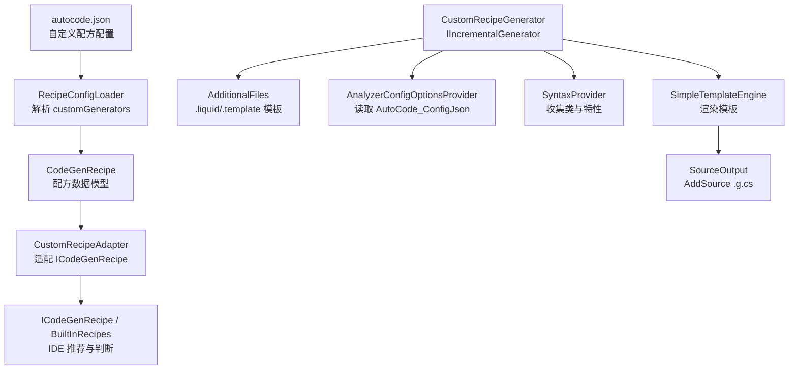
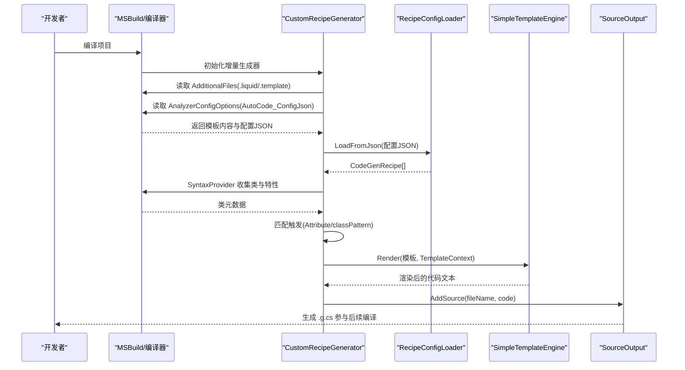
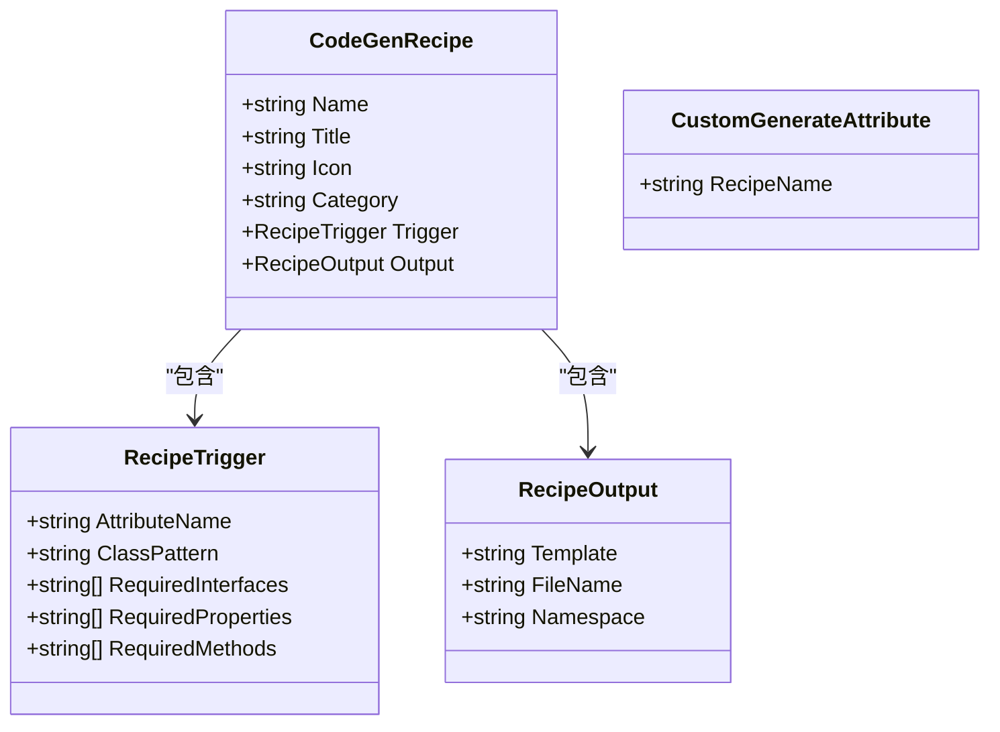
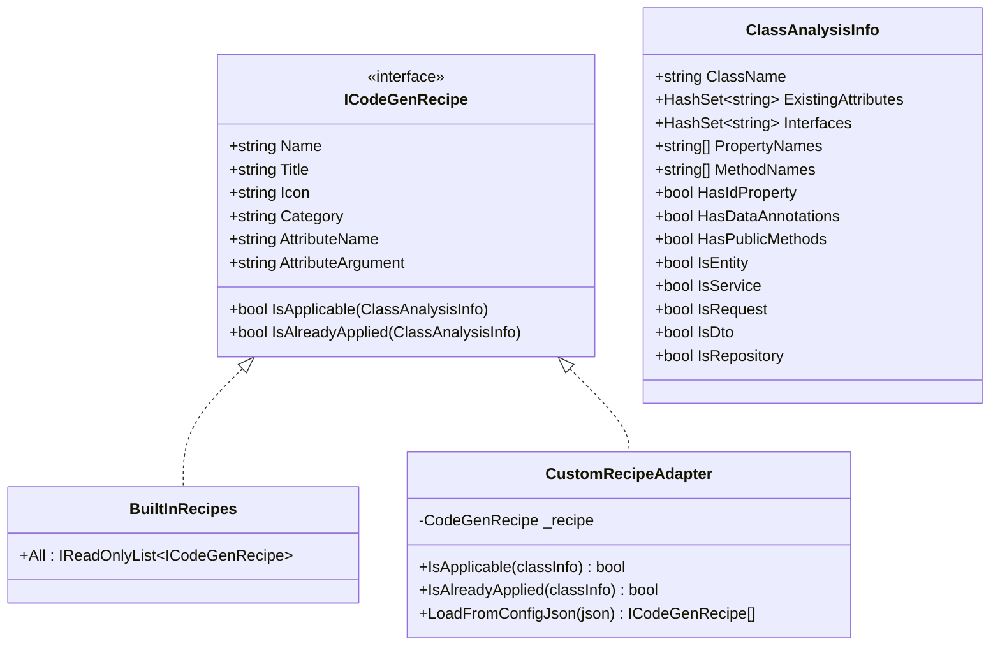
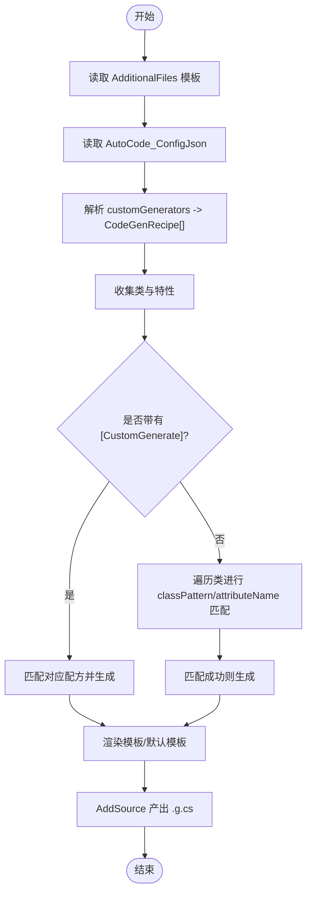
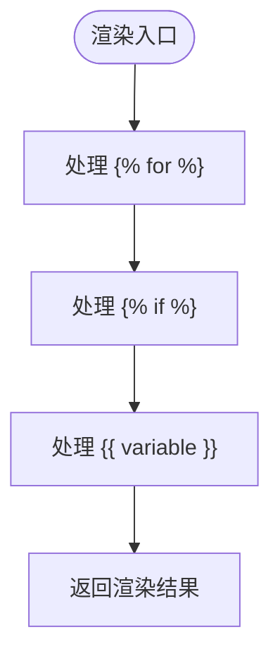
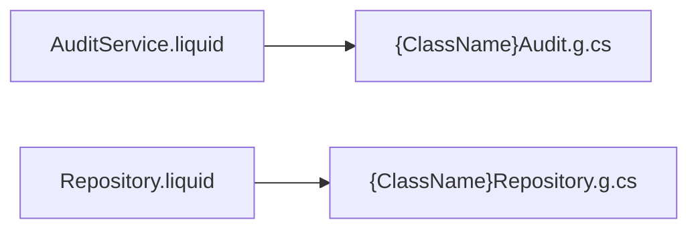
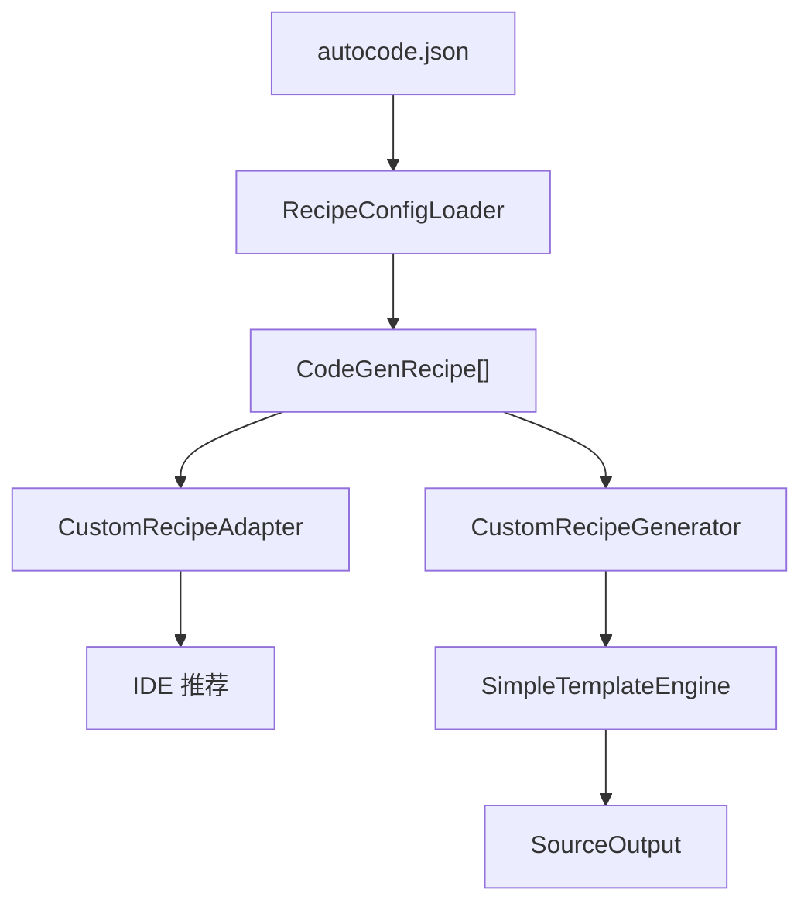

# 自定义配方系统

<cite>
**本文引用的文件**   
- [autocode.json](file://autocode.json)
- [CodeGenRecipe.cs](file://src/AutoCode.Model/CodeGenRecipe.cs)
- [CustomGenerateAttribute.cs](file://src/AutoCode.Model/CustomGenerateAttribute.cs)
- [RecipeConfigLoader.cs](file://src/AutoCode.Model/RecipeConfigLoader.cs)
- [ICodeGenRecipe.cs](file://src/AutoCode.Analyzers/Recipes/ICodeGenRecipe.cs)
- [BuiltInRecipes.cs](file://src/AutoCode.Analyzers/Recipes/BuiltInRecipes.cs)
- [CustomRecipeAdapter.cs](file://src/AutoCode.Analyzers/Recipes/CustomRecipeAdapter.cs)
- [CustomRecipeGenerator.cs](file://src/AutoCode.Generators/CustomRecipeGenerator.cs)
- [SimpleTemplateEngine.cs](file://src/AutoCode.Engine/Template/SimpleTemplateEngine.cs)
- [AuditService.liquid](file://templates/AuditService.liquid)
- [Repository.liquid](file://templates/Repository.liquid)
</cite>

## 目录
1. [简介](#简介)
2. [项目结构](#项目结构)
3. [核心组件](#核心组件)
4. [架构总览](#架构总览)
5. [详细组件分析](#详细组件分析)
6. [依赖关系分析](#依赖关系分析)
7. [性能考量](#性能考量)
8. [故障排查指南](#故障排查指南)
9. [结论](#结论)
10. [附录](#附录)

## 简介
本仓库实现了一个“自定义配方系统”，允许通过声明式配置（autocode.json）定义代码生成规则，并在编译期由 Source Generator 自动触发、渲染模板并产出 C# 代码。系统同时为 IDE 提供智能建议（Ctrl+.），将内置与自定义配方统一展示。

该系统的核心价值：
- 以 JSON 声明式配置驱动代码生成，零侵入、可组合、易扩展
- 支持 Attribute 触发与类名模式匹配两种触发方式
- 使用轻量级模板引擎渲染 Liquid 子集，无需外部依赖
- 在 IDE 中提供统一的“推荐”体验，内置与自定义配方一致

## 项目结构
围绕自定义配方的关键目录与文件：
- 模型与配置解析：AutoCode.Model（CodeGenRecipe、CustomGenerateAttribute、RecipeConfigLoader）
- 分析器与 IDE 推荐：AutoCode.Analyzers.Recipes（ICodeGenRecipe、BuiltInRecipes、CustomRecipeAdapter）
- 源码生成器：AutoCode.Generators.Custom（CustomRecipeGenerator）
- 模板引擎：AutoCode.Engine.Template（SimpleTemplateEngine）
- 模板文件：templates/*.liquid

**图示来源** 
- [autocode.json:1-105](file://autocode.json#L1-L105)
- [RecipeConfigLoader.cs:17-47](file://src/AutoCode.Model/RecipeConfigLoader.cs#L17-L47)
- [CodeGenRecipe.cs:11-30](file://src/AutoCode.Model/CodeGenRecipe.cs#L11-L30)
- [CustomRecipeAdapter.cs:36-72](file://src/AutoCode.Analyzers/Recipes/CustomRecipeAdapter.cs#L36-L72)
- [ICodeGenRecipe.cs:10-35](file://src/AutoCode.Analyzers/Recipes/ICodeGenRecipe.cs#L10-L35)
- [BuiltInRecipes.cs:12-26](file://src/AutoCode.Analyzers/Recipes/BuiltInRecipes.cs#L12-L26)
- [CustomRecipeGenerator.cs:32-101](file://src/AutoCode.Generators/CustomRecipeGenerator.cs#L32-L101)
- [SimpleTemplateEngine.cs:21-38](file://src/AutoCode.Engine/Template/SimpleTemplateEngine.cs#L21-L38)

**章节来源**
- [autocode.json:1-105](file://autocode.json#L1-L105)
- [CodeGenRecipe.cs:11-30](file://src/AutoCode.Model/CodeGenRecipe.cs#L11-L30)
- [RecipeConfigLoader.cs:17-47](file://src/AutoCode.Model/RecipeConfigLoader.cs#L17-L47)
- [CustomRecipeGenerator.cs:32-101](file://src/AutoCode.Generators/CustomRecipeGenerator.cs#L32-L101)

## 核心组件
- 配方数据模型与加载
  - CodeGenRecipe：描述名称、标题、图标、分组、触发条件与输出配置
  - CustomGenerateAttribute：用于显式标记类以触发指定配方
  - RecipeConfigLoader：从 autocode.json 的 customGenerators 节解析为 CodeGenRecipe 列表，并提供通配符匹配工具方法
- 分析器与 IDE 推荐
  - ICodeGenRecipe：统一接口，定义 Name、Title、Icon、Category、AttributeName、IsApplicable、IsAlreadyApplied
  - BuiltInRecipes：内置 11 个生成器的实现，封装触发判断逻辑
  - CustomRecipeAdapter：将 CodeGenRecipe 转换为 ICodeGenRecipe，使自定义配方与内置配方在 IDE 中统一呈现
- 源码生成器
  - CustomRecipeGenerator：IIncrementalGenerator，负责读取模板、读取配置、收集类、匹配触发、渲染模板并 AddSource 产出代码
- 模板引擎
  - SimpleTemplateEngine：轻量 Liquid 子集渲染，支持变量替换、for 循环、if 条件

**章节来源**
- [CodeGenRecipe.cs:11-75](file://src/AutoCode.Model/CodeGenRecipe.cs#L11-L75)
- [CustomGenerateAttribute.cs:19-31](file://src/AutoCode.Model/CustomGenerateAttribute.cs#L19-L31)
- [RecipeConfigLoader.cs:17-121](file://src/AutoCode.Model/RecipeConfigLoader.cs#L17-L121)
- [ICodeGenRecipe.cs:10-58](file://src/AutoCode.Analyzers/Recipes/ICodeGenRecipe.cs#L10-L58)
- [BuiltInRecipes.cs:12-199](file://src/AutoCode.Analyzers/Recipes/BuiltInRecipes.cs#L12-L199)
- [CustomRecipeAdapter.cs:12-95](file://src/AutoCode.Analyzers/Recipes/CustomRecipeAdapter.cs#L12-L95)
- [CustomRecipeGenerator.cs:26-101](file://src/AutoCode.Generators/CustomRecipeGenerator.cs#L26-L101)
- [SimpleTemplateEngine.cs:13-38](file://src/AutoCode.Engine/Template/SimpleTemplateEngine.cs#L13-L38)

## 架构总览
自定义配方系统的工作流分为两条主线：
- 编译时源码生成线：读取配置与模板 → 扫描语法树 → 匹配触发 → 渲染模板 → 产出代码
- IDE 智能建议线：解析配置 → 构建内置与自定义配方集合 → 根据类特征推荐

**图示来源** 
- [CustomRecipeGenerator.cs:32-101](file://src/AutoCode.Generators/CustomRecipeGenerator.cs#L32-L101)
- [RecipeConfigLoader.cs:17-47](file://src/AutoCode.Model/RecipeConfigLoader.cs#L17-L47)
- [SimpleTemplateEngine.cs:21-38](file://src/AutoCode.Engine/Template/SimpleTemplateEngine.cs#L21-L38)

## 详细组件分析

### 组件一：配方数据模型与加载
- CodeGenRecipe
  - Name：唯一标识，用于匹配 [CustomGenerate("name")] 或模板命名
  - Title/Icon/Category：IDE 显示信息
  - Trigger：包含 attributeName、classPattern、requiredInterfaces/Properties/Methods
  - Output：包含 template、fileName、namespace，支持占位符替换
- CustomGenerateAttribute
  - 用于显式触发某个配方，参数为 recipeName
- RecipeConfigLoader
  - LoadFromJson：解析 autocode.json 的 customGenerators 数组
  - MatchPattern：支持 * 前缀/后缀/中间通配的模式匹配

**图示来源** 
- [CodeGenRecipe.cs:11-75](file://src/AutoCode.Model/CodeGenRecipe.cs#L11-L75)
- [CustomGenerateAttribute.cs:19-31](file://src/AutoCode.Model/CustomGenerateAttribute.cs#L19-L31)

**章节来源**
- [CodeGenRecipe.cs:11-75](file://src/AutoCode.Model/CodeGenRecipe.cs#L11-L75)
- [CustomGenerateAttribute.cs:19-31](file://src/AutoCode.Model/CustomGenerateAttribute.cs#L19-L31)
- [RecipeConfigLoader.cs:17-121](file://src/AutoCode.Model/RecipeConfigLoader.cs#L17-L121)

### 组件二：分析器与 IDE 推荐
- ICodeGenRecipe：统一接口，定义 IsApplicable 与 IsAlreadyApplied
- BuiltInRecipes：内置 11 个生成器（Entity/Service/Dto/DI 等），每个都有明确的触发条件
- CustomRecipeAdapter：将 CodeGenRecipe 转为 ICodeGenRecipe，复用相同的判断逻辑（classPattern、Required* 等）

**图示来源** 
- [ICodeGenRecipe.cs:10-58](file://src/AutoCode.Analyzers/Recipes/ICodeGenRecipe.cs#L10-L58)
- [BuiltInRecipes.cs:12-199](file://src/AutoCode.Analyzers/Recipes/BuiltInRecipes.cs#L12-L199)
- [CustomRecipeAdapter.cs:12-95](file://src/AutoCode.Analyzers/Recipes/CustomRecipeAdapter.cs#L12-L95)

**章节来源**
- [ICodeGenRecipe.cs:10-58](file://src/AutoCode.Analyzers/Recipes/ICodeGenRecipe.cs#L10-L58)
- [BuiltInRecipes.cs:12-199](file://src/AutoCode.Analyzers/Recipes/BuiltInRecipes.cs#L12-L199)
- [CustomRecipeAdapter.cs:36-95](file://src/AutoCode.Analyzers/Recipes/CustomRecipeAdapter.cs#L36-L95)

### 组件三：源码生成器（CustomRecipeGenerator）
- 输入
  - AdditionalFiles：*.liquid / *.template 模板内容
  - AnalyzerConfigOptionsProvider：AutoCode_ConfigJson（autocode.json 的完整文本）
  - SyntaxProvider：收集带 [CustomGenerate] 的类与所有类（用于 classPattern 匹配）
- 处理流程
  - 解析配置为 CodeGenRecipe[]
  - 构建模板查找表（按路径或文件名匹配）
  - 显式触发：[CustomGenerate("name")] 直接匹配对应配方
  - 隐式触发：遍历所有类，按 attributeName 或 classPattern 及 Required* 条件匹配
  - 渲染模板：SimpleTemplateEngine.Render(template, TemplateContext)
  - 输出：计算 fileName（支持 {ClassName}/{RecipeName} 占位符），AddSource 产出 .g.cs
- 默认模板回退：若未找到模板，则生成一个包装类（代理原类方法）

**图示来源** 
- [CustomRecipeGenerator.cs:32-101](file://src/AutoCode.Generators/CustomRecipeGenerator.cs#L32-L101)
- [CustomRecipeGenerator.cs:114-159](file://src/AutoCode.Generators/CustomRecipeGenerator.cs#L114-L159)
- [CustomRecipeGenerator.cs:165-212](file://src/AutoCode.Generators/CustomRecipeGenerator.cs#L165-L212)
- [CustomRecipeGenerator.cs:234-279](file://src/AutoCode.Generators/CustomRecipeGenerator.cs#L234-L279)

**章节来源**
- [CustomRecipeGenerator.cs:26-101](file://src/AutoCode.Generators/CustomRecipeGenerator.cs#L26-L101)
- [CustomRecipeGenerator.cs:114-159](file://src/AutoCode.Generators/CustomRecipeGenerator.cs#L114-L159)
- [CustomRecipeGenerator.cs:165-212](file://src/AutoCode.Generators/CustomRecipeGenerator.cs#L165-L212)
- [CustomRecipeGenerator.cs:234-279](file://src/AutoCode.Generators/CustomRecipeGenerator.cs#L234-L279)

### 组件四：模板引擎（SimpleTemplateEngine）
- 支持的 Liquid 子集
  - 变量替换：{{ var }}、{{ object.property }}
  - 循环：...
  - 条件：......
- 上下文解析
  - TemplateContext.Resolve(path) 解析变量
  - GetCollection(collectionName) 获取集合
  - 循环内支持 forloop.index/index0/first/last
- 条件求值
  - 支持 ! 否定、布尔/字符串/整型判定

**图示来源** 
- [SimpleTemplateEngine.cs:21-38](file://src/AutoCode.Engine/Template/SimpleTemplateEngine.cs#L21-L38)
- [SimpleTemplateEngine.cs:57-99](file://src/AutoCode.Engine/Template/SimpleTemplateEngine.cs#L57-L99)
- [SimpleTemplateEngine.cs:105-137](file://src/AutoCode.Engine/Template/SimpleTemplateEngine.cs#L105-L137)

**章节来源**
- [SimpleTemplateEngine.cs:13-142](file://src/AutoCode.Engine/Template/SimpleTemplateEngine.cs#L13-L142)

### 组件五：模板示例
- AuditService.liquid：为服务类生成审计日志包装器，记录调用时间、参数、耗时与异常
- Repository.liquid：为实体类生成内存版 CRUD 仓储与接口

**图示来源** 
- [AuditService.liquid:1-54](file://templates/AuditService.liquid#L1-L54)
- [Repository.liquid:1-65](file://templates/Repository.liquid#L1-L65)

**章节来源**
- [AuditService.liquid:1-54](file://templates/AuditService.liquid#L1-L54)
- [Repository.liquid:1-65](file://templates/Repository.liquid#L1-L65)

## 依赖关系分析
- 配置到生成的依赖链
  - autocode.json → RecipeConfigLoader → CodeGenRecipe[]
  - CodeGenRecipe[] → CustomRecipeAdapter（IDE）/ CustomRecipeGenerator（编译期）
  - CustomRecipeGenerator → SimpleTemplateEngine → SourceOutput
- 内置与自定义的统一
  - BuiltInRecipes 与 CustomRecipeAdapter 均实现 ICodeGenRecipe，IDE 侧无感知差异

**图示来源** 
- [autocode.json:1-105](file://autocode.json#L1-L105)
- [RecipeConfigLoader.cs:17-47](file://src/AutoCode.Model/RecipeConfigLoader.cs#L17-L47)
- [CustomRecipeAdapter.cs:90-95](file://src/AutoCode.Analyzers/Recipes/CustomRecipeAdapter.cs#L90-L95)
- [CustomRecipeGenerator.cs:32-101](file://src/AutoCode.Generators/CustomRecipeGenerator.cs#L32-L101)
- [SimpleTemplateEngine.cs:21-38](file://src/AutoCode.Engine/Template/SimpleTemplateEngine.cs#L21-L38)

**章节来源**
- [autocode.json:1-105](file://autocode.json#L1-L105)
- [RecipeConfigLoader.cs:17-47](file://src/AutoCode.Model/RecipeConfigLoader.cs#L17-L47)
- [CustomRecipeAdapter.cs:90-95](file://src/AutoCode.Analyzers/Recipes/CustomRecipeAdapter.cs#L90-L95)
- [CustomRecipeGenerator.cs:32-101](file://src/AutoCode.Generators/CustomRecipeGenerator.cs#L32-L101)

## 性能考量
- 增量生成
  - 使用 IIncrementalGenerator 的分步合并（Collect().Combine）减少重复计算
- 模板查找优化
  - 构建模板查找表（Dictionary），优先精确路径匹配，其次文件名匹配
- 匹配短路
  - classPattern 不匹配即短路，避免不必要的 Required* 检查
- 模板渲染
  - 正则表达式处理循环与条件，复杂度与模板大小线性相关；避免过深嵌套

[本节为通用指导，不直接分析具体文件]

## 故障排查指南
- 未生成代码
  - 检查 autocode.json 的 customGenerators 是否正确且 name 唯一
  - 确认类是否带有 [CustomGenerate("name")] 或满足 classPattern/Required* 条件
  - 验证模板路径是否存在（精确路径或文件名匹配）
- IDE 未推荐
  - 确保 CustomRecipeAdapter.LoadFromConfigJson 能解析出配方
  - 检查 IsApplicable 条件（如 IsService、HasPublicMethods 等）
- 模板渲染异常
  - 检查 Liquid 语法是否支持（仅子集：变量、for、if）
  - 确认 TemplateContext 提供的字段与方法名正确（Methods/Properties/Namespace 等）
- 默认模板回退
  - 若未找到模板，会生成包装类；如需自定义，请提供匹配的 .liquid 模板

**章节来源**
- [CustomRecipeGenerator.cs:165-212](file://src/AutoCode.Generators/CustomRecipeGenerator.cs#L165-L212)
- [CustomRecipeGenerator.cs:234-279](file://src/AutoCode.Generators/CustomRecipeGenerator.cs#L234-L279)
- [CustomRecipeAdapter.cs:36-72](file://src/AutoCode.Analyzers/Recipes/CustomRecipeAdapter.cs#L36-L72)
- [SimpleTemplateEngine.cs:21-38](file://src/AutoCode.Engine/Template/SimpleTemplateEngine.cs#L21-L38)

## 结论
自定义配方系统通过“配置驱动 + 模板渲染 + 增量生成”的组合，实现了高度可扩展的代码生成能力。它在编译期与 IDE 两端保持一致的体验，既适合团队规范落地，也便于个人快速定制。通过合理的触发条件与模板设计，可在不侵入业务代码的前提下，自动生成审计、仓储、CRUD、映射、测试桩等常见样板代码。

[本节为总结性内容，不直接分析具体文件]

## 附录
- 常用配置项（来自 autocode.json 的 customGenerators 示例）
  - name/title/icon/category：配方标识与显示信息
  - trigger.attributeName：类上需添加的特性名（不含 Attribute 后缀）
  - trigger.classPattern：类名匹配模式（支持 * 通配）
  - trigger.requiredInterfaces/Properties/Methods：附加约束
  - output.template：模板路径（.liquid/.template）
  - output.fileName/namespace：输出文件名与命名空间（支持占位符）

**章节来源**
- [autocode.json:72-103](file://autocode.json#L72-L103)
- [CodeGenRecipe.cs:58-74](file://src/AutoCode.Model/CodeGenRecipe.cs#L58-L74)