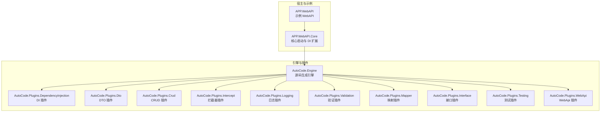
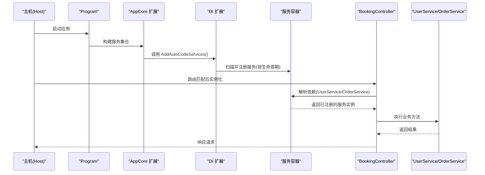
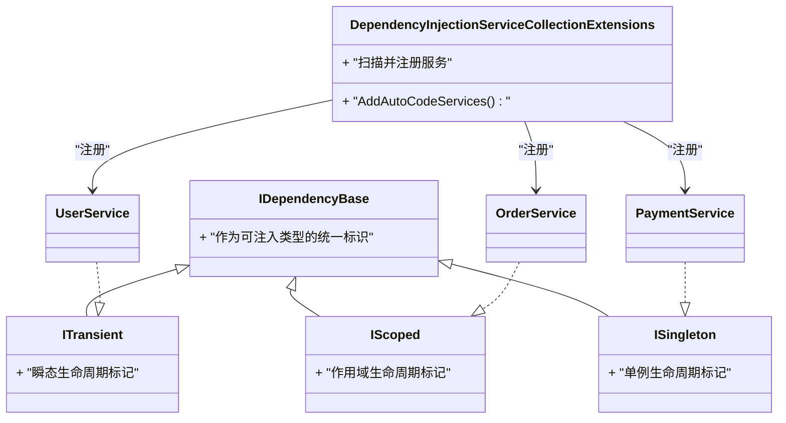
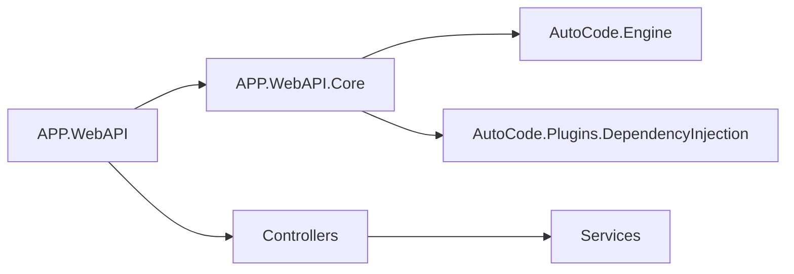

# 重构提供程序

<cite>
**本文引用的文件**   
- [AutoCode.sln](file://src/AutoCode.sln)
- [autocode.json](file://src/autocode.json)
- [Program.cs](file://src/APP.WebAPI/Program.cs)
- [ServiceCollectionExtensions.cs](file://src/APP.WebAPI.Core/Application/Extensions/ServiceCollectionExtensions.cs)
- [DependencyInjectionServiceCollectionExtensions.cs](file://src/APP.WebAPI.Core/DependencyInjection/DependencyInjectionServiceCollectionExtensions.cs)
- [IDependencyBase.cs](file://src/APP.WebAPI.Core/DependencyInjection/LifeType/IDependencyBase.cs)
- [IScoped.cs](file://src/APP.WebAPI.Core/DependencyInjection/LifeType/IScoped.cs)
- [ISingleton.cs](file://src/APP.WebAPI.Core/DependencyInjection/LifeType/ISingleton.cs)
- [ITransient.cs](file://src/APP.WebAPI.Core/DependencyInjection/LifeType/ITransient.cs)
- [UserService.cs](file://src/APP.WebAPI/Services/UserService.cs)
- [OrderService.cs](file://src/APP.WebAPI/Services/OrderService.cs)
- [OrderServiceV2.cs](file://src/APP.WebAPI/Services/OrderServiceV2.cs)
- [PaymentService.cs](file://src/APP.WebAPI/Services/PaymentService.cs)
- [BookingController.cs](file://src/APP.WebAPI/Controllers/BookingController.cs)
- [AutoCode.Engine.csproj](file://src/AutoCode.Engine/AutoCode.Engine.csproj)
- [AutoCode.DependencyInjection.csproj](file://src/AutoCode.DependencyInjection/AutoCode.DependencyInjection.csproj)
- [AutoCode.Plugins.DependencyInjection.csproj](file://src/AutoCode.Plugins.DependencyInjection/AutoCode.Plugins.DependencyInjection.csproj)
- [AutoCode.SourceGenerator.Extensions.csproj](file://src/AutoCode.Extensions.SourceGenerator/AutoCode.SourceGenerator.Extensions.csproj)
</cite>

## 目录
1. [简介](#简介)
2. [项目结构](#项目结构)
3. [核心组件](#核心组件)
4. [架构总览](#架构总览)
5. [详细组件分析](#详细组件分析)
6. [依赖关系分析](#依赖关系分析)
7. [性能考虑](#性能考虑)
8. [故障排查指南](#故障排查指南)
9. [结论](#结论)
10. [附录](#附录)

## 简介
本文件围绕“重构提供程序”这一目标，聚焦 AutoCode 工程中的依赖注入与代码生成能力，梳理从源码到运行时的装配流程、生命周期约定、以及通过插件化扩展点实现的重构与自动化能力。文档面向不同技术背景的读者，既提供高层架构图与流程图，也给出关键文件的定位与调用链说明，帮助快速理解并安全地扩展系统。

## 项目结构
AutoCode 采用多项目解决方案组织，核心引擎、插件、示例应用与测试分离清晰：
- 引擎层：负责增量式源码生成、管道编排、约定解析与诊断收集
- 插件层：按功能域拆分（如 DI、DTO、CRUD、拦截器、日志、Web API、验证等）
- 示例应用：演示如何在 WebAPI 项目中启用 DI、服务注册与控制器使用
- 配置与模板：集中管理生成行为与可选模板

图表来源
- [AutoCode.Engine.csproj](file://src/AutoCode.Engine/AutoCode.Engine.csproj)
- [AutoCode.Plugins.DependencyInjection.csproj](file://src/AutoCode.Plugins.DependencyInjection/AutoCode.Plugins.DependencyInjection.csproj)
- [AutoCode.Plugins.Dto.csproj](file://src/AutoCode.Plugins.Dto/AutoCode.Plugins.Dto.csproj)
- [AutoCode.Plugins.Crud.csproj](file://src/AutoCode.Plugins.Crud/AutoCode.Plugins.Crud.csproj)
- [AutoCode.Plugins.Intercept.csproj](file://src/AutoCode.Plugins.Intercept/AutoCode.Plugins.Intercept.csproj)
- [AutoCode.Plugins.Logging.csproj](file://src/AutoCode.Plugins.Logging/AutoCode.Plugins.Logging.csproj)
- [AutoCode.Plugins.Validation.csproj](file://src/AutoCode.Plugins.Validation/AutoCode.Plugins.Validation.csproj)
- [AutoCode.Plugins.Mapper.csproj](file://src/AutoCode.Plugins.Mapper/AutoCode.Plugins.Mapper.csproj)
- [AutoCode.Plugins.Interface.csproj](file://src/AutoCode.Plugins.Interface/AutoCode.Plugins.Interface.csproj)
- [AutoCode.Plugins.Testing.csproj](file://src/AutoCode.Plugins.Testing/AutoCode.Plugins.Testing.csproj)
- [AutoCode.Plugins.WebApi.csproj](file://src/AutoCode.Plugins.WebApi/AutoCode.Plugins.WebApi.csproj)

章节来源
- [AutoCode.sln](file://src/AutoCode.sln)

## 核心组件
- 依赖注入扩展：在应用启动阶段统一注册服务，支持基于接口的生命周期约定
- 生命周期约定：通过空标记接口区分 Transient、Scoped、Singleton
- 示例服务：展示如何声明服务并在控制器中消费
- 控制器：演示依赖注入的端到端使用

章节来源
- [Program.cs](file://src/APP.WebAPI/Program.cs)
- [ServiceCollectionExtensions.cs](file://src/APP.WebAPI.Core/Application/Extensions/ServiceCollectionExtensions.cs)
- [DependencyInjectionServiceCollectionExtensions.cs](file://src/APP.WebAPI.Core/DependencyInjection/DependencyInjectionServiceCollectionExtensions.cs)
- [IDependencyBase.cs](file://src/APP.WebAPI.Core/DependencyInjection/LifeType/IDependencyBase.cs)
- [IScoped.cs](file://src/APP.WebAPI.Core/DependencyInjection/LifeType/IScoped.cs)
- [ISingleton.cs](file://src/APP.WebAPI.Core/DependencyInjection/LifeType/ISingleton.cs)
- [ITransient.cs](file://src/APP.WebAPI.Core/DependencyInjection/LifeType/ITransient.cs)
- [UserService.cs](file://src/APP.WebAPI/Services/UserService.cs)
- [OrderService.cs](file://src/APP.WebAPI/Services/OrderService.cs)
- [OrderServiceV2.cs](file://src/APP.WebAPI/Services/OrderServiceV2.cs)
- [PaymentService.cs](file://src/APP.WebAPI/Services/PaymentService.cs)
- [BookingController.cs](file://src/APP.WebAPI/Controllers/BookingController.cs)

## 架构总览
下图展示了从应用启动到请求处理的完整链路，包括 DI 容器初始化、服务发现与注册、以及控制器对服务的依赖注入。

图表来源
- [Program.cs](file://src/APP.WebAPI/Program.cs)
- [ServiceCollectionExtensions.cs](file://src/APP.WebAPI.Core/Application/Extensions/ServiceCollectionExtensions.cs)
- [DependencyInjectionServiceCollectionExtensions.cs](file://src/APP.WebAPI.Core/DependencyInjection/DependencyInjectionServiceCollectionExtensions.cs)
- [BookingController.cs](file://src/APP.WebAPI/Controllers/BookingController.cs)
- [UserService.cs](file://src/APP.WebAPI/Services/UserService.cs)
- [OrderService.cs](file://src/APP.WebAPI/Services/OrderService.cs)

## 详细组件分析

### 依赖注入扩展与生命周期约定
- 设计要点
  - 通过空标记接口定义生命周期：ITransient、IScoped、ISingleton
  - 基类或约定接口 IDependencyBase 用于统一识别可注入类型
  - 扩展方法统一封装扫描与注册逻辑，简化宿主集成
- 典型流程
  - 宿主调用扩展方法
  - 扩展方法扫描程序集，识别实现了生命周期接口的类型
  - 根据接口与实现的关系，将服务与实现注册到容器
  - 运行时由容器按需解析

图表来源
- [IDependencyBase.cs](file://src/APP.WebAPI.Core/DependencyInjection/LifeType/IDependencyBase.cs)
- [IScoped.cs](file://src/APP.WebAPI.Core/DependencyInjection/LifeType/IScoped.cs)
- [ISingleton.cs](file://src/APP.WebAPI.Core/DependencyInjection/LifeType/ISingleton.cs)
- [ITransient.cs](file://src/APP.WebAPI.Core/DependencyInjection/LifeType/ITransient.cs)
- [DependencyInjectionServiceCollectionExtensions.cs](file://src/APP.WebAPI.Core/DependencyInjection/DependencyInjectionServiceCollectionExtensions.cs)
- [UserService.cs](file://src/APP.WebAPI/Services/UserService.cs)
- [OrderService.cs](file://src/APP.WebAPI/Services/OrderService.cs)
- [PaymentService.cs](file://src/APP.WebAPI/Services/PaymentService.cs)

章节来源
- [DependencyInjectionServiceCollectionExtensions.cs](file://src/APP.WebAPI.Core/DependencyInjection/DependencyInjectionServiceCollectionExtensions.cs)
- [IDependencyBase.cs](file://src/APP.WebAPI.Core/DependencyInjection/LifeType/IDependencyBase.cs)
- [IScoped.cs](file://src/APP.WebAPI.Core/DependencyInjection/LifeType/IScoped.cs)
- [ISingleton.cs](file://src/APP.WebAPI.Core/DependencyInjection/LifeType/ISingleton.cs)
- [ITransient.cs](file://src/APP.WebAPI.Core/DependencyInjection/LifeType/ITransient.cs)

### 应用启动与服务注册
- 关键点
  - Program 负责创建 Host 与 ConfigureWebHostDefaults
  - AppCore 扩展方法聚合常用初始化步骤
  - DI 扩展方法完成服务扫描与注册
- 建议
  - 将业务无关的初始化放在 AppCore
  - 将服务注册逻辑集中在 DI 扩展中，便于复用与测试

章节来源
- [Program.cs](file://src/APP.WebAPI/Program.cs)
- [ServiceCollectionExtensions.cs](file://src/APP.WebAPI.Core/Application/Extensions/ServiceCollectionExtensions.cs)
- [DependencyInjectionServiceCollectionExtensions.cs](file://src/APP.WebAPI.Core/DependencyInjection/DependencyInjectionServiceCollectionExtensions.cs)

### 控制器与服务消费
- 关键点
  - BookingController 通过构造函数注入 UserService、OrderService 等
  - 控制器方法直接调用服务，保持薄控制器职责
- 建议
  - 控制器仅做参数校验与结果包装
  - 复杂逻辑下沉至服务层

章节来源
- [BookingController.cs](file://src/APP.WebAPI/Controllers/BookingController.cs)
- [UserService.cs](file://src/APP.WebAPI/Services/UserService.cs)
- [OrderService.cs](file://src/APP.WebAPI/Services/OrderService.cs)
- [OrderServiceV2.cs](file://src/APP.WebAPI/Services/OrderServiceV2.cs)
- [PaymentService.cs](file://src/APP.WebAPI/Services/PaymentService.cs)

### 代码生成与插件体系
- 关键点
  - AutoCode.Engine 提供增量式源码生成与管道编排
  - 各插件按领域提供代码生成能力（DI、DTO、CRUD、拦截器、日志、验证、映射、接口、测试、WebApi）
  - 宿主可通过扩展点启用所需插件
- 建议
  - 新增插件时遵循现有命名与结构约定
  - 通过配置开关控制插件启用，避免不必要的生成开销

章节来源
- [AutoCode.Engine.csproj](file://src/AutoCode.Engine/AutoCode.Engine.csproj)
- [AutoCode.Plugins.DependencyInjection.csproj](file://src/AutoCode.Plugins.DependencyInjection/AutoCode.Plugins.DependencyInjection.csproj)
- [AutoCode.Plugins.Dto.csproj](file://src/AutoCode.Plugins.Dto/AutoCode.Plugins.Dto.csproj)
- [AutoCode.Plugins.Crud.csproj](file://src/AutoCode.Plugins.Crud/AutoCode.Plugins.Crud.csproj)
- [AutoCode.Plugins.Intercept.csproj](file://src/AutoCode.Plugins.Intercept/AutoCode.Plugins.Intercept.csproj)
- [AutoCode.Plugins.Logging.csproj](file://src/AutoCode.Plugins.Logging/AutoCode.Plugins.Logging.csproj)
- [AutoCode.Plugins.Validation.csproj](file://src/AutoCode.Plugins.Validation/AutoCode.Plugins.Validation.csproj)
- [AutoCode.Plugins.Mapper.csproj](file://src/AutoCode.Plugins.Mapper/AutoCode.Plugins.Mapper.csproj)
- [AutoCode.Plugins.Interface.csproj](file://src/AutoCode.Plugins.Interface/AutoCode.Plugins.Interface.csproj)
- [AutoCode.Plugins.Testing.csproj](file://src/AutoCode.Plugins.Testing/AutoCode.Plugins.Testing.csproj)
- [AutoCode.Plugins.WebApi.csproj](file://src/AutoCode.Plugins.WebApi/AutoCode.Plugins.WebApi.csproj)

## 依赖关系分析
- 组件耦合
  - 宿主应用依赖 APP.WebAPI.Core 提供的扩展方法
  - APP.WebAPI.Core 依赖 AutoCode.Engine 与 DI 插件
  - 控制器依赖具体服务实现，但不感知容器细节
- 外部依赖
  - .NET 运行时与 ASP.NET Core 框架
  - Roslyn 源码生成基础设施（由 Engine 与插件使用）

图表来源
- [AutoCode.sln](file://src/AutoCode.sln)
- [AutoCode.Engine.csproj](file://src/AutoCode.Engine/AutoCode.Engine.csproj)
- [AutoCode.Plugins.DependencyInjection.csproj](file://src/AutoCode.Plugins.DependencyInjection/AutoCode.Plugins.DependencyInjection.csproj)
- [Program.cs](file://src/APP.WebAPI/Program.cs)
- [BookingController.cs](file://src/APP.WebAPI/Controllers/BookingController.cs)

章节来源
- [AutoCode.sln](file://src/AutoCode.sln)
- [AutoCode.Engine.csproj](file://src/AutoCode.Engine/AutoCode.Engine.csproj)
- [AutoCode.Plugins.DependencyInjection.csproj](file://src/AutoCode.Plugins.DependencyInjection/AutoCode.Plugins.DependencyInjection.csproj)
- [AutoCode.DependencyInjection.csproj](file://src/AutoCode.DependencyInjection/AutoCode.DependencyInjection.csproj)
- [AutoCode.SourceGenerator.Extensions.csproj](file://src/AutoCode.Extensions.SourceGenerator/AutoCode.SourceGenerator.Extensions.csproj)

## 性能考虑
- 增量生成：利用 Engine 的增量特性减少重复编译与生成时间
- 按需启用插件：仅在需要时启用对应插件，降低扫描与生成开销
- 生命周期选择：合理选择 Transient/Scoped/Singleton，避免过度共享状态或频繁创建对象
- 控制器瘦身：将重逻辑下沉至服务层，提升请求处理效率

## 故障排查指南
- 服务未找到
  - 检查是否调用了统一的 DI 扩展方法进行注册
  - 确认服务实现了正确的生命周期标记接口
- 循环依赖
  - 检查服务间是否存在循环引用，必要时引入抽象或重构依赖方向
- 生命周期误用
  - 确保 Scoped 服务不持有 Singleton 状态的长生命周期引用
- 生成失败
  - 查看 Engine 与插件的诊断输出，修正模型或配置错误

章节来源
- [DependencyInjectionServiceCollectionExtensions.cs](file://src/APP.WebAPI.Core/DependencyInjection/DependencyInjectionServiceCollectionExtensions.cs)
- [ServiceCollectionExtensions.cs](file://src/APP.WebAPI.Core/Application/Extensions/ServiceCollectionExtensions.cs)
- [Program.cs](file://src/APP.WebAPI/Program.cs)

## 结论
通过清晰的依赖注入约定与插件化的源码生成体系，AutoCode 为“重构提供程序”提供了稳定、可扩展的基础设施。建议在新增功能时优先遵循现有约定，借助 Engine 与插件机制实现最小侵入式的自动化与重构能力。

## 附录
- 配置文件：autocode.json 可用于集中管理生成行为与选项
- 模板与外部工具：DotTemplate 相关项目可用于自定义代码模板

章节来源
- [autocode.json](file://src/autocode.json)