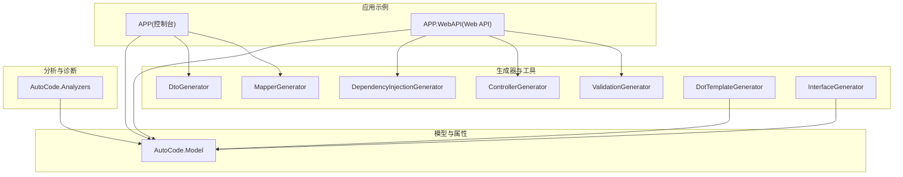
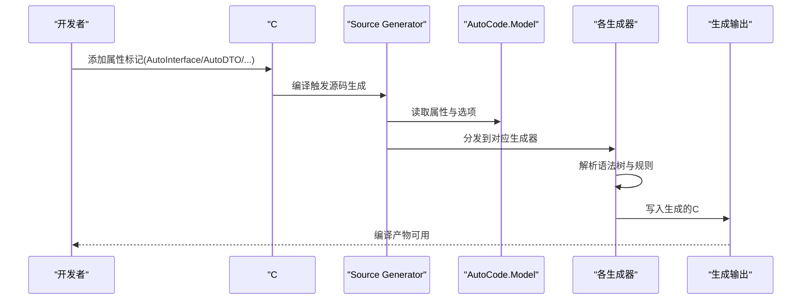
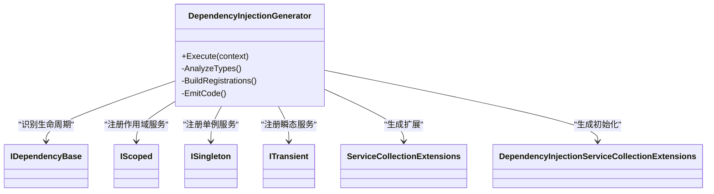
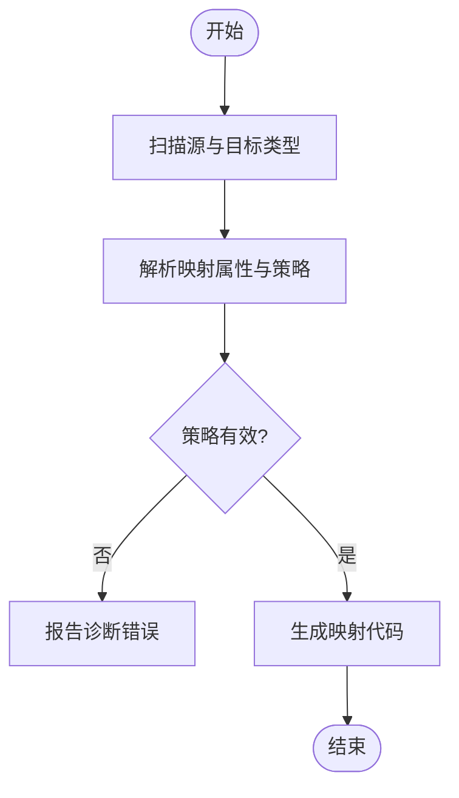
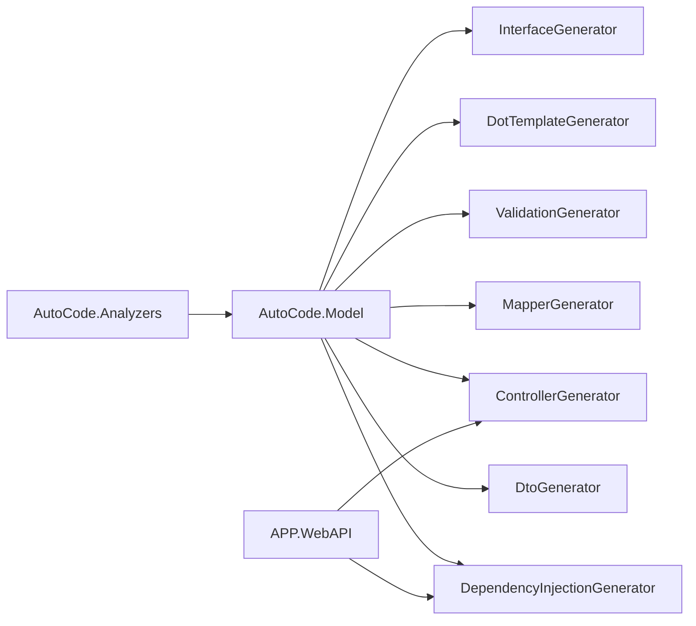

# 验证代码生成器

<cite>
**本文档引用的文件**   
- [README.md](file://README.md)
- [AutoCode.sln](file://src/AutoCode.sln)
- [Program.cs](file://src/APP/Program.cs)
- [AutoInterface.cs](file://src/APP/AutoInterface.cs)
- [AutoInterClass.cs](file://src/APP/AutoInterClass.cs)
- [DependencyInjectionGenerator.cs](file://src/AutoCode.DependencyInjection/DependencyInjectionGenerator.cs)
- [DtoGenerator.cs](file://src/AutoCode.Dto/DtoGenerator.cs)
- [MapperGenerator.cs](file://src/AutoCode.Map/MapperGenerator.cs)
- [ValidationGenerator.cs](file://src/AutoCode.Validation/ValidationGenerator.cs)
- [ControllerGenerator.cs](file://src/AutoCode.WebApi/ControllerGenerator.cs)
- [DotTemplateGenerator.cs](file://src/AutoCode.XmlTemplate.SourceGenerator/DotTemplateGenerator.cs)
- [InterfaceGenerator.cs](file://src/AutoCodeGenerator/InterfaceAutoBuilder/InterfaceGenerator.cs)
- [InterfaceBuilder.cs](file://src/AutoCodeGenerator/InterfaceAutoBuilder/InterfaceBuilder.cs)
- [InterfaceSpec.cs](file://src/AutoCodeGenerator/InterfaceAutoBuilder/InterfaceSpec.cs)
- [AutoCodeOptions.cs](file://src/AutoCode.Model/AutoCodeOptions.cs)
- [AutoInterfaceAttribute.cs](file://src/AutoCode.Model/InterfaceAttribute/AutoInterfaceAttribute.cs)
- [AutoIgnoreAttribute.cs](file://src/AutoCode.Model/InterfaceAttribute/AutoIgnoreAttribute.cs)
- [AutoDTOAttribute.cs](file://src/AutoCode.Model/AutoDTOAttribute.cs)
- [AutoControllerAttribute.cs](file://src/AutoCode.Model/AutoControllerAttribute.cs)
- [AutoValidatorAttribute.cs](file://src/AutoCode.Model/AutoValidatorAttribute.cs)
- [ServiceCollectionExtensions.cs](file://src/APP.WebAPI.Core/Application/Extensions/ServiceCollectionExtensions.cs)
- [DependencyInjectionServiceCollectionExtensions.cs](file://src/APP.WebAPI.Core/DependencyInjection/DependencyInjectionServiceCollectionExtensions.cs)
- [IDependencyBase.cs](file://src/APP.WebAPI.Core/DependencyInjection/LifeType/IDependencyBase.cs)
- [IScoped.cs](file://src/APP.WebAPI.Core/DependencyInjection/LifeType/IScoped.cs)
- [ISingleton.cs](file://src/APP.WebAPI.Core/DependencyInjection/LifeType/ISingleton.cs)
- [ITransient.cs](file://src/APP.WebAPI.Core/DependencyInjection/LifeType/ITransient.cs)
- [BookingController.cs](file://src/APP.WebAPI/Controllers/BookingController.cs)
- [BookingService.cs](file://src/APP.WebAPI/Services/BookingService.cs)
- [Program.cs](file://src/APP.WebAPI/Program.cs)
- [appsettings.json](file://src/APP.WebAPI/appsettings.json)
- [launchSettings.json](file://src/APP.WebAPI/Properties/launchSettings.json)
- [Behavior.cs](file://src/Auto.MapModels/Behavior.cs)
- [UserInfo.cs](file://src/APP.Map/UserInfo.cs)
- [MapPropertyAttribute.cs](file://src/AutoCode.Model/AutoMapperModel/MapPropertyAttribute.cs)
- [MapValueAttribute.cs](file://src/AutoCode.Model/AutoMapperModel/MapValueAttribute.cs)
- [EnumMappingStrategy.cs](file://src/AutoCode.Model/AutoMapperModel/EnumMappingStrategy.cs)
- [RequiredMappingStrategy.cs](file://src/AutoCode.Model/AutoMapperModel/RequiredMappingStrategy.cs)
- [PropertyNameMappingStrategy.cs](file://src/AutoCode.Model/AutoMapperModel/PropertyNameMappingStrategy.cs)
- [MemberVisibility.cs](file://src/AutoCode.Model/AutoMapperModel/MemberVisibility.cs)
- [MappingConversionType.cs](file://src/AutoCode.Model/AutoMapperModel/MappingConversionType.cs)
- [FormatProviderAttribute.cs](file://src/AutoCode.Model/AutoMapperModel/FormatProviderAttribute.cs)
- [IgnoreObsoleteMembersStrategy.cs](file://src/AutoCode.Model/AutoMapperModel/IgnoreObsoleteMembersStrategy.cs)
- [MapperAttribute.cs](file://src/AutoCode.Model/AutoMapperModel/MapperAttribute.cs)
- [DiagnosticDescriptors.cs](file://src/AutoCode.Map/Diagnostics/DiagnosticDescriptors.cs)
- [ImmutableEquatableArray.cs](file://src/AutoCode.Map/Helpers/ImmutableEquatableArray.cs)
- [IncrementalValuesProviderExtensions.cs](file://src/AutoCode.Map/Helpers/IncrementalValuesProviderExtensions.cs)
- [AutoCode.Analyzers.csproj](file://src/AutoCode.Analyzers/AutoCode.Analyzers.csproj)
- [InterfaceDivergenceAnalyzer.cs](file://src/AutoCode.Analyzers/Analyzers/InterfaceDivergenceAnalyzer.cs)
- [MissingAutoInterfaceAnalyzer.cs](file://src/AutoCode.Analyzers/Analyzers/MissingAutoInterfaceAnalyzer.cs)
- [UnusedAutoIgnoreAnalyzer.cs](file://src/AutoCode.Analyzers/Analyzers/UnusedAutoIgnoreAnalyzer.cs)
- [AddAutoInterfaceCodeFix.cs](file://src/AutoCode.Analyzers/CodeFixes/AddAutoInterfaceCodeFix.cs)
- [RemoveAutoIgnoreCodeFix.cs](file://src/AutoCode.Analyzers/CodeFixes/RemoveAutoIgnoreCodeFix.cs)
- [AutoCodeDiagnosticDescriptors.cs](file://src/AutoCode.Analyzers/Diagnostics/AutoCodeDiagnosticDescriptors.cs)
- [AutoCode.DotTemplate.SourceGenerator.csproj](file://src/AutoCode.XmlTemplate.SourceGenerator/AutoCode.DotTemplate.SourceGenerator.csproj)
- [CSData.cs](file://src/AutoCode.XmlTemplate.SourceGenerator/CSData.cs)
- [SyntaxNodeConvert.cs](file://src/AutoCode.XmlTemplate.SourceGenerator/SyntaxNodeConvert.cs)
- [DotHelp.cs](file://src/AutoCode.XmlTemplate.SourceGenerator/Extend/DotHelp.cs)
- [DiagnosticIds.cs](file://src/AutoCode.XmlTemplate.SourceGenerator/Extend/DiagnosticIds.cs)
- [AutoCode.SourceGenerator.Extensions.csproj](file://src/AutoCode.Extensions.SourceGenerator/AutoCode.SourceGenerator.Extensions.csproj)
- [AutoCode.pdma.json](file://src/Doc/AutoCode.pdma.json)
</cite>

## 目录
1. [简介](#简介)
2. [项目结构](#项目结构)
3. [核心组件](#核心组件)
4. [架构总览](#架构总览)
5. [详细组件分析](#详细组件分析)
6. [依赖关系分析](#依赖关系分析)
7. [性能考虑](#性能考虑)
8. [故障排查指南](#故障排查指南)
9. [结论](#结论)
10. [附录](#附录)

## 简介
本仓库是一个面向 .NET 的代码生成与静态分析工具集，围绕“验证代码生成”这一目标，提供：
- 接口、DTO、映射器、控制器、验证器的源码级自动生成能力
- 基于属性标记的声明式配置（如 AutoInterface、AutoDTO、AutoController、AutoValidator）
- Roslyn 分析器与诊断修复，保障接口一致性、避免误用
- 模板化代码生成（dot 模板），支持自定义输出格式
- Web API 示例工程，演示依赖注入、控制器与服务的使用方式

该工具链通过 Source Generator 与 Analyzers 在编译期完成代码生成与校验，减少样板代码，提升一致性与可维护性。

## 项目结构
整体采用多项目解决方案组织，按职责划分模块：
- APP：控制台入口与基础示例
- APP.WebAPI：Web API 示例，展示控制器与服务
- AutoCode.*：各生成器与分析器模块
- AutoCode.Model：模型与属性定义
- AutoCode.XmlTemplate.SourceGenerator：模板引擎集成
- Doc：文档与数据库设计文件

图表来源
- [AutoCode.sln](file://src/AutoCode.sln)
- [Program.cs](file://src/APP/Program.cs)
- [Program.cs](file://src/APP.WebAPI/Program.cs)

章节来源
- [AutoCode.sln](file://src/AutoCode.sln)
- [README.md](file://README.md)

## 核心组件
- 依赖注入生成器：根据生命周期接口自动注册服务
- DTO 生成器：从模型或属性生成数据传输对象
- 映射器生成器：基于属性与策略生成类型间映射代码
- 验证器生成器：依据验证属性生成校验逻辑
- 控制器生成器：根据路由与动作生成 Web API 控制器骨架
- 模板生成器：使用 dot 模板渲染 C# 代码
- 接口生成器：从规范与构建器生成接口实现

章节来源
- [DependencyInjectionGenerator.cs](file://src/AutoCode.DependencyInjection/DependencyInjectionGenerator.cs)
- [DtoGenerator.cs](file://src/AutoCode.Dto/DtoGenerator.cs)
- [MapperGenerator.cs](file://src/AutoCode.Map/MapperGenerator.cs)
- [ValidationGenerator.cs](file://src/AutoCode.Validation/ValidationGenerator.cs)
- [ControllerGenerator.cs](file://src/AutoCode.WebApi/ControllerGenerator.cs)
- [DotTemplateGenerator.cs](file://src/AutoCode.XmlTemplate.SourceGenerator/DotTemplateGenerator.cs)
- [InterfaceGenerator.cs](file://src/AutoCodeGenerator/InterfaceAutoBuilder/InterfaceGenerator.cs)

## 架构总览
下图展示了从源代码到生成代码的整体流程，包括属性扫描、规则解析、模板渲染与输出。

图表来源
- [AutoCodeOptions.cs](file://src/AutoCode.Model/AutoCodeOptions.cs)
- [AutoInterfaceAttribute.cs](file://src/AutoCode.Model/InterfaceAttribute/AutoInterfaceAttribute.cs)
- [AutoDTOAttribute.cs](file://src/AutoCode.Model/AutoDTOAttribute.cs)
- [AutoControllerAttribute.cs](file://src/AutoCode.Model/AutoControllerAttribute.cs)
- [AutoValidatorAttribute.cs](file://src/AutoCode.Model/AutoValidatorAttribute.cs)
- [DependencyInjectionGenerator.cs](file://src/AutoCode.DependencyInjection/DependencyInjectionGenerator.cs)
- [DtoGenerator.cs](file://src/AutoCode.Dto/DtoGenerator.cs)
- [MapperGenerator.cs](file://src/AutoCode.Map/MapperGenerator.cs)
- [ValidationGenerator.cs](file://src/AutoCode.Validation/ValidationGenerator.cs)
- [ControllerGenerator.cs](file://src/AutoCode.WebApi/ControllerGenerator.cs)
- [DotTemplateGenerator.cs](file://src/AutoCode.XmlTemplate.SourceGenerator/DotTemplateGenerator.cs)

## 详细组件分析

### 依赖注入生成器
- 功能：识别生命周期接口（IScoped、ISingleton、ITransient）并自动注册服务
- 输入：包含生命周期接口的类型与依赖项
- 处理：解析类型信息、构造注册表达式
- 输出：ServiceCollection 扩展方法或初始化代码

图表来源
- [DependencyInjectionGenerator.cs](file://src/AutoCode.DependencyInjection/DependencyInjectionGenerator.cs)
- [IDependencyBase.cs](file://src/APP.WebAPI.Core/DependencyInjection/LifeType/IDependencyBase.cs)
- [IScoped.cs](file://src/APP.WebAPI.Core/DependencyInjection/LifeType/IScoped.cs)
- [ISingleton.cs](file://src/APP.WebAPI.Core/DependencyInjection/LifeType/ISingleton.cs)
- [ITransient.cs](file://src/APP.WebAPI.Core/DependencyInjection/LifeType/ITransient.cs)
- [ServiceCollectionExtensions.cs](file://src/APP.WebAPI.Core/Application/Extensions/ServiceCollectionExtensions.cs)
- [DependencyInjectionServiceCollectionExtensions.cs](file://src/APP.WebAPI.Core/DependencyInjection/DependencyInjectionServiceCollectionExtensions.cs)

章节来源
- [DependencyInjectionGenerator.cs](file://src/AutoCode.DependencyInjection/DependencyInjectionGenerator.cs)
- [ServiceCollectionExtensions.cs](file://src/APP.WebAPI.Core/Application/Extensions/ServiceCollectionExtensions.cs)
- [DependencyInjectionServiceCollectionExtensions.cs](file://src/APP.WebAPI.Core/DependencyInjection/DependencyInjectionServiceCollectionExtensions.cs)

### DTO 生成器
- 功能：根据模型与属性生成数据传输对象
- 输入：模型类型与 AutoDTOAttribute
- 处理：提取成员、转换类型、生成类与属性
- 输出：DTO 类文件

章节来源
- [DtoGenerator.cs](file://src/AutoCode.Dto/DtoGenerator.cs)
- [AutoDTOAttribute.cs](file://src/AutoCode.Model/AutoDTOAttribute.cs)

### 映射器生成器
- 功能：基于 MapPropertyAttribute、MapValueAttribute 等生成类型映射代码
- 输入：源类型、目标类型与映射策略
- 处理：解析属性、应用策略（枚举、命名、可见性等）、生成映射函数
- 输出：映射器类与方法

图表来源
- [MapperGenerator.cs](file://src/AutoCode.Map/MapperGenerator.cs)
- [MapPropertyAttribute.cs](file://src/AutoCode.Model/AutoMapperModel/MapPropertyAttribute.cs)
- [MapValueAttribute.cs](file://src/AutoCode.Model/AutoMapperModel/MapValueAttribute.cs)
- [EnumMappingStrategy.cs](file://src/AutoCode.Model/AutoMapperModel/EnumMappingStrategy.cs)
- [RequiredMappingStrategy.cs](file://src/AutoCode.Model/AutoMapperModel/RequiredMappingStrategy.cs)
- [PropertyNameMappingStrategy.cs](file://src/AutoCode.Model/AutoMapperModel/PropertyNameMappingStrategy.cs)
- [MemberVisibility.cs](file://src/AutoCode.Model/AutoMapperModel/MemberVisibility.cs)
- [MappingConversionType.cs](file://src/AutoCode.Model/AutoMapperModel/MappingConversionType.cs)
- [FormatProviderAttribute.cs](file://src/AutoCode.Model/AutoMapperModel/FormatProviderAttribute.cs)
- [IgnoreObsoleteMembersStrategy.cs](file://src/AutoCode.Model/AutoMapperModel/IgnoreObsoleteMembersStrategy.cs)
- [MapperAttribute.cs](file://src/AutoCode.Model/AutoMapperModel/MapperAttribute.cs)

章节来源
- [MapperGenerator.cs](file://src/AutoCode.Map/MapperGenerator.cs)
- [DiagnosticDescriptors.cs](file://src/AutoCode.Map/Diagnostics/DiagnosticDescriptors.cs)
- [ImmutableEquatableArray.cs](file://src/AutoCode.Map/Helpers/ImmutableEquatableArray.cs)
- [IncrementalValuesProviderExtensions.cs](file://src/AutoCode.Map/Helpers/IncrementalValuesProviderExtensions.cs)

### 验证器生成器
- 功能：根据验证属性生成校验逻辑
- 输入：模型与验证属性
- 处理：解析验证规则、生成验证方法与错误消息
- 输出：验证器类

章节来源
- [ValidationGenerator.cs](file://src/AutoCode.Validation/ValidationGenerator.cs)
- [AutoValidatorAttribute.cs](file://src/AutoCode.Model/AutoValidatorAttribute.cs)

### 控制器生成器
- 功能：根据路由与动作生成 Web API 控制器骨架
- 输入：控制器属性与动作定义
- 处理：解析路由、参数、返回类型，生成控制器类与方法
- 输出：控制器文件

章节来源
- [ControllerGenerator.cs](file://src/AutoCode.WebApi/ControllerGenerator.cs)
- [AutoControllerAttribute.cs](file://src/AutoCode.Model/AutoControllerAttribute.cs)

### 模板生成器
- 功能：使用 dot 模板渲染 C# 代码
- 输入：模板文件与数据模型
- 处理：加载模板、填充数据、生成代码
- 输出：C# 源文件

章节来源
- [DotTemplateGenerator.cs](file://src/AutoCode.XmlTemplate.SourceGenerator/DotTemplateGenerator.cs)
- [CSData.cs](file://src/AutoCode.XmlTemplate.SourceGenerator/CSData.cs)
- [SyntaxNodeConvert.cs](file://src/AutoCode.XmlTemplate.SourceGenerator/SyntaxNodeConvert.cs)
- [DotHelp.cs](file://src/AutoCode.XmlTemplate.SourceGenerator/Extend/DotHelp.cs)
- [DiagnosticIds.cs](file://src/AutoCode.XmlTemplate.SourceGenerator/Extend/DiagnosticIds.cs)

### 接口生成器
- 功能：从规范与构建器生成接口实现
- 输入：接口规范与构建器
- 处理：解析规范、生成接口代码
- 输出：接口文件

章节来源
- [InterfaceGenerator.cs](file://src/AutoCodeGenerator/InterfaceAutoBuilder/InterfaceGenerator.cs)
- [InterfaceBuilder.cs](file://src/AutoCodeGenerator/InterfaceAutoBuilder/InterfaceBuilder.cs)
- [InterfaceSpec.cs](file://src/AutoCodeGenerator/InterfaceAutoBuilder/InterfaceSpec.cs)

## 依赖关系分析
- 生成器依赖 AutoCode.Model 中的属性与选项
- 分析器依赖模型属性以提供诊断与修复
- Web API 示例依赖生成器输出的控制器与服务
- 模板生成器依赖外部模板与数据模型

图表来源
- [AutoCode.Model.csproj](file://src/AutoCode.Model/AutoCode.Model.csproj)
- [AutoCode.Analyzers.csproj](file://src/AutoCode.Analyzers/AutoCode.Analyzers.csproj)
- [APP.WebAPI.csproj](file://src/APP.WebAPI/APP.WebAPI.csproj)

章节来源
- [AutoCode.sln](file://src/AutoCode.sln)

## 性能考虑
- 增量编译：利用 Roslyn 增量值提供者减少重复工作
- 缓存与不可变数组：提高比较与查找效率
- 模板预加载：减少 IO 开销
- 并行处理：对独立类型进行并发分析

[本节为通用指导，不直接分析具体文件]

## 故障排查指南
- 接口分歧分析：检查接口定义与实现是否一致
- 缺失接口分析：确保标记的属性正确且存在对应接口
- 未使用的忽略属性：清理不必要的 AutoIgnore 标记
- 诊断描述：查看诊断 ID 与消息定位问题

章节来源
- [InterfaceDivergenceAnalyzer.cs](file://src/AutoCode.Analyzers/Analyzers/InterfaceDivergenceAnalyzer.cs)
- [MissingAutoInterfaceAnalyzer.cs](file://src/AutoCode.Analyzers/Analyzers/MissingAutoInterfaceAnalyzer.cs)
- [UnusedAutoIgnoreAnalyzer.cs](file://src/AutoCode.Analyzers/Analyzers/UnusedAutoIgnoreAnalyzer.cs)
- [AddAutoInterfaceCodeFix.cs](file://src/AutoCode.Analyzers/CodeFixes/AddAutoInterfaceCodeFix.cs)
- [RemoveAutoIgnoreCodeFix.cs](file://src/AutoCode.Analyzers/CodeFixes/RemoveAutoIgnoreCodeFix.cs)
- [AutoCodeDiagnosticDescriptors.cs](file://src/AutoCode.Analyzers/Diagnostics/AutoCodeDiagnosticDescriptors.cs)

## 结论
本工具链通过属性驱动的源码生成与静态分析，显著减少了样板代码，提升了开发效率与代码质量。结合模板引擎与依赖注入，能够快速搭建一致的 Web API 与服务层结构。建议在实际项目中逐步引入，配合分析器与诊断，持续优化代码结构与生成结果。

[本节为总结，不直接分析具体文件]

## 附录
- 示例控制器与服务：用于演示生成器输出与运行时集成
- 映射模型与用户信息：展示映射器与 DTO 的实际用法
- 配置文件与启动设置：说明 Web API 的运行环境

章节来源
- [BookingController.cs](file://src/APP.WebAPI/Controllers/BookingController.cs)
- [BookingService.cs](file://src/APP.WebAPI/Services/BookingService.cs)
- [Program.cs](file://src/APP.WebAPI/Program.cs)
- [appsettings.json](file://src/APP.WebAPI/appsettings.json)
- [launchSettings.json](file://src/APP.WebAPI/Properties/launchSettings.json)
- [Behavior.cs](file://src/Auto.MapModels/Behavior.cs)
- [UserInfo.cs](file://src/APP.Map/UserInfo.cs)