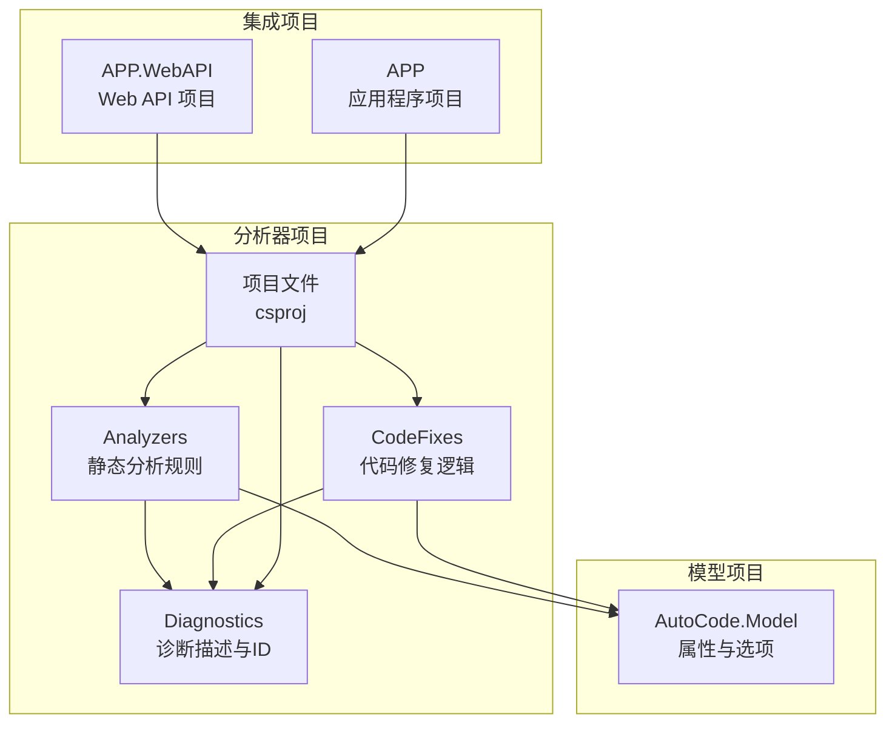
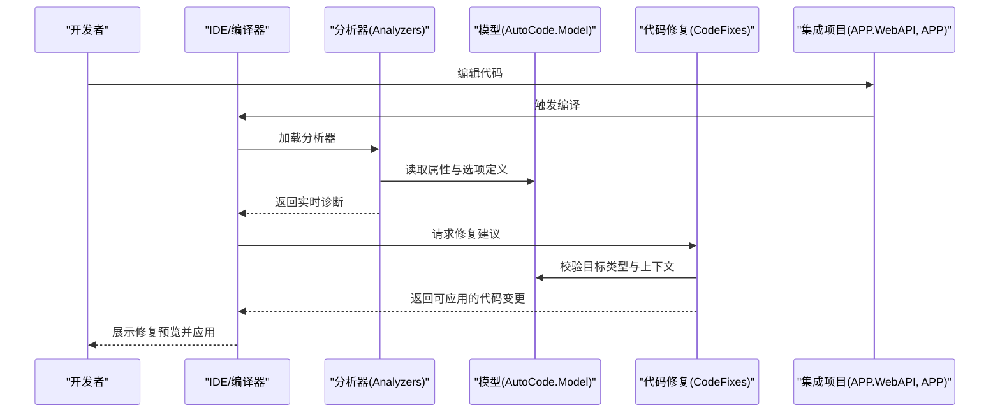
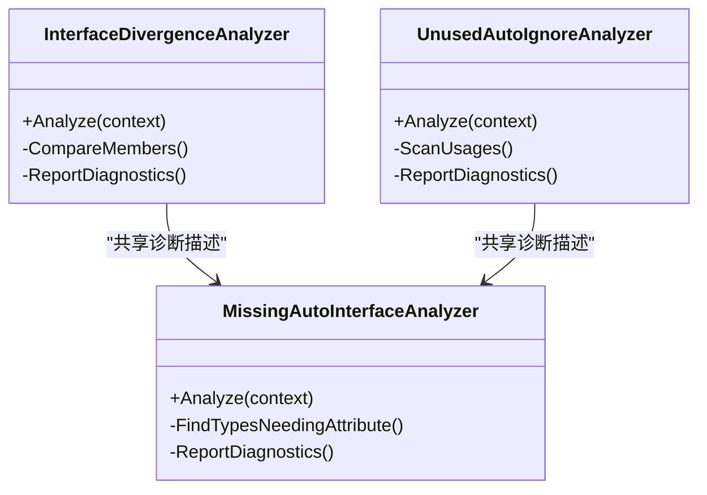
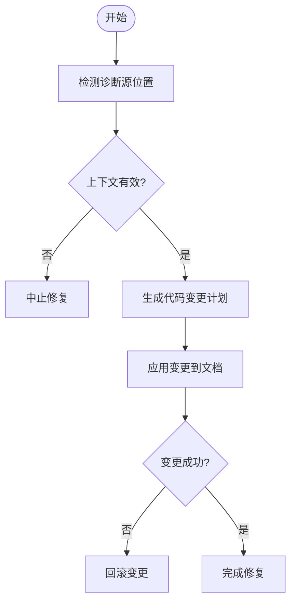
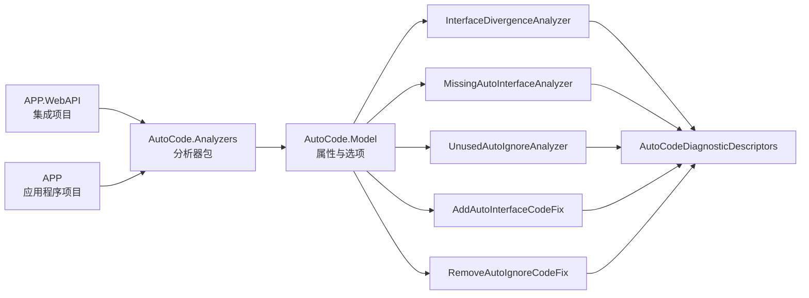

# 分析器系统

<cite>
**本文引用的文件**   
- [AutoCode.Analyzers.csproj](file://src/AutoCode.Analyzers/AutoCode.Analyzers.csproj)
- [InterfaceDivergenceAnalyzer.cs](file://src/AutoCode.Analyzers/Analyzers/InterfaceDivergenceAnalyzer.cs)
- [MissingAutoInterfaceAnalyzer.cs](file://src/AutoCode.Analyzers/Analyzers/MissingAutoInterfaceAnalyzer.cs)
- [UnusedAutoIgnoreAnalyzer.cs](file://src/AutoCode.Analyzers/Analyzers/UnusedAutoIgnoreAnalyzer.cs)
- [AddAutoInterfaceCodeFix.cs](file://src/AutoCode.Analyzers/CodeFixes/AddAutoInterfaceCodeFix.cs)
- [RemoveAutoIgnoreCodeFix.cs](file://src/AutoCode.Analyzers/CodeFixes/RemoveAutoIgnoreCodeFix.cs)
- [AutoCodeDiagnosticDescriptors.cs](file://src/AutoCode.Analyzers/Diagnostics/AutoCodeDiagnosticDescriptors.cs)
- [AutoCode.Model.csproj](file://src/AutoCode.Model/AutoCode.Model.csproj)
- [AutoInterfaceAttribute.cs](file://src/AutoCode.Model/InterfaceAttribute/AutoInterfaceAttribute.cs)
- [AutoIgnoreAttribute.cs](file://src/AutoCode.Model/InterfaceAttribute/AutoIgnoreAttribute.cs)
- [APP.WebAPI.csproj](file://src/APP.WebAPI/APP.WebAPI.csproj)
- [APP.csproj](file://src/APP/APP.csproj)
</cite>

## 更新摘要
**所做更改**   
- 更新了集成状态章节，反映 AutoCode.Analyzers 已成功集成到 APP.WebAPI 和 APP 项目中
- 新增了实时代码分析和验证功能说明，包括 AC001/AC002/AC003 分析器的实际部署
- 更新了性能考量部分，强调无反射开销的实时分析优势
- 增强了故障排查指南，包含集成相关问题的解决方案

## 目录
1. [简介](#简介)
2. [项目结构](#项目结构)
3. [核心组件](#核心组件)
4. [架构总览](#架构总览)
5. [详细组件分析](#详细组件分析)
6. [依赖关系分析](#依赖关系分析)
7. [集成状态](#集成状态)
8. [性能考量](#性能考量)
9. [故障排查指南](#故障排查指南)
10. [结论](#结论)
11. [附录](#附录)

## 简介
本文件聚焦于 AutoCode 项目中的"分析器系统"，即 Roslyn 分析器与代码修复（Code Fix）模块。该子系统通过静态分析源代码，检测接口定义与自动生成功能之间的不一致性，并提供一键修复能力，从而提升开发效率与代码一致性。其职责包括：
- 识别未实现或已废弃的自动接口标记
- 检测接口与实现之间的分歧
- 提供可执行的代码修复建议，减少人工维护成本

**最新更新**：AutoCode.Analyzers 已成功集成到 APP.WebAPI 和 APP 项目中，通过 AC001/AC002/AC003 分析器提供实时代码分析和验证，无需反射开销即可在开发过程中即时反馈代码质量问题。

## 项目结构
分析器系统位于 src/AutoCode.Analyzers 目录下，采用按职责划分的模块化组织方式：
- Analyzers：具体静态分析规则实现
- CodeFixes：针对诊断结果的自动化修复逻辑
- Diagnostics：诊断描述与错误码集中管理
- 项目文件：定义分析器包、依赖与输出配置

图表来源
- [AutoCode.Analyzers.csproj](file://src/AutoCode.Analyzers/AutoCode.Analyzers.csproj)
- [AutoCode.Model.csproj](file://src/AutoCode.Model/AutoCode.Model.csproj)
- [APP.WebAPI.csproj](file://src/APP.WebAPI/APP.WebAPI.csproj)
- [APP.csproj](file://src/APP/APP.csproj)

章节来源
- [AutoCode.Analyzers.csproj](file://src/AutoCode.Analyzers/AutoCode.Analyzers.csproj)
- [AutoCode.Model.csproj](file://src/AutoCode.Model/AutoCode.Model.csproj)

## 核心组件
本节概述分析器系统的三大核心部分及其协作关系：
- 分析器（Analyzers）：基于 Roslyn 语法树与符号信息，执行静态检查并生成诊断
- 代码修复（CodeFixes）：根据诊断结果对源代码进行安全修改
- 诊断描述（Diagnostics）：统一封装诊断消息、严重级别与帮助链接

关键文件说明：
- InterfaceDivergenceAnalyzer.cs：检测接口与实现之间的分歧
- MissingAutoInterfaceAnalyzer.cs：检测缺失的自动接口标记
- UnusedAutoIgnoreAnalyzer.cs：检测未被使用的忽略标记
- AddAutoInterfaceCodeFix.cs：为类型添加自动接口标记
- RemoveAutoIgnoreCodeFix.cs：移除未使用的忽略标记
- AutoCodeDiagnosticDescriptors.cs：集中定义诊断 ID、标题、描述与严重级别

章节来源
- [InterfaceDivergenceAnalyzer.cs](file://src/AutoCode.Analyzers/Analyzers/InterfaceDivergenceAnalyzer.cs)
- [MissingAutoInterfaceAnalyzer.cs](file://src/AutoCode.Analyzers/Analyzers/MissingAutoInterfaceAnalyzer.cs)
- [UnusedAutoIgnoreAnalyzer.cs](file://src/AutoCode.Analyzers/Analyzers/UnusedAutoIgnoreAnalyzer.cs)
- [AddAutoInterfaceCodeFix.cs](file://src/AutoCode.Analyzers/CodeFixes/AddAutoInterfaceCodeFix.cs)
- [RemoveAutoIgnoreCodeFix.cs](file://src/AutoCode.Analyzers/CodeFixes/RemoveAutoIgnoreCodeFix.cs)
- [AutoCodeDiagnosticDescriptors.cs](file://src/AutoCode.Analyzers/Diagnostics/AutoCodeDiagnosticDescriptors.cs)

## 架构总览
下图展示了分析器系统与模型项目的交互关系以及典型的数据流：

图表来源
- [InterfaceDivergenceAnalyzer.cs](file://src/AutoCode.Analyzers/Analyzers/InterfaceDivergenceAnalyzer.cs)
- [MissingAutoInterfaceAnalyzer.cs](file://src/AutoCode.Analyzers/Analyzers/MissingAutoInterfaceAnalyzer.cs)
- [UnusedAutoIgnoreAnalyzer.cs](file://src/AutoCode.Analyzers/Analyzers/UnusedAutoIgnoreAnalyzer.cs)
- [AddAutoInterfaceCodeFix.cs](file://src/AutoCode.Analyzers/CodeFixes/AddAutoInterfaceCodeFix.cs)
- [RemoveAutoIgnoreCodeFix.cs](file://src/AutoCode.Analyzers/CodeFixes/RemoveAutoIgnoreCodeFix.cs)
- [AutoCode.Model.csproj](file://src/AutoCode.Model/AutoCode.Model.csproj)

## 详细组件分析

### 分析器组件
- InterfaceDivergenceAnalyzer：扫描接口与其实现类，比较成员签名、可见性与映射策略，发现不一致时发出诊断
- MissingAutoInterfaceAnalyzer：查找应标注自动接口的类型但未标注的情况，提示补全
- UnusedAutoIgnoreAnalyzer：定位被声明但未被任何规则使用的忽略标记，提示清理

图表来源
- [InterfaceDivergenceAnalyzer.cs](file://src/AutoCode.Analyzers/Analyzers/InterfaceDivergenceAnalyzer.cs)
- [MissingAutoInterfaceAnalyzer.cs](file://src/AutoCode.Analyzers/Analyzers/MissingAutoInterfaceAnalyzer.cs)
- [UnusedAutoIgnoreAnalyzer.cs](file://src/AutoCode.Analyzers/Analyzers/UnusedAutoIgnoreAnalyzer.cs)

章节来源
- [InterfaceDivergenceAnalyzer.cs](file://src/AutoCode.Analyzers/Analyzers/InterfaceDivergenceAnalyzer.cs)
- [MissingAutoInterfaceAnalyzer.cs](file://src/AutoCode.Analyzers/Analyzers/MissingAutoInterfaceAnalyzer.cs)
- [UnusedAutoIgnoreAnalyzer.cs](file://src/AutoCode.Analyzers/Analyzers/UnusedAutoIgnoreAnalyzer.cs)

### 代码修复组件
- AddAutoInterfaceCodeFix：在目标类型上添加自动接口标记，确保后续生成流程正确识别
- RemoveAutoIgnoreCodeFix：移除未被使用的忽略标记，保持代码整洁

图表来源
- [AddAutoInterfaceCodeFix.cs](file://src/AutoCode.Analyzers/CodeFixes/AddAutoInterfaceCodeFix.cs)
- [RemoveAutoIgnoreCodeFix.cs](file://src/AutoCode.Analyzers/CodeFixes/RemoveAutoIgnoreCodeFix.cs)

章节来源
- [AddAutoInterfaceCodeFix.cs](file://src/AutoCode.Analyzers/CodeFixes/AddAutoInterfaceCodeFix.cs)
- [RemoveAutoIgnoreCodeFix.cs](file://src/AutoCode.Analyzers/CodeFixes/RemoveAutoIgnoreCodeFix.cs)

### 诊断描述组件
- AutoCodeDiagnosticDescriptors：集中定义所有诊断的 ID、标题、描述、严重级别与帮助主题，保证一致的用户体验

章节来源
- [AutoCodeDiagnosticDescriptors.cs](file://src/AutoCode.Analyzers/Diagnostics/AutoCodeDiagnosticDescriptors.cs)

### 模型与属性
- AutoInterfaceAttribute：用于标记需要自动生成接口的类型
- AutoIgnoreAttribute：用于标记需要忽略的成员或类型

章节来源
- [AutoInterfaceAttribute.cs](file://src/AutoCode.Model/InterfaceAttribute/AutoInterfaceAttribute.cs)
- [AutoIgnoreAttribute.cs](file://src/AutoCode.Model/InterfaceAttribute/AutoIgnoreAttribute.cs)
- [AutoCode.Model.csproj](file://src/AutoCode.Model/AutoCode.Model.csproj)

## 依赖关系分析
分析器系统对外部模型的依赖主要体现在对属性与选项的读取；内部各组件通过统一的诊断描述进行解耦。

图表来源
- [InterfaceDivergenceAnalyzer.cs](file://src/AutoCode.Analyzers/Analyzers/InterfaceDivergenceAnalyzer.cs)
- [MissingAutoInterfaceAnalyzer.cs](file://src/AutoCode.Analyzers/Analyzers/MissingAutoInterfaceAnalyzer.cs)
- [UnusedAutoIgnoreAnalyzer.cs](file://src/AutoCode.Analyzers/Analyzers/UnusedAutoIgnoreAnalyzer.cs)
- [AddAutoInterfaceCodeFix.cs](file://src/AutoCode.Analyzers/CodeFixes/AddAutoInterfaceCodeFix.cs)
- [RemoveAutoIgnoreCodeFix.cs](file://src/AutoCode.Analyzers/CodeFixes/RemoveAutoIgnoreCodeFix.cs)
- [AutoCodeDiagnosticDescriptors.cs](file://src/AutoCode.Analyzers/Diagnostics/AutoCodeDiagnosticDescriptors.cs)
- [AutoCode.Model.csproj](file://src/AutoCode.Model/AutoCode.Model.csproj)
- [APP.WebAPI.csproj](file://src/APP.WebAPI/APP.WebAPI.csproj)
- [APP.csproj](file://src/APP/APP.csproj)

章节来源
- [AutoCode.Analyzers.csproj](file://src/AutoCode.Analyzers/AutoCode.Analyzers.csproj)
- [AutoCode.Model.csproj](file://src/AutoCode.Model/AutoCode.Model.csproj)

## 集成状态
AutoCode.Analyzers 已成功集成到以下项目中：

### APP.WebAPI 项目集成
- 通过项目引用集成分析器包
- 启用 AC001/AC002/AC003 分析规则
- 支持 Web API 控制器和服务类的实时代码分析

### APP 项目集成  
- 应用程序级分析器支持
- 业务逻辑层的代码质量检查
- 与 Web API 层保持一致的分析规则

### 实时分析特性
- **零反射开销**：基于 Roslyn 的静态分析，无需运行时反射
- **即时反馈**：代码编辑时立即显示诊断信息
- **智能修复**：提供一键修复建议，提高开发效率
- **增量分析**：仅分析受影响的代码片段，优化性能

**章节来源**
- [APP.WebAPI.csproj](file://src/APP.WebAPI/APP.WebAPI.csproj)
- [APP.csproj](file://src/APP/APP.csproj)

## 性能考量
- 增量分析：利用 Roslyn 增量编译特性，仅对受影响的节点重新分析，降低整体开销
- 范围限定：在分析阶段尽早过滤无关节点，避免遍历整个语法树
- 缓存策略：对重复计算的结果（如类型成员集合）进行缓存，减少重复工作
- 异步处理：将耗时操作放入后台线程，避免阻塞 IDE 响应
- **无反射开销**：纯静态分析模式，避免了传统反射机制的性能损耗
- **实时响应**：在代码编辑时即时提供分析结果，不影响开发流畅度

## 故障排查指南
常见问题与解决思路：
- 诊断未触发：确认项目引用了分析器包，且目标框架兼容；检查属性是否正确使用
- 修复不可用：查看诊断详情与上下文限制，确保目标类型满足修复条件
- 修复失败：检查代码锁定或只读状态；查看 IDE 日志获取详细信息
- **集成问题**：确认 APP.WebAPI 和 APP 项目正确引用了 AutoCode.Analyzers 包
- **分析器不工作**：检查 .csproj 文件中的分析器引用配置，确保版本兼容性
- **性能问题**：确认增量分析已启用，检查是否有大量无关文件被分析

章节来源
- [AutoCodeDiagnosticDescriptors.cs](file://src/AutoCode.Analyzers/Diagnostics/AutoCodeDiagnosticDescriptors.cs)

## 结论
AutoCode 的分析器系统通过清晰的模块化设计与统一的诊断描述，实现了高效的静态检查与自动化修复。随着成功集成到 APP.WebAPI 和 APP 项目中，该系统现在提供了无反射开销的实时代码分析和验证能力。其架构具备良好的扩展性与可维护性，适合持续演进与集成更多规则。建议在新增规则时遵循现有模式，确保一致的体验与稳定的性能。

## 附录
- 术语表
  - 分析器：基于 Roslyn 的静态代码检查组件
  - 代码修复：根据诊断结果自动修改源代码的能力
  - 诊断：静态分析过程中发现的问题与提示信息
  - 属性：用于标注类型或成员的元数据
  - 增量分析：仅分析受影响代码片段的优化技术
  - 无反射开销：避免使用运行时反射的性能优化