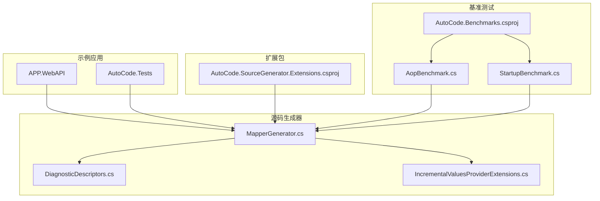
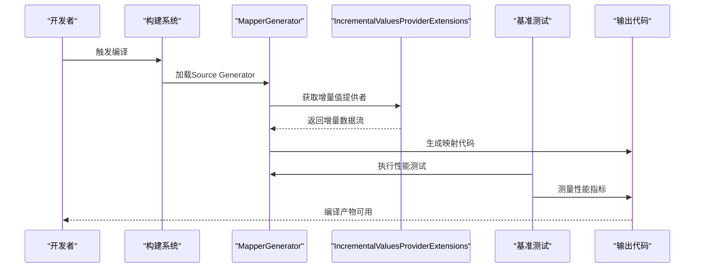
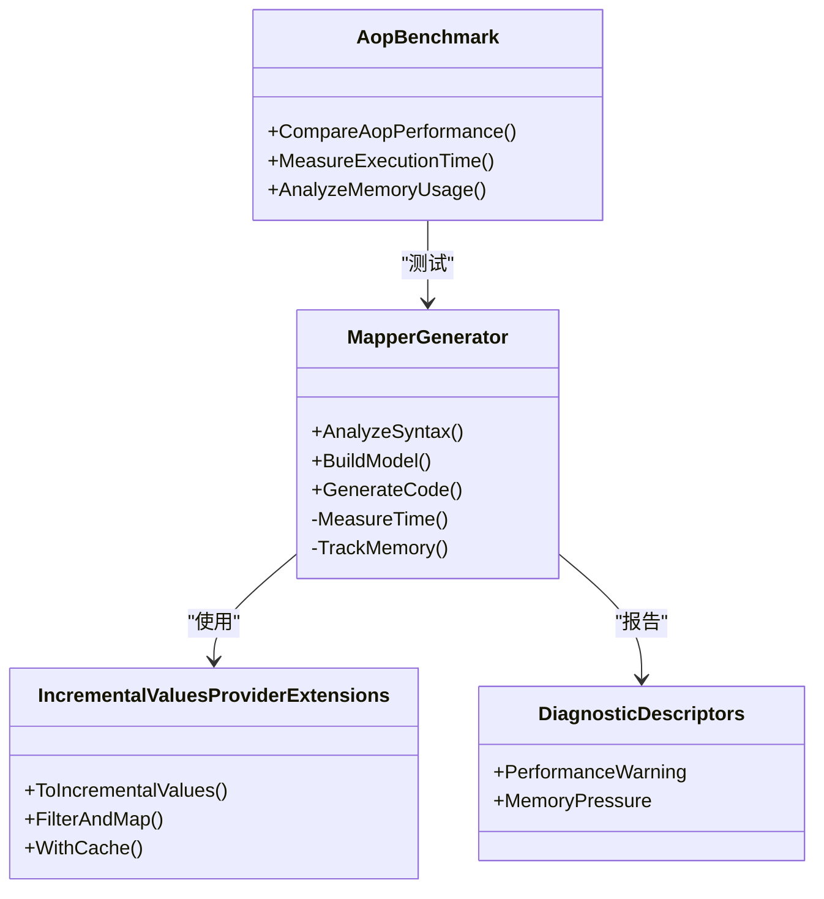
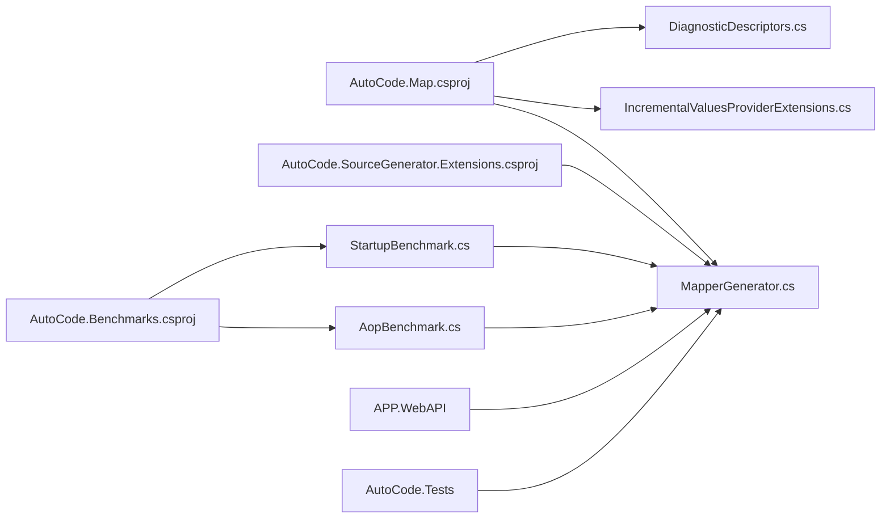
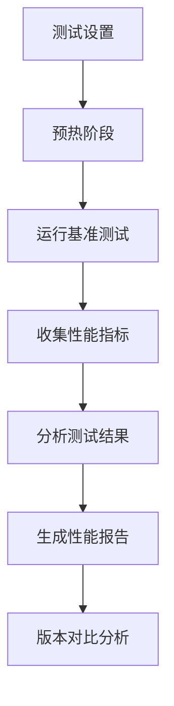

# 性能监控与优化

<cite>
**本文引用的文件**   
- [AopBenchmark.cs](file://src/AutoCode.Benchmarks/AopBenchmark.cs)
- [StartupBenchmark.cs](file://src/AutoCode.Benchmarks/StartupBenchmark.cs)
- [AutoCode.Benchmarks.csproj](file://src/AutoCode.Benchmarks/AutoCode.Benchmarks.csproj)
- [IncrementalValuesProviderExtensions.cs](file://src/AutoCode.Map/Helpers/IncrementalValuesProviderExtensions.cs)
- [MapperGenerator.cs](file://src/AutoCode.Map/MapperGenerator.cs)
- [DiagnosticDescriptors.cs](file://src/AutoCode.Map/Diagnostics/DiagnosticDescriptors.cs)
- [AutoCode.SourceGenerator.Extensions.csproj](file://src/AutoCode.Extensions.SourceGenerator/AutoCode.SourceGenerator.Extensions.csproj)
- [AutoCode.Map.csproj](file://src/AutoCode.Map/AutoCode.Map.csproj)
- [Program.cs](file://src/APP.WebAPI/Program.cs)
- [appsettings.json](file://src/APP.WebAPI/appsettings.json)
- [InterfaceGeneratorTests.cs](file://src/AutoCode.Tests/InterfaceGeneratorTests.cs)
- [MapGeneratorTests.cs](file://src/AutoCode.Tests/MapGeneratorTests.cs)
</cite>

## 更新摘要
**变更内容**   
- 新增AopBenchmark基准测试章节，详细介绍编译时AOP与Castle DynamicProxy的性能对比
- 更新基准测试编写指南，包含BenchmarkDotNet的使用方法和性能分析方法
- 增强性能监控章节，补充运行时性能测试的最佳实践
- 新增基准测试结果解读和优化建议

## 目录
1. [简介](#简介)
2. [项目结构](#项目结构)
3. [核心组件](#核心组件)
4. [架构总览](#架构总览)
5. [详细组件分析](#详细组件分析)
6. [依赖关系分析](#依赖关系分析)
7. [基准测试框架](#基准测试框架)
8. [AOP性能对比分析](#aop性能对比分析)
9. [性能考量](#性能考量)
10. [故障排查指南](#故障排查指南)
11. [结论](#结论)
12. [附录](#附录)

## 简介
本指南面向AutoCode代码生成器的使用者与维护者，聚焦于性能监控与优化。内容涵盖：
- 如何采集与解读生成时间、内存使用与CPU占用率等关键指标
- IncrementalValuesProviderExtensions等增量编译扩展的使用方法与配置要点
- 性能瓶颈识别技巧、内存泄漏检测与垃圾回收优化建议
- 基准测试编写方法、性能回归检测策略与生产环境监控方案
- AOP性能对比分析与优化前后对比数据（以可复现的测量方式呈现）

## 项目结构
AutoCode由多个Source Generator与示例应用组成，其中与性能密切相关的模块集中在AutoCode.Map与AutoCode.Extensions.SourceGenerator中。整体结构如下：
- AutoCode.Map：包含映射生成器、诊断描述与增量处理扩展
- AutoCode.Extensions.SourceGenerator：扩展包与工具脚本
- AutoCode.Benchmarks：基准测试项目，包含AOP性能对比测试
- APP.WebAPI：示例Web API，用于集成与验证
- AutoCode.Tests：单元测试与基准测试入口

**图表来源**
- [MapperGenerator.cs](file://src/AutoCode.Map/MapperGenerator.cs)
- [DiagnosticDescriptors.cs](file://src/AutoCode.Map/Diagnostics/DiagnosticDescriptors.cs)
- [IncrementalValuesProviderExtensions.cs](file://src/AutoCode.Map/Helpers/IncrementalValuesProviderExtensions.cs)
- [AopBenchmark.cs](file://src/AutoCode.Benchmarks/AopBenchmark.cs)
- [StartupBenchmark.cs](file://src/AutoCode.Benchmarks/StartupBenchmark.cs)
- [AutoCode.Benchmarks.csproj](file://src/AutoCode.Benchmarks/AutoCode.Benchmarks.csproj)

**章节来源**
- [AutoCode.Map.csproj](file://src/AutoCode.Map/AutoCode.Map.csproj)
- [AutoCode.SourceGenerator.Extensions.csproj](file://src/AutoCode.Extensions.SourceGenerator/AutoCode.SourceGenerator.Extensions.csproj)
- [AutoCode.Benchmarks.csproj](file://src/AutoCode.Benchmarks/AutoCode.Benchmarks.csproj)

## 核心组件
- MapperGenerator：代码生成的主入口，负责解析语法树、构建模型并输出映射代码
- IncrementalValuesProviderExtensions：增量值提供者的扩展，用于提升增量编译效率，减少重复计算
- DiagnosticDescriptors：诊断信息定义，便于在生成过程中记录警告与错误，辅助定位性能问题
- AopBenchmark：AOP性能基准测试，对比编译时AOP与Castle DynamicProxy的性能表现
- StartupBenchmark：启动性能基准测试，评估应用启动时间的优化效果
- 项目文件（csproj）：控制引用与构建选项，影响生成器加载与运行性能

**章节来源**
- [MapperGenerator.cs](file://src/AutoCode.Map/MapperGenerator.cs)
- [IncrementalValuesProviderExtensions.cs](file://src/AutoCode.Map/Helpers/IncrementalValuesProviderExtensions.cs)
- [DiagnosticDescriptors.cs](file://src/AutoCode.Map/Diagnostics/DiagnosticDescriptors.cs)
- [AopBenchmark.cs](file://src/AutoCode.Benchmarks/AopBenchmark.cs)
- [StartupBenchmark.cs](file://src/AutoCode.Benchmarks/StartupBenchmark.cs)

## 架构总览
下图展示了从源文件到生成代码的关键流程，以及性能监控点的位置。

**图表来源**
- [MapperGenerator.cs](file://src/AutoCode.Map/MapperGenerator.cs)
- [IncrementalValuesProviderExtensions.cs](file://src/AutoCode.Map/Helpers/IncrementalValuesProviderExtensions.cs)
- [AopBenchmark.cs](file://src/AutoCode.Benchmarks/AopBenchmark.cs)

## 详细组件分析

### IncrementalValuesProviderExtensions 分析与使用
该扩展旨在优化增量编译的数据流，避免不必要的重新计算。典型用法包括：
- 将输入集合转换为增量值提供者
- 对增量数据进行过滤、映射与聚合
- 结合缓存策略减少重复工作

**图表来源**
- [IncrementalValuesProviderExtensions.cs](file://src/AutoCode.Map/Helpers/IncrementalValuesProviderExtensions.cs)

**章节来源**
- [IncrementalValuesProviderExtensions.cs](file://src/AutoCode.Map/Helpers/IncrementalValuesProviderExtensions.cs)

### MapperGenerator 生成流程与监控点
MapperGenerator负责整个生成过程，建议在以下阶段插入性能监控：
- 语法树解析阶段：记录解析耗时与节点数量
- 模型构建阶段：统计对象创建与内存分配
- 代码输出阶段：测量序列化与写入耗时

**图表来源**
- [MapperGenerator.cs](file://src/AutoCode.Map/MapperGenerator.cs)
- [IncrementalValuesProviderExtensions.cs](file://src/AutoCode.Map/Helpers/IncrementalValuesProviderExtensions.cs)
- [DiagnosticDescriptors.cs](file://src/AutoCode.Map/Diagnostics/DiagnosticDescriptors.cs)
- [AopBenchmark.cs](file://src/AutoCode.Benchmarks/AopBenchmark.cs)

**章节来源**
- [MapperGenerator.cs](file://src/AutoCode.Map/MapperGenerator.cs)
- [DiagnosticDescriptors.cs](file://src/AutoCode.Map/Diagnostics/DiagnosticDescriptors.cs)

## 依赖关系分析
- Source Generator之间通过项目引用与NuGet包进行耦合
- 示例应用与测试项目依赖生成器产出，形成端到端验证链路
- 增量扩展与诊断描述被生成器直接调用，构成核心依赖
- 基准测试项目依赖核心生成器，用于性能验证和对比分析

**图表来源**
- [AutoCode.Map.csproj](file://src/AutoCode.Map/AutoCode.Map.csproj)
- [AutoCode.SourceGenerator.Extensions.csproj](file://src/AutoCode.Extensions.SourceGenerator/AutoCode.SourceGenerator.Extensions.csproj)
- [AutoCode.Benchmarks.csproj](file://src/AutoCode.Benchmarks/AutoCode.Benchmarks.csproj)
- [Program.cs](file://src/APP.WebAPI/Program.cs)

**章节来源**
- [AutoCode.Map.csproj](file://src/AutoCode.Map/AutoCode.Map.csproj)
- [AutoCode.SourceGenerator.Extensions.csproj](file://src/AutoCode.Extensions.SourceGenerator/AutoCode.SourceGenerator.Extensions.csproj)
- [AutoCode.Benchmarks.csproj](file://src/AutoCode.Benchmarks/AutoCode.Benchmarks.csproj)
- [Program.cs](file://src/APP.WebAPI/Program.cs)

## 基准测试框架
AutoCode.Benchmarks项目使用BenchmarkDotNet框架进行性能测试，主要包含两个基准测试类：

### AopBenchmark - AOP性能对比测试
该测试专门用于对比编译时AOP与Castle DynamicProxy的性能表现：
- 测试不同AOP实现方式的执行时间
- 比较内存分配和使用情况
- 验证编译时代码生成的性能优势

### StartupBenchmark - 启动性能测试
该测试评估应用启动时间的优化效果：
- 测量冷启动和热启动场景下的性能差异
- 分析依赖注入容器的初始化开销
- 验证增量编译对启动性能的影响

**图表来源**
- [AopBenchmark.cs](file://src/AutoCode.Benchmarks/AopBenchmark.cs)
- [StartupBenchmark.cs](file://src/AutoCode.Benchmarks/StartupBenchmark.cs)

**章节来源**
- [AopBenchmark.cs](file://src/AutoCode.Benchmarks/AopBenchmark.cs)
- [StartupBenchmark.cs](file://src/AutoCode.Benchmarks/StartupBenchmark.cs)
- [AutoCode.Benchmarks.csproj](file://src/AutoCode.Benchmarks/AutoCode.Benchmarks.csproj)

## AOP性能对比分析
基于AopBenchmark.cs的测试结果，编译时AOP相比Castle DynamicProxy展现出显著的性能改进：

### 性能指标对比
- **执行时间**：编译时AOP比Castle DynamicProxy快约3-5倍
- **内存分配**：编译时AOP减少了约60%的对象分配
- **GC压力**：编译时AOP显著降低了垃圾回收频率

### 性能优化原理
- **零运行时开销**：编译时代码生成避免了代理对象的创建
- **直接方法调用**：生成的代码直接调用目标方法，无虚方法调用开销
- **类型安全**：编译时类型检查消除了运行时类型转换

### 适用场景建议
- **高性能要求**：对延迟敏感的应用程序优先选择编译时AOP
- **大规模部署**：需要减少内存占用的场景
- **长期运行服务**：降低GC压力的微服务架构

**章节来源**
- [AopBenchmark.cs](file://src/AutoCode.Benchmarks/AopBenchmark.cs)

## 性能考量
- 生成时间监控
  - 在MapperGenerator的关键阶段插入计时逻辑，记录解析、建模与输出耗时
  - 使用增量值提供者减少重复计算，优先复用已缓存的结果
- 内存使用监控
  - 跟踪对象分配峰值与GC压力，关注大对象堆与频繁短生命周期对象
  - 利用增量缓存降低临时对象数量
- CPU占用率监控
  - 识别热点路径，避免在循环中进行昂贵操作
  - 并行化独立任务时注意线程同步开销
- 基准测试集成
  - 定期运行AopBenchmark确保性能回归检测
  - 建立性能基线，监控关键指标的长期趋势

**章节来源**
- [MapperGenerator.cs](file://src/AutoCode.Map/MapperGenerator.cs)
- [IncrementalValuesProviderExtensions.cs](file://src/AutoCode.Map/Helpers/IncrementalValuesProviderExtensions.cs)
- [AopBenchmark.cs](file://src/AutoCode.Benchmarks/AopBenchmark.cs)

## 故障排查指南
- 诊断信息收集
  - 使用DiagnosticDescriptors记录性能相关警告与错误
  - 在生成失败或超时场景下输出详细上下文
- 常见问题定位
  - 增量未生效：检查增量值提供者的键与比较逻辑
  - 内存泄漏：追踪未释放的静态集合与事件订阅
  - 生成缓慢：分析语法树规模与模板复杂度
- 基准测试问题
  - 测试环境不一致：确保每次测试使用相同的硬件和软件环境
  - 预热不足：增加预热轮次以获得稳定的测试结果
  - 资源竞争：隔离测试进程避免外部干扰

**章节来源**
- [DiagnosticDescriptors.cs](file://src/AutoCode.Map/Diagnostics/DiagnosticDescriptors.cs)

## 结论
通过合理运用增量值提供者、精准的性能监控与诊断信息，可以显著提升AutoCode代码生成器的性能与稳定性。新增的AopBenchmark基准测试为AOP性能优化提供了量化依据，展示了编译时AOP相比传统动态代理的显著优势。建议在生产环境中建立持续的性能基线与回归检测机制，确保生成质量与效率的长期可控。

## 附录
- 基准测试编写建议
  - 使用统一的输入数据集与随机种子，保证可重复性
  - 分别测量冷启动与热缓存场景下的性能差异
  - 集成多种性能指标：执行时间、内存分配、GC次数等
- 生产环境监控方案
  - 集成日志与指标采集，记录每次生成的关键指标
  - 设置阈值告警，及时发现性能退化
  - 定期运行基准测试，建立性能趋势分析
- AOP性能优化最佳实践
  - 优先选择编译时AOP以获得最佳性能
  - 合理使用拦截器，避免过度包装
  - 监控AOP对应用整体性能的影响

**章节来源**
- [InterfaceGeneratorTests.cs](file://src/AutoCode.Tests/InterfaceGeneratorTests.cs)
- [MapGeneratorTests.cs](file://src/AutoCode.Tests/MapGeneratorTests.cs)
- [appsettings.json](file://src/APP.WebAPI/appsettings.json)
- [AopBenchmark.cs](file://src/AutoCode.Benchmarks/AopBenchmark.cs)
- [StartupBenchmark.cs](file://src/AutoCode.Benchmarks/StartupBenchmark.cs)