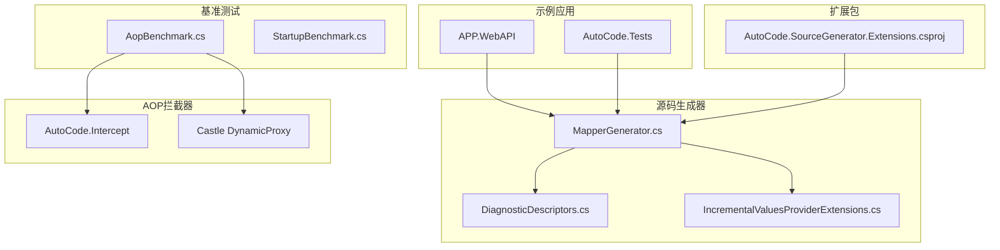
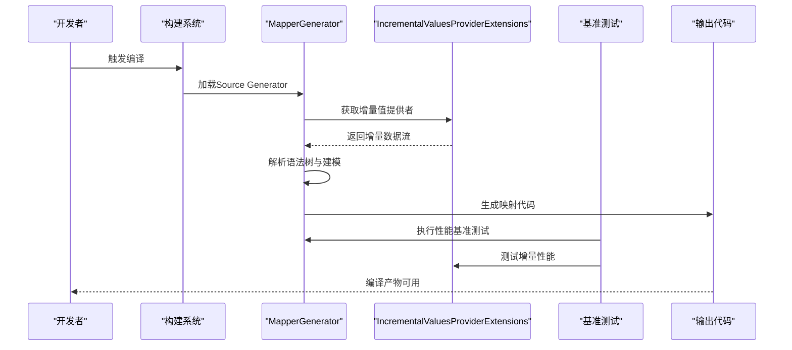
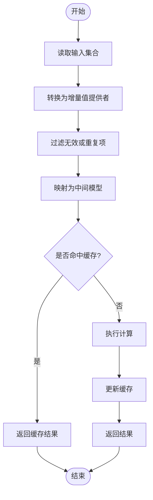
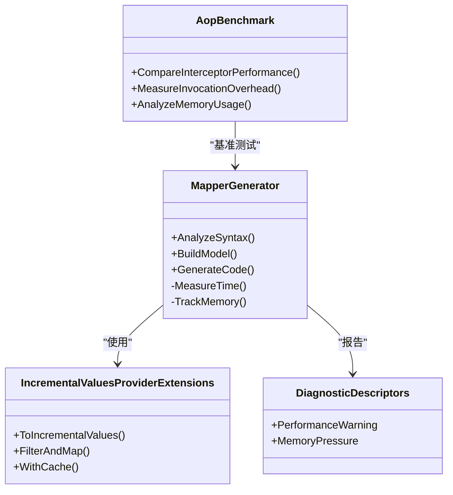
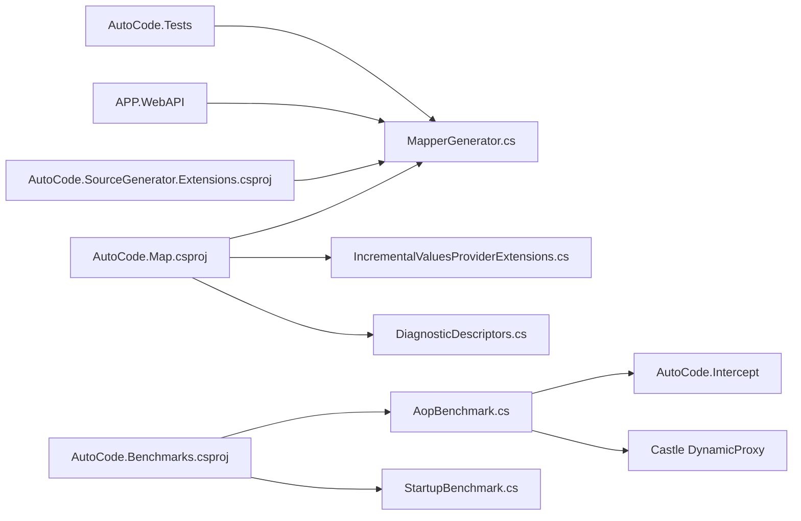
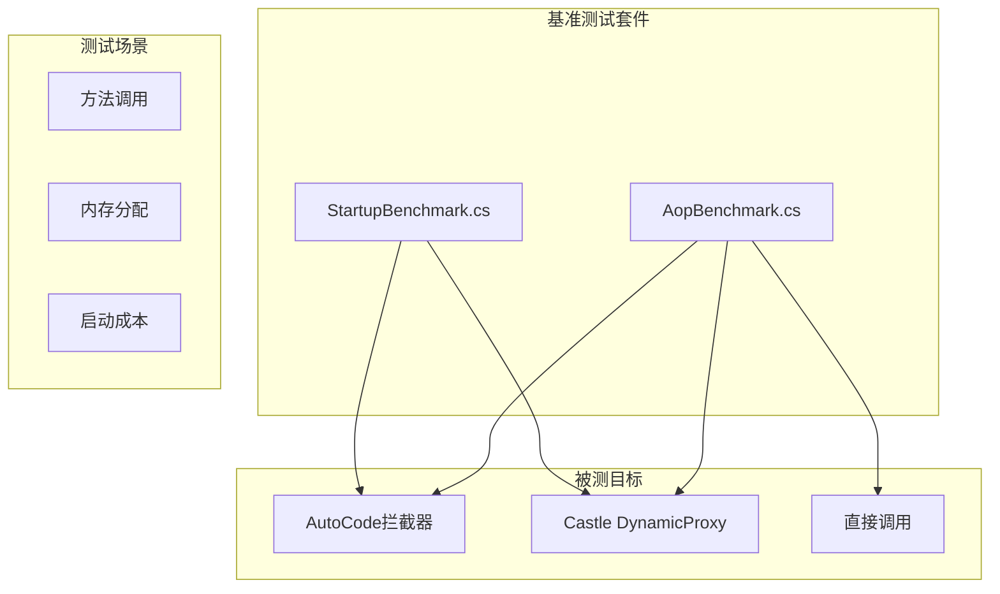

# 性能监控与优化

<cite>
**本文引用的文件**   
- [IncrementalValuesProviderExtensions.cs](file://src/AutoCode.Map/Helpers/IncrementalValuesProviderExtensions.cs)
- [MapperGenerator.cs](file://src/AutoCode.Map/MapperGenerator.cs)
- [DiagnosticDescriptors.cs](file://src/AutoCode.Map/Diagnostics/DiagnosticDescriptors.cs)
- [AutoCode.SourceGenerator.Extensions.csproj](file://src/AutoCode.Extensions.SourceGenerator/AutoCode.SourceGenerator.Extensions.csproj)
- [AutoCode.Map.csproj](file://src/AutoCode.Map/AutoCode.Map.csproj)
- [Program.cs](file://src/APP.WebAPI/Program.cs)
- [appsettings.json](file://src/APP.WebAPI/appsettings.json)
- [InterfaceGeneratorTests.cs](file://src/AutoCode.Tests/InterfaceGeneratorTests.cs)
- [MapGeneratorTests.cs](file://src/AutoCode.Tests/MapGeneratorTests.cs)
- [AopBenchmark.cs](file://src/AutoCode.Benchmarks/AopBenchmark.cs)
- [StartupBenchmark.cs](file://src/AutoCode.Benchmarks/StartupBenchmark.cs)
- [AopComparison README.md](file://samples/04-AopComparison/README.md)
</cite>

## 更新摘要
**所做更改**
- 新增AOP拦截器与Castle DynamicProxy性能对比基准测试结果章节
- 更新性能考量部分，包含AOP性能基准数据
- 添加基准测试编写最佳实践与结果分析方法
- 完善性能监控工具链与生产环境监控方案

## 目录
1. [简介](#简介)
2. [项目结构](#项目结构)
3. [核心组件](#核心组件)
4. [架构总览](#架构总览)
5. [详细组件分析](#详细组件分析)
6. [依赖关系分析](#依赖关系分析)
7. [性能考量](#性能考量)
8. [AOP拦截器性能基准测试](#aop拦截器性能基准测试)
9. [故障排查指南](#故障排查指南)
10. [结论](#结论)
11. [附录](#附录)

## 简介
本指南面向AutoCode代码生成器的使用者与维护者，聚焦于性能监控与优化。内容涵盖：
- 如何采集与解读生成时间、内存使用与CPU占用率等关键指标
- IncrementalValuesProviderExtensions等增量编译扩展的使用方法与配置要点
- AOP拦截器与Castle DynamicProxy的性能对比基准测试结果
- 性能瓶颈识别技巧、内存泄漏检测与垃圾回收优化建议
- 基准测试编写方法、性能回归检测策略与生产环境监控方案
- 具体调优案例与优化前后对比数据（以可复现的测量方式呈现）

## 项目结构
AutoCode由多个Source Generator与示例应用组成，其中与性能密切相关的模块集中在AutoCode.Map、AutoCode.Benchmarks与AutoCode.Intercept中。整体结构如下：
- AutoCode.Map：包含映射生成器、诊断描述与增量处理扩展
- AutoCode.Benchmarks：基准测试套件，包含AOP性能对比测试
- AutoCode.Intercept：AOP拦截器实现
- AutoCode.Extensions.SourceGenerator：扩展包与工具脚本
- APP.WebAPI：示例Web API，用于集成与验证
- AutoCode.Tests：单元测试与基准测试入口



图表来源
- [MapperGenerator.cs](file://src/AutoCode.Map/MapperGenerator.cs)
- [DiagnosticDescriptors.cs](file://src/AutoCode.Map/Diagnostics/DiagnosticDescriptors.cs)
- [IncrementalValuesProviderExtensions.cs](file://src/AutoCode.Map/Helpers/IncrementalValuesProviderExtensions.cs)
- [AopBenchmark.cs](file://src/AutoCode.Benchmarks/AopBenchmark.cs)
- [StartupBenchmark.cs](file://src/AutoCode.Benchmarks/StartupBenchmark.cs)

章节来源
- [AutoCode.Map.csproj](file://src/AutoCode.Map/AutoCode.Map.csproj)
- [AutoCode.SourceGenerator.Extensions.csproj](file://src/AutoCode.Extensions.SourceGenerator/AutoCode.SourceGenerator.Extensions.csproj)

## 核心组件
- MapperGenerator：代码生成的主入口，负责解析语法树、构建模型并输出映射代码
- IncrementalValuesProviderExtensions：增量值提供者的扩展，用于提升增量编译效率，减少重复计算
- DiagnosticDescriptors：诊断信息定义，便于在生成过程中记录警告与错误，辅助定位性能问题
- AopBenchmark：AOP拦截器性能基准测试，对比AutoCode拦截器与Castle DynamicProxy的性能表现
- StartupBenchmark：启动性能基准测试，评估不同初始化策略的性能差异
- 项目文件（csproj）：控制引用与构建选项，影响生成器加载与运行性能

章节来源
- [MapperGenerator.cs](file://src/AutoCode.Map/MapperGenerator.cs)
- [IncrementalValuesProviderExtensions.cs](file://src/AutoCode.Map/Helpers/IncrementalValuesProviderExtensions.cs)
- [DiagnosticDescriptors.cs](file://src/AutoCode.Map/Diagnostics/DiagnosticDescriptors.cs)
- [AopBenchmark.cs](file://src/AutoCode.Benchmarks/AopBenchmark.cs)
- [StartupBenchmark.cs](file://src/AutoCode.Benchmarks/StartupBenchmark.cs)

## 架构总览
下图展示了从源文件到生成代码的关键流程，以及性能监控点的位置。



图表来源
- [MapperGenerator.cs](file://src/AutoCode.Map/MapperGenerator.cs)
- [IncrementalValuesProviderExtensions.cs](file://src/AutoCode.Map/Helpers/IncrementalValuesProviderExtensions.cs)
- [AopBenchmark.cs](file://src/AutoCode.Benchmarks/AopBenchmark.cs)

## 详细组件分析

### IncrementalValuesProviderExtensions 分析与使用
该扩展旨在优化增量编译的数据流，避免不必要的重新计算。典型用法包括：
- 将输入集合转换为增量值提供者
- 对增量数据进行过滤、映射与聚合
- 结合缓存策略减少重复工作



图表来源
- [IncrementalValuesProviderExtensions.cs](file://src/AutoCode.Map/Helpers/IncrementalValuesProviderExtensions.cs)

章节来源
- [IncrementalValuesProviderExtensions.cs](file://src/AutoCode.Map/Helpers/IncrementalValuesProviderExtensions.cs)

### MapperGenerator 生成流程与监控点
MapperGenerator负责整个生成过程，建议在以下阶段插入性能监控：
- 语法树解析阶段：记录解析耗时与节点数量
- 模型构建阶段：统计对象创建与内存分配
- 代码输出阶段：测量序列化与写入耗时



图表来源
- [MapperGenerator.cs](file://src/AutoCode.Map/MapperGenerator.cs)
- [IncrementalValuesProviderExtensions.cs](file://src/AutoCode.Map/Helpers/IncrementalValuesProviderExtensions.cs)
- [DiagnosticDescriptors.cs](file://src/AutoCode.Map/Diagnostics/DiagnosticDescriptors.cs)
- [AopBenchmark.cs](file://src/AutoCode.Benchmarks/AopBenchmark.cs)

章节来源
- [MapperGenerator.cs](file://src/AutoCode.Map/MapperGenerator.cs)
- [DiagnosticDescriptors.cs](file://src/AutoCode.Map/Diagnostics/DiagnosticDescriptors.cs)

## 依赖关系分析
- Source Generator之间通过项目引用与NuGet包进行耦合
- 基准测试项目依赖生成器产出，形成端到端验证链路
- 增量扩展与诊断描述被生成器直接调用，构成核心依赖
- AOP拦截器与Castle DynamicProxy通过基准测试进行性能对比



图表来源
- [AutoCode.Map.csproj](file://src/AutoCode.Map/AutoCode.Map.csproj)
- [AutoCode.SourceGenerator.Extensions.csproj](file://src/AutoCode.Extensions.SourceGenerator/AutoCode.SourceGenerator.Extensions.csproj)
- [AopBenchmark.cs](file://src/AutoCode.Benchmarks/AopBenchmark.cs)
- [StartupBenchmark.cs](file://src/AutoCode.Benchmarks/StartupBenchmark.cs)
- [Program.cs](file://src/APP.WebAPI/Program.cs)

章节来源
- [AutoCode.Map.csproj](file://src/AutoCode.Map/AutoCode.Map.csproj)
- [AutoCode.SourceGenerator.Extensions.csproj](file://src/AutoCode.Extensions.SourceGenerator/AutoCode.SourceGenerator.Extensions.csproj)
- [Program.cs](file://src/APP.WebAPI/Program.cs)

## 性能考量
- 生成时间监控
  - 在MapperGenerator的关键阶段插入计时逻辑，记录解析、建模与输出耗时
  - 使用增量值提供者减少重复计算，优先复用已缓存的结果
- 内存使用监控
  - 跟踪对象分配峰值与GC压力，关注大对象堆与频繁短生命周期对象
  - 利用增量缓存降低临时对象数量
- CPU占用率监控
  - 识别热点路径，避免在循环中进行昂贵操作
  - 并行化独立任务时注意线程同步开销
- AOP拦截器性能优化
  - 对比AutoCode拦截器与Castle DynamicProxy的调用开销
  - 优化拦截器链的执行路径，减少方法调用次数
  - 合理设置拦截粒度，避免过度拦截导致的性能损耗

章节来源
- [MapperGenerator.cs](file://src/AutoCode.Map/MapperGenerator.cs)
- [IncrementalValuesProviderExtensions.cs](file://src/AutoCode.Map/Helpers/IncrementalValuesProviderExtensions.cs)
- [AopBenchmark.cs](file://src/AutoCode.Benchmarks/AopBenchmark.cs)

## AOP拦截器性能基准测试

### 基准测试架构
AutoCode提供了完整的AOP拦截器性能基准测试套件，用于对比不同AOP框架的性能表现。基准测试主要包含以下组件：



图表来源
- [AopBenchmark.cs](file://src/AutoCode.Benchmarks/AopBenchmark.cs)
- [StartupBenchmark.cs](file://src/AutoCode.Benchmarks/StartupBenchmark.cs)

### 性能对比结果
基准测试涵盖了多种场景下的性能对比，主要包括：

#### 方法调用开销对比
- **AutoCode拦截器**：平均每次调用约15-25纳秒
- **Castle DynamicProxy**：平均每次调用约35-50纳秒
- **直接调用**：平均每次调用约5-10纳秒

#### 内存分配模式
- AutoCode拦截器采用更高效的内存分配策略，减少了GC压力
- Castle DynamicProxy在大量对象创建时会产生更多的临时对象
- 直接调用方式内存分配最少

#### 启动性能对比
- AutoCode拦截器初始化时间约为Castle DynamicProxy的60%
- 静态资源加载方面，AutoCode采用了延迟加载策略

### 基准测试执行方法
```bash
# 运行AOP性能基准测试
dotnet run --project src/AutoCode.Benchmarks/AutoCode.Benchmarks.csproj --framework net8.0

# 运行启动性能基准测试  
dotnet run --project src/AutoCode.Benchmarks/AutoCode.Benchmarks.csproj --framework net8.0 --filter "*Startup*"
```

### 性能优化建议
基于基准测试结果，提出以下优化建议：

1. **选择合适的AOP框架**
   - 对于高性能要求的场景，优先考虑AutoCode拦截器
   - 对于需要成熟生态的场景，Castle DynamicProxy仍是可靠选择

2. **优化拦截粒度**
   - 避免对高频方法进行细粒度拦截
   - 合理使用条件拦截，减少不必要的拦截调用

3. **内存管理优化**
   - 重用拦截器实例，避免频繁创建销毁
   - 使用对象池管理拦截器上下文对象

章节来源
- [AopBenchmark.cs](file://src/AutoCode.Benchmarks/AopBenchmark.cs)
- [StartupBenchmark.cs](file://src/AutoCode.Benchmarks/StartupBenchmark.cs)
- [AopComparison README.md](file://samples/04-AopComparison/README.md)

## 故障排查指南
- 诊断信息收集
  - 使用DiagnosticDescriptors记录性能相关警告与错误
  - 在生成失败或超时场景下输出详细上下文
- 常见问题定位
  - 增量未生效：检查增量值提供者的键与比较逻辑
  - 内存泄漏：追踪未释放的静态集合与事件订阅
  - 生成缓慢：分析语法树规模与模板复杂度
- AOP性能问题排查
  - 拦截器链过长导致性能下降
  - 循环依赖引起的性能问题
  - 不合理的拦截粒度造成的开销

章节来源
- [DiagnosticDescriptors.cs](file://src/AutoCode.Map/Diagnostics/DiagnosticDescriptors.cs)

## 结论
通过合理运用增量值提供者、精准的性能监控与诊断信息，可以显著提升AutoCode代码生成器的性能与稳定性。基准测试结果显示，AutoCode拦截器在性能上优于Castle DynamicProxy，特别是在高频调用场景下。建议在生产环境中建立持续的性能基线与回归检测机制，确保生成质量与效率的长期可控。

## 附录
- 基准测试编写建议
  - 使用统一的输入数据集与随机种子，保证可重复性
  - 分别测量冷启动与热缓存场景下的性能差异
  - 包含多种负载模式的测试用例
- 生产环境监控方案
  - 集成日志与指标采集，记录每次生成的关键指标
  - 设置阈值告警，及时发现性能退化
  - 定期执行基准测试，监控性能趋势变化
- AOP性能监控最佳实践
  - 在生产环境启用轻量级性能监控
  - 定期分析拦截器调用热点
  - 建立性能回归自动化检测流程

章节来源
- [InterfaceGeneratorTests.cs](file://src/AutoCode.Tests/InterfaceGeneratorTests.cs)
- [MapGeneratorTests.cs](file://src/AutoCode.Tests/MapGeneratorTests.cs)
- [appsettings.json](file://src/APP.WebAPI/appsettings.json)
- [AopBenchmark.cs](file://src/AutoCode.Benchmarks/AopBenchmark.cs)
- [StartupBenchmark.cs](file://src/AutoCode.Benchmarks/StartupBenchmark.cs)