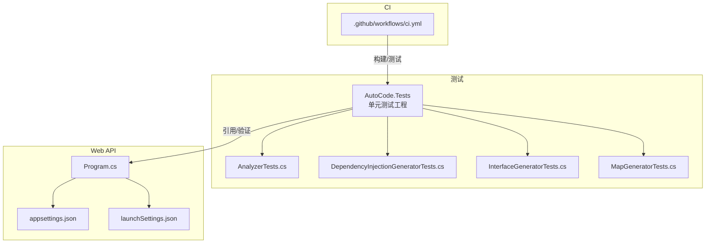
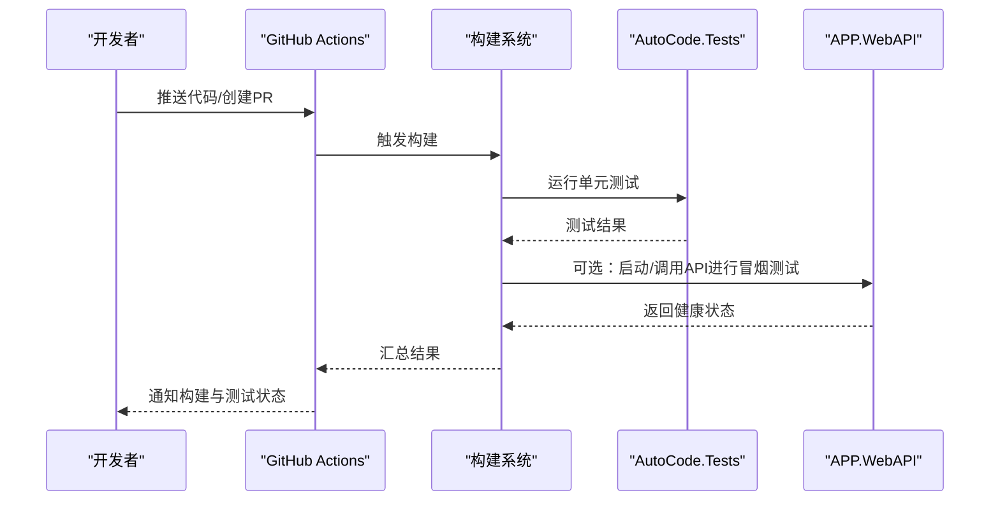
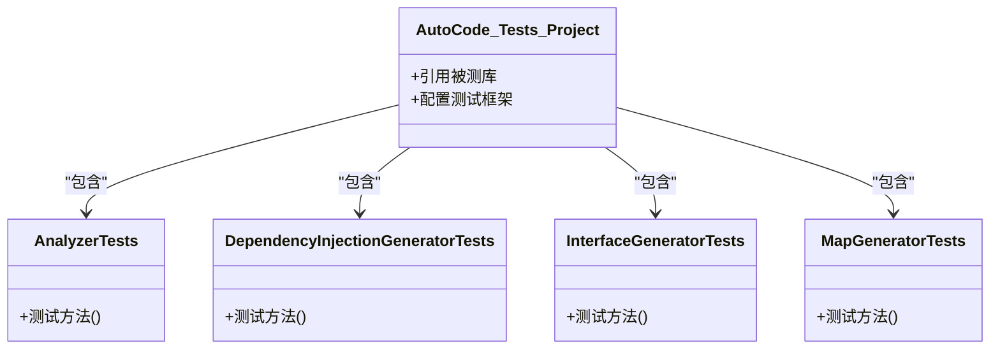
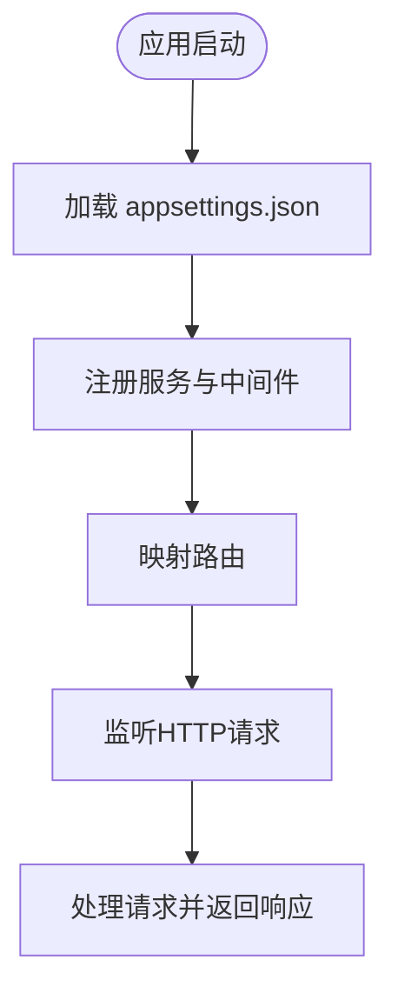
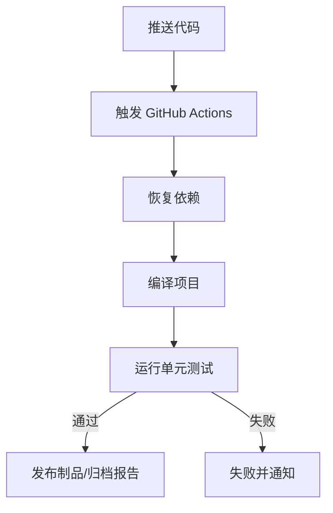
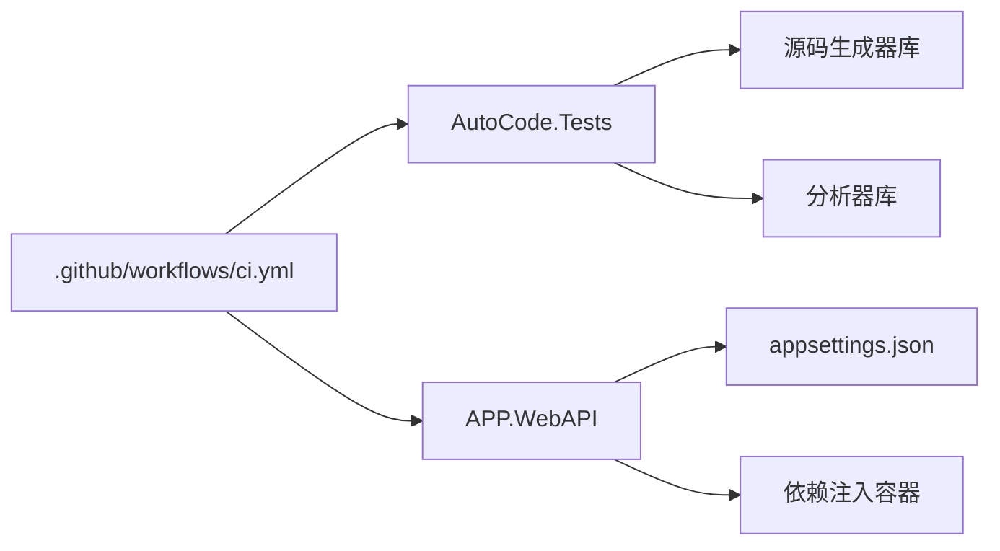

# 测试和质量保证

<cite>
**本文引用的文件**   
- [ci.yml](file://.github/workflows/ci.yml)
- [AutoCode.Tests.csproj](file://src/AutoCode.Tests/AutoCode.Tests.csproj)
- [AnalyzerTests.cs](file://src/AutoCode.Tests/AnalyzerTests.cs)
- [DependencyInjectionGeneratorTests.cs](file://src/AutoCode.Tests/DependencyInjectionGeneratorTests.cs)
- [InterfaceGeneratorTests.cs](file://src/AutoCode.Tests/InterfaceGeneratorTests.cs)
- [MapGeneratorTests.cs](file://src/AutoCode.Tests/MapGeneratorTests.cs)
- [Program.cs](file://src/APP.WebAPI/Program.cs)
- [appsettings.json](file://src/APP.WebAPI/appsettings.json)
- [launchSettings.json](file://src/APP.WebAPI/Properties/launchSettings.json)
</cite>

## 目录
1. [简介](#简介)
2. [项目结构](#项目结构)
3. [核心组件](#核心组件)
4. [架构总览](#架构总览)
5. [详细组件分析](#详细组件分析)
6. [依赖分析](#依赖分析)
7. [性能考虑](#性能考虑)
8. [故障排查指南](#故障排查指南)
9. [结论](#结论)
10. [附录](#附录)

## 简介
本章节聚焦于 AutoCode 项目的测试与质量保证体系，涵盖单元测试、静态分析（Analyzers）、CI 流水线以及 Web API 运行时的基础配置。通过梳理测试工程、关键测试类与 CI 流程，帮助读者快速理解如何在本项目中执行测试、定位问题并持续保障代码质量。

## 项目结构
- 测试工程位于 src/AutoCode.Tests，包含对 Analyzers、依赖注入、接口生成与映射生成的单元测试。
- Web API 示例工程位于 src/APP.WebAPI，提供 Program、配置文件与启动设置，便于集成或冒烟测试。
- CI 流水线定义在 .github/workflows/ci.yml，用于自动化构建与测试。

图表来源
- [AutoCode.Tests.csproj](file://src/AutoCode.Tests/AutoCode.Tests.csproj)
- [AnalyzerTests.cs](file://src/AutoCode.Tests/AnalyzerTests.cs)
- [DependencyInjectionGeneratorTests.cs](file://src/AutoCode.Tests/DependencyInjectionGeneratorTests.cs)
- [InterfaceGeneratorTests.cs](file://src/AutoCode.Tests/InterfaceGeneratorTests.cs)
- [MapGeneratorTests.cs](file://src/AutoCode.Tests/MapGeneratorTests.cs)
- [Program.cs](file://src/APP.WebAPI/Program.cs)
- [appsettings.json](file://src/APP.WebAPI/appsettings.json)
- [launchSettings.json](file://src/APP.WebAPI/Properties/launchSettings.json)
- [ci.yml](file://.github/workflows/ci.yml)

章节来源
- [AutoCode.Tests.csproj](file://src/AutoCode.Tests/AutoCode.Tests.csproj)
- [ci.yml](file://.github/workflows/ci.yml)

## 核心组件
- 单元测试工程：AutoCode.Tests 集中承载针对源码生成器与分析器的测试用例，覆盖命名规范、层违规、缺失接口、未使用忽略标记等场景。
- Web API 应用：APP.WebAPI 提供最小可运行的 API 服务，便于进行端到端或冒烟测试。
- CI 流水线：GitHub Actions 定义构建与测试步骤，确保每次提交都经过自动化质量门禁。

章节来源
- [AutoCode.Tests.csproj](file://src/AutoCode.Tests/AutoCode.Tests.csproj)
- [Program.cs](file://src/APP.WebAPI/Program.cs)
- [ci.yml](file://.github/workflows/ci.yml)

## 架构总览
下图展示测试与质量保障的整体交互：CI 触发构建与测试；单元测试验证源码生成器与分析器行为；Web API 作为被测目标或冒烟环境，读取运行时配置。

图表来源
- [ci.yml](file://.github/workflows/ci.yml)
- [AutoCode.Tests.csproj](file://src/AutoCode.Tests/AutoCode.Tests.csproj)
- [Program.cs](file://src/APP.WebAPI/Program.cs)

## 详细组件分析

### 单元测试工程与测试类
- 工程职责：组织测试项目、引用被测库、配置测试框架与运行参数。
- 关键测试类：
  - AnalyzerTests：验证静态分析规则是否按预期触发诊断。
  - DependencyInjectionGeneratorTests：验证依赖注入相关源码生成是否正确。
  - InterfaceGeneratorTests：验证接口自动生成逻辑。
  - MapGeneratorTests：验证对象映射生成逻辑。

图表来源
- [AutoCode.Tests.csproj](file://src/AutoCode.Tests/AutoCode.Tests.csproj)
- [AnalyzerTests.cs](file://src/AutoCode.Tests/AnalyzerTests.cs)
- [DependencyInjectionGeneratorTests.cs](file://src/AutoCode.Tests/DependencyInjectionGeneratorTests.cs)
- [InterfaceGeneratorTests.cs](file://src/AutoCode.Tests/InterfaceGeneratorTests.cs)
- [MapGeneratorTests.cs](file://src/AutoCode.Tests/MapGeneratorTests.cs)

章节来源
- [AutoCode.Tests.csproj](file://src/AutoCode.Tests/AutoCode.Tests.csproj)
- [AnalyzerTests.cs](file://src/AutoCode.Tests/AnalyzerTests.cs)
- [DependencyInjectionGeneratorTests.cs](file://src/AutoCode.Tests/DependencyInjectionGeneratorTests.cs)
- [InterfaceGeneratorTests.cs](file://src/AutoCode.Tests/InterfaceGeneratorTests.cs)
- [MapGeneratorTests.cs](file://src/AutoCode.Tests/MapGeneratorTests.cs)

### Web API 运行与配置
- Program：应用入口，负责注册服务、中间件与路由。
- appsettings.json：应用级配置，如连接字符串、开关选项等。
- launchSettings.json：本地调试与启动参数，便于快速验证。

图表来源
- [Program.cs](file://src/APP.WebAPI/Program.cs)
- [appsettings.json](file://src/APP.WebAPI/appsettings.json)
- [launchSettings.json](file://src/APP.WebAPI/Properties/launchSettings.json)

章节来源
- [Program.cs](file://src/APP.WebAPI/Program.cs)
- [appsettings.json](file://src/APP.WebAPI/appsettings.json)
- [launchSettings.json](file://src/APP.WebAPI/Properties/launchSettings.json)

### CI 流水线与质量门禁
- ci.yml：定义构建、还原依赖、运行测试与打包等步骤，确保每次提交均通过自动化检查。
- 建议：在 PR 中强制要求测试通过，结合代码覆盖率阈值提升质量门槛。

图表来源
- [ci.yml](file://.github/workflows/ci.yml)

章节来源
- [ci.yml](file://.github/workflows/ci.yml)

## 依赖分析
- 测试工程依赖被测的源码生成器与分析器库，确保测试覆盖核心生成逻辑。
- Web API 依赖运行时配置与 DI 容器，测试可通过启动 API 进行冒烟验证。
- CI 依赖仓库中的工作流定义，统一构建与测试环境。

图表来源
- [AutoCode.Tests.csproj](file://src/AutoCode.Tests/AutoCode.Tests.csproj)
- [Program.cs](file://src/APP.WebAPI/Program.cs)
- [appsettings.json](file://src/APP.WebAPI/appsettings.json)
- [ci.yml](file://.github/workflows/ci.yml)

章节来源
- [AutoCode.Tests.csproj](file://src/AutoCode.Tests/AutoCode.Tests.csproj)
- [Program.cs](file://src/APP.WebAPI/Program.cs)
- [appsettings.json](file://src/APP.WebAPI/appsettings.json)
- [ci.yml](file://.github/workflows/ci.yml)

## 性能考虑
- 单元测试应尽可能隔离外部依赖，避免网络与IO瓶颈，提高执行速度。
- 并行化测试执行，合理拆分测试套件，缩短CI时长。
- 对生成器测试采用增量输入与缓存策略，减少重复计算。

[本节为通用指导，不直接分析具体文件]

## 故障排查指南
- 测试失败
  - 检查测试工程引用与版本一致性。
  - 确认被测库已正确编译且输出路径可用。
  - 查看测试日志定位断言失败点。
- 启动失败
  - 校验 appsettings.json 配置项是否存在且格式正确。
  - 检查 launchSettings.json 端口冲突或服务名配置。
- CI 失败
  - 确认工作流语法与依赖恢复步骤。
  - 检查环境变量与密钥配置是否齐全。

章节来源
- [AutoCode.Tests.csproj](file://src/AutoCode.Tests/AutoCode.Tests.csproj)
- [appsettings.json](file://src/APP.WebAPI/appsettings.json)
- [launchSettings.json](file://src/APP.WebAPI/Properties/launchSettings.json)
- [ci.yml](file://.github/workflows/ci.yml)

## 结论
本项目通过集中的单元测试工程、清晰的 Web API 运行配置与完善的 CI 流水线，构建了较为完整的测试与质量保证体系。建议在后续迭代中持续提升测试覆盖率、完善静态分析规则，并将更多端到端场景纳入自动化流程，以进一步降低回归风险并提升交付质量。

[本节为总结性内容，不直接分析具体文件]

## 附录
- 常用命令
  - 运行单元测试：在测试工程中执行测试运行器。
  - 本地运行 API：使用 dotnet run 或 Visual Studio 启动。
  - 触发 CI：推送代码至分支或创建 PR。
- 参考文件
  - 测试工程与测试类：见“详细组件分析”部分。
  - Web API 配置与启动：见“Web API 运行与配置”部分。
  - CI 工作流：见“CI 流水线与质量门禁”部分。

[本节为补充信息，不直接分析具体文件]