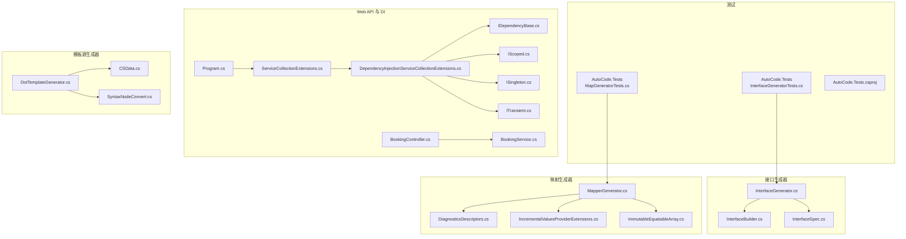
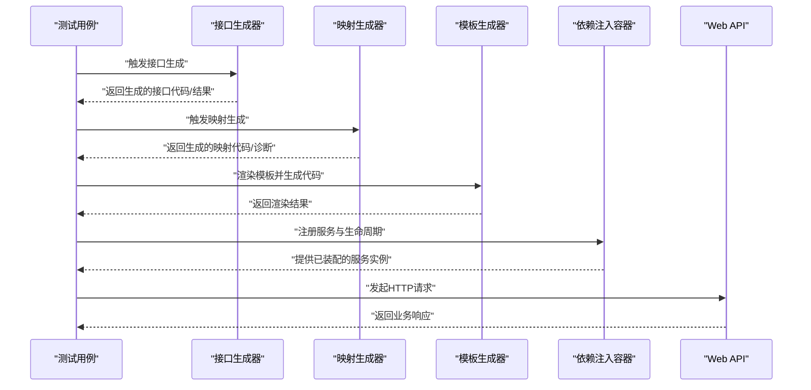
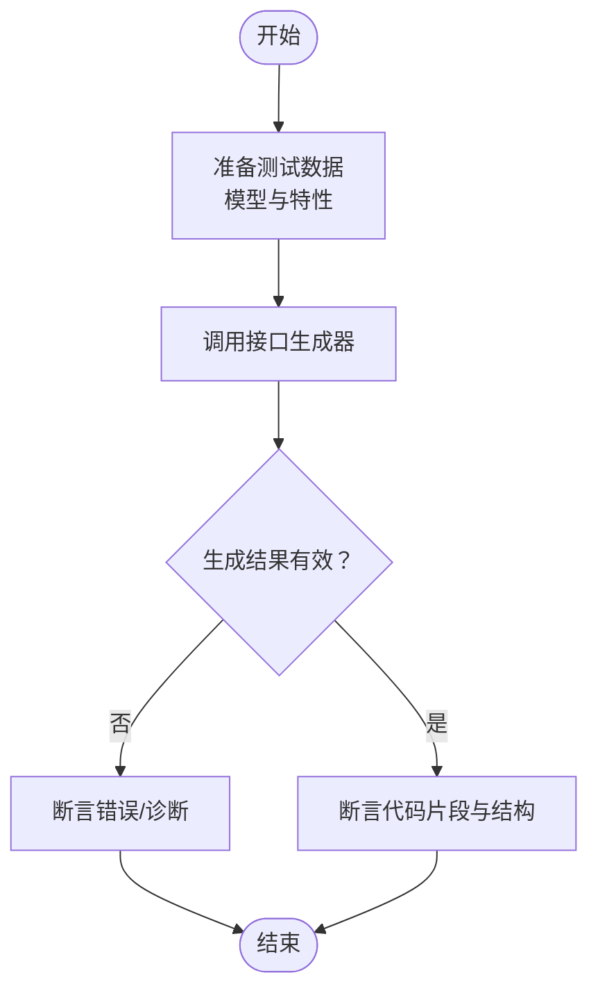
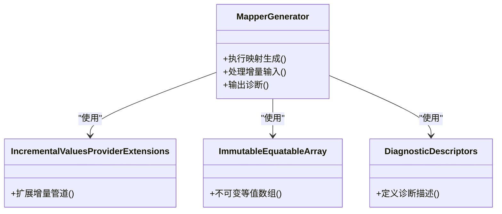
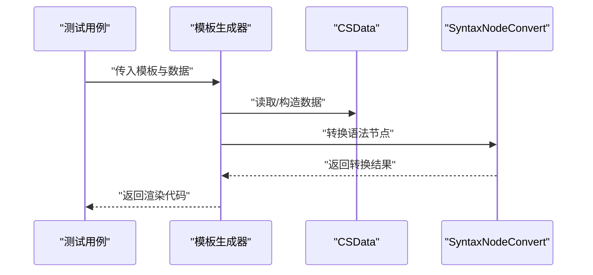
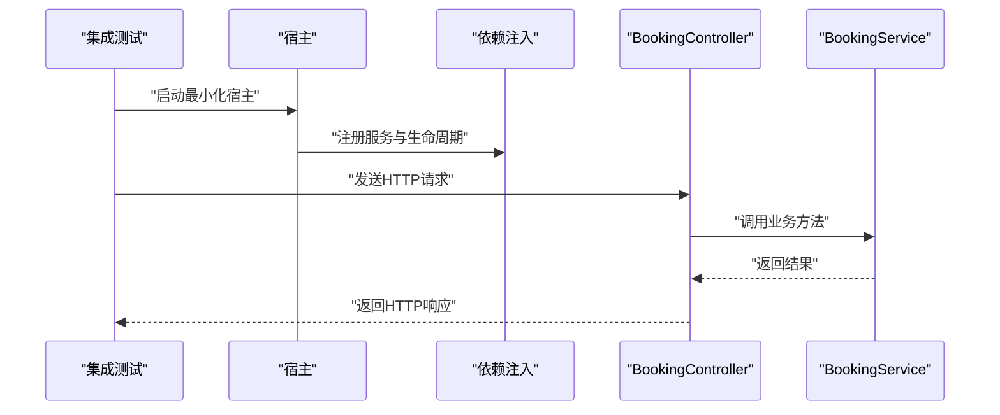
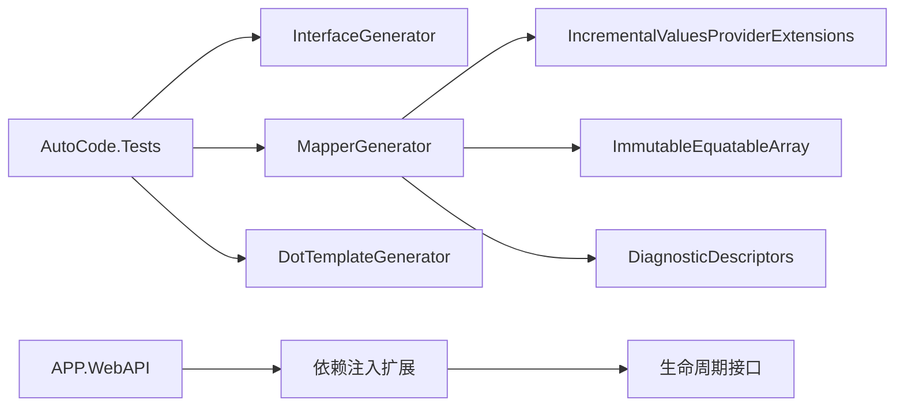

# 测试策略与实践

<cite>
**本文档引用的文件**   
- [InterfaceGeneratorTests.cs](file://src/AutoCode.Tests/InterfaceGeneratorTests.cs)
- [MapGeneratorTests.cs](file://src/AutoCode.Tests/MapGeneratorTests.cs)
- [AutoCode.Tests.csproj](file://src/AutoCode.Tests/AutoCode.Tests.csproj)
- [InterfaceGenerator.cs](file://src/AutoCodeGenerator/InterfaceAutoBuilder/InterfaceGenerator.cs)
- [InterfaceBuilder.cs](file://src/AutoCodeGenerator/InterfaceAutoBuilder/InterfaceBuilder.cs)
- [InterfaceSpec.cs](file://src/AutoCodeGenerator/InterfaceAutoBuilder/InterfaceSpec.cs)
- [MapperGenerator.cs](file://src/AutoCode.Map/MapperGenerator.cs)
- [DiagnosticsDescriptors.cs](file://src/AutoCode.Map/Diagnostics/DiagnosticDescriptors.cs)
- [IncrementalValuesProviderExtensions.cs](file://src/AutoCode.Map/Helpers/IncrementalValuesProviderExtensions.cs)
- [ImmutableEquatableArray.cs](file://src/AutoCode.Map/Helpers/ImmutableEquatableArray.cs)
- [Program.cs](file://src/APP.WebAPI/Program.cs)
- [ServiceCollectionExtensions.cs](file://src/APP.WebAPI.Core/Application/Extensions/ServiceCollectionExtensions.cs)
- [DependencyInjectionServiceCollectionExtensions.cs](file://src/APP.WebAPI.Core/DependencyInjection/DependencyInjectionServiceCollectionExtensions.cs)
- [IDependencyBase.cs](file://src/APP.WebAPI.Core/DependencyInjection/LifeType/IDependencyBase.cs)
- [IScoped.cs](file://src/APP.WebAPI.Core/DependencyInjection/LifeType/IScoped.cs)
- [ISingleton.cs](file://src/APP.WebAPI.Core/DependencyInjection/LifeType/ISingleton.cs)
- [ITransient.cs](file://src/APP.WebAPI.Core/DependencyInjection/LifeType/ITransient.cs)
- [BookingController.cs](file://src/APP.WebAPI/Controllers/BookingController.cs)
- [BookingService.cs](file://src/APP.WebAPI/Services/BookingService.cs)
- [DotTemplateGenerator.cs](file://src/AutoCode.XmlTemplate.SourceGenerator/DotTemplateGenerator.cs)
- [CSData.cs](file://src/AutoCode.XmlTemplate.SourceGenerator/CSData.cs)
- [SyntaxNodeConvert.cs](file://src/AutoCode.XmlTemplate.SourceGenerator/SyntaxNodeConvert.cs)
</cite>

## 目录
1. [简介](#简介)
2. [项目结构](#项目结构)
3. [核心组件](#核心组件)
4. [架构总览](#架构总览)
5. [详细组件分析](#详细组件分析)
6. [依赖关系分析](#依赖关系分析)
7. [性能考量](#性能考量)
8. [故障排查指南](#故障排查指南)
9. [结论](#结论)
10. [附录](#附录)

## 简介
本文件面向AutoCode框架的测试策略与工程实践，聚焦于代码生成器的单元测试与集成测试。内容涵盖：
- 单元测试编写模式（以InterfaceGeneratorTests与MapGeneratorTests为例）
- 测试数据准备、断言验证与环境配置
- 集成测试最佳实践（完整代码生成流程、依赖注入配置、模板渲染）
- 持续集成中的测试自动化、覆盖率要求与性能基准
- 测试用例设计模式与常见场景示例

## 项目结构
AutoCode仓库采用多项目结构，测试相关位于AutoCode.Tests；代码生成器核心位于AutoCodeGenerator与AutoCode.Map；Web API与依赖注入位于APP.WebAPI与APP.WebAPI.Core；模板源生成器位于AutoCode.XmlTemplate.SourceGenerator。

图表来源
- [InterfaceGenerator.cs](file://src/AutoCodeGenerator/InterfaceAutoBuilder/InterfaceGenerator.cs)
- [InterfaceBuilder.cs](file://src/AutoCodeGenerator/InterfaceAutoBuilder/InterfaceBuilder.cs)
- [InterfaceSpec.cs](file://src/AutoCodeGenerator/InterfaceAutoBuilder/InterfaceSpec.cs)
- [MapperGenerator.cs](file://src/AutoCode.Map/MapperGenerator.cs)
- [DiagnosticsDescriptors.cs](file://src/AutoCode.Map/Diagnostics/DiagnosticDescriptors.cs)
- [IncrementalValuesProviderExtensions.cs](file://src/AutoCode.Map/Helpers/IncrementalValuesProviderExtensions.cs)
- [ImmutableEquatableArray.cs](file://src/AutoCode.Map/Helpers/ImmutableEquatableArray.cs)
- [Program.cs](file://src/APP.WebAPI/Program.cs)
- [ServiceCollectionExtensions.cs](file://src/APP.WebAPI.Core/Application/Extensions/ServiceCollectionExtensions.cs)
- [DependencyInjectionServiceCollectionExtensions.cs](file://src/APP.WebAPI.Core/DependencyInjection/DependencyInjectionServiceCollectionExtensions.cs)
- [IDependencyBase.cs](file://src/APP.WebAPI.Core/DependencyInjection/LifeType/IDependencyBase.cs)
- [IScoped.cs](file://src/APP.WebAPI.Core/DependencyInjection/LifeType/IScoped.cs)
- [ISingleton.cs](file://src/APP.WebAPI.Core/DependencyInjection/LifeType/ISingleton.cs)
- [ITransient.cs](file://src/APP.WebAPI.Core/DependencyInjection/LifeType/ITransient.cs)
- [BookingController.cs](file://src/APP.WebAPI/Controllers/BookingController.cs)
- [BookingService.cs](file://src/APP.WebAPI/Services/BookingService.cs)
- [DotTemplateGenerator.cs](file://src/AutoCode.XmlTemplate.SourceGenerator/DotTemplateGenerator.cs)
- [CSData.cs](file://src/AutoCode.XmlTemplate.SourceGenerator/CSData.cs)
- [SyntaxNodeConvert.cs](file://src/AutoCode.XmlTemplate.SourceGenerator/SyntaxNodeConvert.cs)

章节来源
- [AutoCode.Tests.csproj](file://src/AutoCode.Tests/AutoCode.Tests.csproj)

## 核心组件
- 接口生成器（InterfaceGenerator/InterfaceBuilder/InterfaceSpec）：负责解析目标类型与特性，构建接口规范并生成C#接口代码。
- 映射生成器（MapperGenerator）：基于增量编译管线，扫描模型与特性，生成对象映射代码，包含诊断与辅助扩展。
- 模板源生成器（DotTemplateGenerator）：基于dot模板引擎进行代码模板渲染，结合语法节点转换生成目标代码。
- Web API与依赖注入：通过Program与扩展方法注册服务生命周期，控制器与服务用于端到端验证。

章节来源
- [InterfaceGenerator.cs](file://src/AutoCodeGenerator/InterfaceAutoBuilder/InterfaceGenerator.cs)
- [InterfaceBuilder.cs](file://src/AutoCodeGenerator/InterfaceAutoBuilder/InterfaceBuilder.cs)
- [InterfaceSpec.cs](file://src/AutoCodeGenerator/InterfaceAutoBuilder/InterfaceSpec.cs)
- [MapperGenerator.cs](file://src/AutoCode.Map/MapperGenerator.cs)
- [DiagnosticsDescriptors.cs](file://src/AutoCode.Map/Diagnostics/DiagnosticDescriptors.cs)
- [IncrementalValuesProviderExtensions.cs](file://src/AutoCode.Map/Helpers/IncrementalValuesProviderExtensions.cs)
- [ImmutableEquatableArray.cs](file://src/AutoCode.Map/Helpers/ImmutableEquatableArray.cs)
- [DotTemplateGenerator.cs](file://src/AutoCode.XmlTemplate.SourceGenerator/DotTemplateGenerator.cs)
- [CSData.cs](file://src/AutoCode.XmlTemplate.SourceGenerator/CSData.cs)
- [SyntaxNodeConvert.cs](file://src/AutoCode.XmlTemplate.SourceGenerator/SyntaxNodeConvert.cs)

## 架构总览
下图展示从测试到生成器的调用链路与数据流，体现单元测试如何驱动接口与映射生成，以及集成测试如何覆盖Web API与DI装配。

图表来源
- [InterfaceGenerator.cs](file://src/AutoCodeGenerator/InterfaceAutoBuilder/InterfaceGenerator.cs)
- [MapperGenerator.cs](file://src/AutoCode.Map/MapperGenerator.cs)
- [DotTemplateGenerator.cs](file://src/AutoCode.XmlTemplate.SourceGenerator/DotTemplateGenerator.cs)
- [Program.cs](file://src/APP.WebAPI/Program.cs)
- [ServiceCollectionExtensions.cs](file://src/APP.WebAPI.Core/Application/Extensions/ServiceCollectionExtensions.cs)
- [DependencyInjectionServiceCollectionExtensions.cs](file://src/APP.WebAPI.Core/DependencyInjection/DependencyInjectionServiceCollectionExtensions.cs)

## 详细组件分析

### 接口生成器测试（InterfaceGeneratorTests）
- 测试目标：验证接口生成器对输入类型、特性与约束的处理是否正确，输出代码结构与命名是否符合预期。
- 数据准备：构造最小可复现的输入模型与特性标注，确保无外部依赖干扰。
- 断言验证：检查生成代码的关键片段（如接口名、属性签名、特性保留）、错误诊断是否按规则抛出。
- 环境配置：隔离测试上下文，避免全局状态污染；必要时模拟编译器上下文或语法树。

图表来源
- [InterfaceGenerator.cs](file://src/AutoCodeGenerator/InterfaceAutoBuilder/InterfaceGenerator.cs)
- [InterfaceBuilder.cs](file://src/AutoCodeGenerator/InterfaceAutoBuilder/InterfaceBuilder.cs)
- [InterfaceSpec.cs](file://src/AutoCodeGenerator/InterfaceAutoBuilder/InterfaceSpec.cs)

章节来源
- [InterfaceGeneratorTests.cs](file://src/AutoCode.Tests/InterfaceGeneratorTests.cs)
- [InterfaceGenerator.cs](file://src/AutoCodeGenerator/InterfaceAutoBuilder/InterfaceGenerator.cs)
- [InterfaceBuilder.cs](file://src/AutoCodeGenerator/InterfaceAutoBuilder/InterfaceBuilder.cs)
- [InterfaceSpec.cs](file://src/AutoCodeGenerator/InterfaceAutoBuilder/InterfaceSpec.cs)

### 映射生成器测试（MapGeneratorTests）
- 测试目标：验证映射生成器在增量编译管线下的行为，包括输入变更检测、映射规则应用与诊断输出。
- 数据准备：定义源/目标模型、映射特性与转换策略，覆盖边界条件（空值、枚举、复杂嵌套）。
- 断言验证：确认生成的映射代码满足字段匹配、类型转换与自定义映射逻辑；诊断信息准确无误。
- 环境配置：使用增量提供者扩展与不可变数组工具，保证测试稳定与高效。

图表来源
- [MapperGenerator.cs](file://src/AutoCode.Map/MapperGenerator.cs)
- [IncrementalValuesProviderExtensions.cs](file://src/AutoCode.Map/Helpers/IncrementalValuesProviderExtensions.cs)
- [ImmutableEquatableArray.cs](file://src/AutoCode.Map/Helpers/ImmutableEquatableArray.cs)
- [DiagnosticsDescriptors.cs](file://src/AutoCode.Map/Diagnostics/DiagnosticDescriptors.cs)

章节来源
- [MapGeneratorTests.cs](file://src/AutoCode.Tests/MapGeneratorTests.cs)
- [MapperGenerator.cs](file://src/AutoCode.Map/MapperGenerator.cs)
- [IncrementalValuesProviderExtensions.cs](file://src/AutoCode.Map/Helpers/IncrementalValuesProviderExtensions.cs)
- [ImmutableEquatableArray.cs](file://src/AutoCode.Map/Helpers/ImmutableEquatableArray.cs)
- [DiagnosticsDescriptors.cs](file://src/AutoCode.Map/Diagnostics/DiagnosticDescriptors.cs)

### 模板渲染测试（DotTemplateGenerator）
- 测试目标：验证模板引擎渲染结果与语法节点转换的正确性，确保生成的代码符合目标语言规范。
- 数据准备：构造模板文件与输入数据模型，覆盖变量替换、循环与条件分支。
- 断言验证：对比渲染后的代码片段与期望输出，检查占位符替换与格式化。
- 环境配置：隔离模板加载路径，避免文件系统差异影响测试结果。

图表来源
- [DotTemplateGenerator.cs](file://src/AutoCode.XmlTemplate.SourceGenerator/DotTemplateGenerator.cs)
- [CSData.cs](file://src/AutoCode.XmlTemplate.SourceGenerator/CSData.cs)
- [SyntaxNodeConvert.cs](file://src/AutoCode.XmlTemplate.SourceGenerator/SyntaxNodeConvert.cs)

章节来源
- [DotTemplateGenerator.cs](file://src/AutoCode.XmlTemplate.SourceGenerator/DotTemplateGenerator.cs)
- [CSData.cs](file://src/AutoCode.XmlTemplate.SourceGenerator/CSData.cs)
- [SyntaxNodeConvert.cs](file://src/AutoCode.XmlTemplate.SourceGenerator/SyntaxNodeConvert.cs)

### 集成测试（Web API 与依赖注入）
- 测试目标：验证完整的代码生成流程在运行时生效，控制器与服务通过DI正确装配，HTTP请求得到预期响应。
- 数据准备：初始化最小化宿主环境，注册必要的服务与中间件。
- 断言验证：检查HTTP状态码、响应体结构与业务逻辑结果。
- 环境配置：使用独立进程或内存宿主，避免与开发环境冲突。

图表来源
- [Program.cs](file://src/APP.WebAPI/Program.cs)
- [ServiceCollectionExtensions.cs](file://src/APP.WebAPI.Core/Application/Extensions/ServiceCollectionExtensions.cs)
- [DependencyInjectionServiceCollectionExtensions.cs](file://src/APP.WebAPI.Core/DependencyInjection/DependencyInjectionServiceCollectionExtensions.cs)
- [BookingController.cs](file://src/APP.WebAPI/Controllers/BookingController.cs)
- [BookingService.cs](file://src/APP.WebAPI/Services/BookingService.cs)

章节来源
- [Program.cs](file://src/APP.WebAPI/Program.cs)
- [ServiceCollectionExtensions.cs](file://src/APP.WebAPI.Core/Application/Extensions/ServiceCollectionExtensions.cs)
- [DependencyInjectionServiceCollectionExtensions.cs](file://src/APP.WebAPI.Core/DependencyInjection/DependencyInjectionServiceCollectionExtensions.cs)
- [BookingController.cs](file://src/APP.WebAPI/Controllers/BookingController.cs)
- [BookingService.cs](file://src/APP.WebAPI/Services/BookingService.cs)

## 依赖关系分析
- 测试项目依赖生成器与模板模块，确保单测能直接驱动核心逻辑。
- 映射生成器依赖增量编译扩展与不可变数据结构，提升性能与稳定性。
- Web API依赖注入通过扩展方法与生命周期接口解耦，便于测试时替换实现。

图表来源
- [AutoCode.Tests.csproj](file://src/AutoCode.Tests/AutoCode.Tests.csproj)
- [InterfaceGenerator.cs](file://src/AutoCodeGenerator/InterfaceAutoBuilder/InterfaceGenerator.cs)
- [MapperGenerator.cs](file://src/AutoCode.Map/MapperGenerator.cs)
- [IncrementalValuesProviderExtensions.cs](file://src/AutoCode.Map/Helpers/IncrementalValuesProviderExtensions.cs)
- [ImmutableEquatableArray.cs](file://src/AutoCode.Map/Helpers/ImmutableEquatableArray.cs)
- [DiagnosticsDescriptors.cs](file://src/AutoCode.Map/Diagnostics/DiagnosticDescriptors.cs)
- [Program.cs](file://src/APP.WebAPI/Program.cs)
- [ServiceCollectionExtensions.cs](file://src/APP.WebAPI.Core/Application/Extensions/ServiceCollectionExtensions.cs)
- [DependencyInjectionServiceCollectionExtensions.cs](file://src/APP.WebAPI.Core/DependencyInjection/DependencyInjectionServiceCollectionExtensions.cs)
- [IDependencyBase.cs](file://src/APP.WebAPI.Core/DependencyInjection/LifeType/IDependencyBase.cs)
- [IScoped.cs](file://src/APP.WebAPI.Core/DependencyInjection/LifeType/IScoped.cs)
- [ISingleton.cs](file://src/APP.WebAPI.Core/DependencyInjection/LifeType/ISingleton.cs)
- [ITransient.cs](file://src/APP.WebAPI.Core/DependencyInjection/LifeType/ITransient.cs)

章节来源
- [AutoCode.Tests.csproj](file://src/AutoCode.Tests/AutoCode.Tests.csproj)

## 性能考量
- 增量编译：利用增量提供者减少重复计算，提高生成速度。
- 不可变数据结构：使用不可变等值数组降低比较开销与并发风险。
- 模板渲染：缓存模板解析结果，避免重复IO与解析成本。
- 测试隔离：每个测试用例独立上下文，避免共享状态导致的竞态与慢启动。

[本节为通用指导，不直接分析具体文件]

## 故障排查指南
- 诊断信息：检查映射生成器的诊断描述，定位特性缺失或类型不匹配问题。
- 模板渲染失败：核对模板变量与数据模型字段一致性，确认语法节点转换路径。
- 依赖注入异常：确认服务生命周期注册顺序与作用域，避免循环依赖。
- 测试不稳定：确保测试数据不可变且无外部依赖，必要时使用内存宿主与隔离配置。

章节来源
- [DiagnosticsDescriptors.cs](file://src/AutoCode.Map/Diagnostics/DiagnosticDescriptors.cs)
- [DotTemplateGenerator.cs](file://src/AutoCode.XmlTemplate.SourceGenerator/DotTemplateGenerator.cs)
- [DependencyInjectionServiceCollectionExtensions.cs](file://src/APP.WebAPI.Core/DependencyInjection/DependencyInjectionServiceCollectionExtensions.cs)

## 结论
通过系统化的单元测试与集成测试，配合增量编译与模板渲染优化，AutoCode框架的代码生成质量与性能得以保障。建议在CI中引入覆盖率与基准测试，持续监控生成器稳定性与效率。

[本节为总结，不直接分析具体文件]

## 附录
- 测试用例设计模式
  - 给定-当-则（Given-When-Then）：明确输入、操作与期望结果。
  - 参数化测试：覆盖多种输入组合与边界条件。
  - 隔离与模拟：避免外部依赖，确保测试确定性。
- 常见测试场景
  - 接口生成：验证命名、属性、特性保留与错误诊断。
  - 映射生成：验证字段匹配、类型转换、枚举映射与自定义规则。
  - 模板渲染：验证变量替换、循环与条件分支。
  - 集成测试：验证HTTP请求、DI装配与业务响应。

[本节为概念性内容，不直接分析具体文件]