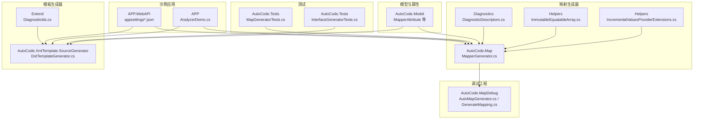
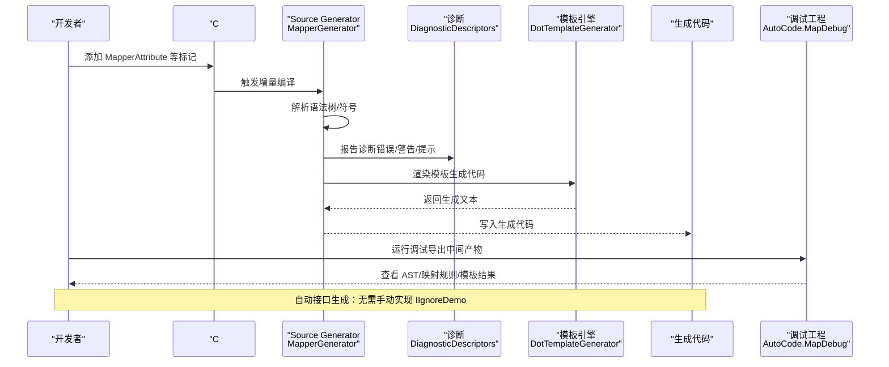
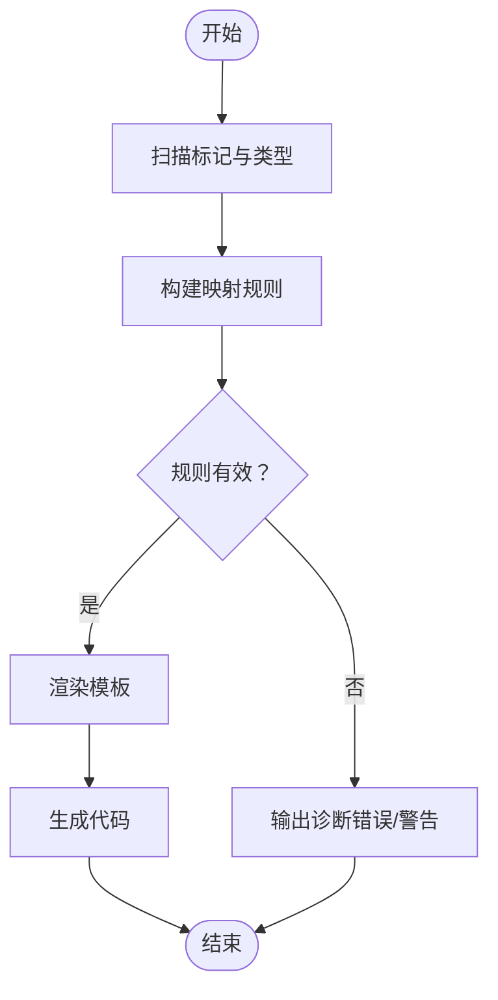
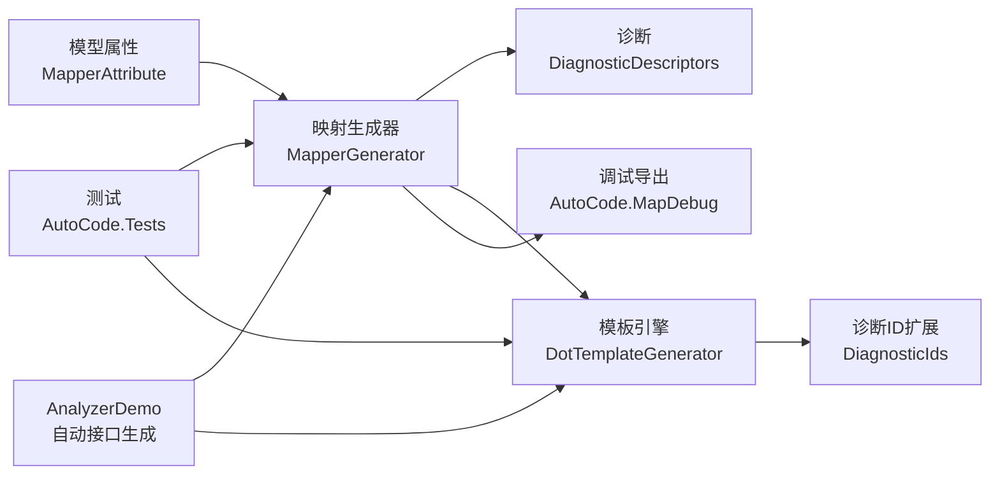

# 调试与诊断

<cite>
**本文引用的文件**   
- [README.md](file://README.md)
- [AutoCode.Map/Diagnostics/DiagnosticDescriptors.cs](file://src/AutoCode.Map/Diagnostics/DiagnosticDescriptors.cs)
- [AutoCode.Map/MapperGenerator.cs](file://src/AutoCode.Map/MapperGenerator.cs)
- [AutoCode.Map/Helpers/ImmutableEquatableArray.cs](file://src/AutoCode.Map/Helpers/ImmutableEquatableArray.cs)
- [AutoCode.Map/Helpers/IncrementalValuesProviderExtensions.cs](file://src/AutoCode.Map/Helpers/IncrementalValuesProviderExtensions.cs)
- [AutoCode.Mapdebug/AutoMapGenerator.cs](file://src/AutoCode.Mapdebug/AutoMapGenerator.cs)
- [AutoCode.Mapdebug/GenerateMapping.cs](file://src/AutoCode.Mapdebug/GenerateMapping.cs)
- [AutoCode.Model/AutoMapperModel/MapperAttribute.cs](file://src/AutoCode.Model/AutoMapperModel/MapperAttribute.cs)
- [AutoCode.Tests/MapGeneratorTests.cs](file://src/AutoCode.Tests/MapGeneratorTests.cs)
- [AutoCode.Tests/InterfaceGeneratorTests.cs](file://src/AutoCode.Tests/InterfaceGeneratorTests.cs)
- [AutoCode.DotTemplate.SourceGenerator/DotTemplateGenerator.cs](file://src/AutoCode.XmlTemplate.SourceGenerator/DotTemplateGenerator.cs)
- [AutoCode.DotTemplate.SourceGenerator/Extend/DiagnosticIds.cs](file://src/AutoCode.XmlTemplate.SourceGenerator/Extend/DiagnosticIds.cs)
- [APP.WebAPI/appsettings.json](file://src/APP.WebAPI/appsettings.json)
- [APP.WebAPI/appsettings.Development.json](file://src/APP.WebAPI/appsettings.Development.json)
- [APP/AnalyzerDemo.cs](file://src/APP/AnalyzerDemo.cs)
</cite>

## 更新摘要
**所做更改**   
- 更新了接口生成能力相关章节，反映自动接口生成的改进
- 新增了 AnalyzerDemo.cs 的使用示例和最佳实践
- 更新了调试工具使用指南，包含新的自动生成功能演示
- 完善了故障排查指南，涵盖接口自动生成相关问题

## 目录
1. [简介](#简介)
2. [项目结构](#项目结构)
3. [核心组件](#核心组件)
4. [架构总览](#架构总览)
5. [详细组件分析](#详细组件分析)
6. [依赖关系分析](#依赖关系分析)
7. [性能考量](#性能考量)
8. [故障排查指南](#故障排查指南)
9. [结论](#结论)
10. [附录](#附录)

## 简介
本指南面向使用 AutoCode 框架的开发者，聚焦于"调试与诊断"主题。内容涵盖：
- 如何使用 Source Generator 调试工具查看生成代码、定位问题
- 如何理解并处理 DiagnosticDescriptors 的诊断信息
- 测试策略与断言验证（单元测试与集成测试）
- 常见问题排查步骤、日志配置与性能监控技巧
- 持续集成中的自动化诊断与质量门禁
- **新增**：自动接口生成能力的调试与验证方法

## 项目结构
AutoCode 由多个工程组成，核心包括：
- 模型与属性定义：AutoCode.Model
- 映射生成器：AutoCode.Map（含诊断与增量编译辅助）
- 模板生成器：AutoCode.XmlTemplate.SourceGenerator
- 调试工程：AutoCode.MapDebug（用于可视化/导出中间产物）
- 测试工程：AutoCode.Tests
- 示例应用：APP、APP.WebAPI 等

图表来源
- [AutoCode.Map/MapperGenerator.cs](file://src/AutoCode.Map/MapperGenerator.cs)
- [AutoCode.Map/Diagnostics/DiagnosticDescriptors.cs](file://src/AutoCode.Map/Diagnostics/DiagnosticDescriptors.cs)
- [AutoCode.Map/Helpers/ImmutableEquatableArray.cs](file://src/AutoCode.Map/Helpers/ImmutableEquatableArray.cs)
- [AutoCode.Map/Helpers/IncrementalValuesProviderExtensions.cs](file://src/AutoCode.Map/Helpers/IncrementalValuesProviderExtensions.cs)
- [AutoCode.XmlTemplate.SourceGenerator/DotTemplateGenerator.cs](file://src/AutoCode.XmlTemplate.SourceGenerator/DotTemplateGenerator.cs)
- [AutoCode.XmlTemplate.SourceGenerator/Extend/DiagnosticIds.cs](file://src/AutoCode.XmlTemplate.SourceGenerator/Extend/DiagnosticIds.cs)
- [AutoCode.Mapdebug/AutoMapGenerator.cs](file://src/AutoCode.Mapdebug/AutoMapGenerator.cs)
- [AutoCode.Mapdebug/GenerateMapping.cs](file://src/AutoCode.Mapdebug/GenerateMapping.cs)
- [AutoCode.Model/AutoMapperModel/MapperAttribute.cs](file://src/AutoCode.Model/AutoMapperModel/MapperAttribute.cs)
- [AutoCode.Tests/MapGeneratorTests.cs](file://src/AutoCode.Tests/MapGeneratorTests.cs)
- [AutoCode.Tests/InterfaceGeneratorTests.cs](file://src/AutoCode.Tests/InterfaceGeneratorTests.cs)
- [APP.WebAPI/appsettings.json](file://src/APP.WebAPI/appsettings.json)
- [APP.WebAPI/appsettings.Development.json](file://src/APP.WebAPI/appsettings.Development.json)
- [APP/AnalyzerDemo.cs](file://src/APP/AnalyzerDemo.cs)

章节来源
- [README.md](file://README.md)

## 核心组件
- 映射生成器（MapperGenerator）：负责扫描标记、构建映射规则、调用模板引擎生成代码，并输出诊断信息。
- 诊断描述（DiagnosticDescriptors）：集中定义诊断 ID、严重级别、标题与消息模板，便于统一管理与本地化。
- 增量编译辅助（Helpers）：提供不可变数组与增量值提供者扩展，提升 Source Generator 的性能与稳定性。
- 模板生成器（DotTemplateGenerator）：基于 doT 模板引擎生成 C# 代码，支持外部扩展方法。
- 调试工程（AutoCode.MapDebug）：提供中间产物导出与可视化能力，便于定位生成逻辑问题。
- 测试工程（AutoCode.Tests）：覆盖映射与接口生成的关键路径，确保回归稳定。
- **新增**：自动接口生成器：能够根据类定义自动生成接口实现，减少手动编码工作。

章节来源
- [AutoCode.Map/MapperGenerator.cs](file://src/AutoCode.Map/MapperGenerator.cs)
- [AutoCode.Map/Diagnostics/DiagnosticDescriptors.cs](file://src/AutoCode.Map/Diagnostics/DiagnosticDescriptors.cs)
- [AutoCode.Map/Helpers/ImmutableEquatableArray.cs](file://src/AutoCode.Map/Helpers/ImmutableEquatableArray.cs)
- [AutoCode.Map/Helpers/IncrementalValuesProviderExtensions.cs](file://src/AutoCode.Map/Helpers/IncrementalValuesProviderExtensions.cs)
- [AutoCode.XmlTemplate.SourceGenerator/DotTemplateGenerator.cs](file://src/AutoCode.XmlTemplate.SourceGenerator/DotTemplateGenerator.cs)
- [AutoCode.Mapdebug/AutoMapGenerator.cs](file://src/AutoCode.Mapdebug/AutoMapGenerator.cs)
- [AutoCode.Mapdebug/GenerateMapping.cs](file://src/AutoCode.Mapdebug/GenerateMapping.cs)
- [AutoCode.Tests/MapGeneratorTests.cs](file://src/AutoCode.Tests/MapGeneratorTests.cs)
- [AutoCode.Tests/InterfaceGeneratorTests.cs](file://src/AutoCode.Tests/InterfaceGeneratorTests.cs)

## 架构总览
下图展示了从源码到生成代码的关键流程，以及诊断与调试的接入点。

图表来源
- [AutoCode.Map/MapperGenerator.cs](file://src/AutoCode.Map/MapperGenerator.cs)
- [AutoCode.Map/Diagnostics/DiagnosticDescriptors.cs](file://src/AutoCode.Map/Diagnostics/DiagnosticDescriptors.cs)
- [AutoCode.XmlTemplate.SourceGenerator/DotTemplateGenerator.cs](file://src/AutoCode.XmlTemplate.SourceGenerator/DotTemplateGenerator.cs)
- [AutoCode.Mapdebug/AutoMapGenerator.cs](file://src/AutoCode.Mapdebug/AutoMapGenerator.cs)
- [AutoCode.Mapdebug/GenerateMapping.cs](file://src/AutoCode.Mapdebug/GenerateMapping.cs)

## 详细组件分析

### 诊断系统（DiagnosticDescriptors）
- 作用：集中管理诊断 ID、严重级别、标题与消息模板，保证一致的用户体验与可维护性。
- 使用方式：在生成器中遇到异常或边界情况时，通过统一的 API 上报诊断；IDE 会显示为错误或警告。
- 最佳实践：
  - 为每个诊断分配唯一 ID，避免冲突
  - 明确严重级别（Error/Warning/Info），便于过滤与告警
  - 消息模板包含上下文信息（如类型名、成员名、行号）

章节来源
- [AutoCode.Map/Diagnostics/DiagnosticDescriptors.cs](file://src/AutoCode.Map/Diagnostics/DiagnosticDescriptors.cs)

### 映射生成器（MapperGenerator）
- 职责：扫描带有映射属性的类型，构建映射规则，驱动模板引擎生成代码，并输出诊断。
- 关键点：
  - 增量编译：利用 IncrementalValuesProvider 减少重复工作
  - 不可变集合：使用 ImmutableEquatableArray 降低哈希比较成本
  - 错误恢复：对无法解析的节点记录诊断，继续处理其他节点

图表来源
- [AutoCode.Map/MapperGenerator.cs](file://src/AutoCode.Map/MapperGenerator.cs)
- [AutoCode.Map/Helpers/ImmutableEquatableArray.cs](file://src/AutoCode.Map/Helpers/ImmutableEquatableArray.cs)
- [AutoCode.Map/Helpers/IncrementalValuesProviderExtensions.cs](file://src/AutoCode.Map/Helpers/IncrementalValuesProviderExtensions.cs)

章节来源
- [AutoCode.Map/MapperGenerator.cs](file://src/AutoCode.Map/MapperGenerator.cs)
- [AutoCode.Map/Helpers/ImmutableEquatableArray.cs](file://src/AutoCode.Map/Helpers/ImmutableEquatableArray.cs)
- [AutoCode.Map/Helpers/IncrementalValuesProviderExtensions.cs](file://src/AutoCode.Map/Helpers/IncrementalValuesProviderExtensions.cs)

### 模板生成器（DotTemplateGenerator）
- 职责：基于 doT 模板引擎渲染 C# 代码，支持外部扩展方法注入。
- 关键点：
  - 模板变量与函数需严格校验，避免运行时错误
  - 外部扩展类应实现稳定的接口，避免破坏兼容性
  - 模板缓存与增量更新可减少重复渲染

章节来源
- [AutoCode.XmlTemplate.SourceGenerator/DotTemplateGenerator.cs](file://src/AutoCode.XmlTemplate.SourceGenerator/DotTemplateGenerator.cs)
- [AutoCode.XmlTemplate.SourceGenerator/Extend/DiagnosticIds.cs](file://src/AutoCode.XmlTemplate.SourceGenerator/Extend/DiagnosticIds.cs)

### 调试工程（AutoCode.MapDebug）
- 作用：导出中间产物（AST、映射规则、模板渲染结果），帮助定位生成逻辑问题。
- 使用建议：
  - 在复现问题时启用调试导出
  - 将导出的 JSON/文本作为问题附件提交
  - 结合 IDE 的"查看生成代码"功能交叉验证

章节来源
- [AutoCode.Mapdebug/AutoMapGenerator.cs](file://src/AutoCode.Mapdebug/AutoMapGenerator.cs)
- [AutoCode.Mapdebug/GenerateMapping.cs](file://src/AutoCode.Mapdebug/GenerateMapping.cs)

### 测试工程（AutoCode.Tests）
- 覆盖范围：映射生成与接口生成的关键用例
- 策略：
  - 单元测试：针对单个生成器行为进行断言
  - 集成测试：端到端验证从标记到生成代码的完整链路
  - 快照测试：对比生成代码变更，防止回归

章节来源
- [AutoCode.Tests/MapGeneratorTests.cs](file://src/AutoCode.Tests/MapGeneratorTests.cs)
- [AutoCode.Tests/InterfaceGeneratorTests.cs](file://src/AutoCode.Tests/InterfaceGeneratorTests.cs)

### 自动接口生成能力（新增）
- **功能概述**：AutoCode 现在能够自动根据类定义生成接口实现，无需手动编写 IIgnoreDemo 等接口的具体实现。
- **工作原理**：
  - 扫描带有特定属性的类定义
  - 自动生成对应的接口实现代码
  - 支持短属性名称和完全限定名称的混合使用
- **最佳实践**：
  - 优先使用短属性名称提高代码可读性
  - 在复杂场景下可使用完全限定名称避免歧义
  - 利用调试工具验证自动生成结果

**更新** 基于 AnalyzerDemo.cs 的重构，展示了自动接口生成的改进能力

章节来源
- [APP/AnalyzerDemo.cs](file://src/APP/AnalyzerDemo.cs)

## 依赖关系分析
- 生成器依赖模型属性（如 MapperAttribute）以识别目标类型
- 诊断模块被生成器与模板引擎共同引用，确保一致的错误报告
- 调试工程依赖生成器的中间产物导出接口
- 测试工程依赖生成器与模板引擎的公共 API

图表来源
- [AutoCode.Model/AutoMapperModel/MapperAttribute.cs](file://src/AutoCode.Model/AutoMapperModel/MapperAttribute.cs)
- [AutoCode.Map/MapperGenerator.cs](file://src/AutoCode.Map/MapperGenerator.cs)
- [AutoCode.Map/Diagnostics/DiagnosticDescriptors.cs](file://src/AutoCode.Map/Diagnostics/DiagnosticDescriptors.cs)
- [AutoCode.XmlTemplate.SourceGenerator/DotTemplateGenerator.cs](file://src/AutoCode.XmlTemplate.SourceGenerator/DotTemplateGenerator.cs)
- [AutoCode.XmlTemplate.SourceGenerator/Extend/DiagnosticIds.cs](file://src/AutoCode.XmlTemplate.SourceGenerator/Extend/DiagnosticIds.cs)
- [AutoCode.Mapdebug/AutoMapGenerator.cs](file://src/AutoCode.Mapdebug/AutoMapGenerator.cs)
- [AutoCode.Tests/MapGeneratorTests.cs](file://src/AutoCode.Tests/MapGeneratorTests.cs)
- [AutoCode.Tests/InterfaceGeneratorTests.cs](file://src/AutoCode.Tests/InterfaceGeneratorTests.cs)
- [APP/AnalyzerDemo.cs](file://src/APP/AnalyzerDemo.cs)

## 性能考量
- 增量编译：充分利用 IncrementalValuesProvider 与不可变集合，减少不必要的重新计算
- 模板渲染：缓存已渲染片段，避免重复 IO 与字符串拼接
- 诊断输出：仅在必要时输出详细信息，避免大量 I/O 影响编译速度
- 内存占用：限制 AST 与中间对象的存活时间，及时释放
- **新增**：自动接口生成优化：通过智能缓存和增量更新机制，减少重复生成开销

## 故障排查指南

### 常见症状与定位
- 未生成代码：检查是否缺少必要的标记属性或命名空间
- 生成代码不正确：查看模板变量是否正确注入，是否存在类型不匹配
- 编译报错：根据诊断 ID 与消息定位具体位置，必要时启用调试导出
- **新增**：接口生成失败：检查类定义是否符合自动生成要求，确认属性名称格式正确

### 诊断信息使用方法
- 在 IDE 中查看"错误列表"，按严重级别筛选
- 复制诊断 ID 与消息，结合源码上下文快速定位
- 对于复杂问题，导出中间产物并附加到问题单

### 日志配置与性能监控
- 应用层日志：在 appsettings.json 与 appsettings.Development.json 中配置日志级别与输出目标
- 生成器日志：在调试工程中开启详细导出，观察 AST 与模板渲染过程
- 性能监控：关注编译耗时与内存峰值，优化热点路径

### 自动接口生成问题排查（新增）
- **症状**：接口未自动生成或生成不完整
- **排查步骤**：
  1. 检查类定义是否包含必要的特性标记
  2. 验证属性名称格式（短名称 vs 完全限定名称）
  3. 使用调试工具查看生成的中间产物
  4. 确认没有手动实现的接口与自动生成冲突

章节来源
- [APP.WebAPI/appsettings.json](file://src/APP.WebAPI/appsettings.json)
- [APP.WebAPI/appsettings.Development.json](file://src/APP.WebAPI/appsettings.Development.json)
- [AutoCode.Map/Diagnostics/DiagnosticDescriptors.cs](file://src/AutoCode.Map/Diagnostics/DiagnosticDescriptors.cs)
- [AutoCode.Mapdebug/AutoMapGenerator.cs](file://src/AutoCode.Mapdebug/AutoMapGenerator.cs)
- [AutoCode.Mapdebug/GenerateMapping.cs](file://src/AutoCode.Mapdebug/GenerateMapping.cs)
- [APP/AnalyzerDemo.cs](file://src/APP/AnalyzerDemo.cs)

## 结论
通过合理使用诊断系统、调试工程与测试套件，可以高效定位与修复 AutoCode 生成过程中的问题。建议在开发过程中：
- 始终启用增量编译与最小化诊断输出
- 使用调试工程导出中间产物以辅助定位
- 编写覆盖关键路径的单元测试与集成测试
- 在 CI 中集成自动化诊断与质量门禁
- **新增**：充分利用自动接口生成能力，减少手动编码工作量

## 附录

### 单元测试编写指南
- 目标：验证生成器对输入标记的处理是否符合预期
- 要点：
  - 构造最小化的输入样例
  - 断言生成代码的结构与内容
  - 覆盖边界条件与异常路径

章节来源
- [AutoCode.Tests/MapGeneratorTests.cs](file://src/AutoCode.Tests/MapGeneratorTests.cs)
- [AutoCode.Tests/InterfaceGeneratorTests.cs](file://src/AutoCode.Tests/InterfaceGeneratorTests.cs)

### 集成测试策略
- 目标：端到端验证从标记到生成代码的完整链路
- 要点：
  - 使用真实的项目结构与依赖
  - 模拟编译与生成过程
  - 对比生成结果与期望快照

章节来源
- [AutoCode.Tests/MapGeneratorTests.cs](file://src/AutoCode.Tests/MapGeneratorTests.cs)
- [AutoCode.Tests/InterfaceGeneratorTests.cs](file://src/AutoCode.Tests/InterfaceGeneratorTests.cs)

### 持续集成配置建议
- 步骤：
  - 还原依赖并构建解决方案
  - 运行单元测试与集成测试
  - 收集诊断与日志作为构建产物
  - 失败时阻断合并请求

### 自动接口生成最佳实践（新增）
- **设计原则**：
  - 优先使用短属性名称提高代码简洁性
  - 在命名冲突时使用完全限定名称
  - 保持接口定义的清晰性和一致性
- **调试技巧**：
  - 使用 AnalyzerDemo.cs 作为参考示例
  - 通过调试工具验证生成结果
  - 定期检查自动生成代码的完整性

章节来源
- [APP/AnalyzerDemo.cs](file://src/APP/AnalyzerDemo.cs)