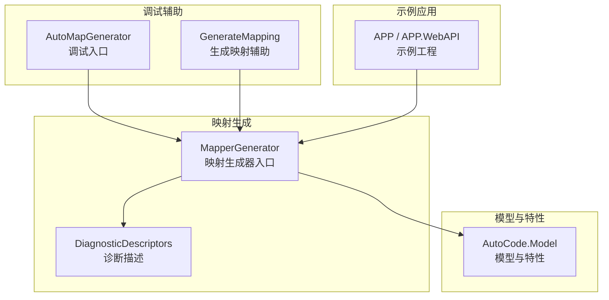
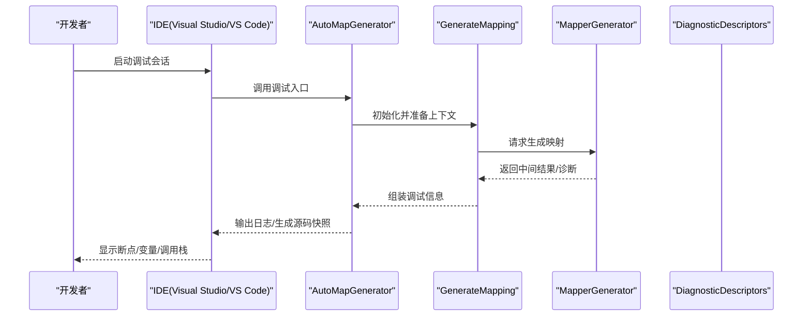
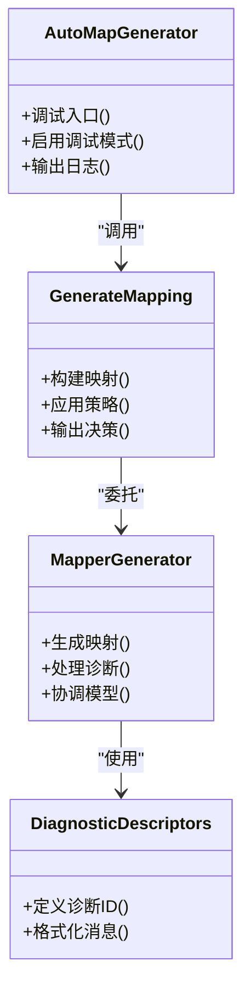

# 调试工具使用

<cite>
**本文引用的文件**   
- [AutoMapGenerator.cs](file://src/AutoCode.MapDebug/AutoMapGenerator.cs)
- [GenerateMapping.cs](file://src/AutoCode.MapDebug/GenerateMapping.cs)
- [AutoCode.MapDebug.csproj](file://src/AutoCode.MapDebug/AutoCode.MapDebug.csproj)
- [MapperGenerator.cs](file://src/AutoCode.Map/MapperGenerator.cs)
- [DiagnosticDescriptors.cs](file://src/AutoCode.Map/Diagnostics/DiagnosticDescriptors.cs)
</cite>

## 目录
1. [简介](#简介)
2. [项目结构](#项目结构)
3. [核心组件](#核心组件)
4. [架构总览](#架构总览)
5. [详细组件分析](#详细组件分析)
6. [依赖关系分析](#依赖关系分析)
7. [性能考虑](#性能考虑)
8. [故障排查指南](#故障排查指南)
9. [结论](#结论)
10. [附录](#附录)

## 简介
本指南面向使用 AutoCode 框架进行映射代码生成的开发者，聚焦于调试工具的使用。重点说明如何启用调试模式、查看生成的源代码、设置断点与逐步调试，并解释调试配置选项、日志输出格式以及调试信息的解读方法。同时提供在 Visual Studio 和 VS Code 中配置调试环境的步骤，帮助你快速定位与诊断代码生成问题。

## 项目结构
AutoCode 的映射生成相关能力主要分布在以下模块：
- AutoCode.Map：包含映射生成器入口 MapperGenerator 与诊断描述等。
- AutoCode.MapDebug：调试辅助类 AutoMapGenerator 与 GenerateMapping，用于在开发阶段输出中间结果与调试信息。
- AutoCode.Model：模型与属性定义（如枚举、策略、特性等），为生成器提供元数据。
- APP、APP.WebAPI 等示例应用：演示如何使用映射生成能力。

图表来源
- [MapperGenerator.cs](file://src/AutoCode.Map/MapperGenerator.cs)
- [DiagnosticDescriptors.cs](file://src/AutoCode.Map/Diagnostics/DiagnosticDescriptors.cs)
- [AutoMapGenerator.cs](file://src/AutoCode.MapDebug/AutoMapGenerator.cs)
- [GenerateMapping.cs](file://src/AutoCode.MapDebug/GenerateMapping.cs)

章节来源
- [AutoCode.MapDebug.csproj](file://src/AutoCode.MapDebug/AutoCode.MapDebug.csproj)

## 核心组件
- AutoMapGenerator：调试入口类，负责在开发阶段触发映射生成流程，便于观察中间状态与输出。
- GenerateMapping：生成映射的辅助类，封装了具体的映射构建逻辑，便于在调试时单步执行与检查。
- MapperGenerator：映射生成器的核心实现，协调源模型、目标模型与策略，产出最终代码。
- DiagnosticDescriptors：诊断描述集合，用于统一错误、警告与提示信息的标识与格式化。

章节来源
- [AutoMapGenerator.cs](file://src/AutoCode.MapDebug/AutoMapGenerator.cs)
- [GenerateMapping.cs](file://src/AutoCode.MapDebug/GenerateMapping.cs)
- [MapperGenerator.cs](file://src/AutoCode.Map/MapperGenerator.cs)
- [DiagnosticDescriptors.cs](file://src/AutoCode.Map/Diagnostics/DiagnosticDescriptors.cs)

## 架构总览
下图展示了从调试入口到映射生成、再到诊断输出的整体调用链。

图表来源
- [AutoMapGenerator.cs](file://src/AutoCode.MapDebug/AutoMapGenerator.cs)
- [GenerateMapping.cs](file://src/AutoCode.MapDebug/GenerateMapping.cs)
- [MapperGenerator.cs](file://src/AutoCode.Map/MapperGenerator.cs)
- [DiagnosticDescriptors.cs](file://src/AutoCode.Map/Diagnostics/DiagnosticDescriptors.cs)

## 详细组件分析

### AutoMapGenerator 调试入口
- 职责
  - 作为调试入口，集中触发映射生成流程。
  - 收集并暴露中间状态，便于在 IDE 中查看。
  - 支持切换调试模式开关，控制是否输出详细日志与源码快照。
- 关键用法
  - 在测试或示例工程中调用调试入口方法。
  - 通过配置项启用“调试模式”，以输出更详细的诊断信息。
  - 在 IDE 中设置断点，逐步进入生成流程，观察参数与中间结果。
- 调试建议
  - 首次运行建议开启“调试模式”以获得完整日志。
  - 关注异常堆栈与诊断消息，定位具体失败位置。
  - 将生成的中间文件保存到固定路径，便于对比与回溯。

章节来源
- [AutoMapGenerator.cs](file://src/AutoCode.MapDebug/AutoMapGenerator.cs)

### GenerateMapping 生成映射辅助
- 职责
  - 封装映射构建的具体逻辑，包括字段匹配、类型转换、策略应用等。
  - 在调试模式下输出关键决策点与转换规则。
- 关键用法
  - 由 AutoMapGenerator 调用，传入源/目标模型与配置。
  - 在关键分支处设置断点，验证映射规则是否符合预期。
  - 结合日志输出，确认转换策略生效情况。
- 调试建议
  - 对复杂类型转换，逐行跟踪执行路径。
  - 若出现映射缺失或类型不匹配，优先检查输入模型与策略配置。
  - 利用 IDE 的“监视窗口”实时查看对象状态变化。

章节来源
- [GenerateMapping.cs](file://src/AutoCode.MapDebug/GenerateMapping.cs)

### MapperGenerator 映射生成器
- 职责
  - 协调源/目标模型、策略与模板，生成最终映射代码。
  - 集成诊断系统，输出结构化诊断信息。
- 关键用法
  - 被调试入口调用，接收上下文与配置。
  - 在生成过程中抛出或记录诊断信息，供上层处理。
- 调试建议
  - 关注生成阶段的异常与警告，结合诊断 ID 快速定位问题。
  - 使用“增量编译”或“只生成一次”的方式减少干扰。

章节来源
- [MapperGenerator.cs](file://src/AutoCode.Map/MapperGenerator.cs)

### DiagnosticDescriptors 诊断描述
- 职责
  - 统一定义诊断 ID、标题、描述与严重级别。
  - 提供格式化字符串，便于在不同平台一致展示。
- 关键用法
  - 生成器在错误/警告时引用对应描述。
  - 调试时可过滤特定诊断 ID，聚焦关键问题。
- 调试建议
  - 将常用诊断 ID 加入过滤器，提升排障效率。
  - 结合日志时间戳与调用栈，还原问题发生顺序。

章节来源
- [DiagnosticDescriptors.cs](file://src/AutoCode.Map/Diagnostics/DiagnosticDescriptors.cs)

## 依赖关系分析
- AutoMapGenerator 依赖 GenerateMapping 完成映射构建。
- GenerateMapping 依赖 MapperGenerator 的核心生成能力。
- MapperGenerator 依赖 AutoCode.Model 中的模型与特性定义。
- 诊断信息通过 DiagnosticDescriptors 统一输出。

图表来源
- [AutoMapGenerator.cs](file://src/AutoCode.MapDebug/AutoMapGenerator.cs)
- [GenerateMapping.cs](file://src/AutoCode.MapDebug/GenerateMapping.cs)
- [MapperGenerator.cs](file://src/AutoCode.Map/MapperGenerator.cs)
- [DiagnosticDescriptors.cs](file://src/AutoCode.Map/Diagnostics/DiagnosticDescriptors.cs)

## 性能考虑
- 调试模式会显著增加日志与快照输出，建议在本地开发环境启用，生产环境关闭。
- 大模型或复杂映射场景下，建议分模块调试，避免一次性加载过多上下文。
- 合理使用增量编译，减少重复生成带来的开销。

## 故障排查指南
- 常见问题
  - 未启用调试模式导致无法查看详细日志。
  - 断点未命中，需确认调试符号已正确加载。
  - 诊断信息过多，难以定位关键问题。
- 排查步骤
  - 确认调试入口已被调用，且调试模式已开启。
  - 在关键分支设置断点，逐步执行并观察变量状态。
  - 过滤诊断 ID，仅保留与当前问题相关的信息。
  - 保存中间产物与日志，便于对比与复现。
- 常见症状与对策
  - 映射缺失：检查源/目标字段命名策略与类型兼容性。
  - 类型转换失败：确认转换策略与自定义转换器配置。
  - 性能下降：减少不必要的日志输出，优化模型规模。

章节来源
- [DiagnosticDescriptors.cs](file://src/AutoCode.Map/Diagnostics/DiagnosticDescriptors.cs)

## 结论
通过 AutoMapGenerator 与 GenerateMapping 的协同工作，开发者可以在 IDE 中高效地调试映射生成过程。启用调试模式、合理设置断点、理解诊断信息与日志格式，是快速定位与解决代码生成问题的关键。建议在本地开发环境中充分使用这些能力，以提升开发与维护效率。

## 附录

### 在 Visual Studio 中配置调试环境
- 步骤
  - 打开解决方案，确保 AutoCode.MapDebug 项目已包含在解决方案中。
  - 在 AutoMapGenerator 的调试入口方法处设置断点。
  - 选择“调试”→“开始调试”，运行示例应用或测试用例。
  - 在“输出”窗口查看调试日志，必要时切换到“调试控制台”交互。
- 技巧
  - 使用“条件断点”仅在满足特定条件时中断。
  - 在“监视窗口”添加关键变量，实时监控状态变化。
  - 将生成的中间文件路径添加到“附加到进程”以便外部查看。

### 在 VS Code 中配置调试环境
- 步骤
  - 安装 C# 扩展与 .NET SDK。
  - 在项目根目录创建 launch.json，配置 .NET Core 调试器。
  - 在 AutoMapGenerator 的调试入口方法处设置断点。
  - 点击“运行和调试”，选择配置的启动项并启动调试。
- 技巧
  - 使用“条件断点”与“日志断点”提高调试效率。
  - 在“终端”中查看实时日志输出。
  - 将中间产物输出到固定目录，便于对比与分析。

### 调试配置选项与日志格式
- 调试模式开关
  - 作用：控制是否输出详细日志与源码快照。
  - 建议：开发环境开启，生产环境关闭。
- 日志输出格式
  - 时间戳：便于按时间线追踪问题。
  - 严重级别：区分信息、警告与错误。
  - 诊断 ID：唯一标识诊断消息，便于过滤与检索。
- 调试信息解读
  - 调用栈：帮助定位问题发生的函数层级。
  - 变量值：反映当前执行上下文的状态。
  - 中间产物：用于对比与回溯生成过程。
