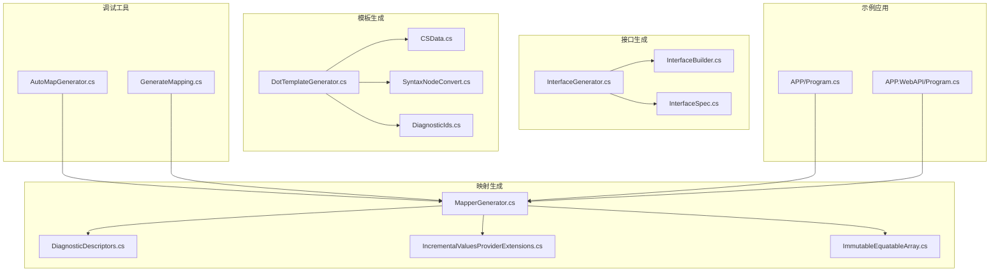
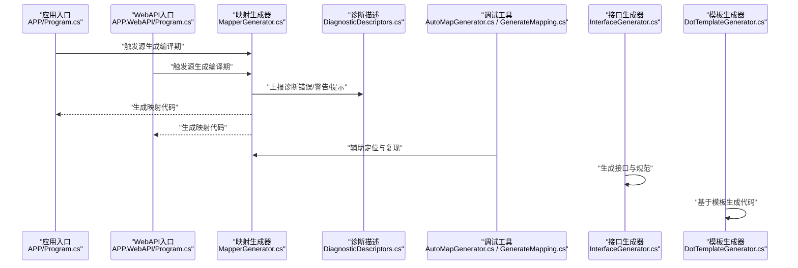
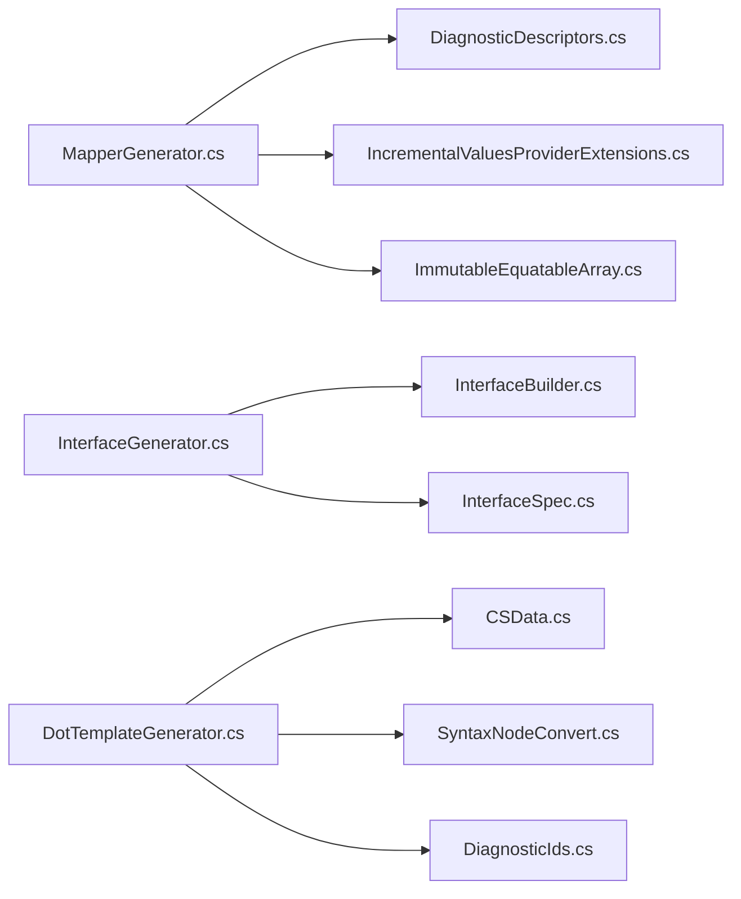
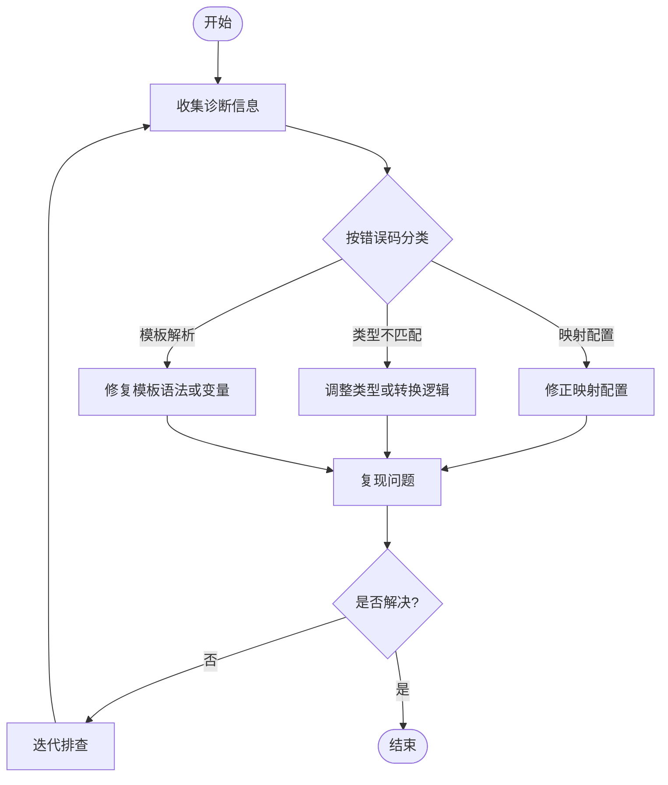

# 错误排查与诊断

<cite>
**本文引用的文件**   
- [DiagnosticDescriptors.cs](file://src/AutoCode.Map/Diagnostics/DiagnosticDescriptors.cs)
- [MapperGenerator.cs](file://src/AutoCode.Map/MapperGenerator.cs)
- [IncrementalValuesProviderExtensions.cs](file://src/AutoCode.Map/Helpers/IncrementalValuesProviderExtensions.cs)
- [ImmutableEquatableArray.cs](file://src/AutoCode.Map/Helpers/ImmutableEquatableArray.cs)
- [AutoMapGenerator.cs](file://src/AutoCode.MapDebug/AutoMapGenerator.cs)
- [GenerateMapping.cs](file://src/AutoCode.MapDebug/GenerateMapping.cs)
- [InterfaceGenerator.cs](file://src/AutoCodeGenerator/InterfaceAutoBuilder/InterfaceGenerator.cs)
- [InterfaceBuilder.cs](file://src/AutoCodeGenerator/InterfaceAutoBuilder/InterfaceBuilder.cs)
- [InterfaceSpec.cs](file://src/AutoCodeGenerator/InterfaceAutoBuilder/InterfaceSpec.cs)
- [DotTemplateGenerator.cs](file://src/AutoCode.XmlTemplate.SourceGenerator/DotTemplateGenerator.cs)
- [CSData.cs](file://src/AutoCode.XmlTemplate.SourceGenerator/CSData.cs)
- [SyntaxNodeConvert.cs](file://src/AutoCode.XmlTemplate.SourceGenerator/SyntaxNodeConvert.cs)
- [DiagnosticIds.cs](file://src/AutoCode.XmlTemplate.SourceGenerator/Extend/DiagnosticIds.cs)
- [Program.cs](file://src/APP/Program.cs)
- [Program.cs](file://src/APP.WebAPI/Program.cs)
</cite>

## 目录
1. [简介](#简介)
2. [项目结构](#项目结构)
3. [核心组件](#核心组件)
4. [架构总览](#架构总览)
5. [详细组件分析](#详细组件分析)
6. [依赖关系分析](#依赖关系分析)
7. [性能考量](#性能考量)
8. [故障排查指南](#故障排查指南)
9. [结论](#结论)
10. [附录](#附录)

## 简介
本指南面向使用 AutoCode 框架进行代码生成（映射、接口、模板）的开发者，聚焦于“错误排查与诊断”。内容涵盖：
- 诊断信息类型、错误代码与警告含义
- 常见错误的根因、解决方案与预防措施
- 系统化的问题排查流程（编译期、运行期、性能）
- 日志解读、问题复现步骤与修复建议
- 实际案例演示如何快速定位和解决代码生成过程中的问题

## 项目结构
AutoCode 由多个 Source Generator 与辅助库组成，核心包括：
- 映射生成器（AutoCode.Map）
- 调试工具（AutoCode.MapDebug）
- 接口自动生成（AutoCodeGenerator）
- 模板生成（AutoCode.XmlTemplate.SourceGenerator）
- 模型与属性定义（AutoCode.Model）
- 示例应用（APP、APP.WebAPI）

图表来源
- [MapperGenerator.cs](file://src/AutoCode.Map/MapperGenerator.cs)
- [DiagnosticDescriptors.cs](file://src/AutoCode.Map/Diagnostics/DiagnosticDescriptors.cs)
- [IncrementalValuesProviderExtensions.cs](file://src/AutoCode.Map/Helpers/IncrementalValuesProviderExtensions.cs)
- [ImmutableEquatableArray.cs](file://src/AutoCode.Map/Helpers/ImmutableEquatableArray.cs)
- [AutoMapGenerator.cs](file://src/AutoCode.MapDebug/AutoMapGenerator.cs)
- [GenerateMapping.cs](file://src/AutoCode.MapDebug/GenerateMapping.cs)
- [InterfaceGenerator.cs](file://src/AutoCodeGenerator/InterfaceAutoBuilder/InterfaceGenerator.cs)
- [InterfaceBuilder.cs](file://src/AutoCodeGenerator/InterfaceAutoBuilder/InterfaceBuilder.cs)
- [InterfaceSpec.cs](file://src/AutoCodeGenerator/InterfaceAutoBuilder/InterfaceSpec.cs)
- [DotTemplateGenerator.cs](file://src/AutoCode.XmlTemplate.SourceGenerator/DotTemplateGenerator.cs)
- [CSData.cs](file://src/AutoCode.XmlTemplate.SourceGenerator/CSData.cs)
- [SyntaxNodeConvert.cs](file://src/AutoCode.XmlTemplate.SourceGenerator/SyntaxNodeConvert.cs)
- [DiagnosticIds.cs](file://src/AutoCode.XmlTemplate.SourceGenerator/Extend/DiagnosticIds.cs)
- [Program.cs](file://src/APP/Program.cs)
- [Program.cs](file://src/APP.WebAPI/Program.cs)

章节来源
- [MapperGenerator.cs](file://src/AutoCode.Map/MapperGenerator.cs)
- [DiagnosticDescriptors.cs](file://src/AutoCode.Map/Diagnostics/DiagnosticDescriptors.cs)
- [IncrementalValuesProviderExtensions.cs](file://src/AutoCode.Map/Helpers/IncrementalValuesProviderExtensions.cs)
- [ImmutableEquatableArray.cs](file://src/AutoCode.Map/Helpers/ImmutableEquatableArray.cs)
- [AutoMapGenerator.cs](file://src/AutoCode.MapDebug/AutoMapGenerator.cs)
- [GenerateMapping.cs](file://src/AutoCode.MapDebug/GenerateMapping.cs)
- [InterfaceGenerator.cs](file://src/AutoCodeGenerator/InterfaceAutoBuilder/InterfaceGenerator.cs)
- [InterfaceBuilder.cs](file://src/AutoCodeGenerator/InterfaceAutoBuilder/InterfaceBuilder.cs)
- [InterfaceSpec.cs](file://src/AutoCodeGenerator/InterfaceAutoBuilder/InterfaceSpec.cs)
- [DotTemplateGenerator.cs](file://src/AutoCode.XmlTemplate.SourceGenerator/DotTemplateGenerator.cs)
- [CSData.cs](file://src/AutoCode.XmlTemplate.SourceGenerator/CSData.cs)
- [SyntaxNodeConvert.cs](file://src/AutoCode.XmlTemplate.SourceGenerator/SyntaxNodeConvert.cs)
- [DiagnosticIds.cs](file://src/AutoCode.XmlTemplate.SourceGenerator/Extend/DiagnosticIds.cs)
- [Program.cs](file://src/APP/Program.cs)
- [Program.cs](file://src/APP.WebAPI/Program.cs)

## 核心组件
- 诊断描述（DiagnosticDescriptors）：集中定义所有诊断消息、严重级别与错误码，是定位问题的关键。
- 映射生成器（MapperGenerator）：实现增量式源生成，负责扫描模型、解析属性、生成映射代码并上报诊断。
- 增量处理扩展（IncrementalValuesProviderExtensions）：提供增量值处理与缓存优化能力，影响构建性能。
- 不可变数组（ImmutableEquatableArray）：用于高效比较与缓存集合，减少重复计算。
- 调试工具（AutoMapGenerator、GenerateMapping）：辅助定位映射生成问题，便于复现与验证。
- 接口生成（InterfaceGenerator、InterfaceBuilder、InterfaceSpec）：根据注解或约定生成接口与实现规范。
- 模板生成（DotTemplateGenerator、CSData、SyntaxNodeConvert）：基于模板与语法树转换生成代码。
- 模板诊断ID（DiagnosticIds）：为模板相关诊断提供统一标识。

章节来源
- [DiagnosticDescriptors.cs](file://src/AutoCode.Map/Diagnostics/DiagnosticDescriptors.cs)
- [MapperGenerator.cs](file://src/AutoCode.Map/MapperGenerator.cs)
- [IncrementalValuesProviderExtensions.cs](file://src/AutoCode.Map/Helpers/IncrementalValuesProviderExtensions.cs)
- [ImmutableEquatableArray.cs](file://src/AutoCode.Map/Helpers/ImmutableEquatableArray.cs)
- [AutoMapGenerator.cs](file://src/AutoCode.MapDebug/AutoMapGenerator.cs)
- [GenerateMapping.cs](file://src/AutoCode.MapDebug/GenerateMapping.cs)
- [InterfaceGenerator.cs](file://src/AutoCodeGenerator/InterfaceAutoBuilder/InterfaceGenerator.cs)
- [InterfaceBuilder.cs](file://src/AutoCodeGenerator/InterfaceAutoBuilder/InterfaceBuilder.cs)
- [InterfaceSpec.cs](file://src/AutoCodeGenerator/InterfaceAutoBuilder/InterfaceSpec.cs)
- [DotTemplateGenerator.cs](file://src/AutoCode.XmlTemplate.SourceGenerator/DotTemplateGenerator.cs)
- [CSData.cs](file://src/AutoCode.XmlTemplate.SourceGenerator/CSData.cs)
- [SyntaxNodeConvert.cs](file://src/AutoCode.XmlTemplate.SourceGenerator/SyntaxNodeConvert.cs)
- [DiagnosticIds.cs](file://src/AutoCode.XmlTemplate.SourceGenerator/Extend/DiagnosticIds.cs)

## 架构总览
下图展示了从应用入口到各生成器的调用链与数据流，以及诊断信息的产生位置。

图表来源
- [Program.cs](file://src/APP/Program.cs)
- [Program.cs](file://src/APP.WebAPI/Program.cs)
- [MapperGenerator.cs](file://src/AutoCode.Map/MapperGenerator.cs)
- [DiagnosticDescriptors.cs](file://src/AutoCode.Map/Diagnostics/DiagnosticDescriptors.cs)
- [AutoMapGenerator.cs](file://src/AutoCode.MapDebug/AutoMapGenerator.cs)
- [GenerateMapping.cs](file://src/AutoCode.MapDebug/GenerateMapping.cs)
- [InterfaceGenerator.cs](file://src/AutoCodeGenerator/InterfaceAutoBuilder/InterfaceGenerator.cs)
- [DotTemplateGenerator.cs](file://src/AutoCode.XmlTemplate.SourceGenerator/DotTemplateGenerator.cs)

## 详细组件分析

### 诊断描述（DiagnosticDescriptors）
- 职责：集中定义所有诊断消息、严重级别、错误码与帮助链接。
- 关键点：
  - 错误码分类：映射配置错误、类型不匹配、属性忽略冲突、模板解析失败等。
  - 严重级别：Error、Warning、Info，分别对应编译阻断、潜在风险与建议。
  - 可观测性：每个诊断包含唯一 ID，便于在日志与 IDE 中过滤与追踪。
- 常见问题：
  - 未正确配置映射导致类型转换失败。
  - 使用了不被支持的属性或特性组合。
  - 模板语法错误或变量缺失。

章节来源
- [DiagnosticDescriptors.cs](file://src/AutoCode.Map/Diagnostics/DiagnosticDescriptors.cs)

### 映射生成器（MapperGenerator）
- 职责：扫描模型与属性，解析映射规则，生成映射代码，并上报诊断。
- 关键点：
  - 增量式生成：结合 IncrementalValuesProvider 提升构建性能。
  - 错误处理：对不支持的类型、非法属性组合进行拦截并输出诊断。
  - 缓存策略：利用 ImmutableEquatableArray 减少重复计算。
- 常见问题：
  - 模型变更未触发增量更新导致生成结果不一致。
  - 复杂类型映射缺少显式配置引发运行时异常。

章节来源
- [MapperGenerator.cs](file://src/AutoCode.Map/MapperGenerator.cs)
- [IncrementalValuesProviderExtensions.cs](file://src/AutoCode.Map/Helpers/IncrementalValuesProviderExtensions.cs)
- [ImmutableEquatableArray.cs](file://src/AutoCode.Map/Helpers/ImmutableEquatableArray.cs)

### 调试工具（AutoMapGenerator、GenerateMapping）
- 职责：提供映射生成的调试与复现能力，便于定位问题。
- 关键点：
  - 可独立运行以重现生成过程。
  - 输出中间状态与诊断信息，辅助定位根因。
- 常见问题：
  - 调试环境与生产环境差异导致行为不一致。
  - 输入模型不完整或缺少必要元数据。

章节来源
- [AutoMapGenerator.cs](file://src/AutoCode.MapDebug/AutoMapGenerator.cs)
- [GenerateMapping.cs](file://src/AutoCode.MapDebug/GenerateMapping.cs)

### 接口生成（InterfaceGenerator、InterfaceBuilder、InterfaceSpec）
- 职责：根据约定或注解生成接口与实现规范。
- 关键点：
  - 支持自动忽略某些成员（如 AutoIgnoreAttribute）。
  - 通过 InterfaceSpec 定义生成规格，确保一致性。
- 常见问题：
  - 接口与实现签名不一致导致编译失败。
  - 忽略策略与业务需求冲突。

章节来源
- [InterfaceGenerator.cs](file://src/AutoCodeGenerator/InterfaceAutoBuilder/InterfaceGenerator.cs)
- [InterfaceBuilder.cs](file://src/AutoCodeGenerator/InterfaceAutoBuilder/InterfaceBuilder.cs)
- [InterfaceSpec.cs](file://src/AutoCodeGenerator/InterfaceAutoBuilder/InterfaceSpec.cs)

### 模板生成（DotTemplateGenerator、CSData、SyntaxNodeConvert、DiagnosticIds）
- 职责：基于模板与语法树转换生成代码。
- 关键点：
  - 模板解析失败会触发诊断，需检查模板语法与变量。
  - SyntaxNodeConvert 负责将语法节点转换为可用数据。
  - DiagnosticIds 提供统一的诊断标识。
- 常见问题：
  - 模板中引用了不存在的变量或方法。
  - 语法树转换过程中类型不匹配。

章节来源
- [DotTemplateGenerator.cs](file://src/AutoCode.XmlTemplate.SourceGenerator/DotTemplateGenerator.cs)
- [CSData.cs](file://src/AutoCode.XmlTemplate.SourceGenerator/CSData.cs)
- [SyntaxNodeConvert.cs](file://src/AutoCode.XmlTemplate.SourceGenerator/SyntaxNodeConvert.cs)
- [DiagnosticIds.cs](file://src/AutoCode.XmlTemplate.SourceGenerator/Extend/DiagnosticIds.cs)

## 依赖关系分析
- 低耦合高内聚：各生成器职责单一，通过清晰的接口与数据结构交互。
- 外部依赖：主要依赖 Roslyn 进行语法分析与代码生成。
- 潜在循环依赖：应避免在生成器之间直接相互引用，建议使用共享模型与事件机制。

图表来源
- [MapperGenerator.cs](file://src/AutoCode.Map/MapperGenerator.cs)
- [DiagnosticDescriptors.cs](file://src/AutoCode.Map/Diagnostics/DiagnosticDescriptors.cs)
- [IncrementalValuesProviderExtensions.cs](file://src/AutoCode.Map/Helpers/IncrementalValuesProviderExtensions.cs)
- [ImmutableEquatableArray.cs](file://src/AutoCode.Map/Helpers/ImmutableEquatableArray.cs)
- [InterfaceGenerator.cs](file://src/AutoCodeGenerator/InterfaceAutoBuilder/InterfaceGenerator.cs)
- [InterfaceBuilder.cs](file://src/AutoCodeGenerator/InterfaceAutoBuilder/InterfaceBuilder.cs)
- [InterfaceSpec.cs](file://src/AutoCodeGenerator/InterfaceAutoBuilder/InterfaceSpec.cs)
- [DotTemplateGenerator.cs](file://src/AutoCode.XmlTemplate.SourceGenerator/DotTemplateGenerator.cs)
- [CSData.cs](file://src/AutoCode.XmlTemplate.SourceGenerator/CSData.cs)
- [SyntaxNodeConvert.cs](file://src/AutoCode.XmlTemplate.SourceGenerator/SyntaxNodeConvert.cs)
- [DiagnosticIds.cs](file://src/AutoCode.XmlTemplate.SourceGenerator/Extend/DiagnosticIds.cs)

## 性能考量
- 增量生成：充分利用 IncrementalValuesProvider 与 ImmutableEquatableArray 减少重复计算。
- 缓存策略：对频繁访问的数据结构进行缓存，避免重复解析。
- 资源管理：及时释放 Roslyn 句柄，避免内存泄漏。
- 监控指标：关注生成耗时、内存占用与诊断数量变化。

## 故障排查指南

### 编译期错误排查流程
1. 收集诊断信息：查看 IDE 或控制台输出的诊断 ID 与消息。
2. 定位根因：根据错误码分类（映射配置、类型不匹配、模板解析）缩小范围。
3. 复现问题：使用调试工具（AutoMapGenerator、GenerateMapping）独立运行生成过程。
4. 验证修复：修改配置或代码后重新构建，确认诊断消失。

### 运行期异常排查流程
1. 捕获异常堆栈：记录异常类型、消息与调用栈。
2. 关联诊断：检查生成阶段是否有相关警告或提示。
3. 最小化复现：构造最小可复现代例，隔离问题。
4. 修复与回归：修复后执行单元测试与集成测试。

### 性能问题排查流程
1. 基准测试：测量生成耗时与内存占用。
2. 热点分析：识别慢点（如重复解析、大对象创建）。
3. 优化策略：引入缓存、懒加载、并行处理。
4. 持续监控：在生产环境部署监控与告警。

### 错误日志解读方法
- 诊断 ID：唯一标识，便于搜索与过滤。
- 严重级别：Error 阻断编译，Warning 提示风险，Info 提供建议。
- 上下文信息：包含文件路径、行号、相关符号名，帮助快速定位。

### 问题复现步骤
1. 准备环境：确保编译器版本与依赖一致。
2. 清理重建：删除 bin/obj 后重新构建。
3. 启用详细日志：开启 Roslyn 详细输出。
4. 逐步排除：禁用部分功能或模块，定位问题范围。

### 修复建议
- 映射配置：明确指定类型转换规则，避免隐式转换。
- 模板语法：遵循模板语言规范，检查变量与作用域。
- 增量更新：确保输入变更能触发正确的增量计算。
- 单元测试：覆盖边界条件与异常路径。

## 结论
通过系统化的诊断信息与排查流程，可以快速定位并解决 AutoCode 框架中的各类问题。建议团队建立统一的错误处理规范与监控体系，持续提升代码生成质量与效率。

## 附录
- 常用命令：清理构建、启用详细日志、运行调试工具。
- 参考文档：Roslyn 官方文档、AutoCode 使用手册。
- 联系方式：技术支持与社区反馈渠道。
