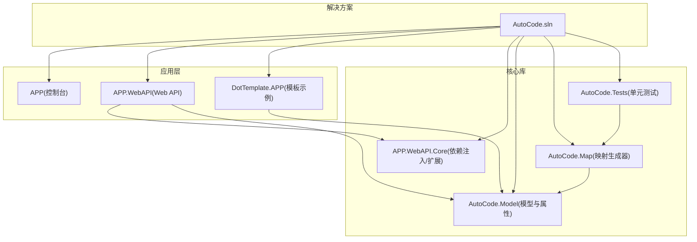
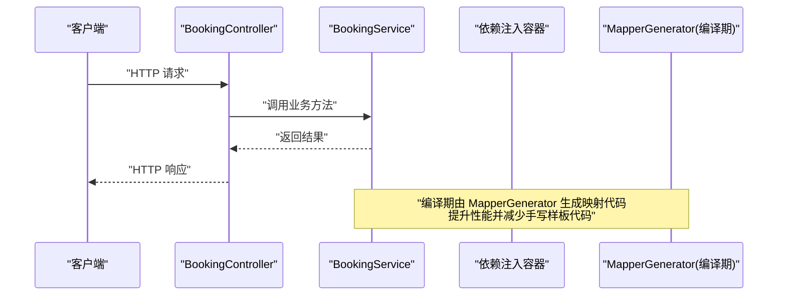
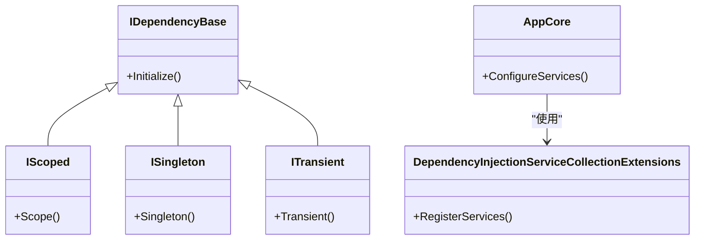
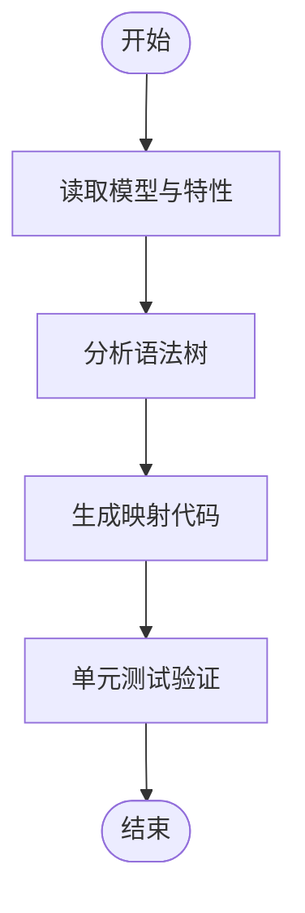
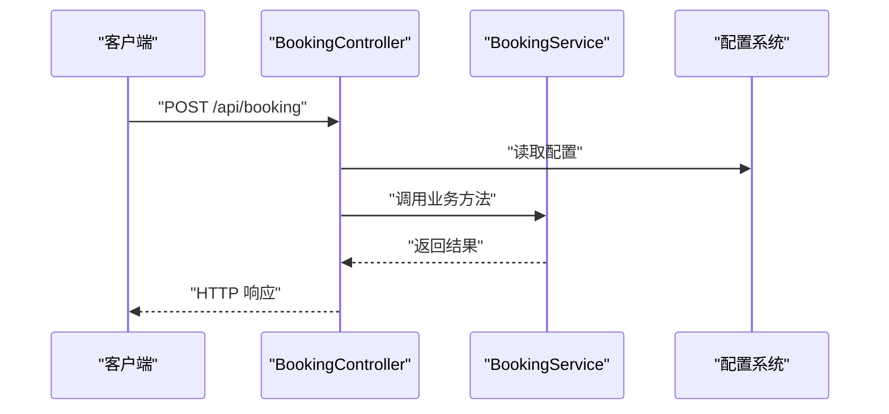
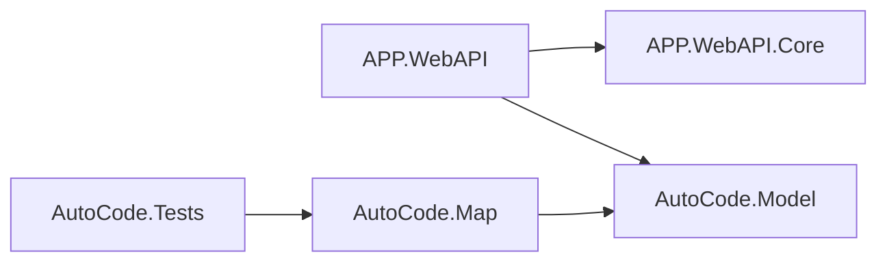

# 贡献指南

<cite>
**本文引用的文件**   
- [README.md](file://README.md)
- [README.en.md](file://README.en.md)
- [.gitignore](file://.gitignore)
- [src/AutoCode.sln](file://src/AutoCode.sln)
- [src/APP/Program.cs](file://src/APP/Program.cs)
- [src/APP.WebAPI/Program.cs](file://src/APP.WebAPI/Program.cs)
- [src/APP.WebAPI/appsettings.json](file://src/APP.WebAPI/appsettings.json)
- [src/APP.WebAPI/appsettings.Development.json](file://src/APP.WebAPI/appsettings.Development.json)
- [src/APP.WebAPI/Controllers/BookingController.cs](file://src/APP.WebAPI/Controllers/BookingController.cs)
- [src/APP.WebAPI/Services/BookingService.cs](file://src/APP.WebAPI/Services/BookingService.cs)
- [src/APP.WebAPI.Core/Application/AppCore.cs](file://src/APP.WebAPI.Core/Application/AppCore.cs)
- [src/APP.WebAPI.Core/Application/Extensions/ServiceCollectionExtensions.cs](file://src/APP.WebAPI.Core/Application/Extensions/ServiceCollectionExtensions.cs)
- [src/APP.WebAPI.Core/DependencyInjection/DependencyInjectionServiceCollectionExtensions.cs](file://src/APP.WebAPI.Core/DependencyInjection/DependencyInjectionServiceCollectionExtensions.cs)
- [src/APP.WebAPI.Core/DependencyInjection/LifeType/IDependencyBase.cs](file://src/APP.WebAPI.Core/DependencyInjection/LifeType/IDependencyBase.cs)
- [src/APP.WebAPI.Core/DependencyInjection/LifeType/IScoped.cs](file://src/APP.WebAPI.Core/DependencyInjection/LifeType/IScoped.cs)
- [src/APP.WebAPI.Core/DependencyInjection/LifeType/ISingleton.cs](file://src/APP.WebAPI.Core/DependencyInjection/LifeType/ISingleton.cs)
- [src/APP.WebAPI.Core/DependencyInjection/LifeType/ITransient.cs](file://src/APP.WebAPI.Core/DependencyInjection/LifeType/ITransient.cs)
- [src/AutoCode.Map/MapperGenerator.cs](file://src/AutoCode.Map/MapperGenerator.cs)
- [src/AutoCode.Model/AutoMapperModel/MapperAttribute.cs](file://src/AutoCode.Model/AutoMapperModel/MapperAttribute.cs)
- [src/AutoCode.Tests/MapGeneratorTests.cs](file://src/AutoCode.Tests/MapGeneratorTests.cs)
- [src/DotTemplate.APP/Program.cs](file://src/DotTemplate.APP/Program.cs)
</cite>

## 目录
1. [简介](#简介)
2. [项目结构](#项目结构)
3. [核心组件](#核心组件)
4. [架构总览](#架构总览)
5. [详细组件分析](#详细组件分析)
6. [依赖关系分析](#依赖关系分析)
7. [性能考虑](#性能考虑)
8. [故障排查指南](#故障排查指南)
9. [结论](#结论)
10. [附录](#附录)

## 简介
本贡献指南面向希望为 AutoCode 项目做出贡献的开发者，涵盖开发环境搭建、代码规范与提交约定、架构设计说明、模块职责划分、开发与提交流程、Pull Request 审查要求与测试标准、文档编写规范、Issue 报告模板以及社区行为准则。通过阅读本指南，新贡献者可以快速上手并高效参与项目开发。

## 项目结构
AutoCode 是一个基于 .NET 的代码生成与映射工具集，包含多个子项目：应用入口、Web API、核心依赖注入与应用扩展、模型与属性定义、Source Generator（源码生成器）、模板引擎、测试工程等。解决方案文件位于 src/AutoCode.sln，各子项目以功能域进行组织，便于独立构建与演进。

图表来源
- [src/AutoCode.sln](file://src/AutoCode.sln)
- [src/APP/Program.cs](file://src/APP/Program.cs)
- [src/APP.WebAPI/Program.cs](file://src/APP.WebAPI/Program.cs)
- [src/DotTemplate.APP/Program.cs](file://src/DotTemplate.APP/Program.cs)
- [src/APP.WebAPI.Core/Application/AppCore.cs](file://src/APP.WebAPI.Core/Application/AppCore.cs)
- [src/AutoCode.Map/MapperGenerator.cs](file://src/AutoCode.Map/MapperGenerator.cs)
- [src/AutoCode.Model/AutoMapperModel/MapperAttribute.cs](file://src/AutoCode.Model/AutoMapperModel/MapperAttribute.cs)
- [src/AutoCode.Tests/MapGeneratorTests.cs](file://src/AutoCode.Tests/MapGeneratorTests.cs)

章节来源
- [README.md](file://README.md)
- [README.en.md](file://README.en.md)
- [.gitignore](file://.gitignore)
- [src/AutoCode.sln](file://src/AutoCode.sln)

## 核心组件
- 应用入口与 Web API
  - 控制台应用 APP：用于演示或运行基础功能。
  - Web API 应用：提供 HTTP 接口，控制器与服务分离，配置文件按环境区分。
- 核心库
  - APP.WebAPI.Core：封装依赖注入、生命周期管理、服务注册扩展。
  - AutoCode.Model：定义映射相关的特性与枚举，供 Source Generator 使用。
- 源码生成器
  - AutoCode.Map：实现 MapperGenerator，根据模型与特性生成映射代码。
- 模板引擎
  - DotTemplate.APP：基于 doT.js 的模板示例，展示模板渲染流程。
- 测试
  - AutoCode.Tests：针对生成器的单元测试，保障生成逻辑正确性。

章节来源
- [src/APP/Program.cs](file://src/APP/Program.cs)
- [src/APP.WebAPI/Program.cs](file://src/APP.WebAPI/Program.cs)
- [src/APP.WebAPI/Controllers/BookingController.cs](file://src/APP.WebAPI/Controllers/BookingController.cs)
- [src/APP.WebAPI/Services/BookingService.cs](file://src/APP.WebAPI/Services/BookingService.cs)
- [src/APP.WebAPI.Core/Application/AppCore.cs](file://src/APP.WebAPI.Core/Application/AppCore.cs)
- [src/APP.WebAPI.Core/Application/Extensions/ServiceCollectionExtensions.cs](file://src/APP.WebAPI.Core/Application/Extensions/ServiceCollectionExtensions.cs)
- [src/APP.WebAPI.Core/DependencyInjection/DependencyInjectionServiceCollectionExtensions.cs](file://src/APP.WebAPI.Core/DependencyInjection/DependencyInjectionServiceCollectionExtensions.cs)
- [src/AutoCode.Map/MapperGenerator.cs](file://src/AutoCode.Map/MapperGenerator.cs)
- [src/AutoCode.Model/AutoMapperModel/MapperAttribute.cs](file://src/AutoCode.Model/AutoMapperModel/MapperAttribute.cs)
- [src/DotTemplate.APP/Program.cs](file://src/DotTemplate.APP/Program.cs)
- [src/AutoCode.Tests/MapGeneratorTests.cs](file://src/AutoCode.Tests/MapGeneratorTests.cs)

## 架构总览
AutoCode 采用分层与模块化设计：
- 表现层：Web API 控制器暴露 RESTful 接口。
- 业务层：服务类封装业务逻辑。
- 基础设施层：依赖注入容器、生命周期策略、服务扩展。
- 领域模型：特性与枚举定义，驱动源码生成。
- 源码生成：Source Generator 在编译期生成映射代码，减少运行时开销。
- 模板渲染：可选的模板引擎支持动态内容生成。

图表来源
- [src/APP.WebAPI/Controllers/BookingController.cs](file://src/APP.WebAPI/Controllers/BookingController.cs)
- [src/APP.WebAPI/Services/BookingService.cs](file://src/APP.WebAPI/Services/BookingService.cs)
- [src/AutoCode.Map/MapperGenerator.cs](file://src/AutoCode.Map/MapperGenerator.cs)

## 详细组件分析

### 依赖注入与生命周期
- 生命周期接口：IDependencyBase、IScoped、ISingleton、ITransient 定义了服务的生命周期契约。
- 服务注册扩展：DependencyInjectionServiceCollectionExtensions 提供统一的注册方法。
- 应用核心：AppCore 与 ServiceCollectionExtensions 负责启动配置与扩展点。

图表来源
- [src/APP.WebAPI.Core/DependencyInjection/LifeType/IDependencyBase.cs](file://src/APP.WebAPI.Core/DependencyInjection/LifeType/IDependencyBase.cs)
- [src/APP.WebAPI.Core/DependencyInjection/LifeType/IScoped.cs](file://src/APP.WebAPI.Core/DependencyInjection/LifeType/IScoped.cs)
- [src/APP.WebAPI.Core/DependencyInjection/LifeType/ISingleton.cs](file://src/APP.WebAPI.Core/DependencyInjection/LifeType/ISingleton.cs)
- [src/APP.WebAPI.Core/DependencyInjection/LifeType/ITransient.cs](file://src/APP.WebAPI.Core/DependencyInjection/LifeType/ITransient.cs)
- [src/APP.WebAPI.Core/DependencyInjection/DependencyInjectionServiceCollectionExtensions.cs](file://src/APP.WebAPI.Core/DependencyInjection/DependencyInjectionServiceCollectionExtensions.cs)
- [src/APP.WebAPI.Core/Application/AppCore.cs](file://src/APP.WebAPI.Core/Application/AppCore.cs)

章节来源
- [src/APP.WebAPI.Core/DependencyInjection/LifeType/IDependencyBase.cs](file://src/APP.WebAPI.Core/DependencyInjection/LifeType/IDependencyBase.cs)
- [src/APP.WebAPI.Core/DependencyInjection/LifeType/IScoped.cs](file://src/APP.WebAPI.Core/DependencyInjection/LifeType/IScoped.cs)
- [src/APP.WebAPI.Core/DependencyInjection/LifeType/ISingleton.cs](file://src/APP.WebAPI.Core/DependencyInjection/LifeType/ISingleton.cs)
- [src/APP.WebAPI.Core/DependencyInjection/LifeType/ITransient.cs](file://src/APP.WebAPI.Core/DependencyInjection/LifeType/ITransient.cs)
- [src/APP.WebAPI.Core/DependencyInjection/DependencyInjectionServiceCollectionExtensions.cs](file://src/APP.WebAPI.Core/DependencyInjection/DependencyInjectionServiceCollectionExtensions.cs)
- [src/APP.WebAPI.Core/Application/AppCore.cs](file://src/APP.WebAPI.Core/Application/AppCore.cs)

### 映射生成器（Source Generator）
- 模型特性：AutoCode.Model 中的 MapperAttribute 等特性用于标注映射规则。
- 生成器：AutoCode.Map 的 MapperGenerator 在编译期读取特性与语法树，生成映射代码。
- 测试：AutoCode.Tests 中的 MapGeneratorTests 验证生成逻辑的正确性。

图表来源
- [src/AutoCode.Model/AutoMapperModel/MapperAttribute.cs](file://src/AutoCode.Model/AutoMapperModel/MapperAttribute.cs)
- [src/AutoCode.Map/MapperGenerator.cs](file://src/AutoCode.Map/MapperGenerator.cs)
- [src/AutoCode.Tests/MapGeneratorTests.cs](file://src/AutoCode.Tests/MapGeneratorTests.cs)

章节来源
- [src/AutoCode.Model/AutoMapperModel/MapperAttribute.cs](file://src/AutoCode.Model/AutoMapperModel/MapperAttribute.cs)
- [src/AutoCode.Map/MapperGenerator.cs](file://src/AutoCode.Map/MapperGenerator.cs)
- [src/AutoCode.Tests/MapGeneratorTests.cs](file://src/AutoCode.Tests/MapGeneratorTests.cs)

### Web API 控制器与服务
- BookingController：处理 HTTP 请求，调用 BookingService。
- BookingService：封装业务逻辑，可能依赖注入的服务。
- 配置：appsettings.json 与 appsettings.Development.json 区分环境与参数。

图表来源
- [src/APP.WebAPI/Controllers/BookingController.cs](file://src/APP.WebAPI/Controllers/BookingController.cs)
- [src/APP.WebAPI/Services/BookingService.cs](file://src/APP.WebAPI/Services/BookingService.cs)
- [src/APP.WebAPI/appsettings.json](file://src/APP.WebAPI/appsettings.json)
- [src/APP.WebAPI/appsettings.Development.json](file://src/APP.WebAPI/appsettings.Development.json)

章节来源
- [src/APP.WebAPI/Controllers/BookingController.cs](file://src/APP.WebAPI/Controllers/BookingController.cs)
- [src/APP.WebAPI/Services/BookingService.cs](file://src/APP.WebAPI/Services/BookingService.cs)
- [src/APP.WebAPI/appsettings.json](file://src/APP.WebAPI/appsettings.json)
- [src/APP.WebAPI/appsettings.Development.json](file://src/APP.WebAPI/appsettings.Development.json)

### 模板引擎示例
- DotTemplate.APP：演示基于 doT.js 的模板渲染流程，可用于生成文本或代码片段。

章节来源
- [src/DotTemplate.APP/Program.cs](file://src/DotTemplate.APP/Program.cs)

## 依赖关系分析
- 应用依赖核心库：Web API 依赖 APP.WebAPI.Core 进行服务注册与生命周期管理。
- 生成器依赖模型：AutoCode.Map 依赖 AutoCode.Model 的特性定义。
- 测试覆盖生成器：AutoCode.Tests 对 MapperGenerator 进行单元测试。

图表来源
- [src/APP.WebAPI/Program.cs](file://src/APP.WebAPI/Program.cs)
- [src/APP.WebAPI.Core/Application/AppCore.cs](file://src/APP.WebAPI.Core/Application/AppCore.cs)
- [src/AutoCode.Map/MapperGenerator.cs](file://src/AutoCode.Map/MapperGenerator.cs)
- [src/AutoCode.Model/AutoMapperModel/MapperAttribute.cs](file://src/AutoCode.Model/AutoMapperModel/MapperAttribute.cs)
- [src/AutoCode.Tests/MapGeneratorTests.cs](file://src/AutoCode.Tests/MapGeneratorTests.cs)

章节来源
- [src/APP.WebAPI/Program.cs](file://src/APP.WebAPI/Program.cs)
- [src/APP.WebAPI.Core/Application/AppCore.cs](file://src/APP.WebAPI.Core/Application/AppCore.cs)
- [src/AutoCode.Map/MapperGenerator.cs](file://src/AutoCode.Map/MapperGenerator.cs)
- [src/AutoCode.Model/AutoMapperModel/MapperAttribute.cs](file://src/AutoCode.Model/AutoMapperModel/MapperAttribute.cs)
- [src/AutoCode.Tests/MapGeneratorTests.cs](file://src/AutoCode.Tests/MapGeneratorTests.cs)

## 性能考虑
- 编译时代码生成：通过 Source Generator 在编译期生成映射代码，避免运行时反射与动态解析，提升性能。
- 依赖注入生命周期：合理选择 Scoped/Singleton/Transient 生命周期，减少不必要的对象创建与内存占用。
- 配置优化：针对不同环境使用独立的配置文件，避免加载无关配置项。

[本节为通用指导，不直接分析具体文件]

## 故障排查指南
- 常见问题
  - 生成器未生效：检查模型是否正确使用特性，确保项目引用了 AutoCode.Model 与 AutoCode.Map。
  - 依赖注入失败：确认服务已正确注册，生命周期接口实现符合约定。
  - 配置加载错误：核对 appsettings.* 文件的键值与类型匹配。
- 调试建议
  - 使用单元测试定位生成器问题。
  - 在 Web API 中启用详细日志输出，查看异常堆栈。
  - 清理并重建解决方案，排除缓存导致的生成不一致。

章节来源
- [src/AutoCode.Tests/MapGeneratorTests.cs](file://src/AutoCode.Tests/MapGeneratorTests.cs)
- [src/APP.WebAPI/appsettings.json](file://src/APP.WebAPI/appsettings.json)
- [src/APP.WebAPI/appsettings.Development.json](file://src/APP.WebAPI/appsettings.Development.json)

## 结论
AutoCode 通过分层架构与源码生成技术，提供了高性能、可维护的代码生成与映射能力。遵循本贡献指南的开发规范、提交流程与测试标准，有助于保持代码质量与团队协作效率。欢迎新贡献者参与讨论与改进，共同推动项目发展。

[本节为总结性内容，不直接分析具体文件]

## 附录

### 开发环境设置
- 安装 .NET SDK（版本与解决方案目标一致）。
- 克隆仓库并打开 src/AutoCode.sln。
- 还原 NuGet 包并构建解决方案。
- 运行 Web API 或控制台应用进行本地验证。

### 代码规范与提交约定
- 命名规范：遵循 C# 官方命名约定，类名 PascalCase，方法名 PascalCase，字段 camelCase。
- 文件组织：按功能域划分文件夹，保持高内聚低耦合。
- 提交信息：简洁明了，描述变更目的与影响范围；必要时附带 Issue 编号。
- 分支策略：主分支稳定，功能分支命名 feature/*，修复分支命名 fix/*。

### Pull Request 流程
- 从最新主分支拉取更新，创建功能分支。
- 提交变更并通过所有单元测试。
- 发起 Pull Request，填写变更说明与影响评估。
- 等待代码审查，根据反馈修改直至合并。

### 代码审查要求
- 可读性：注释清晰，变量与方法命名明确。
- 可维护性：避免复杂嵌套，拆分大函数为小职责单元。
- 安全性：输入校验、异常处理、敏感信息脱敏。
- 性能：避免不必要的对象创建与 IO 操作。

### 测试标准
- 覆盖率：关键路径与边界条件需有单元测试覆盖。
- 稳定性：测试用例应稳定可靠，避免随机性与外部依赖。
- 自动化：CI 流水线自动执行测试与静态分析。

### 文档编写规范
- README：项目概述、快速开始、常见问题。
- API 文档：接口定义、请求/响应格式、状态码。
- 架构文档：模块职责、数据流图、依赖关系。
- 更新同步：代码变更后及时更新相关文档。

### Issue 报告模板
- 标题：简明扼要描述问题。
- 复现步骤：详细列出操作步骤。
- 期望行为：说明预期结果。
- 实际行为：描述当前问题现象。
- 环境信息：操作系统、.NET 版本、依赖版本。
- 附加材料：日志、截图、最小复现代码。

### 社区行为准则
- 尊重他人：友善交流，避免人身攻击。
- 开放协作：鼓励提问与分享经验。
- 遵守规则：遵循项目规范与平台政策。
- 积极反馈：建设性意见与改进建议。

[本节为通用指导，不直接分析具体文件]