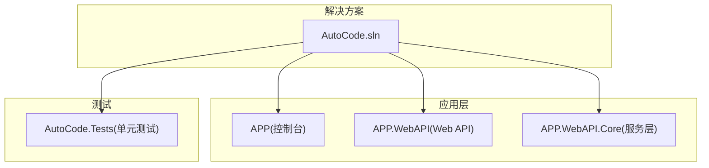
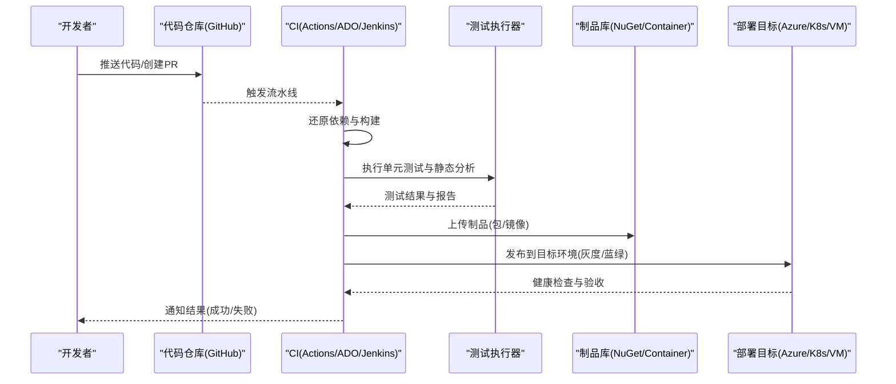
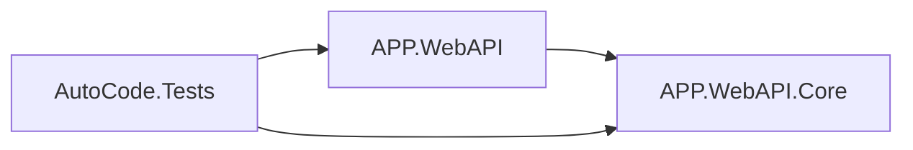

# CI/CD流水线配置

<cite>
**本文引用的文件**   
- [README.md](file://README.md)
- [README.en.md](file://README.en.md)
- [AutoCode.sln](file://src/AutoCode.sln)
- [APP.csproj](file://src/APP/APP.csproj)
- [APP.WebAPI.csproj](file://src/APP.WebAPI/APP.WebAPI.csproj)
- [APP.WebAPI.Core.csproj](file://src/APP.WebAPI.Core/APP.WebAPI.Core.csproj)
- [AutoCode.Tests.csproj](file://src/AutoCode.Tests/AutoCode.Tests.csproj)
- [launchSettings.json](file://src/APP.WebAPI/Properties/launchSettings.json)
- [appsettings.json](file://src/APP.WebAPI/appsettings.json)
- [appsettings.Development.json](file://src/APP.WebAPI/appsettings.Development.json)
</cite>

## 目录
1. [简介](#简介)
2. [项目结构](#项目结构)
3. [核心组件](#核心组件)
4. [架构总览](#架构总览)
5. [详细组件分析](#详细组件分析)
6. [依赖分析](#依赖分析)
7. [性能考虑](#性能考虑)
8. [故障排查指南](#故障排查指南)
9. [结论](#结论)
10. [附录](#附录)

## 简介
本文件面向AutoCode项目的持续集成与持续部署（CI/CD）流水线设计与落地，覆盖GitHub Actions、Azure DevOps与Jenkins三种平台的配置思路与实践要点。内容包含自动化测试执行、代码质量检查、静态分析与构建验证流程；多环境部署策略、环境变量管理与密钥安全存储方案；以及回滚机制、监控告警与故障恢复策略。文档以仓库现有.NET解决方案与Web API应用为基础，给出可操作的流水线蓝图与最佳实践建议。

## 项目结构
AutoCode是一个.NET解决方案，包含多个项目：
- Web API应用与服务层：APP.WebAPI、APP.WebAPI.Core
- 控制台/工具应用：APP
- 单元测试项目：AutoCode.Tests
- 其他库与生成器相关项目（用于源码生成、映射等）

关键配置文件：
- 解决方案文件：AutoCode.sln
- Web API运行配置：launchSettings.json、appsettings.json、appsettings.Development.json
- 各项目工程文件：*.csproj

图表来源
- [AutoCode.sln](file://src/AutoCode.sln)
- [APP.csproj](file://src/APP/APP.csproj)
- [APP.WebAPI.csproj](file://src/APP.WebAPI/APP.WebAPI.csproj)
- [APP.WebAPI.Core.csproj](file://src/APP.WebAPI.Core/APP.WebAPI.Core.csproj)
- [AutoCode.Tests.csproj](file://src/AutoCode.Tests/AutoCode.Tests.csproj)

章节来源
- [AutoCode.sln](file://src/AutoCode.sln)
- [APP.csproj](file://src/APP/APP.csproj)
- [APP.WebAPI.csproj](file://src/APP.WebAPI/APP.WebAPI.csproj)
- [APP.WebAPI.Core.csproj](file://src/APP.WebAPI.Core/APP.WebAPI.Core.csproj)
- [AutoCode.Tests.csproj](file://src/AutoCode.Tests/AutoCode.Tests.csproj)

## 核心组件
- 构建与打包
  - 使用dotnet CLI进行还原、编译、测试与发布。
  - 输出产物为自包含或框架依赖的Web API包，便于容器化或直接部署到托管平台。
- 测试
  - 通过xUnit/NUnit/MSTest（取决于测试项目引用）执行单元测试，建议在CI中并行执行以提升速度。
- 代码质量与静态分析
  - 启用Roslyn分析器、SonarQube/SonarCloud扫描、NuGet包审计。
- 部署
  - 将Web API发布产物推送至容器镜像仓库或云平台（如Azure App Service、AKS、Docker Hub）。
  - 支持多环境（开发、预发、生产）差异化配置与密钥管理。

章节来源
- [APP.WebAPI.csproj](file://src/APP.WebAPI/APP.WebAPI.csproj)
- [APP.WebAPI.Core.csproj](file://src/APP.WebAPI.Core/APP.WebAPI.Core.csproj)
- [AutoCode.Tests.csproj](file://src/AutoCode.Tests/AutoCode.Tests.csproj)

## 架构总览
下图展示从代码提交到部署上线的端到端流水线，涵盖构建、测试、质量门禁、制品归档与多环境发布。

图表来源
- [APP.WebAPI.csproj](file://src/APP.WebAPI/APP.WebAPI.csproj)
- [AutoCode.Tests.csproj](file://src/AutoCode.Tests/AutoCode.Tests.csproj)

## 详细组件分析

### GitHub Actions 流水线示例
- 触发条件
  - push到main/release分支、创建PR时触发。
- 阶段
  - 构建：dotnet restore/build
  - 测试：dotnet test（收集覆盖率与报告）
  - 质量：SonarQube扫描、NuGet包审计
  - 制品：打包NuGet或构建Docker镜像并推送到仓库
  - 部署：按环境发布到Azure App Service或Kubernetes
- 密钥与环境变量
  - 使用GitHub Secrets存储连接字符串、证书、注册表凭据等。
  - 在workflow中以环境变量注入，避免硬编码。
- 回滚与验证
  - 发布后执行健康检查与冒烟测试，失败则自动回滚到上一稳定版本。

章节来源
- [APP.WebAPI.csproj](file://src/APP.WebAPI/APP.WebAPI.csproj)
- [AutoCode.Tests.csproj](file://src/AutoCode.Tests/AutoCode.Tests.csproj)

### Azure DevOps 流水线示例
- 触发条件
  - 分支策略（例如develop/main）与PR规则。
- 阶段
  - 构建与测试：使用DotNetCoreCLI任务执行restore/build/test
  - 质量门禁：SonarQube任务与代码覆盖率阈值
  - 制品：NuGet打包或Docker镜像构建与推送
  - 部署：使用Azure App Service部署任务或Kubernetes任务
- 密钥与环境变量
  - 使用变量组与密钥库（Key Vault）集成，运行时注入。
- 回滚与验证
  - 发布管道支持蓝绿/金丝雀发布，结合健康检查与自动回滚。

章节来源
- [APP.WebAPI.csproj](file://src/APP.WebAPI/APP.WebAPI.csproj)
- [AutoCode.Tests.csproj](file://src/AutoCode.Tests/AutoCode.Tests.csproj)

### Jenkins 流水线示例
- 触发条件
  - SCM轮询或Webhook触发。
- 阶段
  - 构建与测试：Pipeline脚本调用dotnet命令
  - 质量：SonarQube插件与覆盖率统计
  - 制品：构建镜像并推送到私有仓库
  - 部署：调用kubectl或云平台API进行发布
- 密钥与环境变量
  - 使用Credentials插件管理敏感信息，通过环境变量注入。
- 回滚与验证
  - 发布后执行健康检查，失败则回滚到上一个镜像标签。

章节来源
- [APP.WebAPI.csproj](file://src/APP.WebAPI/APP.WebAPI.csproj)
- [AutoCode.Tests.csproj](file://src/AutoCode.Tests/AutoCode.Tests.csproj)

### 自动化测试执行
- 测试范围
  - 单元测试：覆盖业务逻辑与接口契约
  - 可选集成测试：数据库、外部服务模拟
- 执行策略
  - 并行执行测试用例，缩短反馈时间
  - 生成覆盖率报告并在质量门禁中设置阈值
- 失败处理
  - 立即中断流水线并通知团队

章节来源
- [AutoCode.Tests.csproj](file://src/AutoCode.Tests/AutoCode.Tests.csproj)

### 代码质量检查与静态分析
- Roslyn分析器
  - 在构建过程中启用默认或自定义规则集
- SonarQube/SonarCloud
  - 统一质量门禁（重复率、复杂度、漏洞、覆盖率）
- NuGet包审计
  - 检测已知漏洞与不合规包

章节来源
- [APP.WebAPI.csproj](file://src/APP.WebAPI/APP.WebAPI.csproj)
- [APP.WebAPI.Core.csproj](file://src/APP.WebAPI.Core/APP.WebAPI.Core.csproj)

### 构建验证流程
- 步骤
  - 还原依赖：dotnet restore
  - 编译：dotnet build（开启警告为错误）
  - 测试：dotnet test（并行+覆盖率）
  - 发布：dotnet publish（指定环境与运行时）
- 产物
  - 二进制包或Docker镜像，附带版本标签与构建元数据

章节来源
- [APP.WebAPI.csproj](file://src/APP.WebAPI/APP.WebAPI.csproj)
- [APP.csproj](file://src/APP/APP.csproj)

### 多环境部署策略
- 环境划分
  - 开发、预发、生产，各自独立配置与资源
- 配置管理
  - 使用appsettings.{Environment}.json与启动参数区分环境
  - 敏感信息通过环境变量或密钥管理服务注入
- 发布模式
  - 蓝绿部署、金丝雀发布、滚动更新
- 健康检查与验收
  - 发布后执行HTTP探针与冒烟测试，确保可用性

章节来源
- [launchSettings.json](file://src/APP.WebAPI/Properties/launchSettings.json)
- [appsettings.json](file://src/APP.WebAPI/appsettings.json)
- [appsettings.Development.json](file://src/APP.WebAPI/appsettings.Development.json)

### 环境变量管理与密钥安全存储
- 原则
  - 不在代码或制品中存放任何密钥
  - 最小权限原则，按需授予访问令牌
- 实现
  - GitHub Secrets、Azure Key Vault、Jenkins Credentials
  - 在CI中通过环境变量注入到应用进程
- 审计与轮换
  - 定期轮换密钥，记录访问日志

章节来源
- [appsettings.json](file://src/APP.WebAPI/appsettings.json)
- [appsettings.Development.json](file://src/APP.WebAPI/appsettings.Development.json)

### 回滚机制、监控告警与故障恢复
- 回滚机制
  - 基于镜像标签或发布版本快速回滚到上一稳定版本
  - 自动化健康检查失败触发回滚
- 监控告警
  - 应用指标（CPU、内存、请求延迟、错误率）
  - 日志聚合与异常告警（如Application Insights、Prometheus/Grafana）
- 故障恢复
  - 自动重试与熔断
  - 降级策略与只读模式切换

章节来源
- [APP.WebAPI.csproj](file://src/APP.WebAPI/APP.WebAPI.csproj)

## 依赖分析
- 项目间依赖
  - APP.WebAPI依赖APP.WebAPI.Core（服务层）
  - AutoCode.Tests依赖被测项目以执行单元测试
- 外部依赖
  - .NET SDK、NuGet包、容器运行时、云平台SDK
- 风险点
  - 第三方包漏洞与许可证合规
  - 构建缓存失效导致耗时增加

图表来源
- [APP.WebAPI.csproj](file://src/APP.WebAPI/APP.WebAPI.csproj)
- [APP.WebAPI.Core.csproj](file://src/APP.WebAPI.Core/APP.WebAPI.Core.csproj)
- [AutoCode.Tests.csproj](file://src/AutoCode.Tests/AutoCode.Tests.csproj)

章节来源
- [APP.WebAPI.csproj](file://src/APP.WebAPI/APP.WebAPI.csproj)
- [APP.WebAPI.Core.csproj](file://src/APP.WebAPI.Core/APP.WebAPI.Core.csproj)
- [AutoCode.Tests.csproj](file://src/AutoCode.Tests/AutoCode.Tests.csproj)

## 性能考虑
- 构建优化
  - 使用构建缓存（依赖、中间产物）
  - 并行编译与测试
- 测试优化
  - 隔离测试数据，减少IO
  - 使用Mock替代真实依赖
- 部署优化
  - 增量发布与滚动更新
  - 镜像分层与缓存复用

[本节为通用指导，无需特定文件来源]

## 故障排查指南
- 常见问题
  - 依赖还原失败：检查网络与NuGet源
  - 测试失败：查看测试日志与覆盖率报告
  - 构建失败：确认SDK版本与目标框架
  - 部署失败：检查密钥、权限与端口占用
- 诊断手段
  - 启用详细日志与调试输出
  - 使用容器本地复现问题
  - 检查云平台事件与审计日志

章节来源
- [launchSettings.json](file://src/APP.WebAPI/Properties/launchSettings.json)
- [appsettings.json](file://src/APP.WebAPI/appsettings.json)

## 结论
通过统一的CI/CD流水线，AutoCode项目能够实现高效的构建、测试、质量门禁与多环境部署。结合密钥管理与回滚机制，保障交付质量与稳定性。建议持续完善监控与告警体系，提升故障发现与恢复能力。

[本节为总结性内容，无需特定文件来源]

## 附录
- 参考文件
  - README说明与项目背景
  - 解决方案与工程文件定义构建与依赖关系
  - Web API运行配置与环境差异

章节来源
- [README.md](file://README.md)
- [README.en.md](file://README.en.md)
- [AutoCode.sln](file://src/AutoCode.sln)
- [APP.WebAPI.csproj](file://src/APP.WebAPI/APP.WebAPI.csproj)
- [launchSettings.json](file://src/APP.WebAPI/Properties/launchSettings.json)
- [appsettings.json](file://src/APP.WebAPI/appsettings.json)
- [appsettings.Development.json](file://src/APP.WebAPI/appsettings.Development.json)
