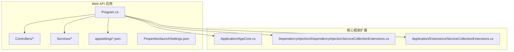
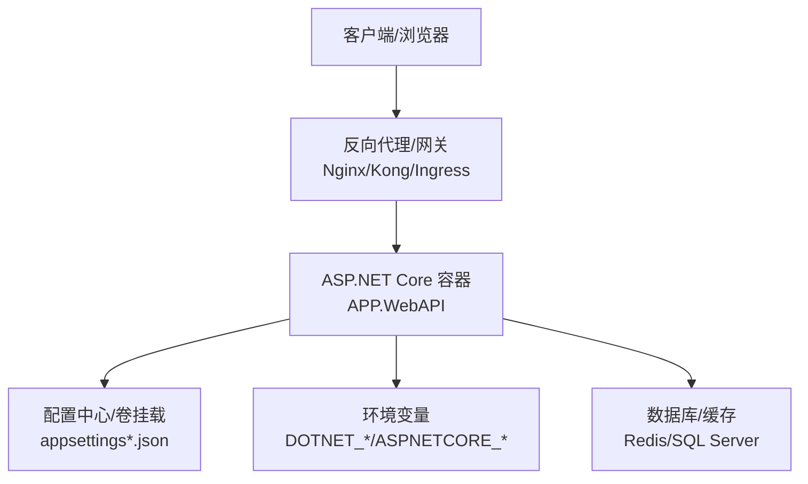
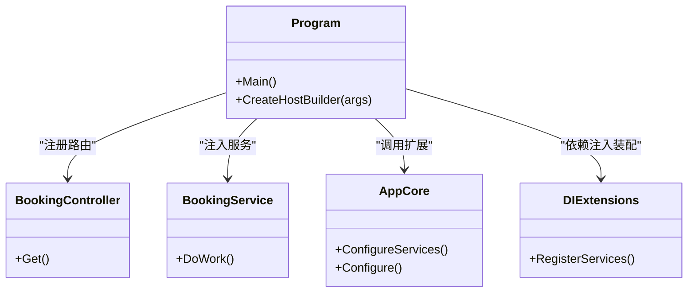

# Docker容器化部署

<cite>
**本文引用的文件**   
- [README.md](file://README.md)
- [README.en.md](file://README.en.md)
- [src/APP.WebAPI/Program.cs](file://src/APP.WebAPI/Program.cs)
- [src/APP.WebAPI/appsettings.json](file://src/APP.WebAPI/appsettings.json)
- [src/APP.WebAPI/appsettings.Development.json](file://src/APP.WebAPI/appsettings.Development.json)
- [src/APP.WebAPI/Properties/launchSettings.json](file://src/APP.WebAPI/Properties/launchSettings.json)
- [src/APP.WebAPI/Controllers/BookingController.cs](file://src/APP.WebAPI/Controllers/BookingController.cs)
- [src/APP.WebAPI/Services/BookingService.cs](file://src/APP.WebAPI/Services/BookingService.cs)
- [src/APP.WebAPI.Core/Application/AppCore.cs](file://src/APP.WebAPI.Core/Application/AppCore.cs)
- [src/APP.WebAPI.Core/DependencyInjection/DependencyInjectionServiceCollectionExtensions.cs](file://src/APP.WebAPI.Core/DependencyInjection/DependencyInjectionServiceCollectionExtensions.cs)
- [src/APP.WebAPI.Core/Application/Extensions/ServiceCollectionExtensions.cs](file://src/APP.WebAPI.Core/Application/Extensions/ServiceCollectionExtensions.cs)
- [src/APP/Program.cs](file://src/APP/Program.cs)
- [src/DotTemplate.APP/Program.cs](file://src/DotTemplate.APP/Program.cs)
</cite>

## 目录
1. [简介](#简介)
2. [项目结构](#项目结构)
3. [核心组件](#核心组件)
4. [架构总览](#架构总览)
5. [详细组件分析](#详细组件分析)
6. [依赖关系分析](#依赖关系分析)
7. [性能考虑](#性能考虑)
8. [故障排查指南](#故障排查指南)
9. [结论](#结论)
10. [附录](#附录)

## 简介
本指南面向AutoCode项目的Docker容器化与编排部署，重点覆盖：
- Dockerfile编写最佳实践（多阶段构建、镜像层优化、安全基线）
- ASP.NET Core应用的容器化配置（端口、环境变量、配置文件挂载）
- Docker Compose编排示例（网络、数据持久化、服务间通信）
- 容器监控、日志收集与性能调优建议

本仓库为ASP.NET Core Web API工程，包含Web API入口、控制器与服务、依赖注入扩展等。我们将基于这些代码结构给出可落地的容器化方案。

## 项目结构
AutoCode项目以src为主目录，其中APP.WebAPI是Web API应用入口，APP.WebAPI.Core提供依赖注入与应用初始化扩展，其他子项目为工具、模板与测试等。

图表来源
- [src/APP.WebAPI/Program.cs](file://src/APP.WebAPI/Program.cs)
- [src/APP.WebAPI/Controllers/BookingController.cs](file://src/APP.WebAPI/Controllers/BookingController.cs)
- [src/APP.WebAPI/Services/BookingService.cs](file://src/APP.WebAPI/Services/BookingService.cs)
- [src/APP.WebAPI/appsettings.json](file://src/APP.WebAPI/appsettings.json)
- [src/APP.WebAPI/appsettings.Development.json](file://src/APP.WebAPI/appsettings.Development.json)
- [src/APP.WebAPI/Properties/launchSettings.json](file://src/APP.WebAPI/Properties/launchSettings.json)
- [src/APP.WebAPI.Core/Application/AppCore.cs](file://src/APP.WebAPI.Core/Application/AppCore.cs)
- [src/APP.WebAPI.Core/DependencyInjection/DependencyInjectionServiceCollectionExtensions.cs](file://src/APP.WebAPI.Core/DependencyInjection/DependencyInjectionServiceCollectionExtensions.cs)
- [src/APP.WebAPI.Core/Application/Extensions/ServiceCollectionExtensions.cs](file://src/APP.WebAPI.Core/Application/Extensions/ServiceCollectionExtensions.cs)

章节来源
- [README.md](file://README.md)
- [README.en.md](file://README.en.md)
- [src/APP.WebAPI/Program.cs](file://src/APP.WebAPI/Program.cs)
- [src/APP.WebAPI/appsettings.json](file://src/APP.WebAPI/appsettings.json)
- [src/APP.WebAPI/appsettings.Development.json](file://src/APP.WebAPI/appsettings.Development.json)
- [src/APP.WebAPI/Properties/launchSettings.json](file://src/APP.WebAPI/Properties/launchSettings.json)

## 核心组件
- Web API入口与中间件管线：由Program.cs负责创建主机、加载配置、注册服务与路由。
- 控制器与服务：BookingController与BookingService实现业务逻辑。
- 依赖注入与启动扩展：AppCore与DI扩展集中管理生命周期与装配。
- 配置与环境：appsettings.json与Development环境配置，支持环境变量覆盖。

章节来源
- [src/APP.WebAPI/Program.cs](file://src/APP.WebAPI/Program.cs)
- [src/APP.WebAPI/Controllers/BookingController.cs](file://src/APP.WebAPI/Controllers/BookingController.cs)
- [src/APP.WebAPI/Services/BookingService.cs](file://src/APP.WebAPI/Services/BookingService.cs)
- [src/APP.WebAPI.Core/Application/AppCore.cs](file://src/APP.WebAPI.Core/Application/AppCore.cs)
- [src/APP.WebAPI.Core/DependencyInjection/DependencyInjectionServiceCollectionExtensions.cs](file://src/APP.WebAPI.Core/DependencyInjection/DependencyInjectionServiceCollectionExtensions.cs)
- [src/APP.WebAPI.Core/Application/Extensions/ServiceCollectionExtensions.cs](file://src/APP.WebAPI.Core/Application/Extensions/ServiceCollectionExtensions.cs)
- [src/APP.WebAPI/appsettings.json](file://src/APP.WebAPI/appsettings.json)
- [src/APP.WebAPI/appsettings.Development.json](file://src/APP.WebAPI/appsettings.Development.json)

## 架构总览
下图展示容器化后的运行时交互：外部请求进入反向代理或Kubernetes Ingress，转发到ASP.NET Core容器；应用读取环境变量与挂载的配置，访问数据库或缓存等后端服务。

图表来源
- [src/APP.WebAPI/Program.cs](file://src/APP.WebAPI/Program.cs)
- [src/APP.WebAPI/appsettings.json](file://src/APP.WebAPI/appsettings.json)
- [src/APP.WebAPI/appsettings.Development.json](file://src/APP.WebAPI/appsettings.Development.json)

## 详细组件分析

### Dockerfile编写最佳实践（多阶段构建与镜像优化）
- 使用官方.NET SDK镜像进行编译，再使用runtime-only镜像运行，显著减小最终镜像体积。
- 利用多阶段构建分离依赖还原、编译与发布步骤，避免将SDK与源码带入运行镜像。
- 合理分层：先复制项目文件并还原依赖，再复制源代码，提升缓存命中率。
- 启用压缩与最小化：在发布时启用Trimming与ReadyToRun（如适用）。
- 非root用户运行：增强安全性，避免特权操作。
- 健康检查：通过HTTP端点暴露健康检查，便于编排系统探测。
- 只读根文件系统：尽可能将写路径映射到卷，保持容器不可变。

章节来源
- [src/APP.WebAPI/Program.cs](file://src/APP.WebAPI/Program.cs)
- [src/APP.WebAPI/appsettings.json](file://src/APP.WebAPI/appsettings.json)

### ASP.NET Core容器化配置
- 端口暴露：默认监听5000/5001或环境变量Kestrel绑定地址，需在容器内正确映射。
- 环境变量：优先使用ASPNETCORE_ENVIRONMENT、ASPNETCORE_URLS、Kestrel相关变量控制行为。
- 配置挂载：将appsettings.Production.json通过卷或ConfigMap挂载，避免硬编码敏感信息。
- 日志输出：默认输出到控制台，便于容器日志采集；可按需写入文件或结构化日志。

章节来源
- [src/APP.WebAPI/appsettings.json](file://src/APP.WebAPI/appsettings.json)
- [src/APP.WebAPI/appsettings.Development.json](file://src/APP.WebAPI/appsettings.Development.json)
- [src/APP.WebAPI/Properties/launchSettings.json](file://src/APP.WebAPI/Properties/launchSettings.json)

### Docker Compose编排示例（网络与数据持久化）
- 定义API服务、数据库与缓存服务，统一置于自定义网络中。
- 使用命名卷持久化数据库与日志数据。
- 通过环境变量注入连接字符串与开关项。
- 设置健康检查与重启策略，提高可用性。

章节来源
- [src/APP.WebAPI/Program.cs](file://src/APP.WebAPI/Program.cs)
- [src/APP.WebAPI/appsettings.json](file://src/APP.WebAPI/appsettings.json)

### 容器监控、日志收集与性能调优
- 监控：集成Prometheus指标端点，或使用APM工具（如OpenTelemetry）上报。
- 日志：采用结构化JSON日志，配合Fluent Bit/Logstash汇聚到ELK或云日志服务。
- 性能：调整线程池大小、GC模式、Kestrel最大并发请求数；启用响应压缩与静态资源缓存。
- 资源限制：设置CPU与内存上限，避免资源争用。

章节来源
- [src/APP.WebAPI/Program.cs](file://src/APP.WebAPI/Program.cs)

## 依赖关系分析
- Program作为入口，聚合控制器、服务与依赖注入扩展。
- AppCore与DI扩展集中管理生命周期，降低耦合度。
- 配置与环境变量贯穿整个应用，影响运行时行为。

图表来源
- [src/APP.WebAPI/Program.cs](file://src/APP.WebAPI/Program.cs)
- [src/APP.WebAPI/Controllers/BookingController.cs](file://src/APP.WebAPI/Controllers/BookingController.cs)
- [src/APP.WebAPI/Services/BookingService.cs](file://src/APP.WebAPI/Services/BookingService.cs)
- [src/APP.WebAPI.Core/Application/AppCore.cs](file://src/APP.WebAPI.Core/Application/AppCore.cs)
- [src/APP.WebAPI.Core/DependencyInjection/DependencyInjectionServiceCollectionExtensions.cs](file://src/APP.WebAPI.Core/DependencyInjection/DependencyInjectionServiceCollectionExtensions.cs)

章节来源
- [src/APP.WebAPI/Program.cs](file://src/APP.WebAPI/Program.cs)
- [src/APP.WebAPI.Core/Application/AppCore.cs](file://src/APP.WebAPI.Core/Application/AppCore.cs)
- [src/APP.WebAPI.Core/DependencyInjection/DependencyInjectionServiceCollectionExtensions.cs](file://src/APP.WebAPI.Core/DependencyInjection/DependencyInjectionServiceCollectionExtensions.cs)

## 性能考虑
- 镜像体积：多阶段构建+仅运行时镜像，减少攻击面与下载时间。
- 启动速度：预热依赖、禁用不必要的调试特性、按需加载配置。
- 并发模型：根据工作负载调整Kestrel线程池与请求队列。
- GC策略：生产环境使用Server GC，必要时调整阈值。
- I/O优化：启用异步I/O、连接池与缓存策略。

[本节为通用指导，不直接分析具体文件]

## 故障排查指南
- 启动失败：检查环境变量与挂载配置是否正确；查看容器日志定位异常堆栈。
- 端口冲突：确认容器端口映射与宿主端口无冲突。
- 配置未生效：验证appsettings环境与优先级；确保环境变量覆盖有效。
- 健康检查失败：检查健康端点可达性与依赖服务状态。
- 性能问题：观察CPU/内存使用率、GC统计与请求延迟分布。

章节来源
- [src/APP.WebAPI/appsettings.json](file://src/APP.WebAPI/appsettings.json)
- [src/APP.WebAPI/appsettings.Development.json](file://src/APP.WebAPI/appsettings.Development.json)
- [src/APP.WebAPI/Properties/launchSettings.json](file://src/APP.WebAPI/Properties/launchSettings.json)

## 结论
通过多阶段构建、最小化运行镜像、合理的配置与环境变量管理，以及完善的编排与监控体系，AutoCode的ASP.NET Core应用可以在容器中稳定高效地运行。建议在生产环境中持续优化镜像体积、资源限制与可观测性，保障高可用与可维护性。

[本节为总结性内容，不直接分析具体文件]

## 附录

### 容器化清单要点（Checklist）
- Dockerfile
  - 多阶段构建：SDK镜像编译，Runtime镜像运行
  - 分层优化：先复制项目文件并还原依赖，再复制源代码
  - 安全加固：非root用户、最小权限、只读根文件系统
  - 健康检查：HTTP端点探测
- 环境变量
  - ASPNETCORE_ENVIRONMENT、ASPNETCORE_URLS、Kestrel相关变量
  - 数据库连接串、密钥等通过环境变量或机密管理注入
- 配置挂载
  - appsettings.Production.json通过卷或ConfigMap挂载
- 编排
  - Docker Compose或Kubernetes部署
  - 自定义网络、命名卷持久化
  - 健康检查、重启策略、资源限制
- 监控与日志
  - 结构化日志输出到stdout
  - 指标端点暴露给监控系统
  - 日志汇聚与分析平台对接

[本节为通用指导，不直接分析具体文件]
