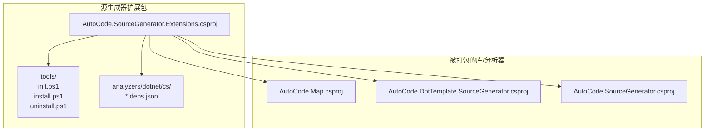
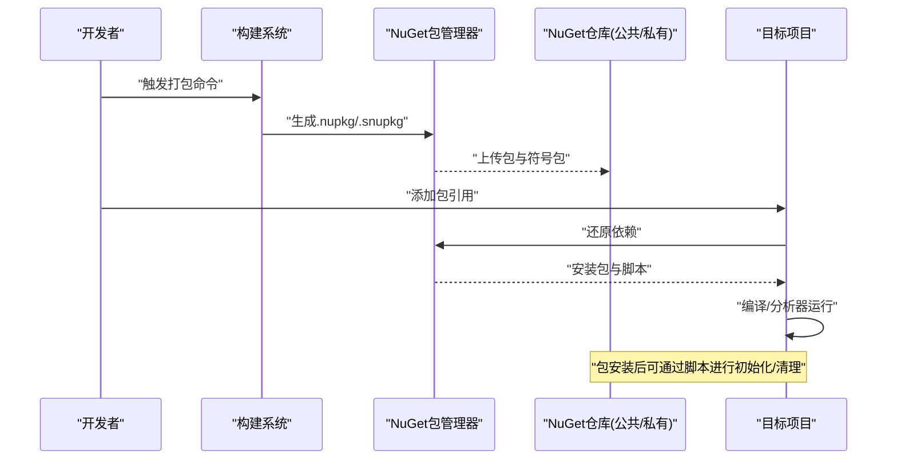
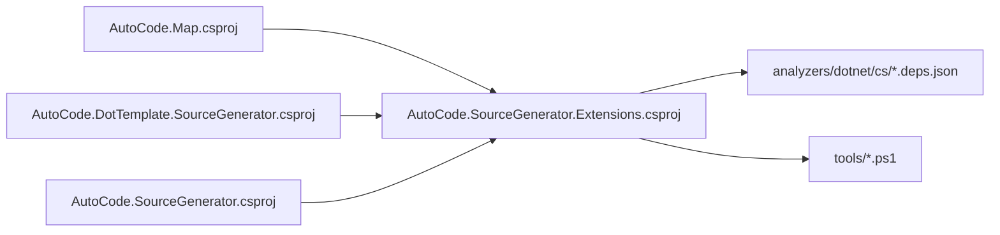

# NuGet包管理

<cite>
**本文引用的文件**   
- [AutoCode.SourceGenerator.Extensions.csproj](file://src/AutoCode.Extensions.SourceGenerator/AutoCode.SourceGenerator.Extensions.csproj)
- [init.ps1](file://src/AutoCode.Extensions.SourceGenerator/NugetPackage/tools/init.ps1)
- [install.ps1](file://src/AutoCode.Extensions.SourceGenerator/NugetPackage/tools/install.ps1)
- [uninstall.ps1](file://src/AutoCode.Extensions.SourceGenerator/NugetPackage/tools/uninstall.ps1)
- [AutoCode.DotTemplate.SourceGenerator.deps.json](file://src/AutoCode.Extensions.SourceGenerator/NugetPackage/analyzers/dotnet/cs/AutoCode.DotTemplate.SourceGenerator.deps.json)
- [AutoCode.Map.deps.json](file://src/AutoCode.Extensions.SourceGenerator/NugetPackage/analyzers/dotnet/cs/AutoCode.Map.deps.json)
- [AutoCode.SourceGenerator.deps.json](file://src/AutoCode.Extensions.SourceGenerator/NugetPackage/analyzers/dotnet/cs/AutoCode.SourceGenerator.deps.json)
- [AutoCode.Map.csproj](file://src/AutoCode.Map/AutoCode.Map.csproj)
- [AutoCode.DotTemplate.SourceGenerator.csproj](file://src/AutoCode.XmlTemplate.SourceGenerator/AutoCode.DotTemplate.SourceGenerator.csproj)
- [AutoCode.SourceGenerator.csproj](file://src/AutoCodeGenerator/AutoCode.SourceGenerator.csproj)
</cite>

## 目录
1. [简介](#简介)
2. [项目结构](#项目结构)
3. [核心组件](#核心组件)
4. [架构总览](#架构总览)
5. [详细组件分析](#详细组件分析)
6. [依赖关系分析](#依赖关系分析)
7. [性能考虑](#性能考虑)
8. [故障排查指南](#故障排查指南)
9. [结论](#结论)
10. [附录](#附录)

## 简介
本文件面向AutoCode项目的NuGet包管理与发布流程，覆盖以下主题：
- 如何创建、打包与发布NuGet包（含.nuspec配置要点）
- 依赖项管理与版本控制策略
- PowerShell脚本作用说明（init.ps1、install.ps1、uninstall.ps1）
- 如何在项目中正确引用和使用生成的包
- 包签名、符号包生成与私有NuGet服务器配置
- 包更新与迁移最佳实践

## 项目结构
AutoCode的NuGet包相关资源集中在扩展源生成器项目中，包含：
- 包描述与工具脚本目录：NugetPackage/tools（init.ps1、install.ps1、uninstall.ps1）
- 分析器依赖清单：NugetPackage/analyzers/dotnet/cs（.deps.json）
- 多个可打包的csproj（Map、DotTemplate Source Generator、主Source Generator等）

图表来源 
- [AutoCode.SourceGenerator.Extensions.csproj](file://src/AutoCode.Extensions.SourceGenerator/AutoCode.SourceGenerator.Extensions.csproj)
- [init.ps1](file://src/AutoCode.Extensions.SourceGenerator/NugetPackage/tools/init.ps1)
- [install.ps1](file://src/AutoCode.Extensions.SourceGenerator/NugetPackage/tools/install.ps1)
- [uninstall.ps1](file://src/AutoCode.Extensions.SourceGenerator/NugetPackage/tools/uninstall.ps1)
- [AutoCode.DotTemplate.SourceGenerator.deps.json](file://src/AutoCode.Extensions.SourceGenerator/NugetPackage/analyzers/dotnet/cs/AutoCode.DotTemplate.SourceGenerator.deps.json)
- [AutoCode.Map.deps.json](file://src/AutoCode.Extensions.SourceGenerator/NugetPackage/analyzers/dotnet/cs/AutoCode.Map.deps.json)
- [AutoCode.SourceGenerator.deps.json](file://src/AutoCode.Extensions.SourceGenerator/NugetPackage/analyzers/dotnet/cs/AutoCode.SourceGenerator.deps.json)
- [AutoCode.Map.csproj](file://src/AutoCode.Map/AutoCode.Map.csproj)
- [AutoCode.DotTemplate.SourceGenerator.csproj](file://src/AutoCode.XmlTemplate.SourceGenerator/AutoCode.DotTemplate.SourceGenerator.csproj)
- [AutoCode.SourceGenerator.csproj](file://src/AutoCodeGenerator/AutoCode.SourceGenerator.csproj)

章节来源
- [AutoCode.SourceGenerator.Extensions.csproj](file://src/AutoCode.Extensions.SourceGenerator/AutoCode.SourceGenerator.Extensions.csproj)
- [AutoCode.Map.csproj](file://src/AutoCode.Map/AutoCode.Map.csproj)
- [AutoCode.DotTemplate.SourceGenerator.csproj](file://src/AutoCode.XmlTemplate.SourceGenerator/AutoCode.DotTemplate.SourceGenerator.csproj)
- [AutoCode.SourceGenerator.csproj](file://src/AutoCodeGenerator/AutoCode.SourceGenerator.csproj)

## 核心组件
- 包定义与打包目标：通过扩展源生成器的csproj组织包内容（analyzers、tools等），并驱动构建产物。
- 分析器依赖清单：.deps.json用于声明分析器运行期依赖，确保在IDE和编译时加载正确。
- 安装后脚本：tools目录下的PowerShell脚本在包安装/卸载时执行，完成环境初始化或清理工作。

章节来源
- [AutoCode.SourceGenerator.Extensions.csproj](file://src/AutoCode.Extensions.SourceGenerator/AutoCode.SourceGenerator.Extensions.csproj)
- [AutoCode.DotTemplate.SourceGenerator.deps.json](file://src/AutoCode.Extensions.SourceGenerator/NugetPackage/analyzers/dotnet/cs/AutoCode.DotTemplate.SourceGenerator.deps.json)
- [AutoCode.Map.deps.json](file://src/AutoCode.Extensions.SourceGenerator/NugetPackage/analyzers/dotnet/cs/AutoCode.Map.deps.json)
- [AutoCode.SourceGenerator.deps.json](file://src/AutoCode.Extensions.SourceGenerator/NugetPackage/analyzers/dotnet/cs/AutoCode.SourceGenerator.deps.json)
- [init.ps1](file://src/AutoCode.Extensions.SourceGenerator/NugetPackage/tools/init.ps1)
- [install.ps1](file://src/AutoCode.Extensions.SourceGenerator/NugetPackage/tools/install.ps1)
- [uninstall.ps1](file://src/AutoCode.Extensions.SourceGenerator/NugetPackage/tools/uninstall.ps1)

## 架构总览
下图展示了从“开发者”到“NuGet包”再到“目标项目”的整体交互流程，包括打包、分发、安装与使用阶段。

图表来源 
- [AutoCode.SourceGenerator.Extensions.csproj](file://src/AutoCode.Extensions.SourceGenerator/AutoCode.SourceGenerator.Extensions.csproj)
- [init.ps1](file://src/AutoCode.Extensions.SourceGenerator/NugetPackage/tools/init.ps1)
- [install.ps1](file://src/AutoCode.Extensions.SourceGenerator/NugetPackage/tools/install.ps1)
- [uninstall.ps1](file://src/AutoCode.Extensions.SourceGenerator/NugetPackage/tools/uninstall.ps1)

## 详细组件分析

### .nuspec文件配置要点
- 包元数据：id、version、title、description、authors、owners、license、projectUrl、icon、packageTypes等
- 依赖项：frameworkAssemblies、dependencies（按框架分组）、grouping
- 文件映射：files节点指定打包内容（如analyzers、tools、lib等）
- 符号包：includeSymbols/includeSymbolsSource
- 签名：signCommand、signOptions（如需强命名或代码签名）

建议：
- 将.nuspec与csproj分离时，保持版本号一致并通过MSBuild属性注入
- analyzers与tools路径需严格匹配NuGet约定目录结构

章节来源
- [AutoCode.SourceGenerator.Extensions.csproj](file://src/AutoCode.Extensions.SourceGenerator/AutoCode.SourceGenerator.Extensions.csproj)

### 依赖项管理与版本控制
- 分析器依赖：通过analyzers/dotnet/cs/*.deps.json声明运行时依赖，避免重复打包
- 框架依赖：根据目标框架选择最小必要依赖，减少包体积
- 版本策略：语义化版本（主.次.修订），预发布标识（alpha/beta/rc）
- 锁定依赖：对关键第三方库使用固定版本，保证可重现构建

章节来源
- [AutoCode.DotTemplate.SourceGenerator.deps.json](file://src/AutoCode.Extensions.SourceGenerator/NugetPackage/analyzers/dotnet/cs/AutoCode.DotTemplate.SourceGenerator.deps.json)
- [AutoCode.Map.deps.json](file://src/AutoCode.Extensions.SourceGenerator/NugetPackage/analyzers/dotnet/cs/AutoCode.Map.deps.json)
- [AutoCode.SourceGenerator.deps.json](file://src/AutoCode.Extensions.SourceGenerator/NugetPackage/analyzers/dotnet/cs/AutoCode.SourceGenerator.deps.json)

### PowerShell脚本的作用与使用
- init.ps1：包安装后初始化（例如注册分析器、设置环境变量、提示用户操作）
- install.ps1：安装阶段执行（常见于旧版包；现代NuGet更推荐MSBuild Targets）
- uninstall.ps1：卸载阶段清理（移除临时文件、恢复原状态）

注意事项：
- 脚本应幂等，支持多次运行不产生副作用
- 避免阻塞构建流程，必要时提供开关禁用脚本执行
- 在CI环境中谨慎启用交互式脚本

章节来源
- [init.ps1](file://src/AutoCode.Extensions.SourceGenerator/NugetPackage/tools/init.ps1)
- [install.ps1](file://src/AutoCode.Extensions.SourceGenerator/NugetPackage/tools/install.ps1)
- [uninstall.ps1](file://src/AutoCode.Extensions.SourceGenerator/NugetPackage/tools/uninstall.ps1)

### 在项目中引用与使用包
- 添加包引用：通过包管理器控制台或编辑项目文件
- 确认分析器生效：查看输出窗口是否有分析器诊断信息
- 验证工具脚本：首次加载时检查是否触发了初始化逻辑
- 调试：开启详细日志（dotnet restore --verbosity detailed）

章节来源
- [AutoCode.SourceGenerator.Extensions.csproj](file://src/AutoCode.Extensions.SourceGenerator/AutoCode.SourceGenerator.Extensions.csproj)

### 包签名、符号包与私有服务器
- 包签名：使用强命名或代码签名证书，确保包完整性与来源可信
- 符号包：生成并上传符号包，便于远程调试与分析器问题定位
- 私有服务器：配置本地或企业级NuGet源，限制访问权限与缓存策略

章节来源
- [AutoCode.SourceGenerator.Extensions.csproj](file://src/AutoCode.Extensions.SourceGenerator/AutoCode.SourceGenerator.Extensions.csproj)

### 包更新与迁移最佳实践
- 小步快跑：优先发布修订版本修复问题，再逐步升级主/次版本
- 向后兼容：避免破坏性变更，必要时提供迁移指南
- 自动化测试：在CI中验证多框架、多平台兼容性
- 回滚策略：保留历史版本，准备快速回滚方案

章节来源
- [AutoCode.SourceGenerator.Extensions.csproj](file://src/AutoCode.Extensions.SourceGenerator/AutoCode.SourceGenerator.Extensions.csproj)

## 依赖关系分析
下图展示各可打包项目之间的依赖关系，以及它们如何被扩展包整合为最终NuGet包。

图表来源 
- [AutoCode.Map.csproj](file://src/AutoCode.Map/AutoCode.Map.csproj)
- [AutoCode.DotTemplate.SourceGenerator.csproj](file://src/AutoCode.XmlTemplate.SourceGenerator/AutoCode.DotTemplate.SourceGenerator.csproj)
- [AutoCode.SourceGenerator.csproj](file://src/AutoCodeGenerator/AutoCode.SourceGenerator.csproj)
- [AutoCode.SourceGenerator.Extensions.csproj](file://src/AutoCode.Extensions.SourceGenerator/AutoCode.SourceGenerator.Extensions.csproj)
- [AutoCode.DotTemplate.SourceGenerator.deps.json](file://src/AutoCode.Extensions.SourceGenerator/NugetPackage/analyzers/dotnet/cs/AutoCode.DotTemplate.SourceGenerator.deps.json)
- [AutoCode.Map.deps.json](file://src/AutoCode.Extensions.SourceGenerator/NugetPackage/analyzers/dotnet/cs/AutoCode.Map.deps.json)
- [AutoCode.SourceGenerator.deps.json](file://src/AutoCode.Extensions.SourceGenerator/NugetPackage/analyzers/dotnet/cs/AutoCode.SourceGenerator.deps.json)
- [init.ps1](file://src/AutoCode.Extensions.SourceGenerator/NugetPackage/tools/init.ps1)
- [install.ps1](file://src/AutoCode.Extensions.SourceGenerator/NugetPackage/tools/install.ps1)
- [uninstall.ps1](file://src/AutoCode.Extensions.SourceGenerator/NugetPackage/tools/uninstall.ps1)

章节来源
- [AutoCode.Map.csproj](file://src/AutoCode.Map/AutoCode.Map.csproj)
- [AutoCode.DotTemplate.SourceGenerator.csproj](file://src/AutoCode.XmlTemplate.SourceGenerator/AutoCode.DotTemplate.SourceGenerator.csproj)
- [AutoCode.SourceGenerator.csproj](file://src/AutoCodeGenerator/AutoCode.SourceGenerator.csproj)
- [AutoCode.SourceGenerator.Extensions.csproj](file://src/AutoCode.Extensions.SourceGenerator/AutoCode.SourceGenerator.Extensions.csproj)

## 性能考虑
- 分析器依赖瘦身：仅打包必要的dll，避免冗余依赖
- 增量构建：利用Source Generator增量特性，减少重复计算
- 包体积优化：排除开发文件与调试符号（符号包单独上传）
- 缓存策略：合理使用本地包缓存与CDN加速

[本节为通用指导，无需特定文件来源]

## 故障排查指南
常见问题与处理：
- 分析器未生效：检查analyzers目录结构与依赖清单是否正确
- 脚本未执行：确认包安装阶段是否允许执行PowerShell脚本
- 依赖冲突：核对不同版本的依赖，必要时统一版本
- 私有源不可用：检查网络、认证与源配置

章节来源
- [AutoCode.DotTemplate.SourceGenerator.deps.json](file://src/AutoCode.Extensions.SourceGenerator/NugetPackage/analyzers/dotnet/cs/AutoCode.DotTemplate.SourceGenerator.deps.json)
- [AutoCode.Map.deps.json](file://src/AutoCode.Extensions.SourceGenerator/NugetPackage/analyzers/dotnet/cs/AutoCode.Map.deps.json)
- [AutoCode.SourceGenerator.deps.json](file://src/AutoCode.Extensions.SourceGenerator/NugetPackage/analyzers/dotnet/cs/AutoCode.SourceGenerator.deps.json)
- [init.ps1](file://src/AutoCode.Extensions.SourceGenerator/NugetPackage/tools/init.ps1)
- [install.ps1](file://src/AutoCode.Extensions.SourceGenerator/NugetPackage/tools/install.ps1)
- [uninstall.ps1](file://src/AutoCode.Extensions.SourceGenerator/NugetPackage/tools/uninstall.ps1)

## 结论
通过合理的.nuspec配置、清晰的依赖管理与规范的PowerShell脚本，AutoCode的NuGet包可实现稳定打包、可靠分发与便捷使用。结合包签名、符号包与私有服务器，可进一步提升安全性与可维护性。遵循更新与迁移最佳实践，有助于降低升级成本与风险。

[本节为总结性内容，无需特定文件来源]

## 附录
- 参考命令（示例，非代码片段）：
  - 打包：dotnet pack /p:Version=...
  - 上传：nuget push *.nupkg -Source <your-source>
  - 还原：dotnet restore
  - 详细日志：dotnet restore --verbosity detailed

[本节为补充信息，无需特定文件来源]
