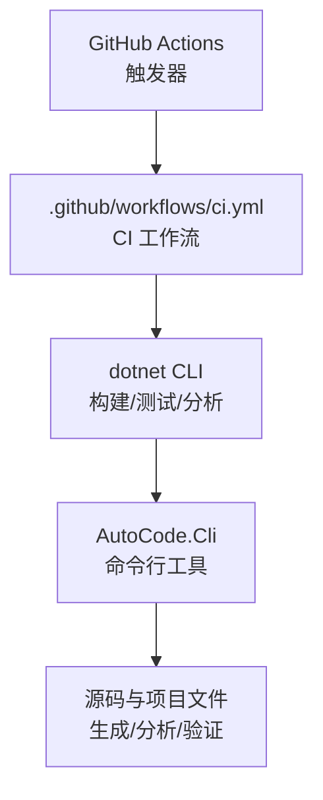
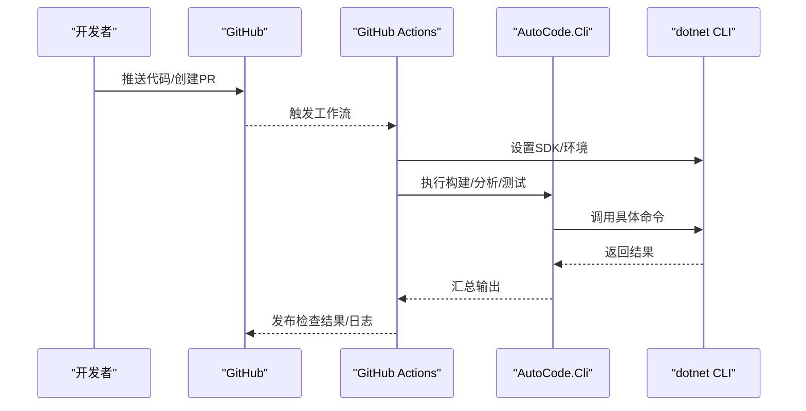
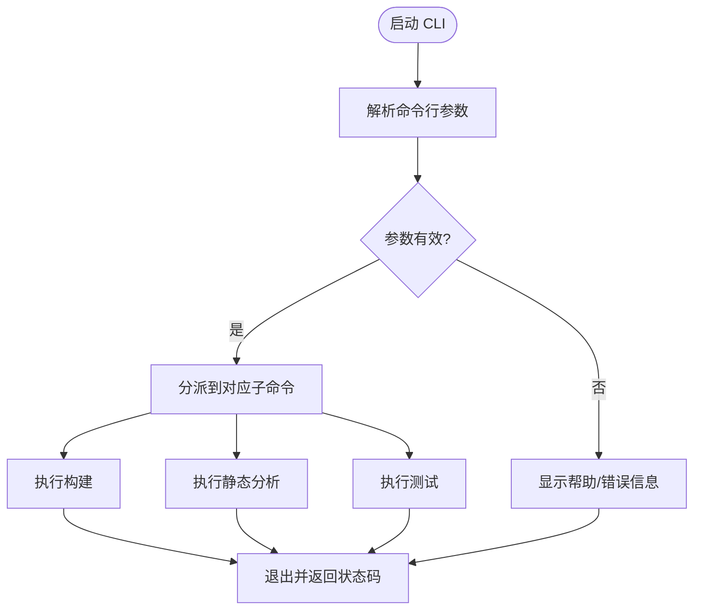
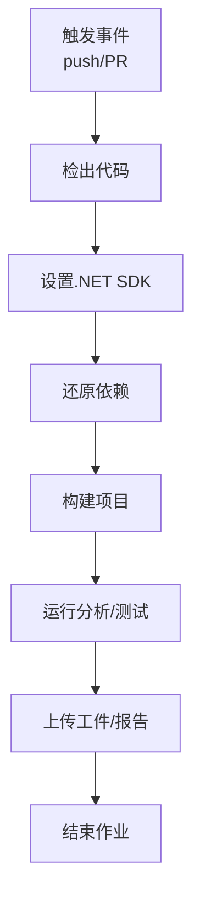
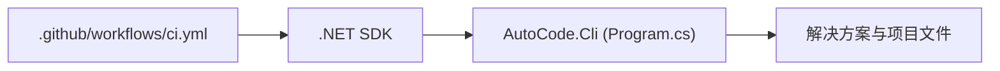

# 命令行工具和CI/CD流水线

<cite>
**本文引用的文件**   
- [ci.yml](file://.github/workflows/ci.yml)
- [Program.cs](file://src/AutoCode.Cli/Program.cs)
- [AutoCode.Cli.csproj](file://src/AutoCode.Cli/AutoCode.Cli.csproj)
- [README.md](file://README.md)
</cite>

## 目录
1. [简介](#简介)
2. [项目结构](#项目结构)
3. [核心组件](#核心组件)
4. [架构总览](#架构总览)
5. [详细组件分析](#详细组件分析)
6. [依赖分析](#依赖分析)
7. [性能考虑](#性能考虑)
8. [故障排查指南](#故障排查指南)
9. [结论](#结论)
10. [附录](#附录)

## 简介
本文件聚焦于 AutoCode 项目的“命令行工具”与“CI/CD 流水线”两部分，旨在帮助开发者理解：
- 如何通过命令行工具驱动代码生成、分析与构建；
- CI/CD 如何自动化执行这些任务，确保质量与一致性。

## 项目结构
围绕命令行与 CI/CD 的关键位置如下：
- 命令行入口位于 src/AutoCode.Cli，包含程序入口与项目定义；
- CI/CD 工作流位于 .github/workflows/ci.yml，用于在 GitHub Actions 中自动执行构建与分析；
- README 提供项目背景与使用说明，便于理解 CLI 的使用场景。

**图表来源** 
- [ci.yml](file://.github/workflows/ci.yml)
- [Program.cs](file://src/AutoCode.Cli/Program.cs)
- [AutoCode.Cli.csproj](file://src/AutoCode.Cli/AutoCode.Cli.csproj)

**章节来源**
- [ci.yml](file://.github/workflows/ci.yml)
- [Program.cs](file://src/AutoCode.Cli/Program.cs)
- [AutoCode.Cli.csproj](file://src/AutoCode.Cli/AutoCode.Cli.csproj)
- [README.md](file://README.md)

## 核心组件
- 命令行工具（AutoCode.Cli）
  - 职责：提供统一的命令行入口，封装 dotnet 命令，支持构建、运行、测试、分析等流程；可作为本地开发或 CI 中的统一执行点。
  - 关键文件：
    - Program.cs：进程入口与参数解析逻辑所在；
    - AutoCode.Cli.csproj：项目定义与依赖声明。
- CI/CD 工作流（GitHub Actions）
  - 职责：在代码推送或 PR 时自动拉取代码、安装 SDK、执行构建与分析、输出结果与报告。
  - 关键文件：
    - ci.yml：定义触发条件、作业步骤、环境变量与缓存策略等。

**章节来源**
- [Program.cs](file://src/AutoCode.Cli/Program.cs)
- [AutoCode.Cli.csproj](file://src/AutoCode.Cli/AutoCode.Cli.csproj)
- [ci.yml](file://.github/workflows/ci.yml)

## 架构总览
下图展示了从代码提交到自动生成与质量检查的端到端流程，CLI 作为统一编排者，CI 负责自动化执行。

**图表来源** 
- [ci.yml](file://.github/workflows/ci.yml)
- [Program.cs](file://src/AutoCode.Cli/Program.cs)

## 详细组件分析

### 命令行工具（AutoCode.Cli）
- 入口与参数处理
  - Program.cs 定义了应用程序的入口点，通常包括参数解析、错误处理与子命令分发。
  - 通过该入口，可将常见的开发任务（如生成、校验、构建）统一暴露为 CLI 命令。
- 项目与依赖
  - AutoCode.Cli.csproj 声明了目标框架、引用包与打包配置，确保 CLI 可独立运行或在 CI 中被调用。

**图表来源** 
- [Program.cs](file://src/AutoCode.Cli/Program.cs)
- [AutoCode.Cli.csproj](file://src/AutoCode.Cli/AutoCode.Cli.csproj)

**章节来源**
- [Program.cs](file://src/AutoCode.Cli/Program.cs)
- [AutoCode.Cli.csproj](file://src/AutoCode.Cli/AutoCode.Cli.csproj)

### CI/CD 流水线（GitHub Actions）
- 触发与作业
  - ci.yml 定义触发事件（如 push、pull_request），以及作业步骤（checkout、setup-dotnet、restore/build/test/analyze）。
- 环境与缓存
  - 通过缓存 NuGet 包与中间产物提升构建速度，减少网络开销。
- 结果与报告
  - 将构建与分析结果上传为工件，便于后续查看与归档。

**图表来源** 
- [ci.yml](file://.github/workflows/ci.yml)

**章节来源**
- [ci.yml](file://.github/workflows/ci.yml)

## 依赖分析
- CLI 与 dotnet 生态
  - AutoCode.Cli 依赖 .NET SDK 提供的命令行能力，通过 Program.cs 组织调用链，避免在 CI 中重复编写复杂脚本。
- CI 与工作流
  - ci.yml 依赖 GitHub Actions 运行时与 .NET 工具链，使用标准步骤完成构建与分析。

**图表来源** 
- [ci.yml](file://.github/workflows/ci.yml)
- [Program.cs](file://src/AutoCode.Cli/Program.cs)
- [AutoCode.Cli.csproj](file://src/AutoCode.Cli/AutoCode.Cli.csproj)

**章节来源**
- [ci.yml](file://.github/workflows/ci.yml)
- [Program.cs](file://src/AutoCode.Cli/Program.cs)
- [AutoCode.Cli.csproj](file://src/AutoCode.Cli/AutoCode.Cli.csproj)

## 性能考虑
- 缓存策略
  - 在 CI 中启用 NuGet 包缓存与增量构建，减少重复下载与编译时间。
- 并行化
  - 将相互独立的分析或测试任务并行执行，缩短整体流水线时长。
- 资源限制
  - 合理分配 runner 内存与 CPU，避免构建阶段 OOM 或超时。

[本节为通用指导，不直接分析具体文件]

## 故障排查指南
- 常见问题定位
  - 构建失败：检查 .NET SDK 版本与项目目标框架是否匹配；确认 csproj 依赖是否完整。
  - 分析/测试未执行：核查工作流步骤顺序与条件分支；确认 CLI 参数是否正确。
  - 缓存失效：清理缓存键或强制刷新缓存，观察首次构建耗时。
- 建议操作
  - 在本地复现 CI 环境（相同 SDK 版本、相同缓存键）；
  - 逐步注释工作流步骤，定位失败环节；
  - 收集日志与工件，便于问题回溯。

**章节来源**
- [ci.yml](file://.github/workflows/ci.yml)
- [Program.cs](file://src/AutoCode.Cli/Program.cs)

## 结论
通过将 AutoCode.Cli 作为统一的命令行入口，并结合 GitHub Actions 的 CI/CD 流水线，AutoCode 项目实现了从代码提交到构建、分析与测试的自动化闭环。建议在后续迭代中持续优化缓存与并行策略，进一步提升构建效率与稳定性。

[本节为总结性内容，不直接分析具体文件]

## 附录
- 快速上手
  - 本地运行 CLI：参考 Program.cs 的参数说明，结合 AutoCode.Cli.csproj 的依赖进行调试；
  - 本地模拟 CI：使用与 ci.yml 相同的步骤顺序与 SDK 版本，验证构建与分析流程。

**章节来源**
- [Program.cs](file://src/AutoCode.Cli/Program.cs)
- [AutoCode.Cli.csproj](file://src/AutoCode.Cli/AutoCode.Cli.csproj)
- [ci.yml](file://.github/workflows/ci.yml)
- [README.md](file://README.md)