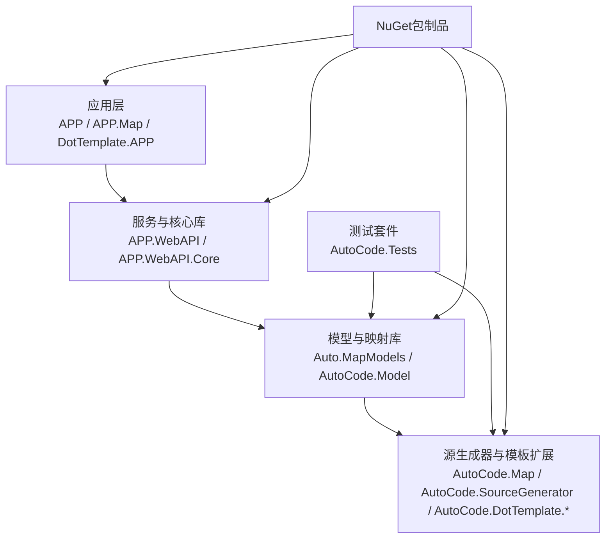
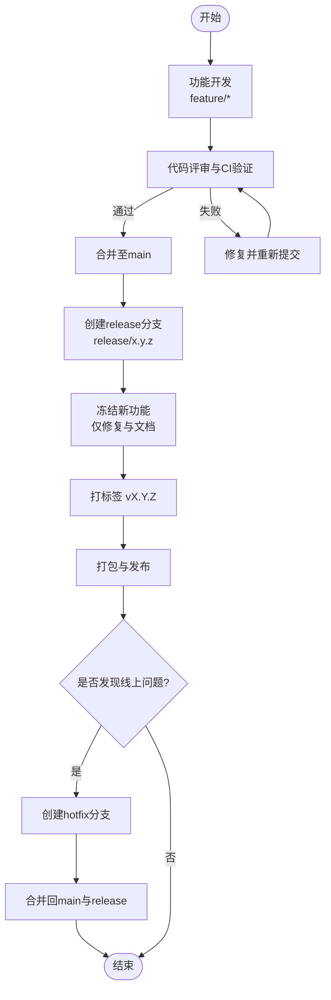
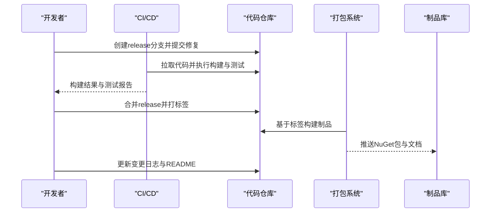
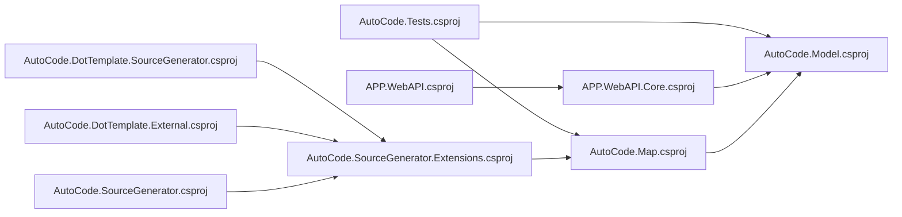

# 版本管理与发布策略

<cite>
**本文引用的文件**   
- [README.md](file://README.md)
- [README.en.md](file://README.en.md)
- [AutoCode.sln](file://src/AutoCode.sln)
- [APP.csproj](file://src/APP/APP.csproj)
- [APP.Map.csproj](file://src/APP.Map/APP.Map.csproj)
- [APP.WebAPI.csproj](file://src/APP.WebAPI/APP.WebAPI.csproj)
- [APP.WebAPI.Core.csproj](file://src/APP.WebAPI.Core/APP.WebAPI.Core.csproj)
- [Auto.MapModels.csproj](file://src/Auto.MapModels/Auto.MapModels.csproj)
- [AutoCode.SourceGenerator.Extensions.csproj](file://src/AutoCode.Extensions.SourceGenerator/AutoCode.SourceGenerator.Extensions.csproj)
- [AutoCode.Map.csproj](file://src/AutoCode.Map/AutoCode.Map.csproj)
- [AutoCode.MapDebug.csproj](file://src/AutoCode.MapDebug/AutoCode.MapDebug.csproj)
- [AutoCode.Model.csproj](file://src/AutoCode.Model/AutoCode.Model.csproj)
- [AutoCode.Tests.csproj](file://src/AutoCode.Tests/AutoCode.Tests.csproj)
- [AutoCode.DotTemplate.External.csproj](file://src/AutoCode.XmlTemplate.External/AutoCode.DotTemplate.External.csproj)
- [AutoCode.DotTemplate.SourceGenerator.csproj](file://src/AutoCode.XmlTemplate.SourceGenerator/AutoCode.DotTemplate.SourceGenerator.csproj)
- [AutoCode.SourceGenerator.csproj](file://src/AutoCodeGenerator/AutoCode.SourceGenerator.csproj)
- [DotTemplate.APP.csproj](file://src/DotTemplate.APP/DotTemplate.APP.csproj)
- [Models.csproj](file://src/Models/Models.csproj)
- [.gitignore](file://.gitignore)
- [AnalyzerReleases.Shipped.md](file://src/AutoCode.Map/AnalyzerReleases.Shipped.md)
- [AnalyzerReleases.Unshipped.md](file://src/AutoCode.Map/AnalyzerReleases.Unshipped.md)
</cite>

## 目录
1. [简介](#简介)
2. [项目结构](#项目结构)
3. [核心组件](#核心组件)
4. [架构总览](#架构总览)
5. [详细组件分析](#详细组件分析)
6. [依赖关系分析](#依赖关系分析)
7. [性能考虑](#性能考虑)
8. [故障排查指南](#故障排查指南)
9. [结论](#结论)
10. [附录](#附录)

## 简介
本文件面向AutoCode项目的版本管理与发布流程，结合仓库现状给出可落地的规范与操作指引。内容涵盖语义化版本控制（SemVer）的应用、变更日志维护规范、主/次/补丁版本的发布策略、向后兼容性与弃用策略、Git分支与标签管理、以及版本升级与迁移实践。对于破坏性变更，提供明确的回滚与过渡方案，确保多包协同演进时的稳定性与可追溯性。

## 项目结构
AutoCode为多项目解决方案，包含应用、Web API、核心库、源生成器、模板扩展、测试与示例等模块。版本管理需覆盖所有.NET项目文件（.csproj），并在解决方案层统一约束构建与依赖关系。

```mermaid
graph TB
subgraph "解决方案"
SLN["AutoCode.sln"]
end
subgraph "应用与演示"
APP["APP.csproj"]
APPMap["APP.Map.csproj"]
WebAPI["APP.WebAPI.csproj"]
Core["APP.WebAPI.Core.csproj"]
DotApp["DotTemplate.APP.csproj"]
Models["Models.csproj"]
end
subgraph "核心库与工具"
MapModels["Auto.MapModels.csproj"]
Model["AutoCode.Model.csproj"]
MapGen["AutoCode.Map.csproj"]
MapDebug["AutoCode.MapDebug.csproj"]
ExtSG["AutoCode.SourceGenerator.Extensions.csproj"]
XmlTplExt["AutoCode.DotTemplate.External.csproj"]
XmlTplSG["AutoCode.DotTemplate.SourceGenerator.csproj"]
SG["AutoCode.SourceGenerator.csproj"]
end
subgraph "测试"
Tests["AutoCode.Tests.csproj"]
end
SLN --> APP
SLN --> APPMap
SLN --> WebAPI
SLN --> Core
SLN --> DotApp
SLN --> Models
SLN --> MapModels
SLN --> Model
SLN --> MapGen
SLN --> MapDebug
SLN --> ExtSG
SLN --> XmlTplExt
SLN --> XmlTplSG
SLN --> SG
SLN --> Tests
```

图表来源
- [AutoCode.sln](file://src/AutoCode.sln)

章节来源
- [AutoCode.sln](file://src/AutoCode.sln)

## 核心组件
- 版本定义位置：每个.NET项目通过项目文件（.csproj）声明版本号；解决方案文件用于组织构建与依赖。
- 变更日志：在源生成器相关模块中存在“已发布/未发布”的变更记录文件，作为变更追踪的基础素材。
- 忽略规则：根级.gitignore用于排除构建产物与敏感信息，避免污染版本历史。

章节来源
- [APP.csproj](file://src/APP/APP.csproj)
- [APP.Map.csproj](file://src/APP.Map/APP.Map.csproj)
- [APP.WebAPI.csproj](file://src/APP.WebAPI/APP.WebAPI.csproj)
- [APP.WebAPI.Core.csproj](file://src/APP.WebAPI.Core/APP.WebAPI.Core.csproj)
- [Auto.MapModels.csproj](file://src/Auto.MapModels/Auto.MapModels.csproj)
- [AutoCode.SourceGenerator.Extensions.csproj](file://src/AutoCode.Extensions.SourceGenerator/AutoCode.SourceGenerator.Extensions.csproj)
- [AutoCode.Map.csproj](file://src/AutoCode.Map/AutoCode.Map.csproj)
- [AutoCode.MapDebug.csproj](file://src/AutoCode.MapDebug/AutoCode.MapDebug.csproj)
- [AutoCode.Model.csproj](file://src/AutoCode.Model/AutoCode.Model.csproj)
- [AutoCode.Tests.csproj](file://src/AutoCode.Tests/AutoCode.Tests.csproj)
- [AutoCode.DotTemplate.External.csproj](file://src/AutoCode.XmlTemplate.External/AutoCode.DotTemplate.External.csproj)
- [AutoCode.DotTemplate.SourceGenerator.csproj](file://src/AutoCode.XmlTemplate.SourceGenerator/AutoCode.DotTemplate.SourceGenerator.csproj)
- [AutoCode.SourceGenerator.csproj](file://src/AutoCodeGenerator/AutoCode.SourceGenerator.csproj)
- [DotTemplate.APP.csproj](file://src/DotTemplate.APP/DotTemplate.APP.csproj)
- [Models.csproj](file://src/Models/Models.csproj)
- [.gitignore](file://.gitignore)
- [AnalyzerReleases.Shipped.md](file://src/AutoCode.Map/AnalyzerReleases.Shipped.md)
- [AnalyzerReleases.Unshipped.md](file://src/AutoCode.Map/AnalyzerReleases.Unshipped.md)

## 架构总览
从版本与发布视角，AutoCode采用“多包+单解决方案”的结构。各包独立维护版本，但通过解决方案与依赖图保持整体一致性。发布时需保证：
- 所有包的版本号遵循SemVer。
- 依赖关系满足向后兼容（次版本与补丁版本）。
- 变更日志完整记录破坏性变更与弃用项。
- 标签与分支清晰对应发布基线。

图表来源
- [AutoCode.sln](file://src/AutoCode.sln)
- [AutoCode.Map.csproj](file://src/AutoCode.Map/AutoCode.Map.csproj)
- [AutoCode.SourceGenerator.csproj](file://src/AutoCodeGenerator/AutoCode.SourceGenerator.csproj)
- [AutoCode.DotTemplate.SourceGenerator.csproj](file://src/AutoCode.XmlTemplate.SourceGenerator/AutoCode.DotTemplate.SourceGenerator.csproj)
- [AutoCode.DotTemplate.External.csproj](file://src/AutoCode.XmlTemplate.External/AutoCode.DotTemplate.External.csproj)
- [APP.WebAPI.csproj](file://src/APP.WebAPI/APP.WebAPI.csproj)
- [APP.WebAPI.Core.csproj](file://src/APP.WebAPI.Core/APP.WebAPI.Core.csproj)
- [AutoCode.Model.csproj](file://src/AutoCode.Model/AutoCode.Model.csproj)
- [Auto.MapModels.csproj](file://src/Auto.MapModels/Auto.MapModels.csproj)
- [AutoCode.Tests.csproj](file://src/AutoCode.Tests/AutoCode.Tests.csproj)

## 详细组件分析

### 语义化版本控制（SemVer）应用
- 主版本（X.y.z）：包含破坏性变更，可能影响下游编译或运行行为。发布前需完成弃用期评估、迁移脚本与文档更新。
- 次版本（x.Y.z）：新增功能且保持向后兼容。允许引入新API、新配置项与新特性。
- 补丁版本（x.y.Z）：缺陷修复、性能优化与安全加固，不改变公共接口。

建议：
- 所有包均按SemVer命名，禁止使用预发布标识混入稳定分支。
- 跨包依赖升级时，优先以补丁与次版本推进，减少主版本耦合风险。

章节来源
- [AutoCode.Map.csproj](file://src/AutoCode.Map/AutoCode.Map.csproj)
- [AutoCode.SourceGenerator.csproj](file://src/AutoCodeGenerator/AutoCode.SourceGenerator.csproj)
- [AutoCode.DotTemplate.SourceGenerator.csproj](file://src/AutoCode.XmlTemplate.SourceGenerator/AutoCode.DotTemplate.SourceGenerator.csproj)
- [AutoCode.DotTemplate.External.csproj](file://src/AutoCode.XmlTemplate.External/AutoCode.DotTemplate.External.csproj)
- [APP.WebAPI.csproj](file://src/APP.WebAPI/APP.WebAPI.csproj)
- [APP.WebAPI.Core.csproj](file://src/APP.WebAPI.Core/APP.WebAPI.Core.csproj)
- [AutoCode.Model.csproj](file://src/AutoCode.Model/AutoCode.Model.csproj)
- [Auto.MapModels.csproj](file://src/Auto.MapModels/Auto.MapModels.csproj)
- [AutoCode.Tests.csproj](file://src/AutoCode.Tests/AutoCode.Tests.csproj)

### 变更日志维护与规范
- 使用“已发布/未发布”两类变更记录文件，作为发布前的清单与审计依据。
- 每次提交应关联到具体变更条目，便于回溯。
- 破坏性变更需在“未发布”中明确标注，并在发布前合并至“已发布”。

章节来源
- [AnalyzerReleases.Shipped.md](file://src/AutoCode.Map/AnalyzerReleases.Shipped.md)
- [AnalyzerReleases.Unshipped.md](file://src/AutoCode.Map/AnalyzerReleases.Unshipped.md)

### 分支与标签管理策略
- 主干分支（main）：始终处于可发布状态，仅接受经过评审与测试的变更。
- 发布分支（release/x.y.z）：冻结新功能，仅进行缺陷修复与发布准备。
- 热修复分支（hotfix/*）：针对线上问题快速修复，合并回main与当前发布分支。
- 功能分支（feature/*）：开发新功能，完成后合并至main并通过PR审查。
- 标签（vX.Y.Z）：对应最终发布基线，不可移动；标签指向commit需包含完整的变更日志与构建产物。

### 发布流程与制品管理
- 构建：在release分支执行全量构建与测试，确保无回归。
- 制品：生成NuGet包与文档，上传至制品库。
- 发布：打标签并发布制品，同步更新变更日志与README。
- 回滚：若发布后发现问题，优先以补丁版本修复；必要时回退至上一稳定标签。

### 向后兼容性与弃用策略
- 兼容性承诺：次版本与补丁版本不得引入破坏性变更。
- 弃用流程：
  - 在目标次版本标记弃用（添加注释与文档说明）。
  - 保留至少一个主版本的兼容路径。
  - 在下个主版本移除旧实现并提供迁移指引。
- 迁移脚本：对破坏性变更提供自动化迁移脚本，降低升级成本。

章节来源
- [AutoCode.Map.csproj](file://src/AutoCode.Map/AutoCode.Map.csproj)
- [AutoCode.SourceGenerator.csproj](file://src/AutoCodeGenerator/AutoCode.SourceGenerator.csproj)
- [AutoCode.DotTemplate.SourceGenerator.csproj](file://src/AutoCode.XmlTemplate.SourceGenerator/AutoCode.DotTemplate.SourceGenerator.csproj)
- [AutoCode.DotTemplate.External.csproj](file://src/AutoCode.XmlTemplate.External/AutoCode.DotTemplate.External.csproj)
- [APP.WebAPI.csproj](file://src/APP.WebAPI/APP.WebAPI.csproj)
- [APP.WebAPI.Core.csproj](file://src/APP.WebAPI.Core/APP.WebAPI.Core.csproj)
- [AutoCode.Model.csproj](file://src/AutoCode.Model/AutoCode.Model.csproj)
- [Auto.MapModels.csproj](file://src/Auto.MapModels/Auto.MapModels.csproj)
- [AutoCode.Tests.csproj](file://src/AutoCode.Tests/AutoCode.Tests.csproj)

### 版本升级指南与迁移脚本
- 升级步骤：
  - 阅读变更日志，识别破坏性变更与弃用项。
  - 在沙箱环境执行迁移脚本与单元测试。
  - 逐步替换旧API，确认无警告与错误。
  - 合并至主分支并触发CI。
- 迁移脚本：
  - 针对API重命名、参数调整、属性变更等场景提供自动化工具。
  - 输出差异报告，便于人工复核。

章节来源
- [AutoCode.Tests.csproj](file://src/AutoCode.Tests/AutoCode.Tests.csproj)
- [AutoCode.Map.csproj](file://src/AutoCode.Map/AutoCode.Map.csproj)
- [AutoCode.SourceGenerator.csproj](file://src/AutoCodeGenerator/AutoCode.SourceGenerator.csproj)
- [AutoCode.DotTemplate.SourceGenerator.csproj](file://src/AutoCode.XmlTemplate.SourceGenerator/AutoCode.DotTemplate.SourceGenerator.csproj)
- [AutoCode.DotTemplate.External.csproj](file://src/AutoCode.XmlTemplate.External/AutoCode.DotTemplate.External.csproj)
- [APP.WebAPI.csproj](file://src/APP.WebAPI/APP.WebAPI.csproj)
- [APP.WebAPI.Core.csproj](file://src/APP.WebAPI.Core/APP.WebAPI.Core.csproj)
- [AutoCode.Model.csproj](file://src/AutoCode.Model/AutoCode.Model.csproj)
- [Auto.MapModels.csproj](file://src/Auto.MapModels/Auto.MapModels.csproj)

### 破坏性变更处理方案
- 识别：通过静态分析与测试覆盖度评估潜在破坏点。
- 沟通：提前公告弃用计划与时间表，提供迁移指南。
- 实施：在主版本中移除旧实现，保留最小兼容桥接（可选）。
- 验证：回归测试与集成测试全覆盖，确保无副作用。

章节来源
- [AnalyzerReleases.Shipped.md](file://src/AutoCode.Map/AnalyzerReleases.Shipped.md)
- [AnalyzerReleases.Unshipped.md](file://src/AutoCode.Map/AnalyzerReleases.Unshipped.md)
- [AutoCode.Tests.csproj](file://src/AutoCode.Tests/AutoCode.Tests.csproj)

## 依赖关系分析
AutoCode的多包结构要求严格管理依赖版本范围，避免“幽灵依赖”与版本漂移。建议：
- 固定关键依赖的版本范围，使用精确或最小版本约束。
- 定期扫描依赖漏洞与过时包，及时升级。
- 在解决方案层统一约束构建目标与SDK版本。

图表来源
- [AutoCode.Tests.csproj](file://src/AutoCode.Tests/AutoCode.Tests.csproj)
- [AutoCode.Map.csproj](file://src/AutoCode.Map/AutoCode.Map.csproj)
- [AutoCode.Model.csproj](file://src/AutoCode.Model/AutoCode.Model.csproj)
- [APP.WebAPI.csproj](file://src/APP.WebAPI/APP.WebAPI.csproj)
- [APP.WebAPI.Core.csproj](file://src/APP.WebAPI.Core/APP.WebAPI.Core.csproj)
- [AutoCode.SourceGenerator.Extensions.csproj](file://src/AutoCode.Extensions.SourceGenerator/AutoCode.SourceGenerator.Extensions.csproj)
- [AutoCode.DotTemplate.SourceGenerator.csproj](file://src/AutoCode.XmlTemplate.SourceGenerator/AutoCode.DotTemplate.SourceGenerator.csproj)
- [AutoCode.DotTemplate.External.csproj](file://src/AutoCode.XmlTemplate.External/AutoCode.DotTemplate.External.csproj)
- [AutoCode.SourceGenerator.csproj](file://src/AutoCodeGenerator/AutoCode.SourceGenerator.csproj)

章节来源
- [AutoCode.sln](file://src/AutoCode.sln)

## 性能考虑
- 构建性能：并行构建与增量编译，缓存NuGet包与中间产物。
- 测试性能：分层测试（单元/集成），缩短反馈周期。
- 发布性能：制品缓存与镜像加速，减少网络延迟。

[本节为通用指导，无需特定文件引用]

## 故障排查指南
- 构建失败：检查项目文件版本与SDK一致性，清理中间产物后重试。
- 依赖冲突：使用依赖分析工具定位冲突包，统一版本范围。
- 运行时异常：核对迁移脚本执行结果与API变更点，补充缺失配置。
- 发布失败：确认标签存在且权限正确，制品库连接正常。

章节来源
- [.gitignore](file://.gitignore)
- [AutoCode.Tests.csproj](file://src/AutoCode.Tests/AutoCode.Tests.csproj)
- [AutoCode.Map.csproj](file://src/AutoCode.Map/AutoCode.Map.csproj)
- [AutoCode.SourceGenerator.csproj](file://src/AutoCodeGenerator/AutoCode.SourceGenerator.csproj)
- [AutoCode.DotTemplate.SourceGenerator.csproj](file://src/AutoCode.XmlTemplate.SourceGenerator/AutoCode.DotTemplate.SourceGenerator.csproj)
- [AutoCode.DotTemplate.External.csproj](file://src/AutoCode.XmlTemplate.External/AutoCode.DotTemplate.External.csproj)
- [APP.WebAPI.csproj](file://src/APP.WebAPI/APP.WebAPI.csproj)
- [APP.WebAPI.Core.csproj](file://src/APP.WebAPI.Core/APP.WebAPI.Core.csproj)
- [AutoCode.Model.csproj](file://src/AutoCode.Model/AutoCode.Model.csproj)
- [Auto.MapModels.csproj](file://src/Auto.MapModels/Auto.MapModels.csproj)

## 结论
AutoCode的版本管理应以SemVer为核心，配合清晰的分支与标签策略、完善的变更日志与迁移脚本，确保多包协同下的稳定发布。通过严格的兼容性承诺与弃用流程，降低升级成本与风险。建议在CI/CD中固化发布流水线，提升效率与可重复性。

## 附录
- README参考：了解项目背景与使用说明，辅助理解版本变更的影响面。
- 英文文档：便于国际化协作与对外发布。

章节来源
- [README.md](file://README.md)
- [README.en.md](file://README.en.md)
