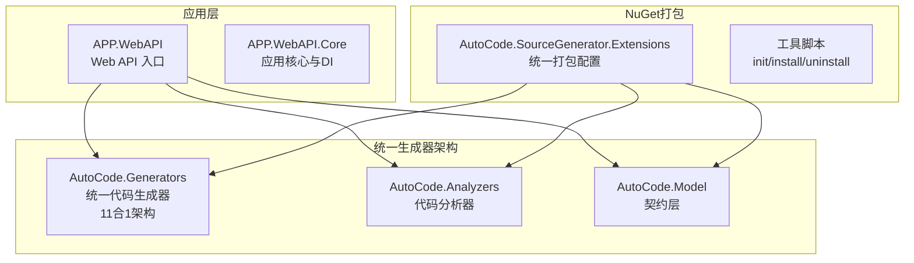
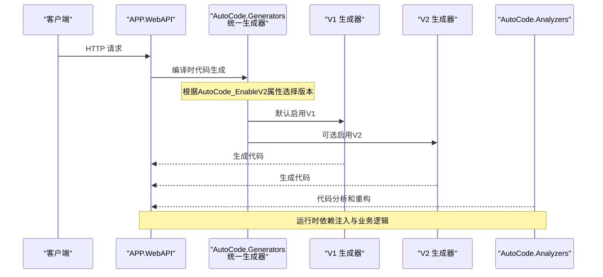
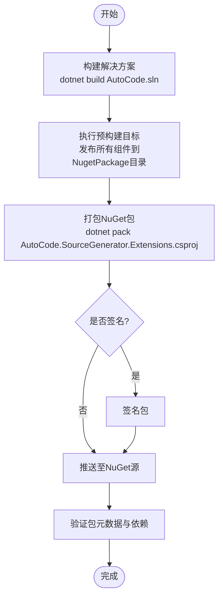
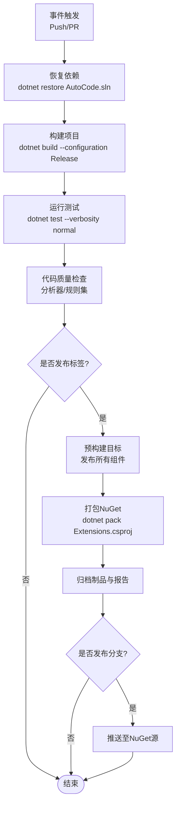
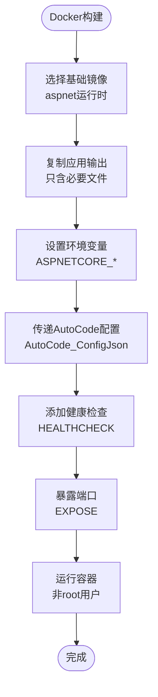
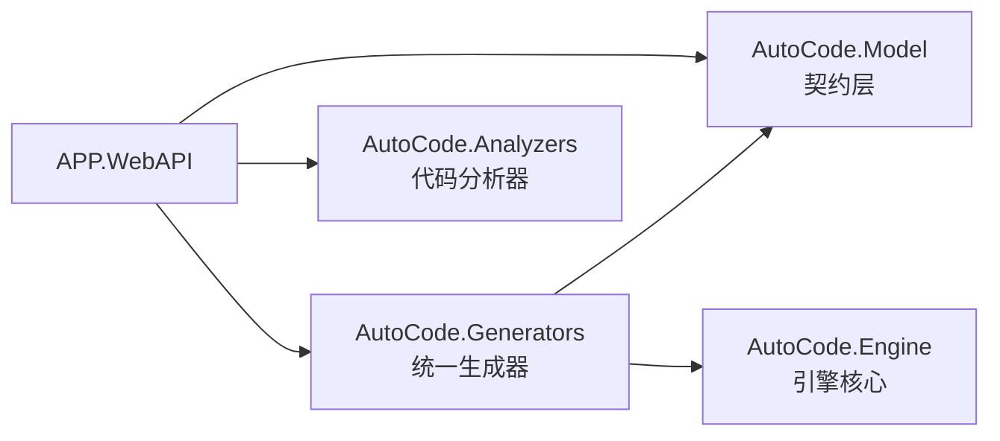

# 部署与发布

<cite>
**本文引用的文件**   
- [README.md](file://README.md)
- [README.en.md](file://README.en.md)
- [AutoCode.sln](file://src/AutoCode.sln)
- [APP.WebAPI.csproj](file://src/APP.WebAPI/APP.WebAPI.csproj)
- [APP.WebAPI.Core.csproj](file://src/APP.WebAPI.Core/APP.WebAPI.Core.csproj)
- [AutoCode.Generators.csproj](file://src/AutoCode.Generators/AutoCode.Generators.csproj)
- [AutoCode.SourceGenerator.Extensions.csproj](file://src/AutoCode.Extensions.SourceGenerator/AutoCode.SourceGenerator.Extensions.csproj)
- [ci.yml](file://.github/workflows/ci.yml)
- [autocode.json](file://autocode.json)
- [V2Gate.cs](file://src/AutoCode.Generators/V2/V2Gate.cs)
- [Program.cs(APP.WebAPI)](file://src/APP.WebAPI/Program.cs)
- [appsettings.json](file://src/APP.WebAPI/appsettings.json)
- [launchSettings.json](file://src/APP.WebAPI/Properties/launchSettings.json)
</cite>

## 更新摘要
**所做更改**   
- 更新了NuGet包创建和打包流程，反映统一的AutoCode.Generators架构
- 修改了CI/CD流水线配置以支持新的统一打包方式
- 更新了依赖关系图以显示简化的生成器结构
- 添加了V1/V2版本切换机制的说明
- 优化了部署流程描述以反映单一程序集的优势

## 目录
1. [简介](#简介)
2. [项目结构](#项目结构)
3. [核心组件](#核心组件)
4. [架构总览](#架构总览)
5. [详细组件分析](#详细组件分析)
6. [依赖分析](#依赖分析)
7. [性能考虑](#性能考虑)
8. [故障排查指南](#故障排查指南)
9. [结论](#结论)
10. [附录](#附录)

## 简介
本文件面向AutoCode项目的部署与发布，覆盖以下主题：
- NuGet包创建、打包、发布与管理
- CI/CD流水线配置（自动化测试、代码质量检查）
- Docker容器化部署与环境变量配置
- 生产环境优化建议
- 版本管理策略、更新迁移与回滚方案

**重要更新**：AutoCode现已采用统一的AutoCode.Generators程序集架构，将11个独立的代码生成器（接口/映射/DTO/验证/Controller/DI/日志/测试/CRUD/级联/拦截）整合到单一程序集中，简化了部署和依赖管理。

## 项目结构
AutoCode是一个多项目解决方案，现已简化为统一的生成器架构。关键目录与职责如下：
- src/APP.WebAPI：Web API入口与控制器、服务、启动配置
- src/APP.WebAPI.Core：应用核心扩展与依赖注入配置
- src/AutoCode.Generators：**统一的代码生成器**，包含V1和V2两个版本的11个生成器
- src/AutoCode.Analyzers：代码分析器和重构工具
- src/AutoCode.Model：契约层（Attribute + Handler 接口）
- src/AutoCode.Extensions.SourceGenerator：NuGet包打包配置和工具脚本



**图表来源**
- [AutoCode.Generators.csproj](file://src/AutoCode.Generators/AutoCode.Generators.csproj)
- [AutoCode.SourceGenerator.Extensions.csproj](file://src/AutoCode.Extensions.SourceGenerator/AutoCode.SourceGenerator.Extensions.csproj)
- [APP.WebAPI.csproj](file://src/APP.WebAPI/APP.WebAPI.csproj)

**章节来源**
- [AutoCode.sln](file://src/AutoCode.sln)
- [AutoCode.Generators.csproj](file://src/AutoCode.Generators/AutoCode.Generators.csproj)
- [AutoCode.SourceGenerator.Extensions.csproj](file://src/AutoCode.Extensions.SourceGenerator/AutoCode.SourceGenerator.Extensions.csproj)

## 核心组件
- **AutoCode.Generators**：统一的代码生成器程序集，包含V1和V2两个版本的11个IIncrementalGenerator实现
- **AutoCode.Analyzers**：提供代码分析、CodeFix和IDE重构功能
- **AutoCode.Model**：定义所有生成器共享的契约和属性
- **AutoCode.SourceGenerator.Extensions**：NuGet包打包配置，统一管理所有组件的发布流程
- **APP.WebAPI**：示例Web API应用，展示如何使用统一的生成器

**更新**：现在只需引用单个AutoCode.Generators程序集即可获得所有代码生成功能，无需分别引用多个独立的生成器包。

**章节来源**
- [AutoCode.Generators.csproj](file://src/AutoCode.Generators/AutoCode.Generators.csproj)
- [AutoCode.SourceGenerator.Extensions.csproj](file://src/AutoCode.Extensions.SourceGenerator/AutoCode.SourceGenerator.Extensions.csproj)
- [APP.WebAPI.csproj](file://src/APP.WebAPI/APP.WebAPI.csproj)

## 架构总览
下图展示了简化后的统一生成器架构，以及V1/V2版本切换机制。



**图表来源**
- [V2Gate.cs](file://src/AutoCode.Generators/V2/V2Gate.cs)
- [AutoCode.Generators.csproj](file://src/AutoCode.Generators/AutoCode.Generators.csproj)
- [APP.WebAPI.csproj](file://src/APP.WebAPI/APP.WebAPI.csproj)

## 详细组件分析

### 统一NuGet包创建、打包与发布

**重大更新**：AutoCode现已采用统一的打包方式，通过AutoCode.SourceGenerator.Extensions项目将所有组件打包到单个NuGet包中。

#### 新的打包架构
- **单一程序集**：AutoCode.Generators包含所有11个生成器
- **统一打包**：通过PreBuild目标自动构建并发布所有组件
- **简化依赖**：消费项目只需引用一个包

#### 打包流程


#### 支持的生成器列表
统一生成器包含以下11个IIncrementalGenerator：
1. InterfaceGenerator - 接口生成
2. MapperGenerator - 对象映射生成  
3. DtoGenerator - DTO生成
4. ValidationGenerator - 验证规则生成
5. ControllerGenerator - Web API控制器生成
6. DependencyInjectionGenerator - DI注册生成
7. LogDecoratorGenerator - 日志装饰器生成
8. TestGenerator - 单元测试生成
9. CrudGenerator - CRUD操作生成
10. CascadeGenerator - 级联生成
11. InterceptPlugin - AOP拦截生成

**章节来源**
- [AutoCode.SourceGenerator.Extensions.csproj](file://src/AutoCode.Extensions.SourceGenerator/AutoCode.SourceGenerator.Extensions.csproj)
- [AutoCode.Generators.csproj](file://src/AutoCode.Generators/AutoCode.Generators.csproj)

### CI/CD流水线配置（自动化测试与代码质量检查）

**更新**：CI/CD流水线已适配新的统一打包架构。

#### GitHub Actions配置
- **触发条件**：push到主分支或创建PR时
- **构建阶段**：dotnet restore/build/pack
- **测试阶段**：dotnet test，收集覆盖率报告
- **打包阶段**：仅在tag发布时执行统一打包
- **发布阶段**：仅对tag或特定分支执行nuget push



**章节来源**
- [ci.yml](file://.github/workflows/ci.yml)
- [AutoCode.SourceGenerator.Extensions.csproj](file://src/AutoCode.Extensions.SourceGenerator/AutoCode.SourceGenerator.Extensions.csproj)

### Docker容器化部署

对于APP.WebAPI应用，建议使用官方ASP.NET Core运行时镜像进行容器化。

#### 基础镜像选择
- mcr.microsoft.com/dotnet/aspnet:<版本>-<变体>（如alpine或mssql）

#### 环境变量配置
- ASPNETCORE_ENVIRONMENT：Development/Staging/Production
- AutoCode_ConfigJson：通过MSBuild属性传递配置文件内容
- 数据库连接字符串、日志级别、外部服务URL等

#### 健康检查与端口暴露
- 定义HEALTHCHECK与EXPOSE端口
- 使用非root用户运行容器



**章节来源**
- [APP.WebAPI.csproj](file://src/APP.WebAPI/APP.WebAPI.csproj)
- [appsettings.json](file://src/APP.WebAPI/appsettings.json)

### 版本管理策略、更新迁移与回滚方案

#### 版本策略
- **语义化版本**：主.次.修订，Tag驱动发布
- **预发布版本**：使用后缀（如-alpha、beta）
- **双版本支持**：V1和V2共存，通过AutoCode_EnableV2属性控制

#### V1/V2版本切换
在消费项目的.csproj中添加：
```xml
<PropertyGroup>
  <AutoCode_EnableV2>true</AutoCode_EnableV2>
</PropertyGroup>
```

#### 更新迁移
- **向后兼容**：V1保持向后兼容，V2提供增强功能
- **渐进式升级**：可逐步从V1迁移到V2
- **配置迁移**：autocode.json配置格式保持一致

#### 回滚方案
- **保留历史版本**：NuGet包保留所有历史版本
- **快速切换**：通过AutoCode_EnableV2属性快速切换版本
- **灰度发布**：支持蓝绿部署降低风险

**章节来源**
- [V2Gate.cs](file://src/AutoCode.Generators/V2/V2Gate.cs)
- [autocode.json](file://autocode.json)

### 配置管理

#### autocode.json配置
统一配置文件支持所有生成器的配置：
- conventions：命名约定和服务模式
- mapper：映射配置
- dto：DTO生成配置
- webapi：Web API配置
- validation：验证配置
- dependencyInjection：DI配置
- cascade：级联生成配置
- logging：日志配置
- intercept：AOP拦截配置
- plugins：插件开关配置

#### 项目配置
通过MSBuild属性传递配置：
```xml
<PropertyGroup>
  <AutoCode_ConfigJson>$([System.IO.File]::ReadAllText('$(MSBuildThisFileDirectory)..\..\autocode.json'))</AutoCode_ConfigJson>
</PropertyGroup>
<ItemGroup>
  <CompilerVisibleProperty Include="AutoCode_ConfigJson" />
</ItemGroup>
```

**章节来源**
- [autocode.json](file://autocode.json)
- [APP.WebAPI.csproj](file://src/APP.WebAPI/APP.WebAPI.csproj)

## 依赖分析
**更新**：依赖关系已大幅简化，从多个独立包简化为单一统一包。



**图表来源**
- [APP.WebAPI.csproj](file://src/APP.WebAPI/APP.WebAPI.csproj)
- [AutoCode.Generators.csproj](file://src/AutoCode.Generators/AutoCode.Generators.csproj)

**章节来源**
- [AutoCode.sln](file://src/AutoCode.sln)
- [APP.WebAPI.csproj](file://src/APP.WebAPI/APP.WebAPI.csproj)
- [AutoCode.Generators.csproj](file://src/AutoCode.Generators/AutoCode.Generators.csproj)

## 性能考虑
**更新**：统一架构带来了显著的性能优势。

#### 构建性能优化
- **增量构建**：利用Roslyn增量生成器提升构建速度
- **并行构建**：dotnet build --parallel
- **缓存优化**：dotnet cache和增量构建缓存

#### 运行时性能
- **零反射**：编译时代码生成，无运行时反射开销
- **NativeAOT兼容**：支持AOT编译和裁剪
- **内存优化**：减少不必要的对象分配

#### 生成器优化
- **增量处理**：只处理变更的代码文件
- **智能缓存**：缓存生成的映射和模板结果
- **并发处理**：充分利用多核处理器

## 故障排查指南

### 常见问题及解决方案

#### 生成器未生效
- **检查引用**：确认项目正确引用AutoCode.Generators
- **验证配置**：检查AutoCode_ConfigJson是否正确传递
- **清理重建**：删除obj/bin目录后重新构建

#### 版本冲突问题
- **V1/V2冲突**：确保只启用一个版本（通过AutoCode_EnableV2控制）
- **依赖冲突**：检查是否有重复的AutoCode相关包引用

#### 打包问题
- **预构建失败**：检查AutoCode.SourceGenerator.Extensions.csproj中的预构建目标
- **NuGet包损坏**：清理.nuget目录后重新打包

### 诊断步骤
1. **启用详细日志**：`dotnet build -v detailed`
2. **检查生成文件**：查看EmitCompilerGeneratedFiles输出的代码
3. **分析依赖树**：使用`dotnet list package`检查依赖
4. **验证配置**：检查autocode.json语法和值

## 结论
AutoCode项目通过统一的AutoCode.Generators架构实现了显著的简化和优化。新的设计消除了多个独立生成器的复杂性，提供了更简单、更高效的部署和发布体验。通过统一的NuGet包、简化的依赖管理和强大的CI/CD支持，团队可以更专注于业务开发而非基础设施维护。

**主要优势**：
- 单一程序集简化了依赖管理
- 统一的打包流程提高了发布效率
- V1/V2双版本支持确保了平滑升级路径
- 增强的性能和可扩展性

## 附录

### 常用命令

#### 本地构建和测试
```bash
# 构建解决方案
dotnet build src/AutoCode.sln

# 运行测试
dotnet test src/AutoCode.sln

# 发布到本地NuGet源
dotnet publish src/AutoCode.Extensions.SourceGenerator/AutoCode.SourceGenerator.Extensions.csproj -c Publish
```

#### Docker部署
```bash
# 构建Docker镜像
docker build -t autocode-api .

# 运行容器
docker run -p 8080:80 autocode-api

# 推送镜像
docker push registry.autocode.com/api:v1.0.0
```

### 参考文档
- README.md与README.en.md提供项目背景与使用说明
- autocode.json配置文件格式说明
- V1/V2版本差异对比文档

**章节来源**
- [README.md](file://README.md)
- [README.en.md](file://README.en.md)
- [autocode.json](file://autocode.json)