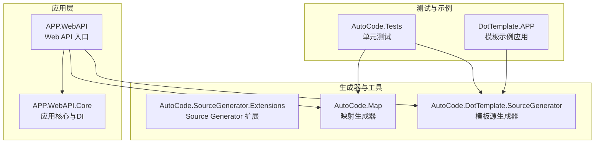
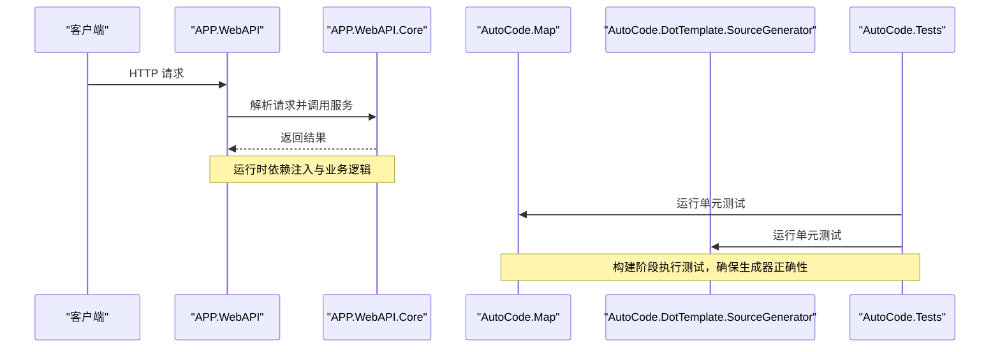
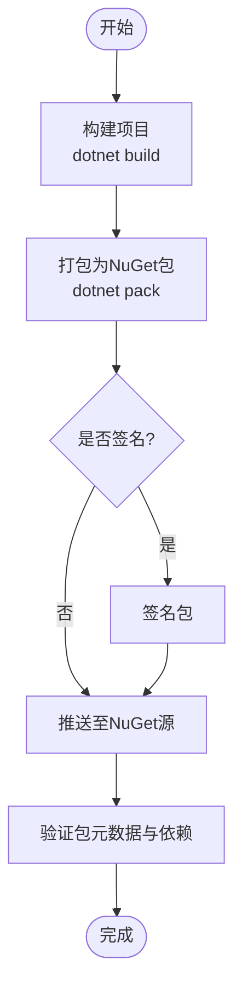
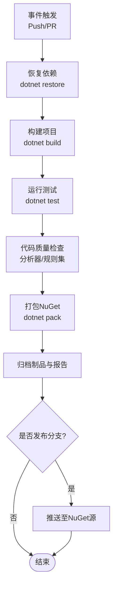
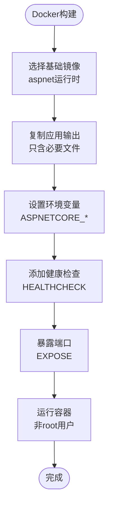
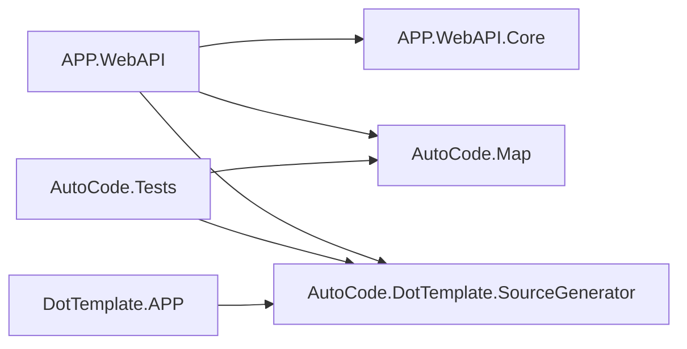

# 部署与发布

<cite>
**本文引用的文件**   
- [README.md](file://README.md)
- [README.en.md](file://README.en.md)
- [AutoCode.sln](file://src/AutoCode.sln)
- [APP.csproj](file://src/APP/APP.csproj)
- [APP.WebAPI.csproj](file://src/APP.WebAPI/APP.WebAPI.csproj)
- [APP.WebAPI.Core.csproj](file://src/APP.WebAPI.Core/APP.WebAPI.Core.csproj)
- [AutoCode.SourceGenerator.Extensions.csproj](file://src/AutoCode.Extensions.SourceGenerator/AutoCode.SourceGenerator.Extensions.csproj)
- [AutoCode.Map.csproj](file://src/AutoCode.Map/AutoCode.Map.csproj)
- [AutoCode.DotTemplate.SourceGenerator.csproj](file://src/AutoCode.XmlTemplate.SourceGenerator/AutoCode.DotTemplate.SourceGenerator.csproj)
- [AutoCode.Tests.csproj](file://src/AutoCode.Tests/AutoCode.Tests.csproj)
- [Program.cs(APP.WebAPI)](file://src/APP.WebAPI/Program.cs)
- [appsettings.json](file://src/APP.WebAPI/appsettings.json)
- [launchSettings.json](file://src/APP.WebAPI/Properties/launchSettings.json)
- [init.ps1](file://src/AutoCode.Extensions.SourceGenerator/NugetPackage/tools/init.ps1)
- [install.ps1](file://src/AutoCode.Extensions.SourceGenerator/NugetPackage/tools/install.ps1)
- [uninstall.ps1](file://src/AutoCode.Extensions.SourceGenerator/NugetPackage/tools/uninstall.ps1)
</cite>

## 目录
1. [简介](#简介)
2. [项目结构](#项目结构)
3. [核心组件](#核心组件)
4. [架构总览](#架构总览)
5. [详细组件分析](#详细组件分析)
6. [依赖分析](#依赖分析)
7. [性能考虑](#性能考虑)
8. [故障排查指南](#故障排查指南)
9. [结论](#结论)
10. [附录](#附录)

## 简介
本文件面向AutoCode项目的部署与发布，覆盖以下主题：
- NuGet包创建、打包、发布与管理
- CI/CD流水线配置（自动化测试、代码质量检查）
- Docker容器化部署与环境变量配置
- 生产环境优化建议
- 版本管理策略、更新迁移与回滚方案

说明：仓库未包含显式的CI/CD配置文件（如GitHub Actions、Azure Pipelines等），因此本节提供基于通用工具的推荐实践与步骤。

## 项目结构
AutoCode是一个多项目解决方案，包含Web API应用、源码生成器、映射工具、模板引擎以及测试项目。关键目录与职责如下：
- src/APP.WebAPI：Web API入口与控制器、服务、启动配置
- src/APP.WebAPI.Core：应用核心扩展与依赖注入配置
- src/AutoCode.*：源码生成器、映射器、模板相关库
- src/AutoCode.Tests：单元测试
- src/DotTemplate.APP：模板示例与应用
- src/AutoCode.Extensions.SourceGenerator/NugetPackage：NuGet包资源与安装脚本

图表来源
- [APP.WebAPI.csproj](file://src/APP.WebAPI/APP.WebAPI.csproj)
- [APP.WebAPI.Core.csproj](file://src/APP.WebAPI.Core/APP.WebAPI.Core.csproj)
- [AutoCode.Map.csproj](file://src/AutoCode.Map/AutoCode.Map.csproj)
- [AutoCode.DotTemplate.SourceGenerator.csproj](file://src/AutoCode.XmlTemplate.SourceGenerator/AutoCode.DotTemplate.SourceGenerator.csproj)
- [AutoCode.Tests.csproj](file://src/AutoCode.Tests/AutoCode.Tests.csproj)
- [AutoCode.SourceGenerator.Extensions.csproj](file://src/AutoCode.Extensions.SourceGenerator/AutoCode.SourceGenerator.Extensions.csproj)

章节来源
- [AutoCode.sln](file://src/AutoCode.sln)
- [APP.WebAPI.csproj](file://src/APP.WebAPI/APP.WebAPI.csproj)
- [APP.WebAPI.Core.csproj](file://src/APP.WebAPI.Core/APP.WebAPI.Core.csproj)
- [AutoCode.Map.csproj](file://src/AutoCode.Map/AutoCode.Map.csproj)
- [AutoCode.DotTemplate.SourceGenerator.csproj](file://src/AutoCode.XmlTemplate.SourceGenerator/AutoCode.DotTemplate.SourceGenerator.csproj)
- [AutoCode.Tests.csproj](file://src/AutoCode.Tests/AutoCode.Tests.csproj)
- [AutoCode.SourceGenerator.Extensions.csproj](file://src/AutoCode.Extensions.SourceGenerator/AutoCode.SourceGenerator.Extensions.csproj)

## 核心组件
- APP.WebAPI：ASP.NET Core Web API，负责HTTP请求处理、路由与服务编排
- APP.WebAPI.Core：应用核心扩展与依赖注入注册
- AutoCode.Map：映射生成器，用于自动生成对象映射逻辑
- AutoCode.DotTemplate.SourceGenerator：基于模板的源码生成器
- AutoCode.SourceGenerator.Extensions：Source Generator扩展与工具
- AutoCode.Tests：单元测试套件，验证生成器与映射行为

章节来源
- [APP.WebAPI.csproj](file://src/APP.WebAPI/APP.WebAPI.csproj)
- [APP.WebAPI.Core.csproj](file://src/APP.WebAPI.Core/APP.WebAPI.Core.csproj)
- [AutoCode.Map.csproj](file://src/AutoCode.Map/AutoCode.Map.csproj)
- [AutoCode.DotTemplate.SourceGenerator.csproj](file://src/AutoCode.XmlTemplate.SourceGenerator/AutoCode.DotTemplate.SourceGenerator.csproj)
- [AutoCode.SourceGenerator.Extensions.csproj](file://src/AutoCode.Extensions.SourceGenerator/AutoCode.SourceGenerator.Extensions.csproj)
- [AutoCode.Tests.csproj](file://src/AutoCode.Tests/AutoCode.Tests.csproj)

## 架构总览
下图展示从客户端到Web API、再到核心与生成器的调用关系，以及测试在构建阶段的作用。

图表来源
- [Program.cs(APP.WebAPI)](file://src/APP.WebAPI/Program.cs)
- [APP.WebAPI.Core.csproj](file://src/APP.WebAPI.Core/APP.WebAPI.Core.csproj)
- [AutoCode.Map.csproj](file://src/AutoCode.Map/AutoCode.Map.csproj)
- [AutoCode.DotTemplate.SourceGenerator.csproj](file://src/AutoCode.XmlTemplate.SourceGenerator/AutoCode.DotTemplate.SourceGenerator.csproj)
- [AutoCode.Tests.csproj](file://src/AutoCode.Tests/AutoCode.Tests.csproj)

## 详细组件分析

### NuGet包创建、打包与发布
AutoCode包含多个可分发组件，尤其是Source Generator与映射库。NuGet包通常通过MSBuild或dotnet CLI进行打包与发布。

- 打包目标
  - AutoCode.SourceGenerator.Extensions：Source Generator扩展包
  - AutoCode.Map：映射生成器包
  - AutoCode.DotTemplate.SourceGenerator：模板源生成器包
- 打包命令（概念性步骤）
  - 使用dotnet pack对每个csproj生成.nupkg
  - 指定版本号与符号包以支持调试
  - 将包推送到私有或公共NuGet源
- 包内工具脚本
  - init.ps1、install.ps1、uninstall.ps1：用于IDE集成与初始化工作流

章节来源
- [AutoCode.SourceGenerator.Extensions.csproj](file://src/AutoCode.Extensions.SourceGenerator/AutoCode.SourceGenerator.Extensions.csproj)
- [AutoCode.Map.csproj](file://src/AutoCode.Map/AutoCode.Map.csproj)
- [AutoCode.DotTemplate.SourceGenerator.csproj](file://src/AutoCode.XmlTemplate.SourceGenerator/AutoCode.DotTemplate.SourceGenerator.csproj)
- [init.ps1](file://src/AutoCode.Extensions.SourceGenerator/NugetPackage/tools/init.ps1)
- [install.ps1](file://src/AutoCode.Extensions.SourceGenerator/NugetPackage/tools/install.ps1)
- [uninstall.ps1](file://src/AutoCode.Extensions.SourceGenerator/NugetPackage/tools/uninstall.ps1)

### CI/CD流水线配置（自动化测试与代码质量检查）
仓库未包含显式CI/CD配置文件，以下为通用推荐流程：
- 触发条件：push到主分支或创建PR时
- 构建阶段：dotnet restore/build/pack
- 测试阶段：dotnet test，收集覆盖率报告
- 质量检查：启用Roslyn分析器、规则集与警告级别
- 制品归档：上传.nupkg与测试报告
- 发布阶段：仅对tag或特定分支执行nuget push

[此图为概念性流程图，不直接映射具体文件]

### Docker容器化部署
对于APP.WebAPI应用，建议使用官方ASP.NET Core运行时镜像进行容器化。

- 基础镜像选择
  - mcr.microsoft.com/dotnet/aspnet:<版本>-<变体>（如alpine或mssql）
- 构建上下文
  - 只包含必要的输出文件，避免携带源代码
- 环境变量
  - ASPNETCORE_ENVIRONMENT：Development/Staging/Production
  - 数据库连接字符串、日志级别、外部服务URL等
- 健康检查与端口暴露
  - 定义HEALTHCHECK与EXPOSE端口
- 安全最佳实践
  - 非root用户运行、最小权限原则、定期更新镜像

[此图为概念性流程图，不直接映射具体文件]

### 环境变量配置与生产环境优化
- 环境变量
  - ASPNETCORE_ENVIRONMENT：控制日志与错误页面
  - 自定义配置项通过appsettings.{Environment}.json或环境变量注入
- 生产优化
  - 启用压缩与缓存中间件
  - 调整线程池与GC参数
  - 使用反向代理（Nginx/IIS）进行静态资源与SSL终止
  - 启用集中式日志与监控（Application Insights、Serilog）

章节来源
- [appsettings.json](file://src/APP.WebAPI/appsettings.json)
- [launchSettings.json](file://src/APP.WebAPI/Properties/launchSettings.json)
- [Program.cs(APP.WebAPI)](file://src/APP.WebAPI/Program.cs)

### 版本管理策略、更新迁移与回滚方案
- 版本策略
  - 语义化版本（主.次.修订），Tag驱动发布
  - 预发布版本使用后缀（如-alpha、beta）
- 更新迁移
  - 变更日志（CHANGELOG）记录破坏性变更
  - 依赖升级需同步更新所有引用项目
- 回滚方案
  - 保留历史版本的NuGet包与镜像标签
  - 快速切换环境变量与配置指向旧版本
  - 灰度发布与蓝绿部署降低风险

[本节为概念性内容，不直接分析具体文件]

## 依赖分析
AutoCode解决方案中各项目的依赖关系如下：
- APP.WebAPI依赖APP.WebAPI.Core、AutoCode.Map与AutoCode.DotTemplate.SourceGenerator
- AutoCode.Tests依赖AutoCode.Map与AutoCode.DotTemplate.SourceGenerator
- DotTemplate.APP依赖AutoCode.DotTemplate.SourceGenerator

图表来源
- [APP.WebAPI.csproj](file://src/APP.WebAPI/APP.WebAPI.csproj)
- [APP.WebAPI.Core.csproj](file://src/APP.WebAPI.Core/APP.WebAPI.Core.csproj)
- [AutoCode.Map.csproj](file://src/AutoCode.Map/AutoCode.Map.csproj)
- [AutoCode.DotTemplate.SourceGenerator.csproj](file://src/AutoCode.XmlTemplate.SourceGenerator/AutoCode.DotTemplate.SourceGenerator.csproj)
- [AutoCode.Tests.csproj](file://src/AutoCode.Tests/AutoCode.Tests.csproj)
- [AutoCode.SourceGenerator.Extensions.csproj](file://src/AutoCode.Extensions.SourceGenerator/AutoCode.SourceGenerator.Extensions.csproj)

章节来源
- [AutoCode.sln](file://src/AutoCode.sln)
- [APP.WebAPI.csproj](file://src/APP.WebAPI/APP.WebAPI.csproj)
- [APP.WebAPI.Core.csproj](file://src/APP.WebAPI.Core/APP.WebAPI.Core.csproj)
- [AutoCode.Map.csproj](file://src/AutoCode.Map/AutoCode.Map.csproj)
- [AutoCode.DotTemplate.SourceGenerator.csproj](file://src/AutoCode.XmlTemplate.SourceGenerator/AutoCode.DotTemplate.SourceGenerator.csproj)
- [AutoCode.Tests.csproj](file://src/AutoCode.Tests/AutoCode.Tests.csproj)
- [AutoCode.SourceGenerator.Extensions.csproj](file://src/AutoCode.Extensions.SourceGenerator/AutoCode.SourceGenerator.Extensions.csproj)

## 性能考虑
- 构建与打包
  - 并行构建（dotnet build --parallel）
  - 增量构建与缓存（dotnet cache）
- 运行时
  - 启用JIT优化与服务器GC
  - 合理设置线程池大小与异步I/O限制
- 生成器
  - 减少不必要的扫描与反射
  - 缓存生成的映射与模板结果

[本节为通用指导，不直接分析具体文件]

## 故障排查指南
- 常见问题
  - NuGet包依赖冲突：检查版本一致性与框架目标
  - Source Generator未生效：确认项目引用与SDK版本
  - Docker镜像无法启动：检查环境变量与健康检查
- 诊断步骤
  - 启用详细日志（ASPNETCORE_LOGGING__*）
  - 本地复现问题并逐步缩小范围
  - 查看构建与测试输出，定位失败点

[本节为通用指导，不直接分析具体文件]

## 结论
AutoCode项目采用模块化设计，便于独立打包与发布。通过规范的CI/CD流程、Docker容器化与版本管理策略，可实现稳定高效的部署与发布。建议在团队内统一环境与流程，持续改进质量与性能。

[本节为总结性内容，不直接分析具体文件]

## 附录
- 参考文档
  - README.md与README.en.md提供项目背景与使用说明
- 常用命令（概念性）
  - dotnet build、dotnet test、dotnet pack、dotnet publish
  - docker build、docker run、docker push

章节来源
- [README.md](file://README.md)
- [README.en.md](file://README.en.md)
