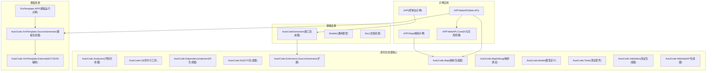
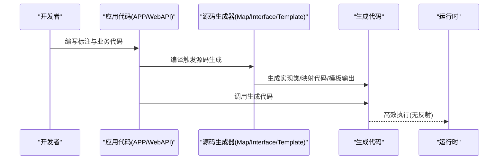
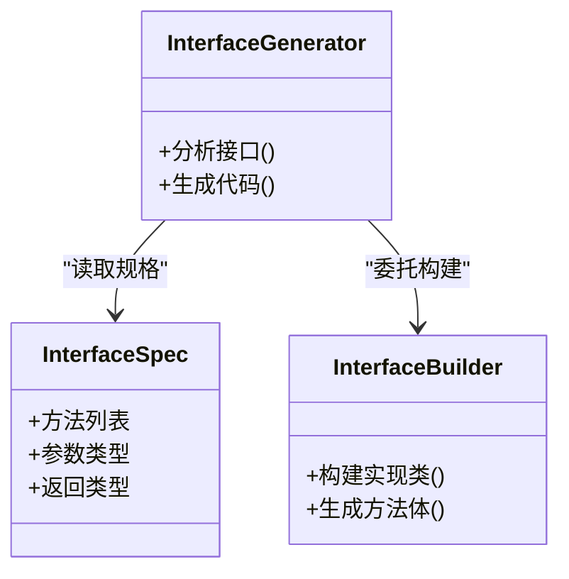
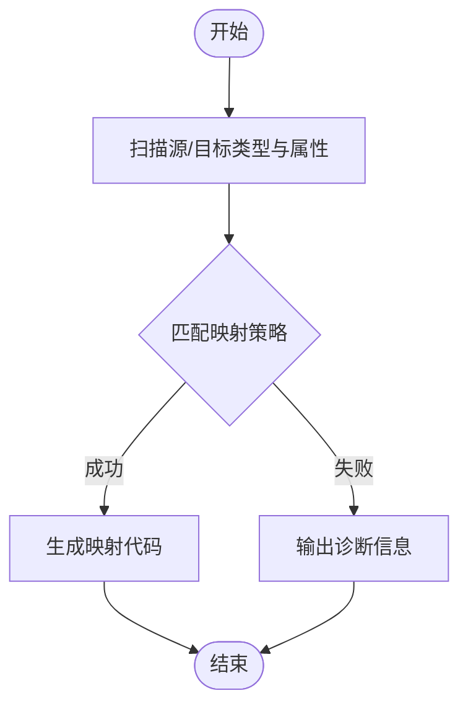
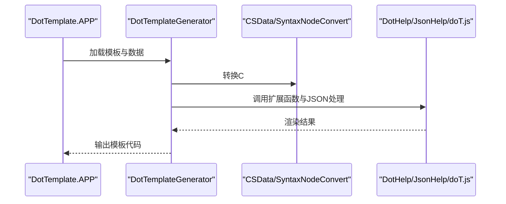
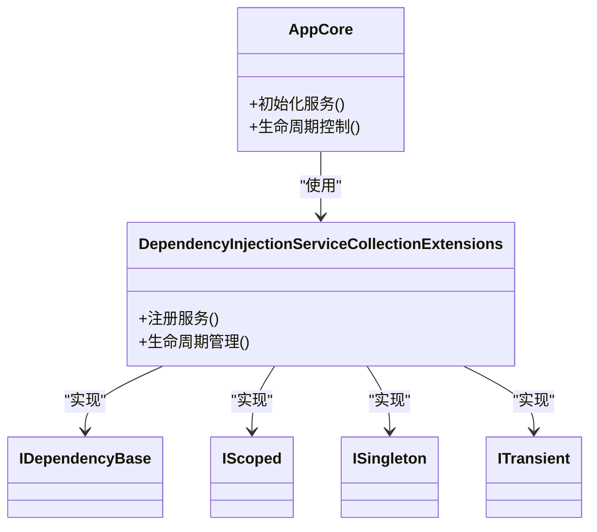
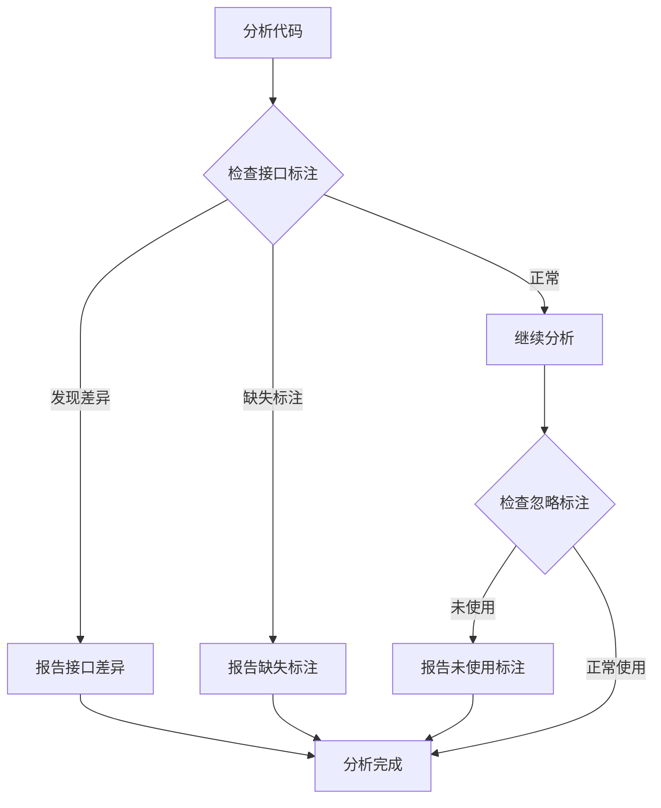
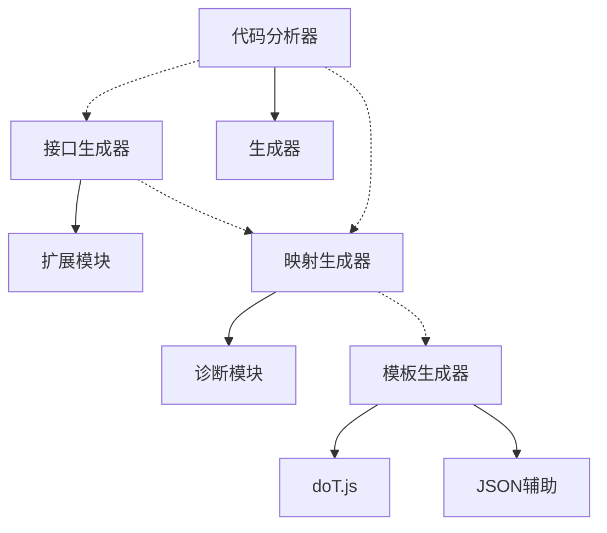

# 项目概述

<cite>
**本文引用的文件**   
- [README.md](file://README.md)
- [README.en.md](file://README.en.md)
- [AutoCode.sln](file://src/AutoCode.sln)
- [Program.cs](file://src/APP/Program.cs)
- [AutoInterface.cs](file://src/APP/AutoInterface.cs)
- [AutoInterClass.cs](file://src/APP/AutoInterClass.cs)
- [BookingController.cs](file://src/APP.WebAPI/Controllers/BookingController.cs)
- [BookingService.cs](file://src/APP.WebAPI/Services/BookingService.cs)
- [AppCore.cs](file://src/APP.WebAPI.Core/Application/AppCore.cs)
- [DependencyInjectionServiceCollectionExtensions.cs](file://src/APP.WebAPI.Core/DependencyInjection/DependencyInjectionServiceCollectionExtensions.cs)
- [IDependencyBase.cs](file://src/APP.WebAPI.Core/DependencyInjection/LifeType/IDependencyBase.cs)
- [IScoped.cs](file://src/APP.WebAPI.Core/DependencyInjection/LifeType/IScoped.cs)
- [ISingleton.cs](file://src/APP.WebAPI.Core/DependencyInjection/LifeType/ISingleton.cs)
- [ITransient.cs](file://src/APP.WebAPI.Core/DependencyInjection/LifeType/ITransient.cs)
- [MapperGenerator.cs](file://src/AutoCode.Map/MapperGenerator.cs)
- [DiagnosticsDescriptors.cs](file://src/AutoCode.Map/Diagnostics/DiagnosticsDescriptors.cs)
- [ImmutableEquatableArray.cs](file://src/AutoCode.Map/Helpers/ImmutableEquatableArray.cs)
- [IncrementalValuesProviderExtensions.cs](file://src/AutoCode.Map/Helpers/IncrementalValuesProviderExtensions.cs)
- [Behavior.cs](file://src/Auto.MapModels/Behavior.cs)
- [UserInfo.cs](file://src/APP.Map/UserInfo.cs)
- [DotTemplateGenerator.cs](file://src/AutoCode.XmlTemplate.SourceGenerator/DotTemplateGenerator.cs)
- [CSData.cs](file://src/AutoCode.XmlTemplate.SourceGenerator/CSData.cs)
- [SyntaxNodeConvert.cs](file://src/AutoCode.XmlTemplate.SourceGenerator/SyntaxNodeConvert.cs)
- [DotHelp.cs](file://src/AutoCode.XmlTemplate.External/DotHelp.cs)
- [JsonHelp.cs](file://src/AutoCode.XmlTemplate.External/JsonHelp.cs)
- [doT.js](file://src/AutoCode.XmlTemplate.External/doT.js)
- [AutoTemplate.cs](file://src/DotTemplate.APP/AutoTemplate.cs)
- [DotTemplate.cs](file://src/DotTemplate.APP/DotTemplate.cs)
- [IAutoTemplate.cs](file://src/DotTemplate.APP/IAutoTemplate.cs)
- [InterfaceBuilder.cs](file://src/AutoCodeGenerator/InterfaceAutoBuilder/InterfaceBuilder.cs)
- [InterfaceGenerator.cs](file://src/AutoCodeGenerator/InterfaceAutoBuilder/InterfaceGenerator.cs)
- [InterfaceSpec.cs](file://src/AutoCodeGenerator/InterfaceAutoBuilder/InterfaceSpec.cs)
- [AutoCode.SourceGenerator.Extensions.cs](file://src/AutoCode.Extensions.SourceGenerator/AutoCode.SourceGenerator.Extensions.cs)
</cite>

## 更新摘要
**所做更改**   
- 更新了项目结构树以反映当前22个项目架构
- 添加了从1.0.x到1.2.0的版本历史
- 增强了依赖关系分析以匹配新的项目组织
- 更新了架构图表以显示完整的解决方案结构

## 目录
1. [简介](#简介)
2. [版本历史](#版本历史)
3. [项目结构](#项目结构)
4. [核心组件](#核心组件)
5. [架构总览](#架构总览)
6. [详细组件分析](#详细组件分析)
7. [依赖关系分析](#依赖关系分析)
8. [性能考量](#性能考量)
9. [故障排查指南](#故障排查指南)
10. [结论](#结论)
11. [附录：典型使用场景与示例路径](#附录典型使用场景与示例路径)

## 简介
AutoCode 是一个面向 .NET 的源代码生成器框架，旨在通过"声明式标注 + 源码生成"的方式，显著减少重复代码。其核心价值在于：
- 源代码自动生成：基于接口标注自动实现类、服务层等样板代码。
- 接口自动实现：从接口定义快速生成具体实现，降低手工编码成本。
- 对象映射工具：提供属性级映射配置与生成，简化 DTO/Model 转换。
- 模板引擎支持：内置 doT 模板能力，支持自定义代码模板与扩展。

在 .NET 生态中，AutoCode 以 Source Generator 为核心技术，编译期完成代码生成，零运行时反射开销，提升启动性能与可维护性。它适用于 Web API、微服务、领域模型与数据访问等多层架构，帮助团队统一规范、提高一致性并缩短交付周期。

## 版本历史
### 版本演进路线
- **1.0.x 系列**：初始版本，包含基础接口生成和简单的映射功能
- **1.1.x 系列**：引入模板引擎支持和依赖注入框架
- **1.2.0**：当前版本，完整的项目架构重构，支持22个独立项目的模块化设计

### 主要特性演进
- **1.0.x**：基础 Source Generator 实现，接口自动生成功能
- **1.1.x**：添加 doT 模板引擎，支持自定义代码模板
- **1.2.0**：完整的模块化架构，独立的映射生成器、模板生成器、依赖注入框架

## 项目结构
仓库采用多项目解决方案组织，按职责划分清晰，当前包含22个独立项目：
- APP：演示应用入口与基础标注使用示例
- APP.Map：映射示例应用
- APP.WebAPI：Web API 示例，展示控制器与服务层的集成
- APP.WebAPI.Core：依赖注入与生命周期抽象，支撑可扩展的服务注册
- AutoCode.Analyzers：代码分析器，提供编译时检查
- AutoCode.Cli：命令行工具
- AutoCode.DependencyInjection：依赖注入生成器
- AutoCode.Dto：DTO 生成器
- AutoCode.Extensions.SourceGenerator：Source Generator 扩展
- AutoCode.Map：映射生成器（Source Generator），负责属性映射代码生成与诊断
- AutoCode.MapDebug：映射调试工具
- AutoCode.Model：通用模型定义
- AutoCode.Tests：单元测试套件
- AutoCode.Validation：验证生成器
- AutoCode.WebApi：Web API 生成器
- AutoCode.XmlTemplate.External：外部模板库与 JSON/JS 辅助
- AutoCode.XmlTemplate.SourceGenerator：基于 doT 的模板生成器
- AutoCodeGenerator：接口自动生成的构建器与规格定义
- DotTemplate.APP：模板运行与调用示例
- Models：通用模型示例
- Doc：文档与数据库设计相关资源

图表来源 
- [AutoCode.sln](file://src/AutoCode.sln)
- [Program.cs](file://src/APP/Program.cs)
- [BookingController.cs](file://src/APP.WebAPI/Controllers/BookingController.cs)
- [BookingService.cs](file://src/APP.WebAPI/Services/BookingService.cs)
- [AppCore.cs](file://src/APP.WebAPI.Core/Application/AppCore.cs)
- [MapperGenerator.cs](file://src/AutoCode.Map/MapperGenerator.cs)
- [DotTemplateGenerator.cs](file://src/AutoCode.XmlTemplate.SourceGenerator/DotTemplateGenerator.cs)
- [InterfaceGenerator.cs](file://src/AutoCodeGenerator/InterfaceAutoBuilder/InterfaceGenerator.cs)

章节来源
- [AutoCode.sln](file://src/AutoCode.sln)
- [README.md](file://README.md)
- [README.en.md](file://README.en.md)

## 核心组件
- 接口自动实现（Interface Auto Builder）
  - 通过标注驱动，自动生成接口对应的实现类，包含方法体骨架与参数校验逻辑。
  - 关键文件：[InterfaceBuilder.cs](file://src/AutoCodeGenerator/InterfaceAutoBuilder/InterfaceBuilder.cs)、[InterfaceGenerator.cs](file://src/AutoCodeGenerator/InterfaceAutoBuilder/InterfaceGenerator.cs)、[InterfaceSpec.cs](file://src/AutoCodeGenerator/InterfaceAutoBuilder/InterfaceSpec.cs)
- 映射生成器（Map Generator）
  - 基于属性标注与策略配置，生成高效的属性映射代码，避免运行时反射。
  - 关键文件：[MapperGenerator.cs](file://src/AutoCode.Map/MapperGenerator.cs)、[DiagnosticsDescriptors.cs](file://src/AutoCode.Map/Diagnostics/DiagnosticsDescriptors.cs)
- 模板引擎（doT 模板）
  - 提供 doT 模板解析与渲染，支持 JSON 数据绑定与自定义扩展函数。
  - 关键文件：[DotTemplateGenerator.cs](file://src/AutoCode.XmlTemplate.SourceGenerator/DotTemplateGenerator.cs)、[DotHelp.cs](file://src/AutoCode.XmlTemplate.External/DotHelp.cs)、[JsonHelp.cs](file://src/AutoCode.XmlTemplate.External/JsonHelp.cs)、[doT.js](file://src/AutoCode.XmlTemplate.External/doT.js)
- 依赖注入与生命周期
  - 统一的 DI 抽象与生命周期标记，便于扩展与测试。
  - 关键文件：[AppCore.cs](file://src/APP.WebAPI.Core/Application/AppCore.cs)、[DependencyInjectionServiceCollectionExtensions.cs](file://src/APP.WebAPI.Core/DependencyInjection/DependencyInjectionServiceCollectionExtensions.cs)、[IDependencyBase.cs](file://src/APP.WebAPI.Core/DependencyInjection/LifeType/IDependencyBase.cs)、[IScoped.cs](file://src/APP.WebAPI.Core/DependencyInjection/LifeType/IScoped.cs)、[ISingleton.cs](file://src/APP.WebAPI.Core/DependencyInjection/LifeType/ISingleton.cs)、[ITransient.cs](file://src/APP.WebAPI.Core/DependencyInjection/LifeType/ITransient.cs)
- 代码分析器（Analyzers）
  - 提供编译时代码质量检查和诊断信息。
  - 关键文件：[InterfaceDivergenceAnalyzer.cs](file://src/AutoCode.Analyzers/Analyzers/InterfaceDivergenceAnalyzer.cs)、[MissingAutoInterfaceAnalyzer.cs](file://src/AutoCode.Analyzers/Analyzers/MissingAutoInterfaceAnalyzer.cs)、[UnusedAutoIgnoreAnalyzer.cs](file://src/AutoCode.Analyzers/Analyzers/UnusedAutoIgnoreAnalyzer.cs)

章节来源
- [InterfaceBuilder.cs](file://src/AutoCodeGenerator/InterfaceAutoBuilder/InterfaceBuilder.cs)
- [InterfaceGenerator.cs](file://src/AutoCodeGenerator/InterfaceAutoBuilder/InterfaceGenerator.cs)
- [InterfaceSpec.cs](file://src/AutoCodeGenerator/InterfaceAutoBuilder/InterfaceSpec.cs)
- [MapperGenerator.cs](file://src/AutoCode.Map/MapperGenerator.cs)
- [DiagnosticsDescriptors.cs](file://src/AutoCode.Map/Diagnostics/DiagnosticsDescriptors.cs)
- [DotTemplateGenerator.cs](file://src/AutoCode.XmlTemplate.SourceGenerator/DotTemplateGenerator.cs)
- [DotHelp.cs](file://src/AutoCode.XmlTemplate.External/DotHelp.cs)
- [JsonHelp.cs](file://src/AutoCode.XmlTemplate.External/JsonHelp.cs)
- [doT.js](file://src/AutoCode.XmlTemplate.External/doT.js)
- [AppCore.cs](file://src/APP.WebAPI.Core/Application/AppCore.cs)
- [DependencyInjectionServiceCollectionExtensions.cs](file://src/APP.WebAPI.Core/DependencyInjection/DependencyInjectionServiceCollectionExtensions.cs)
- [IDependencyBase.cs](file://src/APP.WebAPI.Core/DependencyInjection/LifeType/IDependencyBase.cs)
- [IScoped.cs](file://src/APP.WebAPI.Core/DependencyInjection/LifeType/IScoped.cs)
- [ISingleton.cs](file://src/APP.WebAPI.Core/DependencyInjection/LifeType/ISingleton.cs)
- [ITransient.cs](file://src/APP.WebAPI.Core/DependencyInjection/LifeType/ITransient.cs)

## 架构总览
AutoCode 的整体架构围绕"标注驱动 + 源码生成 + 模板渲染"展开：
- 开发者在业务代码中使用标注（如接口标注、映射标注、模板标注）。
- 编译期 Source Generator 扫描标注与语法树，生成目标代码（实现类、映射代码、模板输出）。
- 运行时无需反射，直接调用生成的高效代码；模板渲染在编译期或按需执行。

图表来源 
- [Program.cs](file://src/APP/Program.cs)
- [BookingController.cs](file://src/APP.WebAPI/Controllers/BookingController.cs)
- [BookingService.cs](file://src/APP.WebAPI/Services/BookingService.cs)
- [MapperGenerator.cs](file://src/AutoCode.Map/MapperGenerator.cs)
- [InterfaceGenerator.cs](file://src/AutoCodeGenerator/InterfaceAutoBuilder/InterfaceGenerator.cs)
- [DotTemplateGenerator.cs](file://src/AutoCode.XmlTemplate.SourceGenerator/DotTemplateGenerator.cs)

## 详细组件分析

### 接口自动实现组件
- 设计要点
  - InterfaceSpec 定义接口规格（方法签名、参数类型、返回类型）。
  - InterfaceBuilder 根据规格构建实现类结构与方法体。
  - InterfaceGenerator 作为入口，整合分析与生成流程。
- 优势
  - 统一接口契约，减少手写实现的错误率。
  - 支持扩展点，便于注入校验、日志、缓存等横切关注点。

图表来源 
- [InterfaceSpec.cs](file://src/AutoCodeGenerator/InterfaceAutoBuilder/InterfaceSpec.cs)
- [InterfaceBuilder.cs](file://src/AutoCodeGenerator/InterfaceAutoBuilder/InterfaceBuilder.cs)
- [InterfaceGenerator.cs](file://src/AutoCodeGenerator/InterfaceAutoBuilder/InterfaceGenerator.cs)

章节来源
- [InterfaceSpec.cs](file://src/AutoCodeGenerator/InterfaceAutoBuilder/InterfaceSpec.cs)
- [InterfaceBuilder.cs](file://src/AutoCodeGenerator/InterfaceAutoBuilder/InterfaceBuilder.cs)
- [InterfaceGenerator.cs](file://src/AutoCodeGenerator/InterfaceAutoBuilder/InterfaceGenerator.cs)

### 映射生成器组件
- 设计要点
  - MapperGenerator 扫描源与目标类型的属性，依据标注与策略生成映射代码。
  - DiagnosticsDescriptors 提供诊断信息，便于定位映射问题。
  - Helpers 提供增量值处理与不可变数组优化，提升生成性能。
- 优势
  - 编译期生成映射，避免运行时反射开销。
  - 支持复杂类型、枚举、忽略字段、命名策略等配置。

图表来源 
- [MapperGenerator.cs](file://src/AutoCode.Map/MapperGenerator.cs)
- [DiagnosticsDescriptors.cs](file://src/AutoCode.Map/Diagnostics/DiagnosticsDescriptors.cs)
- [ImmutableEquatableArray.cs](file://src/AutoCode.Map/Helpers/ImmutableEquatableArray.cs)
- [IncrementalValuesProviderExtensions.cs](file://src/AutoCode.Map/Helpers/IncrementalValuesProviderExtensions.cs)

章节来源
- [MapperGenerator.cs](file://src/AutoCode.Map/MapperGenerator.cs)
- [DiagnosticsDescriptors.cs](file://src/AutoCode.Map/Diagnostics/DiagnosticsDescriptors.cs)
- [ImmutableEquatableArray.cs](file://src/AutoCode.Map/Helpers/ImmutableEquatableArray.cs)
- [IncrementalValuesProviderExtensions.cs](file://src/AutoCode.Map/Helpers/IncrementalValuesProviderExtensions.cs)

### 模板引擎组件（doT）
- 设计要点
  - DotTemplateGenerator 解析 doT 模板，结合 CSData 与 SyntaxNodeConvert 将 C# 语法节点转换为模板数据。
  - External 库提供 doT.js、JSON 辅助与扩展函数（DotHelp）。
  - DotTemplate.APP 演示模板加载与渲染流程。
- 优势
  - 灵活的模板语言，支持条件、循环、函数调用。
  - 与 C# 语法树无缝对接，便于生成结构化代码。

图表来源 
- [DotTemplateGenerator.cs](file://src/AutoCode.XmlTemplate.SourceGenerator/DotTemplateGenerator.cs)
- [CSData.cs](file://src/AutoCode.XmlTemplate.SourceGenerator/CSData.cs)
- [SyntaxNodeConvert.cs](file://src/AutoCode.XmlTemplate.SourceGenerator/SyntaxNodeConvert.cs)
- [DotHelp.cs](file://src/AutoCode.XmlTemplate.External/DotHelp.cs)
- [JsonHelp.cs](file://src/AutoCode.XmlTemplate.External/JsonHelp.cs)
- [doT.js](file://src/AutoCode.XmlTemplate.External/doT.js)
- [AutoTemplate.cs](file://src/DotTemplate.APP/AutoTemplate.cs)
- [DotTemplate.cs](file://src/DotTemplate.APP/DotTemplate.cs)
- [IAutoTemplate.cs](file://src/DotTemplate.APP/IAutoTemplate.cs)

章节来源
- [DotTemplateGenerator.cs](file://src/AutoCode.XmlTemplate.SourceGenerator/DotTemplateGenerator.cs)
- [CSData.cs](file://src/AutoCode.XmlTemplate.SourceGenerator/CSData.cs)
- [SyntaxNodeConvert.cs](file://src/AutoCode.XmlTemplate.SourceGenerator/SyntaxNodeConvert.cs)
- [DotHelp.cs](file://src/AutoCode.XmlTemplate.External/DotHelp.cs)
- [JsonHelp.cs](file://src/AutoCode.XmlTemplate.External/JsonHelp.cs)
- [doT.js](file://src/AutoCode.XmlTemplate.External/doT.js)
- [AutoTemplate.cs](file://src/DotTemplate.APP/AutoTemplate.cs)
- [DotTemplate.cs](file://src/DotTemplate.APP/DotTemplate.cs)
- [IAutoTemplate.cs](file://src/DotTemplate.APP/IAutoTemplate.cs)

### 依赖注入与生命周期
- 设计要点
  - IDependencyBase、IScoped、ISingleton、ITransient 定义生命周期接口。
  - DependencyInjectionServiceCollectionExtensions 提供扩展方法，统一注册服务。
  - AppCore 作为应用核心，协调服务生命周期与初始化。
- 优势
  - 清晰的职责分离，便于单元测试与替换实现。
  - 支持多种生命周期，满足不同场景需求。

图表来源 
- [IDependencyBase.cs](file://src/APP.WebAPI.Core/DependencyInjection/LifeType/IDependencyBase.cs)
- [IScoped.cs](file://src/APP.WebAPI.Core/DependencyInjection/LifeType/IScoped.cs)
- [ISingleton.cs](file://src/APP.WebAPI.Core/DependencyInjection/LifeType/ISingleton.cs)
- [ITransient.cs](file://src/APP.WebAPI.Core/DependencyInjection/LifeType/ITransient.cs)
- [DependencyInjectionServiceCollectionExtensions.cs](file://src/APP.WebAPI.Core/DependencyInjection/DependencyInjectionServiceCollectionExtensions.cs)
- [AppCore.cs](file://src/APP.WebAPI.Core/Application/AppCore.cs)

章节来源
- [IDependencyBase.cs](file://src/APP.WebAPI.Core/DependencyInjection/LifeType/IDependencyBase.cs)
- [IScoped.cs](file://src/APP.WebAPI.Core/DependencyInjection/LifeType/IScoped.cs)
- [ISingleton.cs](file://src/APP.WebAPI.Core/DependencyInjection/LifeType/ISingleton.cs)
- [ITransient.cs](file://src/APP.WebAPI.Core/DependencyInjection/LifeType/ITransient.cs)
- [DependencyInjectionServiceCollectionExtensions.cs](file://src/APP.WebAPI.Core/DependencyInjection/DependencyInjectionServiceCollectionExtensions.cs)
- [AppCore.cs](file://src/APP.WebAPI.Core/Application/AppCore.cs)

### 代码分析器组件
- 设计要点
  - InterfaceDivergenceAnalyzer 检测接口与实现之间的差异。
  - MissingAutoInterfaceAnalyzer 检查缺失的自动接口标注。
  - UnusedAutoIgnoreAnalyzer 识别未使用的忽略标注。
- 优势
  - 编译时发现问题，避免运行时错误。
  - 提供详细的诊断信息和修复建议。

图表来源 
- [InterfaceDivergenceAnalyzer.cs](file://src/AutoCode.Analyzers/Analyzers/InterfaceDivergenceAnalyzer.cs)
- [MissingAutoInterfaceAnalyzer.cs](file://src/AutoCode.Analyzers/Analyzers/MissingAutoInterfaceAnalyzer.cs)
- [UnusedAutoIgnoreAnalyzer.cs](file://src/AutoCode.Analyzers/Analyzers/UnusedAutoIgnoreAnalyzer.cs)

章节来源
- [InterfaceDivergenceAnalyzer.cs](file://src/AutoCode.Analyzers/Analyzers/InterfaceDivergenceAnalyzer.cs)
- [MissingAutoInterfaceAnalyzer.cs](file://src/AutoCode.Analyzers/Analyzers/MissingAutoInterfaceAnalyzer.cs)
- [UnusedAutoIgnoreAnalyzer.cs](file://src/AutoCode.Analyzers/Analyzers/UnusedAutoIgnoreAnalyzer.cs)

## 依赖关系分析
- 组件耦合
  - 接口生成器与扩展模块解耦，通过扩展点注入行为。
  - 映射生成器与诊断模块独立，便于错误定位与修复。
  - 模板引擎与外部库通过接口隔离，支持替换与扩展。
  - 代码分析器与生成器分离，提供独立的编译时检查。
- 外部依赖
  - doT.js 用于模板渲染。
  - JSON 辅助库用于数据结构处理。
- 潜在循环依赖
  - 各生成器之间无直接循环依赖，通过中间数据（CSData、InterfaceSpec）传递。

图表来源 
- [InterfaceGenerator.cs](file://src/AutoCodeGenerator/InterfaceAutoBuilder/InterfaceGenerator.cs)
- [AutoCode.SourceGenerator.Extensions.cs](file://src/AutoCode.Extensions.SourceGenerator/AutoCode.SourceGenerator.Extensions.cs)
- [MapperGenerator.cs](file://src/AutoCode.Map/MapperGenerator.cs)
- [DiagnosticsDescriptors.cs](file://src/AutoCode.Map/Diagnostics/DiagnosticsDescriptors.cs)
- [DotTemplateGenerator.cs](file://src/AutoCode.XmlTemplate.SourceGenerator/DotTemplateGenerator.cs)
- [doT.js](file://src/AutoCode.XmlTemplate.External/doT.js)
- [JsonHelp.cs](file://src/AutoCode.XmlTemplate.External/JsonHelp.cs)
- [InterfaceDivergenceAnalyzer.cs](file://src/AutoCode.Analyzers/Analyzers/InterfaceDivergenceAnalyzer.cs)

章节来源
- [InterfaceGenerator.cs](file://src/AutoCodeGenerator/InterfaceAutoBuilder/InterfaceGenerator.cs)
- [AutoCode.SourceGenerator.Extensions.cs](file://src/AutoCode.Extensions.SourceGenerator/AutoCode.SourceGenerator.Extensions.cs)
- [MapperGenerator.cs](file://src/AutoCode.Map/MapperGenerator.cs)
- [DiagnosticsDescriptors.cs](file://src/AutoCode.Map/Diagnostics/DiagnosticsDescriptors.cs)
- [DotTemplateGenerator.cs](file://src/AutoCode.XmlTemplate.SourceGenerator/DotTemplateGenerator.cs)
- [doT.js](file://src/AutoCode.XmlTemplate.External/doT.js)
- [JsonHelp.cs](file://src/AutoCode.XmlTemplate.External/JsonHelp.cs)
- [InterfaceDivergenceAnalyzer.cs](file://src/AutoCode.Analyzers/Analyzers/InterfaceDivergenceAnalyzer.cs)

## 性能考量
- 编译时代码生成：避免运行时反射，显著提升启动与执行性能。
- 增量生成：利用 IncrementalValuesProvider 优化生成过程，减少重复计算。
- 不可变数据结构：ImmutableEquatableArray 提升比较与缓存效率。
- 模板预编译：doT 模板在编译期解析，减少运行时开销。
- 模块化架构：22个独立项目支持并行编译和增量构建。

## 故障排查指南
- 映射问题
  - 检查属性命名策略与标注配置，参考诊断信息定位问题。
  - 关键文件：[DiagnosticsDescriptors.cs](file://src/AutoCode.Map/Diagnostics/DiagnosticsDescriptors.cs)
- 模板渲染异常
  - 验证模板语法与数据绑定是否正确，检查扩展函数是否可用。
  - 关键文件：[DotTemplateGenerator.cs](file://src/AutoCode.XmlTemplate.SourceGenerator/DotTemplateGenerator.cs)、[DotHelp.cs](file://src/AutoCode.XmlTemplate.External/DotHelp.cs)
- 接口生成失败
  - 确认接口标注与规格定义是否符合要求，查看生成器日志。
  - 关键文件：[InterfaceGenerator.cs](file://src/AutoCodeGenerator/InterfaceAutoBuilder/InterfaceGenerator.cs)
- 代码分析警告
  - 检查接口差异、缺失标注和未使用的忽略标注。
  - 关键文件：[InterfaceDivergenceAnalyzer.cs](file://src/AutoCode.Analyzers/Analyzers/InterfaceDivergenceAnalyzer.cs)、[MissingAutoInterfaceAnalyzer.cs](file://src/AutoCode.Analyzers/Analyzers/MissingAutoInterfaceAnalyzer.cs)、[UnusedAutoIgnoreAnalyzer.cs](file://src/AutoCode.Analyzers/Analyzers/UnusedAutoIgnoreAnalyzer.cs)

章节来源
- [DiagnosticsDescriptors.cs](file://src/AutoCode.Map/Diagnostics/DiagnosticsDescriptors.cs)
- [DotTemplateGenerator.cs](file://src/AutoCode.XmlTemplate.SourceGenerator/DotTemplateGenerator.cs)
- [DotHelp.cs](file://src/AutoCode.XmlTemplate.External/DotHelp.cs)
- [InterfaceGenerator.cs](file://src/AutoCodeGenerator/InterfaceAutoBuilder/InterfaceGenerator.cs)
- [InterfaceDivergenceAnalyzer.cs](file://src/AutoCode.Analyzers/Analyzers/InterfaceDivergenceAnalyzer.cs)
- [MissingAutoInterfaceAnalyzer.cs](file://src/AutoCode.Analyzers/Analyzers/MissingAutoInterfaceAnalyzer.cs)
- [UnusedAutoIgnoreAnalyzer.cs](file://src/AutoCode.Analyzers/Analyzers/UnusedAutoIgnoreAnalyzer.cs)

## 结论
AutoCode 通过源码生成与模板引擎的结合，为 .NET 开发者提供了高效、可维护的代码生成方案。其核心价值在于减少重复劳动、统一规范、提升性能与可测试性。无论是初学者还是经验丰富的开发者，都能从中受益：初学者可快速上手常见用例，资深开发者可深入扩展与定制。

从1.0.x到1.2.0的演进过程中，AutoCode已经发展成为一个完整的22项目模块化架构，提供了更加强大和灵活的功能集合。

## 附录：典型使用场景与示例路径
- 接口自动实现
  - 示例入口：[Program.cs](file://src/APP/Program.cs)
  - 标注使用：[AutoInterface.cs](file://src/APP/AutoInterface.cs)、[AutoInterClass.cs](file://src/APP/AutoInterClass.cs)
- Web API 集成
  - 控制器示例：[BookingController.cs](file://src/APP.WebAPI/Controllers/BookingController.cs)
  - 服务层示例：[BookingService.cs](file://src/APP.WebAPI/Services/BookingService.cs)
- 对象映射
  - 模型示例：[Behavior.cs](file://src/Auto.MapModels/Behavior.cs)
  - 用户信息映射：[UserInfo.cs](file://src/APP.Map/UserInfo.cs)
- 模板渲染
  - 模板运行示例：[AutoTemplate.cs](file://src/DotTemplate.APP/AutoTemplate.cs)、[DotTemplate.cs](file://src/DotTemplate.APP/DotTemplate.cs)
  - 模板接口：[IAutoTemplate.cs](file://src/DotTemplate.APP/IAutoTemplate.cs)

章节来源
- [Program.cs](file://src/APP/Program.cs)
- [AutoInterface.cs](file://src/APP/AutoInterface.cs)
- [AutoInterClass.cs](file://src/APP/AutoInterClass.cs)
- [BookingController.cs](file://src/APP.WebAPI/Controllers/BookingController.cs)
- [BookingService.cs](file://src/APP.WebAPI/Services/BookingService.cs)
- [Behavior.cs](file://src/Auto.MapModels/Behavior.cs)
- [UserInfo.cs](file://src/APP.Map/UserInfo.cs)
- [AutoTemplate.cs](file://src/DotTemplate.APP/AutoTemplate.cs)
- [DotTemplate.cs](file://src/DotTemplate.APP/DotTemplate.cs)
- [IAutoTemplate.cs](file://src/DotTemplate.APP/IAutoTemplate.cs)