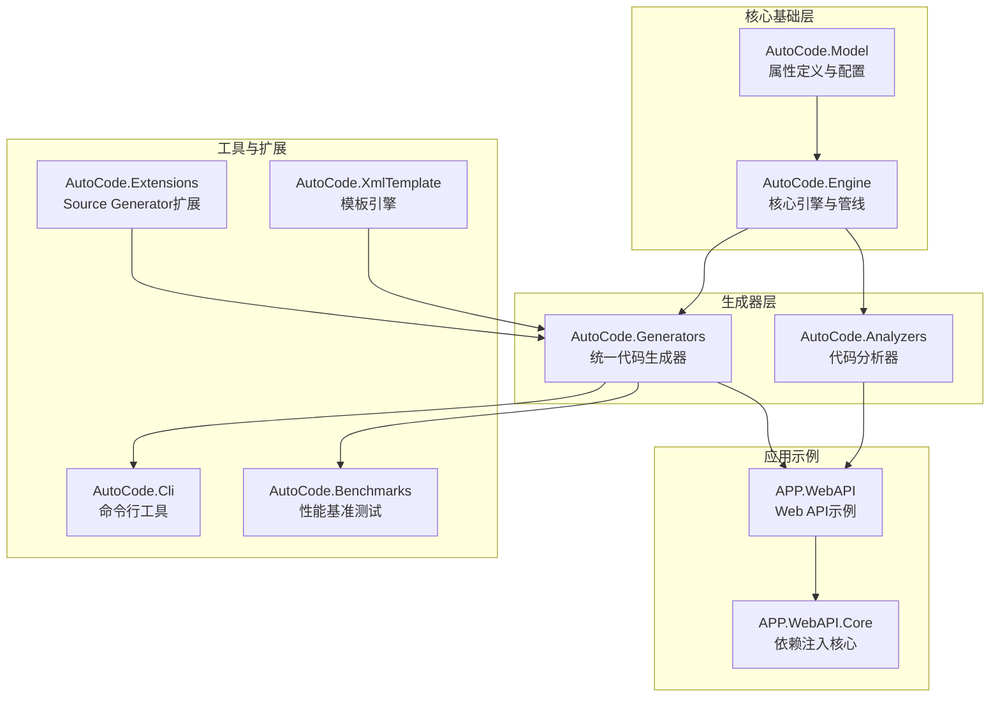
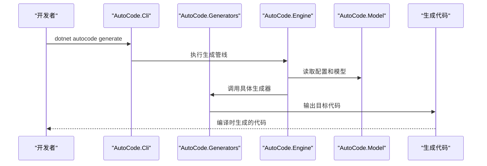
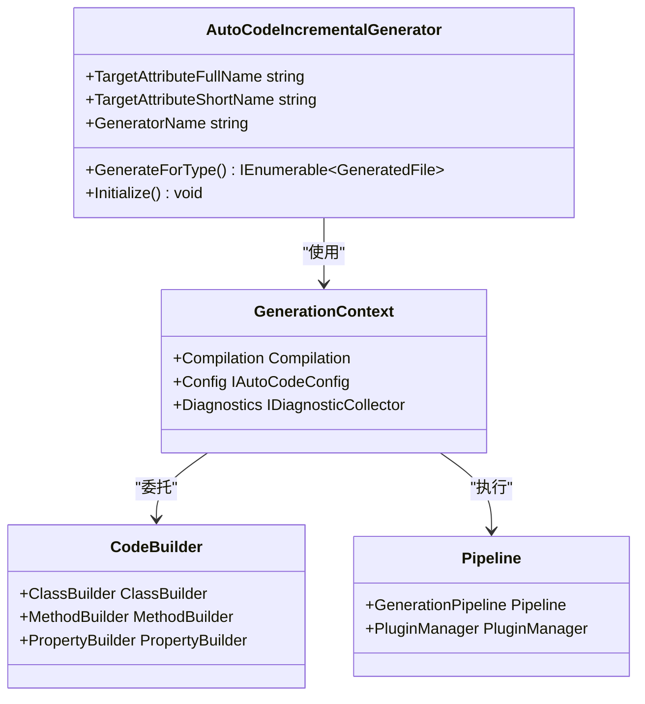
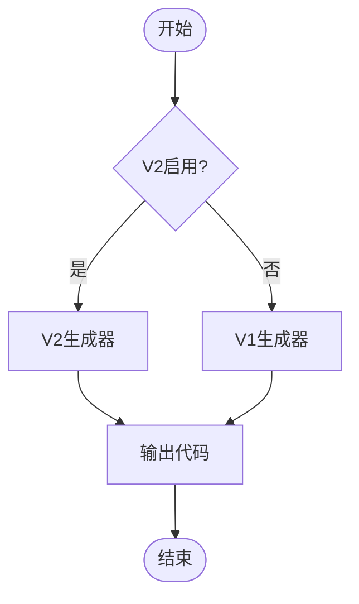
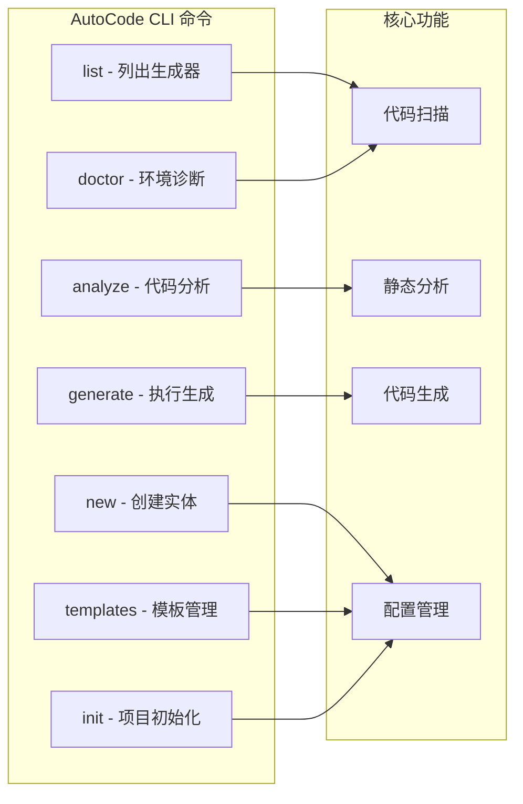
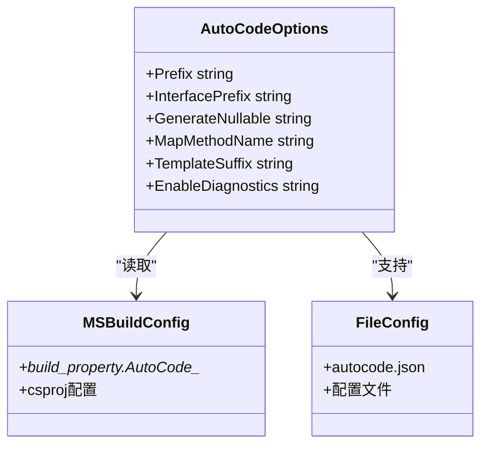
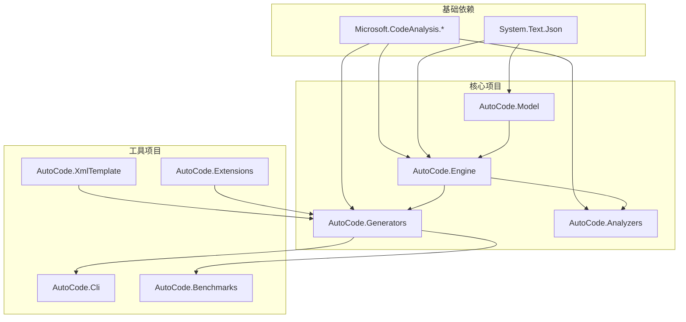

# 项目概述

<cite>
**本文引用的文件**
- [AutoCode.sln](file://src/AutoCode.sln)
- [AutoCode.Model.csproj](file://src/AutoCode.Model/AutoCode.Model.csproj)
- [AutoCode.Engine.csproj](file://src/AutoCode.Engine/AutoCode.Engine.csproj)
- [AutoCode.Generators.csproj](file://src/AutoCode.Generators/AutoCode.Generators.csproj)
- [AutoCode.Analyzers.csproj](file://src/AutoCode.Analyzers/AutoCode.Analyzers.csproj)
- [AutoCode.Cli.csproj](file://src/AutoCode.Cli/AutoCode.Cli.csproj)
- [AutoCode.Benchmarks.csproj](file://src/AutoCode.Benchmarks/AutoCode.Benchmarks.csproj)
- [AutoCode.SourceGenerator.Extensions.csproj](file://src/AutoCode.Extensions.SourceGenerator/AutoCode.SourceGenerator.Extensions.csproj)
- [AutoCode.DotTemplate.SourceGenerator.csproj](file://src/AutoCode.XmlTemplate.SourceGenerator/AutoCode.DotTemplate.SourceGenerator.csproj)
- [AutoCodeOptions.cs](file://src/AutoCode.Model/AutoCodeOptions.cs)
- [Program.cs](file://src/AutoCode.Cli/Program.cs)
- [AutoCodeIncrementalGenerator.cs](file://src/AutoCode.Engine/Roslyn/AutoCodeIncrementalGenerator.cs)
- [V2Gate.cs](file://src/AutoCode.Generators/V2/V2Gate.cs)
</cite>

## 更新摘要
**变更内容**
- 基于重构后的11个核心项目重新组织架构说明（Model、Engine、Generators、Analyzers、Cli、Benchmarks、Extensions、XmlTemplate等）
- 更新项目结构图，反映新的模块化设计
- 增强CLI工具和功能特性描述
- 完善增量生成器和配置系统说明
- 更新依赖关系和性能优化相关内容

## 目录
1. [简介](#简介)
2. [项目结构](#项目结构)
3. [核心组件](#核心组件)
4. [架构总览](#架构总览)
5. [详细组件分析](#详细组件分析)
6. [依赖关系分析](#依赖关系分析)
7. [性能考量](#性能考量)
8. [故障排查指南](#故障排查指南)
9. [结论](#结论)
10. [附录：典型使用场景与示例路径](#附录典型使用场景与示例路径)

## 简介
AutoCode 是一个面向 .NET 的源代码生成器框架，旨在通过"声明式标注 + 源码生成"的方式，显著减少重复代码。经过完整的项目重构，现在采用11个核心项目的模块化架构，提供更清晰的分层设计和更强的扩展能力。其核心价值在于：
- **源代码自动生成**：基于接口标注自动实现类、服务层等样板代码
- **接口自动实现**：从接口定义快速生成具体实现，降低手工编码成本
- **对象映射工具**：提供属性级映射配置与生成，简化 DTO/Model 转换
- **模板引擎支持**：内置 doT 模板能力，支持自定义代码模板与扩展
- **智能分析器**：编译时代码分析和诊断，提升代码质量
- **命令行工具**：提供完整的开发体验管理工具

在 .NET 生态中，AutoCode 以 Source Generator 为核心技术，编译期完成代码生成，零运行时反射开销，提升启动性能与可维护性。它适用于 Web API、微服务、领域模型与数据访问等多层架构，帮助团队统一规范、提高一致性并缩短交付周期。

## 项目结构
仓库采用全新的11个核心项目模块化架构，按职责清晰划分：

**图表来源**
- [AutoCode.sln:6-32](file://src/AutoCode.sln#L6-L32)
- [AutoCode.Model.csproj:1-19](file://src/AutoCode.Model/AutoCode.Model.csproj#L1-L19)
- [AutoCode.Engine.csproj:1-18](file://src/AutoCode.Engine/AutoCode.Engine.csproj#L1-L18)
- [AutoCode.Generators.csproj:1-38](file://src/AutoCode.Generators/AutoCode.Generators.csproj#L1-L38)

### 核心项目职责
- **AutoCode.Model**：定义所有特性、配置选项和共享模型
- **AutoCode.Engine**：提供Fluent代码构建器、生成管线、插件系统和约定推断
- **AutoCode.Generators**：包含全部11个IIncrementalGenerator的统一生成器
- **AutoCode.Analyzers**：编译时代码分析和诊断工具
- **AutoCode.Cli**：智能代码生成器管理命令行工具
- **AutoCode.Benchmarks**：性能基准测试套件
- **AutoCode.Extensions**：Source Generator扩展功能
- **AutoCode.XmlTemplate**：基于doT的模板引擎

**章节来源**
- [AutoCode.sln:6-32](file://src/AutoCode.sln#L6-L32)
- [AutoCode.Model.csproj:1-19](file://src/AutoCode.Model/AutoCode.Model.csproj#L1-L19)
- [AutoCode.Engine.csproj:1-18](file://src/AutoCode.Engine/AutoCode.Engine.csproj#L1-L18)
- [AutoCode.Generators.csproj:1-38](file://src/AutoCode.Generators/AutoCode.Generators.csproj#L1-L38)

## 核心组件
重构后的核心组件体系更加清晰和模块化：

### 核心引擎（AutoCode.Engine）
- **增量生成器基类**：提供统一的IIncrementalGenerator实现
- **代码构建器**：Fluent风格的代码生成API
- **生成管线**：插件化的代码处理流程
- **配置系统**：三层配置管理和MSBuild集成
- **约定推断**：智能的代码模式识别

### 统一生成器（AutoCode.Generators）
- **V1/V2双版本支持**：向后兼容的同时提供新功能
- **11个核心生成器**：接口、映射、DTO、验证、Controller、DI、日志、测试、CRUD、级联、拦截
- **增量优化**：利用Roslyn增量编译提升性能
- **错误诊断**：详细的编译时错误提示

### 命令行工具（AutoCode.Cli）
- **项目管理**：list、new、generate命令
- **代码分析**：analyze、doctor诊断工具
- **模板管理**：templates安装和管理
- **初始化向导**：init项目配置

**章节来源**
- [AutoCodeIncrementalGenerator.cs:19-237](file://src/AutoCode.Engine/Roslyn/AutoCodeIncrementalGenerator.cs#L19-L237)
- [AutoCode.Generators.csproj:9-35](file://src/AutoCode.Generators/AutoCode.Generators.csproj#L9-L35)
- [Program.cs:6-481](file://src/AutoCode.Cli/Program.cs#L6-L481)

## 架构总览
重构后的架构围绕"模块化 + 增量生成 + 插件化"展开：

**图表来源**
- [AutoCodeIncrementalGenerator.cs:63-89](file://src/AutoCode.Engine/Roslyn/AutoCodeIncrementalGenerator.cs#L63-L89)
- [Program.cs:146-224](file://src/AutoCode.Cli/Program.cs#L146-L224)
- [AutoCode.Generators.csproj:32-35](file://src/AutoCode.Generators/AutoCode.Generators.csproj#L32-L35)

## 详细组件分析

### 核心引擎架构
重构后的引擎提供了强大的基础设施：

**图表来源**
- [AutoCodeIncrementalGenerator.cs:27-50](file://src/AutoCode.Engine/Roslyn/AutoCodeIncrementalGenerator.cs#L27-L50)
- [AutoCode.Engine.csproj:8-10](file://src/AutoCode.Engine/AutoCode.Engine.csproj#L8-L10)

**章节来源**
- [AutoCodeIncrementalGenerator.cs:19-237](file://src/AutoCode.Engine/Roslyn/AutoCodeIncrementalGenerator.cs#L19-L237)
- [AutoCode.Engine.csproj:1-18](file://src/AutoCode.Engine/AutoCode.Engine.csproj#L1-L18)

### 统一生成器系统
AutoCode.Generators提供了统一的代码生成入口：

**图表来源**
- [V2Gate.cs:14-57](file://src/AutoCode.Generators/V2/V2Gate.cs#L14-L57)
- [AutoCode.Generators.csproj:9-35](file://src/AutoCode.Generators/AutoCode.Generators.csproj#L9-L35)

**章节来源**
- [V2Gate.cs:1-59](file://src/AutoCode.Generators/V2/V2Gate.cs#L1-L59)
- [AutoCode.Generators.csproj:1-38](file://src/AutoCode.Generators/AutoCode.Generators.csproj#L1-L38)

### 命令行工具功能
AutoCode.Cli提供了完整的开发体验：

**图表来源**
- [Program.cs:27-85](file://src/AutoCode.Cli/Program.cs#L27-L85)
- [AutoCode.Cli.csproj:1-26](file://src/AutoCode.Cli/AutoCode.Cli.csproj#L1-L26)

**章节来源**
- [Program.cs:1-481](file://src/AutoCode.Cli/Program.cs#L1-L481)
- [AutoCode.Cli.csproj:1-26](file://src/AutoCode.Cli/AutoCode.Cli.csproj#L1-L26)

### 配置系统
AutoCode提供了灵活的配置机制：

**图表来源**
- [AutoCodeOptions.cs:16-47](file://src/AutoCode.Model/AutoCodeOptions.cs#L16-L47)
- [AutoCodeIncrementalGenerator.cs:194-209](file://src/AutoCode.Engine/Roslyn/AutoCodeIncrementalGenerator.cs#L194-L209)

**章节来源**
- [AutoCodeOptions.cs:1-49](file://src/AutoCode.Model/AutoCodeOptions.cs#L1-L49)
- [AutoCodeIncrementalGenerator.cs:192-209](file://src/AutoCode.Engine/Roslyn/AutoCodeIncrementalGenerator.cs#L192-L209)

## 依赖关系分析
重构后的依赖关系更加清晰和模块化：

**图表来源**
- [AutoCode.Engine.csproj:12-15](file://src/AutoCode.Engine/AutoCode.Engine.csproj#L12-L15)
- [AutoCode.Generators.csproj:23-35](file://src/AutoCode.Generators/AutoCode.Generators.csproj#L23-L35)
- [AutoCode.Analyzers.csproj:21-31](file://src/AutoCode.Analyzers/AutoCode.Analyzers.csproj#L21-L31)

**章节来源**
- [AutoCode.Engine.csproj:1-18](file://src/AutoCode.Engine/AutoCode.Engine.csproj#L1-L18)
- [AutoCode.Generators.csproj:1-38](file://src/AutoCode.Generators/AutoCode.Generators.csproj#L1-L38)
- [AutoCode.Analyzers.csproj:1-34](file://src/AutoCode.Analyzers/AutoCode.Analyzers.csproj#L1-L34)

## 性能考量
重构后的性能优化包括：

- **增量编译**：利用Roslyn IIncrementalGenerator实现增量生成
- **模块化设计**：按需加载组件，减少内存占用
- **配置缓存**：MSBuild配置的高效读取和缓存
- **并行处理**：多生成器并行执行
- **内存优化**：不可变数据结构和流式处理

## 故障排查指南
重构后的问题排查更加系统化：

- **生成器冲突**：检查V1/V2版本配置，避免重复生成
- **配置问题**：使用`dotnet autocode doctor`诊断环境
- **分析器错误**：查看AC开头的诊断代码
- **性能问题**：使用Benchmarks进行性能对比
- **CLI工具**：使用`dotnet autocode analyze`获取优化建议

**章节来源**
- [Program.cs:226-295](file://src/AutoCode.Cli/Program.cs#L226-L295)
- [AutoCode.Analyzers.csproj:21-31](file://src/AutoCode.Analyzers/AutoCode.Analyzers.csproj#L21-L31)

## 结论
经过完整重构的AutoCode现在提供了更加强大和模块化的代码生成解决方案。11个核心项目的清晰分工使得每个组件都有明确的职责，同时保持了良好的扩展性和可维护性。无论是初学者还是经验丰富的开发者，都能从中受益：初学者可以通过CLI工具和模板快速上手，资深开发者可以深入定制和扩展各个组件。

## 附录：典型使用场景与示例路径
- **命令行工具使用**
  - 项目初始化：`dotnet autocode init`
  - 代码生成：`dotnet autocode generate --preview`
  - 环境诊断：`dotnet autocode doctor`
  
- **配置管理**
  - MSBuild配置：在.csproj中使用AutoCode_前缀的属性
  - JSON配置：使用autocode.json进行高级配置
  
- **生成器选择**
  - V1兼容模式：默认行为
  - V2新模式：设置`<AutoCode_EnableV2>true</AutoCode_EnableV2>`

**章节来源**
- [Program.cs:87-142](file://src/AutoCode.Cli/Program.cs#L87-L142)
- [AutoCodeOptions.cs:3-47](file://src/AutoCode.Model/AutoCodeOptions.cs#L3-L47)
- [V2Gate.cs:7-13](file://src/AutoCode.Generators/V2/V2Gate.cs#L7-L13)